# 分布式锁

## 1.背景

为了保证一个方法在高并发场景下，同一时刻只能同时被一个线程执行。我们在开发单机应用的时候，使用我们学到的Java多线程的18般武艺（例如：synchronized或ReentrantLock）进行互斥控制，往往就可以很好的解决，毫无Bug！但是随着业务的发展，原单体系统的单机部署逐步演化成为分布式系统，由于多线程多进程分布在不同机器上，单机上的并发控制策略失效，为了解决这一问题即跨JVM的互斥机制控制共享资源的访问。分布式锁应运而生。

## 2.分布式锁特性

1.  互斥性。在任意时刻，只有一个客户端能持有锁。
2.  不会发生死锁。即使有一个客户端在持有锁的期间崩溃而没有主动解锁，也能保证后续其他客户端能加锁。
3.  解铃还须系铃人。加锁和解锁必须是同一个客户端（线程），客户端自己不能把别人加的锁给解了。
4.  可重入性，同一个现线程已经获取到锁，可再次获取到锁。
5.  具有容错性。只要大部分的分布式锁节点正常运行，客户端就可以加锁和解锁。

## 3.常见分布式锁实现方式

常见分布式锁一般有三种实现方式：

1. 数据库锁；
2. 基于ZooKeeper的分布式锁；
3. 基于Redis的分布式锁。

### 3.1 基于数据库实现

在zk、Redis风靡之前，我们在有分布式锁需求的场景下，我们一般都会想到使用数据库来实现。基于数据库的行锁特点，实现起来比较方便。它主要有三种方式，基于数据表行记录、乐观锁、悲观锁。下面我们重点介绍一下基于数据行记录的方式。在我们需要加锁的时候往数据库中插入一条记录，注意我们在lockKey列上加上了唯一索引，其他线程在请求的时候，由于数据库的索引唯一性，因此限制住了并发。释放锁的时候删除即可。如下表创建数据库表，这只是最简单的实现方式，我们还可以增加列用于判读过期、重入等特性。

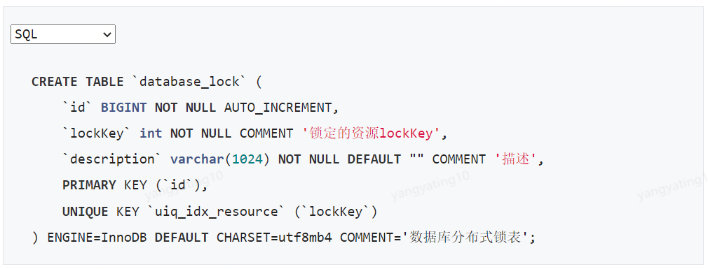

### 3.2 ZooKeeper实现

1.  在学习zk实现分布所之前，我们应该需要了解一些zk的知识
2.  持久节点：客户端断开连接zk不删除persistent类型节点
3.  临时节点：客户端断开连接zk删除ephemeral类型节点
4.  顺序节点：节点后面会自动生成类似0000001的数字表示顺序
5.  节点变化的通知：客户端注册了监听节点变化的时候，会调用回调方法

#### 3.2.1 基于临时节点的简单实现

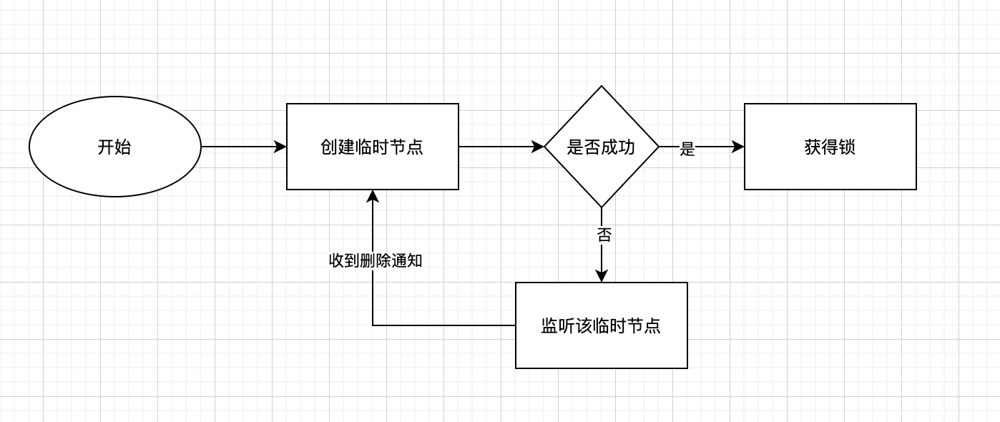

#### 3.2.2 基于临时顺序节点实现

创建临时节点，因为同名节点只能有一个，创建成功表示获取到锁，执行业务逻辑，否则就是失败，失败增加监听当前节点，如果有删除事件，再次创建临时节点，重复前面的过程。上面这种实现方式并不十分完美，有个明显的缺点是如果是在高并发场景下，监听临时节点的量比较多，每次在有客户端释放的时候，所有的监听客户端都需要再次参与竞争所。造成资源浪费。

针对zk分布式锁的简单实现，我们很容易联想到zk的顺序节点性质，让所有的客户端去排队申请，这样还是一个公平锁，按照顺序获取。流程图如下：

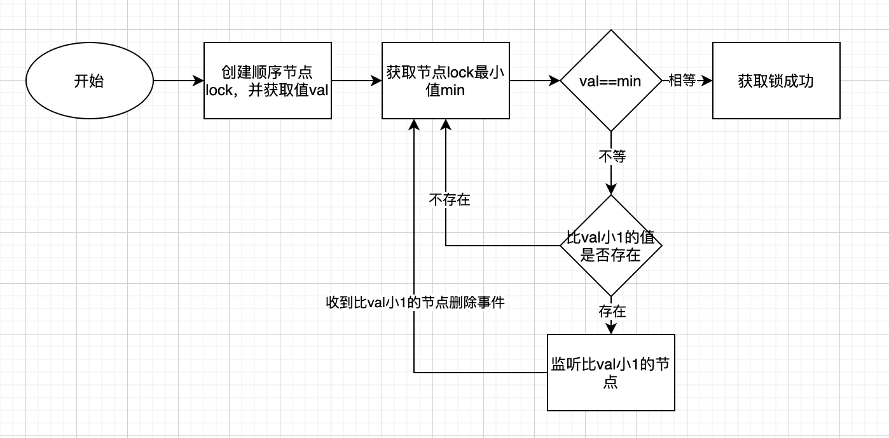

### 3.3 Redis实现

Redis来时实现分布式锁，常用的有三个命令incr、setNx、set， [Redis官方文档](https://redis.io/docs/reference/patterns/distributed-locks/)

#### 3.3.1 INCR实现

基于incr这种加锁的思路是， key 不存在，那么 key 的值会先被初始化为 0 ，然后再执行 INCR 操作进行加一。 然后其它用户在执行 INCR 操作进行加一时，如果返回的数大于 1 ，说明这个锁正在被使用当中。

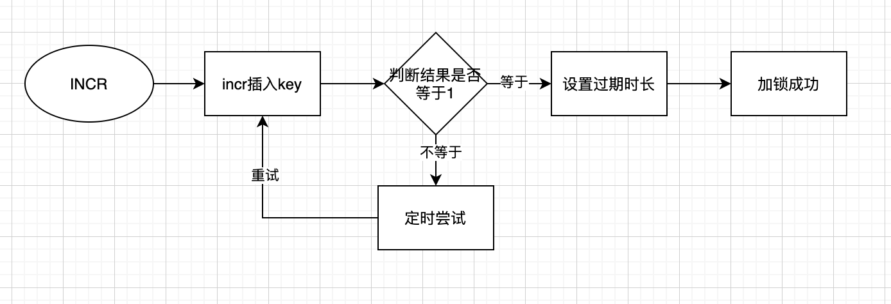

#### 3.3.2 SETNX实现

setNx命令实现这种加锁的思路是，如果 key 不存在，将 key 设置为 value ，如果 key 已存在，则 SETNX 不做任何动作

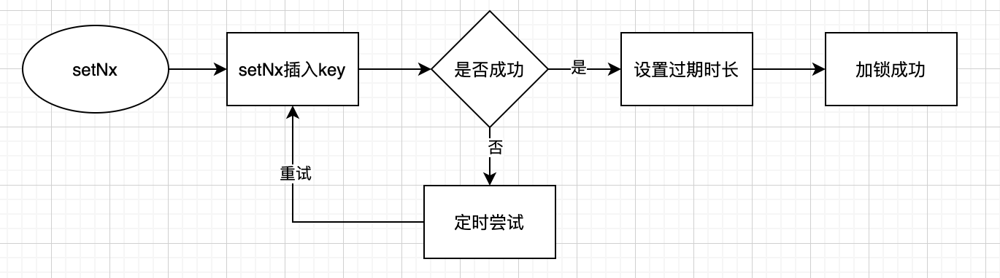

#### 3.3.3 SET命令实现

 上面两种方法都有一个问题，会发现，都需要设置 key 过期。那么为什么要设置key过期呢？如果请求执行因为某些原因意外退出了，导致创建了锁但是没有删除锁，那么这个锁将一直存在，以至于以后缓存再也得不到更新。于是乎我们需要给锁加一个过期时间以防不测。 但是借助 Expire 来设置就不是原子性操作了。所以还可以通过事务来确保原子性，但是还是有些问题，所以官方就引用了另外一个，使用 SET 命令本身已经从版本 2.6.12 开始包含了设置过期时间的功能。

#### 3.3.4 RedLock实现 

Redlock是一种算法，Redlock也就是 Redis Distributed Lock，可用实现多节点Redis的分布式锁。有多个Redis节点，这些节点之间既没有主从，也没有集群关系。客户端用相同的key和随机值在每个节点上请求锁，请求锁的超时时间应小于锁自动释放时间。当在超过半数Redis上请求到锁的时候，才算是真正获取到了锁。如果没有获取到锁，则把部分已锁的Redis释放掉。

主要特性

-  互斥性：在任何时候，只能有一个客户端能够持有锁；
-  避免死锁：当客户端拿到锁后，即使发生了网络分区或者客户端宕机，也不会发生死锁；（利用key的存活时间）
-  容错性：只要多数节点的Redis实例正常运行，就能够对外提供服务，加锁或者释放锁；

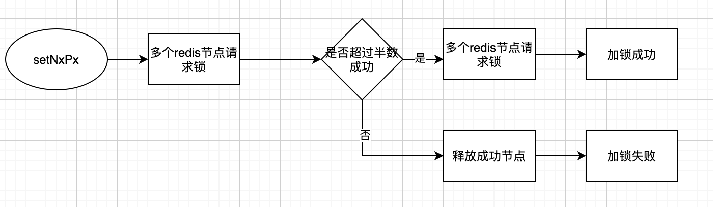

### 3.4 优劣势对比

**数据库**

1. 数据库操作比较简单，实现比较容易
2. 需要占用数据库资源、往往数据库本身就是一个瓶颈资源，耗费链接资源资源
3. 在数据库加锁多过程中需要轮训消耗cpu资源

**Zookeeper**

1. 可靠性高
2. 性能不如Redis实现，主要原因是写操作（获取锁释放锁）都需要在Leader上执行，然后同步到follower

**Redis**

1. 非阻塞，操作失败后需要轮训，消耗cpu资源
2. 并发性能高
3. 过期控制容易实现

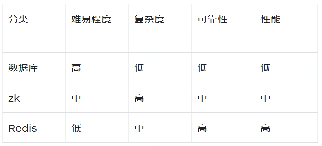

### 3.5 反面示例

提到Redis锁，大家很自然想到Redis的setNxEx命令来实现，都能说个1、2、3出来，它们有什么问题没有？我们先来看个代码，找找茬。下面是一段使用Redis加锁、解锁的核心逻辑。

#### 3.5.1 加锁

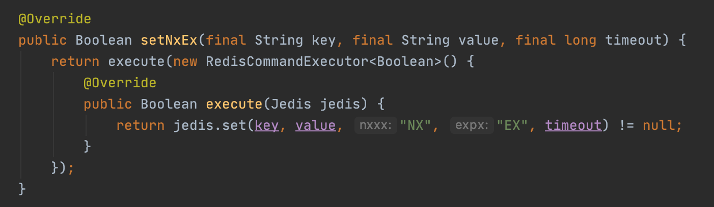

#### 3.5.2 解锁

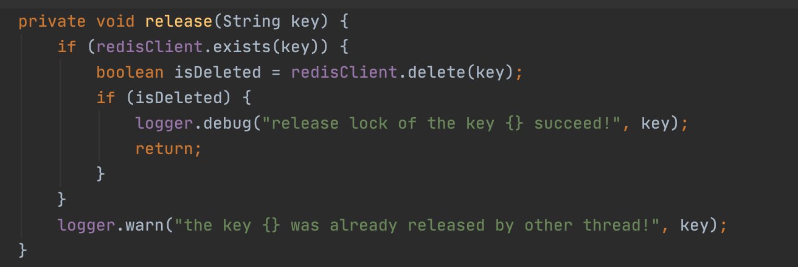

有没有点面熟，发现什么了嘛？好像也就这么事，细心的小朋友会发现这里最少有如下三个问题

**问题一：不满足互斥性**

先看看释放代码逻辑，如果在此时锁的过期时间已经到达会发生什么，此时释放会造成释放错误，将别的线程的锁释放掉。例如：线程A、B、C三个线程并发获取锁，A先获取锁，处理业务时间大于设置超时时间，A超时释放，B判断抢占到锁，更新为B占用锁成功，A执行完业务，释放锁（其实是释放B的锁），这个时候C判断无锁，正常加锁，导致B、C同时获取到了锁。

**问题二：解铃可以非系铃人**

在解锁只判断了key是否存在，key归属那个线程没有判断 ，可能释放掉非当前线程加的锁 。如问题一中描述示例。

**问题三：不可重入**

如果一个服务中获取到了锁，在服务里面需要调另外一个服务，他们使用的锁相同会出问题。（1）超时时间小于等待时间，会出现服务卡顿现象----等待前一个服务超时自动释放锁，（2）超时时间大于等待时间，会出现后一个服务永远是获取锁失败，后续逻辑一直走加锁失败逻辑。

## 4.RedissonLock使用

关于RedisLock网上随便一搜都是一堆，一个可用的分布式锁无外呼最终都是通过lua脚步保证加解锁的原子性，范例很多就不有一一介绍了，今天我们重点介绍一下RedissonLock的实现。Redisson框架是基于Redis实现的分布式锁，非常强大，只需要拿来使用就可以。

### 4.1 依赖引入

不用多说直接引入依赖先试一把

``` xml
<dependency>
  	<groupId>org.redisson</groupId>
  	<artifactId>redisson</artifactId>
  	<version>3.16.0</version>
</dependency>
```

### 4.2 使用示例

Redisson有多种锁的实现方式， [Redisson文档](https://github.com/redisson/redisson/wiki/目录)

``` java
/**
 * @Description 分布式锁
 * @Author chentao10
 * @Date 2022/7/8 16:11
 **/
public class DistributedLock {

    /**
     * RedissonLock
     */
    private static RedissonClient redissonClient;

    static {
        Config config = new Config();
        config.useSingleServer().setAddress("redis://localhost:6379");

        redissonClient = Redisson.create(config);
    }

    public static void main(String[] args) {
        // 创建一个为lock的锁
        RLock rLock = redissonClient.getLock("lock");

        try {
            // 加锁
            rLock.lock();
            System.out.println("获取锁成功");
        } finally {
            // 解锁
            rLock.unlock();
            redissonClient.shutdown();
        }
    }
}
```

### 4.3 源码分析

#### 4.3.1 加锁

``` java
<T> RFuture<T> tryLockInnerAsync(long waitTime, long leaseTime, TimeUnit unit, long threadId, RedisStrictCommand<T> command) {
    return evalWriteAsync(getRawName(), LongCodec.INSTANCE, command,
            "if (redis.call('exists', KEYS[1]) == 0) then " +
                    "redis.call('hincrby', KEYS[1], ARGV[2], 1); " +
                    "redis.call('pexpire', KEYS[1], ARGV[1]); " +
                    "return nil; " +
                    "end; " +
                    "if (redis.call('hexists', KEYS[1], ARGV[2]) == 1) then " +
                    "redis.call('hincrby', KEYS[1], ARGV[2], 1); " +
                    "redis.call('pexpire', KEYS[1], ARGV[1]); " +
                    "return nil; " +
                    "end; " +
                    "return redis.call('pttl', KEYS[1]);",
            Collections.singletonList(getRawName()), unit.toMillis(leaseTime), getLockName(threadId));
}
```

1. KEYS[1] ：加锁的lockName，即我们业务代码中需要加锁的资源key
2. ARGV[2]：线程ID用于标记加锁客户线程id，避免被他人释放
3. lua脚本中第一个if判断key是否存在，不存在，给命为lockName的hash的key【线程ID】赋值 1 并设置过期时间，如果存在key，进入第二个if判断线程ID是否一致，线程ID一致，说明是重入加锁，此时对值进行加 1 ，并重新设置过期时间。

**加锁流程图**

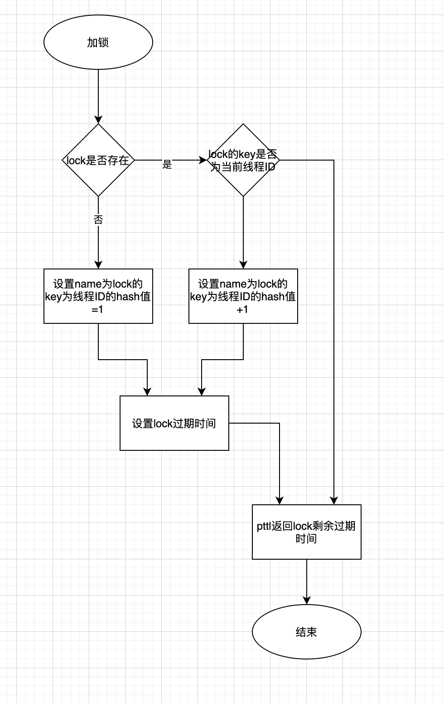

#### 4.3.2 解锁

``` java
protected RFuture<Boolean> unlockInnerAsync(long threadId) {
    return evalWriteAsync(getRawName(), LongCodec.INSTANCE, RedisCommands.EVAL_BOOLEAN,
            "if (redis.call('hexists', KEYS[1], ARGV[3]) == 0) then " +
                    "return nil;" +
                    "end; " +
                    "local counter = redis.call('hincrby', KEYS[1], ARGV[3], -1); " +
                    "if (counter > 0) then " +
                    "redis.call('pexpire', KEYS[1], ARGV[2]); " +
                    "return 0; " +
                    "else " +
                    "redis.call('del', KEYS[1]); " +
                    "redis.call('publish', KEYS[2], ARGV[1]); " +
                    "return 1; " +
                    "end; " +
                    "return nil;",
            Arrays.asList(getRawName(), getChannelName()), LockPubSub.UNLOCK_MESSAGE, internalLockLeaseTime, getLockName(threadId));
}
```

1. 判断lock是否存在，如果不存在直接返回，否则对应的加锁次数-1
2. 如果加锁次数大于0，重新设置过期时间，否则删除锁，并发布通知其他等待客户端锁已经释放

**释放锁流程图**

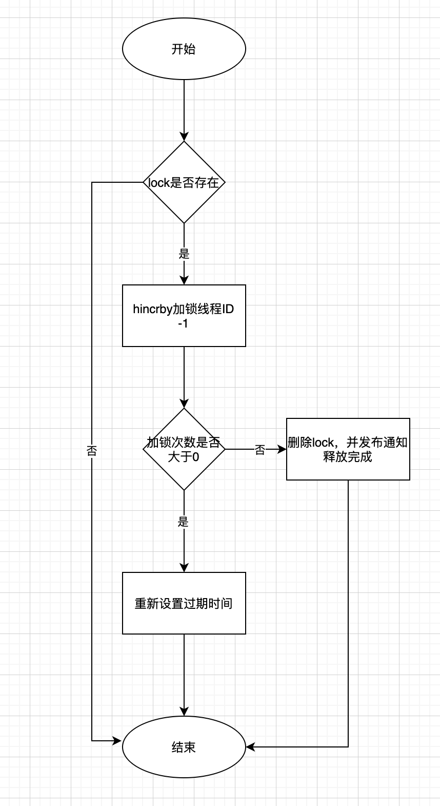

#### 4.3.3 看门狗

下面我们来看看Redisson是如何解决，过期时间确定和业务执行时长不确定性的问题。先上代码

``` java
private <T> RFuture<Long> tryAcquireAsync(long waitTime, long leaseTime, TimeUnit unit, long threadId) {
    RFuture<Long> ttlRemainingFuture;
    if (leaseTime != -1) {
        ttlRemainingFuture = tryLockInnerAsync(waitTime, leaseTime, unit, threadId, RedisCommands.EVAL_LONG);
    } else {
        ttlRemainingFuture = tryLockInnerAsync(waitTime, internalLockLeaseTime,
                TimeUnit.MILLISECONDS, threadId, RedisCommands.EVAL_LONG);
    }
    ttlRemainingFuture.onComplete((ttlRemaining, e) -> {
        if (e != null) {
            return;
        }

        // lock acquired
        if (ttlRemaining == null) {
            if (leaseTime != -1) {
                internalLockLeaseTime = unit.toMillis(leaseTime);
            } else {
              	// 续期开始的地方
                scheduleExpirationRenewal(threadId);
            }
        }
    });
    return ttlRemainingFuture;
}

protected void scheduleExpirationRenewal(long threadId) {
    ExpirationEntry entry = new ExpirationEntry();
    ExpirationEntry oldEntry = EXPIRATION_RENEWAL_MAP.putIfAbsent(getEntryName(), entry);
    if (oldEntry != null) {
        oldEntry.addThreadId(threadId);
    } else {
        entry.addThreadId(threadId);
        renewExpiration();
    }
}
```

ttlRemaining是调Redis加锁方法返回值，如果为空表示成功，否则返回一个大于0的值表示锁当前剩余时间。

注意只有在过期时间leaseTime=-1时“看门狗”才有效。

``` java
private void renewExpiration() {
    ExpirationEntry ee = EXPIRATION_RENEWAL_MAP.get(getEntryName());
    if (ee == null) {
        return;
    }
    
    Timeout task = commandExecutor.getConnectionManager().newTimeout(new TimerTask() {
        @Override
        public void run(Timeout timeout) throws Exception {
            ExpirationEntry ent = EXPIRATION_RENEWAL_MAP.get(getEntryName());
            if (ent == null) {
                return;
            }
            Long threadId = ent.getFirstThreadId();
            if (threadId == null) {
                return;
            }
            
            RFuture<Boolean> future = renewExpirationAsync(threadId);
            future.onComplete((res, e) -> {
                if (e != null) {
                    log.error("Can't update lock " + getRawName() + " expiration", e);
                    EXPIRATION_RENEWAL_MAP.remove(getEntryName());
                    return;
                }
                
                if (res) {
                    // reschedule itself
                    renewExpiration();
                }
            });
        }
    }, internalLockLeaseTime / 3, TimeUnit.MILLISECONDS);
    
    ee.setTimeout(task);
}
```

具体调Redis

```java
protected RFuture<Boolean> renewExpirationAsync(long threadId) {
    return evalWriteAsync(getRawName(), LongCodec.INSTANCE, RedisCommands.EVAL_BOOLEAN,
            "if (redis.call('hexists', KEYS[1], ARGV[2]) == 1) then " +
                    "redis.call('pexpire', KEYS[1], ARGV[1]); " +
                    "return 1; " +
                    "end; " +
                    "return 0;",
            Collections.singletonList(getRawName()),
            internalLockLeaseTime, getLockName(threadId));
}
```

renewExpiration方法内部通过调用TimeOut组件实现阻塞，TimeOut回调方法里又调用了自己renewExpiration，从而达到续期的目的。internalLockLeaseTime为redsionLock的默认过期时长30s。看到这是否想起了我们经常写的空循环。

### 4.4 Redisson锁分类

本文以Redission重入锁作为一个切入点，解锁了加解锁的具体源码实现，和续期是如何实现的，有兴趣的同学可以继续移驾 [RedissonLock锁分类](https://github.com/redisson/redisson/wiki/8.-分布式锁和同步器)