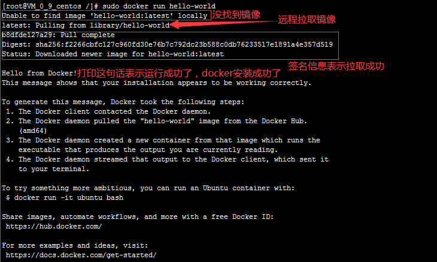

# 1.环境准备

系统：CentOS 7

内核：3.10.0-1160.24.1.el7.x86_64

# 2.环境查看

通过命令 `uname -r` 查看系统内核环境

``` shell
# 系统环境必须是 3.10 以上的
[root@VM_0_9_centos /]# uname -r
3.10.0-862.el7.x86_64
```
通过命令 `cat /etc/os-release` 查看系统属性
``` shell
[root@VM_0_9_centos /]# cat /etc/os-release 
NAME="CentOS Linux"
VERSION="7 (Core)"
ID="centos"
ID_LIKE="rhel fedora"
VERSION_ID="7"
PRETTY_NAME="CentOS Linux 7 (Core)"
ANSI_COLOR="0;31"
CPE_NAME="cpe:/o:centos:centos:7"
HOME_URL="https://www.centos.org/"
BUG_REPORT_URL="https://bugs.centos.org/"

CENTOS_MANTISBT_PROJECT="CentOS-7"
CENTOS_MANTISBT_PROJECT_VERSION="7"
REDHAT_SUPPORT_PRODUCT="centos"
REDHAT_SUPPORT_PRODUCT_VERSION="7"
```

# 3.安装

帮助文档：[docker 官方帮助文档](https://docs.docker.com/)

1.卸载旧的版本

``` shell
sudo yum remove docker \
                  docker-client \
                  docker-client-latest \
                  docker-common \
                  docker-latest \
                  docker-latest-logrotate \
                  docker-logrotate \
                  docker-engine
```

2.需要的安装包

``` shell
sudo yum install -y yum-utils
```

3.设置镜像的仓库

``` shell
# 默认是境外的仓库，很慢不建议使用
sudo yum-config-manager \
    --add-repo \
    https://download.docker.com/linux/centos/docker-ce.repo
    
# 阿里云镜像仓库，推荐使用
sudo yum-config-manager \
    --add-repo \
    http://mirrors.aliyun.com/docker-ce/linux/centos/docker-ce.repo
    
# 更新软件包索引
yum makecache fast
```

4.安装 docker docker-ce 社区版 ee 企业版

``` shell
sudo yum install docker-ce docker-ce-cli containerd.io
```

5.启动 docker

``` shell
sudo systemctl start docker
```

6.使用 `docker version` 查看是否安装成功


7.运行 hello world 镜像

``` shell
sudo docker run hello-world
```



8.查看一下下载的 hello-world 镜像

``` shell
docker images
```


# 4.卸载docker

``` shell
# 卸载依赖
sudo yum remove docker-ce docker-ce-cli containerd.io

# 删除docker资源目录
# /var/lib/docker	docker的默认工作路径
sudo rm -rf /var/lib/docker
sudo rm -rf /var/lib/containerd
```

