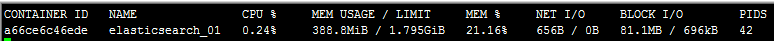
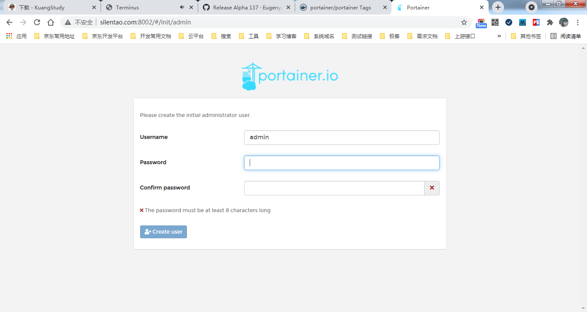

# 1.帮助命令

> 可查阅官方帮助文档地址：[官方帮助文档](https://docs.docker.com/reference/)

``` bash
docker version			# 显示docker的版本信息
docker info				# 显示docker的系统信息，包括镜像和容器的数量
docker <命令> --help	   # 万能命令
```

# 2.镜像命令

镜像命令通常是用来对镜像进行操作的命令，如查看镜像、搜索镜像、下载镜像以及删除镜像等。

## 2.1 查看镜像

可以通过命令 `docker images` 查看本地主机上的所有镜像

``` shell
docker images [可选参数]
# 可选项
-a, --all             # 列出所有的镜像
-q, --quiet           # 只显示镜像的id
```

命令测试

``` bash
[root@VM_0_9_centos /]# docker images
REPOSITORY    TAG       IMAGE ID       CREATED       SIZE
hello-world   latest    d1165f221234   7 weeks ago   13.3kB

# 解释
REPOSITORY		# 镜像的仓库源
TAG				# 镜像的标签
IMAGE ID		# 镜像的id
CREATED			# 镜像的创建时间
SIZE			# 镜像的大小
```

## 2.2 搜索镜像

可以通过命令 `docker search` 搜索远程仓库的镜像

``` shell
docker search <镜像名称> [可选参数]

# 可选项，通过收藏来过滤
-f, --filter filter   Filter output based on conditions provided
    --format string   Pretty-print search using a Go template
    --limit int       Max number of search results (default 25)
    --no-trunc        Don't truncate output
```

命令测试

``` bash
[root@VM_0_9_centos /]#  mysql
NAME     DESCRIPTION                                     STARS     OFFICIAL   AUTOMATED
mysql    MySQL is a widely used, open-source relation??  10777     [OK]       
mariadb  MariaDB Server is a high performing open sou??  4058      [OK]

# --filter=STARS=3000 搜索出来的镜像就是 STARS 大于 3000
[root@VM_0_9_centos /]# docker search mysql --filter=STARS=3000
NAME      DESCRIPTION                                     STARS     OFFICIAL   AUTOMATED
mysql     MySQL is a widely used, open-source relation??  10777     [OK]       
mariadb   MariaDB Server is a high performing open sou??  4058      [OK]       
[root@VM_0_9_centos /]# docker search mysql --filter=STARS=5000
NAME      DESCRIPTION                                     STARS     OFFICIAL   AUTOMATED
mysql     MySQL is a widely used, open-source relation??  10777     [OK]       
```

## 2.3 下载镜像

可以通过命令 `docker pull` 把远程仓库的镜像下载到本地主机上

``` shell
docker pull <镜像名称>[:tag]	 # 如果不写tag，默认下载latest（最新版本）
```

命令测试

``` bash
[root@VM_0_9_centos ~]# docker pull mysql
Using default tag: latest		# 如果不写tag，默认下载latest（最新版本）
latest: Pulling from library/mysql
f7ec5a41d630: Pull complete 	# 分层下载，docker image的核心，联合文件系统
9444bb562699: Pull complete 
6a4207b96940: Pull complete 
181cefd361ce: Pull complete 
8a2090759d8a: Pull complete 
15f235e0d7ee: Pull complete 
d870539cd9db: Pull complete 
493aaa84617a: Pull complete 
bfc0e534fc78: Pull complete 
fae20d253f9d: Pull complete 
9350664305b3: Pull complete 
e47da95a5aab: Pull complete 
Digest: sha256:04ee7141256e83797ea4a84a4d31b1f1bc10111c8d1bc1879d52729ccd19e20a	# 签名
Status: Downloaded newer image for mysql:latest
docker.io/library/mysql:latest	# 所下载docker镜像的真实地址

# 下面两条命令是等价的
docker pull mysql
docker pull mysql:latest

# 指定版本下载
[root@VM_0_9_centos ~]# docker pull mysql:5.7
5.7: Pulling from library/mysql
f7ec5a41d630: Already exists 
9444bb562699: Already exists 
6a4207b96940: Already exists 
181cefd361ce: Already exists 
8a2090759d8a: Already exists 
15f235e0d7ee: Already exists 
d870539cd9db: Already exists 
cb7af63cbefa: Pull complete 
151f1721bdbf: Pull complete 
fcd19c3dd488: Pull complete 
415af2aa5ddc: Pull complete 
Digest: sha256:a655529fdfcbaf0ef28984d68a3e21778e061c886ff458b677391924f62fb457
Status: Downloaded newer image for mysql:5.7
docker.io/library/mysql:5.7
```


## 2.4 删除镜像

可以通过命令 `docker rmi` 将本地主机上的镜像删除

``` shell
docker rmi -f <镜像id>			 	 	  	 # 删除指定的镜像
docker rmi -f <镜像id> [镜像id]	   			    # 删除多个镜像
docker rmi -f $(docker images -aq)		   	  # 删除全部的镜像
```

# 3.容器命令

容器命令主要是用来操作容器，不过要有了镜像才可以创建容器。

## 3.1 新建容器并启动

通过命令 `docker run` 来新建容器并启动容器

``` shell
docker run [可选参数] image <执行的程序或命令>

# 参数说明
--name="name"			# 容器的名字	如：tomcat1 tomcat2，用来区分容器
-d						# 后台的方式运行
-it						# 使用交互方式运行，进入容器查看内容
-P						# 随机指定端口
-p						# 指定容器的端口 如：-p 8080:8080
	ip:hostPort:containerPort		# ip:主机端口:容器端口
	hostPort:containerPort			# 主机端口:容器端口（常用）
	ip::containerPort				# ip::容器端口
	containerPort					# 容器端口
```

命令测试

``` bash
# 测试，启动并进入容器
[root@VM_0_9_centos ~]# docker run -it centos /bin/bash
[root@c667332b1745 /]# ls	# 查看容器内的centos，基础版本，很多命令不完善（此时已切换到容器内部）
bin  etc   lib	  lost+found  mnt  proc  run   srv  tmp  var
dev  home  lib64  media       opt  root  sbin  sys  usr

# 从容器中退回主机
[root@c667332b1745 /]# exit
exit
[root@VM_0_9_centos /]# ls	# 此时已在宿主机中
bin   data  etc   lib    lost+found  mnt  proc  run   srv  tmp  var
boot  dev   home  lib64  media       opt  root  sbin  sys  usr
```

## 3.2 列出运行的容器

通过命令 `docker ps` 来列出所有的运行的容器

``` shell
docker ps [可选参数]
		# 列出当前运行的容器
-a		# 列出当前运行的容器+曾经运行过的容器
-n=?	# 显示最近创建的容器
-q		# 只显示容器的编号
```

命令测试

``` bash
[root@VM_0_9_centos /]# docker ps		# 列出当前运行的容器
CONTAINER ID   IMAGE     COMMAND   CREATED   STATUS    PORTS     NAMES
[root@VM_0_9_centos /]# docker ps -a	# 列出当前运行的容器 + 曾经运行过的容器
CONTAINER ID   IMAGE          COMMAND       CREATED         STATUS                     PORTS     NAMES
c667332b1745   centos         "/bin/bash"   4 minutes ago   Exited (0) 2 minutes ago             beautiful_albattani
abedd821e53d   d1165f221234   "/hello"      24 hours ago    Exited (0) 24 hours ago              boring_morse
```

## 3.3 退出容器

通过命令 `exit` 或者同时按下 `Ctrl + P + Q` 来退出容器

``` shell
exit				# 直接容器停止并退出
Ctrl + P + Q		# 容器不停止退出
```

## 3.4 删除容器

通过命令 `docker rm` 来删除容器

``` shell
docker rm 容器id					# 删除指定的容器，不能删除正在运行的容器，如果要强制删除 rm -f
docker rm -f $(docker ps -aq)	 # 删除所有的容器
docker ps -a -q|xargs docker rm	 # 删除所有的容器
```

## 3.5 启动和停止容器的操作

``` shell
docker start <容器id>				# 启动容器
docker restart <容器id>			# 重启容器
docker stop <容器id>				# 停止当前正在运行的容器
docker kill <容器id>				# 强制停止当前正在运行的容器
```

## 3.5 其它命令

### 3.5.1 后台启动容器

``` shell
# 命令
docker run -d <镜像名>		# 后台启动容器
```

命令测试

``` shell
[root@VM_0_9_centos ~]# docker run -d centos

# 问题docker ps 发现centos停止了

# 常见的坑：docker容器使用后台运行，就必须要有一个前台进程，docker发现没有应用，就会自动停止
# nginx容器启动后，发现自己没有提供服务，就会立即停止，就是没有程序了
```

### 3.5.2 查看日志

通过命令 `docker logs` 来查看容器的日志

``` shell
# 查看容器日志
docker logs [可选参数] <容器id>

# 参数说明
- tf			# 显示日志
--tail number	# 要显示日志的条数
```

命令测试

``` shell
# 启动一个后台容器，并执行shell脚本，产生一些日志
docker run -d centos /bin/sh -c "while true;do echo silence; sleep 1;done"

[root@VM_0_9_centos ~]# docker ps
CONTAINER ID   IMAGE
1fc418891e59   centos

[root@VM_0_9_centos ~]# docker logs -f -t --tail 10 1fc418891e59
```

### 3.5.3 查看容器中的进程信息

``` shell
# 命令
docker top 容器id

[root@VM_0_9_centos ~]# docker top 1fc418891e59
UID                 PID                 PPID                C                   STIME
root                17262               17241               0                   22:44
root                23763               17262               0                   22:53     
```

查看镜像的元数据

``` javascript
# 命令
docker inspect 容器id

# 测试
[root@VM_0_9_centos ~]# docker inspect 1fc418891e59
[
    {
        "Id": "1fc418891e598794f571b171136997bb06747a9f6b9b8b9c26e3831ad510365c",
        "Created": "2021-04-28T14:44:41.961586933Z",
        "Path": "/bin/sh",
        "Args": [
            "-c",
            "while true;do echo silence; sleep 1;done"
        ],
        "State": {
            "Status": "running",
            "Running": true,
            "Paused": false,
            "Restarting": false,
            "OOMKilled": false,
            "Dead": false,
            "Pid": 17262,
            "ExitCode": 0,
            "Error": "",
            "StartedAt": "2021-04-28T14:44:42.263228804Z",
            "FinishedAt": "0001-01-01T00:00:00Z"
        },
        "Image": "sha256:300e315adb2f96afe5f0b2780b87f28ae95231fe3bdd1e16b9ba606307728f55",
        "ResolvConfPath": "/var/lib/docker/containers/1fc418891e598794f571b171136997bb06747a9f6b9b8b9c26e3831ad510365c/resolv.conf",
        "HostnamePath": "/var/lib/docker/containers/1fc418891e598794f571b171136997bb06747a9f6b9b8b9c26e3831ad510365c/hostname",
        "HostsPath": "/var/lib/docker/containers/1fc418891e598794f571b171136997bb06747a9f6b9b8b9c26e3831ad510365c/hosts",
        "LogPath": "/var/lib/docker/containers/1fc418891e598794f571b171136997bb06747a9f6b9b8b9c26e3831ad510365c/1fc418891e598794f571b171136997bb06747a9f6b9b8b9c26e3831ad510365c-json.log",
        "Name": "/serene_sanderson",
        "RestartCount": 0,
        "Driver": "overlay2",
        "Platform": "linux",
        "MountLabel": "",
        "ProcessLabel": "",
        "AppArmorProfile": "",
        "ExecIDs": null,
        "HostConfig": {
            "Binds": null,
            "ContainerIDFile": "",
            "LogConfig": {
                "Type": "json-file",
                "Config": {}
            },
            "NetworkMode": "default",
            "PortBindings": {},
            "RestartPolicy": {
                "Name": "no",
                "MaximumRetryCount": 0
            },
            "AutoRemove": false,
            "VolumeDriver": "",
            "VolumesFrom": null,
            "CapAdd": null,
            "CapDrop": null,
            "CgroupnsMode": "host",
            "Dns": [],
            "DnsOptions": [],
            "DnsSearch": [],
            "ExtraHosts": null,
            "GroupAdd": null,
            "IpcMode": "private",
            "Cgroup": "",
            "Links": null,
            "OomScoreAdj": 0,
            "PidMode": "",
            "Privileged": false,
            "PublishAllPorts": false,
            "ReadonlyRootfs": false,
            "SecurityOpt": null,
            "UTSMode": "",
            "UsernsMode": "",
            "ShmSize": 67108864,
            "Runtime": "runc",
            "ConsoleSize": [
                0,
                0
            ],
            "Isolation": "",
            "CpuShares": 0,
            "Memory": 0,
            "NanoCpus": 0,
            "CgroupParent": "",
            "BlkioWeight": 0,
            "BlkioWeightDevice": [],
            "BlkioDeviceReadBps": null,
            "BlkioDeviceWriteBps": null,
            "BlkioDeviceReadIOps": null,
            "BlkioDeviceWriteIOps": null,
            "CpuPeriod": 0,
            "CpuQuota": 0,
            "CpuRealtimePeriod": 0,
            "CpuRealtimeRuntime": 0,
            "CpusetCpus": "",
            "CpusetMems": "",
            "Devices": [],
            "DeviceCgroupRules": null,
            "DeviceRequests": null,
            "KernelMemory": 0,
            "KernelMemoryTCP": 0,
            "MemoryReservation": 0,
            "MemorySwap": 0,
            "MemorySwappiness": null,
            "OomKillDisable": false,
            "PidsLimit": null,
            "Ulimits": null,
            "CpuCount": 0,
            "CpuPercent": 0,
            "IOMaximumIOps": 0,
            "IOMaximumBandwidth": 0,
            "MaskedPaths": [
                "/proc/asound",
                "/proc/acpi",
                "/proc/kcore",
                "/proc/keys",
                "/proc/latency_stats",
                "/proc/timer_list",
                "/proc/timer_stats",
                "/proc/sched_debug",
                "/proc/scsi",
                "/sys/firmware"
            ],
            "ReadonlyPaths": [
                "/proc/bus",
                "/proc/fs",
                "/proc/irq",
                "/proc/sys",
                "/proc/sysrq-trigger"
            ]
        },
        "GraphDriver": {
            "Data": {
                "LowerDir": "/var/lib/docker/overlay2/6ab3b8262005c9a5a9b1a4ed08e14898667a66b5ee6353a9fd27f3d01bb1e36b-init/diff:/var/lib/docker/overlay2/035bdcc3ac7dae250dfcf9e8f7dd84f209fe3383b01038ae2a6da126baf1508f/diff",
                "MergedDir": "/var/lib/docker/overlay2/6ab3b8262005c9a5a9b1a4ed08e14898667a66b5ee6353a9fd27f3d01bb1e36b/merged",
                "UpperDir": "/var/lib/docker/overlay2/6ab3b8262005c9a5a9b1a4ed08e14898667a66b5ee6353a9fd27f3d01bb1e36b/diff",
                "WorkDir": "/var/lib/docker/overlay2/6ab3b8262005c9a5a9b1a4ed08e14898667a66b5ee6353a9fd27f3d01bb1e36b/work"
            },
            "Name": "overlay2"
        },
        "Mounts": [],
        "Config": {
            "Hostname": "1fc418891e59",
            "Domainname": "",
            "User": "",
            "AttachStdin": false,
            "AttachStdout": false,
            "AttachStderr": false,
            "Tty": false,
            "OpenStdin": false,
            "StdinOnce": false,
            "Env": [
                "PATH=/usr/local/sbin:/usr/local/bin:/usr/sbin:/usr/bin:/sbin:/bin"
            ],
            "Cmd": [
                "/bin/sh",
                "-c",
                "while true;do echo silence; sleep 1;done"
            ],
            "Image": "centos",
            "Volumes": null,
            "WorkingDir": "",
            "Entrypoint": null,
            "OnBuild": null,
            "Labels": {
                "org.label-schema.build-date": "20201204",
                "org.label-schema.license": "GPLv2",
                "org.label-schema.name": "CentOS Base Image",
                "org.label-schema.schema-version": "1.0",
                "org.label-schema.vendor": "CentOS"
            }
        },
        "NetworkSettings": {
            "Bridge": "",
            "SandboxID": "de87c6f7dd7780fc4e16a0528a049067a5e4b59dee0f707a8bd878a64f5d272b",
            "HairpinMode": false,
            "LinkLocalIPv6Address": "",
            "LinkLocalIPv6PrefixLen": 0,
            "Ports": {},
            "SandboxKey": "/var/run/docker/netns/de87c6f7dd77",
            "SecondaryIPAddresses": null,
            "SecondaryIPv6Addresses": null,
            "EndpointID": "b02b2e0974ad5a20ae7e37500cd4ad439c4a3fae43be2befa85bd4873f9ed560",
            "Gateway": "172.18.0.1",
            "GlobalIPv6Address": "",
            "GlobalIPv6PrefixLen": 0,
            "IPAddress": "172.18.0.2",
            "IPPrefixLen": 16,
            "IPv6Gateway": "",
            "MacAddress": "02:42:ac:12:00:02",
            "Networks": {
                "bridge": {
                    "IPAMConfig": null,
                    "Links": null,
                    "Aliases": null,
                    "NetworkID": "49e3fe89cda391492cd6d99579413cda9efa100de0f0b8236a93e02131ad3c95",
                    "EndpointID": "b02b2e0974ad5a20ae7e37500cd4ad439c4a3fae43be2befa85bd4873f9ed560",
                    "Gateway": "172.18.0.1",
                    "IPAddress": "172.18.0.2",
                    "IPPrefixLen": 16,
                    "IPv6Gateway": "",
                    "GlobalIPv6Address": "",
                    "GlobalIPv6PrefixLen": 0,
                    "MacAddress": "02:42:ac:12:00:02",
                    "DriverOpts": null
                }
            }
        }
    }
]
```

进入当前正在运行的容器

``` shell
#方式一：
# 命令
docker exec -it 容器id bashShell

# 测试
[root@VM_0_9_centos ~]# docker ps
CONTAINER ID   IMAGE   COMMAND                  CREATED      STATUS       
1fc418891e59   centos  "/bin/sh -c 'while t??   2 days ago   Up 5 seconds 
[root@VM_0_9_centos ~]# docker exec -it 1fc418891e59 /bin/bash
[root@1fc418891e59 /]# ls
bin  dev  etc  home  lib  lib64  lost+found  media  mnt  opt  proc  root  run  sbin  srv  sys  tmp  usr  var
[root@1fc418891e59 /]# ps -ef
UID        PID  PPID  C STIME TTY          TIME CMD
root         1     0  0 14:45 ?        00:00:00 /bin/sh -c while true;do echo silence; sleep 1;done
root        52     0  0 14:46 pts/0    00:00:00 /bin/bash
root        74     1  0 14:46 ?        00:00:00 /usr/bin/coreutils --coreutils-prog-shebang=sleep /usr/bin/sleep 1
root        75    52  0 14:46 pts/0    00:00:00 ps -e

# 方式二：
# 命令
docker attach 容器id

# 测试
[root@VM_0_9_centos ~]# docker attach 1fc418891e59
正在执行当前的代码……


# docker exec		# 进入容器后开启一个新的终端，可以在里面操作（常用）
# docker attach		# 进入容器正在执行的终端，不会启动新的进程
```

从容器内拷贝文件到主机上

``` shell
# 命令
docker cp 容器id:容器内路径 目的的主机路径

# 测试
[root@VM_0_9_centos ~]# docker ps
CONTAINER ID   IMAGE     COMMAND       CREATED      STATUS              PORTS     NAMES
7c7e85baf5b5   centos    "/bin/bash"   2 days ago   Up About a minute             focused_moore

# 进入容器内部
[root@VM_0_9_centos ~]# docker attach 7c7e85baf5b5
[root@7c7e85baf5b5 /]# ls
bin  dev  etc  home  lib  lib64  lost+found  media  mnt  opt  proc  root  run  sbin  srv  sys  tmp  usr  var
[root@7c7e85baf5b5 /]# cd /home/
[root@7c7e85baf5b5 home]# ls

# 在容器内创建一个文件
[root@7c7e85baf5b5 home]# touch test.java
[root@7c7e85baf5b5 home]# exit
exit
[root@VM_0_9_centos ~]# docker ps
CONTAINER ID   IMAGE     COMMAND   CREATED   STATUS    PORTS     NAMES
[root@VM_0_9_centos ~]# pwd
/root
[root@VM_0_9_centos ~]# cd /home/
[root@VM_0_9_centos home]# ls
git

# 将容器内的文件拷贝出来到主机上
[root@VM_0_9_centos home]# docker cp 7c7e85baf5b5:/home/test.java /home/
[root@VM_0_9_centos home]# ls
git  test.java

# 拷贝是一个手动过程，可以使用 -v卷 的技术，实现自动同步
```

# 4 练习

## 4.1 安装nginx容器

``` shell
# 1.搜索镜像
docker search nginx

[root@VM_0_9_centos home]# docker search nginx
NAME                               DESCRIPTION                                     STARS     OFFICIAL   AUTOMATED
nginx                              Official build of Nginx.                        14798     [OK]       
jwilder/nginx-proxy                Automated Nginx reverse proxy for docker con??  2020                 [OK]
richarvey/nginx-php-fpm            Container running Nginx + PHP-FPM capable of??  813                  [OK]

# 2.拉取镜像
docker pull nginx

[root@VM_0_9_centos home]# docker pull nginx
Using default tag: latest
latest: Pulling from library/nginx
f7ec5a41d630: Pull complete 
aa1efa14b3bf: Pull complete 
b78b95af9b17: Pull complete 
c7d6bca2b8dc: Pull complete 
cf16cd8e71e0: Pull complete 
0241c68333ef: Pull complete 
Digest: sha256:75a55d33ecc73c2a242450a9f1cc858499d468f077ea942867e662c247b5e412
Status: Downloaded newer image for nginx:latest
docker.io/library/nginx:latest

# 查看镜像
[root@VM_0_9_centos home]# docker images
REPOSITORY   TAG       IMAGE ID       CREATED        SIZE
nginx        latest    62d49f9bab67   2 weeks ago    133MB

# 3.启动容器
docker run -d --name nginx_01 -p 8002:80 nginx
# -d 		后台运行
# --name	给容器起名字
# -p		宿主机端口:容器端口

# 查看容器是否启动
[root@VM_0_9_centos home]# docker ps
CONTAINER ID   IMAGE     COMMAND                  CREATED         STATUS         PORTS                                   NAMES
87b0b1732a33   nginx     "/docker-entrypoint.??   6 seconds ago   Up 5 seconds   0.0.0.0:8002->80/tcp, :::8002->80/tcp   nginx_01
# 访问nginx是否启动成功
[root@VM_0_9_centos home]# curl localhost:8002
<!DOCTYPE html>
<html>
<head>
<title>Welcome to nginx!</title>
<style>
    body {
        width: 35em;
        margin: 0 auto;
        font-family: Tahoma, Verdana, Arial, sans-serif;
    }
</style>
</head>
<body>
<h1>Welcome to nginx!</h1>
<p>If you see this page, the nginx web server is successfully installed and
working. Further configuration is required.</p>

<p>For online documentation and support please refer to
<a href="http://nginx.org/">nginx.org</a>.<br/>
Commercial support is available at
<a href="http://nginx.com/">nginx.com</a>.</p>

<p><em>Thank you for using nginx.</em></p>
</body>
</html>

# 进入容器
[root@VM_0_9_centos home]# docker exec -it nginx_01 /bin/bash
root@87b0b1732a33:/# whereis nginx
nginx: /usr/sbin/nginx /usr/lib/nginx /etc/nginx /usr/share/nginx
root@87b0b1732a33:/# cd /etc/nginx/
# 查看容器内的nginx目录
root@87b0b1732a33:/etc/nginx# ls
conf.d	fastcgi_params	koi-utf  koi-win  mime.types  modules  nginx.conf  scgi_params	uwsgi_params  win-utf
```

## 4.2 安装tomcat容器

``` shell
# 官方的使用
docker run -it --rm tomcat:9.0

# 我们之前的启动都是后台，停止了容器之后，容器还是可以查到
# docker run -it --rm 镜像名称:版本		一般用来测试，用完即删除容器，但是镜像还会在
# 如果宿主机没有对应镜像，就会下载对应镜像

# 启动Tomcat
docker run -d -p 8899:8080 --name tomcat_01 tomcat

# 测试发现404

# 进入容器
[root@VM_0_9_centos home]# docker exec -it tomcat_01 /bin/bash
root@097847154bd4:/usr/local/tomcat# pwd
/usr/local/tomcat
root@097847154bd4:/usr/local/tomcat# ls
BUILDING.txt  CONTRIBUTING.md  LICENSE	NOTICE	README.md  RELEASE-NOTES  RUNNING.txt  bin  conf  lib  logs  native-jni-lib  temp  webapps  webapps.dist  work
# 进入webapps
root@097847154bd4:/usr/local/tomcat# cd webapps
# 发现webapps目录是空的
root@097847154bd4:/usr/local/tomcat/webapps# ls
root@097847154bd4:/usr/local/tomcat/webapps#

# 发现问题：1.Linux命令少了；2.没有webapps目录
# 原因是默认下载最小的镜像，所有不必要的都剔除掉
# 保证最小可运行的环境
```

## 4.3 部署es+kibana

``` shell
# es 暴露的端口很多
# es 十分的耗内存
# es es的数据一般需要放置到安全目录！挂载

# 启动es
docker run -d --name elasticsearch -p 9200:9200 -p 9300:9300 -e "discovery.type=single-node" elasticsearch:7.6.2

# 命令
docker stats 容器id		# 查看cpu的状态

# 测试es是否成功了
[root@VM_0_9_centos home]# curl localhost:9200
{
  "name" : "095ff19df14e",
  "cluster_name" : "docker-cluster",
  "cluster_uuid" : "XDgfmsEwR3CFKMLmuXKsaQ",
  "version" : {
    "number" : "7.6.2",
    "build_flavor" : "default",
    "build_type" : "docker",
    "build_hash" : "ef48eb35cf30adf4db14086e8aabd07ef6fb113f",
    "build_date" : "2020-03-26T06:34:37.794943Z",
    "build_snapshot" : false,
    "lucene_version" : "8.4.0",
    "minimum_wire_compatibility_version" : "6.8.0",
    "minimum_index_compatibility_version" : "6.0.0-beta1"
  },
  "tagline" : "You Know, for Search"
}

# 增加内存的限制的方式启动
docker run -d --name elasticsearch_01 -p 9200:9200 -p 9300:9300 -e "discovery.type=single-node" -e ES_JAVA_OPTS="-Xms64m -Xmx512m" elasticsearch:7.6.2

# 执行启动命令
[root@VM_0_9_centos home]# docker run -d --name elasticsearch_01 -p 9200:9200 -p 9300:9300 -e "discovery.type=single-node" -e ES_JAVA_OPTS="-Xms64m -Xmx512m" elasticsearch:7.6.2
a66ce6c46ede990089598e46db34c7d3835d6a02a14ce91350b9dc9e74c536f2

# 查看容器
[root@VM_0_9_centos home]# docker ps
CONTAINER ID   IMAGE                 COMMAND                  CREATED         STATUS         PORTS                                                                                  NAMES
a66ce6c46ede   elasticsearch:7.6.2   "/usr/local/bin/dock??   3 seconds ago   Up 2 seconds   0.0.0.0:9200->9200/tcp, :::9200->9200/tcp, 0.0.0.0:9300->9300/tcp, :::9300->9300/tcp   elasticsearch_01

# 查看容器内存
[root@VM_0_9_centos home]# docker stats a66ce6c46ede
```



``` shell
# 测试是否成功了
[root@VM_0_9_centos home]# curl localhost:9200
{
  "name" : "a66ce6c46ede",
  "cluster_name" : "docker-cluster",
  "cluster_uuid" : "GUyBHvvpTAW2GiO63NZDYA",
  "version" : {
    "number" : "7.6.2",
    "build_flavor" : "default",
    "build_type" : "docker",
    "build_hash" : "ef48eb35cf30adf4db14086e8aabd07ef6fb113f",
    "build_date" : "2020-03-26T06:34:37.794943Z",
    "build_snapshot" : false,
    "lucene_version" : "8.4.0",
    "minimum_wire_compatibility_version" : "6.8.0",
    "minimum_index_compatibility_version" : "6.0.0-beta1"
  },
  "tagline" : "You Know, for Search"
}
```

# 5 可视化工具

* portainer

``` shell
docker run -d -p 8002:9000 \ --restart=always -v /var/run/docker.sock:/var/run/docker.sock --privileged=true portainer/portainer
```

* Rancher

## 5.1 什么是 portainer？

Portainer是Docker的图形化管理工具，提供状态显示面板、应用模板快速部署、容器镜像网络数据卷
的基本操作（包括上传下载镜像，创建容器等操作）、事件日志显示、容器控制台操作、Swarm集群和
服务等集中管理和操作、登录用户管理和控制等功能。功能十分全面，基本能满足中小型单位对容器管
理的全部需求。
如果仅有一个docker宿主机，则可使用单机版运行，Portainer单机版运行十分简单，只需要一条语句即
可启动容器，来管理该机器上的docker镜像、容器等数据。

## 5.2 安装 portainer

``` shell
# 命令
docker run -d -p 8002:9000 --restart=always -v /var/run/docker.sock:/var/run/docker.sock --privileged=true portainer/portainer

# 安装
[root@VM_0_9_centos home]# docker run -d -p 8002:9000 --restart=always -v /var/run/docker.sock:/var/run/docker.sock --privileged=true portainer/portainer
Unable to find image 'portainer/portainer:latest' locally
latest: Pulling from portainer/portainer
94cfa856b2b1: Pull complete 
49d59ee0881a: Pull complete 
a2300fd28637: Pull complete 
Digest: sha256:fb45b43738646048a0a0cc74fcee2865b69efde857e710126084ee5de9be0f3f
Status: Downloaded newer image for portainer/portainer:latest
691030560f7c30b945e27c70a5109e99efaad7518bfda785c118266bb287a103
[root@VM_0_9_centos home]# docker ps
CONTAINER ID   IMAGE                 COMMAND        CREATED         STATUS         PORTS                                       NAMES
691030560f7c   portainer/portainer   "/portainer"   4 seconds ago   Up 3 seconds   0.0.0.0:8002->9000/tcp, :::8002->9000/tcp   wizardly_pare

# 访问测试
```



输入密码创建用户即可。

# 6.小结

## 6.1 镜像与容器关系


## 6.2 常用命令

``` bash
# 当前 shell 下 attach 连接指定运行镜像
$ attach			Attach to a running container

# 通过 Dockerfile 定制镜像
$ build 			Build an image from a Dockerfile

# 提交当前容器为新的镜像
$ commit 			Create a new image from a container changes

# 从容器中拷贝指定文件或者目录到宿主机中
$ cp 				Copy files/folders from the containers filesystem to the host path

# 创建一个新的容器，同run，但不启动容器
$ create 			Create a new container

# 查看 docker 容器变化
$ diff 				Inspect changes on a container's filesystem

# 从 docker 服务获取容器实时事件
$ events			Get real time events from the server

# 在已存在的容器上运行命令
$ exec 				Run a command in an existing container

# 导出容器的内容流作为一个 tar 归档文件[对应 import ]
$ export 			Stream the contents of a container as a tar archive 

# 展示一个镜像形成历史
$ history 			Show the history of an image

# 列出系统当前镜像
$ images 			List images

# 从 tar包中的内容创建一个新的文件系统映像 [对应export]
$ import 			Create a new filesystem image from the contents of a tarball

# 显示系统相关信息
$ info 				Display system-wide information

# 查看容器详细信息
$ inspect 			Return low-level information on a container

# kill 指定 docker 容器
$ kill 				Kill a running container

# 从一个 tar 包中加载一个镜像[对应 save]
$ load 				Load an image from a tar archive

# 注册或者登陆一个 docker 源服务器
$ login				Register or Login to the docker registry server

# 从当前 Docker registry 退出
$ logout 			Log out from a Docker registry server

# 输出当前容器日志信息
$ logs 				Fetch the logs of a container

# 查看映射端口对应的容器内部源端口
$ port				Lookup the public-facing port which is NAT-ed to PRIVATE_PORT

# 暂停容器
$ pause 			Pause all processes within a container

# 列出容器列表
$ ps 				List containers

# 从docker镜像源服务器拉取指定镜像或者库镜像
$ pull 				Pull an image or a repository from the docker registry server 

# 推送指定镜像或者库镜像至docker源服务器
$ push 				Push an image or a repository to the docker registry server

# 重启运行的容器
$ restart 			Restart a running container

# 移除一个或者多个容器
$ rm 				Remove one or more containers

# 移除一个或多个镜像[无容器使用该镜像才可删除，否则需删除相关容器才可继续或 -f 强制删除]
$ rmi 				Remove one or more images

# 创建一个新的容器并运行一个命令
$ run 				Run a command in a new container

# 保存一个镜像为一个 tar 包[对应 load]
$ save 				Save an image to a tar archive

# 在 docker hub 中搜索镜像
$ search 			Search for an image on the Docker Hub

# 启动容器
$ start 			Start a stopped containers

# 停止容器
$ stop 				Stop a running containers

# 给源中镜像打标签
$ tag 				Tag an image into a repository

# 查看容器中运行的进程信息
$ top 				Lookup the running processes of a container

# 取消暂停容器
$ unpause 			Unpause a paused container

# 查看 docker 版本号
$ version 			Show the docker version information

# 截取容器停止时的退出状态值
$ wait 	Block until a container stops, then print its exit code 
```

