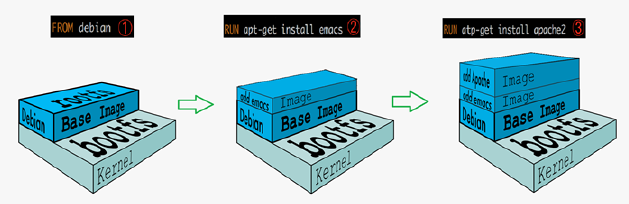
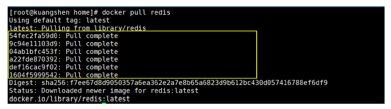
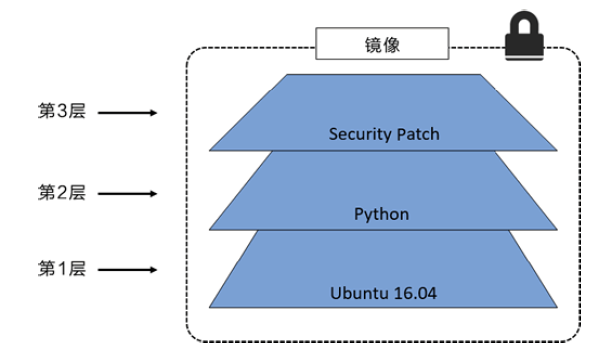
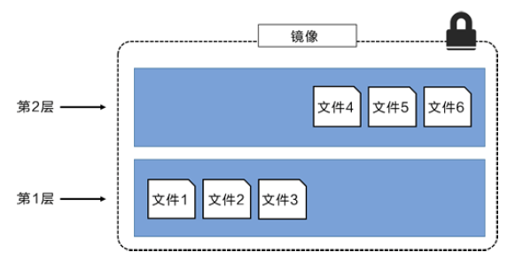
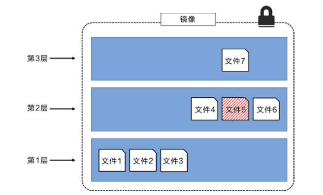
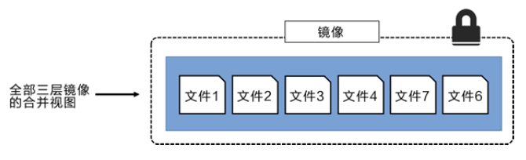

# 1.镜像是什么

镜像是一种轻量级、可执行的独立软件包，用来打包软件运行环境和基于运行环境开发的软件，它包含
运行某个软件所需的所有内容，包括代码、运行时、库、环境变量和配置文件。

# 2.Docker镜像的加载原理

## 2.1 UnionFS （联合文件系统）

- UnionFS（联合文件系统）：Union 文件系统（UnionFS）是一种分层、轻量级并且高性能的文件系统，
  它支持对文件系统的修改作为一次提交来一层层的叠加，同时可以将不同目录挂载到同一个虚拟文件系
  统下（unite several directories into a single virtual filesystem）。Union 文件系统是 Docker 镜像的基
  础。镜像可以通过分层来进行继承，基于基础镜像（没有父镜像），可以制作各种具体的应用镜像。
- 特性：一次同时加载多个文件系统，但从外面看起来，只能看到一个文件系统，联合加载会把各层文件
  系统叠加起来，这样最终的文件系统会包含所有底层的文件和目录。

## 2.2 Docker 镜像加载原理

Docker 的镜像实际上由一层一层的文件系统组成，这种层级的文件系统 UnionFS。

bootfs（boot file system）主要包含 bootloader 和 kernel, bootloader 主要是引导加载 kernel，Linux 刚启
动时会加载 bootfs 文件系统，在 Docker 镜像的最底层是 bootfs。这一层与我们典型的 Linux/Unix 系统是
一样的，包含 boot 加载器和内核。当 boot 加载完成之后整个内核就都在内存中了，此时内存的使用权已
由 bootfs 转交给内核，此时系统也会卸载 bootfs。

rootfs (root file system) ，在 bootfs 之上。包含的就是典型 Linux 系统中的 /dev， /proc， /bin，/etc 等标
准目录和文件。rootfs 就是各种不同的操作系统发行版，比如 Ubuntu，Centos 等等。



对于一个精简的 OS，rootfs 可以很小，只需要包含最基本的命令，工具和程序库就可以了，因为底层直
接用 Host 的 kernel，自己只需要提供 rootfs 就可以了。由此可见对于不同的 linux 发行版, bootfs 基本是一
致的，rootfs 会有差别, 因此不同的发行版可以公用 bootfs。

# 3.分层概念

## 3.1 分层的镜像

我们可以去下载一个镜像，注意观察下载的日志输出，可以看到是一层一层的在下载：



思考：为什么Docker镜像要采用这种分层的结构呢？

最大的好处，我觉得莫过于是资源共享了！比如有多个镜像都从相同的 Base 镜像构建而来，那么宿主机
只需在磁盘上保留一份 base 镜像，同时内存中也只需要加载一份 base 镜像，这样就可以为所有的容器服
务了，而且镜像的每一层都可以被共享。

查看镜像分层的方式可以通过 docker image inspect 命令：

``` bash
$ docker image inspect redis:latest
[
	{
        // .....
        "RootFS": {
            "Type": "layers",
            "Layers": [
                "sha256:c2adabaecedbda0af72b153c6499a0555f3a769d52370469d8f6bd6328af9b13",
                "sha256:744315296a49be711c312dfa1b3a80516116f78c437367ff0bc678da1123e990",
                "sha256:379ef5d5cb402a5538413d7285b21aa58a560882d15f1f553f7868dc4b66afa8",
                "sha256:d00fd460effb7b066760f97447c071492d471c5176d05b8af1751806a1f905f8",
                "sha256:4d0c196331523cfed7bf5bafd616ecb3855256838d850b6f3d5fba911f6c4123",
                "sha256:98b4a6242af2536383425ba2d6de033a510e049d9ca07ff501b95052da76e894"
            ]
        },
        "Metadata": {
            "LastTagTime": "0001-01-01T00:00:00Z"
        }
    }
]
```

理解：
所有的 Docker 镜像都起始于一个基础镜像层，当进行修改或增加新的内容时，就会在当前镜像层之
上，创建新的镜像层。

举一个简单的例子，假如基于 Ubuntu Linux 16.04 创建一个新的镜像，这就是新镜像的第一层；如果
在该镜像中添加 Python包，就会在基础镜像层之上创建第二个镜像层；如果继续添加一个安全补丁，就
会创建第三个镜像层。

该镜像当前已经包含 3 个镜像层，如下图所示（这只是一个用于演示的很简单的例子）：



在添加额外的镜像层的同时，镜像始终保持是当前所有镜像的组合，理解这一点非常重要。下图中举了
一个简单的例子，每个镜像层包含 3 个文件，而镜像包含了来自两个镜像层的 6 个文件，如下图所示：



上图中的镜像层跟之前图中的略有区别，主要目的是便于展示文件。

下图中展示了一个稍微复杂的三层镜像，在外部看来整个镜像只有 6 个文件，这是因为最上层中的文件
7 是文件 5 的一个更新版本。



这种情况下，上层镜像层中的文件覆盖了底层镜像层中的文件。这样就使得文件的更新版本作为一个新
镜像层添加到镜像当中。

Docker 通过存储引擎（新版本采用快照机制）的方式来实现镜像层堆栈，并保证多镜像层对外展示为统
一的文件系统。

Linux 上可用的存储引擎有 AUFS、Overlay2、Device Mapper、Btrfs 以及 ZFS。顾名思义，每种存储
引擎都基于 Linux 中对应的文件系统或者块设备技术，并且每种存储引擎都有其独有的性能特点。

Docker 在 Windows 上仅支持 windowsfilter 一种存储引擎，该引擎基于 NTFS 文件系统之上实现了分
层和 CoW[1]。

下图展示了与系统显示相同的三层镜像。所有镜像层堆叠并合并，对外提供统一的视图。



## 3.2 特点

Docker 镜像都是只读的，当容器启动时，一个新的可写层被加载到镜像的顶部，这一层就是我们通常说的容器层，容器之下的都叫镜像层。

# 4.commit镜像

如何提交一个自己的镜像

``` shell
$ docker commit 		# 提交容器成为一个新的副本

# 命令和git原来类似
$ docker commit -m="提交的描述信息" -a="作者" 容器id 目标镜像名:[TAG]
```

实战测试

1.启动一个默认的tomcat

``` bash
$ docker run -it -p 8002:8080 tomcat
Using CATALINA_BASE:   /usr/local/tomcat
Using CATALINA_HOME:   /usr/local/tomcat
Using CATALINA_TMPDIR: /usr/local/tomcat/temp
Using JRE_HOME:        /usr/local/openjdk-11
Using CLASSPATH:       /usr/local/tomcat/bin/bootstrap.jar:/usr/local/tomcat/bin/tomcat-juli.jar
```

2.发现这个默认的tomcat 是没有webapps应用，镜像的原因，官方的镜像默认webapps下面是没有文件的

``` bash
$ docker exec -it 920ff4db1ea4 /bin/bash
root@920ff4db1ea4:/usr/local/tomcat# cd webapps
root@920ff4db1ea4:/usr/local/tomcat/webapps# ls
```

3.可以自己拷贝进去

``` bash
$ ls
BUILDING.txt  CONTRIBUTING.md  LICENSE  NOTICE  README.md  RELEASE-NOTES  RUNNING.txt  bin  conf  lib  logs  native-jni-lib  temp  webapps  webapps.dist  work

$ cp -r webapps.dist/* webapps
$ cd webapps
$ ls
ROOT  docs  examples  host-manager  manager
```

4.将修改后的容器通过commit提交为一个镜像，以后可以直接使用这个镜像


如果要保存当前容器的状态，就可以通过commit来提交，获得一个新的镜像，有点像虚拟机的镜像。

