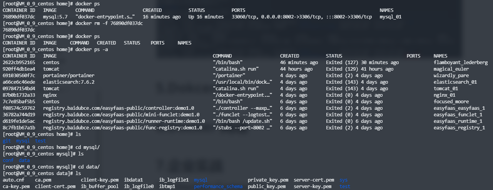

# 1.什么是容器数据卷

## 1.1 Docker 的理念回顾

将应用和运行的环境打包形成容器运行，运行可以伴随着容器，但是我们对于数据的要求，是希望能够
持久化的。

就好比，你安装一个 MySQL，结果你把容器删了，就相当于删库跑路了。

所以我们希望容器之间有可能可以共享数据，Docker 容器产生的数据，如果不通过 docker commit 生成
新的镜像，使得数据作为镜像的一部分保存下来，那么当容器删除后，数据自然也就没有了。

为了能保存数据在 Docker 中我们就可以使用卷，让数据挂载宿主机本地，这样数据就不会因为容器删除
而丢失了。

## 1.2 作用

卷就是目录或者文件，存在一个或者多个容器中，由 docker 挂载到容器，但不属于联合文件系统，因此
能够绕过 Union File System ， 提供一些用于持续存储或共享数据的特性：

卷的设计目的就是数据的持久化，完全独立于容器的生存周期，因此 Docker 不会在容器删除时删除其挂
载的数据卷。

## 1.3 特点

1. 数据卷可在容器之间共享或重用数据；
2. 卷中的更改可以直接生效；
3. 数据卷中的更改不会包含在镜像的更新中；
4. 数据卷的生命周期一直持续到没有容器使用它为止

总结一句话： **容器的持久化和同步操作，容器间也是可以数据共享的**。

# 2.使用数据卷

## 2.1 直接使用命令的方式来挂载

直接使用命令的方式来挂载	-v

``` shell
$ docker run -it -v 主机的目录地址:容器的目录地址

# 测试
$ docker run -it -v /home/test:/home centos /bin/bash
```

启动之后可以通过 `docker inspect <容器 id>` 命令查看容器详细看看是否挂载成功


# 3.实战：安装MySQL

思考：MySQL的数据持久化问题

## 3.1 获取镜像

``` bash
$ docker pull mysql:5.7
```

## 3.2 运行容器

运行容器，需要做数据挂载

``` bash
$ docker run -d -p 8002:3306 -v /home/mysql/conf:/etc/mysql/conf.d -v /home/mysql/data/:/var/lib/mysql
```

## 3.3 安装启动 MySQL

1.安装启动 MySQL ，需要配置密码，官方配置方式

``` bash
$ docker run --name some-mysql -e MYSQL_ROOT_PASSWORD=my-secret-pw -d mysql:tag

# mysql 完整启动命令
# -d 后台运行
# -p 端口映射
# -v 卷挂载
# -e 环境配置
# --name 容器名称

# 测试
$ docker run -d -p 8002:3306 -v /home/mysql/conf:/etc/mysql/conf.d -v /home/mysql/data/:/var/lib/mysql -e MYSQL_ROOT_PASSWORD=123456 --name mysql_01 mysql:5.7
```

2.启动成功之后，我们在本地使用 sqlyog 来连接测试，sqlyog 连接到服务器的 8002，8002 和容器内的 3306 端口映射，连接成功


3.在本地测试创建一个数据库 test，查看路径是否成功映射


4.假设我们将容器删除



发现挂载在本地的数据卷依旧没有丢失，这就实现了容器持久化功能

# 4.具名和匿名挂载

## 4.1 匿名挂载

1.匿名挂载

``` bash
# -v 容器内路径
# -P 随机ip映射
$ docker run -d -P --name nginx_02 -v /ect/nginx nginx
```

2.查看所有 volume 的情况

``` bash
$ docker volume ls
DRIVER    VOLUME NAME
local     564aa630b97047f9c658013d4c6897792516e444f7714b783701e5b8228c1ac8	# 匿名卷挂载
local     a902979d3f0ddf4d5841da5d79e5f6e9fd51f33b3f33a54f1f9478b6156952de
local     eaaf4bcf2f3dd23ff2f2b3f30c143c1593d169bb4154f9402ceb44453172a902
```

## 4.2 具名挂载

1.具名挂载

``` bash
# -v 卷名:容器内路径
$ docker run -d -P --name nginx_03 -v juming_nginx:/etc/nginx nginx

# 测试
$ docker run -d -P --name nginx_03 -v juming_nginx:/etc/nginx nginx
56883947fac1952feda2e28986fc668deefdf378a33a4c6ec67080bc2669db13

$ docker volume ls
DRIVER    VOLUME NAME
local     juming_nginx
```

2.查看一下这个卷

``` bash
$ docker volume inspect 卷名

# 测试
$ docker volume inspect juming_nginx
[
    {
        "CreatedAt": "2021-05-05T14:33:40+08:00",
        "Driver": "local",
        "Labels": null,
        "Mountpoint": "/var/lib/docker/volumes/juming_nginx/_data",
        "Name": "juming_nginx",
        "Options": null,
        "Scope": "local"
    }
]
```

3.如何确定是具名挂载还是匿名挂载，还是指定路径挂载

``` bash
# -v 容器内路径				 	 # 匿名挂载
# -v 卷名:容器内路径				# 具名挂载
# -v /宿主机路径:容器内路径		  # 指定路径挂载
```

4.# 扩展

``` bash
# 通过 -v 容器内路径:ro|rw 改变读写权限

# ro readonly 只读

# rw readwrite 可读可写

# 一旦这个设置了容器的权限，容器对我们挂载出来的内容就有限定了

$ docker run -d -P --name nginx_xx -v juming-nginx:/etc/nginx:ro nginx
$ docker run -d -P --name nginx_xx -v juming-nginx:/etc/nginx:rw nginx

# ro 只要看到 ro 就说明这个路径只能通过宿主机来操作，容器内是无法操作的
```

## 4.2 小结

所有的 docker 容器内的卷，没有指定目录的情况下，都是在 `/var/lib/docker/volumes/卷名/_data` 目录下
我们通过具名挂载可以方便的找到我们的一个卷，大多数情况都是使用具名挂载。

# 5.数据卷容器

命名的容器挂载数据卷，其他容器通过挂载这个（父容器）实现数据共享，挂载数据卷的容器，称之为
数据卷容器。

通过参数 `--volumes-from `来继承父容器的数据卷，实现容器间的数据共享：

``` bash
$ docker run -it --volumes-from <父容器id|名称> <镜像id|名称>
```

容器之间配置信息的传递，数据卷的生命周期一直持续到没有容器使用它为止，存储在本机的文件则会一直保留。

