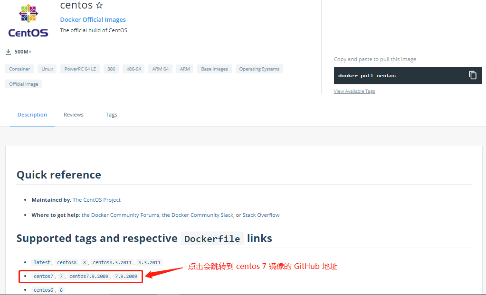
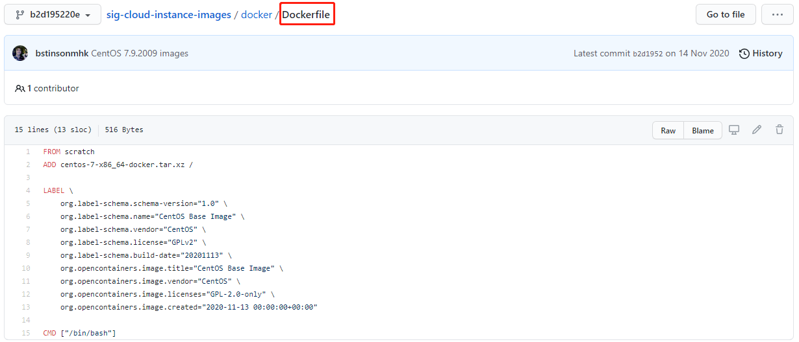
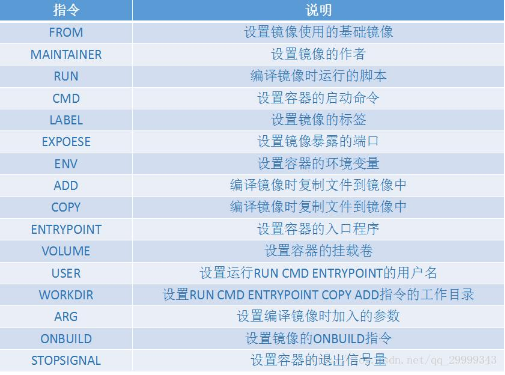
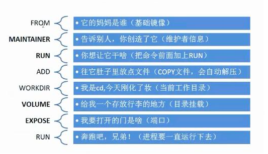
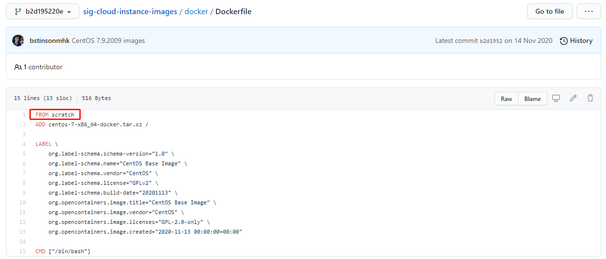
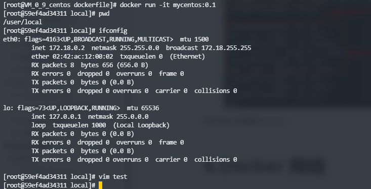
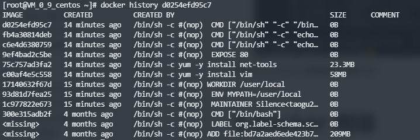
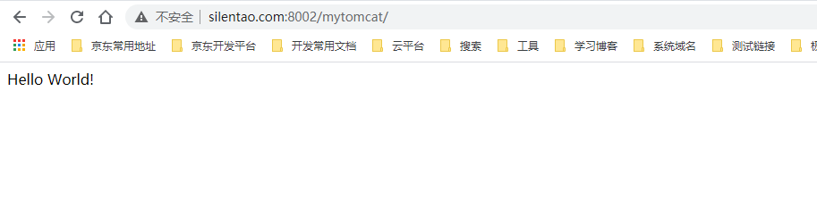

# 1.什么是DockerFile

dockerfile 是用来构建 docker 镜像的文件，命令参数文件。

构建步骤：

1. 编写一个 dockerfile 文件；
2. `docker build` 构建一个镜像；
3. `docker run` 运行镜像；
4. `docker push` 发布镜像（DockerHub、阿里云镜像仓库）。

查看一下官方是怎么做的，在 [hub.docker.com](https://hub.docker.com/) 搜索 centos ，然后点击跳转到 centos 7 镜像的 GitHub 地址：



跳转到 centos 7 镜像的 GitHub 地址，里面有一个 dockerfile 文件：



发现很多官方的镜像都是基础包，很多功能都没有，我们通常会搭建自己的镜像。

# 2.DockerFile 的构建过程

DockerFile 命令



**基础知识**：

1. 每个保留关键字（指令）都必须是大写字母；
2. 执行从上到下顺序执行；
3. \# 表示注释；
4. 每一个指令都会创建提交一个新的镜像层，并提交。


**流程**：

1. docker 从基础镜像运行一个容器；
2. 执行一条指令并对容器做出修改；
3. 执行类似 docker commit 的操作提交一个新的镜像层；
4. Docker 再基于刚提交的镜像运行一个新容器；
5. 执行 dockerfile 中的下一条指令直到所有指令都执行完成。

**说明**：
从应用软件的角度来看 DockerFile，docker 镜像与 docker 容器分别代表软件的三个不同阶段。

- DockerFile 是软件的原材料 （代码）
- Docker 镜像则是软件的交付品 （.apk）
- Docker 容器则是软件的运行状态 （客户下载安装执行）

Dockerfile 是面向开发的，我们以后要发布项目，做镜像，就需要编写 dockerfile 文件，这个文件十分简单，Docker 镜像逐渐成为企业交付的标准，必须要掌握。

DockerFile：需要定义一个 DockerFile，DockerFile 定义了进程需要的一切东西。DockerFile 涉及的内容
包括执行代码或者是文件、环境变量、依赖包、运行时环境、动态链接库、操作系统的发行版、服务进
程和内核进程（当引用进行需要和系统服务和内核进程打交道，这时需要考虑如何设计 namespace 的权
限控制）等等。

- DockerFile：构建文件，定义了一切的步骤，源代码

- DockerImages：通过 DockerFile 构建生成的镜像，最终发布和运行的产品
- Docker 容器：容器就是镜像运行起来通过服务器

# 3.DockerFile 指令

**关键字：**

``` shell
FROM 		# 基础镜像，当前新镜像是基于哪个镜像的
MAINTAINER 	# 镜像维护者的姓名混合邮箱地址（姓名 + 邮箱）
RUN 		# 容器构建时需要运行的命令
EXPOSE 		# 当前容器对外保留出的端口
WORKDIR 	# 指定在创建容器后，终端默认登录的进来工作目录，一个落脚点
ENV 		# 用来在构建镜像过程中设置环境变量
ADD 		# 将宿主机目录下的文件拷贝进镜像且ADD命令会自动处理URL和解压tar压缩包
COPY 		# 类似ADD，拷贝文件和目录到镜像中！
VOLUME 		# 容器数据卷，用于数据保存和持久化工作
CMD 		# 指定一个容器启动时要运行的命令，dockerFile中可以有多个CMD指令，但只有最后一个生效！
ENTRYPOINT 	# 指定一个容器启动时要运行的命令！和CMD一样，但是ENTRYPOINT可以追加命令
ONBUILD 	# 当构建一个被继承的DockerFile时运行命令，父镜像在被子镜像继承后，父镜像的ONBUILD被触发
```



# 4.实战测试

Docker Hub 中 99% 的镜像都是从这个基础镜像 `FROM scratch` 过来的，然后配置需要的软件来进行构建



## 4.1 创建一个自己的 centos

1.编写 DockerFile 的文件

``` dockerfile
FROM centos
MAINTAINER Silence<taogu2010@yeah.net>

ENV MYPATH /user/local
WORKDIR $MYPATH

RUN yum -y install vim
RUN yum -y install net-tools

EXPOSE 80

CMD echo $MYPATH
CMD echo "----end----"
CMD /bin/bash
```

2.通过这个文件构建镜像，命令如下所示：

``` bash
$ docker build -f dockerfile文件路径 -t 镜像名:[tag] .
```

构建镜像

``` shell
$ docker build -f dockerfile-centos -t mycentos:0.1 .
Sending build context to Docker daemon  2.048kB
Step 1/10 : FROM centos
 ---> 300e315adb2f
Step 2/10 : MAINTAINER Silence<taogu2010@yeah.net>
 ---> Running in 91d808039ac3
Removing intermediate container 91d808039ac3
 ---> 1c977822e673
Step 3/10 : ENV MYPATH /user/local
 ---> Running in 500d370c3d37
Removing intermediate container 500d370c3d37
 ---> 93d81d7fea25
Step 4/10 : WORKDIR $MYPATH
 ---> Running in dc3d0adbe2ba
Removing intermediate container dc3d0adbe2ba
 ---> 17140632f67d
Step 5/10 : RUN yum -y install vim
 ---> Running in fe583929f07a

...

Installed:
  gpm-libs-1.20.7-15.el8.x86_64         vim-common-2:8.0.1763-15.el8.x86_64    
  vim-enhanced-2:8.0.1763-15.el8.x86_64 vim-filesystem-2:8.0.1763-15.el8.noarch
  which-2.21-12.el8.x86_64             

Complete!
Removing intermediate container fe583929f07a
 ---> c00af4e5c558
Step 6/10 : RUN yum -y install net-tools
 ---> Running in c90ce4efcdff

...

Installed:
  net-tools-2.0-0.52.20160912git.el8.x86_64                                     

Complete!
Removing intermediate container c90ce4efcdff
 ---> 75c757ad3fa2
Step 7/10 : EXPOSE 80
 ---> Running in 4ba3e0b63266
Removing intermediate container 4ba3e0b63266
 ---> 9ef4bad2c5be
Step 8/10 : CMD echo $MYPATH
 ---> Running in 988f44a8da7f
Removing intermediate container 988f44a8da7f
 ---> c6e4d6380759
Step 9/10 : CMD echo "----end----"
 ---> Running in 9e48a8a48338
Removing intermediate container 9e48a8a48338
 ---> fb4a30814deb
Step 10/10 : CMD /bin/bash
 ---> Running in d200a20c4553
Removing intermediate container d200a20c4553
 ---> d0254efd95c7
Successfully built d0254efd95c7
Successfully tagged mycentos:0.1
```

3.测试运行，对比：之前原生的centos


我们自己构建的centos：



我们可以列出本地镜像的构建历史：

命令：`docker history d0254efd95c7(镜像id)`



## 4.2 CMD 和 ENTRYPOINT 的区别

``` shell
CMD 		# 指定一个容器启动时要运行的命令，dockerFile中可以有多个CMD指令，但只有最后一个生效！
ENTRYPOINT 	# 指定一个容器启动时要运行的命令！和CMD一样，但是ENTRYPOINT可以追加命令
```

### 4.2.1 测试 CMD

1.编写 dockerfile 文件

``` dockerfile
FROM centos
CMD ["ls","-a"]
```

2.构建镜像

``` bash
$ docker build -f dockerfile-cmd-test -t cmd-test:0.1 .
```

3.运行容器，发现 ls -a 命令生效了

``` bash
$ docker run 537654a10f8f
.
..
.dockerenv
bin
dev
etc
home
lib
lib64
lost+found
media
mnt
opt
proc
root
run
sbin
srv
sys
tmp
usr
```

4.想追加一个命令参数 -l ，使容器启动时执行 `ls -al`

``` bash
$ docker run 537654a10f8f -l
docker: Error response from daemon: OCI runtime create failed: container_linux.go:367: starting container process caused: exec: "-l": executable file not found in $PATH: unknown.
```

CMD 的情况下， -l 替换了 `CMD ["ls","-a"]` 命令， -l 不是命令所以报错了

### 4.2.2 测试 ENTRYPOINT

1.编写 DockerFile 的文件

``` dockerfile
FROM centos
ENTRYPOINT ["ls","-a"]
```

2.构建镜像

``` bash
$ docker build -f dockerfile-cmd-entrypoint -t entrypoint-test:0.1 .
```

3.运行容器，发现 ls -a 命令生效了

``` bash
$ docker run 036025f64cd5
.
..
.dockerenv
bin
dev
etc
home
lib
lib64
lost+found
media
mnt
opt
proc
root
run
sbin
srv
sys
tmp
usr
var
```

4.追加命令是直接拼接在 ENTRYPOINT 命令后面的，所有执行成功

``` shell
$ docker run 036025f64cd5 -l
total 56
drwxr-xr-x   1 root root 4096 May  6 16:26 .
drwxr-xr-x   1 root root 4096 May  6 16:26 ..
-rwxr-xr-x   1 root root    0 May  6 16:26 .dockerenv
lrwxrwxrwx   1 root root    7 Nov  3  2020 bin -> usr/bin
drwxr-xr-x   5 root root  340 May  6 16:26 dev
drwxr-xr-x   1 root root 4096 May  6 16:26 etc
drwxr-xr-x   2 root root 4096 Nov  3  2020 home
lrwxrwxrwx   1 root root    7 Nov  3  2020 lib -> usr/lib
lrwxrwxrwx   1 root root    9 Nov  3  2020 lib64 -> usr/lib64
drwx------   2 root root 4096 Dec  4 17:37 lost+found
drwxr-xr-x   2 root root 4096 Nov  3  2020 media
drwxr-xr-x   2 root root 4096 Nov  3  2020 mnt
drwxr-xr-x   2 root root 4096 Nov  3  2020 opt
dr-xr-xr-x 114 root root    0 May  6 16:26 proc
dr-xr-x---   2 root root 4096 Dec  4 17:37 root
drwxr-xr-x  11 root root 4096 Dec  4 17:37 run
lrwxrwxrwx   1 root root    8 Nov  3  2020 sbin -> usr/sbin
drwxr-xr-x   2 root root 4096 Nov  3  2020 srv
dr-xr-xr-x  13 root root    0 May  5 07:10 sys
drwxrwxrwt   7 root root 4096 Dec  4 17:37 tmp
drwxr-xr-x  12 root root 4096 Dec  4 17:37 usr
drwxr-xr-x  20 root root 4096 Dec  4 17:37 var
```

### 4.2.3 小结

DockerFile 中很多命令是相似，要了解它们的区别，必须通过实践去测试效果。

## 4.3 实战：tomcat 镜像

### 4.3.1 制作 tomcat 镜像

1.准备镜像文件 tomcat 压缩包，jdk 压缩包


2.编写 dockerfile 文件，官方命名 `Dockerfile`，build 会自动寻找这个文件，就不需要通过 `-f` 去指定了

``` dockerfile
FROM centos
MAINTAINER Silence<taogu2010@yeah.net>

COPY README.md /usr/local/README.md

ADD jdk-8u111-linux-x64.tar.gz /usr/local
ADD apache-tomcat-8.5.8.tar.gz /usr/local

RUN yum -y install vim

ENV MYPATH /usr/local
WORKDIR $MYPATH

ENV JAVA_HOME /usr/local/jdk1.8.0_111
ENV CLASSPATH $JAVA_HOME/lib/dt.jar:$JAVA_HOME/lib/tools.jar
ENV CATALINA_HOME /usr/local/apache-tomcat-8.5.8
ENV CATALINA_BASH /usr/local/apache-tomcat-8.5.8
ENV PATH $PATH:$JAVA_HOME/bin:$CATALINA_HOME/lib:$CATALINA_HOME/bin

EXPOSE 8080

CMD /usr/local/apache-tomcat-8.5.8/bin/startup.sh && tail -F /usr/local/apache-tomcat-8.5.8/bin/logs/catalina.out
```

3.构建镜像

``` bash
$ docker build -t silence-tomcat:1.0 .
```

### 4.3.2 启动 tomcat 镜像

1.启动 tomcat 镜像，绑定 8002 端口，并挂载目录

``` bash
$ docker run -d -p 8002:8080 --name mytomcat -v /home/dockerVolume/tomcat/mytomcat:/usr/local/apache-tomcat-8.5.8/webapps/mytomcat -v /home/dockerVolume/tomcat/logs:/usr/local/apache-tomcat-8.5.8/logs silence-tomcat:1.0
12b16079025b9894699a4f4f25eee181017c2323454471546b285b48c9a674af
```

2.访问 tomcat


### 4.3.3 发布项目到 tomcat

1.到挂载的 `/home/dockerVolume/tomcat/mytomcat` 目录下创建 `WEB-INF` 目录：

``` bash
$ mkdir WEB-INF
$ ls
WEB-INF
```

2.在 `WEB-INF` 目录下创建 `web.xml` 文件，并输入以下内容：

``` xml
<?xml version="1.0" encoding="UTF-8"?>
<web-app version="2.4" 
    xmlns="http://java.sun.com/xml/ns/j2ee" 
    xmlns:xsi="http://www.w3.org/2001/XMLSchema-instance"
    xsi:schemaLocation="http://java.sun.com/xml/ns/j2ee 
        http://java.sun.com/xml/ns/j2ee/web-app_2_4.xsd">
</web-app>
```

3.返回到上级 `/home/dockerVolume/tomcat/mytomcat` 目录，创建 index.jsp 文件，并输入以下内容：

``` jsp
<%@ page language="java" contentType="text/html; charset=UTF-8"
    pageEncoding="UTF-8"%>
<!DOCTYPE html>
    <html>
        <head>
            <meta charset="utf-8">
            <title>Hello,Silence</title>
        </head>
    <body>
        Hello World!<br/>
        <%
            System.out.println("----test web logs");
        %>
    </body>
</html>
```

4.可以访问到项目，通过这样的方式发布，可以直接再宿主机上发布项目



# 5.发布自己的镜像

## 5.1 发布镜像到 DockerHub

1.地址 https://hub.docker.com/ 注册自己的账号

2.确定这个账号可以登录

3.在我们服务器上提交自己的镜像

``` shell
$ docker login --help
Usage:  docker login [OPTIONS] [SERVER]

Log in to a Docker registry.
If no server is specified, the default is defined by the daemon.

Options:
  -p, --password string   Password
      --password-stdin    Take the password from stdin
  -u, --username string   Username
  
[root@VM_0_9_centos ~]# docker login -u silence
Password: 
Error response from daemon: Get https://registry-1.docker.io/v2/: unauthorized: incorrect username or password
```

3.登录

``` bash
$ docker login
Login with your Docker ID to push and pull images from Docker Hub. If you don't have a Docker ID, head over to https://hub.docker.com to create one.
Username: silentao
Password:
WARNING! Your password will be stored unencrypted in /root/.docker/config.json.
Configure a credential helper to remove this warning. See
https://docs.docker.com/engine/reference/commandline/login/#credentials-store

Login Succeeded
```

4.登录完毕后就可以提交镜像了，用 `docker push` 命令

``` shell
# 给镜像添加一个 tag
docker tag 镜像id 镜像名称:tag

# docker push 上去即可，要带上版本号
docker push 镜像名称:tag
```

# 6.总结


