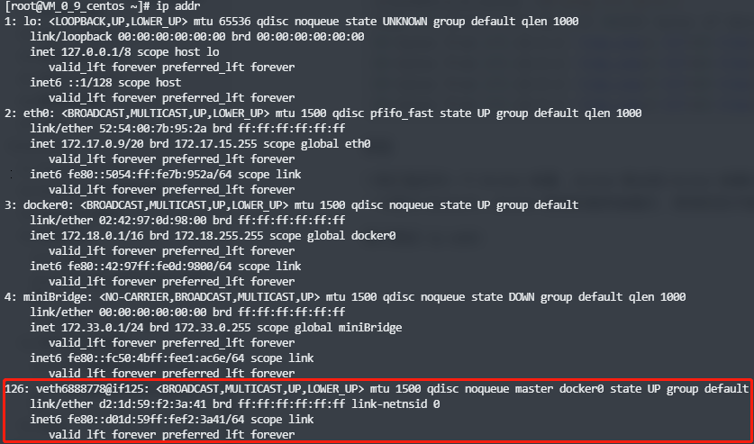
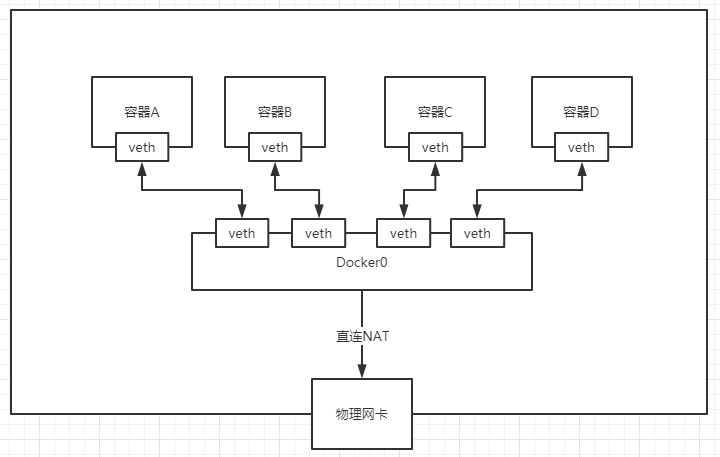
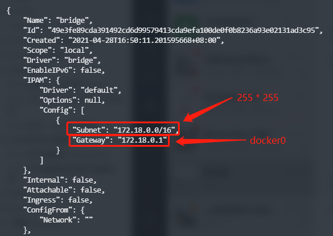
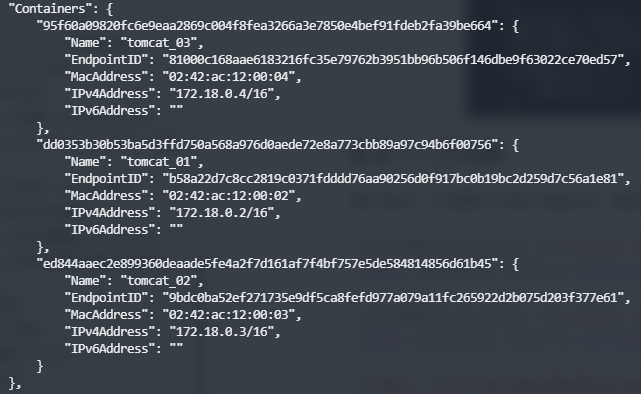
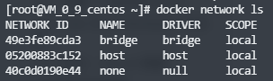
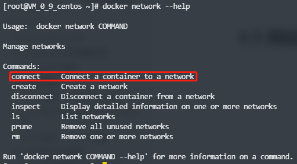
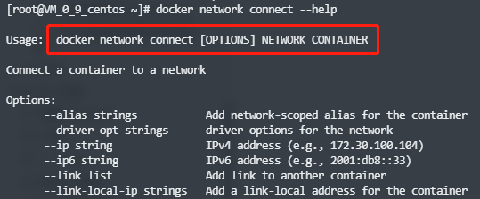
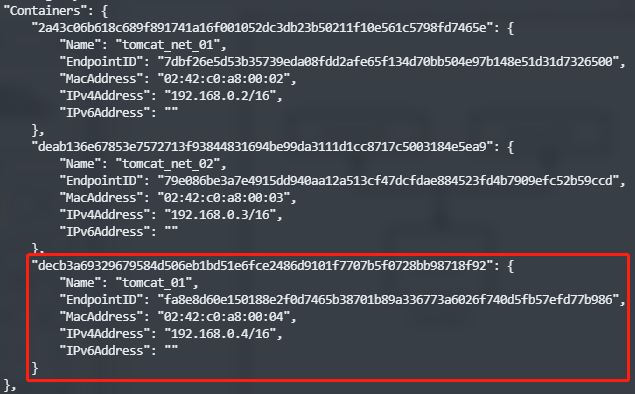
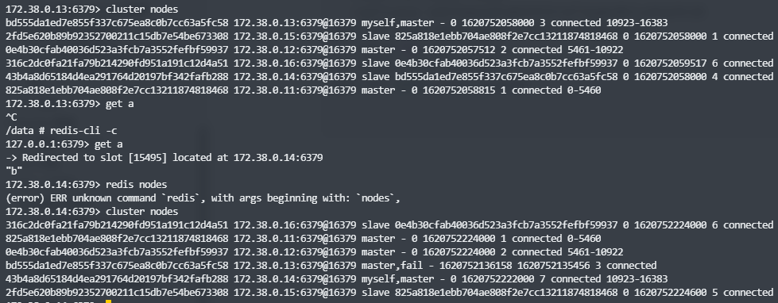

# 1.理解 Docker0

## 1.1 查看 ip addr

通过 `ip addr` 命令查看服务器网络信息]


三个网络

问题：docker 是如何处理容器网络访问的？


1.启动一个tomcat

``` bash
$ docker run -d -P --name tomcat_01 tomcat
```

2.查看容器的内部网络地址 ip addr，发现容器启动的时候会得到一个 eth0@if126 ip 地址，docker 分配的

``` bash
$ docker exec -it tomcat_01 ip addr
1: lo: <LOOPBACK,UP,LOWER_UP> mtu 65536 qdisc noqueue state UNKNOWN group default qlen 1000
    link/loopback 00:00:00:00:00:00 brd 00:00:00:00:00:00
    inet 127.0.0.1/8 scope host lo
       valid_lft forever preferred_lft forever
125: eth0@if126: <BROADCAST,MULTICAST,UP,LOWER_UP> mtu 1500 qdisc noqueue state UP group default 
    link/ether 02:42:ac:12:00:02 brd ff:ff:ff:ff:ff:ff link-netnsid 0
    inet 172.18.0.2/16 brd 172.18.255.255 scope global eth0
       valid_lft forever preferred_lft forever
```

3.在宿主机上通过 ping 命令去 ping docker 分配的 ip 地址，能 ping 通 docker 容器内部

``` shell
ping 172.18.0.2
PING 172.18.0.2 (172.18.0.2) 56(84) bytes of data.
64 bytes from 172.18.0.2: icmp_seq=1 ttl=64 time=0.066 ms
64 bytes from 172.18.0.2: icmp_seq=2 ttl=64 time=0.059 ms
64 bytes from 172.18.0.2: icmp_seq=3 ttl=64 time=0.051 ms
64 bytes from 172.18.0.2: icmp_seq=4 ttl=64 time=0.054 ms
```

## 1.2 原理

1.我们每启动一个 docker 容器，docker 就会给 docker 容器分配一个 ip 地址，我们只要安装了 docker，就会有一个网卡 docker0，docker 使用的是桥接模式，使用的技术是 evth-pair 技术。

再次测试 `ip addr`



2.再启动一个容器测试，发现又多了一对网卡


> 我们发现这个容器生成的网卡，都是一对一对的
>
> evth-pair 就是一对虚拟设备接口，他们都是成对出现的，一端连着协议，一端彼此相连
>
> 正因为有这个特性 evth-pair 充当一个桥梁，连接各种虚拟的网络设备的
>
> OpenStac，Docker 容器之间的连接，ovs 的连接，都是使用 evth-pair 技术

3.测试 tomcat_01 和 tomcat_02 是否可以 ping 通

``` shell
# 容器和容器之间的网络是可以相互 ping 通的
[root@VM_0_9_centos ~]# docker exec -it tomcat_02 ping 172.18.0.2
PING 172.18.0.2 (172.18.0.2) 56(84) bytes of data.
64 bytes from 172.18.0.2: icmp_seq=1 ttl=64 time=0.086 ms
64 bytes from 172.18.0.2: icmp_seq=2 ttl=64 time=0.041 ms
```

绘制一个网络模型图


结论：tomcat_01 和 tomcat_02 是公用的一个路由器：docker0

所有的容器不指定网络的情况下，都是 docker0 路由的，docker 会给我们的容器分配一个默认的可用 ip 地址

## 1.3 小结

Docker 使用的是 Linux 的桥接，宿主机中是一个 Docker 容器的网桥 docker0



**Docker 中的所有网络接口都是虚拟的，虚拟网络转发效率高**。

只要删除容器，对应的网桥一对就没了。



# 2.link

1.每次启动一个容器 ip 地址可能会变，是否可以通过名字来访问容器？

``` bash
$ docker exec -it tomcat_02 ping tomcat_01
ping: tomcat_01: Name or service not known

$ docker exec -it tomcat_01 ping tomcat_02
ping: tomcat_02: Name or service not known
```

实际证明，是行不通的。

2.通过 --link 既可以解决网络通过名字的连通问题

``` bash
$ docker run -d -P --name tomcat_03 --link tomcat_02 tomcat
95f60a09820fc6e9eaa2869c004f8fea3266a3e7850e4bef91fdeb2fa39be664
```

发现通过 link 启动的容器是可以通过名字连通

``` bash
$ docker exec -it tomcat_03 ping tomcat_02
PING tomcat_02 (172.18.0.3) 56(84) bytes of data.
64 bytes from tomcat_02 (172.18.0.3): icmp_seq=1 ttl=64 time=0.085 ms
64 bytes from tomcat_02 (172.18.0.3): icmp_seq=2 ttl=64 time=0.065 ms
64 bytes from tomcat_02 (172.18.0.3): icmp_seq=3 ttl=64 time=0.066 ms
64 bytes from tomcat_02 (172.18.0.3): icmp_seq=4 ttl=64 time=0.061 ms
```

但是反过来是无法连通的

``` shell
$ docker exec -it tomcat_02 ping tomcat_03
ping: tomcat_03: Name or service not known
```

3.通过命令 `docker network inspect 容器id` 查看容器详情



其实 tomcat_03 就是在本地 hosts 配置了 tomcat_02 的 ip 地址，查看 hosts 配置

``` shell
$ docker exec -it tomcat_03 cat /etc/hosts
127.0.0.1       localhost
::1     localhost ip6-localhost ip6-loopback
fe00::0 ip6-localnet
ff00::0 ip6-mcastprefix
ff02::1 ip6-allnodes
ff02::2 ip6-allrouters
# 发现这里用 tomcat_02 绑定了 tomcat_02 的 ip 地址
172.18.0.3      tomcat_02 ed844aaec2e8
172.18.0.4      95f60a09820f
```

--link 就是在 hosts 配置中增加了一个容器名称与 ip 地址的映射，不建议使用 --link，docker0 的问题，不支持容器名连接访问。

# 3.自定义网络

查看所有的 docker 网络



## 3.1 网络模式(DRIVER)

bridge ：桥接模式，在 docker 上面搭桥（默认）

none：不配置网络

host：和宿主机共享网络

container：容器网络连通（用的少，局限性大）

使用直接启动命令，会有一个默认的参数 --net brige，指的就是 docker0，下面两条命令等同：

``` bash
$ docker run -d -P --name tomcat_01 tomcat
$ docker run -d -P --name tomcat_01 --net bridge tomcat
```

docker0 特定：默认，域名不能访问，--link 才能打通域名连接

## 3.2 自定义网络

可以通过下面的参数自定义一个网络：

> --driver bridge
>
> --subnet 192.168.0.0/16 [192.168.0.2 ~ 192.168.255.255]
>
> --gateway 192.168.0.1

1.自定义一个名为 mynet 的网络：

``` shell
$ docker network create --driver bridge --subnet 192.168.0.0/16 --gateway 192.168.0.1 mynet
124454340c2323001dc06b025630c6a1df346e58f6c9e5e17ac002d686862423
```

查看发现多了一个网络：mynet

``` bash
docker network ls
NETWORK ID     NAME      DRIVER    SCOPE
49e3fe89cda3   bridge    bridge    local
05200883c152   host      host      local
124454340c23   mynet     bridge    local
40c0d0190e44   none      null      local
```

自己的网络就创建好了


2.用自定义的网络启动两个 tomcat

``` bash
$ docker run -d -P --name tomcat_net_01 --net mynet tomcat
2a43c06b618c689f891741a16f001052dc3db23b50211f10e561c5798fd7465e
$ docker run -d -P --name tomcat_net_02 --net mynet tomcat
deab136e67853e7572713f93844831694be99da3111d1cc8717c5003184e5ea9
```

3.查看自定义网络信息

``` bash
$ docker network inspect mynet
[
    {
        "Name": "mynet",
        "Id": "124454340c2323001dc06b025630c6a1df346e58f6c9e5e17ac002d686862423",
        "Created": "2021-05-11T23:37:27.259864371+08:00",
        "Scope": "local",
        "Driver": "bridge",
        "EnableIPv6": false,
        "IPAM": {
            "Driver": "default",
            "Options": {},
            "Config": [
                {
                    "Subnet": "192.168.0.0/16",
                    "Gateway": "192.168.0.1"
                }
            ]
        },
        "Internal": false,
        "Attachable": false,
        "Ingress": false,
        "ConfigFrom": {
            "Network": ""
        },
        "ConfigOnly": false,
        "Containers": {
            "2a43c06b618c689f891741a16f001052dc3db23b50211f10e561c5798fd7465e": {
                "Name": "tomcat_net_01",
                "EndpointID": "7dbf26e5d53b35739eda08fdd2afe65f134d70bb504e97b148e51d31d7326500",
                "MacAddress": "02:42:c0:a8:00:02",
                "IPv4Address": "192.168.0.2/16",
                "IPv6Address": ""
            },
            "deab136e67853e7572713f93844831694be99da3111d1cc8717c5003184e5ea9": {
                "Name": "tomcat_net_02",
                "EndpointID": "79e086be3a7e4915dd940aa12a513cf47dcfdae884523fd4b7909efc52b59ccd",
                "MacAddress": "02:42:c0:a8:00:03",
                "IPv4Address": "192.168.0.3/16",
                "IPv6Address": ""
            }
        },
        "Options": {},
        "Labels": {}
    }
]
```

自定义的网络可以直接通过容器名称来建立网络连接，不需要使用 --link，发现两个 tomcat 可以通过容器名称相互 ping 通：

``` bash
$ docker exec -it tomcat_net_01 ping 192.168.0.3
PING 192.168.0.3 (192.168.0.3) 56(84) bytes of data.
64 bytes from 192.168.0.3: icmp_seq=1 ttl=64 time=0.168 ms
64 bytes from 192.168.0.3: icmp_seq=2 ttl=64 time=0.085 ms
64 bytes from 192.168.0.3: icmp_seq=3 ttl=64 time=0.108 ms
^C
--- 192.168.0.3 ping statistics ---
3 packets transmitted, 3 received, 0% packet loss, time 2ms
rtt min/avg/max/mdev = 0.085/0.120/0.168/0.036 ms

$ docker exec -it tomcat_net_01 ping tomcat_net_02
PING tomcat_net_02 (192.168.0.3) 56(84) bytes of data.
64 bytes from tomcat_net_02.mynet (192.168.0.3): icmp_seq=1 ttl=64 time=0.106 ms
64 bytes from tomcat_net_02.mynet (192.168.0.3): icmp_seq=2 ttl=64 time=0.059 ms
64 bytes from tomcat_net_02.mynet (192.168.0.3): icmp_seq=3 ttl=64 time=0.065 ms
```

自定义的网络 docker 都已经帮我们维护好了对应的网络关系，推荐我们平时这样使用网络

好处：

- redis - 不同的集群使用不同的网络，保证集群是安全和健康的
- mysql - 不同的集群使用不同的网络，保证集群是安全和健康的


# 4.网络连通

通过 `docker network` 连通网络



使用方法



1.打通 mynet 和 tomcat_01 的网络连接

``` bash
$ docker network connect mynet tomcat_01
```

测试是否打通 tomcat_01 - mynet 之间的网络

``` bash
$ docker network inspect mynet
```



连通之后就是将 tomcat_01 放到了 mynet 的网络下，一个容器两个 ip 地址

2.测试 tomcat_01 到 tomcat_net_01 的网络，发现是打通的

``` bash
$ docker exec -it tomcat_01 ping tomcat_net_01
PING tomcat_net_01 (192.168.0.2) 56(84) bytes of data.
64 bytes from tomcat_net_01.mynet (192.168.0.2): icmp_seq=1 ttl=64 time=0.063 ms
64 bytes from tomcat_net_01.mynet (192.168.0.2): icmp_seq=2 ttl=64 time=0.072 ms
64 bytes from tomcat_net_01.mynet (192.168.0.2): icmp_seq=3 ttl=64 time=0.039 ms
```

3.测试 tomcat_02 到 tomcat_net_01 的网络，发现依旧是无法连通的

``` shell
$ docker exec -it tomcat_02 ping tomcat_net_01
ping: tomcat_net_01: Name or service not known
```

结论：假设要跨网络操作别的容器，就需要使用 `docker network connect` 连通

# 5.实战：部署 Redis 集群

三主三从的 redis 集群


1.创建网卡

``` bash
$ docker network create redis --subnet 172.38.0.0/16
```

2.通过脚本创建六个 redis 配置

``` shell
for port in $(seq 1 6); \
do \
mkdir -p /mydata/redis/node-${port}/conf
touch /mydata/redis/node-${port}/conf/redis.conf
cat << EOF >/mydata/redis/node-${port}/conf/redis.conf
port 6379
bind 0.0.0.0
cluster-enabled yes
cluster-config-file nodes.conf
cluster-node-timeout 5000
cluster-announce-ip 172.38.0.1${port}
cluster-announce-port 6379
cluster-announce-bus-port 16379
appendonly yes
EOF
done
```

3.通过脚本启动6个 Redis

``` shell
for port in $(seq 1 6); \
do \
docker run -p 637${port}:6379 -p 1637${port}:16379 --name redis_0${port} \
-v /mydata/redis/node-${port}/data:/data \
-v /mydata/redis/node-${port}/conf/redis.conf:/etc/redis/redis.conf \
-d --net redis --ip 172.38.0.1${port} redis:5.0.9-alpine3.11 redis-server /etc/redis/redis.conf
done
```

4.进入其中一个 Redis 容器，然后创建 Redis 集群

``` shell
$ redis-cli --cluster create 172.38.0.11:6379 172.38.0.12:6379 172.38.0.13:6379 172.38.0.14:6379 172.38.0.15:6379 172.38.0.16:6379 --cluster-replicas 1
>>> Performing hash slots allocation on 6 nodes...
Master[0] -> Slots 0 - 5460
Master[1] -> Slots 5461 - 10922
Master[2] -> Slots 10923 - 16383
Adding replica 172.38.0.15:6379 to 172.38.0.11:6379
Adding replica 172.38.0.16:6379 to 172.38.0.12:6379
Adding replica 172.38.0.14:6379 to 172.38.0.13:6379
M: 825a818e1ebb704ae808f2e7cc13211874818468 172.38.0.11:6379
   slots:[0-5460] (5461 slots) master
M: 0e4b30cfab40036d523a3fcb7a3552fefbf59937 172.38.0.12:6379
   slots:[5461-10922] (5462 slots) master
M: bd555da1ed7e855f337c675ea8c0b7cc63a5fc58 172.38.0.13:6379
   slots:[10923-16383] (5461 slots) master
S: 43b4a8d65184d4ea291764d20197bf342fafb288 172.38.0.14:6379
   replicates bd555da1ed7e855f337c675ea8c0b7cc63a5fc58
S: 2fd5e620b89b92352700211c15db7e54be673308 172.38.0.15:6379
   replicates 825a818e1ebb704ae808f2e7cc13211874818468
S: 316c2dc0fa21fa79b214290fd951a191c12d4a51 172.38.0.16:6379
   replicates 0e4b30cfab40036d523a3fcb7a3552fefbf59937
Can I set the above configuration? (type 'yes' to accept): yes
>>> Nodes configuration updated
>>> Assign a different config epoch to each node
>>> Sending CLUSTER MEET messages to join the cluster
Waiting for the cluster to join
...
>>> Performing Cluster Check (using node 172.38.0.11:6379)
M: 825a818e1ebb704ae808f2e7cc13211874818468 172.38.0.11:6379
   slots:[0-5460] (5461 slots) master
   1 additional replica(s)
M: 0e4b30cfab40036d523a3fcb7a3552fefbf59937 172.38.0.12:6379
   slots:[5461-10922] (5462 slots) master
   1 additional replica(s)
S: 316c2dc0fa21fa79b214290fd951a191c12d4a51 172.38.0.16:6379
   slots: (0 slots) slave
   replicates 0e4b30cfab40036d523a3fcb7a3552fefbf59937
M: bd555da1ed7e855f337c675ea8c0b7cc63a5fc58 172.38.0.13:6379
   slots:[10923-16383] (5461 slots) master
   1 additional replica(s)
S: 2fd5e620b89b92352700211c15db7e54be673308 172.38.0.15:6379
   slots: (0 slots) slave
   replicates 825a818e1ebb704ae808f2e7cc13211874818468
S: 43b4a8d65184d4ea291764d20197bf342fafb288 172.38.0.14:6379
   slots: (0 slots) slave
   replicates bd555da1ed7e855f337c675ea8c0b7cc63a5fc58
[OK] All nodes agree about slots configuration.
>>> Check for open slots...
>>> Check slots coverage...
[OK] All 16384 slots covered.
```

5.docker 搭建 Redis 高可用集群完成



使用了 docker 之后，所有技术都会变得简单起来