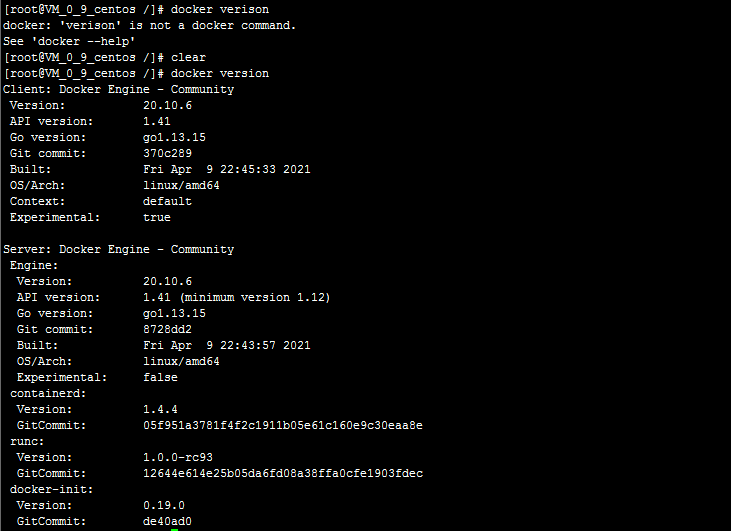
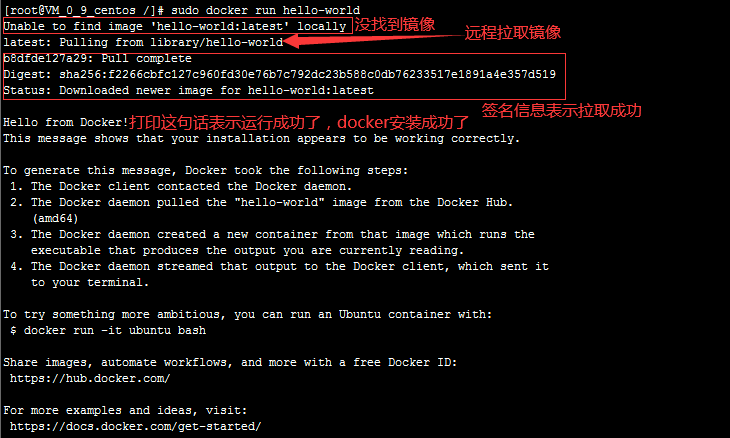
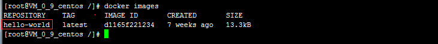

# 1.安装Docker

## 1.1 环境准备

CentOS7


## 1.2 环境查看

``` shel
# 系统环境必须是3.10以上的
[root@VM_0_9_centos /]# uname -r
3.10.0-862.el7.x86_64
```

``` shell
[root@VM_0_9_centos /]# cat /etc/os-release 
NAME="CentOS Linux"
VERSION="7 (Core)"
ID="centos"
ID_LIKE="rhel fedora"
VERSION_ID="7"
PRETTY_NAME="CentOS Linux 7 (Core)"
ANSI_COLOR="0;31"
CPE_NAME="cpe:/o:centos:centos:7"
HOME_URL="https://www.centos.org/"
BUG_REPORT_URL="https://bugs.centos.org/"

CENTOS_MANTISBT_PROJECT="CentOS-7"
CENTOS_MANTISBT_PROJECT_VERSION="7"
REDHAT_SUPPORT_PRODUCT="centos"
REDHAT_SUPPORT_PRODUCT_VERSION="7"
```


## 1.3 安装

帮助文档：https://docs.docker.com/

1.卸载旧的版本

``` shell
sudo yum remove docker \
                  docker-client \
                  docker-client-latest \
                  docker-common \
                  docker-latest \
                  docker-latest-logrotate \
                  docker-logrotate \
                  docker-engine
```

2.需要的安装包

``` shel
sudo yum install -y yum-utils
```

3.设置镜像的仓库

``` shel
# 默认是境外的仓库，很慢不建议使用
sudo yum-config-manager \
    --add-repo \
    https://download.docker.com/linux/centos/docker-ce.repo
    
# 阿里云镜像仓库，推荐使用
sudo yum-config-manager \
    --add-repo \
    http://mirrors.aliyun.com/docker-ce/linux/centos/docker-ce.repo
    
# 更新软件包索引
yum makecache fast
```

4.安装docker docker-ce 社区版 ee 企业版

``` shel
sudo yum install docker-ce docker-ce-cli containerd.io
```

5.启动docker

``` she
sudo systemctl start docker
```

6.使用 `docker version` 查看是否安装成功



7.hello world

``` shel
sudo docker run hello-world
```



8.查看一下下载的hello-world镜像

``` shel
docker images
```




## 1.4 卸载docker

``` shel
# 卸载依赖
sudo yum remove docker-ce docker-ce-cli containerd.io

# 删除docker资源目录
# /var/lib/docker	docker的默认工作路径
sudo rm -rf /var/lib/docker
sudo rm -rf /var/lib/containerd
```


# 2.Docker的常用命令

## 2.1 帮助命令

``` shel
docker version		# 显示docker的版本信息
docker info			# 显示docker的系统信息，包括镜像和容器的数量
docker <命令> --help	# 万能命令
```

帮助文档地址：https://docs.docker.com/reference/


## 2.2 镜像命令

### 2.2.1 `docker images`

查看所有本地主机上的镜像

``` she
[root@VM_0_9_centos /]# docker images
REPOSITORY    TAG       IMAGE ID       CREATED       SIZE
hello-world   latest    d1165f221234   7 weeks ago   13.3kB

# 解释
REPOSITORY		镜像的仓库源
TAG				镜像的标签
IMAGE ID		镜像的id
CREATED			镜像的创建时间
SIZE			镜像的大小

# 可选项
-a, --all             # 列出所有的镜像
-q, --quiet           # 只显示镜像的id
```

### 2.2.2 `docker search`

搜索镜像

``` she
[root@VM_0_9_centos /]# docker search mysql
NAME     DESCRIPTION                                     STARS     OFFICIAL   AUTOMATED
mysql    MySQL is a widely used, open-source relation??  10777     [OK]       
mariadb  MariaDB Server is a high performing open sou??  4058      [OK]

# 可选项，通过收藏来过滤
-f, --filter filter   Filter output based on conditions provided
    --format string   Pretty-print search using a Go template
    --limit int       Max number of search results (default 25)
    --no-trunc        Don't truncate output

--filter=STARS=3000	  # 搜索出来的镜像就是STARS大于3000
[root@VM_0_9_centos /]# docker search mysql --filter=STARS=3000
NAME      DESCRIPTION                                     STARS     OFFICIAL   AUTOMATED
mysql     MySQL is a widely used, open-source relation??  10777     [OK]       
mariadb   MariaDB Server is a high performing open sou??  4058      [OK]       
[root@VM_0_9_centos /]# docker search mysql --filter=STARS=5000
NAME      DESCRIPTION                                     STARS     OFFICIAL   AUTOMATED
mysql     MySQL is a widely used, open-source relation??  10777     [OK]       
```

### 2.2.3 `docker pull`

下载镜像

``` shel
# 下载镜像 docker pull <镜像名称>[:tag]
[root@VM_0_9_centos ~]# docker pull mysql
Using default tag: latest		# 如果不写tag，默认下载latest（最新版本）
latest: Pulling from library/mysql
f7ec5a41d630: Pull complete 	# 分层下载，docker image的核心，联合文件系统
9444bb562699: Pull complete 
6a4207b96940: Pull complete 
181cefd361ce: Pull complete 
8a2090759d8a: Pull complete 
15f235e0d7ee: Pull complete 
d870539cd9db: Pull complete 
493aaa84617a: Pull complete 
bfc0e534fc78: Pull complete 
fae20d253f9d: Pull complete 
9350664305b3: Pull complete 
e47da95a5aab: Pull complete 
Digest: sha256:04ee7141256e83797ea4a84a4d31b1f1bc10111c8d1bc1879d52729ccd19e20a	# 签名
Status: Downloaded newer image for mysql:latest
docker.io/library/mysql:latest	# 所下载docker镜像的真实地址

# 下面两条命令是等价的
docker pull mysql
docker.io/library/mysql:latest

# 指定版本下载
[root@VM_0_9_centos ~]# docker pull mysql:5.7
5.7: Pulling from library/mysql
f7ec5a41d630: Already exists 
9444bb562699: Already exists 
6a4207b96940: Already exists 
181cefd361ce: Already exists 
8a2090759d8a: Already exists 
15f235e0d7ee: Already exists 
d870539cd9db: Already exists 
cb7af63cbefa: Pull complete 
151f1721bdbf: Pull complete 
fcd19c3dd488: Pull complete 
415af2aa5ddc: Pull complete 
Digest: sha256:a655529fdfcbaf0ef28984d68a3e21778e061c886ff458b677391924f62fb457
Status: Downloaded newer image for mysql:5.7
docker.io/library/mysql:5.7
```


### 2.2.4 `docker rmi`

删除镜像

``` shel
[root@VM_0_9_centos ~]# docker rmi -f 镜像id			# 删除指定的镜像
[root@VM_0_9_centos ~]# docker rmi -f 镜像id 镜像id	   # 删除多个镜像
[root@VM_0_9_centos ~]# docker rmi -f $(docker images -aq)	# 删除全部的镜像
```


## 2.3 容器命令

说明：我们有了镜像才可以创建容器，下载一个centos镜像来学习

``` she
docker pull centos
```

### 2.3.1 `docker run`

新建容器并启动

``` she
docker run [可选参数] image

# 参数说明
--name="name"			# 容器的名字	如：tomcat1 tomcat2，用来区分容器
-d						# 后台的方式运行
-it						# 使用交互方式运行，进入容器查看内容
-p						# 指定容器的端口 如：-p 8080:8080
	-p		ip:主机端口:容器端口
	-p		主机端口:容器端口（常用）
	-p		容器端口
	容器端口
-P						# 随机指定端口

# 测试，启动并进入容器
[root@VM_0_9_centos ~]# docker run -it centos /bin/bash
[root@c667332b1745 /]# ls		# 查看容器内的centos，基础版本，很多命令不完善
bin  etc   lib	  lost+found  mnt  proc  run   srv  tmp  var
dev  home  lib64  media       opt  root  sbin  sys  usr

# 从容器中退回主机
[root@c667332b1745 /]# exit
exit
[root@VM_0_9_centos ~]# ls
env
[root@VM_0_9_centos ~]# cd /
[root@VM_0_9_centos /]# ls
bin   data  etc   lib    lost+found  mnt  proc  run   srv  tmp  var
boot  dev   home  lib64  media       opt  root  sbin  sys  usr
```

### 2.3.2 `docker ps`

列出所有的运行的容器

``` shell
# docker ps 命令
		# 列出当前运行的容器
-a		# 列出当前运行的容器+曾经运行过的容器
-n=?	# 显示最近创建的容器
-q		# 只显示容器的编号

[root@VM_0_9_centos /]# docker ps		# 列出当前运行的容器
CONTAINER ID   IMAGE     COMMAND   CREATED   STATUS    PORTS     NAMES
[root@VM_0_9_centos /]# docker ps -a	# 列出当前运行的容器+曾经运行过的容器
CONTAINER ID   IMAGE          COMMAND       CREATED         STATUS                     PORTS     NAMES
c667332b1745   centos         "/bin/bash"   4 minutes ago   Exited (0) 2 minutes ago             beautiful_albattani
abedd821e53d   d1165f221234   "/hello"      24 hours ago    Exited (0) 24 hours ago              boring_morse
```

### 2.3.3 `exit`

退出容器

``` shell
exit	# 直接容器停止并退出
Ctrl + P + Q	# 容器不停止退出
```

### 2.3.4 `docker rm`

删除容器

``` shel
docker rm 容器id					# 删除指定的容器，不能删除正在运行的容器，如果要强制删除 rm -f
docker rm -f $(docker ps -aq)	 # 删除所有的容器
docker ps -a -q|xargs docker rm	 # 删除所有的容器
```

### 2.3.5 启动和停止容器的操作

``` shell
docker start 容器id		# 启动容器
docker restart 容器id		# 重启容器
docker stop 容器id		# 停止当前正在运行的容器
docker kill 容器id		# 强制停止当前正在运行的容器
```

### 2.3.5 其它命令

后台启动容器

``` shel
# 命令
docker run -d 镜像名		# 后台启动容器

[root@VM_0_9_centos ~]# docker run -d centos

# 问题docker ps 发现centos停止了

# 常见的坑：docker容器使用后台运行，就必须要有一个前台进程，docker发现没有应用，就会自动停止
# nginx容器启动后，发现自己没有提供服务，就会立即停止，就是没有程序了
```

查看日志

``` shel
# 查看容器日志
docker logs -f -t -n --tail 容器id

# 启动一个后台容器，并执行shell脚本，产生一些日志
docker run -d centos /bin/sh -c "while true;do echo silence; sleep 1;done"

[root@VM_0_9_centos ~]# docker ps
CONTAINER ID   IMAGE
1fc418891e59   centos

# 显示日志
- tf			# 显示日志
--tail number	# 要显示日志的条数
[root@VM_0_9_centos ~]# docker logs -f -t --tail 10 1fc418891e59
```

查看容器中的进程信息

``` shel
# 命令
docker top 容器id

[root@VM_0_9_centos ~]# docker top 1fc418891e59
UID                 PID                 PPID                C                   STIME
root                17262               17241               0                   22:44
root                23763               17262               0                   22:53     
```

查看镜像的元数据

``` shel
# 命令
docker inspect 容器id

# 测试
[root@VM_0_9_centos ~]# docker inspect 1fc418891e59
[
    {
        "Id": "1fc418891e598794f571b171136997bb06747a9f6b9b8b9c26e3831ad510365c",
        "Created": "2021-04-28T14:44:41.961586933Z",
        "Path": "/bin/sh",
        "Args": [
            "-c",
            "while true;do echo silence; sleep 1;done"
        ],
        "State": {
            "Status": "running",
            "Running": true,
            "Paused": false,
            "Restarting": false,
            "OOMKilled": false,
            "Dead": false,
            "Pid": 17262,
            "ExitCode": 0,
            "Error": "",
            "StartedAt": "2021-04-28T14:44:42.263228804Z",
            "FinishedAt": "0001-01-01T00:00:00Z"
        },
        "Image": "sha256:300e315adb2f96afe5f0b2780b87f28ae95231fe3bdd1e16b9ba606307728f55",
        "ResolvConfPath": "/var/lib/docker/containers/1fc418891e598794f571b171136997bb06747a9f6b9b8b9c26e3831ad510365c/resolv.conf",
        "HostnamePath": "/var/lib/docker/containers/1fc418891e598794f571b171136997bb06747a9f6b9b8b9c26e3831ad510365c/hostname",
        "HostsPath": "/var/lib/docker/containers/1fc418891e598794f571b171136997bb06747a9f6b9b8b9c26e3831ad510365c/hosts",
        "LogPath": "/var/lib/docker/containers/1fc418891e598794f571b171136997bb06747a9f6b9b8b9c26e3831ad510365c/1fc418891e598794f571b171136997bb06747a9f6b9b8b9c26e3831ad510365c-json.log",
        "Name": "/serene_sanderson",
        "RestartCount": 0,
        "Driver": "overlay2",
        "Platform": "linux",
        "MountLabel": "",
        "ProcessLabel": "",
        "AppArmorProfile": "",
        "ExecIDs": null,
        "HostConfig": {
            "Binds": null,
            "ContainerIDFile": "",
            "LogConfig": {
                "Type": "json-file",
                "Config": {}
            },
            "NetworkMode": "default",
            "PortBindings": {},
            "RestartPolicy": {
                "Name": "no",
                "MaximumRetryCount": 0
            },
            "AutoRemove": false,
            "VolumeDriver": "",
            "VolumesFrom": null,
            "CapAdd": null,
            "CapDrop": null,
            "CgroupnsMode": "host",
            "Dns": [],
            "DnsOptions": [],
            "DnsSearch": [],
            "ExtraHosts": null,
            "GroupAdd": null,
            "IpcMode": "private",
            "Cgroup": "",
            "Links": null,
            "OomScoreAdj": 0,
            "PidMode": "",
            "Privileged": false,
            "PublishAllPorts": false,
            "ReadonlyRootfs": false,
            "SecurityOpt": null,
            "UTSMode": "",
            "UsernsMode": "",
            "ShmSize": 67108864,
            "Runtime": "runc",
            "ConsoleSize": [
                0,
                0
            ],
            "Isolation": "",
            "CpuShares": 0,
            "Memory": 0,
            "NanoCpus": 0,
            "CgroupParent": "",
            "BlkioWeight": 0,
            "BlkioWeightDevice": [],
            "BlkioDeviceReadBps": null,
            "BlkioDeviceWriteBps": null,
            "BlkioDeviceReadIOps": null,
            "BlkioDeviceWriteIOps": null,
            "CpuPeriod": 0,
            "CpuQuota": 0,
            "CpuRealtimePeriod": 0,
            "CpuRealtimeRuntime": 0,
            "CpusetCpus": "",
            "CpusetMems": "",
            "Devices": [],
            "DeviceCgroupRules": null,
            "DeviceRequests": null,
            "KernelMemory": 0,
            "KernelMemoryTCP": 0,
            "MemoryReservation": 0,
            "MemorySwap": 0,
            "MemorySwappiness": null,
            "OomKillDisable": false,
            "PidsLimit": null,
            "Ulimits": null,
            "CpuCount": 0,
            "CpuPercent": 0,
            "IOMaximumIOps": 0,
            "IOMaximumBandwidth": 0,
            "MaskedPaths": [
                "/proc/asound",
                "/proc/acpi",
                "/proc/kcore",
                "/proc/keys",
                "/proc/latency_stats",
                "/proc/timer_list",
                "/proc/timer_stats",
                "/proc/sched_debug",
                "/proc/scsi",
                "/sys/firmware"
            ],
            "ReadonlyPaths": [
                "/proc/bus",
                "/proc/fs",
                "/proc/irq",
                "/proc/sys",
                "/proc/sysrq-trigger"
            ]
        },
        "GraphDriver": {
            "Data": {
                "LowerDir": "/var/lib/docker/overlay2/6ab3b8262005c9a5a9b1a4ed08e14898667a66b5ee6353a9fd27f3d01bb1e36b-init/diff:/var/lib/docker/overlay2/035bdcc3ac7dae250dfcf9e8f7dd84f209fe3383b01038ae2a6da126baf1508f/diff",
                "MergedDir": "/var/lib/docker/overlay2/6ab3b8262005c9a5a9b1a4ed08e14898667a66b5ee6353a9fd27f3d01bb1e36b/merged",
                "UpperDir": "/var/lib/docker/overlay2/6ab3b8262005c9a5a9b1a4ed08e14898667a66b5ee6353a9fd27f3d01bb1e36b/diff",
                "WorkDir": "/var/lib/docker/overlay2/6ab3b8262005c9a5a9b1a4ed08e14898667a66b5ee6353a9fd27f3d01bb1e36b/work"
            },
            "Name": "overlay2"
        },
        "Mounts": [],
        "Config": {
            "Hostname": "1fc418891e59",
            "Domainname": "",
            "User": "",
            "AttachStdin": false,
            "AttachStdout": false,
            "AttachStderr": false,
            "Tty": false,
            "OpenStdin": false,
            "StdinOnce": false,
            "Env": [
                "PATH=/usr/local/sbin:/usr/local/bin:/usr/sbin:/usr/bin:/sbin:/bin"
            ],
            "Cmd": [
                "/bin/sh",
                "-c",
                "while true;do echo silence; sleep 1;done"
            ],
            "Image": "centos",
            "Volumes": null,
            "WorkingDir": "",
            "Entrypoint": null,
            "OnBuild": null,
            "Labels": {
                "org.label-schema.build-date": "20201204",
                "org.label-schema.license": "GPLv2",
                "org.label-schema.name": "CentOS Base Image",
                "org.label-schema.schema-version": "1.0",
                "org.label-schema.vendor": "CentOS"
            }
        },
        "NetworkSettings": {
            "Bridge": "",
            "SandboxID": "de87c6f7dd7780fc4e16a0528a049067a5e4b59dee0f707a8bd878a64f5d272b",
            "HairpinMode": false,
            "LinkLocalIPv6Address": "",
            "LinkLocalIPv6PrefixLen": 0,
            "Ports": {},
            "SandboxKey": "/var/run/docker/netns/de87c6f7dd77",
            "SecondaryIPAddresses": null,
            "SecondaryIPv6Addresses": null,
            "EndpointID": "b02b2e0974ad5a20ae7e37500cd4ad439c4a3fae43be2befa85bd4873f9ed560",
            "Gateway": "172.18.0.1",
            "GlobalIPv6Address": "",
            "GlobalIPv6PrefixLen": 0,
            "IPAddress": "172.18.0.2",
            "IPPrefixLen": 16,
            "IPv6Gateway": "",
            "MacAddress": "02:42:ac:12:00:02",
            "Networks": {
                "bridge": {
                    "IPAMConfig": null,
                    "Links": null,
                    "Aliases": null,
                    "NetworkID": "49e3fe89cda391492cd6d99579413cda9efa100de0f0b8236a93e02131ad3c95",
                    "EndpointID": "b02b2e0974ad5a20ae7e37500cd4ad439c4a3fae43be2befa85bd4873f9ed560",
                    "Gateway": "172.18.0.1",
                    "IPAddress": "172.18.0.2",
                    "IPPrefixLen": 16,
                    "IPv6Gateway": "",
                    "GlobalIPv6Address": "",
                    "GlobalIPv6PrefixLen": 0,
                    "MacAddress": "02:42:ac:12:00:02",
                    "DriverOpts": null
                }
            }
        }
    }
]
```

进入当前正在运行的容器

``` shel
# 命令
docker exec -it 容器id bashShell
```


