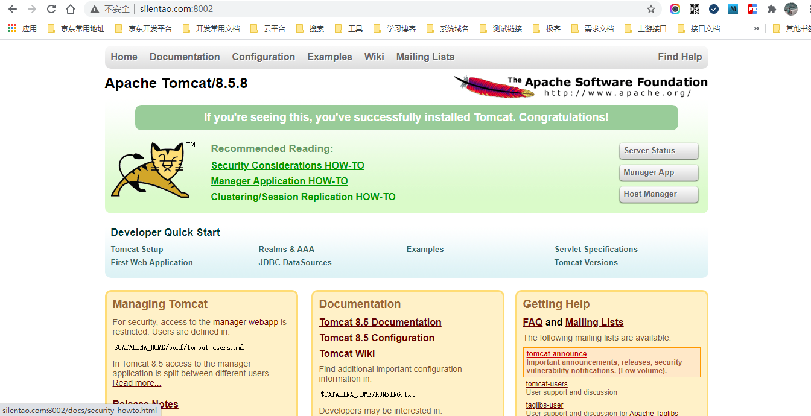
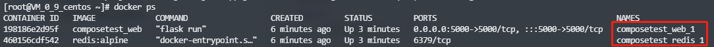

# 1.安装Docker

## 1.1 环境准备

CentOS7


## 1.2 环境查看

``` shell
# 系统环境必须是3.10以上的
[root@VM_0_9_centos /]# uname -r
3.10.0-862.el7.x86_64
```

``` shell
[root@VM_0_9_centos /]# cat /etc/os-release 
NAME="CentOS Linux"
VERSION="7 (Core)"
ID="centos"
ID_LIKE="rhel fedora"
VERSION_ID="7"
PRETTY_NAME="CentOS Linux 7 (Core)"
ANSI_COLOR="0;31"
CPE_NAME="cpe:/o:centos:centos:7"
HOME_URL="https://www.centos.org/"
BUG_REPORT_URL="https://bugs.centos.org/"

CENTOS_MANTISBT_PROJECT="CentOS-7"
CENTOS_MANTISBT_PROJECT_VERSION="7"
REDHAT_SUPPORT_PRODUCT="centos"
REDHAT_SUPPORT_PRODUCT_VERSION="7"
```


## 1.3 安装

帮助文档：https://docs.docker.com/

1.卸载旧的版本

``` shell
sudo yum remove docker \
                  docker-client \
                  docker-client-latest \
                  docker-common \
                  docker-latest \
                  docker-latest-logrotate \
                  docker-logrotate \
                  docker-engine
```

2.需要的安装包

``` shell
sudo yum install -y yum-utils
```

3.设置镜像的仓库

``` shell
# 默认是境外的仓库，很慢不建议使用
sudo yum-config-manager \
    --add-repo \
    https://download.docker.com/linux/centos/docker-ce.repo
    
# 阿里云镜像仓库，推荐使用
sudo yum-config-manager \
    --add-repo \
    http://mirrors.aliyun.com/docker-ce/linux/centos/docker-ce.repo
    
# 更新软件包索引
yum makecache fast
```

4.安装docker docker-ce 社区版 ee 企业版

``` shell
sudo yum install docker-ce docker-ce-cli containerd.io
```

5.启动docker

``` shell
sudo systemctl start docker
```

6.使用 `docker version` 查看是否安装成功


7.hello world

``` shell
sudo docker run hello-world
```


8.查看一下下载的hello-world镜像

``` shell
docker images
```


## 1.4 卸载docker

``` shell
# 卸载依赖
sudo yum remove docker-ce docker-ce-cli containerd.io

# 删除docker资源目录
# /var/lib/docker	docker的默认工作路径
sudo rm -rf /var/lib/docker
sudo rm -rf /var/lib/containerd
```

# 2.Docker的常用命令

## 2.1 帮助命令

``` shell
docker version		# 显示docker的版本信息
docker info			# 显示docker的系统信息，包括镜像和容器的数量
docker <命令> --help	# 万能命令
```

帮助文档地址：https://docs.docker.com/reference/


## 2.2 镜像命令

### 2.2.1 `docker images`

查看所有本地主机上的镜像

``` shell
[root@VM_0_9_centos /]# docker images
REPOSITORY    TAG       IMAGE ID       CREATED       SIZE
hello-world   latest    d1165f221234   7 weeks ago   13.3kB

# 解释
REPOSITORY		镜像的仓库源
TAG				镜像的标签
IMAGE ID		镜像的id
CREATED			镜像的创建时间
SIZE			镜像的大小

# 可选项
-a, --all             # 列出所有的镜像
-q, --quiet           # 只显示镜像的id
```

### 2.2.2 `docker search`

搜索镜像

``` shell
[root@VM_0_9_centos /]# docker search mysql
NAME     DESCRIPTION                                     STARS     OFFICIAL   AUTOMATED
mysql    MySQL is a widely used, open-source relation??  10777     [OK]       
mariadb  MariaDB Server is a high performing open sou??  4058      [OK]

# 可选项，通过收藏来过滤
-f, --filter filter   Filter output based on conditions provided
    --format string   Pretty-print search using a Go template
    --limit int       Max number of search results (default 25)
    --no-trunc        Don't truncate output

--filter=STARS=3000	  # 搜索出来的镜像就是STARS大于3000
[root@VM_0_9_centos /]# docker search mysql --filter=STARS=3000
NAME      DESCRIPTION                                     STARS     OFFICIAL   AUTOMATED
mysql     MySQL is a widely used, open-source relation??  10777     [OK]       
mariadb   MariaDB Server is a high performing open sou??  4058      [OK]       
[root@VM_0_9_centos /]# docker search mysql --filter=STARS=5000
NAME      DESCRIPTION                                     STARS     OFFICIAL   AUTOMATED
mysql     MySQL is a widely used, open-source relation??  10777     [OK]       
```

### 2.2.3 `docker pull`

下载镜像

``` shell
# 下载镜像 docker pull <镜像名称>[:tag]
[root@VM_0_9_centos ~]# docker pull mysql
Using default tag: latest		# 如果不写tag，默认下载latest（最新版本）
latest: Pulling from library/mysql
f7ec5a41d630: Pull complete 	# 分层下载，docker image的核心，联合文件系统
9444bb562699: Pull complete 
6a4207b96940: Pull complete 
181cefd361ce: Pull complete 
8a2090759d8a: Pull complete 
15f235e0d7ee: Pull complete 
d870539cd9db: Pull complete 
493aaa84617a: Pull complete 
bfc0e534fc78: Pull complete 
fae20d253f9d: Pull complete 
9350664305b3: Pull complete 
e47da95a5aab: Pull complete 
Digest: sha256:04ee7141256e83797ea4a84a4d31b1f1bc10111c8d1bc1879d52729ccd19e20a	# 签名
Status: Downloaded newer image for mysql:latest
docker.io/library/mysql:latest	# 所下载docker镜像的真实地址

# 下面两条命令是等价的
docker pull mysql
docker.io/library/mysql:latest

# 指定版本下载
[root@VM_0_9_centos ~]# docker pull mysql:5.7
5.7: Pulling from library/mysql
f7ec5a41d630: Already exists 
9444bb562699: Already exists 
6a4207b96940: Already exists 
181cefd361ce: Already exists 
8a2090759d8a: Already exists 
15f235e0d7ee: Already exists 
d870539cd9db: Already exists 
cb7af63cbefa: Pull complete 
151f1721bdbf: Pull complete 
fcd19c3dd488: Pull complete 
415af2aa5ddc: Pull complete 
Digest: sha256:a655529fdfcbaf0ef28984d68a3e21778e061c886ff458b677391924f62fb457
Status: Downloaded newer image for mysql:5.7
docker.io/library/mysql:5.7
```


### 2.2.4 `docker rmi`

删除镜像

``` shell
[root@VM_0_9_centos ~]# docker rmi -f 镜像id			# 删除指定的镜像
[root@VM_0_9_centos ~]# docker rmi -f 镜像id 镜像id	   # 删除多个镜像
[root@VM_0_9_centos ~]# docker rmi -f $(docker images -aq)	# 删除全部的镜像
```


## 2.3 容器命令

说明：我们有了镜像才可以创建容器，下载一个centos镜像来学习

``` shell
docker pull centos
```

### 2.3.1 `docker run`

新建容器并启动

``` shell
docker run [可选参数] image

# 参数说明
--name="name"			# 容器的名字	如：tomcat1 tomcat2，用来区分容器
-d						# 后台的方式运行
-it						# 使用交互方式运行，进入容器查看内容
-p						# 指定容器的端口 如：-p 8080:8080
	-p		ip:主机端口:容器端口
	-p		主机端口:容器端口（常用）
	-p		容器端口
	容器端口
-P						# 随机指定端口

# 测试，启动并进入容器
[root@VM_0_9_centos ~]# docker run -it centos /bin/bash
[root@c667332b1745 /]# ls		# 查看容器内的centos，基础版本，很多命令不完善
bin  etc   lib	  lost+found  mnt  proc  run   srv  tmp  var
dev  home  lib64  media       opt  root  sbin  sys  usr

# 从容器中退回主机
[root@c667332b1745 /]# exit
exit
[root@VM_0_9_centos ~]# ls
env
[root@VM_0_9_centos ~]# cd /
[root@VM_0_9_centos /]# ls
bin   data  etc   lib    lost+found  mnt  proc  run   srv  tmp  var
boot  dev   home  lib64  media       opt  root  sbin  sys  usr
```

### 2.3.2 `docker ps`

列出所有的运行的容器

``` shell
# docker ps 命令
		# 列出当前运行的容器
-a		# 列出当前运行的容器+曾经运行过的容器
-n=?	# 显示最近创建的容器
-q		# 只显示容器的编号

[root@VM_0_9_centos /]# docker ps		# 列出当前运行的容器
CONTAINER ID   IMAGE     COMMAND   CREATED   STATUS    PORTS     NAMES
[root@VM_0_9_centos /]# docker ps -a	# 列出当前运行的容器+曾经运行过的容器
CONTAINER ID   IMAGE          COMMAND       CREATED         STATUS                     PORTS     NAMES
c667332b1745   centos         "/bin/bash"   4 minutes ago   Exited (0) 2 minutes ago             beautiful_albattani
abedd821e53d   d1165f221234   "/hello"      24 hours ago    Exited (0) 24 hours ago              boring_morse
```

### 2.3.3 `exit`

退出容器

``` shell
exit	# 直接容器停止并退出
Ctrl + P + Q	# 容器不停止退出
```

### 2.3.4 `docker rm`

删除容器

``` shell
docker rm 容器id					# 删除指定的容器，不能删除正在运行的容器，如果要强制删除 rm -f
docker rm -f $(docker ps -aq)	 # 删除所有的容器
docker ps -a -q|xargs docker rm	 # 删除所有的容器
```

### 2.3.5 启动和停止容器的操作

``` shell
docker start 容器id		# 启动容器
docker restart 容器id		# 重启容器
docker stop 容器id		# 停止当前正在运行的容器
docker kill 容器id		# 强制停止当前正在运行的容器
```

### 2.3.5 其它命令

后台启动容器

``` shell
# 命令
docker run -d 镜像名		# 后台启动容器

[root@VM_0_9_centos ~]# docker run -d centos

# 问题docker ps 发现centos停止了

# 常见的坑：docker容器使用后台运行，就必须要有一个前台进程，docker发现没有应用，就会自动停止
# nginx容器启动后，发现自己没有提供服务，就会立即停止，就是没有程序了
```

查看日志

``` shell
# 查看容器日志
docker logs -f -t -n --tail 容器id

# 启动一个后台容器，并执行shell脚本，产生一些日志
docker run -d centos /bin/sh -c "while true;do echo silence; sleep 1;done"

[root@VM_0_9_centos ~]# docker ps
CONTAINER ID   IMAGE
1fc418891e59   centos

# 显示日志
- tf			# 显示日志
--tail number	# 要显示日志的条数
[root@VM_0_9_centos ~]# docker logs -f -t --tail 10 1fc418891e59
```

查看容器中的进程信息

``` shell
# 命令
docker top 容器id

[root@VM_0_9_centos ~]# docker top 1fc418891e59
UID                 PID                 PPID                C                   STIME
root                17262               17241               0                   22:44
root                23763               17262               0                   22:53     
```

查看镜像的元数据

``` javascript
# 命令
docker inspect 容器id

# 测试
[root@VM_0_9_centos ~]# docker inspect 1fc418891e59
[
    {
        "Id": "1fc418891e598794f571b171136997bb06747a9f6b9b8b9c26e3831ad510365c",
        "Created": "2021-04-28T14:44:41.961586933Z",
        "Path": "/bin/sh",
        "Args": [
            "-c",
            "while true;do echo silence; sleep 1;done"
        ],
        "State": {
            "Status": "running",
            "Running": true,
            "Paused": false,
            "Restarting": false,
            "OOMKilled": false,
            "Dead": false,
            "Pid": 17262,
            "ExitCode": 0,
            "Error": "",
            "StartedAt": "2021-04-28T14:44:42.263228804Z",
            "FinishedAt": "0001-01-01T00:00:00Z"
        },
        "Image": "sha256:300e315adb2f96afe5f0b2780b87f28ae95231fe3bdd1e16b9ba606307728f55",
        "ResolvConfPath": "/var/lib/docker/containers/1fc418891e598794f571b171136997bb06747a9f6b9b8b9c26e3831ad510365c/resolv.conf",
        "HostnamePath": "/var/lib/docker/containers/1fc418891e598794f571b171136997bb06747a9f6b9b8b9c26e3831ad510365c/hostname",
        "HostsPath": "/var/lib/docker/containers/1fc418891e598794f571b171136997bb06747a9f6b9b8b9c26e3831ad510365c/hosts",
        "LogPath": "/var/lib/docker/containers/1fc418891e598794f571b171136997bb06747a9f6b9b8b9c26e3831ad510365c/1fc418891e598794f571b171136997bb06747a9f6b9b8b9c26e3831ad510365c-json.log",
        "Name": "/serene_sanderson",
        "RestartCount": 0,
        "Driver": "overlay2",
        "Platform": "linux",
        "MountLabel": "",
        "ProcessLabel": "",
        "AppArmorProfile": "",
        "ExecIDs": null,
        "HostConfig": {
            "Binds": null,
            "ContainerIDFile": "",
            "LogConfig": {
                "Type": "json-file",
                "Config": {}
            },
            "NetworkMode": "default",
            "PortBindings": {},
            "RestartPolicy": {
                "Name": "no",
                "MaximumRetryCount": 0
            },
            "AutoRemove": false,
            "VolumeDriver": "",
            "VolumesFrom": null,
            "CapAdd": null,
            "CapDrop": null,
            "CgroupnsMode": "host",
            "Dns": [],
            "DnsOptions": [],
            "DnsSearch": [],
            "ExtraHosts": null,
            "GroupAdd": null,
            "IpcMode": "private",
            "Cgroup": "",
            "Links": null,
            "OomScoreAdj": 0,
            "PidMode": "",
            "Privileged": false,
            "PublishAllPorts": false,
            "ReadonlyRootfs": false,
            "SecurityOpt": null,
            "UTSMode": "",
            "UsernsMode": "",
            "ShmSize": 67108864,
            "Runtime": "runc",
            "ConsoleSize": [
                0,
                0
            ],
            "Isolation": "",
            "CpuShares": 0,
            "Memory": 0,
            "NanoCpus": 0,
            "CgroupParent": "",
            "BlkioWeight": 0,
            "BlkioWeightDevice": [],
            "BlkioDeviceReadBps": null,
            "BlkioDeviceWriteBps": null,
            "BlkioDeviceReadIOps": null,
            "BlkioDeviceWriteIOps": null,
            "CpuPeriod": 0,
            "CpuQuota": 0,
            "CpuRealtimePeriod": 0,
            "CpuRealtimeRuntime": 0,
            "CpusetCpus": "",
            "CpusetMems": "",
            "Devices": [],
            "DeviceCgroupRules": null,
            "DeviceRequests": null,
            "KernelMemory": 0,
            "KernelMemoryTCP": 0,
            "MemoryReservation": 0,
            "MemorySwap": 0,
            "MemorySwappiness": null,
            "OomKillDisable": false,
            "PidsLimit": null,
            "Ulimits": null,
            "CpuCount": 0,
            "CpuPercent": 0,
            "IOMaximumIOps": 0,
            "IOMaximumBandwidth": 0,
            "MaskedPaths": [
                "/proc/asound",
                "/proc/acpi",
                "/proc/kcore",
                "/proc/keys",
                "/proc/latency_stats",
                "/proc/timer_list",
                "/proc/timer_stats",
                "/proc/sched_debug",
                "/proc/scsi",
                "/sys/firmware"
            ],
            "ReadonlyPaths": [
                "/proc/bus",
                "/proc/fs",
                "/proc/irq",
                "/proc/sys",
                "/proc/sysrq-trigger"
            ]
        },
        "GraphDriver": {
            "Data": {
                "LowerDir": "/var/lib/docker/overlay2/6ab3b8262005c9a5a9b1a4ed08e14898667a66b5ee6353a9fd27f3d01bb1e36b-init/diff:/var/lib/docker/overlay2/035bdcc3ac7dae250dfcf9e8f7dd84f209fe3383b01038ae2a6da126baf1508f/diff",
                "MergedDir": "/var/lib/docker/overlay2/6ab3b8262005c9a5a9b1a4ed08e14898667a66b5ee6353a9fd27f3d01bb1e36b/merged",
                "UpperDir": "/var/lib/docker/overlay2/6ab3b8262005c9a5a9b1a4ed08e14898667a66b5ee6353a9fd27f3d01bb1e36b/diff",
                "WorkDir": "/var/lib/docker/overlay2/6ab3b8262005c9a5a9b1a4ed08e14898667a66b5ee6353a9fd27f3d01bb1e36b/work"
            },
            "Name": "overlay2"
        },
        "Mounts": [],
        "Config": {
            "Hostname": "1fc418891e59",
            "Domainname": "",
            "User": "",
            "AttachStdin": false,
            "AttachStdout": false,
            "AttachStderr": false,
            "Tty": false,
            "OpenStdin": false,
            "StdinOnce": false,
            "Env": [
                "PATH=/usr/local/sbin:/usr/local/bin:/usr/sbin:/usr/bin:/sbin:/bin"
            ],
            "Cmd": [
                "/bin/sh",
                "-c",
                "while true;do echo silence; sleep 1;done"
            ],
            "Image": "centos",
            "Volumes": null,
            "WorkingDir": "",
            "Entrypoint": null,
            "OnBuild": null,
            "Labels": {
                "org.label-schema.build-date": "20201204",
                "org.label-schema.license": "GPLv2",
                "org.label-schema.name": "CentOS Base Image",
                "org.label-schema.schema-version": "1.0",
                "org.label-schema.vendor": "CentOS"
            }
        },
        "NetworkSettings": {
            "Bridge": "",
            "SandboxID": "de87c6f7dd7780fc4e16a0528a049067a5e4b59dee0f707a8bd878a64f5d272b",
            "HairpinMode": false,
            "LinkLocalIPv6Address": "",
            "LinkLocalIPv6PrefixLen": 0,
            "Ports": {},
            "SandboxKey": "/var/run/docker/netns/de87c6f7dd77",
            "SecondaryIPAddresses": null,
            "SecondaryIPv6Addresses": null,
            "EndpointID": "b02b2e0974ad5a20ae7e37500cd4ad439c4a3fae43be2befa85bd4873f9ed560",
            "Gateway": "172.18.0.1",
            "GlobalIPv6Address": "",
            "GlobalIPv6PrefixLen": 0,
            "IPAddress": "172.18.0.2",
            "IPPrefixLen": 16,
            "IPv6Gateway": "",
            "MacAddress": "02:42:ac:12:00:02",
            "Networks": {
                "bridge": {
                    "IPAMConfig": null,
                    "Links": null,
                    "Aliases": null,
                    "NetworkID": "49e3fe89cda391492cd6d99579413cda9efa100de0f0b8236a93e02131ad3c95",
                    "EndpointID": "b02b2e0974ad5a20ae7e37500cd4ad439c4a3fae43be2befa85bd4873f9ed560",
                    "Gateway": "172.18.0.1",
                    "IPAddress": "172.18.0.2",
                    "IPPrefixLen": 16,
                    "IPv6Gateway": "",
                    "GlobalIPv6Address": "",
                    "GlobalIPv6PrefixLen": 0,
                    "MacAddress": "02:42:ac:12:00:02",
                    "DriverOpts": null
                }
            }
        }
    }
]
```

进入当前正在运行的容器

``` shell
#方式一：
# 命令
docker exec -it 容器id bashShell

# 测试
[root@VM_0_9_centos ~]# docker ps
CONTAINER ID   IMAGE   COMMAND                  CREATED      STATUS       
1fc418891e59   centos  "/bin/sh -c 'while t??   2 days ago   Up 5 seconds 
[root@VM_0_9_centos ~]# docker exec -it 1fc418891e59 /bin/bash
[root@1fc418891e59 /]# ls
bin  dev  etc  home  lib  lib64  lost+found  media  mnt  opt  proc  root  run  sbin  srv  sys  tmp  usr  var
[root@1fc418891e59 /]# ps -ef
UID        PID  PPID  C STIME TTY          TIME CMD
root         1     0  0 14:45 ?        00:00:00 /bin/sh -c while true;do echo silence; sleep 1;done
root        52     0  0 14:46 pts/0    00:00:00 /bin/bash
root        74     1  0 14:46 ?        00:00:00 /usr/bin/coreutils --coreutils-prog-shebang=sleep /usr/bin/sleep 1
root        75    52  0 14:46 pts/0    00:00:00 ps -e

# 方式二：
# 命令
docker attach 容器id

# 测试
[root@VM_0_9_centos ~]# docker attach 1fc418891e59
正在执行当前的代码……


# docker exec		# 进入容器后开启一个新的终端，可以在里面操作（常用）
# docker attach		# 进入容器正在执行的终端，不会启动新的进程
```

从容器内拷贝文件到主机上

``` shell
# 命令
docker cp 容器id:容器内路径 目的的主机路径

# 测试
[root@VM_0_9_centos ~]# docker ps
CONTAINER ID   IMAGE     COMMAND       CREATED      STATUS              PORTS     NAMES
7c7e85baf5b5   centos    "/bin/bash"   2 days ago   Up About a minute             focused_moore

# 进入容器内部
[root@VM_0_9_centos ~]# docker attach 7c7e85baf5b5
[root@7c7e85baf5b5 /]# ls
bin  dev  etc  home  lib  lib64  lost+found  media  mnt  opt  proc  root  run  sbin  srv  sys  tmp  usr  var
[root@7c7e85baf5b5 /]# cd /home/
[root@7c7e85baf5b5 home]# ls

# 在容器内创建一个文件
[root@7c7e85baf5b5 home]# touch test.java
[root@7c7e85baf5b5 home]# exit
exit
[root@VM_0_9_centos ~]# docker ps
CONTAINER ID   IMAGE     COMMAND   CREATED   STATUS    PORTS     NAMES
[root@VM_0_9_centos ~]# pwd
/root
[root@VM_0_9_centos ~]# cd /home/
[root@VM_0_9_centos home]# ls
git

# 将容器内的文件拷贝出来到主机上
[root@VM_0_9_centos home]# docker cp 7c7e85baf5b5:/home/test.java /home/
[root@VM_0_9_centos home]# ls
git  test.java

# 拷贝是一个手动过程，可以使用 -v卷 的技术，实现自动同步
```

## 2.4 练习

### 2.4.1 安装nginx容器

``` shell
# 1.搜索镜像
docker search nginx

[root@VM_0_9_centos home]# docker search nginx
NAME                               DESCRIPTION                                     STARS     OFFICIAL   AUTOMATED
nginx                              Official build of Nginx.                        14798     [OK]       
jwilder/nginx-proxy                Automated Nginx reverse proxy for docker con??  2020                 [OK]
richarvey/nginx-php-fpm            Container running Nginx + PHP-FPM capable of??  813                  [OK]

# 2.拉取镜像
docker pull nginx

[root@VM_0_9_centos home]# docker pull nginx
Using default tag: latest
latest: Pulling from library/nginx
f7ec5a41d630: Pull complete 
aa1efa14b3bf: Pull complete 
b78b95af9b17: Pull complete 
c7d6bca2b8dc: Pull complete 
cf16cd8e71e0: Pull complete 
0241c68333ef: Pull complete 
Digest: sha256:75a55d33ecc73c2a242450a9f1cc858499d468f077ea942867e662c247b5e412
Status: Downloaded newer image for nginx:latest
docker.io/library/nginx:latest

# 查看镜像
[root@VM_0_9_centos home]# docker images
REPOSITORY   TAG       IMAGE ID       CREATED        SIZE
nginx        latest    62d49f9bab67   2 weeks ago    133MB

# 3.启动容器
docker run -d --name nginx_01 -p 8002:80 nginx
# -d 		后台运行
# --name	给容器起名字
# -p		宿主机端口:容器端口

# 查看容器是否启动
[root@VM_0_9_centos home]# docker ps
CONTAINER ID   IMAGE     COMMAND                  CREATED         STATUS         PORTS                                   NAMES
87b0b1732a33   nginx     "/docker-entrypoint.??   6 seconds ago   Up 5 seconds   0.0.0.0:8002->80/tcp, :::8002->80/tcp   nginx_01
# 访问nginx是否启动成功
[root@VM_0_9_centos home]# curl localhost:8002
<!DOCTYPE html>
<html>
<head>
<title>Welcome to nginx!</title>
<style>
    body {
        width: 35em;
        margin: 0 auto;
        font-family: Tahoma, Verdana, Arial, sans-serif;
    }
</style>
</head>
<body>
<h1>Welcome to nginx!</h1>
<p>If you see this page, the nginx web server is successfully installed and
working. Further configuration is required.</p>

<p>For online documentation and support please refer to
<a href="http://nginx.org/">nginx.org</a>.<br/>
Commercial support is available at
<a href="http://nginx.com/">nginx.com</a>.</p>

<p><em>Thank you for using nginx.</em></p>
</body>
</html>

# 进入容器
[root@VM_0_9_centos home]# docker exec -it nginx_01 /bin/bash
root@87b0b1732a33:/# whereis nginx
nginx: /usr/sbin/nginx /usr/lib/nginx /etc/nginx /usr/share/nginx
root@87b0b1732a33:/# cd /etc/nginx/
# 查看容器内的nginx目录
root@87b0b1732a33:/etc/nginx# ls
conf.d	fastcgi_params	koi-utf  koi-win  mime.types  modules  nginx.conf  scgi_params	uwsgi_params  win-utf
```

### 2.4.2 安装tomcat容器

``` shell
# 官方的使用
docker run -it --rm tomcat:9.0

# 我们之前的启动都是后台，停止了容器之后，容器还是可以查到
# docker run -it --rm 镜像名称:版本		一般用来测试，用完即删除容器，但是镜像还会在
# 如果宿主机没有对应镜像，就会下载对应镜像

# 启动Tomcat
docker run -d -p 8899:8080 --name tomcat_01 tomcat

# 测试发现404

# 进入容器
[root@VM_0_9_centos home]# docker exec -it tomcat_01 /bin/bash
root@097847154bd4:/usr/local/tomcat# pwd
/usr/local/tomcat
root@097847154bd4:/usr/local/tomcat# ls
BUILDING.txt  CONTRIBUTING.md  LICENSE	NOTICE	README.md  RELEASE-NOTES  RUNNING.txt  bin  conf  lib  logs  native-jni-lib  temp  webapps  webapps.dist  work
# 进入webapps
root@097847154bd4:/usr/local/tomcat# cd webapps
# 发现webapps目录是空的
root@097847154bd4:/usr/local/tomcat/webapps# ls
root@097847154bd4:/usr/local/tomcat/webapps#

# 发现问题：1.Linux命令少了；2.没有webapps目录
# 原因是默认下载最小的镜像，所有不必要的都剔除掉
# 保证最小可运行的环境
```

### 2.4.3 部署es+kibana

``` shell
# es 暴露的端口很多
# es 十分的耗内存
# es es的数据一般需要放置到安全目录！挂载

# 启动es
docker run -d --name elasticsearch -p 9200:9200 -p 9300:9300 -e "discovery.type=single-node" elasticsearch:7.6.2

# 命令
docker stats 容器id		# 查看cpu的状态

# 测试es是否成功了
[root@VM_0_9_centos home]# curl localhost:9200
{
  "name" : "095ff19df14e",
  "cluster_name" : "docker-cluster",
  "cluster_uuid" : "XDgfmsEwR3CFKMLmuXKsaQ",
  "version" : {
    "number" : "7.6.2",
    "build_flavor" : "default",
    "build_type" : "docker",
    "build_hash" : "ef48eb35cf30adf4db14086e8aabd07ef6fb113f",
    "build_date" : "2020-03-26T06:34:37.794943Z",
    "build_snapshot" : false,
    "lucene_version" : "8.4.0",
    "minimum_wire_compatibility_version" : "6.8.0",
    "minimum_index_compatibility_version" : "6.0.0-beta1"
  },
  "tagline" : "You Know, for Search"
}

# 增加内存的限制的方式启动
docker run -d --name elasticsearch_01 -p 9200:9200 -p 9300:9300 -e "discovery.type=single-node" -e ES_JAVA_OPTS="-Xms64m -Xmx512m" elasticsearch:7.6.2

# 执行启动命令
[root@VM_0_9_centos home]# docker run -d --name elasticsearch_01 -p 9200:9200 -p 9300:9300 -e "discovery.type=single-node" -e ES_JAVA_OPTS="-Xms64m -Xmx512m" elasticsearch:7.6.2
a66ce6c46ede990089598e46db34c7d3835d6a02a14ce91350b9dc9e74c536f2

# 查看容器
[root@VM_0_9_centos home]# docker ps
CONTAINER ID   IMAGE                 COMMAND                  CREATED         STATUS         PORTS                                                                                  NAMES
a66ce6c46ede   elasticsearch:7.6.2   "/usr/local/bin/dock??   3 seconds ago   Up 2 seconds   0.0.0.0:9200->9200/tcp, :::9200->9200/tcp, 0.0.0.0:9300->9300/tcp, :::9300->9300/tcp   elasticsearch_01

# 查看容器内存
[root@VM_0_9_centos home]# docker stats a66ce6c46ede
```


``` shell
# 测试是否成功了
[root@VM_0_9_centos home]# curl localhost:9200
{
  "name" : "a66ce6c46ede",
  "cluster_name" : "docker-cluster",
  "cluster_uuid" : "GUyBHvvpTAW2GiO63NZDYA",
  "version" : {
    "number" : "7.6.2",
    "build_flavor" : "default",
    "build_type" : "docker",
    "build_hash" : "ef48eb35cf30adf4db14086e8aabd07ef6fb113f",
    "build_date" : "2020-03-26T06:34:37.794943Z",
    "build_snapshot" : false,
    "lucene_version" : "8.4.0",
    "minimum_wire_compatibility_version" : "6.8.0",
    "minimum_index_compatibility_version" : "6.0.0-beta1"
  },
  "tagline" : "You Know, for Search"
}
```

## 2.5 可视化工具

* portainer

``` shell
docker run -d -p 8002:9000 \ --restart=always -v /var/run/docker.sock:/var/run/docker.sock --privileged=true portainer/portainer
```

* Rancher

### 2.5.1 什么是portainer？

Docker图形化界面管理工具，提供了一个后台面板供我们操作

``` shell
# 命令
docker run -d -p 8002:9000 --restart=always -v /var/run/docker.sock:/var/run/docker.sock --privileged=true portainer/portainer

# 安装
[root@VM_0_9_centos home]# docker run -d -p 8002:9000 --restart=always -v /var/run/docker.sock:/var/run/docker.sock --privileged=true portainer/portainer
Unable to find image 'portainer/portainer:latest' locally
latest: Pulling from portainer/portainer
94cfa856b2b1: Pull complete 
49d59ee0881a: Pull complete 
a2300fd28637: Pull complete 
Digest: sha256:fb45b43738646048a0a0cc74fcee2865b69efde857e710126084ee5de9be0f3f
Status: Downloaded newer image for portainer/portainer:latest
691030560f7c30b945e27c70a5109e99efaad7518bfda785c118266bb287a103
[root@VM_0_9_centos home]# docker ps
CONTAINER ID   IMAGE                 COMMAND        CREATED         STATUS         PORTS                                       NAMES
691030560f7c   portainer/portainer   "/portainer"   4 seconds ago   Up 3 seconds   0.0.0.0:8002->9000/tcp, :::8002->9000/tcp   wizardly_pare

# 访问测试
```


输入密码创建用户即可。

# 3.Docker镜像

## 3.1 镜像是什么

## 3.2 Docker镜像的加载原理

## 3.3 分层概念

## 3.4 commit镜像

如何提交一个自己的镜像

``` shell
docker commit 		# 提交容器成为一个新的副本

# 命令和git原来类似
docker commit -m="提交的描述信息" -a="作者" 容器id 目标镜像名:[TAG]
```

实战测试

``` shell
# 1.启动一个默认的tomcat
[root@VM_0_9_centos ~]# docker run -it -p 8002:8080 tomcat
Using CATALINA_BASE:   /usr/local/tomcat
Using CATALINA_HOME:   /usr/local/tomcat
Using CATALINA_TMPDIR: /usr/local/tomcat/temp
Using JRE_HOME:        /usr/local/openjdk-11
Using CLASSPATH:       /usr/local/tomcat/bin/bootstrap.jar:/usr/local/tomcat/bin/tomcat-juli.jar

# 2.发现这个默认的tomcat 是没有webapps应用，镜像的原因，官方的镜像默认webapps下面是没有文件的
[root@VM_0_9_centos ~]# docker exec -it 920ff4db1ea4 /bin/bash
root@920ff4db1ea4:/usr/local/tomcat# cd webapps
root@920ff4db1ea4:/usr/local/tomcat/webapps# ls

# 3.可以自己拷贝进去
root@920ff4db1ea4:/usr/local/tomcat# ls
BUILDING.txt  CONTRIBUTING.md  LICENSE  NOTICE  README.md  RELEASE-NOTES  RUNNING.txt  bin  conf  lib  logs  native-jni-lib  temp  webapps  webapps.dist  work
root@920ff4db1ea4:/usr/local/tomcat# cp -r webapps.dist/* webapps
root@920ff4db1ea4:/usr/local/tomcat# cd webapps
root@920ff4db1ea4:/usr/local/tomcat/webapps# ls
ROOT  docs  examples  host-manager  manager

# 4.将修改后的容器通过commit提交为一个镜像，以后可以直接使用这个镜像
```


如果要保存当前容器的状态，就可以通过commit来提交，获得一个新的镜像，有点像虚拟机的镜像。

# 4.容器数据卷

## 4.1什么是容器数据卷

如果数据都在容器中，那么我们容器删除了，数据就会丢失，**需求：数据可以持久化**

MySQL，容器删除了，数据就全没了，**需求：MySQL 数据可以存储在本地**

容器之间可以有一个数据共享的技术，Docker 容器中产生的数据，同步到本地

这就是卷技术，目录的挂载，将我的容器内的目录，挂载到 Linux 上面

**总结：容器的持久化和同步操作，容器间也是可以数据共享的**。

## 4.2 使用数据卷

> 方式一：直接使用命令的方式来挂载	-v

``` shell
docker run -it -v 主机的目录地址:容器的目录地址

# 测试
[root@VM_0_9_centos home]# docker run -it -v /home/test:/home centos /bin/bash

# 启动之后可以通过 docker inspect 容器id 命令查看容器详细看看是否挂载成功
```


## 4.3 实战：安装MySQL

思考：MySQL的数据持久化问题

``` shell
# 获取镜像
docker pull mysql:5.7

# 运行容器，需要做数据挂载！
[root@VM_0_9_centos home]# docker run -d -p 8002:3306 -v /home/mysql/conf:/etc/mysql/conf.d -v /home/mysql/data/:/var/lib/mysql

# 安装启动 MySQL ，需要配置密码，官方配置方式
docker run --name some-mysql -e MYSQL_ROOT_PASSWORD=my-secret-pw -d mysql:tag

# mysql 完整启动命令
# -d 后台运行
# -p 端口映射
# -v 卷挂载
# -e 环境配置
# --name 容器名称
[root@VM_0_9_centos home]# docker run -d -p 8002:3306 -v /home/mysql/conf:/etc/mysql/conf.d -v /home/mysql/data/:/var/lib/mysql -e MYSQL_ROOT_PASSWORD=123456 --name mysql_01 mysql:5.7
```

启动成功之后，我们在本地使用 sqlyog 来连接测试，sqlyog 连接到服务器的 8002，8002 和容器内的 3306 端口映射，连接成功


在本地测试创建一个数据库 test，查看路径是否成功映射


假设我们将容器删除


发现挂载在本地的数据卷依旧没有丢失，这就实现了容器持久化功能

## 4.4 具名和匿名挂载

``` shell
# 匿名挂载
# -v 容器内路径
# -P 随机ip映射
docker run -d -P --name nginx_02 -v /ect/nginx nginx

# 查看所有 volume 的情况
[root@VM_0_9_centos mysql]# docker volume ls
DRIVER    VOLUME NAME
local     564aa630b97047f9c658013d4c6897792516e444f7714b783701e5b8228c1ac8	# 匿名卷挂载
local     a902979d3f0ddf4d5841da5d79e5f6e9fd51f33b3f33a54f1f9478b6156952de
local     eaaf4bcf2f3dd23ff2f2b3f30c143c1593d169bb4154f9402ceb44453172a902

# 具名挂载
# -v 卷名:容器内路径
docker run -d -P --name nginx_03 -v juming_nginx:/etc/nginx nginx
# 测试
[root@VM_0_9_centos mysql]# docker run -d -P --name nginx_03 -v juming_nginx:/etc/nginx nginx
56883947fac1952feda2e28986fc668deefdf378a33a4c6ec67080bc2669db13
[root@VM_0_9_centos mysql]# docker volume ls
DRIVER    VOLUME NAME
local     juming_nginx

# 查看一下这个卷
docker volume inspect 卷名
# 测试
[root@VM_0_9_centos mysql]# docker volume inspect juming_nginx
[
    {
        "CreatedAt": "2021-05-05T14:33:40+08:00",
        "Driver": "local",
        "Labels": null,
        "Mountpoint": "/var/lib/docker/volumes/juming_nginx/_data",
        "Name": "juming_nginx",
        "Options": null,
        "Scope": "local"
    }
]

所有的docker容器内的卷，没有指定目录的情况下，都是在 /var/lib/docker/volumes/卷名/_data 目录下
我们通过具名挂载可以方便的找到我们的一个卷，大多数情况都是使用具名挂载

# 如何确定是具名挂载还是匿名挂载，还是指定路径挂载
# -v 容器内路径				 	 # 匿名挂载
# -v 卷名:容器内路径				# 具名挂载
# -v /宿主机路径:容器内路径		  # 指定路径挂载

# 扩展
# 通过 -v 容器内路径：ro rw 改变读写权限
# ro readonly 只读
# rw readwrite 可读可写

# 一旦这个设置了容器的权限，容器对我们挂载出来的内容就有限定了
docker run -d -P --name nginx_xx -v juming-nginx:/etc/nginx:ro nginx
docker run -d -P --name nginx_xx -v juming-nginx:/etc/nginx:rw nginx

# ro 只要看到 ro 就说明这个路径只能通过宿主机来操作，容器内是无法操作的
```

## 4.5 初始 Dockerfile

Dockerfile 就是用来构建 docker 镜像的构建五年级，命令脚本，通过这个脚本可以生成一个镜像，镜像是一层一层的，脚本是一个一个的命令，每个命令都是一层

``` shell
# 创建一个 dockerfile 文件，名字可以随机，建议 dockerfile
# 文件中的内容 指令（大写） 参数
FROM centos

VOLUME ["volume01","volume02"]

CMD echo "----end----"
CMD /bin/bash

# 这里的每个命令，就是镜像的一层
```


启动自己创建的镜像


这个卷和外部一定有一个同步的目录与之对应


查看一下挂载路径


这种方式我们未来使用十分多，因为我们通常会构建自己的镜像，假设构建镜像时候没有挂载卷，要手动镜像挂载 `-v 卷名:容器内路径`

## 4.6 数据卷容器

容器数据卷原理图


先启动一个父容器

``` shell
# 命令
docker run -it --name docker_02 66937a85ab2c
```


再启动一个容器通过 `--volumes-from` 让它挂载到 docker_01 上

``` shell
# 命令
docker run -it --name docker_02 --volumes-from docker_01 66937a85ab2c
```


还可以再创建一个容器让它挂载在 docker_2 上

``` shell
# 命令
docker run -it --name docker_03 --volumes-from docker_02 66937a85ab2c
```


``` shell
# 多个 MySQL 实现数据共享

docker run -d -p 8002:3306 -v /etc/mysql/conf.d -v /var/lib/mysql -e MYSQL_ROOT_PASSWORD=123456 --name mysql_01 mysql:5.7

docker run -d -p 8002:3306 --volume-form mysql_01 -e MYSQL_ROOT_PASSWORD=123456 --name mysql_02 mysql:5.7

# 这样就可以实现两个 MySQL 容器数据共享
```

## 4.7 总结

容器之间配置的信息传递，数据卷容器的生命周期一直持续到没有容器使用为止，但是一旦持久化到了本地，本地的数据是不会删除的。

# 5.DokcerFile

## 5.1 DockerFile 介绍

dockerfile 是用来构建 docker 镜像的文件，命令参数文件。

构建步骤：

1. 编写一个 dockerfile 文件；
2. `docker build` 构建一个镜像；
3. `docker run` 运行镜像；
4. `docker push` 发布镜像（DockerHub、阿里云镜像仓库）。

查看一下官方是怎么做的，在 [hub.docker.com](https://hub.docker.com/) 搜索 centos ，然后点击跳转到 centos 7 镜像的 GitHub 地址：


跳转到 centos 7 镜像的 GitHub 地址，里面有一个 dockerfile 文件：


发现很多官方的镜像都是基础包，很多功能都没有，我们通常会搭建自己的镜像。

## 5.2 DockerFile 的构建过程

DockerFile 命令


基础知识：

1. 每个保留关键字（指令）都必须是大写字母；
2. 执行从上到下顺序执行；
3. \# 表示注释；
4. 每一个指令都会创建提交一个新的镜像层，并提交。


dockerfile 是面向开发的，我们以后要发布项目，做镜像，就需要编写 dockerfile 文件，这个文件十分简单，Docker 镜像逐渐成为企业交付的标准，必须要掌握。

步骤：开发，部署，运维

- DockerFile：构建文件，定义了一切的步骤，源代码

- DockerImages：通过 DockerFile 构建生成的镜像，最终发布和运行的产品
- Docker 容器：容器就是镜像运行起来通过服务器

## 5.3 DockerFile指令

**关键字：**

``` shell
FROM 		# 基础镜像，当前新镜像是基于哪个镜像的
MAINTAINER 	# 镜像维护者的姓名混合邮箱地址（姓名 + 邮箱）
RUN 		# 容器构建时需要运行的命令
EXPOSE 		# 当前容器对外保留出的端口
WORKDIR 	# 指定在创建容器后，终端默认登录的进来工作目录，一个落脚点
ENV 		# 用来在构建镜像过程中设置环境变量
ADD 		# 将宿主机目录下的文件拷贝进镜像且ADD命令会自动处理URL和解压tar压缩包
COPY 		# 类似ADD，拷贝文件和目录到镜像中！
VOLUME 		# 容器数据卷，用于数据保存和持久化工作
CMD 		# 指定一个容器启动时要运行的命令，dockerFile中可以有多个CMD指令，但只有最后一个生效！
ENTRYPOINT 	# 指定一个容器启动时要运行的命令！和CMD一样，但是ENTRYPOINT可以追加命令
ONBUILD 	# 当构建一个被继承的DockerFile时运行命令，父镜像在被子镜像继承后，父镜像的ONBUILD被触发
```


## 5.4 实战测试

Docker Hub 中 99% 的镜像都是从这个基础镜像 `FROM scratch` 过来的，然后配置需要的软件来进行构建


### 5.4.1 创建一个自己的centos

``` shell
# 1.编写 DockerFile 的文件
[root@VM_0_9_centos dockerfile]# cat dockerfile-centos 
FROM centos
MAINTAINER Silence<taogu2010@yeah.net>

ENV MYPATH /user/local
WORKDIR $MYPATH

RUN yum -y install vim
RUN yum -y install net-tools

EXPOSE 80

CMD echo $MYPATH
CMD echo "----end----"
CMD /bin/bash

# 2.通过这个文件构建镜像
# 命令 docker build -f dockerfile文件路径 -t 镜像名:[tag] .

# 构建镜像
[root@VM_0_9_centos dockerfile]# docker build -f dockerfile-centos -t mycentos:0.1 .
Sending build context to Docker daemon  2.048kB
Step 1/10 : FROM centos
 ---> 300e315adb2f
Step 2/10 : MAINTAINER Silence<taogu2010@yeah.net>
 ---> Running in 91d808039ac3
Removing intermediate container 91d808039ac3
 ---> 1c977822e673
Step 3/10 : ENV MYPATH /user/local
 ---> Running in 500d370c3d37
Removing intermediate container 500d370c3d37
 ---> 93d81d7fea25
Step 4/10 : WORKDIR $MYPATH
 ---> Running in dc3d0adbe2ba
Removing intermediate container dc3d0adbe2ba
 ---> 17140632f67d
Step 5/10 : RUN yum -y install vim
 ---> Running in fe583929f07a

...

Installed:
  gpm-libs-1.20.7-15.el8.x86_64         vim-common-2:8.0.1763-15.el8.x86_64    
  vim-enhanced-2:8.0.1763-15.el8.x86_64 vim-filesystem-2:8.0.1763-15.el8.noarch
  which-2.21-12.el8.x86_64             

Complete!
Removing intermediate container fe583929f07a
 ---> c00af4e5c558
Step 6/10 : RUN yum -y install net-tools
 ---> Running in c90ce4efcdff

...

Installed:
  net-tools-2.0-0.52.20160912git.el8.x86_64                                     

Complete!
Removing intermediate container c90ce4efcdff
 ---> 75c757ad3fa2
Step 7/10 : EXPOSE 80
 ---> Running in 4ba3e0b63266
Removing intermediate container 4ba3e0b63266
 ---> 9ef4bad2c5be
Step 8/10 : CMD echo $MYPATH
 ---> Running in 988f44a8da7f
Removing intermediate container 988f44a8da7f
 ---> c6e4d6380759
Step 9/10 : CMD echo "----end----"
 ---> Running in 9e48a8a48338
Removing intermediate container 9e48a8a48338
 ---> fb4a30814deb
Step 10/10 : CMD /bin/bash
 ---> Running in d200a20c4553
Removing intermediate container d200a20c4553
 ---> d0254efd95c7
Successfully built d0254efd95c7
Successfully tagged mycentos:0.1

# 3.测试运行
```

对比：之前原生的centos


我们自己构建的centos：


我们可以列出本地镜像的构建历史：

命令：`docker history d0254efd95c7(镜像id)`


### 5.4.2 `CMD` 和 `ENTRYPOINT` 的区别

``` shell
CMD 		# 指定一个容器启动时要运行的命令，dockerFile中可以有多个CMD指令，但只有最后一个生效！
ENTRYPOINT 	# 指定一个容器启动时要运行的命令！和CMD一样，但是ENTRYPOINT可以追加命令
```

测试 `CMD`

``` shell
# 编写 dockerfile 文件
[root@VM_0_9_centos dockerfile]# vim dockerfile-cmd-test
[root@VM_0_9_centos dockerfile]# cat dockerfile-cmd-test 
FROM centos
CMD ["ls","-a"]

# 构建镜像
[root@VM_0_9_centos dockerfile]# docker build -f dockerfile-cmd-test -t cmd-test:0.1 .

# 运行容器，发现 ls -a 命令生效了
[root@VM_0_9_centos dockerfile]# docker run 537654a10f8f
.
..
.dockerenv
bin
dev
etc
home
lib
lib64
lost+found
media
mnt
opt
proc
root
run
sbin
srv
sys
tmp
usr

# 想追加一个命令 -l ls -al
[root@VM_0_9_centos dockerfile]# docker run 537654a10f8f -l
docker: Error response from daemon: OCI runtime create failed: container_linux.go:367: starting container process caused: exec: "-l": executable file not found in $PATH: unknown.

# CMD 的情况下， -l 替换了 CMD ["ls","-a"] 命令， -l 不是命令所以报错了
```

测试 `ENTRYPOINT`

``` shell
[root@VM_0_9_centos dockerfile]# vim dockerfile-cmd-entrypoint
[root@VM_0_9_centos dockerfile]# cat dockerfile-cmd-entrypoint 
FROM centos
ENTRYPOINT ["ls","-a"]
[root@VM_0_9_centos dockerfile]# docker build -f dockerfile-cmd-entrypoint -t entrypoint-test:0.1 .
Sending build context to Docker daemon  4.096kB
Step 1/2 : FROM centos
 ---> 300e315adb2f
Step 2/2 : ENTRYPOINT ["ls","-a"]
 ---> Running in 13bd745caa31
Removing intermediate container 13bd745caa31
 ---> 036025f64cd5
Successfully built 036025f64cd5
Successfully tagged entrypoint-test:0.1
[root@VM_0_9_centos dockerfile]# docker run 036025f64cd5
.
..
.dockerenv
bin
dev
etc
home
lib
lib64
lost+found
media
mnt
opt
proc
root
run
sbin
srv
sys
tmp
usr
var

# 追加命令是直接拼接在 ENTRYPOINT 命令后面的
[root@VM_0_9_centos dockerfile]# docker run 036025f64cd5 -l
total 56
drwxr-xr-x   1 root root 4096 May  6 16:26 .
drwxr-xr-x   1 root root 4096 May  6 16:26 ..
-rwxr-xr-x   1 root root    0 May  6 16:26 .dockerenv
lrwxrwxrwx   1 root root    7 Nov  3  2020 bin -> usr/bin
drwxr-xr-x   5 root root  340 May  6 16:26 dev
drwxr-xr-x   1 root root 4096 May  6 16:26 etc
drwxr-xr-x   2 root root 4096 Nov  3  2020 home
lrwxrwxrwx   1 root root    7 Nov  3  2020 lib -> usr/lib
lrwxrwxrwx   1 root root    9 Nov  3  2020 lib64 -> usr/lib64
drwx------   2 root root 4096 Dec  4 17:37 lost+found
drwxr-xr-x   2 root root 4096 Nov  3  2020 media
drwxr-xr-x   2 root root 4096 Nov  3  2020 mnt
drwxr-xr-x   2 root root 4096 Nov  3  2020 opt
dr-xr-xr-x 114 root root    0 May  6 16:26 proc
dr-xr-x---   2 root root 4096 Dec  4 17:37 root
drwxr-xr-x  11 root root 4096 Dec  4 17:37 run
lrwxrwxrwx   1 root root    8 Nov  3  2020 sbin -> usr/sbin
drwxr-xr-x   2 root root 4096 Nov  3  2020 srv
dr-xr-xr-x  13 root root    0 May  5 07:10 sys
drwxrwxrwt   7 root root 4096 Dec  4 17:37 tmp
drwxr-xr-x  12 root root 4096 Dec  4 17:37 usr
drwxr-xr-x  20 root root 4096 Dec  4 17:37 var
```

**DockerFile 中很多命令是相似，要了解它们的区别，必须通过实践去测试效果。**

### 5.4.3 实战：tomcat 镜像

步骤：

1.准备镜像文件 tomcat 压缩包，jdk 压缩包


2.编写 dockerfile 文件，官方命令 `Dockerfile`，build 会自动寻找这个文件，就不需要通过 `-f` 去指定了

``` shell
[root@VM_0_9_centos tomcatImage]# vim Dockerfile 
[root@VM_0_9_centos tomcatImage]# cat Dockerfile 
FROM centos
MAINTAINER Silence<taogu2010@yeah.net>

COPY README.md /usr/local/README.md

ADD jdk-8u111-linux-x64.tar.gz /usr/local
ADD apache-tomcat-8.5.8.tar.gz /usr/local

RUN yum -y install vim

ENV MYPATH /usr/local
WORKDIR $MYPATH

ENV JAVA_HOME /usr/local/jdk1.8.0_111
ENV CLASSPATH $JAVA_HOME/lib/dt.jar:$JAVA_HOME/lib/tools.jar
ENV CATALINA_HOME /usr/local/apache-tomcat-8.5.8
ENV CATALINA_BASH /usr/local/apache-tomcat-8.5.8
ENV PATH $PATH:$JAVA_HOME/bin:$CATALINA_HOME/lib:$CATALINA_HOME/bin

EXPOSE 8080

CMD /usr/local/apache-tomcat-8.5.8/bin/startup.sh && tail -F /usr/local/apache-tomcat-8.5.8/bin/logs/catalina.out
```

3.构建镜像

``` shell
[root@VM_0_9_centos tomcatImage]# docker build -t silence-tomcat:1.0 .
```

4.启动镜像

``` shell
[root@VM_0_9_centos tomcatImage]# docker run -d -p 8002:8080 --name mytomcat -v /home/dockerVolume/tomcat/mytomcat:/usr/local/apache-tomcat-8.5.8/webapps/mytomcat -v /home/dockerVolume/tomcat/logs:/usr/local/apache-tomcat-8.5.8/logs silence-tomcat:1.0
12b16079025b9894699a4f4f25eee181017c2323454471546b285b48c9a674af
```

5.访问 tomcat



6.发布项目

``` xml
<!-- 编辑 web.xml -->
[root@VM_0_9_centos mytomcat]# mkdir WEB-INF
[root@VM_0_9_centos mytomcat]# ls
WEB-INF
[root@VM_0_9_centos mytomcat]# cd WEB-INF/
[root@VM_0_9_centos WEB-INF]# ls
[root@VM_0_9_centos WEB-INF]# vim web.xml
[root@VM_0_9_centos WEB-INF]# cat web.xml
<?xml version="1.0" encoding="UTF-8"?>
<web-app version="2.4" 
    xmlns="http://java.sun.com/xml/ns/j2ee" 
    xmlns:xsi="http://www.w3.org/2001/XMLSchema-instance"
    xsi:schemaLocation="http://java.sun.com/xml/ns/j2ee 
        http://java.sun.com/xml/ns/j2ee/web-app_2_4.xsd">
</web-app>
```

``` jsp
<!-- 编辑 jsp 测试文件 -->
[root@VM_0_9_centos WEB-INF]# cd ..
[root@VM_0_9_centos mytomcat]# vim index.jsp
[root@VM_0_9_centos mytomcat]# cat index.jsp
<%@ page language="java" contentType="text/html; charset=UTF-8"
    pageEncoding="UTF-8"%>
<!DOCTYPE html>
    <html>
        <head>
            <meta charset="utf-8">
            <title>Hello,Silence</title>
        </head>
    <body>
        Hello World!<br/>
        <%
            System.out.println("----test web logs");
        %>
    </body>
</html>
```

7.可以访问到项目，通过这样的方式发布，可以直接再宿主机上发布项目


## 5.5 发布自己的镜像

### 5.5.1 发布镜像到 DockerHub

1.地址 https://hub.docker.com/ 注册自己的账号

2.确定这个账号可以登录

3.在我们服务器上提交自己的镜像

``` shell
[root@VM_0_9_centos ~]# docker login --help

Usage:  docker login [OPTIONS] [SERVER]

Log in to a Docker registry.
If no server is specified, the default is defined by the daemon.

Options:
  -p, --password string   Password
      --password-stdin    Take the password from stdin
  -u, --username string   Username
  
# 登录
[root@VM_0_9_centos ~]# docker login -u silence
Password: 
Error response from daemon: Get https://registry-1.docker.io/v2/: unauthorized: incorrect username or password
```

4.登录完毕后就可以提交镜像了，用 `docker push` 命令

``` shell
# 给镜像添加一个 tag
docker tag 镜像id 镜像名称:tag

# docker push 上去即可，要带上版本号
docker push 镜像名称:tag
```

### 5.5.2 发布镜像到阿里云镜像仓库

1.登录阿里云

2.找到容器镜像服务

3.创建命名空间

4.创建容器镜像

5.浏览阿里云

**参考官方文档即可！**

## 5.6 总结


# 6.Docker 网络

## 6.1 理解 Docker0

清空所有环境

通过 `ip addr` 命令查看服务器网络信息]


三个网络

问题：docker 是如何处理容器网络访问的？


``` shell
# 启动一个tomcat
[root@VM_0_9_centos ~]# docker run -d -P --name tomcat_01 tomcat

# 查看容器的内部网络地址 ip addr，发现容器启动的时候会得到一个 eth0@if126 ip 地址，docker 分配的
[root@VM_0_9_centos ~]# docker exec -it tomcat_01 ip addr
1: lo: <LOOPBACK,UP,LOWER_UP> mtu 65536 qdisc noqueue state UNKNOWN group default qlen 1000
    link/loopback 00:00:00:00:00:00 brd 00:00:00:00:00:00
    inet 127.0.0.1/8 scope host lo
       valid_lft forever preferred_lft forever
125: eth0@if126: <BROADCAST,MULTICAST,UP,LOWER_UP> mtu 1500 qdisc noqueue state UP group default 
    link/ether 02:42:ac:12:00:02 brd ff:ff:ff:ff:ff:ff link-netnsid 0
    inet 172.18.0.2/16 brd 172.18.255.255 scope global eth0
       valid_lft forever preferred_lft forever
       
# 在宿主机上通过 ping 命令去 ping docker 分配的 ip 地址，能 ping 通 docker 容器内部
[root@VM_0_9_centos ~]# ping 172.18.0.2
PING 172.18.0.2 (172.18.0.2) 56(84) bytes of data.
64 bytes from 172.18.0.2: icmp_seq=1 ttl=64 time=0.066 ms
64 bytes from 172.18.0.2: icmp_seq=2 ttl=64 time=0.059 ms
64 bytes from 172.18.0.2: icmp_seq=3 ttl=64 time=0.051 ms
64 bytes from 172.18.0.2: icmp_seq=4 ttl=64 time=0.054 ms
```

原理

1.我们每启动一个 docker 容器，docker 就会给 docker 容器分配一个 ip 地址，我们只要安装了 docker，就会有一个网卡 docker0，docker 使用的是桥接模式，使用的技术是 evth-pair 技术。

再次测试 `ip addr`


2.再启动一个容器测试，发现又多了一对网卡


``` shell
# 我们发现这个容器生成的网卡，都是一对一对的
# evth-pair 就是一对虚拟设备接口，他们都是成对出现的，一端连着协议，一端彼此相连
# 正因为有这个特性 evth-pair 充当一个桥梁，连接各种虚拟的网络设备的
# OpenStac，Docker 容器之间的连接，ovs 的连接，都是使用 evth-pair 技术
```

3.测试 tomcat_01 和 tomcat_02 是否可以 ping 通

``` shell
# 容器和容器之间的网络是可以相互 ping 通的
[root@VM_0_9_centos ~]# docker exec -it tomcat_02 ping 172.18.0.2
PING 172.18.0.2 (172.18.0.2) 56(84) bytes of data.
64 bytes from 172.18.0.2: icmp_seq=1 ttl=64 time=0.086 ms
64 bytes from 172.18.0.2: icmp_seq=2 ttl=64 time=0.041 ms
```

绘制一个网络模型图


结论：tomcat_01 和 tomcat_02 是公用的一个路由器：docker0

所有的容器不指定网络的情况下，都是 docker0 路由的，docker 会给我们的容器分配一个默认的可用 ip 地址

## 6.2 小结

Docker 使用的是 Linux 的桥接，宿主机中是一个 Docker 容器的网桥 docker0


**Docker 中的所有网络接口都是虚拟的，虚拟网络转发效率高**。

只要删除容器，对应的网桥一对就没了。


## 6.3 `--link`

每次启动一个容器 ip 地址可能会变，是否可以通过名字来访问容器？

``` shell
[root@VM_0_9_centos ~]# docker exec -it tomcat_02 ping tomcat_01
ping: tomcat_01: Name or service not known

[root@VM_0_9_centos ~]# docker exec -it tomcat_01 ping tomcat_02
ping: tomcat_02: Name or service not known

# 通过 --link 既可以解决网络通过名字的连通问题
[root@VM_0_9_centos ~]# docker run -d -P --name tomcat_03 --link tomcat_02 tomcat
95f60a09820fc6e9eaa2869c004f8fea3266a3e7850e4bef91fdeb2fa39be664
[root@VM_0_9_centos ~]# docker exec -it tomcat_03 ping tomcat_02
PING tomcat_02 (172.18.0.3) 56(84) bytes of data.
64 bytes from tomcat_02 (172.18.0.3): icmp_seq=1 ttl=64 time=0.085 ms
64 bytes from tomcat_02 (172.18.0.3): icmp_seq=2 ttl=64 time=0.065 ms
64 bytes from tomcat_02 (172.18.0.3): icmp_seq=3 ttl=64 time=0.066 ms
64 bytes from tomcat_02 (172.18.0.3): icmp_seq=4 ttl=64 time=0.061 ms

# 但是反过来是无法连通的
[root@VM_0_9_centos ~]# docker exec -it tomcat_02 ping tomcat_03
ping: tomcat_03: Name or service not known
```

命令 `docker network inspect 容器id` 


其实 tomcat_03 就是在本地 hosts 配置了 tomcat_02 的 ip 地址

``` shell
# 查看 hosts 配置
[root@VM_0_9_centos ~]# docker exec -it tomcat_03 cat /etc/hosts
127.0.0.1       localhost
::1     localhost ip6-localhost ip6-loopback
fe00::0 ip6-localnet
ff00::0 ip6-mcastprefix
ff02::1 ip6-allnodes
ff02::2 ip6-allrouters
# 发现这里用 tomcat_02 绑定了 tomcat_02 的 ip 地址
172.18.0.3      tomcat_02 ed844aaec2e8
172.18.0.4      95f60a09820f

--link 就是在 hosts 配置中增加了一个容器名称与 ip 地址的映射
不建议使用 --link
docker0 的问题，不支持容器名连接访问
```

## 6.4 自定义网络

查看所有的 docker 网络


### 6.4.1 网络模式(DRIVER)

bridge ：桥接模式，在 docker 上面搭桥（默认）

none：不配置网络

host：和宿主机共享网络

container：容器网络连通（用的少，局限性大）

### 6.4.2 测试

``` shell
# 使用直接启动命令，会有一个默认的参数 --net brige，指的就是 docker0
# 下面两条命令等同
docker run -d -P --name tomcat_01 tomcat
docker run -d -P --name tomcat_01 --net bridge tomcat

# docker0 特定：默认，域名不能访问，--link 才能打通域名连接

# 可以自定义一个网络
# --driver bridge
# --subnet 192.168.0.0/16 [192.168.0.2 ~ 192.168.255.255]
# --gateway 192.168.0.1
[root@VM_0_9_centos ~]# docker network create --driver bridge --subnet 192.168.0.0/16 --gateway 192.168.0.1 mynet
124454340c2323001dc06b025630c6a1df346e58f6c9e5e17ac002d686862423


[root@VM_0_9_centos ~]# docker network ls
NETWORK ID     NAME      DRIVER    SCOPE
49e3fe89cda3   bridge    bridge    local
05200883c152   host      host      local
124454340c23   mynet     bridge    local
40c0d0190e44   none      null      local
```

自己的网络就创建好了


``` shell
# 用自定义的网络启动两个 tomcat
[root@VM_0_9_centos ~]# docker run -d -P --name tomcat_net_01 --net mynet tomcat
2a43c06b618c689f891741a16f001052dc3db23b50211f10e561c5798fd7465e
[root@VM_0_9_centos ~]# docker run -d -P --name tomcat_net_02 --net mynet tomcat
deab136e67853e7572713f93844831694be99da3111d1cc8717c5003184e5ea9

# 查看自定义网络信息
[root@VM_0_9_centos ~]# docker network inspect mynet
[
    {
        "Name": "mynet",
        "Id": "124454340c2323001dc06b025630c6a1df346e58f6c9e5e17ac002d686862423",
        "Created": "2021-05-11T23:37:27.259864371+08:00",
        "Scope": "local",
        "Driver": "bridge",
        "EnableIPv6": false,
        "IPAM": {
            "Driver": "default",
            "Options": {},
            "Config": [
                {
                    "Subnet": "192.168.0.0/16",
                    "Gateway": "192.168.0.1"
                }
            ]
        },
        "Internal": false,
        "Attachable": false,
        "Ingress": false,
        "ConfigFrom": {
            "Network": ""
        },
        "ConfigOnly": false,
        "Containers": {
            "2a43c06b618c689f891741a16f001052dc3db23b50211f10e561c5798fd7465e": {
                "Name": "tomcat_net_01",
                "EndpointID": "7dbf26e5d53b35739eda08fdd2afe65f134d70bb504e97b148e51d31d7326500",
                "MacAddress": "02:42:c0:a8:00:02",
                "IPv4Address": "192.168.0.2/16",
                "IPv6Address": ""
            },
            "deab136e67853e7572713f93844831694be99da3111d1cc8717c5003184e5ea9": {
                "Name": "tomcat_net_02",
                "EndpointID": "79e086be3a7e4915dd940aa12a513cf47dcfdae884523fd4b7909efc52b59ccd",
                "MacAddress": "02:42:c0:a8:00:03",
                "IPv4Address": "192.168.0.3/16",
                "IPv6Address": ""
            }
        },
        "Options": {},
        "Labels": {}
    }
]

# 自定义的网络可以直接通过容器名称来建立网络连接
# 不需要使用 --link
[root@VM_0_9_centos ~]# docker exec -it tomcat_net_01 ping 192.168.0.3
PING 192.168.0.3 (192.168.0.3) 56(84) bytes of data.
64 bytes from 192.168.0.3: icmp_seq=1 ttl=64 time=0.168 ms
64 bytes from 192.168.0.3: icmp_seq=2 ttl=64 time=0.085 ms
64 bytes from 192.168.0.3: icmp_seq=3 ttl=64 time=0.108 ms
^C
--- 192.168.0.3 ping statistics ---
3 packets transmitted, 3 received, 0% packet loss, time 2ms
rtt min/avg/max/mdev = 0.085/0.120/0.168/0.036 ms
[root@VM_0_9_centos ~]# docker exec -it tomcat_net_01 ping tomcat_net_02
PING tomcat_net_02 (192.168.0.3) 56(84) bytes of data.
64 bytes from tomcat_net_02.mynet (192.168.0.3): icmp_seq=1 ttl=64 time=0.106 ms
64 bytes from tomcat_net_02.mynet (192.168.0.3): icmp_seq=2 ttl=64 time=0.059 ms
64 bytes from tomcat_net_02.mynet (192.168.0.3): icmp_seq=3 ttl=64 time=0.065 ms
```

自定义的网络 docker 都已经帮我们维护好了对应的网络关系，推荐我们平时这样使用网络

好处：

- redis - 不同的集群使用不同的网络，保证集群是安全和健康的
- mysql - 不同的集群使用不同的网络，保证集群是安全和健康的


## 6.5 网络连通

通过 `docker network` 连通网络


使用方法


``` shell
# 打通 mynet 和 tomcat_01 的网络连接
[root@VM_0_9_centos ~]# docker network connect mynet tomcat_01

# 测试是否打通 tomcat_01 - mynet 之间的网络
[root@VM_0_9_centos ~]# docker network inspect mynet
```


连通之后就是将 tomcat_01 放到了 mynet 的网络下，一个容器两个 ip 地址

``` shell
# 测试 tomcat_01 到 tomcat_net_01 的网络，发现是打通的
[root@VM_0_9_centos ~]# docker exec -it tomcat_01 ping tomcat_net_01
PING tomcat_net_01 (192.168.0.2) 56(84) bytes of data.
64 bytes from tomcat_net_01.mynet (192.168.0.2): icmp_seq=1 ttl=64 time=0.063 ms
64 bytes from tomcat_net_01.mynet (192.168.0.2): icmp_seq=2 ttl=64 time=0.072 ms
64 bytes from tomcat_net_01.mynet (192.168.0.2): icmp_seq=3 ttl=64 time=0.039 ms

# 测试 tomcat_02 到 tomcat_net_01 的网络，发现依旧是无法连通的
[root@VM_0_9_centos ~]# docker exec -it tomcat_02 ping tomcat_net_01
ping: tomcat_net_01: Name or service not known
```

结论：假设要跨网络操作别的容器，就需要使用 `docker network connect` 连通

## 6.6 实战：部署 Redis 集群

三主三从的 redis 集群


``` shell
# 创建网卡
docker network create redis --subnet 172.38.0.0/16

# 通过脚本创建六个 redis 配置
for port in $(seq 1 6); \
do \
mkdir -p /mydata/redis/node-${port}/conf
touch /mydata/redis/node-${port}/conf/redis.conf
cat << EOF >/mydata/redis/node-${port}/conf/redis.conf
port 6379
bind 0.0.0.0
cluster-enabled yes
cluster-config-file nodes.conf
cluster-node-timeout 5000
cluster-announce-ip 172.38.0.1${port}
cluster-announce-port 6379
cluster-announce-bus-port 16379
appendonly yes
EOF
done

# 通过脚本启动6个 Redis
for port in $(seq 1 6); \
do \
docker run -p 637${port}:6379 -p 1637${port}:16379 --name redis_0${port} \
-v /mydata/redis/node-${port}/data:/data \
-v /mydata/redis/node-${port}/conf/redis.conf:/etc/redis/redis.conf \
-d --net redis --ip 172.38.0.1${port} redis:5.0.9-alpine3.11 redis-server /etc/redis/redis.conf
done

# 进入其中一个 Redis 容器，然后创建 Redis 集群
/data # redis-cli --cluster create 172.38.0.11:6379 172.38.0.12:6379 172.38.0.13:6379 172.38.0.14:6379 172.38.0.15:6379 172.38.0.16:6379 --cluster-replicas 1
>>> Performing hash slots allocation on 6 nodes...
Master[0] -> Slots 0 - 5460
Master[1] -> Slots 5461 - 10922
Master[2] -> Slots 10923 - 16383
Adding replica 172.38.0.15:6379 to 172.38.0.11:6379
Adding replica 172.38.0.16:6379 to 172.38.0.12:6379
Adding replica 172.38.0.14:6379 to 172.38.0.13:6379
M: 825a818e1ebb704ae808f2e7cc13211874818468 172.38.0.11:6379
   slots:[0-5460] (5461 slots) master
M: 0e4b30cfab40036d523a3fcb7a3552fefbf59937 172.38.0.12:6379
   slots:[5461-10922] (5462 slots) master
M: bd555da1ed7e855f337c675ea8c0b7cc63a5fc58 172.38.0.13:6379
   slots:[10923-16383] (5461 slots) master
S: 43b4a8d65184d4ea291764d20197bf342fafb288 172.38.0.14:6379
   replicates bd555da1ed7e855f337c675ea8c0b7cc63a5fc58
S: 2fd5e620b89b92352700211c15db7e54be673308 172.38.0.15:6379
   replicates 825a818e1ebb704ae808f2e7cc13211874818468
S: 316c2dc0fa21fa79b214290fd951a191c12d4a51 172.38.0.16:6379
   replicates 0e4b30cfab40036d523a3fcb7a3552fefbf59937
Can I set the above configuration? (type 'yes' to accept): yes
>>> Nodes configuration updated
>>> Assign a different config epoch to each node
>>> Sending CLUSTER MEET messages to join the cluster
Waiting for the cluster to join
...
>>> Performing Cluster Check (using node 172.38.0.11:6379)
M: 825a818e1ebb704ae808f2e7cc13211874818468 172.38.0.11:6379
   slots:[0-5460] (5461 slots) master
   1 additional replica(s)
M: 0e4b30cfab40036d523a3fcb7a3552fefbf59937 172.38.0.12:6379
   slots:[5461-10922] (5462 slots) master
   1 additional replica(s)
S: 316c2dc0fa21fa79b214290fd951a191c12d4a51 172.38.0.16:6379
   slots: (0 slots) slave
   replicates 0e4b30cfab40036d523a3fcb7a3552fefbf59937
M: bd555da1ed7e855f337c675ea8c0b7cc63a5fc58 172.38.0.13:6379
   slots:[10923-16383] (5461 slots) master
   1 additional replica(s)
S: 2fd5e620b89b92352700211c15db7e54be673308 172.38.0.15:6379
   slots: (0 slots) slave
   replicates 825a818e1ebb704ae808f2e7cc13211874818468
S: 43b4a8d65184d4ea291764d20197bf342fafb288 172.38.0.14:6379
   slots: (0 slots) slave
   replicates bd555da1ed7e855f337c675ea8c0b7cc63a5fc58
[OK] All nodes agree about slots configuration.
>>> Check for open slots...
>>> Check slots coverage...
[OK] All 16384 slots covered.
```

docker 搭建 Redis 高可用集群完成


使用了 docker 之后，所有技术都会变得简单起来

## 6.7 SpringBoot 微服务打包 Docker 镜像

1.构建 SpringBoot 项目

2.打包应用

3.编写 dockerfile

4.构建镜像

5.发布运行

以后使用了 docker 之后，给别人交付的就是一个镜像而已。

# 7.企业实战

## 7.1 Docker Compose

### 7.1.1 简介

Docker

Dockerfile build run 手动操作，当个容器

微服务，100 个微服务，依赖关系

Docker Compose 来轻松高效的管理容器，定义运行多个容器

> 官方介绍

定义、运行多个容器，通过 YAML 配置文件去定义，还有很多命令.

Compose is a tool for defining and running multi-container Docker applications. With Compose, you use a YAML file to configure your application’s services. Then, with a single command, you create and start all the services from your configuration. To learn more about all the features of Compose, see [the list of features](https://docs.docker.com/compose/#features).

所有的环境都可以使用 Compose

Compose works in all environments: production, staging, development, testing, as well as CI workflows. You can learn more about each case in [Common Use Cases](https://docs.docker.com/compose/#common-use-cases).

使用 Compose 的三个步骤

Using Compose is basically a three-step process:

1. Define your app’s environment with a `Dockerfile` so it can be reproduced anywhere.
2. Define the services that make up your app in `docker-compose.yml` so they can be run together in an isolated environment.
   - services 什么是服务
   - docker-compose.yml 这个文件怎么写
3. Run `docker compose up` and the [Docker compose command](https://docs.docker.com/compose/cli-command/) starts and runs your entire app. You can alternatively run `docker-compose up` using the docker-compose binary.
   - 启动项目

作用：批量容器编排

Compose 是 Docker 官方的开源项目，需要安装。

`Dockerfile` 让程序在任何地方运行，web 服务，redis、mysql、nginx……多个容器的启动

Compose yml 官方配置文件示例

``` yaml
version: "3.9"  # optional since v1.27.0
services:
  web:
    build: .
    ports:
      - "5000:5000"
    volumes:
      - .:/code
      - logvolume01:/var/log
    links:
      - redis
  redis:
    image: redis
volumes:
  logvolume01: {}
```

Compose：重要的概念

- 服务 services：容器、应用（web、redis、mysql）
- 项目 project：一组关联的容器

### 7.1.2 安装

1、下载

``` shell
sudo curl -L "https://github.com/docker/compose/releases/download/1.29.1/docker-compose-$(uname -s)-$(uname -m)" -o /usr/local/bin/docker-compose
```


2、授权

``` shell
sudo chmod +x /usr/local/bin/docker-compose
```

3、通过 `docker-compose --version` 或 `docker-compose version` 命令查看是否安装成功


### 7.1.3 体验

地址：https://docs.docker.com/compose/gettingstarted/

**Python 应用**

1、应用 app.py

1.创建测试目录

``` shell
mkdir composetest
cd composetest
```

2.编写代码

``` python
import time

import redis
from flask import Flask

app = Flask(__name__)
cache = redis.Redis(host='redis', port=6379)

def get_hit_count():
    retries = 5
    while True:
        try:
            return cache.incr('hits')
        except redis.exceptions.ConnectionError as exc:
            if retries == 0:
                raise exc
            retries -= 1
            time.sleep(0.5)

@app.route('/')
def hello():
    count = get_hit_count()
    return 'Hello World! I have been seen {} times.\n'.format(count)
```

3.创建 `requirements.txt` 文件，并输入以下内容

``` shell
flask
redis
```

2、创建 Dockerfile 文件，并输入以下内容

``` dockerfile
# syntax=docker/dockerfile:1
FROM python:3.7-alpine
WORKDIR /code
ENV FLASK_APP=app.py
ENV FLASK_RUN_HOST=0.0.0.0
RUN apk add --no-cache gcc musl-dev linux-headers
COPY requirements.txt requirements.txt
RUN pip install -r requirements.txt
EXPOSE 5000
COPY . .
CMD ["flask", "run"]
```

3、创建 `docker-compose.yml`，并输入以下内容

Docker-compose yaml 文件（定义整个服务，需要的环境，web、redis）完整的上线服务

``` yaml
version: "3.9"
services:
  web:
    build: .
    ports:
      - "5000:5000"
  redis:
    image: "redis:alpine"
```

4、构建并运行 compose 项目

``` shell
# 命令
docker-compose up
```

5、测试项目是否运行成功

查看是否启动了两个服务（composetest_web_1、composetest_redis_1），并访问：http://localhost:5000


流程：

1、创建网络

2、执行 Docker-compose yaml 文件

3、启动服务

Docker-compose yaml

Creating composetest_redis_1 ... done                                                                                                                                                        

Creating composetest_web_1   ... done


1、文件名 composetest

2、服务

``` yaml
version: "3.9"
services:
  web:
    build: .
    ports:
      - "5000:5000"
  redis:
    image: "redis:alpine"
```

默认规则：



`docker images` 发现需要的依赖都自动下载了


``` shell
[root@VM_0_9_centos ~]# docker service ls
Error response from daemon: This node is not a swarm manager. Use "docker swarm init" or "docker swarm join" to connect this node to swarm and try again.
```

默认的服务名：文件名\_服务名\_num

3、网络规则


10 个服务 => 项目（项目中的内容都在同一个网络下面，可以通过域名访问）


如果在同一个网络下，可以直接通过域名访问

停止：`docker-compose down` 或者 `ctrl + c`


docker-compose，可以通过 docker-compose 编写 yaml 配置文件，通过 `compose up` 命令一键启动所有的服务，或者停止。

### 7.1.4 小结

1、Docker 镜像，run => 容器

2、Dockerfile 构建镜像（服务打包）

3、docker-compose 启动项目（编排、多个微服务/环境）

4、Docker 网络

### 7.1.5 yaml 规则


## 7.2 Docker Swarm

以集群的方式部署

## 7.3 Docker Stack


## 7.4 Docker Secret


## 7.5 Docker Config


