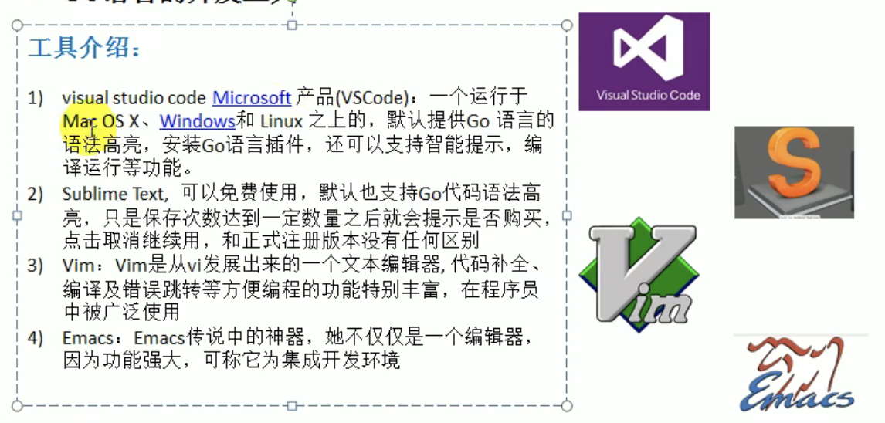

# Golang 学习笔记

## 1.Golang开山篇

Go 语言，可以简写为 Golang。Go 语言是区块链最主流的编程语言，同时也是当前最具发展潜力的语言。Go 语言是 Google 公司创造的语言，也是 Google 主推的语言。

### 1.1 Go 语言的诞生

#### 1.1.1 Go 语言的核心开发团队


#### 1.1.2 Google 创造 Go 语言的原因


#### 1.1.3 Go 语言发展简史


### 1.2 Go 语言的特点


#### 1.2.1 指针举例

``` go
package main

// go语言的指针的使用特点
func testPtr(num *int) {
    *num = 1;
		
}
```

#### 1.2.2 返回多个值举例

> Go 语言函数支持返回多个值

``` go
// 写一个函数，实现返回和与差
func getSumAndSub(n1 int, n2 int) (int, int) {
  sum := n1 + n2	// Go 语言语句后面不要带分号
  sub := n1 - n2
  return sum, sub
}
```

### 1.3 Golang 的学习方向


### 1.4 Golang 应用领域

#### 1.4.1 区块链的应用


#### 1.4.2 后端服务器应用


#### 1.4.3 云计算/云服务后台应用


### 1.5 如何学习一个新的东西


### 1.6 Go 语言的开发工具




### 1.7 环境安装

#### 1.7.1 Mac 下安装SDK


**1.下载 Go 语言 SDK**

下载地址：[https://golang.google.cn/dl/](https://golang.google.cn/dl/)

当前最新稳定版为 `go1.17.5` 版本，点击下载 [go1.17.5.darwin-amd64.tar.gz](https://golang.google.cn/dl/go1.17.5.darwin-amd64.tar.gz)


**2.解压**

解压 SDK 压缩包，然后移动到 `/Users/chentao10/Developments` 目录下

**3.配置环境变量**

在 `~/.bash_profile` 文件下添加三条语句：

``` text
export GOROOT=/Users/chentao10/Developments/go
export PATH=$PATH:$GOROOT/bin
export GOPATH=/Users/chentao10/Code/local/go-practical
```

然后执行 `source ~/.bash_profile`


## 2.Go 语言快速入门

### 2.1 Hello World

开发一个 `Hello World` 程序，可以输出 “Hello World“。

#### 2.1.1 目录结构

``` text
go-practical
└── src
    └── go_code
        ├── project01
        │   ├── main
        │   │   └── hello.go
        │   └── package
        └── project02
```

#### 2.1.2 代码如下


1. Go 文件的后缀是 `.go`

2. `package mian` 

    表示：该 `hello.go` 文件所在的包是 `mian`，在 Go 中每个文件都必须归属于一个包。

3. `import "fmt"`

    表示：引入一个包，包名为 `fmt`，引入该包后，就可以使用 `fmt` 包的函数，比如：`fmt.Println`

4. `func mian()`

    `func` 是一个关键字，表示一个函数

    `main` 是函数名，是一个主函数，即程序的入口

5. `fmt.Println("Hello World")`

    表示：调用 `fmt` 包的函数，`Println` 函数输出 “Hello World“

#### 2.1.3 编译代码

使用命令 `go build <源码文件名>.go` 编译代码


红框中的 `hello` 文件就是可以执行文件

#### 2.1.4 运行代码

直接在当前目录下输入 `./hello` 然后回车即可运行编译好的可执行文件


或者直接使用命令 `go run <源码文件名>.go` 也可以运行代码


### 2.2 执行流程分析

如果是对源码编译后，再执行，Go 语言的执行流程如下图所示：


如果是对源码直接执行 `go run <源码文件名>.go`，源码的执行流程如下图所示：


两种执行流程的方式区别：


### 2.3 编译和运行说明

1. 有了 go 源文件，通过编译器将其编译成机器可以识别的二进制文件。

2. 在该源文件目录下，通过 `go build` 命令对 `hello.go` 文件进行编译。可以指定生成的可执行文件名，在 Windows 下后缀必须是 `.exe`。

    可以通过命令 `go build -o <指定文件名> <源码文件名>.go` 来生成指定文件名的可执行文件。

    

3. 如果程序没有错误，没有任何提示，会在当前目录下出现一个可执行文件（Windows 下是 `.exe`，Linux 和 Mac 下是一个可执行文件），该文件是二进制码文件，也就是可以执行的程序。

4. 如果程序有错误，编译时，会在错误的那行报错。

    

5. 运行的两种形式：

    - 直接运行生成的可执行 Go 程序，比如 Windows 下的 `hello.exe`；
    - 通过运行工具 `go run` 对源代码文件进行运行。

### 2.4 Go 语言开发注意事项

1. Go 源文件是以 `.go` 为扩展名；
2. Go 应用程序的执行入口是 `main()` 函数；
3. Go 语言严格区分大小写；
4. Go 方法由一条条语句构成，每行语句最后不需要写分号（Go 语言会在每行后自动加分号），这也体现出 Golang 的简洁性；
5. Go 编译器是一行行进行编译的，因此我们一行就写一条语句，不能把多条语句写在同一行，否则代码不能编译通过；
6. Go 语言定义的变量或者 import 的包如果没有使用到，代码不能编译通过；
7. 大括号都是成堆出现的，缺一不可。

### 2.5 Go 语言中的转义字符

1. `\t`：一个制表位，实现对齐的功能；
2. `\n`：换行符；
3. `\\`：一个 \；
4. `\"`：一个 "；
5. `\r`：一个回车，表示从当前行的最前面开始输出，覆盖掉之前的内容。

### 2.6 Go 语言开发常见问题和解决方法

**找不到文件**


解决方法：源文件名不存在或者写错，或者当前路径错误。

### 2.7 Go 语言中的注释

用于注解说明解释程序的文字说明就是注释，注释提高了代码的阅读性。

**1.行注释**

``` go
// 注释内容
```

**2.块注释**

``` go
/*
 * 注释内容
 */
```

> 1.对于行注释和块注释，被注释的文字，不会被 Go 语言编译器执行；
>
> 2.块注释里面不允许有块注释嵌套。

