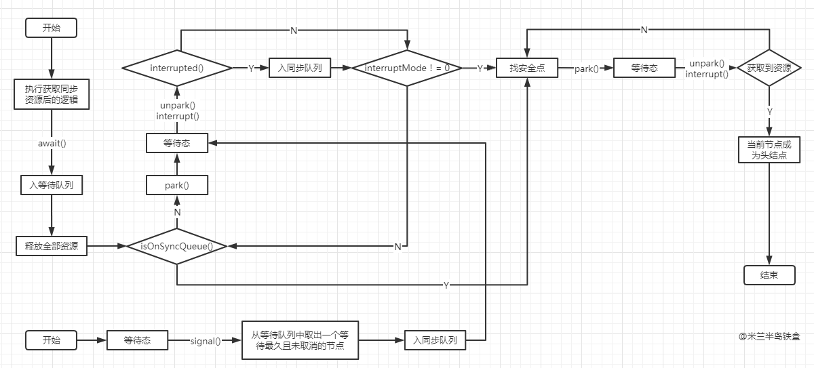
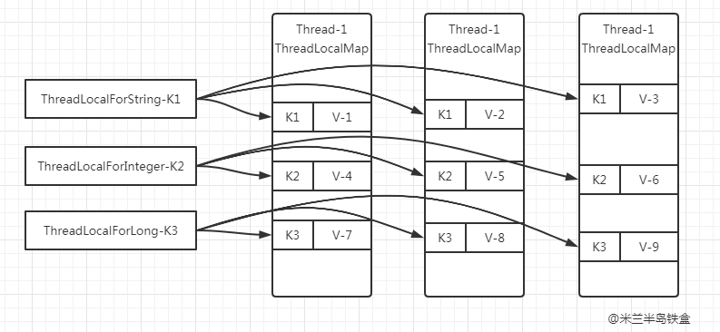
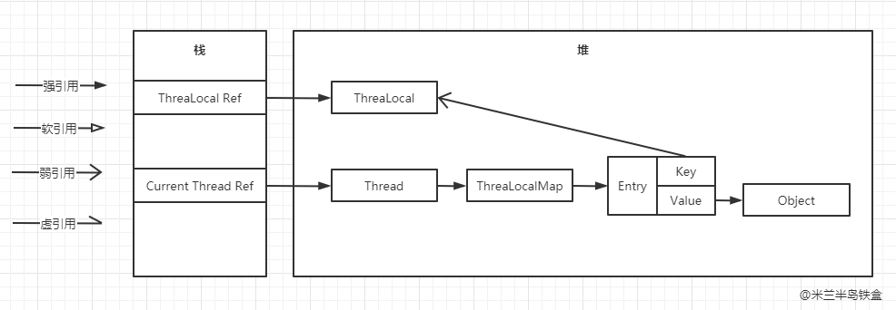

# JDK源码分析系列

# 1.JDK源码分析之——AQS

在 Java 高并发编程中，我们经常会用到 `ReentrantLock`、`CountDownLatch`、`Semaphore` 等同步类，它们的功能可能不尽相同，但是它们都有一个共同点，就是实现依赖了 `AQS（AbstractQueuedSynchronizer）`。这是一个抽象的队列同步器，它定义了一套多线程访问共享资源的同步器框架。今天我们通过源码分析来看看它的真面目。

## 1.框架


它维护了一个 `volatile int state`（代表共享资源）和一个 FIFO 线程同步队列（多线程争用资源被阻塞时会进入此队列）。state的访问方式有三种:

1. getState()
2. setState()
3. compareAndSetState()

AQS 定义两种资源共享方式：Exclusive（独占，只有一个线程能执行，如 `ReentrantLock`）和 Share（共享，多个线程可同时执行，如 `Semaphore/CountDownLatch`）。

不同的自定义同步器争用共享资源的方式也不同。自定义同步器在实现时只需要实现共享资源 state 的获取与释放方式即可，至于具体线程同步队列的维护（如获取资源失败入队/唤醒出队等），AQS 已经在顶层实现好了。自定义同步器实现时主要实现以下几种方法：

1. `isHeldExclusively()`：该线程是否正在独占资源。只有用到 `Condition` 才需要去实现它；
2. `tryAcquire(int)`：独占方式。尝试获取资源，成功则返回 true，失败则返回 false；
3. `tryRelease(int)`：独占方式。尝试释放资源，成功则返回 true，失败则返回 false；
4. `tryAcquireShared(int)`：共享方式。尝试获取资源。负数表示失败；0 表示成功，但没有剩余可用资源；正数表示成功，且有剩余资源；
5. `tryReleaseShared(int)`：共享方式。尝试释放资源，如果释放后允许唤醒后续等待结点返回 true，否则返回 false。

以 `ReentrantLock` 为例，`state` 初始化为 0，表示未锁定状态。A 线程 `lock()` 时，会调用 `tryAcquire()` 独占该锁并将 `state + 1`。此后，其他线程再 `tryAcquire()` 时就会失败，直到 A 线程 `unlock()` 到 `state = 0`（即释放锁）为止，其它线程才有机会获取该锁。当然，释放锁之前，A 线程自己是可以重复获取此锁的（`state` 会累加），这就是可重入的概念。但要注意，获取多少次就要释放多少次，这样才能保证 `state` 是能回到零态的。

再以 `CountDownLatch` 以例，任务分为 N 个子线程去执行，`state` 也初始化为 N（注意 N 要与线程个数一致）。这 N 个子线程是并行执行的，每个子线程执行完后 `countDown()` 一次，`state` 会 CAS 减 1。等到所有子线程都执行完后(即 `state = 0`)，会 `unpark()` 主调用线程，然后主调用线程就会从 `await()` 函数返回，继续后余动作。

一般来说，自定义同步器要么是独占方法，要么是共享方式，他们也只需实现 `tryAcquire-tryRelease`、`tryAcquireShared-tryReleaseShared` 中的一种即可。但 AQS 也支持自定义同步器同时实现独占和共享两种方式，如 `ReentrantReadWriteLock`。

## 2.源码分析：独占模式

本节依照 `acquire-release`、`acquireShared-releaseShared` 的次序来讲解 AQS 的源码。

### 2.1 acquire(int)

此方法是独占模式下线程获取共享资源的顶层入口。如果获取到资源，线程直接返回，否则进入同步队列，直到获取到资源为止，且整个过程忽略中断的影响。这也正是 `lock()` 的语义，当然不仅仅只限于 `lock()`。获取到资源后，线程就可以去执行其临界区代码了。下面是 `acquire()` 的源码：

``` java
public final void acquire(int arg) {
    if (!tryAcquire(arg) &&
        acquireQueued(addWaiter(Node.EXCLUSIVE), arg))
        selfInterrupt();
}
```

方法流程如下：

1. `tryAcquire()` 尝试直接去获取资源，如果成功则直接返回；
2. `addWaiter()` 将该线程加入同步队列的尾部，并标记为独占模式；
3. `acquireQueued()` 使线程在同步队列中获取资源，一直获取到资源后才返回。如果在整个等待过程中被中断过，则返回 true，否则返回 false；
4. 如果线程在等待过程中被中断过，它是不响应的。只是获取资源后才再进行自我中断 `selfInterrupt()`，将中断补上。

#### 2.1.1 tryAcquire(int)

此方法尝试去获取独占资源。如果获取成功，则直接返回 true，否则直接返回 false。这也正是 `tryLock()` 的语义，还是那句话，当然不仅仅只限于 `tryLock()`。如下是 `tryAcquire()` 的源码：

``` java
protected boolean tryAcquire(int arg) {
    throw new UnsupportedOperationException();
}
```

AQS这里只定义了一个接口，具体资源的获取交由自定义同步器去实现了（通过 `state` 的 get/set/CAS）至于能不能重入，能不能加塞，那就看具体的自定义同步器怎么去设计了。当然，自定义同步器在进行资源访问时要考虑线程安全的影响。

这里之所以没有定义成 abstract，是因为独占模式下只用实现 `tryAcquire-tryRelease`，而共享模式下只用实现 `tryAcquireShared-tryReleaseShared`。如果都定义成 abstract，那么每个模式也要去实现另一模式下的接口。

#### 2.1.2 addWaiter(Node)

此方法用于将当前线程加入到同步队列的队尾，并返回当前线程所在的结点。还是上源码吧：

``` java
private Node addWaiter(Node mode) {
    // 以给定模式构造结点。mode有两种：EXCLUSIVE（独占）和SHARED（共享）
    Node node = new Node(Thread.currentThread(), mode);
    // Try the fast path of enq; backup to full enq on failure
    // 尝试快速的方式将新节点放入队尾
    Node pred = tail;
    if (pred != null) {
        node.prev = pred;
        if (compareAndSetTail(pred, node)) {
            pred.next = node;
            return node;
        }
    }
    // 快速的方式放入队尾失败
  	// 或者队列为空则通过此方法入队
    enq(node);
    return node;
}
```

`Node` 结点是对每一个访问同步代码的线程的封装，其包含了需要同步的线程本身以及线程的状态，如是否被阻塞，是否等待唤醒，是否已经被取消等。变量 `waitStatus` 则表示当前被封装成 `Node` 结点的等待状态，共有 4 种取值 `CANCELLED`、`SIGNAL`、`CONDITION`、`PROPAGATE`。

1. `CANCELLED`：值为 1，在同步队列中等待的线程等待超时或被中断，需要从同步队列中取消该 `Node` 的结点，其结点的 `waitStatus` 为 `CANCELLED`，即结束状态，进入该状态后的结点将不会再变化；
2. `SIGNAL`：值为 -1，被标识为该等待唤醒状态的后继结点，当其前继结点的线程释放了同步锁或被取消，将会通知该后继结点的线程执行。说白了，就是处于唤醒状态，只要前继结点释放锁，就会通知标识为 `SIGNAL` 状态的后继结点的线程执行；
3. `CONDITION`：值为 -2，与 `Condition` 相关，该标识的结点处于等待队列中，结点的线程等待在 `Condition` 上，当其他线程调用了 `Condition` 的 `signal()` 方法后，`CONDITION` 状态的结点将从等待队列转移到同步队列中，等待获取同步锁；
4. `PROPAGATE`：值为 -3，与共享模式相关，在共享模式中，该状态标识结点的线程处于可运行状态；
5. 0 状态：值为 0，代表初始化状态。

AQS 在判断状态时，通过用 `waitStatus > 0` 表示取消状态，而 `waitStatus < 0` 表示有效状态。

##### 2.1.2.1 enq(Node)

此方法用于当同步队列为空或者有多个结点并发加入队尾时，通过 CAS 自旋的方式将 node 加入队尾。源码如下：

``` java
private Node enq(final Node node) {
    // CAS"自旋"，直到成功加入队尾
    for (;;) {
        Node t = tail;
        if (t == null) { // 队列为空，创建一个空的标志结点作为head结点，并将tail也指向它。
            if (compareAndSetHead(new Node()))
                tail = head;
        } else { //将node节点放入队尾
            node.prev = t;
            if (compareAndSetTail(t, node)) {
                t.next = node;
                return t;
            }
        }
    }
}
```

#### 2.1.3 acquireQueued(Node, int)

通过 `tryAcquire()` 和 `addWaiter()`，该线程获取资源失败，已经被放入同步队列尾部了。接下来应该进入等待状态休息，直到其他线程彻底释放资源后唤醒自己，自己再拿到资源，然后就可以执行临界区的代码了。源码如下：

``` java
// 在同步队列中排队拿号（中间没其它事干可以休息），直到拿到号后再返回
final boolean acquireQueued(final Node node, int arg) {
    // 标记是否获取资源失败
    boolean failed = true;
    try {
        // 标记等待过程中是否被中断过
        boolean interrupted = false;
        for (;;) {
            // 获取当前节点的前驱节点
            final Node p = node.predecessor();
            // 如果前驱是head，即该结点已成老二，那么便有资格去尝试获取资源
            // 可能是老大释放完资源唤醒自己的，当然也可能被interrupt了
            if (p == head && tryAcquire(arg)) {
                // 拿到资源后，将head指向该结点。所以head所指的标杆结点，就是当前获取到资源的那个结点或null。
                setHead(node);
                p.next = null; // help GC
                failed = false;
                //返回等待过程中是否被中断过
                return interrupted;
            }
            // 因为暂时无法获取到资源，所以先进入waiting状态，直到有资源释放时被unpark()唤醒
            if (shouldParkAfterFailedAcquire(p, node) &&
                parkAndCheckInterrupt())
                // 如果等待过程中被中断过，哪怕只有那么一次，就将interrupted标记为true
                interrupted = true;
        }
    } finally {
        if (failed)
            cancelAcquire(node);
    }
}
```

##### 2.1.3.1 shouldParkAfterFailedAcquire(Node, Node)

此方法主要用于检查状态，看看自己是否真的可以进入 waiting 状态。源码如下：

``` java
private static boolean shouldParkAfterFailedAcquire(Node pred, Node node) {
    // 拿到前驱节点的状态
    int ws = pred.waitStatus;
    if (ws == Node.SIGNAL)
        // 如果已经设置为了SIGNAL，那就可以直接进入waiting状态了
        return true;
    if (ws > 0) {
        // 如果前驱放弃了，那就一直往前找，直到找到最近一个正常等待的状态，并排在它的后边
        // 注意：那些放弃的结点，由于被自己“加塞”到它们前边，它们相当于形成一个无引用链，稍后就会被GC回收
        do {
            node.prev = pred = pred.prev;
        } while (pred.waitStatus > 0);
        pred.next = node;
    } else {
        // 如果前驱正常，那就把前驱的状态设置成SIGNAL，告诉它拿完号后通知自己一下
        compareAndSetWaitStatus(pred, ws, Node.SIGNAL);
    }
    return false;
}
```

##### 2.1.3.2 parkAndCheckInterrupt()

此方法就是让线程真正进入等待状态，源码如下：

``` java
private final boolean parkAndCheckInterrupt() {
    // 调用park()使线程进入waiting状态
    LockSupport.park(this);
    // 如果被唤醒，查看自己是不是被中断的，注意：此方法会清除中断状态
    return Thread.interrupted();
}
```

`park()` 会让当前线程进入 waiting 状态。在此状态下，有两种途径可以唤醒该线程：

1. 被 `unpark()`；
2. 被 `interrupt()`。

需要注意的是，`Thread.interrupted()` 会清除当前线程的中断标记位。 

##### 2.1.3.3 小结

看了 `shouldParkAfterFailedAcquire()` 和 `parkAndCheckInterrupt()`，现在让我们再回到 `acquireQueued()`，总结下该函数的具体流程：

1. 结点进入队尾后，检查状态，找到安全休息点；
2. 调用 `park()` 进入 waiting 状态，等待 `unpark()` 或 `interrupt()` 唤醒自己；
3. 被唤醒后，看自己是不是有资格能拿到号。如果拿到，head 指向当前结点，并返回从入队到拿到号的整个过程中是否被中断过；如果没拿到，继续流程 1。

#### 2.1.4 acquire方法小结

`acquireQueued()` 分析完之后，我们接下来再回到 `acquire()`，源码如下：

``` java
public final void acquire(int arg) {
    if (!tryAcquire(arg) &&
        acquireQueued(addWaiter(Node.EXCLUSIVE), arg))
        selfInterrupt();
}
```

再来总结下它的流程吧：

1. 调用自定义同步器的 `tryAcquire()` 尝试直接去获取资源，如果成功则直接返回；
2. 没成功，则 `addWaiter()` 将该线程加入同步队列的尾部，并标记为独占模式；
3. `acquireQueued()` 使线程在同步队列中休息，有机会时（轮到自己，会被 `unpark()`）会去尝试获取资源。获取到资源后才返回。如果在整个等待过程中被中断过，则返回 true，否则返回 false。
4. 如果线程在等待过程中被中断过，它是不响应的。只是获取资源后才再进行自我中断 `selfInterrupt()`，将中断补上。

流程图：


至此，`acquire()` 的流程终于算是告一段落了。这也就是 `ReentrantLock.lock()` 的流程，不信你去看其 `lock()` 源码吧，整个函数就是一条 `acquire(1)`！！！


### 2.2 release(int)

此方法是独占模式下线程释放共享资源的顶层入口，它会释放指定量的资源，如果彻底释放了（即 `state=0`），它会唤醒同步队列里的其他线程来获取资源。这也正是 `unlock()` 的语义，当然不仅仅只限于 `unlock()`。下面是 `release()` 的源码：

``` java
public final boolean release(int arg) {
    if (tryRelease(arg)) {
        Node h = head;
        if (h != null && h.waitStatus != 0)
            // 唤醒同步队列里的下一个线程
            unparkSuccessor(h);
        return true;
    }
    return false;
}
```

它调用 `tryRelease()` 来释放资源。有一点需要注意的是，它是根据 `tryRelease()` 的返回值来判断该线程是否已经完成释放掉资源了，所以自定义同步器在设计 `tryRelease()` 的时候要明确这一点。

#### 2.2.1 tryRelease(int)

此方法尝试去释放指定量的资源。下面是 `tryRelease()` 的源码：

``` java
protected boolean tryRelease(int arg) {
    throw new UnsupportedOperationException();
}
```

跟 `tryAcquire()` 一样，这个方法是需要独占模式的自定义同步器去实现的。正常来说，`tryRelease()` 都会成功的，因为这是独占模式，该线程来释放资源，那么它肯定已经拿到独占资源了，直接减掉相应量的资源即可(`state -= arg`)，也不需要考虑线程安全的问题。但要注意它的返回值，上面已经提到了，`release()` 是根据 `tryRelease()` 的返回值来判断该线程是否已经完成释放掉资源了！所以自义定同步器在实现时，如果已经彻底释放资源( `state = 0`)，要返回 true，否则返回 false。

#### 2.2.2 unparkSuccessor(Node)

此方法用于唤醒同步队列中下一个线程。下面是源码：

``` java
private void unparkSuccessor(Node node) {
    // node一般为当前线程所在的结点
    int ws = node.waitStatus;
    if (ws < 0)// 置零当前线程所在的结点状态，允许失败
        compareAndSetWaitStatus(node, ws, 0);
 
    // 找到下一个需要唤醒的结点s
    Node s = node.next;
    // 如果这个节点不存在，或已经取消等待
    if (s == null || s.waitStatus > 0) {
        s = null;
        // 从队列尾部开始遍历，获取从头部开始算第一个可用的节点
        for (Node t = tail; t != null && t != node; t = t.prev)
            if (t.waitStatus <= 0)
                s = t;
    }
    if (s != null)
        LockSupport.unpark(s.thread); // 唤醒
}
```

这个方法并不复杂。一句话概括：用 `unpark()` 唤醒同步队列中最前边的那个未放弃线程，这里我们也用 s 来表示吧。此时，再和 `acquireQueued()` 联系起来，s 被唤醒后，进入 `if (p == head && tryAcquire(arg))` 的判断（即使 `p != head` 也没关系，它会再进入 `shouldParkAfterFailedAcquire()` 寻找一个安全点。这里既然 s 已经是同步队列中最前边的那个未放弃线程了，那么通过 `shouldParkAfterFailedAcquire()` 的调整，s 也必然会跑到 `head` 的 `next` 结点，下一次自旋 `p == head` 就成立啦），然后 s 把自己设置成 `head` 标杆结点，表示自己已经获取到资源了，`acquire()` 也返回了，就可以执行线程自己的任务了。

#### 2.2.3小结

`release()` 是独占模式下线程释放共享资源的顶层入口。它会释放指定量的资源，如果彻底释放了（即 `state = 0`）,它会唤醒同步队列里的其他线程来获取资源。

## 3.源码分析：共享模式

### 3.1 acquireShared(int)

此方法是共享模式下线程获取共享资源的顶层入口。它会获取指定量的资源，获取成功则直接返回，获取失败则进入同步队列，直到获取到资源为止，整个过程忽略中断。下面是 `acquireShared()` 的源码：

``` java
public final void acquireShared(int arg) {
    if (tryAcquireShared(arg) < 0)
        doAcquireShared(arg);
}
```

这里 `tryAcquireShared()` 依然需要自定义同步器去实现。但是 AQS 已经把其返回值的语义定义好了：

- 负值代表获取失败；
- 0 代表获取成功，但没有剩余资源；
- 正数表示获取成功，还有剩余资源，其他线程还可以去获取。

所以这里 `acquireShared()` 的流程就是：

1. `tryAcquireShared()` 尝试获取资源，成功则直接返回；
2. 失败则通过 `doAcquireShared()` 进入同步队列，直到获取到资源为止才返回。

#### 3.1.1 doAcquireShared(int)

此方法用于将当前线程加入同步队列尾部休息，直到其他线程释放资源唤醒自己，自己成功拿到相应量的资源后才返回。下面是doAcquireShared()的源码：

``` java
private void doAcquireShared(int arg) {
    // 现将当前线程加入队列尾部
    final Node node = addWaiter(Node.SHARED);
    // 是否成功标志
    boolean failed = true;
    try {
        // 等待过程中是否被中断过的标志
        boolean interrupted = false;
        for (;;) {
            // 前驱
            final Node p = node.predecessor();
            // 如果到head的下一个，因为head是拿到资源的线程
            // 此时node被唤醒，很可能是head用完资源来唤醒自己的
            if (p == head) {
                // 尝试获取资源
                int r = tryAcquireShared(arg);
                if (r >= 0) {
                    // 将head指向自己，还有剩余资源可以再唤醒之后的线程
                    setHeadAndPropagate(node, r);
                    p.next = null; // help GC
                    // 如果等待过程中被打断过，此时将中断补上
                    if (interrupted)
                        selfInterrupt();
                    failed = false;
                    return;
                }
            }
             
            // 判断状态，寻找安全点，进入waiting状态，等着被unpark()或interrupt()
            if (shouldParkAfterFailedAcquire(p, node) &&
                parkAndCheckInterrupt())
                interrupted = true;
        }
    } finally {
        if (failed)
            cancelAcquire(node);
    }
}
```

这个方法和 `acquireQueued()` 很相似，在流程上并没有太大区别。只不过这里将补中断的 `selfInterrupt()` 放到 `doAcquireShared()` 里了，而独占模式是放到 `acquireQueued()` 之外，其实都一样。

跟独占模式比，还有一点需要注意的是，这里只有线程是 `head.next`（“老二”）时，才会去尝试获取资源，有剩余的话还会唤醒之后的队友。那么问题就来了，假如老大用完后释放了 5 个资源，而老二需要 6 个，老三需要 1 个，老四需要 2 个。老大先唤醒老二，老二一看资源不够，他是把资源让给老三呢，还是不让？答案是否定的！老二会继续 `park()` 等待其他线程释放资源，也更不会去唤醒老三和老四了。独占模式，同一时刻只有一个线程去执行，这样做未尝不可；但共享模式下，多个线程是可以同时执行的，现在因为老二的资源需求量大，而把后面量小的老三和老四也都卡住了。当然，这并不是问题，只是 AQS 保证严格按照入队顺序唤醒罢了（保证公平，但降低了并发）。

##### 3.1.1.1 setHeadAndPropagate(Node, int)

``` java
private void setHeadAndPropagate(Node node, int propagate) {
    Node h = head; // Record old head for check below
    // head指向自己
    setHead(node);
    // 如果还有剩余量，继续唤醒下一个邻居线程
    if (propagate > 0 || h == null || h.waitStatus < 0 ||
        (h = head) == null || h.waitStatus < 0) {
        Node s = node.next;
        if (s == null || s.isShared())
            doReleaseShared();
    }
}
```

此方法在 `setHead()` 的基础上多了一步，就是自己苏醒的同时，如果条件符合（比如还有剩余资源），还会去唤醒后继结点，毕竟是共享模式。

#### 3.1.2小结

至此，`acquireShared()` 也要告一段落了。让我们再梳理一下它的流程：

1. `tryAcquireShared()` 尝试获取资源，成功则直接返回；
2. 失败则通过 `doAcquireShared()` 进入同步队列 `park()`，直到被 `unpark()/interrupt()` 并成功获取到资源才返回。整个等待过程也是忽略中断的，其实跟 `acquire()` 的流程大同小异，只不过多了个自己拿到资源后，还会去唤醒后继队友的操作（这才是共享嘛）。

### 3.2 releaseShared()

上一小节已经把 `acquireShared()` 说完了，这一小节就来讲讲它的反操作 `releaseShared()` 吧。此方法是共享模式下线程释放共享资源的顶层入口。它会释放指定量的资源，如果成功释放且允许唤醒等待线程，它会唤醒同步队列里的其他线程来获取资源。下面是 `releaseShared()` 的源码：

``` java
public final boolean releaseShared(int arg) {
    // 尝试释放资源
    if (tryReleaseShared(arg)) {
        // 唤醒后继结点
        doReleaseShared();
        return true;
    }
    return false;
}
```

此方法的流程也比较简单，一句话：释放掉资源后，唤醒后继。跟独占模式下的 `release()` 相似，但有一点稍微需要注意：独占模式下的 `tryRelease()` 在完全释放掉资源（`state = 0`）后，才会返回 true 去唤醒其他线程，这主要是基于独占下可重入的考量；而共享模式下的 `releaseShared()` 则没有这种要求，共享模式实质就是控制一定量的线程并发执行，那么拥有资源的线程在释放掉部分资源时就可以唤醒后继等待结点。例如，资源总量是 13，A（5）和 B（7）分别获取到资源并发运行，C（4）来时只剩 1 个资源就需要等待。A 在运行过程中释放掉 2 个资源量，然后 `tryReleaseShared(2)` 返回 true 唤醒 C，C 一看只有 3 个仍不够继续等待；随后 B 又释放 2 个，`tryReleaseShared(2)` 返回 true 唤醒 C，C 一看有 5 个够自己用了，然后 C 就可以跟 A 和 B 一起运行。而 `ReentrantReadWriteLock` 读锁的 `tryReleaseShared()` 只有在完全释放掉资源（`state = 0`）才返回 true，所以自定义同步器可以根据需要决定 `tryReleaseShared()` 的返回值。

#### 3.2.1 doReleaseShared()

此方法主要用于唤醒后继。下面是它的源码：

``` java
private void doReleaseShared() {
    for (;;) {
        Node h = head;
        if (h != null && h != tail) {
            int ws = h.waitStatus;
            if (ws == Node.SIGNAL) {
                if (!compareAndSetWaitStatus(h, Node.SIGNAL, 0))
                    continue;            // loop to recheck cases
                // 唤醒后继节点
                unparkSuccessor(h);
            }
            else if (ws == 0 &&
                     !compareAndSetWaitStatus(h, 0, Node.PROPAGATE))
                continue;                // loop on failed CAS
        }
        // head未发生改变
        if (h == head)                   // loop if head changed
            break;
    }
}
```


## 4.总结

本节我们详解了独占和共享两种模式下获取-释放资源(`acquire-release`、`acquireShared-releaseShared`)的源码，相信大家都有一定认识了。值得注意的是，`acquire()` 和 `acquireShared()` 两种方法下，线程在同步队列中都是忽略中断的。AQS 也支持响应中断的，`acquireInterruptibly()/acquireSharedInterruptibly()` 即是，这里相应的源码跟 `acquire()` 和 `acquireShared()` 差不多，这里就不再详解了。

# 2.JDK源码分析之——ReentrantLock

## 简介

`ReentrantLock` 是 `Lock` 接口的实现类，是一把可以支持重入的锁，静态内部抽象类 `Sync` 继承了 AQS（`AbstractQueuedSynchronizer`），`Sync` 的子类 `FairSync`、`NonfairSync` 分别实现了公平锁和非公平锁。与 `synchronized` 相比，重入锁有着显式的操作过程，开发人员必须手动指定何时加锁，何时释放锁。所以，重入锁对逻辑控制的灵活性要远远好于 `synchronized`。`ReentrantLock` 具有以下特点：

1. 支持重入性，能够对共享资源重复加锁，即获得锁的线程再次获取锁时不需要被阻塞；
2. 支持公平锁和非公平锁；
3. 支持中断响应；
4. 支持锁申请等待限时；
5. 支持锁申请快速失败。

以上特点都会在源码中一一体现，在注释中也做了简单的说明，细心的同学一定会发现哦。

## 1.构造方法

`ReentrantLock` 有两个构造方法，无参构造方法默认是创建非公平锁，入参 boolean 类型的构造方法通过 true 和 false 决定创建什么样的锁，其中 true 创建公平锁，false 创建非公平锁。其中公平锁和非公平锁由静态内部类 `FairSync` 和 `NonfairSync` 实现（具体实现下面会写）,构造方法源码如下：

``` java
/**
 * 无参构造方法默认是创建非公平锁
 */
public ReentrantLock() {
    sync = new NonfairSync();
}

/**
 * 有参构造方法
 * true创建公平锁，false创建非公平锁
 */
public ReentrantLock(boolean fair) {
    sync = fair ? new FairSync() : new NonfairSync();
}
```

## 2.Sync

静态内部抽象类 `Sync` 继承了 AQS，并实现了 AQS 的独占模式，这里只重写了 `tryRelease` 方法，`tryAcquire` 方法都是放在子类中去重写的，具体源码解析如下：

``` java
abstract static class Sync extends AbstractQueuedSynchronizer {

    /**
     * 这里定义为抽象方法的lock方法
     * 是为非公平版本提供快速路径
     */
    abstract void lock();

    /**
     * 在这里实现非公平锁的tryAcquire方法
     * 是因为两种方式的锁对应的tryLock方法都需要调用这个方法
     * 而两种方式的锁真正的tryAcquire方法都将在子类中实现
     */
    final boolean nonfairTryAcquire(int acquires) {
        // 获取当前线程对象，用于后面比较锁的持有对象是否为当前线程
        final Thread current = Thread.currentThread();
        // 获取state值，state在这里表示加锁的次数
        int c = getState();
        if (c == 0) {
            // state为0表示当前锁没有被任何线程持有
            // 通过CAS的方式尝试去修改state的值
            if (compareAndSetState(0, acquires)) {
                // 修改成功表示获得锁
                // 把当前线程对象赋值给exclusiveOwnerThread变量
                // 标记当前持有锁的线程对象
                setExclusiveOwnerThread(current);
                return true;
            }
        }
        else if (current == getExclusiveOwnerThread()) {
            // 锁被当前线程持有
            // 就在state加上acquires（重入的概念）
            int nextc = c + acquires;
            if (nextc < 0) // overflow
                throw new Error("Maximum lock count exceeded");
            
            // 修改state的值
            setState(nextc);
            return true;
        }

        // 获取锁失败
        return false;
    }

    /**
     * 释放锁，其实就是修改state的值
     * 每释放一次锁state就减releases
     * 加了几次锁，就得释放几次锁
     * state == 0时锁才完全释放
     */
    protected final boolean tryRelease(int releases) {
        int c = getState() - releases;
        if (Thread.currentThread() != getExclusiveOwnerThread())
            // 持有锁的不是当前线程支持抛出异常
            throw new IllegalMonitorStateException();
        
        boolean free = false;
        if (c == 0) {
            // 如果state == 0表示锁已经完全释放
            free = true;
            // 将持有锁定的标记置为null
            setExclusiveOwnerThread(null);
        }

        // 修改state的值
        setState(c);
        return free;
    }

    /**
     * 判断持有锁的线程是否为当前线程
     */
    protected final boolean isHeldExclusively() {
        // While we must in general read state before owner,
        // we don't need to do so to check if current thread is owner
        return getExclusiveOwnerThread() == Thread.currentThread();
    }
}
```

## 3.NonfairSync

非公平锁的实现类 `NonfairSync`，重写了 `lock` 方法和 `tryAcquire` 方法，源码如下：

``` java
static final class NonfairSync extends Sync {

    /**
     * 非公平锁调用加锁
     */
    final void lock() {
        // 不判断当前锁是否已经被占有
        // 尝试直接获得锁，有可能抢在同步队列中的线程之前获得锁
        // 体现了非公平锁的概念
        if (compareAndSetState(0, 1))
            // 成功获得锁
            // 把当前线程对象赋值给exclusiveOwnerThread变量
            // 标记当前持有锁的线程对象
            setExclusiveOwnerThread(Thread.currentThread());
        else
            // 调用AQS的acquire方法获得锁
            acquire(1);
    }

    /**
     * 非公平锁加锁，其实就是修改state的值
     * 每加一次锁state就加1
     * 具体实现在nonfairTryAcquire方法中
     */
    protected final boolean tryAcquire(int acquires) {
        return nonfairTryAcquire(acquires);
    }
}
```

## 4.FairSync

公平锁的实现类 `FairSync`，也重写了 `lock` 方法和 `tryAcquire` 方法，源码如下：

``` java
static final class FairSync extends Sync {

    /**
     * 公平锁调用加锁
     * 直接调用AQS的acquire方法获得锁
     */
    final void lock() {
        acquire(1);
    }

    /**
     * 公平锁加锁
     * 没有其它线程在等待锁，或者当前线程是同步队列的第一个
     * 才有资格尝试去获得锁
     */
    protected final boolean tryAcquire(int acquires) {
        // 获取当前线程对象，用于后面比较锁的持有对象是否为当前线程
        final Thread current = Thread.currentThread();
        // 获取state值，state在这里表示加锁的次数
        int c = getState();
        if (c == 0) {
            // state为0表示当前锁没有被任何线程持有
            // 在没有其它线程在等待锁
            // 或者当前线程是同步队列的第一个时
            // 才通过CAS的方式尝试去修改state的值
            // 体现了公平锁的概念
            if (!hasQueuedPredecessors() &&
                compareAndSetState(0, acquires)) {
                // 修改成功表示获得锁
                // 把当前线程对象赋值给exclusiveOwnerThread变量
                // 标记当前持有锁的线程对象
                setExclusiveOwnerThread(current);
                return true;
            }
        }
        else if (current == getExclusiveOwnerThread()) {
            // 锁被当前线程持有
            // 就在state加上acquires（重入的概念）
            int nextc = c + acquires;
            if (nextc < 0)
                throw new Error("Maximum lock count exceeded");

            // 修改state的值
            setState(nextc);
            return true;
        }

        // 获取锁失败
        return false;
    }
}

/**
 * 判断当前线程之前是否有线程在等待锁
 * 如果当前线程之前有一个排队的线程返回true
 * 如果当前线程位于同步队列的开头或队列为空返回false
 */
public final boolean hasQueuedPredecessors() {
    // The correctness of this depends on head being initialized
    // before tail and on head.next being accurate if the current
    // thread is first in queue.
    Node t = tail; // Read fields in reverse initialization order
    Node h = head;
    Node s;
    return h != t &&
        ((s = h.next) == null || s.thread != Thread.currentThread());
}
```

## 5.ReentrantLock的常用方法

### 5.1 加锁

加锁方式有好几种，大致可分为直接加锁、支持中断响应的加锁、支持快速失败的加锁、支持超时的加锁，因为具体加锁的实现都已经由 AQS 和 `ReentrantLock` 的内部类 `Sync`、`NonfairSync` 和 `FairSync` 实现好了，所以 `ReentrantLock` 加锁就变得很简单，具体如下：

``` java
/**
 * 直接加锁
 */
public void lock() {
    sync.lock();
}

/**
 * 支持中断响应的加锁
 */
public void lockInterruptibly() throws InterruptedException {
    sync.acquireInterruptibly(1);
}

/**
 * 支持快速失败的加锁
 */
public boolean tryLock() {
    return sync.nonfairTryAcquire(1);
}

/**
 * 支持超时的加锁
 */
public boolean tryLock(long timeout, TimeUnit unit)
        throws InterruptedException {
    return sync.tryAcquireNanos(1, unit.toNanos(timeout));
}
```

### 5.2 释放锁

释放锁的方式就一种，也很简单，源码如下：

``` java
/**
 * 释放锁
 */
public void unlock() {
    sync.release(1);
}
```

## 6.总结

重入锁使用 `java.util.concurrent.locks.ReentrantLock` 类来实现的，它完全可以替代 `synchronized` 关键字。与 `synchronized` 相比，重入锁有着显式的操作过程，开发人员必须手动指定何时加锁，何时释放锁。所以，重入锁对逻辑控制的灵活性要远远好于 `synchronized`。重入锁对于一个线程是可以反复进入的，也就是说，一个线程可以多次获得同一把锁，只不过需要注意的是，如果同一个线程多次获得锁，那么在释放锁的时候，也必须释放相同的次数。在 `ReentrantLock` 的实现中，主要包含三个要素：原子状态，原子状态使用 CAS 操作来存储当前锁的状态，判断是否已经被别的线程持有；同步队列，所有没有请求到锁的线程，会进入同步队列进行等待。待有线程释放锁后，系统就能从同步队列中唤醒一个线程，继续工作；阻塞原语 `park()` 和 `unpark()`，用来挂起和恢复线程，没有得到锁的线程将会被挂起。

# 3.JDK源码分析之——Condition

## 简介

`Condition` 是在 java 1.5 中才出现的，它用来替代传统的 `Object` 的 `wait()`、`notify()` 实现线程间的协作，相比使用 `Object` 的 `wait()`、`notify()`，使用 `Condition` 的 `await()`、`signal()` 这种方式实现线程间协作更加安全和高效。因此通常来说比较推荐使用 `Condition`。

`Condition` 能实现 `synchronized` 和 `wait`、`notify` 搭配的功能，另外比后者更灵活，`Condition` 可以实现多路通知功能，也就是在一个 `Lock` 对象里可以创建多个 `Condition`（即对象监视器）实例，线程对象可以注册在指定的 `Condition` 中，从而可以有选择的进行线程通知，在调度线程上更加灵活。而 `synchronized` 就相当于整个 `Lock` 对象中只有一个单一的 `Condition` 对象，所有的线程都注册在这个对象上。线程开始 `notifyAll` 时，需要通知所有的 WAITING 线程，没有选择权，会有相当大的效率问题。

这里要讲的是 `ReentrantLock` 中的 `Condition`，`Condition` 是一个接口，而 `ReentrantLock` 里使用的 `Condition` 是由 AQS 的内部类 `ConditionObject` 实现的。在 `ConditionObject` 内部维护了一个由 `Node`（AQS 里的另一个内部类）节点连接而成的等待队列，这个队列是一个单链表，同时 `ConditionObject` 还有指向单链表首尾节点的指针，方便对整个队列进行遍历。

流程图如下：


## 1.ConditionObject的成员变量

`ConditionObject` 的成员变量比较简单，包含两个分别指向队列头尾的指针和两种等待退出的模式，源码如下：

``` java
public class ConditionObject implements Condition, java.io.Serializable {
    private static final long serialVersionUID = 1173984872572414699L;

    /**
     * 指向队列的头指针
     */
    private transient Node firstWaiter;

    /**
     * 指向队列的尾指针
     */
    private transient Node lastWaiter;

    /**
     * 在等待退出时重新标记中断
     */
    private static final int REINTERRUPT =  1;

    /**
     * 在等待退出时抛出中断异常
     */
    private static final int THROW_IE    = -1;
}
```

## 2.await

`await` 方法的作用就是释放当前线程持有的锁，然后将当前线程挂起，直到有其它线程将它唤醒或者被中断。在源码讲解前，先来做个名称解释：

* 同步队列：指的是在 AQS 中等待获取资源的队列，由 AQS 控制；
* 等待队列：指的是调用 `await` 方法之后等待被 `signal` 唤醒的队列，由 AQS 内部类 `ConditionObject` 控制。

`await` 方法具体流程如下：

1. 如果线程被中断，直接抛出中断异常；
2. 创建一个状态为 `CONDITION` 的 `Node` 节点，并将节点放在等待队列的队尾；
3. 完全释放线程占有的全部资源；
4. 循环判断 `Node` 节点是否不在同步队列中，然后将当前线程挂起，否则退出循环，如果线程被中断也会退出循环；
5. 尝试去同步队列中获取所需要的资源，如果暂时拿不到就挂起当前线程，直到当前节点变成同步队列的第二个节点时被唤醒；
6. 如果当前节点在等待队列中还有后继节点，说明当前线程是被中断唤醒的，这个时候要把等待队列中不是 `CONDITION` 状态的节点清理掉；
7. 根据 `interruptMode` 的值来决定是否需要抛出中断异常或者重新标记中断。

源码如下：

``` java
public final void await() throws InterruptedException {
    if (Thread.interrupted())
        // 如果线程被中断过，就直接抛出中断异常
        throw new InterruptedException();
    // 创建一个状态为CONDITION的Node节点，并将节点放在等待队列的队尾
    Node node = addConditionWaiter();
    // 完全释放线程占有的全部资源
    int savedState = fullyRelease(node);
    // 标记线程最后退出的模式
    int interruptMode = 0;
    while (!isOnSyncQueue(node)) {
        // node节点不在同步队列中（指的是AQS的同步队列）
        // 当前线程被其它线程唤醒时
        // node节点就会被加入到同步队列的队尾，这时自然会退出循环

        // 挂起当前线程
        LockSupport.park(this);
        if ((interruptMode = checkInterruptWhileWaiting(node)) != 0)
            // 如果线程被中断，直接退出循环
            break;
    }

    // 尝试去同步队列中获取所需要的资源（这个方法在讲AQS的文章里讲过，这里不再复述）
    if (acquireQueued(node, savedState) && interruptMode != THROW_IE)
        // 如果线程在获取资源时被中断并且不是以抛异常的形式退出
        // 那就将退出模式置为为重新标记中断
        interruptMode = REINTERRUPT;
    
    if (node.nextWaiter != null) // clean up if cancelled
        // 当前节点在等待队列中还有后继节点
        // 说明当前线程是被中断唤醒的
        // 被正常唤醒的节点的后继节点会被置为null且会被放在同步队列的队尾

        // 把等待队列中不是CONDITION状态的节点清理掉    
        unlinkCancelledWaiters();
    if (interruptMode != 0)
        // 表示非正常唤醒（因中断被唤醒）
        // 那就根据interruptMode标记的值来决定是抛出异常还是重新标记中断
        reportInterruptAfterWait(interruptMode);
}
```

### 2.1 addConditionWaiter

`addConditionWaiter` 方法用来创建一个状态为 `CONDITION` 的新 `Node` 节点，并添加等待队列尾部，源码如下：

``` java
private Node addConditionWaiter() {
    // 获取尾节点
    Node t = lastWaiter;
    // If lastWaiter is cancelled, clean out.
    if (t != null && t.waitStatus != Node.CONDITION) {
        // 清理状态不是CONDITION节点
        unlinkCancelledWaiters();
        // 再次获取尾节点
        t = lastWaiter;
    }
    // 创建一个状态为CONDITION的新Node节点
    Node node = new Node(Thread.currentThread(), Node.CONDITION);

    // 将新节点添加到等待队列尾部
    if (t == null)
        firstWaiter = node;
    else
        t.nextWaiter = node;
    lastWaiter = node;
    return node;
}
```

### 2.2 fullyRelease

`fullyRelease` 方法的作用是释放线程持有的所有的资源，源码如下：

``` java
/**
 * 释放线程持有的所有资源（该方法是QAS的方法）
 */
final int fullyRelease(Node node) {
    // 用来标记过程是否是失败
    boolean failed = true;
    try {
        // 获取线程占用的所有资源
        int savedState = getState();
        // 释放资源
        if (release(savedState)) {
            // 成功释放资源
            // 将失败标记置为false
            failed = false;
            // 返回释放的资源
            return savedState;
        } else {
            // 释放资源失败则抛出异常
            throw new IllegalMonitorStateException();
        }
    } finally {
        if (failed)
            // 资源释放失败就将当前节点标记为CANCELLED（取消状态）
            node.waitStatus = Node.CANCELLED;
    }
}
```

### 2.3 isOnSyncQueue

`isOnSyncQueue` 方法是用来判断 `node` 节点是否在同步队列，源码如下：

``` java
/**
 * node节点是否在同步队列中（该方法是QAS的方法）
 */
final boolean isOnSyncQueue(Node node) {
    if (node.waitStatus == Node.CONDITION || node.prev == null)
        // 如果节点状态为CONDITION
        // 或者node节点的前继节点为空，那么node肯定不在同步队列中

        // 只有两种情况node节点的前继节点会为空
        // 1.node节点不在同步队列里；
        // 2.node节点是同步队列的头结点。
        // 很显然这里不会是同步队列的头结点
        // 因为同步队列头结点的是持有资源的线程对应的节点
        // 如果持有资源的线程调用await方法到这里的node
        // 已经不是同步队列头结点的那个node了
        return false;
    
    // 如果node有后继节点，那么肯定是在同步队列中
    if (node.next != null) // If has successor, it must be on queue
        return true;
    
    // node的前继节点为非空，并不意味着node就在同步队列中
    // 因为CAS操作在将node节点加入到同步队列时可能失败
    // 所以我们必须确保node节点已经在同步队列中
    // 那么就需要从同步队列的尾部遍历
    // 看node节点是否在同步队列中
    return findNodeFromTail(node);
}

/**
 * 从同步队列尾部遍历看node节点是否在同步队列中（该方法是QAS的私有方法）
 */
private boolean findNodeFromTail(Node node) {
    // 获取同步队列的尾部节点
    Node t = tail;
    for (;;) {
        if (t == node)
            // 节点在同步队列中，返回true
            return true;
        if (t == null)
            return false;
        t = t.prev;
    }
}
```

### 2.4 checkInterruptWhileWaiting

`checkInterruptWhileWaiting` 方法主要是校验 `node` 节点对应的线程是否被中断唤醒，如果是在被 `signal` 唤醒之前被中断就返回 `THROW_IE`（表示在退出时要抛出中断异常），如果是在被 `signal` 唤醒之后被中断则返回 `REINTERRUPT`（表示在退出时要重新标记中断），如果是被 `signal` 唤醒没有被中断则返回 0（表示线程整个挂起的过程中都没有被中断），源码如下：

``` java
private int checkInterruptWhileWaiting(Node node) {
    return Thread.interrupted() ?
        (transferAfterCancelledWait(node) ? THROW_IE : REINTERRUPT) :
        0;
}

/**
 * 判断中断发生的时机（该方法是QAS的私有方法）
 * 返回true：表示在被signal唤醒之前被中断
 * 返回false：表示在被signal唤醒之后被中断
 */
final boolean transferAfterCancelledWait(Node node) {
    if (compareAndSetWaitStatus(node, Node.CONDITION, 0)) {
        // 通过CAS将node节点的状态修改为0
        // 成功表示此时node节点还在等待队列中
        // 间接表明此时的node节点是被中断唤醒的

        // 将node节点加入到同步队列尾部
        enq(node);
        return true;
    }
    
    // 到了这里说明中断是在被signal唤醒之后发生的
    // 此时我们需要保证node节点已经在同步队列中
    // 才能继续往下执行
    while (!isOnSyncQueue(node))
        // 如果node不在同步队列中，那么调用线程让步
        // 直到node节点已经在同步队列中为止
        Thread.yield();
    return false;
}
```

### 2.5 unlinkCancelledWaiters

`unlinkCancelledWaiters` 方法的作用是删除等待队列中不是 `CONDITION` 状态的节点，从头开始挨个遍历每个节点，删除状态不是 `CONDITION` 状态的节点，也就是单链表的节点删除操作，源码如下：

``` java
/**
 * 从等待队列中删除状态不是CONDITION状态的节点
 */
private void unlinkCancelledWaiters() {
    // 获取头节点，从头节点开始遍历
    Node t = firstWaiter;
    Node trail = null;
    while (t != null) {
        Node next = t.nextWaiter;
        if (t.waitStatus != Node.CONDITION) {
            // 如果当前节点状态不是CONDITION就从链表中删除
            t.nextWaiter = null;
            if (trail == null)
                firstWaiter = next;
            else
                trail.nextWaiter = next;
            
            // next为空表示当前节点是最后一个节点
            // 将尾节点指针指向next
            if (next == null)
                lastWaiter = trail;
        }
        else
            trail = t;
        t = next;
    }
}
```

### 2.6 reportInterruptAfterWait

`reportInterruptAfterWait` 方法控制线程退出时是抛出中断异常还是重新标记中断，源码如下

``` java
/**
 * interruptMode == THROW_IE：抛出中断异常
 * interruptMode == REINTERRUPT：重新标记中断
 */
private void reportInterruptAfterWait(int interruptMode)
    throws InterruptedException {
    if (interruptMode == THROW_IE)
        // 抛出中断异常
        throw new InterruptedException();
    else if (interruptMode == REINTERRUPT)
        // 重新标记中断
        selfInterrupt();
}
```

### 2.7 小结

`await` 方法的源码分析在这里就告一段落啦，其中还有不响应中断的 `awaitUninterruptibly` 方法，带超时的 `awaitNanos` 和 `await` 方法以及指定超时截止时间的 `awaitUntil` 方法，逻辑大致和上面的 `await` 方法如出一辙，这里就不一一叙述啦，感兴趣的同学可以自行研究。`await` 方法会将线程占有的所有资源都释放掉，然后将线程挂起直到其它线程将它唤醒或者被中断。期间涉及到了 `node` 节点从等待队列到同步队列的转移，然后线程在同步队列中重新获取资源（即重新获得锁）后继续执行的整个过程。虽然过程不是很复杂，但是同时调用了内部类 `ConditionObject` 和 AQS 的方法，还需仔细品味等待队列和同步队列之间的关系，才能明白它们的巧妙之处。加油鸭！

## 3.signal

`signal` 方法主要是将等待队列中等待最久的那个没有取消的 `node` 节点转移到同步队列中的尾部，使该 `node` 节点有在同步队列中等待获取资源（获得锁）的资格，得以继续执行 `await` 方法后面的逻辑。具体过程如下：

1. 判断当前线程是否为持有锁的线程，如果不是则抛出 `IllegalMonitorStateException` 异常；
2. 获取等待队列中头结点，然后将头结点指针指向头结点的下一个节点，再尝试将当前结点转移到同步队列的尾部；
3. 如果当前节点在同步队列的前继节点已经取消或者修改其前继节点状态为 `SIGNAL` 失败时，换醒当前节点；
4. 如果上述操作失败就重复2、3过程，直到成功将一个节点转移到同步队列，或者遍历完等待队列就结束整个过程。

源码如下：

``` java
/**
 * 尝试唤醒等待队列中等待了最近的线程
 */
public final void signal() {
    if (!isHeldExclusively())
        // 如果当前线程不是持有锁的线程
        // 抛出IllegalMonitorStateException异常
        throw new IllegalMonitorStateException();
    
    // 获取等待队列的头结点
    Node first = firstWaiter;
    if (first != null)
        // 头结点不为空，开始尝试唤醒头结点
        doSignal(first);
}
```

### 3.1 doSignal

`doSignal` 主要是从等待队列头部开始遍历，然后将节点从等待队列中移除，并尝试将节点转移到同步队列中，直到有一个成功或者遍历完整个等待队列为止，源码如下：

``` java
/**
 * 遍历等待队列并将相应节点从等待队列中移除
 * 然后尝试将节点转移到同步队列中
 */
private void doSignal(Node first) {
    do {
        // 将头部指针指向first.nextWaiter
        // 这里是要将first节点删除掉
        if ( (firstWaiter = first.nextWaiter) == null)
            // first.nextWaiter为空表示整个等待队列已经空了
            // 将等待队列尾部指针也置为空
            lastWaiter = null;
        
        // first.nextWaiter置为空
        // 彻底将first断开
        first.nextWaiter = null;

        // 尝试将first节点转移到同步队列中，有一次成功就退出循环
        // 或者遍历完整个等待队列时再退出
    } while (!transferForSignal(first) &&
                (first = firstWaiter) != null);
}

/**
 * 将node节点转移到同步队列的尾部（该方法是QAS的方法）
 * 返回true表示成功转移
 * 返回false表示node可能已经取消或者已经转移过了
 */
final boolean transferForSignal(Node node) {
    // 尝试将node节点状态修改为0
    if (!compareAndSetWaitStatus(node, Node.CONDITION, 0))
        // 修改失败可能node节点已经取消了或者已经转移到同步队列里了
        return false;

    // 将node节点转移到同步队列尾部并返回它的前继节点
    Node p = enq(node);
    // 获取前继节点的状态
    int ws = p.waitStatus;
    // 这一步应该是为了保证node节点的前继节点为SIGNAL状态
    // 好在前继执行完成时可以顺利唤醒node节点
    if (ws > 0 || !compareAndSetWaitStatus(p, ws, Node.SIGNAL))
        // 如果前继节点状态为取消
        // 或者修改前继节点状态为SIGNAL失败
        // 就唤醒node节点对应的线程
        LockSupport.unpark(node.thread);
    
    // node节点转移成功，返回true
    return true;
}
```

### 3.2 小结

`signal` 方法主要是将在等待队列中等待了最久的且没有取消的一个节点转移到同步队列中，以便节点可以在同步队列中有再次获取资源的资格，可以继续完成后面的事情。而 `signalAll` 方法和 `signal` 方法唯一不同的是，`signalAll` 方法是要将所有等待队列中未取消的节点转移到同步队列中，以便它们可以依次获取资源继续完成后面的事情，因为逻辑上差不多，这里也不再叙述，有兴趣的同学可以自己看看。

## 4.总结

本篇讲述的是 `ReentrantLock` 中用到的条件变量 `Condition`，是由 AQS 的内部类 `ConditionObject` 实现的，`ConditionObject` 维护着一个以 AQS 内部类 `Node` 为节点的等待队列，这是一个单链表，等待队列里的都是调用了 `await` 方法后等待被唤醒的节点。`ConditionObject` 主要用两个方法，`await` 和 `signal` 方法。其中 `await` 方法主要是创建一个保存当前线程的 `Node` 节点并放在等待队列中，然后将线程持有的资源完全释放然后将线程挂起，直到线程被唤醒或被中断时，会将节点转移同步队列中，以便线程可以在同步队列中有再次获取资源的资格；而 `signal` 方法主要是将节点从等待队列转移到同步队列中，以便线程可以在同步队列中有再次获取资源的资格。`await` 和 `signal` 需要配合使用，才能维护共享资源的同步。

源码虽然枯燥无味，但是它包含着精髓，同学们需要细细品味，加油鸭！

# 4.JDK源码分析之——CountDownLatch

`CountDownLatch` 与 `CyclicBarrier` 都是我们在并发编程中常用的工具，它们提供了一种控制并发流程的手段，今天我们通过源码分析来看看它们的真面目。

## 1.CountDownLatch

`CountDownLatch` 中 count down 是倒数的意思，latch 则是门闩的含义，它通常用来控制线程等待，它可以让某一个线程等待直到倒计时结束，再继续执行。

### 1.1 简介

`CountDownLatch` 在内部自定义了 AQS 同步框架，内部类 `Sync` 继承了 `AbstractQueuedSynchronizer` 并重写了共享模式下的 `tryAcquireShared-tryReleaseShared` 方法。`AbstractQueuedSynchronizer` 中维护了一个 `volatile` 类型的整数 `state`，`volatile` 可以保证多线程环境下该变量的修改对每个线程都立即可见，并且由于该属性为整型，因而对该变量的修改也是原子的。`CountDownLatch` 正是通过这个 `state` 来标识需要倒数的次数，当创建一个 `CountDownLatch` 对象时，所传入的整数 n 就会赋值给 `state` 属性，当 `countDown()` 方法调用时，该线程就会尝试对 `state` 减一，而调用 `await()` 方法时，当前线程就会判断 `state` 属性是否为 0，如果为 0，则继续往下执行，如果不为 0，则使当前线程进入等待状态，直到某个线程将 `state` 属性置为 0，其就会唤醒在 `await()` 方法中等待的线程。

### 1.2 源码分析

#### 1.2.1 构造方法

``` java
public CountDownLatch(int count) {
    if (count < 0) throw new IllegalArgumentException("count < 0");
    this.sync = new Sync(count);
}
```

#### 1.2.2 Sync类

`Sync` 类继承了 `AbstractQueuedSynchronizer`，并重写了共享模式下的 `tryAcquireShared-tryReleaseShared` 方法，源码如下：

``` java
private static final class Sync extends AbstractQueuedSynchronizer {
    private static final long serialVersionUID = 4982264981922014374L;
 
    Sync(int count) {
        setState(count);
    }
 
    int getCount() {
        return getState();
    }
 
    protected int tryAcquireShared(int acquires) {
        return (getState() == 0) ? 1 : -1;
    }
 
    protected boolean tryReleaseShared(int releases) {
        // Decrement count; signal when transition to zero
        for (;;) {
            int c = getState();// 获取当前state属性的值
            if (c == 0)// 如果state为0，则说明当前计数器已经计数完成，直接返回
                return false;
            int nextc = c-1;
            if (compareAndSetState(c, nextc))
                return nextc == 0;// 设置成功后返回当前是否为最后一个设置state的线程
        }
    }
}
```

- `tryAcquireShared` 方法：AQS 的 `acquireSharedInterruptibly` 方法会调用 `tryAcquireShared` 方法，`tryAcquireShared` 判断当前 `state` 是否为 0，如果为 0 则返回 1，对于 AQS 来说就是获取到了资源，主线程可以继续执行，而这里可以表示其它线程都执行完毕了，主线程可以继续执行；不为 0 说明还有线程没有执行完，主线程需要继续等待；
- `tryReleaseShared` 方法：AQS 的 `releaseShared` 方法会调用 `tryReleaseShared` 方法，`tryReleaseShared` 会获取当前的 `state` 值，并减 1，表示当前线程执行完毕。这里使用了 CAS 的方式修改 `state` 的值，保证了线程安全，如果当前线程是最后一个修改 `state` 的线程，那么主线程就可以被唤醒，继续执行。

#### 1.2.3 countDown()

调用此方法的线程会尝试对 AQS 的 `state` 减一，表示当前线程完成了自己的事情。需要注意的是，此方法并没有规定一个线程只能调用一次，当同一个线程调用多次 `countDown()` 方法时，每次都会使计数器减一，源码如下：

``` java
public void countDown() {
    sync.releaseShared(1);
}
```

 这里是直接调用 AQS 的 `releaseShared` 方法，目的是在 AQS 里释放一个资源，其实这里就是将 `state` 减一，AQS 的 `releaseShared` 方法会回调 `Sync` 类的 `tryReleaseShared` 方法，执行 `state` 减一操作，如果当前线程是最后一个操作 `state` 的线程，那么就会唤醒等待的主线程，`releaseShared` 方法源码如下：

 ``` java
 public final boolean releaseShared(int arg) {
    if (tryReleaseShared(arg)) {
        // 唤醒在等待的主线程
        doReleaseShared();
        return true;
    }
    return false;
}
 ```

 #### 1.2.4 await()

调用此方法的主线程会进入同步队列，在其它线程未完成即 `state` 还不为 0 的时候，主线程会被挂起，直到其它线程执行完成后才会被唤醒，源码如下：

``` java
public void await() throws InterruptedException {
    sync.acquireSharedInterruptibly(1);
}
```

这里直接调用 AQS 的 `acquireSharedInterruptibly` 方法，这是一个会响应中断的方法，如果线程被中断了，就会抛出 `InterruptedException`。AQS 的 `acquireSharedInterruptibly` 方法会回调 `Sync` 类的 `tryAcquireShared` 判断 `state` 是否为 0，不为 0 则进入同步队列，并被挂起。`acquireSharedInterruptibly` 方法源码如下：

``` java
public final void acquireSharedInterruptibly(int arg)
        throws InterruptedException {
    if (Thread.interrupted())
        throw new InterruptedException();
    if (tryAcquireShared(arg) < 0)
        doAcquireSharedInterruptibly(arg);
}
```

`await(long timeout, TimeUnit unit)` 方法是 `await()` 方法的重载方法，会返回一个 boolean 值，功能和 `await()` 方法基本相似。只不过主线程调用这个方法时，会挂起 timeout 时间，如果这段时间内其它线程完成了任务，返回 true，如果超过了 timeout 还没有完成，则返回 false，至于后续如何操作，取决于主线程。

### 1.3 小结

`CountDownLatch` 实质上就是一个 AQS 计数器，通过 AQS 来实现线程的等待与唤醒。

# 5.JDK源码分析之——CyclicBarrier

`CyclicBarrier` 是一个同步工具类，它允许一组线程互相等待，直到到达某个公共屏障点。与 `CountDownLatch` 不同的是该 barrier 在释放等待线程后可以重用，所以称它为循环（Cyclic）的屏障（Barrier）。

`CyclicBarrier` 支持一个可选的 `Runnable` 命令，在一组线程中的最后一个线程到达之后（但在释放所有线程之前），该命令只在每个屏障点运行一次。若在继续所有参与线程之前更新共享状态，此屏障操作很有用。

### 1.简介

当前线程等待直到所有线程都调用了该屏障的 `await()` 方法，如果当前线程不是将到达的最后一个线程，将会被阻塞。解除阻塞的情况有以下几种：

1. 最后一个线程调用 `await()`；
2. 当前线程被中断；
3. 其他正在该 `CyclicBarrier` 上等待的线程被中断；
4. 其他正在该 `CyclicBarrier` 上等待的线程超时；
5. 其他某个线程调用该 `CyclicBarrier` 的 `reset()` 方法。

如果当前线程在进入此方法时已经设置了该线程的中断状态或者在等待时被中断，将抛出 `InterruptedException`，并且清除当前线程的已中断状态。

如果在线程处于等待状态时 barrier 被 `reset()` 或者在调用 `await()` 时 barrier 被损坏，将抛出 `BrokenBarrierException` 异常。

如果任何线程在等待时被中断，则其他所有等待线程都将抛出 `BrokenBarrierException` 异常，并将 barrier 置于损坏状态。如果当前线程是最后一个将要到达的线程，并且构造方法中提供了一个非空的屏障操作（`barrierAction`），那么在允许其他线程继续运行之前，当前线程将运行该操作。如果在执行屏障操作过程中发生异常，则该异常将传播到当前线程中，并将 barrier 置于损坏状态。

对于失败的同步尝试，`CyclicBarrier` 使用了一种要么全部要么全不 (all-or-none) 的破坏模式：如果因为中断、失败或者超时等原因，导致线程过早地离开了屏障点，那么在该屏障点等待的其他所有线程也将通过 `BrokenBarrierException`（如果它们几乎同时被中断，则用 `InterruptedException`）以反常的方式离开。

### 2.源码分析

#### 2.1 类成员分析

直接看源码，分析在注释中：

``` java
// 静态内联类，表示当前屏障所属的代，可用于实现重置功能
private static class Generation {
    // 当前的屏障是否破坏
    boolean broken = false;
}
 
// 重入锁，靠这个锁来保证线程安全
private final ReentrantLock lock = new ReentrantLock();
/** Condition to wait on until tripped */
private final Condition trip = lock.newCondition();
// 需要拦截的线程数
private final int parties;
// 当所有线程到达屏障时，需要执行的屏障操作
private final Runnable barrierCommand;
// 当前的所属的代（Generation），每当屏障失效或者开闸之后都会自动替换掉，从而实现重置的功能
private Generation generation = new Generation();
// 还需要阻塞的线程数（即parties-当前阻塞的线程数）
// 当新建generation或generation被破坏时，count会被重置
// 因为对count的操作都是在获取锁之后，所以不需要其他同步措施。
private int count;
```

#### 2.2 构造方法

有两个构造方法，一个带barrierAction操作，一个不带，源码如下：

``` java
/**
 * parties表示屏障拦截的线程数量
 * 当屏障撤销时，先执行barrierAction，然后在释放所有线程
 */
public CyclicBarrier(int parties, Runnable barrierAction) {
    if (parties <= 0) throw new IllegalArgumentException();
    this.parties = parties;
    this.count = parties;
    this.barrierCommand = barrierAction;
}

/**
 * barrierAction默认为null
 */
public CyclicBarrier(int parties) {
    this(parties, null);
}
```

#### 2.3 await

`await` 方法也有两种方式，一种带超时时间，一种不带超时时间，这个方法没有实际的实现，正真的实现在 `dowait()` 方法上，源码如下：

``` java
public int await(long timeout, TimeUnit unit)
    throws InterruptedException,
           BrokenBarrierException,
           TimeoutException {
    return dowait(true, unit.toNanos(timeout));
}
public int await() throws InterruptedException, BrokenBarrierException {
    try {
        return dowait(false, 0L);
    } catch (TimeoutException toe) {
        throw new Error(toe); // cannot happen
    }
}
```

#### 2.4 dowait

这个方式 `CyclicBarrier` 的正真实现，具体实现过程见源码的注释：

``` java
private int dowait(boolean timed, long nanos)
    throws InterruptedException, BrokenBarrierException,
           TimeoutException {
    final ReentrantLock lock = this.lock;
     
    //获得锁
    lock.lock();
    try {
        // 取得当前屏障所属的代
        final Generation g = generation;
         
        // 判断当前屏障是否被破坏
        if (g.broken)
            throw new BrokenBarrierException();
             
        // 如果当前线程被中断
        if (Thread.interrupted()) {
            // 被中断先对当前屏障进行破坏处理
            breakBarrier();
            // 再抛出中断异常
            throw new InterruptedException();
        }
 
        // 获取省下还没有被拦截的线程数量
        int index = --count;
        if (index == 0) {  // 如果没被拦截的线程数量为0，表示当前线程是最后一个到达屏障的线程
            boolean ranAction = false;
            try {
                // 获取并在当前线程执行后续操作
                final Runnable command = barrierCommand;
                if (command != null)
                    command.run();
                // 标记执行成功
                ranAction = true;
                // 重置CyclicBarrier
                nextGeneration();
                return 0;
            } finally {
                if (!ranAction) // 如果barrierCommand没有执行成功
                    breakBarrier();// 对当前屏障进行破坏处理
            }
        }
 
        // loop until tripped, broken, interrupted, or timed out
        // 如果当前线程不是最后一个到达屏障
        // 则进行自旋直到被唤醒，破坏，中断，或者超时
        for (;;) {
            try {
                if (!timed) // 非超时阻塞
                    trip.await();
                else if (nanos > 0L) // 超时阻塞
                    nanos = trip.awaitNanos(nanos);
            } catch (InterruptedException ie) {// 阻塞时被中断
                // 先判断当前屏障是否被重置并且没有被破坏
                if (g == generation && ! g.broken) {
                    // 破坏处理
                    breakBarrier();
                    // 并抛出异常
                    throw ie;
                } else {
                    // 这种捕获了InterruptException之后调用Thread.currentThread().interrupt()
                    // 是一种通用的方式。其实就是为了保存中断状态
                    // 从而让其他更高层次的代码注意到这个中断。
                    Thread.currentThread().interrupt();
                }
            }
 
            // 如果当前屏障被破坏，当前线程抛BrokenBarrierException
            if (g.broken)
                throw new BrokenBarrierException();
 
            // 如果已经换代，表示当前屏障所有的线程都已经到达屏障
            // 直接返回
            if (g != generation)
                return index;
 
            // 超时，进行屏障破坏处理，并抛TimeoutException
            if (timed && nanos <= 0L) {
                breakBarrier();
                throw new TimeoutException();
            }
        }
    } finally {
        lock.unlock();// 释放锁
    }
}
 
// 破坏处理方法
private void breakBarrier() {
    // 将破坏表示置为true
    generation.broken = true;
    // 重置count
    count = parties;
    // 唤醒所有被阻塞的线程
    trip.signalAll();
}
 
// 屏障重置方法
private void nextGeneration() {
    // 唤醒所有被阻塞的线程
    trip.signalAll();
    // 重置count
    count = parties;
    // 创建一个新的代
    generation = new Generation();
}
```

#### 2.5 reset

重置屏障，先进行屏障破坏处理，再设置下一代 `generation`，源码如下：

``` java
public void reset() {
    final ReentrantLock lock = this.lock;
    lock.lock();
    try {
        breakBarrier();   // break the current generation
        nextGeneration(); // start a new generation
    } finally {
        lock.unlock();
    }
}
```

### 3.CountDowLatch和CyclicBarrier比较

1. `CountDownLatch`：一个线程(或者多个)等待另外 N 个线程完成某个事情之后才能执行；

   `CyclicBarrier`：N 个线程相互等待，任何一个线程完成之前，所有的线程都必须等待。

2. `CountDownLatch`：一次性的；

   `CyclicBarrier`：可以重复使用。

3. `CountDownLatch` 基于 AQS；

   `CyclicBarrier` 基于重入锁 `ReentrantLock` 和 `Condition`；

4. 本质上都是依赖于 `volatile` 和 CAS 实现的。

# 6.JDK源码分析之——ThreadLocal

## 简介

ThreadLocal，很多地方叫做线程本地变量，也有些地方叫做线程本地存储，其实意思差不多。可能很多朋友都知道 ThreadLocal 为变量在每个线程中都创建了一个副本，那么每个线程可以访问自己内部的副本变量。  

ThreadLocal 的存储结构如下：



## 源码分析

### ThreadLocalMap

ThreadLocalMap 类是 ThreadLocal 的静态内部类。每个 Thread 维护一个 ThreadLocalMap 映射表，这个映射表的 key 是 ThreadLocal 实例本身，value 是真正需要存储的 Object。这样的设计主要有以下几点优势：

1. 这样设计之后每个 ThreadLocalMap 的 Entry 数量变小了：之前是 Thread 的数量，现在是 ThreadLocal 的数量，能提高性能；

2. 当 Thread 销毁之后对应的 ThreadLocalMap 也就随之销毁了，能减少内存使用量。

ThreadLocalMap 就是以 ThreadLocal 对象为 key 的简易版的 HashMap，通过静态内部类 Entry 来存储 key 和 value，使用线性探测的方式来解决哈希冲突的问题，并且提供了基本的元素增删改查和扩容的方法。这里要讲的是 ThreadLocalMap 的静态内部类 Entry，Entry 继承了 WeakReference 并使用 ThreadLocal 的弱引用作为 key，先来看一下 Entry 的定义：

``` java
static class Entry extends WeakReference<ThreadLocal<?>> {
    /** The value associated with this ThreadLocal. */
    Object value;

    Entry(ThreadLocal<?> k, Object v) {
        super(k);
        value = v;
    }
}
```

弱引用的对象在 jvm 下一次进行 gc 的时候就会被回收，对象内存空间就会被释放，于是就会产生这样一个问题：

ThreadLocalMap 使用 ThreadLocal 的弱引用作为 key，如果外部没有 ThreadLocal 对象的强引用，只是作为局部变量来使用的话，那么在下一次 gc 时 ThreadLocal 对象就会被回收，ThreadLocalMap 中对应的 Entry 就会出现 key 为 null 的情况，这些 key 对应的 value 也将无法再访问，但是 value 却有一个来自当前线程的强引用，因此只有等这个线程销毁时，value 才能真正的被回收。但是当我们在使用线程池的情况时，核心线程是一直在运行的，线程对象不会被回收，于是就可能出现内存泄漏的问题。

对象之间的引用结构图如下：



ThreadLocalMap 使用了线性探测来处理哈希冲突的问题，并在这个过程中将那些 key 为 null 的 Entry 和对应的 value 清理掉了，具体实现在 expungeStaleEntry 方法中，可以看源码：

``` java
private int expungeStaleEntry(int staleSlot) {
    Entry[] tab = table;
    int len = tab.length;

    // 将key为空的Entry和对应的value置为null
    // 以便gc时把对应的对象回收掉
    tab[staleSlot].value = null;
    tab[staleSlot] = null;
    // 同时map的数量减1
    size--;

    // 线性探测只到为null
    // 期间会清理key为null的Entry
    Entry e;
    int i;
    for (i = nextIndex(staleSlot, len);
            (e = tab[i]) != null;
            i = nextIndex(i, len)) {
        ThreadLocal<?> k = e.get();
        if (k == null) {
            // 将key为空的Entry和对应的value置为null
            // 以便gc时把对应的对象回收掉
            e.value = null;
            tab[i] = null;
            size--;
        } else {
            // 调整Entry的位置
            int h = k.threadLocalHashCode & (len - 1);
            if (h != i) {
                tab[i] = null;

                // Unlike Knuth 6.4 Algorithm R, we must scan until
                // null because multiple entries could have been stale.
                while (tab[h] != null)
                    h = nextIndex(h, len);
                tab[h] = e;
            }
        }
    }
    return i;
}
```

expungeStaleEntry 方法执行完后，key 为 null 的 Entry 到 value 对象就不会存在强引用了，在 gc 时 Entry 和 value 对象就会被回收，自然就不存在内存泄漏的问题。查看 expungeStaleEntry 方法的调用位置可以知道，在 ThreadLocalMap 的 getEntry、set 和 remove 方法中，都会调用 expungeStaleEntry 方法。当我们不需要获取 value 也不需要 set value 时，还是可能会出现内存泄漏问题，这是可能就需要手动的调用 ThreadLocal 的 remove 方法来防止内存泄漏。

其实，最好的方式就是将 ThreadLocal 变量定义成 `private static` 的，这样的话 ThreadLocal 的生命周期就更长，由于一直存在 ThreadLocal 的强引用，所以 ThreadLocal 也就不会被回收，也就能保证任何时候都能根据 ThreadLocal 的弱引用访问到 Entry 的 value 值，然后 remove 它，可以防止内存泄露。

### initialValue

`initialValue()` 方法是 protected 类型的，很显然是建议在子类重载该函数的，所以通常该方法都会以匿名内部类的形式被重载，以指定初始值。当调用 get() 方法的时候，若是与当前线程关联的 ThreadLocal 值已经被设置过，则不会调用 initialValue() 方法；否则，会调用 initialValue() 方法来进行初始值的设置。通常 initialValue() 方法每个线程只会调用一次，除非调用了 remove() 方法之后又调用 get() 方法，此时，与当前线程关联的 ThreadLocal 值处于没有设置过的状态（其状态体现在源码中，就是线程的 ThreadLocalMap 对象是否为 null），initialValue() 方法仍会被调用。源码如下：

``` java
protected T initialValue() {
    return null;
}
```

### get

获取与当前线程关联的 ThreadLocal 值，废话不多说，直接看源码：


``` java
public T get() {
    // 获取当前线程对象
    Thread t = Thread.currentThread();
    // 根据当前线程对象，获取线程对应的ThreadLocalMap对象
    ThreadLocalMap map = getMap(t);
    if (map != null) {// map不为空
        // 以当前ThreadLocal对象的引用获取map中对于的value
        ThreadLocalMap.Entry e = map.getEntry(this);
        if (e != null) {
            @SuppressWarnings("unchecked")
            T result = (T)e.value;
            // value不为空直接返回
            return result;
        }
    }
     
    // 对象线程的ThreadLocal对象进行初始化
    return setInitialValue();
}
 
// 获取当前线程的ThreadLocalMap对象
ThreadLocalMap getMap(Thread t) {
    return t.threadLocals;
}
 
// ThreadLocal初始化方法
private T setInitialValue() {
    // 通过调用子类重载的initialValue获取ThreadLocal关联的对象
    T value = initialValue();
    // 获取当前线程对象
    Thread t = Thread.currentThread();
    // 获取当前线程的ThreadLocalMap
    ThreadLocalMap map = getMap(t);
    if (map != null)
        // 以当前TheadLocal对象为key，将value set到map中
        map.set(this, value);
    else
        // map为空，则创建map
        createMap(t, value);
    return value;
}
 
// 给当前线程对象创建ThreadLocalMap对象
void createMap(Thread t, T firstValue) {
    t.threadLocals = new ThreadLocalMap(this, firstValue);
}
```

ThreadLocal 的实现离不开 ThreadLocalMap 类，get 其实就是去当前线程的 ThreadLocalMap 里获取以 ThreadLocal 对象为 key 对应 Entry 的值，大致过程如下：

1. 对应的值已经存在就直接返回；
2. 否则调用 initialValue 方法获取初始值；
3. 如果 ThreadLocalMap 不为空就将初始值以 ThreadLocal 为 key 存入 ThreadLocalMap 对象中；
4. 否则就创建当前对象的 ThreadLocalMap 对象并存入初始值；
5. 最后返回初始值。

### set

设置与当前线程关联的 ThreadLocal 值，依然不多废话，直接看源码：

``` java
public void set(T value) {
    // 先获取当前线程对象
    Thread t = Thread.currentThread();
    // 获取当前线程的ThreadLocalMap对象
    ThreadLocalMap map = getMap(t);
    if (map != null)
            // 以当前TheadLocal对象为key，将value set到map中
        map.set(this, value);
    else
            // map为空，则创建map
        createMap(t, value);
}
```

### remove

将与当前线程关联的ThreadLocal值删除，源码如下：

``` java
public void remove() {
    // 获取当前线程的ThreadLocalMap对象
    ThreadLocalMap m = getMap(Thread.currentThread());
    if (m != null)
        // 调用ThreadLocalMap的remove方法删除与当前线程关联的ThreadLocal对象
        m.remove(this);
}
```

## 总结

1. ThreadLocal 并不解决线程间共享数据的问题；
2. ThreadLocal 通过隐式的在不同线程内创建独立实例副本避免了实例线程安全的问题；
3. 每个线程持有一个 Map 并维护了 ThreadLocal 对象与具体实例的映射，该 Map 由于只被持有它的线程访问，故不存在线程安全以及锁的问题；
4. ThreadLocal 适用于变量在线程间隔离且在方法间共享的场景。

# 7.JDK源码分析之——FutureTask

## 简介

FutureTask 是提供了一个可取消的异步计算的过程类，FutureTask 实现了 Future 的基本方法，提供了 start 和 cancel 操作，可以查询计算是否已经完成，并且可以获取计算的结果。结果只可以在计算完成之后获取，当计算没有完成的时候 get 方法会阻塞，一旦计算已经完成，那么计算就不能再次启动或是取消。一个 FutureTask 可以用来包装一个 Callable 或是一个 Runnable 对象。因为 FurtureTask 实现了 Runnable 方法，所以一个 FutureTask 可以提交（submit）给一个 Executor 执行（excution）。

FutureTask 可用于异步获取执行结果或取消执行任务的场景。通过传入 Runnable 或者 Callable 的任务给 FutureTask，直接调用其 run 方法或者放入线程池执行，之后可以在外部通过 FutureTask 的 get 方法异步获取执行结果，因此，FutureTask 非常适合用于耗时的计算，主线程可以在完成自己的任务后，再去获取结果。另外，FutureTask 还可以确保即使调用了多次 run 方法，它都只会执行一次 Runnable 或者 Callable 任务，或者通过 cancel 取消 FutureTask 的执行等。

在获取任务执行结果时，FutureTask 内部维护了一个由 WaitNode 类实现的简单链表，它保存了所有等待返回数据的线程，并在结果返回之前将这些线程挂起，只有等任务执行完成或者等待超时时才会唤醒这些线程。

## 1.状态

FutureTask 内部维护了一个用 volatile 修饰的 int 型成员 state 来表示状态，其中共有 7 种状态，具体如下源码所示：

```` java
// 状态
private volatile int state;
// 新建状态
private static final int NEW          = 0;
// 正在执行状态
private static final int COMPLETING   = 1;
// 完成状态
private static final int NORMAL       = 2;
// 异常状态
private static final int EXCEPTIONAL  = 3;
// 取消状态
private static final int CANCELLED    = 4;
// 正在中断状态
private static final int INTERRUPTING = 5;
// 中断状态
private static final int INTERRUPTED  = 6;
````

可能发生的状态转换：

* NEW -> COMPLETING -> NORMAL
* NEW -> COMPLETING -> EXCEPTIONAL
* NEW -> CANCELLED
* NEW -> INTERRUPTING -> INTERRUPTED

## 2.源码分析

### 2.1 构造方法

FutureTask 提供了两个构造方法，分别可以包装 Callable 和 Runable 的对象，并将状态初始化为 NEW。因为 Runable 没有返回，所以包装 Runable 时，会将 Runable 封装在 RunnableAdapter 类里，RunnableAdapter 的 call 方法返回的就是构造方法传进来的 result，具体代码如下：

``` java
public FutureTask(Callable<V> callable) {
    if (callable == null)
        throw new NullPointerException();
    this.callable = callable;
    // 将状态初始化为NEW
    this.state = NEW;
}

public FutureTask(Runnable runnable, V result) {
    // 将Runable包装为RunnableAdapter类
    this.callable = Executors.callable(runnable, result);
    // 将状态初始化为NEW
    this.state = NEW;
}
```

### 2.2 内部类WaitNode

FutureTask 使用内部类 WaitNode 构建了一个简单的单链表用来记录等待任务执行结果的线程，并将这个类对象实例放在 waiters 成员变量上，定义如下：

``` java
// 等待结果的线程
private volatile WaitNode waiters;

static final class WaitNode {
    // 等待的线程
    volatile Thread thread;
    // 下一个节点
    volatile WaitNode next;
    // 构造方法，将当前线程赋值给thread
    WaitNode() {
        thread = Thread.currentThread();
    }
}
```

### 2.3 run

run 方法是线程执行任务的关键方法，具体任务执行逻辑的调用和返回值的获取及异常捕获都在这个方法进行，具体过程如下：

1. 如果当前不是新建状态，直接 return；
2. 将当前线程通过 CAS 赋值给 runner 成员变量，以便调用 cancel 方法时可以对线程发起中断，这里保证了任务只会执行一次；
3. 然后调用 callable 对象的 call 方法执行任务，这里会再次校验状态是否为新建状态；
4. 获取 call 方法的返回值，并通过 set 方法赋值到 outcome 成员变量中，这里会有 `NEW -> COMPLETING -> NORMAL` 的状态变化；
5. 如果 call 异常，捕获异常后通过 setException 方法标记异常，这里会有 `NEW -> COMPLETING -> EXCEPTIONAL` 的状态变化；
6. 到这里已经执行完了，最后将 runner 置为 null，如果状态是正在中断或中断状态，调用 handlePossibleCancellationInterrupt 方法执行线程让步，确保来自 cancel（true）的任何中断仅在运行或 runAndReset 时才传递给任务。


具体源码如下：

``` java
/**
 * 任务执行方法
 */
public void run() {
    // 1.判断是否为新建状态
    // 2.将当前线程通过CAS赋值给runner成员变量，保证了任务只会执行一次
    if (state != NEW ||
        !UNSAFE.compareAndSwapObject(this, runnerOffset,
                                        null, Thread.currentThread()))
        // 不满足则直接返回
        return;
    try {
        // 当前任务对应的callable对象
        Callable<V> c = callable;
        // double check state
        if (c != null && state == NEW) {
            V result;
            boolean ran;
            try {
                // 执行任务
                result = c.call();
                ran = true;
            } catch (Throwable ex) {
                // 捕获异常
                result = null;
                ran = false;
                // 标记异常
                setException(ex);
            }
            if (ran)
                // 将结果赋值到outcome成员变量中
                set(result);
        }
    } finally {
        // runner必须为非空，直到任务执行完成
        // 以确保任务只执行一次
        runner = null;
        // 必须在runner为空后重新读取状态，以防止中断被遗漏
        int s = state;
        if (s >= INTERRUPTING)
            // 如果正在中断或中断状态
            // 调用handlePossibleCancellationInterrupt执行线程让步
            // 确保来自cancel（true）的任何中断仅在运行或runAndReset时才传递给任务
            handlePossibleCancellationInterrupt(s);
    }
}
```

#### 2.3.1 set

任务执行完成结果赋值及成功状态转换，并唤醒所有正在等待任务结果的线程，这里会有 `NEW -> COMPLETING -> NORMAL` 的状态变化，源码如下：

``` java
/**
 * 任务执行完成结果赋值及成功状态转换
 */
protected void set(V v) {
    if (UNSAFE.compareAndSwapInt(this, stateOffset, NEW, COMPLETING)) {
        // 将结果赋值给outcome
        outcome = v;
        // 标记为成功状态
        UNSAFE.putOrderedInt(this, stateOffset, NORMAL);
        // 唤醒并移除所有等待结果的线程
        finishCompletion();
    }
}

/**
 * 唤醒并移除所有等待结果的线程
 */
private void finishCompletion() {
    // assert state > COMPLETING;
    for (WaitNode q; (q = waiters) != null;) {
        // 将waiters变量置为null
        if (UNSAFE.compareAndSwapObject(this, waitersOffset, q, null)) {
            // 循环遍历单链表
            for (;;) {
                Thread t = q.thread;
                if (t != null) {
                    q.thread = null;
                    // 唤醒等待线程
                    LockSupport.unpark(t);
                }
                WaitNode next = q.next;
                if (next == null)
                    break;
                q.next = null; // unlink to help gc
                q = next;
            }
            break;
        }
    }

    done();

    callable = null;        // to reduce footprint
}
```

#### 2.3.2 setException

如果 call 异常，捕获异常后通过 setException 方法标记异常，这里会有 `NEW -> COMPLETING -> EXCEPTIONAL` 的状态变化，源码如下：

``` java
/**
 * 标记异常
 */ 
protected void setException(Throwable t) {
    if (UNSAFE.compareAndSwapInt(this, stateOffset, NEW, COMPLETING)) {
        // 将异常信息赋值给outcome
        outcome = t;
        // 标记为异常状态
        UNSAFE.putOrderedInt(this, stateOffset, EXCEPTIONAL);
        // 唤醒并移除所有等待结果的线程
        finishCompletion();
    }
}
```

#### 2.3.2 handlePossibleCancellationInterrupt

handlePossibleCancellationInterrupt 方法执行线程让步，确保来自 cancel（true）的任何中断仅在运行或 runAndReset 时才传递给任务，源码如下：

``` java
/**
 * 确保来自cancel（true）的任何中断仅在运行或runAndReset时才传递给任务
 */
private void handlePossibleCancellationInterrupt(int s) {
    // It is possible for our interrupter to stall before getting a
    // chance to interrupt us.  Let's spin-wait patiently.
    if (s == INTERRUPTING)
        while (state == INTERRUPTING)
            // 等待待处理的中断
            Thread.yield();
}
```

### 2.4 get

get 方法是用来获取任务执行的结果，有两个重载的方法，一个带超时时间，一个不带超时时间。两个方法在任务执行完成之前都会将线程挂起，带超时时间的 get 方法会在超时后抛出 TimeoutException，不带超时时间的 get 方法会一直被挂起，两个方法都会响应中断并抛出 InterruptedException，线程被唤醒后会调用 report 方法获取并返回任务执行结果，源码如下：

``` java
/**
 * 不带超时时间
 */
public V get() throws InterruptedException, ExecutionException {
    int s = state;
    if (s <= COMPLETING)
        // 任务还未执行完成
        // 挂起当前线程，没有超时时间
        s = awaitDone(false, 0L);
    // 获取并返回任务执行结果
    return report(s);
}

/**
 * 带超时时间
 */
public V get(long timeout, TimeUnit unit)
    throws InterruptedException, ExecutionException, TimeoutException {
    if (unit == null)
        throw new NullPointerException();
    int s = state;
    if (s <= COMPLETING &&
        (s = awaitDone(true, unit.toNanos(timeout))) <= COMPLETING)
        // 任务还未执行完成并且挂起超时，抛出TimeoutException
        throw new TimeoutException();
    // 获取并返回任务执行结果
    return report(s);
}
```

#### 2.4.1 awaitDone

等待任务完成，或者中断任务或等待超时时中止，源码如下：

``` java
/**
 * 等待和超时
 */
private int awaitDone(boolean timed, long nanos)
    throws InterruptedException {
    final long deadline = timed ? System.nanoTime() + nanos : 0L;
    // 等待结果节点
    WaitNode q = null;
    // 标记是否已将当前等待节点加入等待链表waiters
    boolean queued = false;
    for (;;) {
        if (Thread.interrupted()) {
            // 线程中断则移除当前等待节点
            // 并抛出InterruptedException
            removeWaiter(q);
            throw new InterruptedException();
        }

        int s = state;
        if (s > COMPLETING) {
            // 当前状态 > COMPLETING表示任务已经完成或者被取消或者异常或者被中断
            if (q != null)
                // 将等待节点thread置为null
                // 以便等待节点可以被回收
                q.thread = null;
            return s;
        }
        else if (s == COMPLETING)
            // 任务正在执行
            // 线程让步以待任务执行完成
            Thread.yield();
        else if (q == null)
            // 创建当前的等待节点
            q = new WaitNode();
        else if (!queued)
            // 将当前等待节点加入到等待链表waiters头部
            queued = UNSAFE.compareAndSwapObject(this, waitersOffset,
                                                    q.next = waiters, q);
        else if (timed) {
            nanos = deadline - System.nanoTime();
            if (nanos <= 0L) {
                // 等待已经超时，移除节点
                removeWaiter(q);
                return state;
            }
            // 线程挂起
            LockSupport.parkNanos(this, nanos);
        }
        else
            // 线程挂起
            LockSupport.park(this);
    }
}

/**
 * 将超时或者被中断的等待节点移除
 */
private void removeWaiter(WaitNode node) {
    if (node != null) {
        node.thread = null;
        retry:
        for (;;) {
            // 重新开始遍历
            for (WaitNode pred = null, q = waiters, s; q != null; q = s) {
                s = q.next;
                if (q.thread != null)
                    // 将thread不为null的节点作为先驱节点
                    pred = q;
                else if (pred != null) {
                    // 先驱节点不为null
                    // 将thread为null的节点移除
                    pred.next = s;
                    if (pred.thread == null)
                        // 先驱节点的thread为null
                        // 重新遍历
                        continue retry;
                }
                else if (!UNSAFE.compareAndSwapObject(this, waitersOffset,
                                                        q, s))
                    // 当前节点的thread为null并且pred为null
                    // 就将下一个节点s通过CAS修改waiters的头结点
                    // 然后重新遍历
                    continue retry;
            }
            break;
        }
    }
}
```

#### 2.4.2 report

获取并返回任务执行结果，源码如下：

``` java
/**
 * 获取并返回任务执行结果
 */
@SuppressWarnings("unchecked")
private V report(int s) throws ExecutionException {
    Object x = outcome;
    if (s == NORMAL)
        // 如果状态等于NORMAL表示任务执行完成
        // 返回正常结果
        return (V)x;
    if (s >= CANCELLED)
        // 状态 >= CANCELLED表示任务被取消或者任务被中断
        // 抛出CancellationException
        throw new CancellationException();
    // 否则任务执行异常
    throw new ExecutionException((Throwable)x);
}
```

### 2.5 cancel

取消任务执行，源码如下：

``` java
/**
 * 取消任务执行
 * @param mayInterruptIfRunning true：表示中断任务；false：表示取消任务
 */
public boolean cancel(boolean mayInterruptIfRunning) {
    if (!(state == NEW &&
            UNSAFE.compareAndSwapInt(this, stateOffset, NEW,
                mayInterruptIfRunning ? INTERRUPTING : CANCELLED)))
        // 非新建状态
        // 或者修改状态失败都返回false
        return false;
    try {
        if (mayInterruptIfRunning) {
            // 中断任务
            try {
                Thread t = runner;
                if (t != null)
                    // 添加中断标记
                    t.interrupt();
            } finally {
                // 修改中断状态
                UNSAFE.putOrderedInt(this, stateOffset, INTERRUPTED);
            }
        }
    } finally {
        // 唤醒并移除所有等待结果的线程
        finishCompletion();
    }
    return true;
}
```

## 3.总结

1. FutureTask 是通过 LockSupport 来阻塞线程、唤醒线程；

2. 对于多线程访问成员变量 waiters、state，都采用 CAS 来操作。
