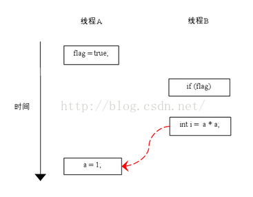
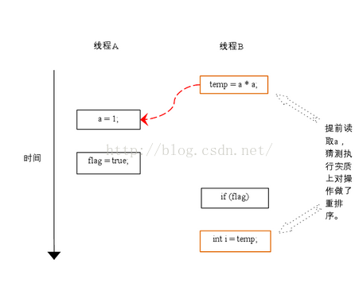

# JVM之指令重排分析

引言：在Java中看似顺序的代码在JVM中，可能会出现编译器或者CPU对这些操作指令进行了重新排序；在特定情况下，指令重排将会给我们的程序带来不确定的结果.....

## 1.什么是指令重排？

在计算机执行指令的顺序在经过程序编译器编译之后形成的指令序列，一般而言，这个指令序列是会输出确定的结果；以确保每一次的执行都有确定的结果。但是，一般情况下，CPU和编译器为了提升程序执行的效率，会按照一定的规则允许进行指令优化，在某些情况下，这种优化会带来一些执行的逻辑问题，主要的原因是代码逻辑之间是存在一定的先后顺序，在并发执行情况下，会发生二义性，即按照不同的执行逻辑，会得到不同的结果信息。

## 2.数据依赖性

主要指不同的程序指令之间的顺序是不允许进行交互的，即可称这些程序指令之间存在数据依赖性。 

主要的例子如下：

| 名称 | 代码示例 | 说明 |
| --- | --- | --- |
| 写后读 | a = 1;b = a; | 写一个变量之后，再读这个位置。 |
| 写后写 | a = 1;a = 2; | 写一个变量之后，再写这个变量。 |
| 读后写 | a = b;b = 1; | 读一个变量之后，再写这个变量。 |

进过分析，发现这里每组指令中都有写操作，这个写操作的位置是不允许变化的，否则将带来不一样的执行结果。 

编译器将不会对存在数据依赖性的程序指令进行重排，这里的依赖性仅仅指单线程情况下的数据依赖性；多线程并发情况下，此规则将失效。

## 3.as-if-serial语义

不管怎么重排序（编译器和处理器为了提高并行度），（单线程）程序的执行结果不能被改变。编译器，runtime 和处理器都必须遵守as-if-serial语义。

分析：  关键词是单线程情况下，必须遵守；其余的不遵守。

代码示例：

``` java
double pi  = 3.14;    //A
double r   = 1.0;     //B
double area = pi * r * r; //C
```

分析代码：   A->C  B->C;  A,B之间不存在依赖关系； 故在单线程情况下， A与B的指令顺序是可以重排的，C不允许重排，必须在A和B之后。

结论性的总结：

as-if-serial语义把单线程程序保护了起来，遵守as-if-serial语义的编译器，runtime 和处理器共同为编写单线程程序的程序员创建了一个幻觉：单线程程序是按程序的顺序来执行的。as-if-serial语义使单线程程序员无需担心重排序会干扰他们，也无需担心内存可见性问题。

核心点还是单线程，多线程情况下不遵守此原则。

## 4.在多线程下的指令重排

首先我们基于一段代码的示例来分析，在多线程情况下，重排是否有不同结果信息：

``` java
class ReorderExample {
    int a = 0;
    boolean flag = false;
  
    public void writer() {
        a = 1;                   //1
        flag = true;             //2
    }
  
    Public void reader() {
        if (flag) {                //3
            int i =  a * a;        //4
            ……
        }
    }
}
```

上述的代码，在单线程情况下，执行结果是确定的， flag=true将被reader的方法体中看到，并正确的设置结果。 但是在多线程情况下，是否还是只有一个确定的结果呢？

假设有A和B两个线程同时来执行这个代码片段， 两个可能的执行流程如下：

可能的流程1, 由于1和2语句之间没有数据依赖关系，故两者可以重排，在两个线程之间的可能顺序如下：


可能的流程2:， 在两个线程之间的语句执行顺序如下：


根据happens- before的程序顺序规则，上面计算圆的面积的示例代码存在三个happens- before关系：

A happens- before B；

B happens- before C；

A happens- before C；

这里的第3个happens- before关系，是根据happens- before的传递性推导出来的  

在程序中，操作3和操作4存在控制依赖关系。当代码中存在控制依赖性时，会影响指令序列执行的并行度。为此，编译器和处理器会采用猜测（Speculation）执行来克服控制相关性对并行度的影响。以处理器的猜测执行为例，执行线程B的处理器可以提前读取并计算a*a，然后把计算结果临时保存到一个名为重排序缓冲（reorder buffer ROB）的硬件缓存中。当接下来操作3的条件判断为真时，就把该计算结果写入变量i中。从图中我们可以看出，猜测执行实质上对操作3和4做了重排序。重排序在这里破坏了多线程程序的语义。

核心点是：两个线程之间在执行同一段代码之间的critical area，在不同的线程之间共享变量；由于执行顺序、CPU编译器对于程序指令的优化等造成了不确定的执行结果。

## 5.指令重排的原因分析

主要还是编译器以及CPU为了优化代码或者执行的效率而执行的优化操作；应用条件是单线程场景下，对于并发多线程场景下，指令重排会产生不确定的执行效果。

## 6.如何防止指令重排

volatile关键字可以保证变量的可见性，因为对volatile的操作都在Main Memory中，而Main Memory是被所有线程所共享的，这里的代价就是牺牲了性能，无法利用寄存器或Cache，因为它们都不是全局的，无法保证可见性，可能产生脏读。

volatile还有一个作用就是局部阻止重排序的发生，对volatile变量的操作指令都不会被重排序，因为如果重排序，又可能产生可见性问题。

在保证可见性方面，锁（包括显式锁、对象锁）以及对原子变量的读写都可以确保变量的可见性。但是实现方式略有不同，例如同步锁保证得到锁时从内存里重新读入数据刷新缓存，释放锁时将数据写回内存以保数据可见，而volatile变量干脆都是读写内存。

## 7.可见性

这里提到的可见性是指前一条程序指令的执行结果，可以被后一条指令读到或者看到，称之为可见性。反之为不可见性。这里主要描述的是在多线程环境下，指令语句之间对于结果信息的读取即时性。