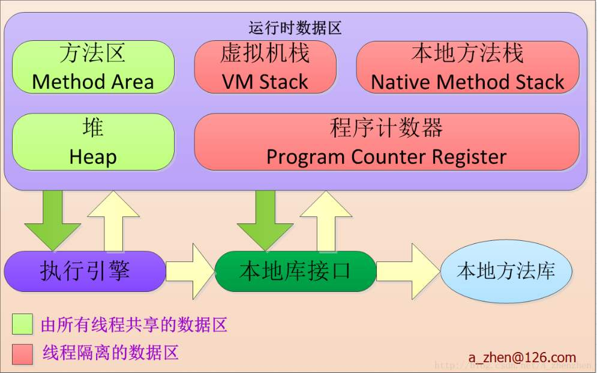

# JVM运行时数据区域

Java虚拟机在执行Java程序的过程中会把它所管理的内存划分为若干个不同的数据区域。这些区域都有各自的用途，以及创建和销毁的时间，有的区域随着虚拟机进程的启动而存在，有些区域依赖用户线程的启动和结束而建立和销毁。

## 1.程序计数器

程序计数器（Program Counter Register）是一块较小的内存空间，它可以看作是当前线程所执行的字节码的行号指示器。字节码解释器工作时通过改变这个计数器的值来选取下一个需要执行的字节码指令，分支、循环、跳转、异常处理、线程恢复等基础功能都需要依赖这个计数器来完成。

为了线程切换后能恢复到正确的执行位置，每条线程都需要有一个独立的程序计数器，各条线程之间计数器互不影响，独立存储，我们称这类内存区域为“线程私有”的内存。

如果线程正在执行的是一个Java方法，这个计数器记录的是正在执行的虚拟机字节码指令的地址；如果正在执行的Native方法，这个计数器则为空。此内存区域是唯一一个在Java虚拟机规范中没有规定任何OutOfMemoryError情况的区域。

## 2.Java虚拟机栈

与程序计数器一样，Java虚拟机栈（Java Virtual Machine Stacks）也是线程私有的，它的生命周期与线程相同。虚拟机栈描述的是Java方法执行的内存模型，每个方法在执行的同时会创建一个栈帧用于存储局部变量表、操作数栈、动态链接、方法出口等信息。每一个方法从调用直至完成的过程，就对应着一个栈帧在虚拟机栈中入栈到出栈的过程。而常说的JVM栈内存就是现在讲的虚拟机栈，或者说是虚拟机栈中局部变量表部分。

局部变量表存放了编译期可知的各种基本数据类型（boolean、byte、char、short、int、float、long、double）、对象引用（reference类型，它不属于对象本身，可能是一个指向对象起始地址的引用指针，也可能是指向一个代表对象的句柄或其它与此对象相关的位置）和returnAddress类型（指向了一条字节码指令的地址）。其中64位长度的long和double类的数据会占用2个局部变量空间（Slot），其余的数据类型只占用1个。

在Java虚拟机规范中，对这个区域规定了两种异常状况：

1. 如果线程请求的栈深度大于虚拟机所允许的深度，将抛出StackOverFlowError异常；
2. 如果虚拟机栈可以动态扩展（当前大部分的Java虚拟机都可以动态扩展，只不过Java虚拟机规范中也允许固定长度的虚拟机栈），如果扩展时无法申请到足够的内存，机会抛出OutOfMemoryError异常。

## 3.本地方法栈

本地方法栈（Native Method Stack）与虚拟机栈所发挥的作用是非常相似的，它们之间的区别不过是虚拟机栈为虚拟机执行Java方法（也就是字节码）服务，而本地方法栈则为虚拟机使用到的Native方法服务。与虚拟机栈一致，本地方法栈区域也会抛出StackOverFlowError和OutOfMemoryError异常。

## 4.Java堆

对于大多数应用来说，Java堆（Java Heap）是Java虚拟机所管理的内存中最大的一块。Java堆是被所有线程共享的一块内存区域，在虚拟机启动时创建。此内存区域的唯一目的就是存放对象实例，几乎所有的对象实例都在这里分配内存。即，所有的对象实例以及数组都要在堆上分配。

Java堆是垃圾收集器管理的主要区域，因此很多时候也被称作为“GC堆”（Garbage Collected Heap）。从内存回收的角度来看，由于现在的收集器基本都采用分代收集算法，所以Java堆中还可以细分为：新生代和老年代；再做细致一点儿的有Eden空间、From Survivor空间、To Survivor空间等。从内容分配的角度来看，线程共享的Java堆中可能划分出多个线程私有的分配缓冲区。

Java堆中可以处于物理上不连续的内存空间中，只要逻辑上是连续的即可。既可以实现成固定大小，也可以是可扩展的。如果在堆中没有内存完成实例分配，并且也无法再扩展（通过-Xmx和-Xms来控制），将会抛出OutOfMemoryError异常。

## 5.方法区

方法区（Method Area）与Java堆一样，是各个线程共享的内存区域，它用于存储已被虚拟机加载的类信息、常量、静态变量、即时编译器编译后得代码等数据。虽然Java虚拟机规范把方法区描述为堆的一个逻辑部分，但是它却有一个别名叫做Non-Heap（非堆），目的应该是与Java堆区分开来。

对于习惯在HotSpot虚拟机上开发、部署程序的开发者来说，很多人都更愿意把方法区称为“永久代”，本质上两者并不等价，仅仅是因为HotSpot虚拟机的设计团队选择把GC分代收集扩展至方法区，或者说使用永久代来实现方法区而已，这样HotSpot的垃圾收集器可以向管理Java堆一样管理这部分内存，能够省下专门为方法区编写内存管理代码的工作。

Java虚拟机规范对方法区的限制非常宽松，除了和Java对一样不需要连续的内存和可以选择固定大小或者可扩展（通过-XX来控制）外，还可以选择不实现垃圾收集。这块区域的内存回收目标主要是针对常量池的回收和对类型的卸载。当方法区无法满足内存分配需求时，将抛出OutOfMemoryError异常。

## 6.运行时常量池

运行时常量池（Runtime Constant Pool）是方法区的一部分。Class文件中除了有类的版本、字段、方法、接口等描述信息外，还有一项信息是常量池，用于存放编译期生成的各种字面量和符号引用，这部分内容将在类加载后进入方法区的运行时常量池中存放。

运行时常量池相对于Class文件常量池的另外一个重要的特征是具备动态性，Java语言并不要求常量一定只有编译期才能产生，也就是并非预置入Class文件中常量池的内容才能进入方法区的运行时常量池，运行期间也可能将新的常量放入池中。当常量池无法再申请到内存时会抛出OutOfMemoryError异常。

## 7.直接内存

直接内存（Direct Memory）并不是虚拟机运行时数据区的一部分，也不是Java虚拟机规范中定义的内存区域。但是这部分内存也被频繁地使用，而且也可能导致OutOfMemoryError异常。