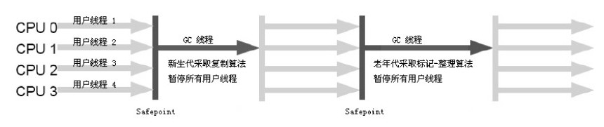
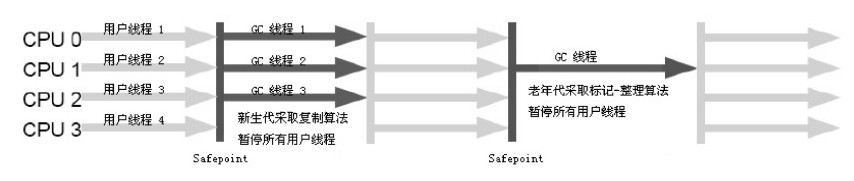
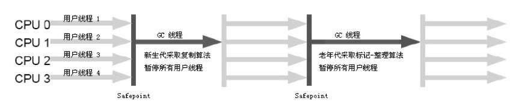

# Java垃圾收集器

## 简介

如果说收集算法是内存回收的方法论，那么垃圾收集器就是内存回收的具体实现。这里讨论的收集器基于JDK 1.7 Update 14之后的 HotSpot 虚拟机，这个虚拟机包含的所有收集器如下图所示：

上图展示了7种作用于不同分代的收集器，如果两个收集器之间存在连线，就说明它们可以搭配使用。虚拟机所处的区域，则表示它是属于新生代收集器还是老年代收集器。接下来将逐一介绍这些收集器的特性、基本原理和使用场景，并重点分析CMS和G1这两款相对复杂的收集器，了解它们的部分运作细节。

## 1.Serial收集器

Serial收集器是最基本、发展历史最悠久的收集器，曾经是虚拟机新生代收集的唯一选择。这是一个单线程的收集器，但它的“单线程”的意义并不仅仅说明它只会使用一个CPU或一条收集线程去完成垃圾收集工作，更重要的是在它进行垃圾收集时，必须暂停其他所有的工作线程，直到它收集结束。"Stop The World"这个名字也许听起来很酷，但这项工作实际上是由虚拟机在后台自动发起和自动完成的，在用户不可见的情况下把用户正常工作的线程全部停掉，这对很多应用来说都是难以接受的。下图示意了Serial/Serial Old收集器的运行过程：

实际上到现在为止，它依然是虚拟机运行在Client模式下的默认新生代收集器。它也有着优于其他收集器的地方：简单而高效（与其他收集器的单线程比），对于限定单个CPU的环境来说，Serial收集器由于没有线程交互的开销，专心做垃圾收集自然可以获得最高的单线程收集效率。

在用户的桌面应用场景中，分配给虚拟机管理的内存一般来说不会很大，收集几十兆甚至一两百兆的新生代（仅仅是新生代使用的内存，桌面应用基本上不会再大了），停顿时间完全可以控制在几十毫秒最多一百多毫秒以内，只要不是频繁发生，这点停顿是可以接受的。所以，Serial收集器对于运行在Client模式下的虚拟机来说是一个很好的选择。

## 2.ParNew收集器

ParNew收集器其实就是Serial收集器的多线程版本，除了使用多条线程进行垃圾收集之外，其余行为包括Serial收集器可用的所有控制参数（例如：-XX:SurvivorRatio、-XX:PretenureSizeThreshold、-XX:HandlePromotionFailure等）、收集算法、Stop The World、对象分配规则、回收策略等都与Serial收集器完全一样，在实现上，这两种收集器也共用了相当多的代码。ParNew收集器的工作过程如下图所示:

ParNew收集器除了多线程收集之外，其他与Serial收集器相比并没有太多创新之处，但它却是许多运行在Server模式下的虚拟机中首选的新生代收集器，其中有一个与性能无关但很重要的原因是，除了Serial收集器外，目前只有它能与CMS收集器（并发收集器，后面有介绍）配合工作。

ParNew收集器在单CPU的环境中不会有比Serial收集器更好的效果，甚至由于存在线程交互的开销，该收集器在通过超线程技术实现的两个CPU的环境中都不能百分之百地保证可以超越Serial收集器。当然，随着可以使用的CPU的数量的增加，它对于GC时系统资源的有效利用还是很有好处的。它默认开启的收集线程数与CPU的数量相同，在CPU非常多（如32个)的环境下，可以使用-XX:ParallelGCThreads参数来限制垃圾收集的线程数。

注意，从ParNew收集器开始，后面还会接触到几款并发和并行的收集器。这里有必要先解释两个名词：并发和并行。这两个名词都是并发编程中的概念，在谈论垃圾收集器的上下文语境中，它们可以解释如下：

1. 并行（Parallel）：指多条垃圾收集线程并行工作，但此时用户线程仍然处于等待状态。

2. 并发（Concurrent）：指用户线程与垃圾收集线程同时执行（但不一定是并行的，可能会交替执行），用户程序在继续运行，而垃圾收集程序运行于另一个CPU上。

## 3.Parallel Scavenge收集器

Parallel Scavenge收集器是一个新生代收集器，它也是使用复制算法的收集器，又是并行的多线程收集器……看上去和ParNew都一样，那它有什么特别之处呢？

Parallel Scavenge收集器的特点是它的关注点与其他收集器不同，CMS等收集器的关注点是尽可能地缩短垃圾收集时用户线程的停顿时间，而 Parallel Scavenge收集器的目标则是达到一个可控制的吞吐量（Throughput）。

所谓吞吐量就是CPU用于运行用户代码的时间与CPU总消耗时间的比值，即吞吐量=运行用户代码时间/（运行用户代码时间+垃圾收集时间），虚拟机总共运行了100分钟，其中垃圾收集花掉1分钟，那吞吐量就是99%。

停顿时间越短就越适合需要与用户交互的程序，良好的响应速度能提升用户体验，而高吞吐量则可以高效率地利用CPU时间，尽快完成程序的运算任务，主要适合在后台运算而不需要太多交互的任务。

Parallel Scavenge收集器提供了两个参数用于精确控制吞吐量，分别是控制最大垃圾收集停顿时间的-XX:MaxGCPauseMillis参数以及直接设置吞吐量大小的-XX:GCTimeRatio参数。

MaxGCPauseMillis参数允许的值是一个大于0的毫秒数，收集器将尽可能地保证内存回收花费的时间不超过设定值。不过大家不要认为如果把这个参数的值设置得稍小一点就能使得系统的垃圾收集速度变得更快，GC停顿时间缩短是以牺牲吞吐量和新生代空间来换取的：系统把新生代调小一些，收集300MB新生代肯定比收集500MB快吧，这也直接导致垃圾收集发生得更频繁一些，原来10秒收集一次、每次停顿100毫秒，现在变成5秒收集一次、每次停顿70毫秒。停顿时间的确在下降，但吞吐量也降下来了。

GCTimeRatio参数的值应当是一个0到100的整数，也就是垃圾收集时间占总时间的比率，相当于是吞吐量的倒数。如果把此参数设置为19，那允许的最大GC时间就占总时间的5%（即 1/（1+19）），默认值为99，就是允许最大1%（即 1/（1+99））的垃圾收集时间。

由于与吞吐量关系密切，Parallel Scavenge收集器也经常称为“吞吐量优先”收集器。除上述两个参数之外，Parallel Scavenge收集器还有一个参数-XX:+UseAdaptiveSizePolicy值得关注。这是一个开关参数，当这个参数打开之后，就不需要手工指定新生代的大小（-Xmn）、Eden 与 Survivor 区的比例（-XX:SurvivorRatio）、晋升老年代对象年龄（-XX:PretenureSizeThreshold）等细节参数了，虚拟机会根据当前系统的运行情况收集性能监控信息，动态调整这些参数以提供最合适的停顿时间或者最大的吞吐量，这种调节方式称为GC自适应的调节策略（GC Ergonomics）。

## 4.Serial Old收集器

Serial Old是Serial收集器的老年代版本，它同样是一个单线程收集器，使用“标记-整理”算法。这个收集器的主要意义也是在于给Client模式下的虚拟机使用。如果在Server模式下，那么它主要还有两大用途：一种用途是在JDK 1.5以及之前的版本中与Parallel Scavenge收集器搭配使用，另一种用途就是作为CMS收集器的后备预案，在并发收集发生Concurrent Mode Failure 时使用。这两点都将在后面的内容中详细讲解。Serial Old收集器的工作过程如下图所示：

## 5.Parallel Old收集器
Parallel Old是Parallel Scavenge收集器的老年代版本，使用多线程和“标记-整理”算法。这个收集器是在JDK 1.6中才开始提供的，在此之前，新生代的Parallel Scavenge收集器一直处于比较尴尬的状态。

原因是，如果新生代选择了Parallel Scavenge收集器，老年代除了Serial Old（PS MarkSweep）收集器外别无选择（Parallel Scavenge收集器无法与CMS收集器配合工作）。

由于老年代Serial Old收集器在服务端应用性能上的“拖累”，使用了Parallel Scavenge收集器也未必能在整体应用上获得吞吐量最大化的效果，由于单线程的老年代收集中无法充分利用服务器多CPU的处理能力，在老年代很大而且硬件比较高级的环境中，这种组合的吞吐量甚至还不一定有 ParNew加CMS的组合“给力”。

直到Parallel Old收集器出现后，“吞吐量优先”收集器终于有了比较名副其实的应用组合，在注重吞吐量以及CPU资源敏感的场合，都可以优先考虑Parallel Scavenge加Parallel Old收集器。Parallel Old收集器的工作过程如下图所示：

## 6.CMS收集器

CMS（Concurrent Mark Sweep）收集器是一种以获取最短回收停顿时间为目标的收集器。

目前很大一部分的Java应用集中在互联网站或者B/S系统的服务端上，这类应用尤其重视服务的响应速度，希望系统停顿时间最短，以给用户带来较好的体验。CMS 收集器就非常符合这类应用的需求。

从名字（包含"Mark Sweep"）上就可以看出，CMS收集器是基于“标记—清除”算法实现的，它的运作过程相对于前面几种收集器来说更复杂一些，整个过程分为4个步骤，包括：

1. 初始标记（CMS initial mark）

2. 并发标记（CMS concurrent mark）

3. 重新标记（CMS remark）

4. 并发清除（CMS concurrent sweep）

其中，初始标记、重新标记这两个步骤仍然需要"Stop The World"。初始标记仅仅只是标记一下GC Roots能直接关联到的对象，速度很快，并发标记阶段就是进行GC RootsTracing的过程，而重新标记阶段则是为了修正并发标记期间因用户程序继续运作而导致标记产生变动的那一部分对象的标记记录，这个阶段的停顿时间一般会比初始标记阶段稍长一些，但远比并发标记的时间短。

由于整个过程中耗时最长的并发标记和并发清除过程收集器线程都可以与用户线程一起工作，所以，从总体上来说，CMS收集器的内存回收过程是与用户线程一起并发执行的。CMS收集器的工作过程如下图所示：

CMS是一款优秀的收集器，它的主要优点在名字上已经体现出来了：并发收集、低停顿，但是CMS还远达不到完美的程度，它有以下3个明显的缺点：

1. 导致吞吐量降低。CMS收集器对CPU资源非常敏感。其实，面向并发设计的程序都对CPU资源比较敏感。在并发阶段，它虽然不会导致用户线程停顿，但是会因为占用了一部分线程（或者说CPU资源）而导致应用程序变慢，总吞吐量会降低。CMS默认启动的回收线程数是（CPU数量+3）/4，也就是当CPU在4个以上时，并发回收时垃圾收集线程不少于25%的CPU资源，并且随着CPU数量的增加而下降。但是当CPU不足4个（譬如2个）时，CMS对用户程序的影响就可能变得很大，如果本来CPU负载就比较大，还分出一半的运算能力去执行收集器线程，就可能导致用户程序的执行速度忽然降低了50%，其实也让人无法接受。

2. CMS收集器无法处理浮动垃圾（Floating Garbage），可能出现"Concurrent Mode Failure"失败而导致另一次Full GC（新生代和老年代同时回收）的产生。由于CMS并发清理阶段用户线程还在运行着，伴随程序运行自然就还会有新的垃圾不断产生，这一部分垃圾出现在标记过程之后，CMS无法在当次收集中处理掉它们，只好留待下一次GC时再清理掉。这一部分垃圾就称为“浮动垃圾”。也是由于在垃圾收集阶段用户线程还需要运行，那也就还需要预留有足够的内存空间给用户线程使用，因此CMS收集器不能像其他收集器那样等到老年代几乎完全被填满了再进行收集，需要预留一部分空间提供并发收集时的程序运作使用。在JDK 1.5的默认设置下，CMS收集器当老年代使用了68%的空间后就会被激活，这是一个偏保守的设置，如果在应用中老年代增长不是太快，可以适当调高参数-XX:CMSInitiatingOccupancyFraction的值来提高触发百分比，以便降低内存回收次数从而获取更好的性能，在JDK 1.6中，CMS收集器的启动阈值已经提升至92% 。要是CMS运行期间预留的内存无法满足程序需要，就会出现一次"Concurrent Mode Failure"失败，这时虚拟机将启动后备预案：临时启用 Serial Old收集器来重新进行老年代的垃圾收集，这样停顿时间就很长了。所以说参数-XX:CMSInitiatingOccupancyFraction设置得太高很容易导致大量"Concurrent Mode Failure"失败，性能反而降低。

3. 产生空间碎片。 CMS是一款基于“标记—清除”算法实现的收集器，这意味着收集结束时会有大量空间碎片产生。空间碎片过多时，将会给大对象分配带来很大麻烦，往往会出现老年代还有很大空间剩余，但是无法找到足够大的连续空间来分配当前对象，不得不提前触发一次Full GC 。为了解决这个问题，CMS收集器提供了一个-XX:+UseCMSCompactAtFullCollection开关参数（默认就是开启的），用于在CMS收集器顶不住要进行Full GC时开启内存碎片的合并整理过程，内存整理的过程是无法并发的，空间碎片问题没有了，但停顿时间不得不变长。虚拟机设计者还提供了另外一个参数-XX:CMSFullGCsBeforeCompaction，这个参数是用于设置执行多少次不压缩的Full GC 后，跟着来一次带压缩的（默认值为0，表示每次进入Full GC时都进行碎片整理）。

## 7.G1收集器

G1（Garbage-First）收集器是当今收集器技术发展的最前沿成果之一，G1是一款面向服务端应用的垃圾收集器。HotSpot开发团队赋予它的使命是（在比较长期的）未来可以替换掉JDK 1.5中发布的CMS收集器。

### 7.1 G1收集器的特点
与其他GC收集器相比，G1具备如下特点：

1. 并行与并发：G1能充分利用多CPU、多核环境下的硬件优势，使用多个CPU（CPU或者CPU核心）来缩短Stop-The-World停顿的时间，部分其他收集器原本需要停顿Java线程执行的GC动作，G1收集器仍然可以通过并发的方式让Java程序继续执行。

2. 分代收集：与其他收集器一样，分代概念在G1中依然得以保留。虽然G1可以不需要其他收集器配合就能独立管理整个GC堆，但它能够采用不同的方式去处理新创建的对象和已经存活了一段时间、熬过多次GC的旧对象以获取更好的收集效果。

3. 空间整合：与CMS的“标记—清理”算法不同，G1从整体来看是基于“标记—整理”算法实现的收集器，从局部（两个 Region 之间）上来看是基于“复制”算法实现的，但无论如何，这两种算法都意味着G1运作期间不会产生内存空间碎片，收集后能提供规整的可用内存。这种特性有利于程序长时间运行，分配大对象时不会因为无法找到连续内存空间而提前触发下一次GC 。

4. 可预测的停顿：这是G1相对于CMS的另一大优势，降低停顿时间是G1和CMS共同的关注点，但G1除了追求低停顿外，还能建立可预测的停顿时间模型，能让使用者明确指定在一个长度为M毫秒的时间片段内，消耗在垃圾收集上的时间不得超过N毫秒，这几乎已经是实时Java（RTSJ）的垃圾收集器的特征了。

### 7.2 G1的内存结构 

理解垃圾回收机制，必须先了解G1的内存结构，在G1之前的其他收集器进行收集的范围都是整个新生代或者老年代，而G1不再是这样。使用G1收集器时，Java堆的内存布局就与其他收集器有很大差别，它将整个Java堆划分为多个大小相等的独立区域（Region），虽然还保留有新生代和老年代的概念，但新生代和老年代不再是物理隔离的了，它们都是一部分Region（不需要连续）的集合。内存结构如下图：

这里有三个关于内存的概念：代，区和内存分段。

G1把堆内存分为年轻代和老年代。年轻代分为Eden和Survivor两个区，老年代分为Old和Humongous两个区。代和区都是逻辑概念。G1把堆内存分为大小相等的内存分段，默认情况下会把内存分为2048个内存分段，可以用-XX:G1HeapRegionSize调整内存分段的个数。比如32G堆内存，2048个内存分段每段的大小为16M。这相当于把内存化整为零。内存分段是物理概念，代表实际的物理内存空间。每个内存分段都可以被标记为Eden区，Survivor区，Old区，或者Humongous区。这样属于不同代，不同区的内存分段就可以不必是连续内存空间了。

新分配的对象会被分配到Eden区的内存分段上，每一次年轻代的回收过程都会把Eden区存活的对象复制到Survivor区的内存分段上，把Survivor区继续存活的对象年龄加1，如果Survivor区的存活对象年龄达到某个阈值（比如15，可以设置），Survivor区的对象会被复制到Old区。复制过程是把源内存分段中所有存活的对象复制到空的目标内存分段上，复制完成后，源内存分段没有了存活对象，变成了可以使用的空的Eden内存分段了；而目标内存分段的对象都是连续存储的，没有碎片，所以复制过程可以达到内存整理的效果，减少碎片。Humongous区用于保存大对象，如果一个对象占用的空间超过内存分段的一半（比如上面的8M），则此对象将会被分配在Humongous区。如果对象的大小超过一个甚至几个分段的大小，则对象会分配在物理连续的多个Humongous分段上。Humongous对象因为占用内存较大并且连续会被优先回收。

G1收集器之所以能建立可预测的停顿时间模型，是因为它可以有计划地避免在整个Java堆中进行全区域的垃圾收集。G1在后台维护一个优先列表，每次根据允许的收集时间，优先回收价值最大的Region（这也就是Garbage-First名称的来由），保证了G1收集器在有限的时间内可以获取尽可能高的收集效率。

### 7.3 Remembered Set

理解回收过程，需要先了解记忆集合（Remembered Set），以下简称RS。为了在回收单个内存分段的时候不必对整个堆内存的对象进行扫描（单个内存分段中的对象可能被其他内存分段中的对象引用）引入了RS数据结构。RS使得G1可以在年轻代回收的时候不必去扫描老年代的对象，从而提高了性能。每一个内存分段都对应一个RS，RS保存了来自其他分段内的对象对于此分段的引用。对于属于年轻代的内存分段（Eden和Survivor区的内存分段）来说，RS只保存来自老年代的对象的引用。这是因为年轻代回收是针对全部年轻代的对象的，反正所有年轻代内部的对象引用关系都会被扫描，所以RS不需要保存来自年轻代内部的引用。对于属于老年代分段的RS来说，也只会保存来自老年代的引用，这是因为老年代的回收之前会先进行年轻代的回收，年轻代回收后Eden区变空了，G1会在老年代回收过程中扫描Survivor区到老年代的引用。

RS里的引用信息是怎么样填充和维护的呢？简而言之就是JVM会对应用程序的每一个引用赋值语句object.field=object进行记录和处理，把引用关系更新到RS中。但是这个RS的更新并不是实时的。G1维护了一个Dirty Card Queue。对于应用程序的引用赋值语句object.field=object，JVM会在之前和之后执行特殊的操作以在dirty card queue中入队一个保存了对象引用信息的card。在年轻代回收的时候，G1会对Dirty Card Queue中所有的card进行处理，以更新RS，保证RS实时准确的反映引用关系。那为什么不在引用赋值语句处直接更新RS呢？这是为了性能的需要，RS的处理需要线程同步，开销会很大，使用队列性能会好很多。

在G1收集器中，Region之间的对象引用以及其他收集器中的新生代与老年代之间的对象引用，虚拟机都是使用Remembered Set来避免全堆扫描的。G1中每个Region都有一个与之对应的Remembered Set，虚拟机发现程序在对Reference类型的数据进行写操作时，会产生一个Write Barrier暂时中断写操作，检查Reference引用的对象是否处于不同的Region之中（在分代的例子中就是检查是否老年代中的对象引用了新生代中的对象），如果是，便通过CardTable把相关引用信息记录到被引用对象所属的Region的Remembered Set之中。当进行内存回收时，在GC根节点的枚举范围中加入Remembered Set即可保证不对全堆扫描也不会有遗漏。

### 7.4 G1收集器的工作过程

如果不计算维护Remembered Set的操作，G1收集器的运作大致可划分为以下几个步骤：

1. 初始标记（Initial Marking）

2. 并发标记（Concurrent Marking）

3. 最终标记（Final Marking）

4. 筛选回收（Live Data Counting and Evacuation）

G1 的前几个步骤的运作过程和 CMS 有很多相似之处。

初始标记阶段仅仅只是标记一下GC Roots能直接关联到的对象，并且修改TAMS（Next Top at Mark Start）的值，让下一阶段用户程序并发运行时，能在正确可用的 Region 中创建新对象，这阶段需要停顿线程，但耗时很短。

并发标记阶段是从GC Root开始对堆中对象进行可达性分析，找出存活的对象，这阶段耗时较长，但可与用户程序并发执行。

而最终标记阶段则是为了修正在并发标记期间因用户程序继续运作而导致标记产生变动的那一部分标记记录，虚拟机将这段时间对象变化记录在线程Remembered Set Logs里面，最终标记阶段需要把Remembered Set Logs的数据合并到Remembered Set中，这阶段需要停顿线程，但是可并行执行。

最后在筛选回收阶段首先对各个Region的回收价值和成本进行排序，根据用户所期望的GC停顿时间来制定回收计划，从Sun公司透露出来的信息来看，这个阶段其实也可以做到与用户程序一起并发执行，但是因为只回收一部分 Region，时间是用户可控制的，而且停顿用户线程将大幅提高收集效率。通过下图可以比较清楚地看到G1收集器的运作步骤中并发和需要停顿的阶段：

### 7.5 G1年轻代回收过程（Young GC）

JVM启动时，G1先准备好Eden区，程序在运行过程中不断创建对象到Eden区，当所有的Eden区都满了，G1会启动一次年轻代垃圾回收过程。年轻代只会回收Eden区和Survivor区。首先G1停止应用程序的执行（Stop-The-World），G1创建回收集（Collection Set），回收集是指需要被回收的内存分段的集合，年轻代回收过程的回收集包含年轻代Eden区和Survivor区所有的内存分段。然后开始如下回收过程：

第一阶段，扫描根。

根是指static变量指向的对象，正在执行的方法调用链条上的局部变量等。根引用连同RS记录的外部引用作为扫描存活对象的入口。

第二阶段，更新RS。

处理dirty card queue中的card，更新RS。此阶段完成后，RS可以准确的反映老年代对所在的内存分段中对象的引用。

第三阶段，处理RS。

识别被老年代对象指向的Eden中的对象，这些被指向的Eden中的对象被认为是存活的对象。

第四阶段，复制对象。

此阶段，对象树被遍历，Eden区内存段中存活的对象会被复制到Survivor区中空的内存分段，Survivor区内存段中存活的对象如果年龄未达阈值，年龄会加1，达到阀值会被会被复制到Old区中空的内存分段。

第五阶段，处理引用。

处理Soft，Weak，Phantom，Final，JNI Weak 等引用。

### 7.6 G1老年代并发标记过程（Concurrent Marking）

当整个堆内存（包括老年代和新生代）被占满一定大小的时候（默认是45%，可以通过-XX:InitiatingHeapOccupancyPercent进行设置），老年代回收过程会被启动。具体检测堆内存使用情况的时机是年轻代回收之后或者houmongous对象分配之后。老年代回收包含标记老年代内的对象是否存活的过程，标记过程是和应用程序并发运行的（不需要Stop-The-World）。

应用程序会改变指针的指向，并发执行的标记过程怎么能保证标记过程没有问题呢？并发标记过程有一种情形会对存活的对象标记不到。假设有对象A，B和C，一开始的时候B.c=C，A.c=null。当A的对象树先被扫描标记，接下来开始扫描B对象树，此时标记线程被应用程序线程抢占后停下来，应用程序把A.c=C，B.c=null。当标记线程恢复执行的时候C对象已经标记不到了，这时候C对象实际是存活的，这种情形被称作对象丢失。G1解决的方法是在对象引用被设置为空的语句（比如B.c=null)时，把原先指向的对象（C对象）保存到一个队列，代表它可能是存活的。然后会有一个重新标记（Remark）过程处理这些对象，重新标记过程是Stop-The-World的，所以可以保证标记的正确性。上述这种标记方法被称为开始时快照技术（SATB，Snapshot At The Begging）。这种方式会造成某些是垃圾的对象也被当做是存活的，所以G1会使得占用的内存被实际需要的内存大。

具体标记过程如下：

1. 先进行一次年轻代回收过程，这个过程是Stop-The-World的。老年代的回收基于年轻代的回收（比如需要年轻代回收过程对于根对象的收集，初始的存活对象的标记）。

2. 恢复应用程序线程的执行。

3. 开始老年代对象的标记过程。此过程是与应用程序线程并发执行的。标记过程会记录弱引用情况，还会计算出每个分段的对象存活数据（比如分段内存活对象所占的百分比）。

4. Stop-The-World。

5. 重新标记（Remark）。此阶段重新标记前面提到的STAB队列中的对象（例子中的C对象），还会处理弱引用。

6. 回收百分之百为垃圾的内存分段。注意：不是百分之百为垃圾的内存分段并不会被处理，这些内存分段中的垃圾是在混合回收过程（Mixed GC）中被回收的。由于Humongous对象会独占整个内存分段，如果Humongous对象变为垃圾，则内存分段百分百为垃圾，所以会在第一时间被回收掉。

7. 恢复应用程序线程的执行。

### 7.7 混合回收过程（Mixed GC）

并发标记过程结束以后，紧跟着就会开始混合回收过程。混合回收的意思是年轻代和老年代会同时被回收。并发标记结束以后，老年代中百分百为垃圾的内存分段被回收了，部分为垃圾的内存分段被计算了出来。默认情况下，这些老年代的内存分段会分8次（可以通过-XX:G1MixedGCCountTarget设置）被回收。混合回收的回收集（Collection Set）包括八分之一的老年代内存分段，Eden区内存分段，Survivor区内存分段。混合回收的算法和年轻代回收的算法完全一样，只是回收集多了老年代的内存分段。具体过程请参考上面的年轻代回收过程。

由于老年代中的内存分段默认分8次回收，G1会优先回收垃圾多的内存分段。垃圾占内存分段比例越高的，越会被先回收。并且有一个阈值会决定内存分段是否被回收，-XX:G1MixedGCLiveThresholdPercent，默认为65%，意思是垃圾占内存分段比例要达到65%才会被回收。如果垃圾占比太低，意味着存活的对象占比高，在复制的时候会花费更多的时间。

混合回收并不一定要进行8次。有一个阈值-XX:G1HeapWastePercent，默认值为10%，意思是允许整个堆内存中有10%的空间被浪费，意味着如果发现可以回收的垃圾占堆内存的比例低于10%，则不再进行混合回收。因为GC会花费很多的时间但是回收到的内存却很少。

### 7.8 Full GC

Full GC是指上述方式不能正常工作，G1会停止应用程序的执行（Stop-The-World），使用单线程的内存回收算法进行垃圾回收，性能会非常差，应用程序停顿时间会很长。要避免Full GC的发生，一旦发生需要进行调整。什么时候回发生Full GC呢？比如堆内存太小，当G1在复制存活对象的时候没有空的内存分段可用，则会回退到full gc，这种情况可以通过增大内存解决。

 

### 7.9 其他概念 

1.线程本地分配缓冲区（TLAB: Thread Local Allocation Buffer）

由于堆内存是应用程序共享的，应用程序的多个线程在分配内存的时候需要加锁以进行同步。为了避免加锁，提高性能每一个应用程序的线程会被分配一个TLAB。TLAB中的内存来自于G1年轻代中的内存分段。当对象不是Humongous对象，TLAB也能装的下的时候，对象会被优先分配于创建此对象的线程的TLAB中。这样分配会很快，因为TLAB隶属于线程，所以不需要加锁。

2.GC“提升”线程本地分配缓冲区（PLAB: Promotion Thread Local Allocation Buffer）

前面提到过，G1会在年轻代回收过程中把Eden区中的对象复制（“提升”）到Survivor区中，Survivor区中的对象复制到Old区中。G1的回收过程是多线程执行的，为了避免多个线程往同一个内存分段进行复制，那么复制的过程也需要加锁。为了避免加锁，G1的每个线程都关联了一个PLAB，这样就不需要进行加锁了。

3.Remembered Set粒度

其实RS的存储分三种粒度，前面提到的Card是最小的一种粒度。粒度的存在是因为某些内存分段中的对象可能很热门，被来自非常多的区的对象所引用，为了避免保存太多的数据，会以更大的粒度来保存这些引用，比如最大的粒度是用一个bitmap来保存其他内存分段对RS所对应的内存分段的引用。每一个内存分段对应一个bit，如果bit为0表示该bit对应的内存分段中没有引用，为1表示有引用。这种方式会减少RS的数据，但是会增加扫描和标记时的开销，因为需要扫描所有bit为1的内存分段中的对象以确定具体是来自哪个对象的引用。 

> 本文摘自《深入理解Java虚拟机》