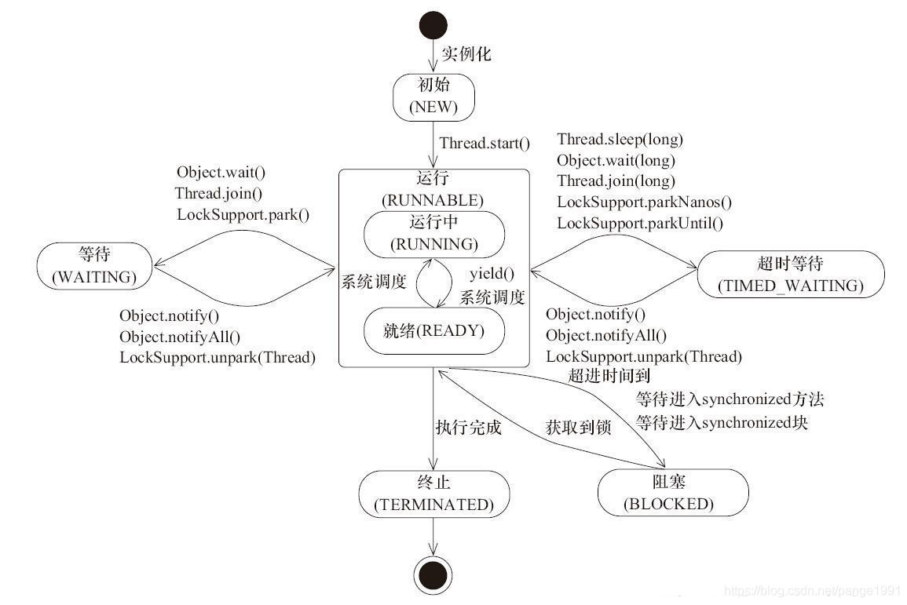

# Java多线程基础

## 1.基本特性

### 1.1 特性

1. 原子性：原子性是指一个操作是不可中断的；
2. 可见性：可见性是指当一个线程修改了某一个共享变量的值，其他线程是否能够立即知道这个修改；
3. 有序性：即程序执行的顺序按照代码的先后顺序执行。

### 1.2 指令重排

计算机执行指令的顺序在经过程序编译器编译之后形成的指令序列中，一般而言，这些指令序列是会输出确定的结果，以确保每一次的执行都有确定的结果。但是，一般情况下，CPU 和编译器为了提升程序执行的效率，会按照一定的规则允许进行指令优化，在某些情况下，这种优化会带来一些执行的逻辑问题，主要的原因是代码逻辑之间是存在一定的先后顺序，在并发执行情况下，会发生二义性，即按照不同的执行逻辑，会得到不同的结果信息。

指令重排是有原则的，并非所有的指令都可以随便改变执行的顺序，以下是 happens-before 原则：

1. 程序顺序原则：一个线程内保证语义的串行性；
2. `volatile` 规则：`volatile` 变量的写，先发生于读，这保证了 `volatile` 变量的可见性；
3. 锁规则：解锁（`unlock`）必然发生在加锁（`lock`）前；
4. 传递性：A 先于 B，B 先于 C，那么 A 必然先于 C；
5. 线程的 `start()` 方法先于它的每一个动作；
6. 线程的所有操作先于线程的终结（`Thread.join()`）；
7. 线程的中断（`interrupt()`）先于被中断线程的代码；
8. 对象的构造函数执行、结束先于 `finalize()` 方法。

## 2.线程基础

### 2.1 线程与进程

进程（Process）是计算机中的程序关于某数据集合上的一次运行活动，是系统进行资源分配和调度的基本单位，是操作系统结构的基础。进程是线程的容器。线程就是轻量级进程，是程序执行的最小单位。使用多线程而不使用多进程进行并发程序的设计，是因为线程间的切换和调度的成本远远小于进程。

### 2.2 线程的状态

1. 初始（`NEW`）：新创建了一个线程对象，但还没有调用 `start()` 方法；
2. 运行（`RUNNABLE`）：Java 线程中将就绪（`READY`）和运行中（`RUNNING`）两种状态笼统的称为”运行”。
线程对象创建后，其他线程（比如有 `main` 方法的线程）调用了该线程对象的 `start()` 方法。该状态的线程位于可运行线程池中，等待被线程调度选中，获取 CPU 的使用权，此时处于就绪状态（`READY`）。就绪状态的线程在获得 CPU 时间片后变为运行中状态（`RUNNING`）；
3. 阻塞（`BLOCKED`）：表示线程阻塞于锁；
4. 等待（`WAITING`）：进入该状态的线程需要等待其他线程做出一些特定动作（通知或中断）；
5. 超时等待（`TIMED_WAITING`）：该状态不同于 `WAITING`，它可以在指定的时间后自行返回；
6. 终止（`TERMINATED`）：表示该线程已经执行完毕。

需要注意的是：从 `NEW` 状态出发后，线程不能再回到 `NEW` 状态，同理，处于 `TERMINATED` 的线程也不能再回到 `RUNNABLE` 状态。

**状态详细说明**

1. 初始状态（`NEW`）

   实现 `Runnable` 接口和继承 `Thread` 可以得到一个线程类，new 一个实例出来，线程就进入了初始状态。

2. 运行状态（`RUNNABLE`）
   - `READY`：就绪状态只是说线程有资格运行，调度程序没有挑选到这个线程，那一直都是就绪状态。以下场景，当前线程都会进入就绪状态：
       - 调用当前线程的 `start()` 方法；
       - 当前线程 `sleep()` 方法结束；
       - 当前线程等待在其它线程的 `join()` 方法中，其它线程 `join()`  结束；
       - 当前线程等待用户输入完毕；
       - 当前线程拿到对象锁；
       - 当前线程时间片用完了；
       - 当前线程正在运行中，调用了当前线程的 `yield()` 方法。
   
   - `RUNNING`：线程调度程序从可运行池中选择一个线程作为当前线程时线程所处的状态。这也是线程进入运行状态的唯一的一种方式。
   
3. 阻塞状态（`BLOCKED`）

   阻塞状态是线程阻塞在进入 `synchronized` 关键字修饰的方法或代码块（获取锁）时的状态。

4. 等待（`WAITING`）

   处于这种状态的线程不会被分配 CPU 执行时间，它们要等待被显式地唤醒，否则会处于无限期等待的状态。

5. 超时等待（`TIMED_WAITING`）

   处于这种状态的线程不会被分配 CPU 执行时间，不过无须无限期等待被其他线程显示地唤醒，在达到一定时间后它们会自动唤醒。

6. 终止状态（`TERMINATED`）

当线程的 `run()` 方法完成时，或者主线程的 `main()` 方法完成时，我们就认为它终止了。这个线程对象也许是活的，但是它已经不是一个单独执行的线程。线程一旦终止了，就不能复生。在一个终止的线程上调用 `start()` 方法，会抛出 `IllegalThreadStateException` 异常。

## 3.线程的基本操作

### 3.1 新建线程

Java 使用 `Thread` 类代表线程，所有的线程对象都必须是 `Thread` 类或其子类的实例。Java 可以用三种方式来创建线程，如下所示：

1. 继承 `Thread` 类创建线程；
2. 实现 `Runnable` 接口创建线程；
3. 使用 `Callable` 和 `Future` 创建线程。

当创建了一个 `Thread` 对象之后，可以调用 `start()` 方法，接着 `start()` 方法就会新建一个线程并让这个线程执行 `run()` 方法。需要注意的是：不要用 `run()` 开启新线程，它只会在当前线程中，串行执行 `run()` 方法中的代码。

### 3.2 终止线程

如果需要终止线程，可以调用 `stop()` 方法，但这是一个已经被 JDK 废弃的方法。为什么这个方法被废弃呢，`Thread.stop()` 方法在结束线程时，会直接终止线程，并且会立即释放这个线程所持有的锁。而这些锁恰恰是用来维持对象一致性的。如果此时，写程序写入数据正写到一半，并强行终止，那么对象就会被写坏，同时，由于锁已被释放，另外一个等待该锁的读线程就顺理成章的读到了这个不一致的对象。所以，这是一个不推荐使用并且已被废弃的方法。

### 3.3 线程中断

线程中断并不会使线程立即退出，而是给线程发送一个通知，告诉目标线程有别的线程希望它退出，至于目标线程接到通知后如何处理，则完全由目标线程自行决定。

`Thread.sleep()` 方法会让当前线程休眠若干时间，如果处于 `sleep()` 休眠中的线程被中断，它会抛出一个 `InterruptedException` 中断异常。`InterruptedException` 不是运行时异常，也就是说程序必须捕获并且处理它，当线程在 `sleep()` 休眠时，如果被中断，这个异常就会产生。需要注意的是：`Thread.sleep()` 方法由于中断而抛出异常，此时，它会清除中断标记，如果不加处理，那么在下一次循环开始时，就无法捕获这个中断，故在异常处理中，需再次设置中断标记位。

### 3.4 等待和通知

当在一个对象实例上调用 `Object.wait()` 方法后，当前线程就会在这个对象上等待，停止继续执行，状态转为等待状态，并进入对象实例的等待队列。在等待队列中，可能会有多个线程，因为系统运行多个线程同时等待某一个对象。

只有当 `Object.notify()` 被调用时，它就会从这个等待队列中，随机选择一个线程，将其唤醒（这里唤醒指的是从等待状态变为就绪状态，而不是马上继续执行，要等 CPU 分配了执行的时间片该线程才能够继续执行）。除了 `notify()` 方法外，`Object` 对象还有一个类似的方法 `notifyAll()` 方法，它和 `notify()` 的功能基本一致，但不同的是，它会唤醒在这个等待队列的所有等待的线程，而不是随机选择一个。

`Object.wait()` 方法和 `Object.notify()` 方法并不是可以随便调用的，它必须包含在对应的 `synchronized` 语句中，并且必须先获得目标对象的监视器。需要注意的是：`Object.wait()` 方法和 `Thread.sleep()` 方法都可以让线程等待若干时间。除了 `wait()` 可以被唤醒外，另外一个主要的区别就是 `wait()` 方法会释放目标对象的锁，`Thread.sleep()` 方法不会释放任何资源。

### 3.5 挂起和继续执行

线程挂起（suspend）和继续执行（resume），这是一对相反的操作，被挂起的线程必须要等到 `resume()` 操作后，才能继续执行。因为 `suspend()` 方法在导致线程暂停的同时，并不会去释放任何锁资源，所以不推荐使用这个方法。

### 3.6 等待和唤醒

`park()/parkNanos(long nanos)/parkUntil(long deadlines)` 这三个方法都会使当前线程进入 `WAITING/TIMED_WAITING` 状态。对比 `wait()` 方法,不需要获得锁就可以让线程进入 `WAITING/TIMED_WAITING` 状态，需要通过 `LockSupport.unpark(Thread thread)` 唤醒。

## 4.其它

### 4.1 等待线程结束和谦让

很多时候，一个线程的输入可能非常依赖于另外一个或者多个线程的输出，此时，这个线程就需要等待依赖线程执行完毕，才能继续继续执行，而 JDK 就是通过 `join()` 方法来实现这个功能的。`join()` 方法的本质就是让调用线程 `wait()` 在当前线程对象实例上，当线程执行完成后，被等待的线程会在退出前调用 `notifyAll()` 通知所有的等待线程继续执行。

`yield()` 是一个静态方法，一旦执行，它会使当前线程让出 CPU，但这里让出 CPU 并不意味着当前线程不执行了。当前线程在让出 CPU 后，只是出于就绪状态，还是会继续进行 CPU 资源的竞争，但是否能被分配到，就不一定了。

### 4.2 线程组
在一个系统中，如果线程数量很多，而且功能分配比较明确，就可以将相同功能的线程放置在一个线程组里。

### 4.3 守护线程

守护线程（Daemon）是一种特殊的线程，就和它的名字一样，它是系统的守护者，在后台默默地完成一些系统的服务，比如垃圾回收线程，JIT 线程就可以理解为守护线程。线程在实例化后默认为用户线程，可以调用 `setDaemon(true)` 方法将目标线程设置为守护线程，但这个设置操作必须先于 `start()`，也就是说要在线程启动前将目标线程设置为守护线程。

### 4.4 线程优先级

Java 中线程可以有自己的优先级，优先级高的线程在竞争资源时会更有优势，更可能抢占资源，当然，这也只是一个概率的问题。在 Java 中，使用 1 到 10 来表示线程的优先级，可以调用 `setPriority()` 方法来设置线程的优先级，但这个设置操作必须先于 `start()`，也就是说要在线程启动前设置好线程的优先级。

### 4.5 同步锁

关键字 `synchronized` 的作用是实现线程间的同步，它的工作是对同步代码加锁，使得每一次，只能有一个线程进入同步块，从而保证线程间的安全性。`synchronized` 的用法：

1. 指定加锁对象：对给定对象加锁，进入同步代码块前要获得给定对象的锁；
2. 直接作用于实例方法：相当于对当前实例加锁，进入同步代码前要获得当前实例的锁；
3. 直接作用于静态方法：相当于对当前类加锁，进入同步代码前要获得当前类的锁。

除了用于线程同步、确保线程安全外，`synchronized` 还可以保证线程间的可见性和有序性，并且被 `synchronized` 限制的多个线程是串行执行的。

> 以上摘自《Java高并发程序设计》一书前两章的部分内容，仅当做笔记作一个记录，省略了书中举的实例。