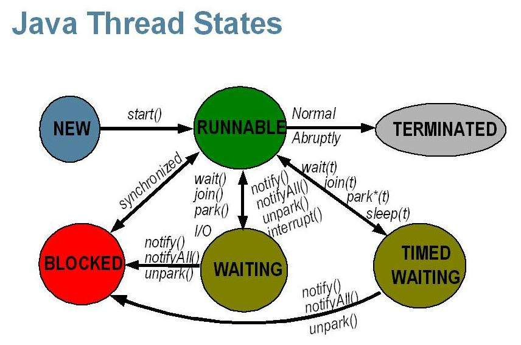

# Java多线程基础

## 1.基本特性

### 1.1特性

①原子性：原子性是指一个操作是不可中断的；

②可见性：可见性是指当一个线程修改了某一个共享变量的值，其他线程是否能够立即知道这个修改；

③有序性：即程序执行的顺序按照代码的先后顺序执行。

### 1.2指令重排

在计算机执行指令的顺序在经过程序编译器编译之后形成的指令序列，一般而言，这个指令序列是会输出确定的结果，以确保每一次的执行都有确定的结果。但是，一般情况下，CPU和编译器为了提升程序执行的效率，会按照一定的规则允许进行指令优化，在某些情况下，这种优化会带来一些执行的逻辑问题，主要的原因是代码逻辑之间是存在一定的先后顺序，在并发执行情况下，会发生二义性，即按照不同的执行逻辑，会得到不同的结果信息。

指令重排是有原则的，并非所有的指令都可以随便改变执行的顺序，以下是基本原则：

①程序顺序原则：一个线程内保证语义的串行性；

②volatile规则：volatile变量的写，先发生于读，这保证了volatile变量的可见性；

③锁规则：解锁（unlock）必然发生在加锁（lock）前；

④传递性：A先于B，B先于C，那么A必然先于C；

⑤线程的start()方法先于它的每一个动作；

⑥线程的所有操作先于线程的终结（Thread.join()）；

⑦线程的中断（interrupt()）先于被中断线程的代码；

⑧对象的构造函数执行、结束先于finalize()方法。

## 2.线程基础

### 2.1线程与进程

进程（Process）是计算机中的程序关于某数据集合上的一次运行活动，是系统进行资源分配和调度的基本单位，是操作系统结构的基础。进程是线程的容器。线程就是轻量级进程，是程序执行的最小单位。使用多线程而不使用多进程进行并发程序的设计，是因为线程间的切换和调度的成本远远小于进程。

### 2.2线程的状态

NEW状态表示刚刚创建的线程，这种线程还没有开始执行。等到线程的start()方法调用时，才表示线程开始执行。当线程执行时，处于RUNNABLE状态，表示线程所需的一切资源都已经准备就绪。如果线程在执行过程中遇到了synchronize同步块，就会进入BLOCKED阻塞状态，这时线程会暂停执行，直到获得了请求的锁。WAITING和TIMED_WAITING都表示等待状态，它们的区别是WAITING会进入一个无时间限制的等待，TIEMD_WAITING会进入一个有时限的等待。当线程执行完毕后，则进入TERMINATED状态，表示结束。

需要注意的是：从NEW状态出发后，线程不能再回到NEW状态，同理，处于TERMINATED的线程也不能再回到RUNNABLE状态。

## 3.线程的基本操作

### 3.1新建线程

Java使用Thread类代表线程，所有的线程对象都必须是Thread类或其子类的实例。Java可以用三种方式来创建线程，如下所示：

①继承Thread类创建线程；

②实现Runnable接口创建线程；

③使用Callable和Future创建线程。

当创建了一个Thread对象之后，可以调用start()方法，接着start()方法就会新建一个线程并让这个线程执行run()方法。需要注意的是：不要用run()开启新线程，它只会在当前线程中，串行run()方法中的代码。

### 3.2终止线程

如果需要终止线程，可以调用stop()方法，但这是一个已经被JDK废弃的方法。为什么这个方法被废弃呢，Thread.stop()方法在结束线程时，会直接终止线程，并且会立即释放这个线程所持有的锁。而这些锁恰恰是用来维持对象一致性的。如果此时，写程序写入数据正写到一半，并强行终止，那么对象就会被写坏，同时，由于锁已被释放，另外一个等待该锁的读线程就顺理成章的读到了这个不一致的对象。所以，这是一个不推荐使用并且已被废弃的方法。

### 3.3线程中断

线程中断并不会使线程立即退出，而是给线程发送一个通知，告诉目标线程有别的线程希望它退出，至于目标线程接到通知后如何处理，则完全由目标线程自行决定。

Thread.sleep()方法会让当前线程休眠若干时间，它会抛出一个InterruptedException中断异常。InterruptedException不是运行时异常，也就是说程序必须捕获并且处理它，当线程在sleep()休眠时，如果被中断，这个异常就会产生。需要注意的是：Thread.sleep()方法由于中断而抛出异常，此时，它会清除中断标记，如果不加处理，那么在下一次循环开始时，就无法捕获这个中断，故在异常处理中，需再次设置中断标记位。

### 3.4等待（wait）和通知

当在一个对象实例上调用object.wait()方法后，当前线程就会在这个对象上等待，停止继续执行，状态转为等待状态，并进入对象实例的等待队列。在等待队列中，可能会有多个线程，因为系统运行多个线程同时等待某一个对象。

只有当object.notify()被调用时，它就会从这个等待队列中，随机选择一个线程，将其唤醒（这里唤醒指的是从等待状态变为就绪状态，而不是马上继续执行，要等CPU分配了执行的时间片该线程才能够继续执行）。除了notify()方法外，Object对象还有一个类似的方法notifyAll()方法，它和notify()的功能基本一致，但不同的是，它会唤醒在这个等待队列的所有等待的线程，而不是随机选择一个。

Object.wait()方法和Object.notify()方法并不是可以随便调用的，它必须包含在对应的synchronized语句中，并且必须先获得目标对象的监视器。需要注意的是：Object.wait()方法和Thread.sleep()方法都可以让线程等待若干时间。除了wait()可以被唤醒外，另外一个主要的区别就是wait()方法会释放目标对象的锁，Thread.sleep()方法不会释放任何资源。

### 3.5挂起（suspend）和继续执行（resume）线程

线程挂起（suspend）和继续执行（resume），这是一对相反的操作，被挂起的线程必须要等到resume()操作后，才能继续执行。因为suspend()方法在导致线程暂停的同时，并不会去释放任何锁资源，所以不推荐使用这个方法。

## 4.其它

### 4.1等待线程结束（join）和谦让（yield）

很多时候，一个线程的输入可能非常依赖于另外一个或者多个线程的输出，此时，这个线程就需要等待依赖线程执行完毕，才能继续继续执行，而JDK就是通过join()方法来实现这个功能的。join()方法的本质就是让调用线程wait()在当前线程对象实例上，当线程执行完成后，被等待的线程会在退出前调用notifyAll()通知所有的等待线程继续执行。

yield()是一个静态方法，一旦执行，它会使当前线程让出CPU，但这里让出CPU并不意味着当前线程不执行了。当前线程在让出CPU后，只是出于就绪状态，还是会继续进行CPU资源的竞争，但是否能被分配到，就不一定了。

### 4.2线程组
在一个系统中，如果线程数量很多，而且功能分配比较明确，就可以将相同功能的线程放置在一个线程组里。

### 4.3守护线程（Daemon）

守护线程是一种特殊的线程，就和它的名字一样，它是系统的守护者，在后台默默地完成一些系统的服务，比如垃圾回收线程，JIT线程就可以理解为守护线程。线程在实例化后默认为用户线程，可以调用setDaemon(true)方法将目标线程设置为守护线程，但这个设置操作必须先于start()，也就是说要在线程启动前将目标线程设置为守护线程。

### 4.4线程优先级

Java中线程可以有自己的优先级，优先级高的线程在竞争资源时会更有优势，更可能抢占资源，当然，这也只是一个概率的问题。在Java中，使用1到10来表示线程的优先级，可以调用setPriority()方法来设置线程的优先级，但这个设置操作必须先于start()，也就是说要在线程启动前设置好线程的优先级。

### 4.5同步锁（synchronized）

关键字synchronized的作用是实现线程间的同步，它的工作是对同步代码加锁，使得每一次，只能有一个线程进入同步块，从而保证线程间的安全性。synchronized的用法：

①指定加锁对象：对给定对象加锁，进入同步代码前要获得给定对象的锁；

②直接作用于实例方法：相当于对当前实例加锁，进入同步代码前要获得当前实例的锁；

③直接作用于静态方法：相当于对当前类加锁，进入同步代码前要获得当前类的锁。

除了用于线程同步、确保线程安全外，synchronized还可以保证线程间的可见性和有序性，并且被synchronized限制的多个线程是串行执行的。

以上摘自《Java高并发程序设计》一书前两章的部分内容，仅当做笔记作一个记录，省略了书中举的实例。