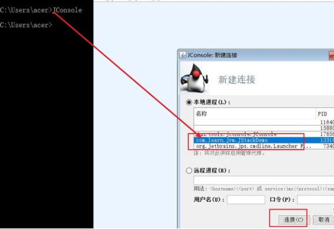
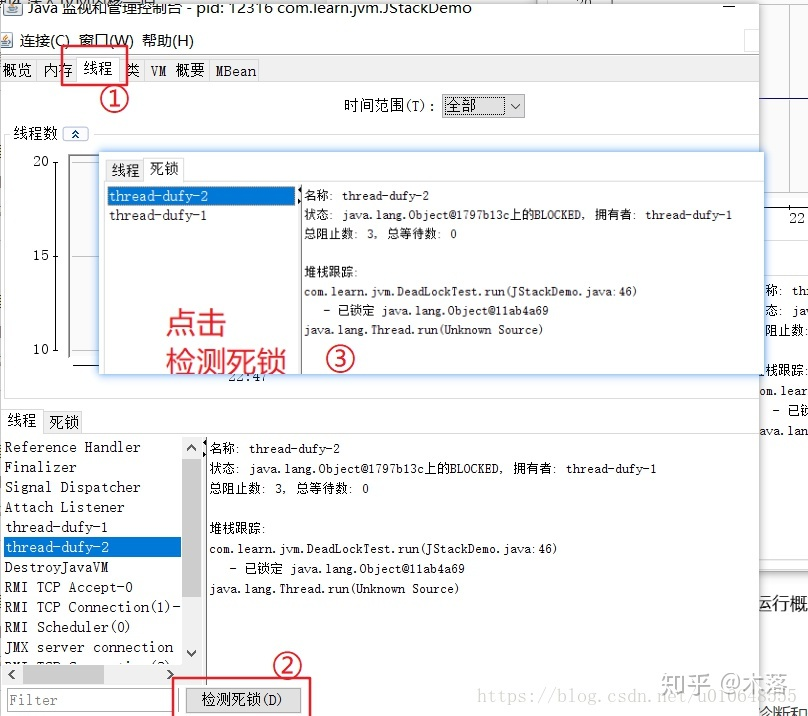
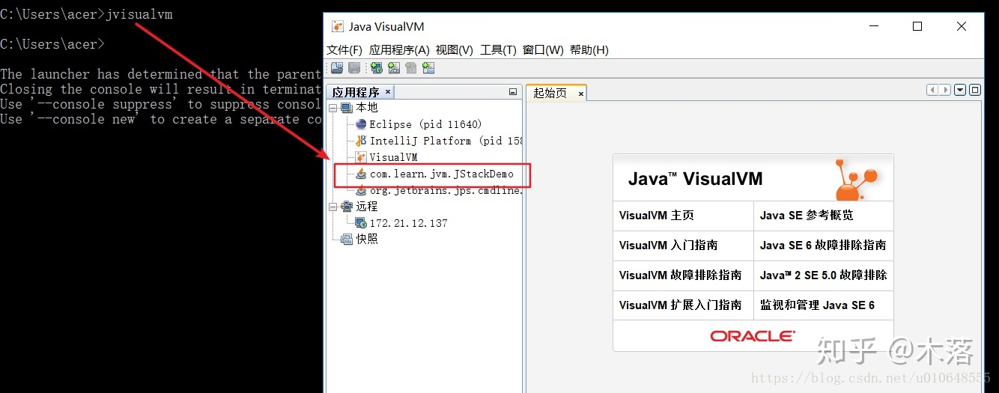
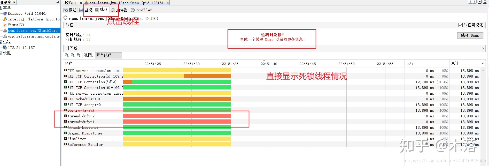

# Java常见问题

## 1.频繁FullGC

产生Full GC**最根本的原因就是有对象不停的进入老年代，最后导致空间不足，引发Full GC释放空间**。

### 1.1 FullGC可能发生的原因

#### 1.1.1 大对象

大对象频繁进入老年代，造成老年代空间快速被占满，导致Full GC。

**解决方案：**

> The default size for PretenureSizeThreshold is 0 which says that any size can be allocated in the young generation.

但是现在默认 `-XX:PretenureSizeThreshold=0`，意味着任何对象都会现在新生代分配内存。 除非对象大小直接大于了Eden区的整个内存大小，一般不会有这种情况，所以现在大对象这个一般不用特别关注。

#### 1.1.2 metaspace空间不足

metaspace空间不足，导致FullGC。

**解决方案：**

一般元空间里面存放的都是一些Class类信息，Class本身也是一个对象，需要空间存放。那么我们程序代码中什么时候会产生对象进入呢，当使用CGLIB动态代理不停的生成代理类的时候，就会加载到元数据空间，所以我们可以根据应用的使用情况去调整元空间的大小。

#### 1.1.3 年轻代对象晋升

从年轻代晋升到老年代的对象越来越多，导致FullGC。

**1.可能晋升的情况**

先来分析一下什么情况下，对象会从年轻代晋升到老年代：

1. Young GC后，存活对象大于survivor区的空间大小，存活对象全部进入老年代，注意动态年龄的区别；
2. 达到了设置的年龄限制，默认是15次；
3. 动态年龄判定，新生代对象提前进行老年代 ，默认从年龄小往大对象大小累加大于设定值为界限（默认为50%，通过参数 `MaxTenuringThreshold` 设置），超过该年龄的对象会进入老年代。

**2.动态年龄举例 **

> 假设现在 年龄1对象占30%，年龄2对象占10%，年龄3对象占30%，年龄4对象占30%，那么会其实比较关注的是年龄3会不会晋升？
>
> 年龄1 + 年龄2 +年龄3  > 50，所以 以年龄3为界限， 对象年龄 >= 3的对象全部进入老年代。

**3.解决方案**

达到了年龄限制而晋升到老年代，这是无法避免的，而且每个对象的最大年龄限制就是15，不可能再调大了，所以这个情况暂且不表。

因存活对象大于survivor区以及根据对象的动态年龄判定而进入老年代，这两种情况很明显就是survivor区大小设置的不合理了，那么可以根据应用的实际情况去修改survivor区的大小，从而避免过于频繁的FullGC。

### 1.2 可能发生的场景及解决方案

#### 1.2.1 全局的集合类

**场景分析：**

有全局的集合类，在系统运行过程中，一直在往对象里面添加数据，而没有删除数据，因为是全局类变量，垃圾回收器就没法回收里面保存的对象，就会导致频繁FullGC，最终可能还会发生内存溢出。

**解决方案：**

采用带有内存淘汰算法（LRU、LFU等）的缓存工具类代替集合类，比如Guava里面的GuavaCache，设置GuavaCache的大小以及对象的最大存活时间，就可以避免对象无法被回收导致频繁FullGC的问题了。

#### 1.2.2 内存泄漏

**场景分析：**

当应用在使用特定的客户端连接外部资源（MySQL、Redis、OSS等）时，如果没有正确的释放客户端所创建的资源，那么当客户端与外部资源断开连接，因为客户端创建的资源还有依赖，导致客户端和它创建的资源都没法被回收，慢慢的堆内存占用就会越来越大，进而导致频繁FullGC，最终可能还会发生内存溢出。

**解决方案：**

任何客户端创建的资源，都要在用完了之后立马释放掉。

#### 1.2.3 大对象

**场景分析：**

如果一次SQL查询语句返回的数据过多，就会产生大对象问题，进而导致频繁FullGC。

**解决方案：**

优化SQL语句，避免一次查询返回的数据过多。

#### 1.2.4 死循环

**场景分析：**

因为代码中有死循环，导致频繁创建大量的对象，进而导致频繁FullGC。

**解决方案：**

通过分析火焰图，找到顶部宽度最大的函数，大概率就是出现死循环的地方，优化掉死循环的代码即可。

### 1.3 排查思路

使用MAT等工具分析Java堆的dump日志，找到占用大量堆内存的对象，进一步定位到出问题的代码。

**案例参考：**

[全局的集合类](https://dongzl.github.io/2019/09/20/05-online-system-frequent-full-gc-bug/index.html)

[内存泄漏问题](https://blog.csdn.net/u012422829/article/details/78154495)

[大对象问题](https://www.jianshu.com/p/1c6bc8842463)

[大对象问题](https://cloud.tencent.com/developer/article/1824276)

### 1.4 JVM调优

[JVM 调优如何减少Full GC](https://blog.csdn.net/wangxuelei036/article/details/108304467)

## 2.如何生成dump文件

1.通过在jvm里添加启动参数配置： `+HeapDumpBeforeFullGC` 、 `+HeapDumpAfterFullGC`

这种方法需要在应用启动前要提前配置好，如果不需要的话，还需要修改jvm参数重启应用。

2.使用jinfo命令进行设置。（生产环境常用的方法）

无需重启vm，即时生效，dump文件生成后，清除VM参数，通常fullgc会频繁发生，不需要一直导出dump，所以拿到一次的dump采样后， 即可清除，然后慢慢分析dump文件。

**第一步：**通过jps获得java程序的pid（jps,ps等方法）：

``` shell
$ jps
5940 Main
3012 Jps
```

**第二步：**调用jinfo命令设置VM参数：

``` shell
$ jinfo -flag +HeapDumpBeforeFullGC 5940
$ jinfo -flag +HeapDumpAfterFullGC 5940
```

使用 `jinfo -flags <pid>` 检查有没有生效

**第三步：**dump文件取到后可以用以下命令清除原来设置的参数：

``` shell
$ jinfo -flag -HeapDumpBeforeFullGC 5940
$ jinfo -flag -HeapDumpAfterFullGC 5940
```

使用 `jinfo -flags pid` 检查有没有生效

## 3.内存溢出

堆内存溢出（OutOfMemoryError: Java heap space）

> **内存溢出**是指程序运行过程中申请的**内存**大于系统能够提供的**内存**，导致无法申请到足够的**内存**，于是就发生了**内存溢出**。

会导致 JVM 内存溢出的一些场景：

1. JVM 启动参数堆内存值设定的过小；
2. 内存中加载的数据量过于庞大（一次性从 Mysql、Redis 取出过多数据）；
3. 对象的引用没有及时释放，使得JVM不能回收；
4. 代码中存在死循环或循环产生过多重复的对象实体。

内存溢出问题一般分为两种：

- 第一种是由于大峰值下瞬间创建大量对象而导致的内存溢出，这个问题可以通过限流或者增大堆内存来解决：
- 第二种则是由于**内存泄漏**而导致的内存溢出，这个问题就需要分析程序是否存在Bug了。

## 4.内存泄漏

内存泄漏（Memory Leak）

> **内存泄漏**是存在一些被分配的对象，这些对象有下面两个特点：
>
> - 首先，这些**对象是可达的**，即在有向图中，存在通路可以与其相连；
> - 其次，这些对象是无用的，即程序以后不会再使用这些对象。
>
> 如果对象满足这两个条件，这些对象就可以判定为Java中的内存泄漏，这些对象**不会被GC所回收**，然而它却占用内存。

会导致 Java 内存泄漏的一些场景：

1. 过度使用静态成员属性（static fields）
2. 忘记关闭已打开的资源链接（unclosed Resources）
3. 没有正确的重写 equals 和 hashcode 方法（HashMap HashSet）

## 5.死锁的排查和解决

### 5.1 什么是死锁

死锁是指两个或两个以上的进程在执行过程中，由于竞争资源或者由于彼此通信而造成的一种阻塞的现象，若无外力作用，它们都将无法推进下去。此时称系统处于死锁状态或系统产生了死锁，这些永远在互相等待的进程称为死锁进程。

### 5.2 产生死锁的原因

1. 两个或两个以上进程（线程）竞争系统资源；
2. 进程推进顺序不当。

### 5.3 产生死锁的必要条件

1. 互斥条件：进程要求对所分配的资源进行排它性控制，即在一段时间内某资源仅为一个进程所占用；
2. 请求和保持条件：当进程因请求资源而阻塞时，对已获得的资源保持不放；
3. 不剥夺条件：进程已获得的资源在未使用完之前，不能剥夺，只能在使用完时由自己释放；
4. 环路等待条件：在发生死锁时，必然存在一个进程--资源的环形链。

### 5.4 排查死锁

#### 5.4.1 使用jps + jstack

（1）通过使用 `jps -l` 命令来获取Java进程的进程id；

（2）使用 `jstack -l <pid>` 来打印出进程的堆栈信息，堆栈信息里面会有发现死锁的日志，可以通过这个日志来定位发生死锁的位置。

#### 5.4.2 使用jconsole

在window打开 JConsole，JConsole是一个图形化的监控工具！

（1）在windons命令窗口 ，输出 `JConsole`，如下图：



（2）选择到线程的tab上，如下截图：



#### 5.4.3 使用Java Visual VM

在window打开 jvisualvm，jvisualvm是一个图形化的监控工具！

（1）在windons命令窗口 ，输出 `jvisualvm`，如下图：



（2）依然是切换到线程这个TAB上，很明显的就有提示，如下图：



### 5.5 如何避免死锁

对多个资源、数据库表、对象同时加锁时，需要保持一致的加锁顺序，否则可能会造成死锁。 说明：线程一需要对表 A、B、C 依次全部加锁后才可以进行更新操作，那么线程二的加锁顺序也必须是 A、B、C，否则可能出现死锁。
