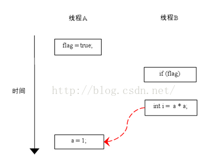

# Java并发基础

## 1.Java中的锁

### 1.1 锁的分类

在 Java 高并发编程中，会遇到各种锁，这里简单介绍一下各种锁的分类。涉及到了以下内容：

1. 公平锁/非公平锁；
2. 可重入锁了；
3. 独占锁/共享锁；
4. 互斥锁/读写锁；
5. 乐观锁/悲观锁；
6. 分段锁；
7. 偏向锁/轻量级锁/重量级锁；
8. 自旋锁。

上面是很多锁的名称，这些分类并不是全是指锁的状态，有的指锁的特性，有的指锁的设计，下面总结的内容是对每个锁的名词进行一定的解释。

#### 1.1.1 公平锁/非公平锁

1. 公平锁是指多个线程按照申请锁的顺序来获取锁；
2. 非公平锁是指多个线程获取锁的顺序并不是按照申请锁的顺序，有可能后申请的线程比先申请的线程优先获取锁。有可能，会造成优先级反转或者饥饿现象；
3. 对于 Java `ReentrantLock` 而言，可以通过构造函数指定该锁是否是公平锁，默认是非公平锁。非公平锁的优点在于吞吐量比公平锁大；
4. 对于 `synchronized` 而言，也是一种非公平锁。由于其并不像 `ReentrantLock` 是通过 AQS（`AbstractQueuedSynchronizer`）的来实现线程调度，所以并没有任何办法使其变成公平锁。

#### 1.1.2 可重入锁

1. 可重入锁又名递归锁，是指在同一个线程在外层方法获取锁的时候，在进入内层方法会自动获取锁；
2. 对于 Java `ReentrantLock` 而言，他的名字就可以看出是一个可重入锁，其名字是 Re Entrant Lock 重新进入锁；
3. 对于 `synchronized` 而言，也是一个可重入锁。可重入锁的一个好处是可一定程度避免死锁。

#### 1.1.3 独占锁/共享锁

1. 独占锁是指该锁一次只能被一个线程所持有；
2. 共享锁是指该锁可被多个线程所持有；
3. 对于 Java `ReentrantLock` 而言，其是独占锁；
4. 但是对于 `Lock` 的另一个实现类 `ReadWriteLock`，其读锁是共享锁，其写锁是独占锁；
5. 读锁的共享锁可保证并发读是非常高效的，读写，写读 ，写写的过程是互斥的；
6. 独占锁与共享锁也是通过 AQS 来实现的，通过实现不同的方法，来实现独占或者共享；
7. 对于 `synchronized` 而言，当然是独享锁。

#### 1.1.4 互斥锁/读写锁

上面讲的独占锁/共享锁就是一种广义的说法，互斥锁/读写锁就是具体的实现。

1. 互斥锁在 Java 中的具体实现就是 `ReentrantLock`；
2. 读写锁在 Java 中的具体实现就是 `ReadWriteLock`。

#### 1.1.5 乐观锁/悲观锁

乐观锁与悲观锁不是指具体的什么类型的锁，而是指看待并发同步的角度。

1. 悲观锁认为对于同一个数据的并发操作，一定是会发生修改的，哪怕没有修改，也会认为修改。因此对于同一个数据的并发操作，悲观锁采取加锁的形式。悲观的认为，不加锁的并发操作一定会出问题；
2. 乐观锁则认为对于同一个数据的并发操作，是不会发生修改的。在更新数据的时候，会采用尝试更新，不断重试的方式更新数据。乐观的认为，不加锁的并发操作是没有事情的；
3. 从上面的描述我们可以看出，悲观锁适合写操作非常多的场景，乐观锁适合读操作非常多的场景，不加锁会带来大量的性能提升；
4. 悲观锁在 Java 中的使用，就是利用各种锁；
5. 乐观锁在 Java 中的使用，是无锁编程，常常采用的是 CAS 算法，典型的例子就是原子类，通过 CAS 自旋实现原子操作的更新。

#### 1.1.6 分段锁

分段锁其实是一种锁的设计，并不是具体的一种锁，对于 JDK7 的 `ConcurrentHashMap` 而言，其并发的实现就是通过分段锁的形式来实现高效的并发操作。

我们以 `ConcurrentHashMap` 来说一下分段锁的含义以及设计思想，`ConcurrentHashMap` 中的分段锁称为 `Segment`，它即类似于 `HashMap`（JDK7 与 JDK8中 `HashMap` 的实现）的结构，即内部拥有一个 `Entry` 数组，数组中的每个元素又是一个链表；同时又是一个 `ReentrantLock`（`Segment` 继承了 `ReentrantLock`)。当需要 put 元素的时候，并不是对整个 hashmap 进行加锁，而是先通过 hashcode 来知道他要放在那一个分段中，然后对这个分段进行加锁，所以当多线程 put 的时候，只要不是放在一个分段中，就实现了真正的并行的插入。但是，在统计 size 的时候，可就是获取 hashmap 全局信息的时候，就需要获取所有的分段锁才能统计。分段锁的设计目的是细化锁的粒度，当操作不需要更新整个数组的时候，就仅仅针对数组中的一项进行加锁操作。

#### 1.1.7 偏向锁/轻量级锁/重量级锁

这三种锁是指锁的状态，并且是针对 `synchronized`。在 Java 5 通过引入锁升级的机制来实现高效 `synchronized`。这三种锁的状态是通过对象监视器在对象头中的字段来表明的。

1. 偏向锁是指一段同步代码一直被一个线程所访问，那么该线程会自动获取锁。降低获取锁的代价；
2. 轻量级锁是指当锁是偏向锁的时候，被另一个线程所访问，偏向锁就会升级为轻量级锁，其他线程会通过自旋的形式尝试获取锁，不会阻塞，提高性能；
3. 重量级锁是指当锁为轻量级锁的时候，另一个线程虽然是自旋，但自旋不会一直持续下去，当自旋一定次数的时候，还没有获取到锁，就会进入阻塞，该锁膨胀为重量级锁。重量级锁会让其他申请的线程进入阻塞，性能降低。

#### 1.1.8 自旋锁

在 Java 中，自旋锁是指尝试获取锁的线程不会立即阻塞，而是采用循环的方式去尝试获取锁，这样的好处是减少线程上下文切换的消耗，缺点是循环会消耗 CPU。

### 1.2 锁的优化

#### 1.2.1 如何提高锁的性能

1. 减小锁持有时间：对于使用锁进行并发控制的应用程序而言，在锁竞争的过程中，单个线程的持有时间与系统性能有着直接的关系。减少锁的持有时间有助于降低锁冲突的可能性，进而提高系统的并发能力。
2. 减小锁粒度：所谓减少锁粒度，就是指缩小锁定对象的范围，从而减少锁冲突的可能性，进而提高系统的并发能力。
3. 读写分离锁来替代独占锁：在读多写少的场合，使用读写锁可以有效提升系统的并发能力。
4. 锁分离：如果将读写锁的思想做进一步的延伸，就是锁分离。读写锁根据读写操作功能上的不同，进行了有效地分离。依据应用程序的功能特点，使用类似的分离思想，也可以对独占锁进行分离。
5. 锁粗化：虚拟机在遇到一连串地对同一锁不断进行请求和释放的操作时，便会把所有的锁操作整合成对锁的一次请求，从而减少对锁的请求同步次数，这个操作叫做锁的粗化。性能优化就是根据运行时的真实情况对各个资源点进行权衡折中的过程。锁粗化的思想和减少锁持有时间是相反的，但在不同的场合，它们的效果并不相同。

#### 1.2.2 Java虚拟机对锁的优化

1. 锁偏向：如果一个线程获得了锁，那么锁就进入偏向模式。当这个线程再次请求锁时，无须再做任何同步操作。
2. 轻量级锁：轻量级锁的操作也很轻便，它只是简单地将对象头部作为指针，指向持有锁的线程堆栈的内部，来判断一个线程是否持有对象锁。
3. 自旋锁：由于当前线程暂时无法获得锁，但是什么时候能获得锁又是个未知数，所以虚拟机此时会让当前线程做几个空循环（这是自旋的含义），在经过若干次循环后，如果可以得到锁，那么就顺利进入临界区。如果还不能获得锁，才会真实地将线程在操作系统层面挂起。
4. 锁消除：Java 虚拟机在 JIT 编译时，通过对运行上下文的扫描，去除不可能存在共享资源竞争的锁。锁消除涉及的一项技术为逃逸分析，所谓逃逸分析就是观察某一个变量是否会逃出某一个作用域。

#### 1.2.3 比较交换（CAS）

CAS（Compare and swap）算法的过程是这样的：它包含三个参数 CAS(V,E,N)。V 表示要更新的变量当前在内存中的值，E 表示当前线程本地变量表中的值，N 表示新值。当且仅当 V 值等于 E 值时，才会将 V 的值设为 N，如果 V 值和 E 值不同，则说明已经有其他线程做了更新，则当前线程什么都不做。

## 2.Java同步控制

### 2.1 ReentrantLock

`ReentrantLock`  完全可以替代 `synchronized` 关键字。与 `synchronized` 相比，`ReentrantLock` 有着显式的操作过程，开发人员可以手动指定何时加锁，何时释放锁。所以，`ReentrantLock` 对逻辑控制的灵活性要远远好于 `synchronized`。`ReentrantLock` 对于一个线程是可以反复进入的，也就是说，一个线程可以多次获得同一把锁，只不过需要注意的是，如果同一个线程多次获得锁，那么在释放锁的时候，也必须释放相同的次数。`ReentrantLock` 的特性：

1. **中断响应**

   在等待重入锁的过程中，程序可以根据需要取消对锁的请求。过程就是，如果一个线程正在等待锁，那么它依然可以收到一个中断通知，被告知无须再等待，可以停止工作了。这种情况对死锁是有一定帮助的。

   在对锁的请求时，使用 `lockInterruptibly()` 方法，这是一个可以对锁中断进行响应的锁申请动作，即在等待锁的过程中，可以调用 `interrupt()` 方法，线程就会响应并中断对锁的等待。

2. **锁申请等待限时**

   通过调用 `tryLock()` 方法设置线程申请锁的等待时间，即限时等待，过了这个等待时间，让线程自动放弃，这也是一种避免死锁的方式。

   `tryLock()` 方法接收两个参数，一个表示等待时长，另外一个表示计时单位。当然，`tryLock()` 方法也可以不接收参数直接运行。这种情况下，当前线程会尝试获得锁，如果锁并未被其它线程占用，则申请锁会成功，并立即返回 true；如果锁被其它线程占用，则当前线程不会进行等待，而是立即返回 false。这种模式下也不会一起线程等待，因此也不会产生死锁。

3. **公平锁**

   在大多数情况下，锁的申请是非公平的。也就是说，多个线程获取锁的顺序并不是按照申请锁的顺序，有可能后申请的线程比先申请的线程优先获取锁，因此不能保证其公平性，有可能会造成优先级反转或者饥饿现象。而公平锁，则不是这样，它会按照时间的先后顺序，保证先到者先得，后到者后得。公平锁的一大特点是：它不会产生饥饿现象。

   可以在创建重入锁，`new ReentrantLock(true)` 的时候，在构造方法中传入一个 true，来标识这个锁是公平的。要实现公平锁必然要求系统维护一个有序队列，因此公平锁的实现成本比较高，性能也相对非常低下。故在默认情况下，锁是非公平的。

`ReentrantLock` 几个重要的方法：

1. `lock()`：获得锁，如果锁已经被占用，则等待；
2. `lockInterruptibly()`：获得锁，但优先响应中断；
3. `tryLock()`：尝试获得锁，如果成功，返回 true，失败返回 false。该方法不等待，立即返回；
4. `tryLock(long time, TimeUnit unit)`：在给定时间内尝试获得锁；
5. `unlock()`：释放锁。

在 `ReentrantLock` 的实现中，主要包含三个要素：

1. 是原子状态。原子状态使用 CAS 操作来存储当前锁的状态，判断是否已经被别的线程持有；
2. 是同步队列。所有没有请求到锁的线程，会进入同步队列进行等待。待有线程释放锁后，系统就能从同步队列中唤醒那个等待了最久但还没有放弃的线程；
3. 是阻塞原语 `park()` 和 `unpark()`，用来挂起和恢复线程，没有得到锁的线程将会被挂起。

### 2.2 Condition

`Condition` 对象的作用其实和 `Obecjt` 类中的 `wait()` 和 `notify()` 方法的作用是大致相同的，只不过 `wait()` 和 `notify()` 是配合 `synchronized` 关键字使用的，而 `Condition` 是配合 `ReentrantLock` 使用的。通过 `ReentrantLock` 类的 `newCondition()` 方法可以生成一个与当前 `ReentrantLock` 锁绑定的 `Condition` 实例。利用 `Condition` 对象，我们就可以让线程在合适的时间等待，或者在某一个特定的时刻得到通知，继续执行。

`Condition` 方法简介：

1. `await()` 方法会使当前线程等待，同时释放当前锁，当其他线程中使用 `signal()` 或者 `signalAll()` 方式时，线程就会重新获得锁并继续执行。或者当前线程被中断时，也能跳出来等待；
2. `awaitUninterruptibly()` 方法与 `await()` 方法基本相同，但是它并不会在等待过程中响应中断；
3. `signal()` 方法用于唤醒一个在等待中的线程，相对的 `signalAll()` 方法会唤醒所有在等待中的线程。

和 `Object.wait()` 和 `Object.notify()` 方法一样，当线程使用 `Condition.await()` 时，要求线程持有相关的 `ReentrantLock` 锁，在 `Condition.await()` 调用后，这个线程会释放这把锁。同理，在调用 `Condition.signal()` 方法时，也要求线程先获得相关的锁。

### 2.3 Semaphore

信号量（`Semaphore`）是为多线程协作提供了更为强大的控制方法。广义上说，信号量是对锁的扩展。无论是内部锁 `synchronized` 还是 `ReentrantLock`，一次都只允许一个线程访问同一个资源，而信号量却可以指定多个线程，同时访问某一个资源。

在构造信号量对象时，必须要指定信号量的准入数，即同时能申请多少个许可。当每个线程每次只申请一个许可时，这就相当于指定了同时有多少个线程可以访问某一个资源。`Semaphore` 的构造方法还有一个参数，可以指定当前信号量是否是公平的。

`Semaphore` 方法简介：

1. `acquire()` 方法尝试获得一个准入的许可，若无法获得，则线程会等待，直到有线程释放一个许可或者当前线程被中断；
2. `acquireUninterruptibly()` 方法和 `acquire()` 方法类似，但不响应中断；
3. `tryAcquire()` 方法尝试获得一个许可，如果成功返回 true，失败则返回 false，它不会进行等待，立即返回；
4. `tryAcquire(long timeout, TimeUnit unit)` 方法尝试获得一个许可，如果成功返回 true，失败则等待 `timeout` 时长，直到获得许可返回 true，或者超时返回 false；
5. `release()` 用于在线程访问资源结束后，释放一个许可，以使其他等待许可的线程可以进行资源访问。

### 2.4 ReadWriteLock

`ReadWriteLock` 是 JDK5 提供的读写分离锁，读写分离锁可以有效地帮助减少锁竞争，以提升系统性能。读写锁允许多个线程同时读，但是写写操作和读写操作间依然是需要相互等待和持有锁的。读写锁的约束情况如下表所示：

|      | 读     | 写   |
| ---- | ------ | ---- |
| 读   | 非阻塞 | 阻塞 |
| 写   | 阻塞   | 阻塞 |

- 读-读不互斥：读读之间不阻塞；
- 读-写互斥：读阻塞写，写也会阻塞读；
- 写-写互斥：写写阻塞。

### 2.5 CountDownLatch

倒计时器 `CountDownLatch` 通常用来控制线程等待，它可以让某一个或多个线程等待直到倒计时结束，再继续执行。

### 2.6 CyclicBarrier

`CyclicBarrier` 可以理解为循环栅栏，它是一个同步工具类，并允许一组线程互相等待，直到到达某个公共屏障点，它比 `CountDownLatch` 略微强大一些，`CyclicBarrier` 可以接收一个参数作为 `barrierAction`，所谓 `barrierAction` 就是当计数器一次计数完成后，系统会执行的动作。

`CyclicBarrier.await()` 方法可能会抛出两个异常，一个是 `InterruptedException`，也就是在等待过程中，线程被中断，应该说这是一个非常通用的异常。大部分迫使线程等待的方法都可能抛出这个异常，使得线程在等待时依然可以响应外部紧急事件。另外一个异常则是 `CyclicBarrier` 特有的 `BrokenBarrierException`。一旦遇上这个异常，则表示当前的 `CyclicBarrier` 已经被破坏了，可能系统已经没有办法等待所有线程到齐了。

### 2.7 LockSupport

线程阻塞工具类 `LockSupport` 是一个非常方便实用的线程阻塞工具，它可以在线程内任意位置让线程阻塞。和 `Thread.suspend()` 相比，它弥补了由于 `resume()` 在前发生，导致线程无法继续执行的情况。

`LockSupport` 类使用类似信号量的机制，它为每一个线程准备了一个许可，如果许可可用，那么 `park()` 方法会立即返回，并且消费这个许可（也就是把许可变为不可用），如果许可不可用，就会阻塞。而 `unpark()` 则使得一个许可变为可用（但是和信号量不同的是，许可不能累加，你不可能拥有超过一个许可，它永远只有一个）。所以即使 `unpark()` 操作发生在 `park()` 之前，它也可以使下一次的 `park()` 操作立即返回。

## 3.JVM之指令重排分析

引言：在 Java 中看似顺序的代码在 JVM 中，可能会出现编译器或者 CPU 对这些操作指令进行了重新排序；在特定情况下，指令重排将会给我们的程序带来不确定的结果.....

### 3.1 什么是指令重排？

在计算机中执行的指令的顺序是经过程序编译器编译之后形成的指令序列，一般而言，这个指令序列是会输出确定的结果，以确保每一次的执行都有确定的结果。但是，一般情况下，CPU 和编译器为了提升程序执行的效率，会按照一定的规则允许进行指令优化，在某些情况下，这种优化会带来一些执行的逻辑问题，主要的原因是代码逻辑之间是存在一定的先后顺序，在并发执行情况下，会发生二义性，即按照不同的执行逻辑，会得到不同的结果信息。

### 3.2 数据依赖性

主要指不同的程序指令之间的顺序是不允许进行交换的，即可称这些程序指令之间存在数据依赖性。 例子如下：

| 名称   | 代码示例     | 说明                           |
| ------ | ------------ | ------------------------------ |
| 写后读 | a = 1;b = a; | 写一个变量之后，再读这个位置。 |
| 写后写 | a = 1;a = 2; | 写一个变量之后，再写这个变量。 |
| 读后写 | a = b;b = 1; | 读一个变量之后，再写这个变量。 |

进过分析，发现这里每组指令中都有写操作，这个写操作的位置是不允许变化的，否则将带来不一样的执行结果。编译器将不会对存在数据依赖性的程序指令进行重排，这里的依赖性仅仅指单线程情况下的数据依赖性；多线程并发情况下，此规则将失效。

### 3.3 as-if-serial语义

不管怎么重排序（编译器和处理器为了提高并行度），（单线程）程序的执行结果不能被改变。编译器，runtime  和处理器都必须遵守 as-if-serial 语义。

分析：  关键词是单线程情况下，必须遵守；其余的不遵守。

代码示例：

``` java
double pi  = 3.14;    // A
double r   = 1.0;     // B
double area = pi * r * r; // C
```

分析代码：   A->C  B->C;  A，B 之间不存在依赖关系； 故在单线程情况下， A 与 B 的指令顺序是可以重排的，C 不允许重排，必须在 A 和 B 之后。

结论性的总结：

as-if-serial 语义把单线程程序保护了起来，遵守 as-if-serial 语义的编译器，runtime 和处理器共同为编写单线程程序的程序员创建了一个幻觉：单线程程序是按程序的顺序来执行的。as-if-serial 语义使单线程程序员无需担心重排序会干扰他们，也无需担心内存可见性问题。核心点还是单线程，多线程情况下不遵守此原则。

### 3.4 在多线程下的指令重排

首先我们基于一段代码的示例来分析，在多线程情况下，重排是否有不同结果信息：

``` java
class ReorderExample {
    int a = 0;
    boolean flag = false;
  
    public void writer() {
        a = 1;                   // 1
        flag = true;             // 2
    }
  
    Public void reader() {
        if (flag) {                // 3
            int i =  a * a;        // 4
            ……
        }
    }
}
```

上述的代码，在单线程情况下，执行结果是确定的， `flag = true` 将被 `reader()` 的方法体中看到，并正确的设置结果。 但是在多线程情况下，是否还是只有一个确定的结果呢？

假设有 A 和 B 两个线程同时来执行这个代码片段， 两个可能的执行流程如下：

可能的流程 1, 由于 1 和 2 语句之间没有数据依赖关系，故两者可以重排，在两个线程之间的可能顺序如下：


可能的流程2:， 在两个线程之间的语句执行顺序如下：


根据 happens- before 的程序顺序规则，上面计算圆的面积的示例代码存在三个 happens- before 关系：

A happens- before B；

B happens- before C；

A happens- before C；

这里的第 3 个 happens- before 关系，是根据 happens- before 的传递性推导出来的  

在程序中，操作 3 和操作 4 存在控制依赖关系。当代码中存在控制依赖性时，会影响指令序列执行的并行度。为此，编译器和处理器会采用猜测（Speculation）执行来克服控制相关性对并行度的影响。以处理器的猜测执行为例，执行线程 B 的处理器可以提前读取并计算 `a * a`，然后把计算结果临时保存到一个名为重排序缓冲（reorder buffer ROB）的硬件缓存中。当接下来操作 3 的条件判断为真时，就把该计算结果写入变量 i 中。从图中我们可以看出，猜测执行实质上对操作 3 和 4 做了重排序。重排序在这里破坏了多线程程序的语义。

核心点是：两个线程之间在执行同一段代码之间的 critical area，在不同的线程之间共享变量；由于执行顺序、CPU 编译器对于程序指令的优化等造成了不确定的执行结果。

### 3.5 指令重排的原因分析

主要还是编译器以及 CPU 为了优化代码或者执行的效率而执行的优化操作；应用条件是单线程场景下，对于并发多线程场景下，指令重排会产生不确定的执行效果。

### 3.6 如何防止指令重排

`volatile` 关键字可以保证变量的可见性，因为对 `volatile` 的操作都在 Main Memory 中，而 Main Memory 是被所有线程所共享的，这里的代价就是牺牲了性能，无法利用寄存器或 Cache，因为它们都不是全局的，无法保证可见性，可能产生脏读。

`volatile` 还有一个作用就是局部阻止重排序的发生，对 `volatile` 变量的操作指令都不会被重排序，因为如果重排序，又可能产生可见性问题。

在保证可见性方面，锁（包括显式锁、对象锁）以及对原子变量的读写都可以确保变量的可见性。但是实现方式略有不同，例如同步锁保证得到锁时从内存里重新读入数据刷新缓存，释放锁时将数据写回内存以保数据可见，而 `volatile` 变量干脆都是读写内存。

### 3.7 可见性

这里提到的可见性是指前一条程序指令的执行结果，可以被后一条指令读到或者看到，称之为可见性。反之为不可见性。这里主要描述的是在多线程环境下，指令语句之间对于结果信息的读取即时性。
