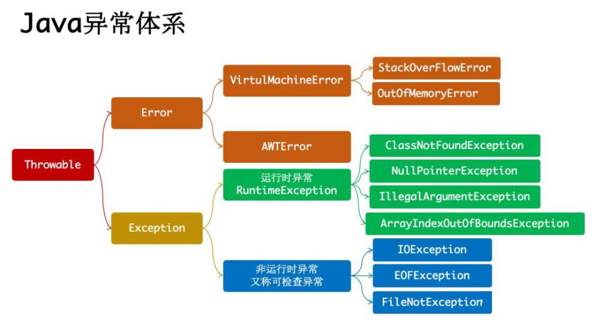

# Java异常处理机制

## 简介

程序运行时，发生的不被期望的事件，它阻止了程序按照程序员的预期正常执行，这就是异常。而异常处理机制能让程序在异常发生时，按照代码的预先设定的异常处理逻辑，针对性地处理异常，让程序尽最大可能恢复正常并继续执行，且保持代码的清晰。
Java中的异常可以是函数中的语句执行时引发的，也可以是程序员通过throw 语句手动抛出的，只要在Java程序中产生了异常，就会用一个对应类型的异常对象来封装异常，JRE就会试图寻找异常处理程序来处理异常。

## 1.Java异常类结构图

Throwable类是Java异常类型的顶层父类，一个对象只有是 Throwable 类的（直接或者间接）实例，他才是一个异常对象，才能被异常处理机制识别。我们可以自定义异常，JDK中内建了一些常用的异常类，如下图所示：

## 2.Java异常分类

2.1根据继承关系可分为错误（Error）和异常（Exception），它们都继承自Throwable。其中RuntimeException又继承自Exception，而Error和RuntimeException及其子类称为未检查异常（Unchecked exception），它们的区别是：
①错误（Error）：Error类一般是指与虚拟机相关的问题，如系统崩溃，虚拟机错误，内存空间不足，方法调用栈溢出等。如：java.lang.StackOverFlowError和Java.lang.OutOfMemoryError。对于这类错误，Java编译器不去检查他们，即为未检查异常（Unchecked exception），且这类错误一旦发生将会导致应用程序中断，仅靠程序本身无法恢复和预防，遇到这样的错误，建议让程序终止；

②异常（Exception）：Exception类表示程序可以处理的异常，可以捕获且可能恢复。遇到这类异常，应该尽可能处理异常，使程序恢复运行，而不应该随意终止异常。其中RuntimeException和其子类为运行时异常（Runtime Exception），即未检查异常（Unchecked exception）；而Exception的其它子类为非运行异常，即受检查异常（Checked Exception）。具体区别可见下文分解。

2.2根据Javac对异常的处理要求，将异常类分为未检查异常（Unchecked exception），其它异常成为受检查异常（Checked Exception），它们的区别是：
①非检查异常（unckecked exception）：Error和RuntimeException以及它们的子类。javac在编译时，不会提示和发现这样的异常，不要求在程序处理这些异常。所以如果愿意，我们可以编写代码处理（使用try…catch…finally）这样的异常，也可以不处理。对于这些异常，我们应该修正代码，而不是去通过异常处理器处理。这样的异常发生的原因多半是代码写的有问题。如除0错误ArithmeticException，错误的强制类型转换错误ClassCastException，数组索引越界ArrayIndexOutOfBoundsException，使用了空对象NullPointerException等等；

②检查异常（checked exception）：除了Error和RuntimeException以及它们的子类以外的异常，javac强制要求程序员为这样的异常做预备处理工作（使用try…catch…finally或者throws）。在方法中要么用try-catch语句捕获它并处理，要么用throws子句声明抛出它，否则编译不会通过。这样的异常一般是由程序的运行环境导致的。因为程序可能被运行在各种未知的环境下，而程序员无法干预用户如何使用他编写的程序，于是程序员就应该为这样的异常时刻准备着。如SQLException, IOException,ClassNotFoundException等。

## 3.throw和throws
①throw是用来抛出任意异常的，你可以抛出任意Throwable，包括自定义的异常类对象；

②throws总是出现在一个函数头中，用来标明该成员方法可能抛出的各种异常。如果方法抛出了异常，那么调用这个方法的时候就需要处理这个异常。

## 4.try-catch-finally-return
①不管是否有异常产生，finally块中代码都会执行；

②当try和catch中有return语句时，finally块仍然会执行；

③finally是在return后面的表达式运算后执行的，所以函数返回值是在finally执行前确定的。无论finally中的代码怎么样，返回的值都不会改变，仍然是之前return语句中保存的值；

④finally中最好不要包含return，否则程序会提前退出，返回值不是try或catch中保存的返回值。