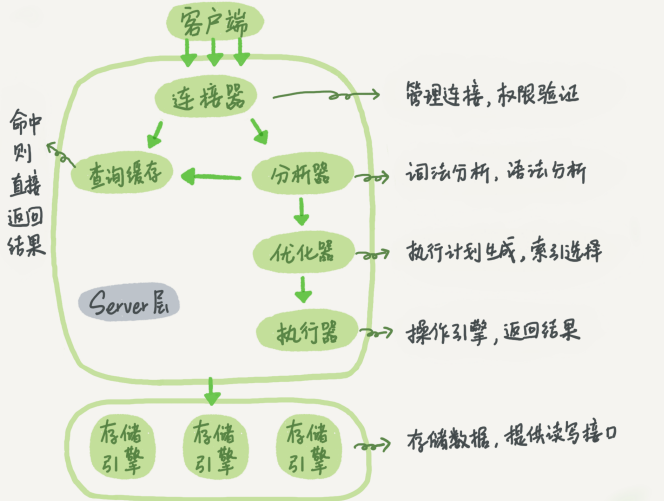
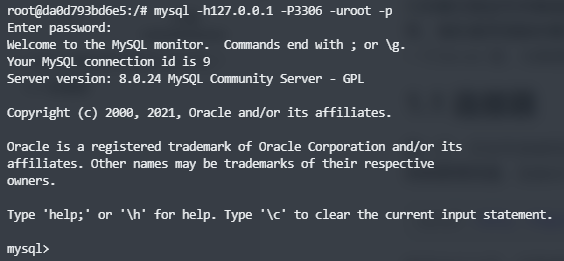
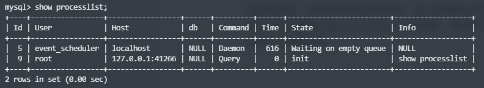
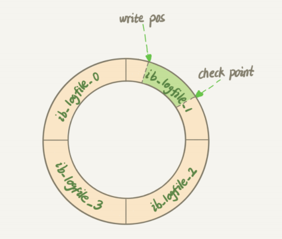
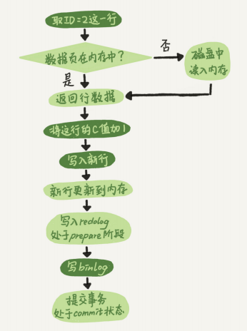
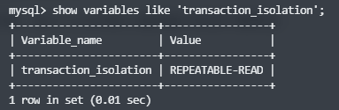
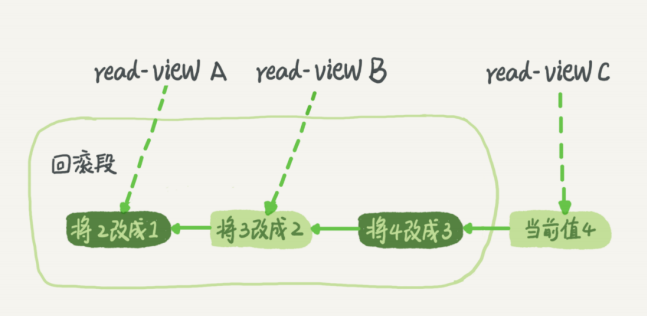

# 1.一条SQL查询语句是怎么执行的？

先从最简单的查询语句开始，比如现在有个最简单的表，表里只有一个 ID 字段，在执行下面这个查询语句时：

``` sql
mysql> select * from T where ID=10;
```

我们看到的只是输入一条语句，返回一个结果，却不知道这条语句在 MySQL 内部的执行 过程。

下面给出的是 MySQL 的基本架构示意图，从中可以清楚地看到 SQL 语句在 MySQL 的各个功能模块中的执行过程。



大体来说，MySQL 可以分为 **Server 层**和**存储引擎层**两部分。 Server 层包括**连接器**、**查询缓存**、**分析器**、**优化器**、**执行器**等，涵盖 MySQL 的大多数核心服务功能，以及所有的内置函数（如日期、时间、数学和加密函数等），所有跨存储引擎的功能都在这一层实现，比如存储过程、触发器、视图等。

而**存储引擎层负责数据的存储和提取**。其架构模式是插件式的，支持 InnoDB、 MyISAM、Memory 等多个存储引擎。**现在最常用的存储引擎是 InnoDB，它从 MySQL 5.5.5 版本开始成为了默认存储引擎**。不同的存储引擎共用一个Server 层，也就是从连接器到执行器的部分。

## 1.1 连接器

第一步，你会先连接到这个数据库上，这时候接待你的就是连接器。连接器负责跟客户端**建立连接**、**获取权限**、**维持和管理连接**。连接命令一般是这么写的：

``` shell
mysql -h$ip -P$port -u$user -p
```

输完命令之后，你就需要在交互对话里面输入密码。虽然密码也可以直接跟在 -p 后面写在命令行中，但这样可能会导致你的密码泄露。**如果你连的是生产服务器，强烈建议你不 要这么做**。 

**连接命令中的 mysql 是客户端工具，用来跟服务端建立连接**。在完成经典的 TCP 握手后，连接器就要开始认证你的身份，这个时候用的就是你输入的用户名和密码。

- 如果用户名或密码不对，你就会收到一个"Access denied for user"的错误，然后客户端程序结束执行。
- 如果用户名密码认证通过，连接器会到权限表里面查出你拥有的权限。之后，**这个连接里面的权限判断逻辑，都将依赖于此时读到的权限**。



这就意味着，一个用户成功建立连接后，即使你用管理员账号对这个用户的权限做了修改，也不会影响已经存在连接的权限。修改完成后，只有再新建的连接才会使用新的权限设置。

连接完成后，如果你没有后续的动作，这个连接就处于空闲状态，你可以在 `show processlist` 命令中看到它。下图是 `show processlist` 的结果：



客户端如果太长时间没动静，连接器就会自动将它断开。这个时间是由参数 **wait_timeout** 控制的，**默认值是 8 小时**。如果在连接被断开之后，客户端再次发送请求的话，就会收到一个错误提醒： Lost connection to MySQL server during query。这时候如果你要继续，就需要重连，然后再执行请求了。

- **数据库里面，长连接是指连接成功后，如果客户端持续有请求，则一直使用同一个连接**。
- **短连接则是指每次执行完很少的几次查询就断开连接，下次查询再重新建立一个**。

**建立连接的过程通常是比较复杂的，所以我建议你在使用中要尽量减少建立连接的动作， 也就是尽量使用长连接**。 但是全部使用长连接后，你可能会发现，有些时候 MySQL 占用内存涨得特别快，这是因为 MySQL 在执行过程中临时使用的内存是管理在连接对象里面的。这些资源会在连接断开的时候才释放。所以如果长连接累积下来，可能导致内存占用太大，被系统强行杀掉 （OOM），从现象看就是 MySQL 异常重启了。

怎么解决这个问题呢？你可以考虑以下两种方案。 

1. **定期断开长连接**。使用一段时间，或者程序里面判断执行过一个占用内存的大查询后， 断开连接，之后要查询再重连。 
2. **如果你用的是 MySQL 5.7 或更新版本，可以在每次执行一个比较大的操作后，通过执行 `mysql_reset_connection` 来重新初始化连接资源**。这个过程不需要重连和重新做权限验证，但是会将连接恢复到刚刚创建完时的状态。

## 1.2 查询缓存

连接建立完成后，你就可以执行 select 语句了。执行逻辑就会来到第二步：查询缓存。

MySQL 拿到一个查询请求后，会先到查询缓存看看，之前是不是执行过这条语句。之前执行过的语句及其结果可能会以 key-value 对的形式，被直接缓存在内存中。**key 是查询的语句，value 是查询的结果**。

- 如果你的查询能够直接在这个缓存中找到 key，那么这个 value 就会被直接返回给客户端。

- 如果语句不在查询缓存中，就会继续后面的执行阶段。执行完成后，执行结果会被存入查询缓存中。

你可以看到，如果查询命中缓存，MySQL 不需要执行后面的复杂操作，就可以直接返回结果，这个效率会很高。但是大多数情况下我会建议你不要使用查询缓存，为什么呢？因为查询缓存往往弊大于利。**查询缓存的失效非常频繁，只要有对一个表的更新，这个表上所有的查询缓存都会被清空**。因此很可能你费劲地把结果存起来，还没使用呢，就被一个更新全清空了。对于更新压力大的数据库来说，查询缓存的命中率会非常低。除非你的业务就是有一张静态表，很长时间才会更新一次。比如，一个系统配置表，那这张表上的查询才适合使用查询缓存。

好在 MySQL 也提供了这种“按需使用”的方式。你可以将参数 query_cache_type 设置成 DEMAND，这样对于默认的 SQL 语句都不使用查询缓存。而对于你确定要使用查询缓存的语句，可以用 SQL_CACHE 显式指定，像下面这个语句一样：

``` sql
 mysql> select SQL_CACHE * from T where ID=10;
```

需要注意的是，MySQL 8.0 版本直接将查询缓存的整块功能删掉了，也就是说 8.0 开始彻底没有这个功能了。

## 1.3 分析器

如果没有命中查询缓存，就要开始真正执行语句了。首先，MySQL 需要知道你要做什 么，因此需要对 SQL 语句做解析。

- **分析器先会做“词法分析”**。你输入的是由多个字符串和空格组成的一条 SQL 语句， MySQL 需要识别出里面的字符串分别是什么，代表什么。MySQL 从你输入的"select"这个关键字识别出来，这是一个查询语句。它也要把字符 串“T”识别成“表名 T”，把字符串“ID”识别成“列 ID”。
- **做完了这些识别以后，就要做“语法分析”**。根据词法分析的结果，语法分析器会根据语法规则，判断你输入的这个 SQL 语句是否满足 MySQL 语法。 如果你的语句不对，就会收到“You have an error in your SQL syntax”的错误提醒。**一般语法错误会提示第一个出现错误的位置**。

## 1.4 优化器

经过了分析器，MySQL 就知道你要做什么了。在开始执行之前，还要先经过优化器的处理。 优化器是在表里面有多个索引的时候，决定使用哪个索引；或者在一个语句有多表关联 （join）的时候，决定各个表的连接顺序。比如你执行下面这样的语句，这个语句是执行两个表的 join：

``` sql
 mysql> select * from t1 join t2 using(ID) where t1.c=10 and t2.d=20;
```

既可以先从表 t1 里面取出 c=10 的记录的 ID 值，再根据 ID 值关联到表 t2，再判断 t2 里面 d 的值是否等于 20。也可以先从表 t2 里面取出 d=20 的记录的 ID 值，再根据 ID 值关联到 t1，再判断 t1 里面 c 的值是否等于 10。这两种执行方法的逻辑结果是一样的，但是执行的效率会有不同，而优化器的作用就是决定选择使用哪一个方案。 优化器阶段完成后，这个语句的执行方案就确定下来了，然后进入执行器阶段。

## 1.5 执行器

MySQL 通过分析器知道了你要做什么，通过优化器知道了该怎么做，于是就进入了执行器阶段，开始执行语句。开始执行的时候，要先判断一下你对这个表 T 有没有执行查询的权限，如果没有，就会返回没有权限的错误 (在工程实现上，如果命中查询缓存，会在查询缓存返回结果的时候，做权限验证。查询也会在优化器之前调用precheck 验证权限)。

如果有权限，就打开表继续执行。打开表的时候，执行器就会根据表的引擎定义，去使用这个引擎提供的接口。 比如我们这个例子中的表 T 中，ID 字段没有索引，那么执行器的执行流程是这样的： 

1. 调用 InnoDB 引擎接口取这个表的第一行，判断 ID 值是不是 10，如果不是则跳过，如果是则将这行存在结果集中；
2. 调用引擎接口取“下一行”，重复相同的判断逻辑，直到取到这个表的最后一行。
3. 执行器将上述遍历过程中所有满足条件的行组成的记录集作为结果集返回给客户端。

至此，这个语句就执行完成了。

对于有索引的表，执行的逻辑也差不多。第一次调用的是“取满足条件的第一行”这个接 口，之后循环取“满足条件的下一行”这个接口，这些接口都是引擎中已经定义好的。

你会在数据库的慢查询日志中看到一个 **rows_examined** 的字段，表示这个语句执行过程中扫描了多少行。这个值就是在执行器每次调用引擎获取数据行的时候累加的。 在有些场景下，执行器调用一次，在引擎内部则扫描了多行，因此引擎扫描行数跟 rows_examined 并不是完全相同的。

# 2.一条SQL更新语句是如何执行的？

一条更新语句的执行流程又是怎样的呢？

与查询流程不一样的是，更新流程还涉及两个重要的日志模块：**redo log（重做日志）**和 **binlog（归档日志）**。

## 2.1 redo log（重做日志）

MySQL 保存和更新数据的时候会用到 WAL 技术，WAL 的全称是 Write-Ahead Logging，它的关键点就是先写日志，再写磁盘。具体来说，当有一条记录需要更新的时候，InnoDB 引擎就会先把记录写到 redo log 里面，并更新内存，这个时候更新就算完成了。同时，InnoDB 引擎会在适当的时候，将这个操作记录更新到磁盘里面，而这个更新往往是在系统比较空闲的时候做。**redo log 是 InnoDB 引擎特有的日志**。

InnoDB 的 redo log 是固定大小的，比如可以配置为一组 4 个文件，每个文件的大小是 1GB，那么这块“粉板”总共就可以记录 4GB 的操作。从头开始写，写到末尾就又回到开头循环写，如下面这个图所示：



write pos 是当前记录的位置，一边写一边后移，写到第 3 号文件末尾后就回到 0 号文件 开头。checkpoint 是当前要擦除的位置，也是往后推移并且循环的，擦除记录前要把记录更新到数据文件。write pos 和 checkpoint 之间的是日志文件上还空着的部分，可以用来记录新的操作。如 果 write pos 追上 checkpoint，表示日志文件写满了，这时候不能再执行新的更新，得停下来先擦掉一些记录，把 checkpoint 推进一下。 有了 redo log，InnoDB 就可以保证即使数据库发生异常重启，之前提交的记录都不会丢失，这个能力称为crash-safe。

**Redo log 记录了在数据页上“做了什么改动”**。

## 2.2 binlog（归档日志）

MySQL 从整体来看，其实就有两块：一块是 Server 层，它主要做的是 MySQL 功能层面的事情；还有一块是引擎层，负责存储相关的具体事宜。**redo log 是 InnoDB 引擎特有的日志，而 Server 层也有自己的日志，称为 binlog（归档日志）**。

最开始 MySQL 里并没有 InnoDB 引擎。MySQL 自带的引擎是 MyISAM，但是 MyISAM 没有 crash-safe 的能力，binlog 日志只能用于归档。而 InnoDB 是另一个公司以插件形式引入 MySQL 的，既然只依靠 binlog 是没有 crash-safe 能力的，所以 InnoDB 使用另外一套日志系统——也就是 redo log 来实现 crash-safe 能力。

这两种日志有以下三点不同：

1. redo log 是 InnoDB 引擎特有的；binlog 是 MySQL 的 Server 层实现的，所有引擎都可以使用。
2. redo log 是物理日志，记录的是“**在某个数据页上做了什么修改**”；binlog 是逻辑日志，记录的是**这个语句的原始逻辑**，比如“给 ID=2 这一行的 c 字段加 1 ”。
3. redo log 是循环写的，空间固定会用完；binlog 是可以追加写入的。“追加写”是指 binlog 文件写到一定大小后会切换到下一个，并不会覆盖以前的日志。

**binlog 有两种模式：statement 格式记录的是 sql 语；row 格式记录的是修改行的内容，更新前和更新后的数据都会记录**。 

有了对这两个日志的概念性理解，我们再来看执行器和 InnoDB 引擎在执行下面这个简单的 update 语句时的内部流程。

``` sql
mysql> update t set c = c + 1 where id = 2;
```

1. 执行器先找引擎取 id=2 这一行。id 是主键，引擎直接用树搜索找到这一行。如果 id=2 这一行所在的数据页本来就在内存中，就直接返回给执行器；否则，需要先从磁盘读入内存，然后再返回。
2. 执行器拿到引擎给的行数据，把这个值加上 1，比如原来是 N，现在就是 N+1，得到新的一行数据，再调用引擎接口写入这行新数据。
3. 引擎将这行新数据更新到内存中，同时将这个更新操作记录到 redo log 里面，此时 redo log 处于 prepare 状态。然后告知执行器执行完成了，随时可以提交事务。
4. 执行器生成这个操作的 binlog，并把 binlog 写入磁盘。
5. 执行器调用引擎的提交事务接口，引擎把刚刚写入的 redo log 改成提交（commit）状 态，更新完成。

下图是这个 update 语句的执行流程图，图中浅色框表示是在 InnoDB 内部执行的， 深色框表示是在执行器中执行的：



将 redo log 的写入拆成了两个步骤： prepare 和 commit，这就是"两阶段提交"。

## 2.3 两阶段提交

为了让 redo log 和 binglog 之间的逻辑保持一致，所以就有了两阶段提交。

由于 redo log 和 binlog 是两个独立的逻辑，如果不用两阶段提交，要么就是先写完 redo log 再写 binlog，或者采用反过来的顺序。我们看看这两种方式会有什么问题。 仍然用前面的 update 语句来做例子。假设当前 id=2 的行，字段 c 的值是 0，再假设执 行 update 语句过程中在写完第一个日志后，第二个日志还没有写完期间发生了 crash， 会出现什么情况呢？

1. **先写 redo log 后写 binlog**。假设在 redo log 写完，binlog 还没有写完的时候， MySQL 进程异常重启。由于我们前面说过的，redo log 写完之后，系统即使崩溃，仍然能够把数据恢复回来，所以恢复后这一行 c 的值是 1。 但是由于 binlog 没写完就 crash 了，这时候 binlog 里面就没有记录这个语句。因此，之后备份日志的时候，存起来的 binlog 里面就没有这条语句。 然后你会发现，如果需要用这个 binlog 来恢复临时库的话，由于这个语句的 binlog 丢失，这个临时库就会少了这一次更新，恢复出来的这一行 c 的值就是 0，与原库的值不同。
2.  **先写 binlog 后写 redo log**。如果在 binlog 写完之后 crash，由于 redo log 还没写， 崩溃恢复以后这个事务无效，所以这一行 c 的值是 0。但是 binlog 里面已经记录 了“把 c 从 0 改成 1”这个日志。所以，在之后用 binlog 来恢复的时候就多了一个事务出来，恢复出来的这一行 c 的值就是 1，与原库的值不同。

redo log 和 binlog 都可以用于表示事务的提交状态，而两阶段提交就是让这两 个状态保持逻辑上的一致。

# 3.事务隔离

**事务就是要保证一组数据库操作，要么全部成功，要么全部失败**。在 MySQL 中，事务支持是在引擎层实现的。MySQL 是一个支持多引擎的系统，但并不是所有的引擎都支持事务。比如 MySQL 原生的 MyISAM 引擎就不支持事务，这也是 MyISAM 被 InnoDB 取代的重要原因之一。

## 3.1 隔离性与隔离级别

事务的特性**ACID（Atomicity、Consistency、Isolation、Durability，即 原子性、一致性、隔离性、持久性）**，这里要说的就是其中的 I，也就是“隔离性”。

当数据库上有多个事务同时执行的时候，就可能出现**脏读（dirty read）**、**不可重复读 （non-repeatable read）**、**幻读（phantom read）**的问题，为了解决这些问题，就有 了“**隔离级别**”的概念。SQL 标准的事务隔离级别包括：**读未提交（read uncommitted）**、**读提交（read committed）**、**可重复读（repeatable read）**和**串行化（serializable ）**。下面是各个隔离级别的含义：

- 读未提交：一个事务还没提交时，它做的变更就能被别的事务看到。
- 读提交：一个事务提交之后，它做的变更才会被其他事务看到。
- 可重复读：一个事务执行过程中看到的数据，总是跟这个事务在启动时看到的数据是一致的。当然在可重复读隔离级别下，未提交变更对其他事务也是不可见的。
- 串行化：顾名思义是对于同一行记录，“写”会加“写锁”，“读”会加“读锁”。当出现读写锁冲突的时候，后访问的事务必须等前一个事务执行完成，才能继续执行。

假设数据表 T 中只有一列，其中一行的值为 1，下面是按照时间顺序执行两个事务的行为：

|         事务A         |    事务B    |
| :-------------------: | :---------: |
| 启动事务，查询得到值1 |  启动事务   |
|                       | 查询得到值1 |
|                       | 将值1改为2  |
|     查询得到值V1      |             |
|                       |  提交事务   |
|     查询得到值V2      |             |
|       提交事务        |             |
|     查询得到值V3      |             |

在不同的隔离级别下，事务 A 会有哪些不同的返回结果，也就是图里面 V1、 V2、V3 的返回值分别是什么：

- 若隔离级别是“读未提交”， 则 V1 的值就是 2。这时候事务 B 虽然还没有提交，但是结果已经被 A 看到了。因此，V2、V3 也都是 2。
- 若隔离级别是“读提交”，则 V1 是 1，V2 的值是 2。事务 B 的更新在提交后才能被 A 看到。所以， V3 的值也是 2。
- 若隔离级别是“可重复读”，则 V1、V2 是 1，V3 是 2。之所以 V2 还是 1，遵循的就 是这个要求：事务在执行期间看到的数据前后必须是一致的。
- 若隔离级别是“串行化”，则在事务 B 执行“将 1 改成 2”的时候，会被锁住。直到事 务 A 提交后，事务 B 才可以继续执行。所以从 A 的角度看， V1、V2 值是 1，V3 的值 是 2。

在实现上，数据库里面会创建一个视图，访问的时候以视图的逻辑结果为准：

- 在”读未提交”隔离级别下直接返回记录上的最新值，没有视图概念。
- 在“读提交”隔离级别下，这个视图是在每个 SQL 语句开始执行的时候创建的。

- 在“可重复读”隔离级别下，这个视图是在事务启动时创建的，整个事务存在期间都用这个视图。
- 在“串行化”隔离级别下直接用加锁的方式来避免并行访问。

可以用 `show variables` 来查看当前隔离级别的值，如innodb的默认隔离基本就是可重复读：



## 3.2 可重复读的实现

现在来看看可重复读隔离级别是怎么实现的，在 MySQL 中，实际上每条记录在更新的时候都会同时记录一条回滚操作。记录上的最新值，通过回滚操作，都可以得到前一个状态的值。假设一个值从 1 被按顺序改成了 2、3、4，在回滚日志里面就会有类似下面的记录：



当前值是 4，但是在查询这条记录的时候，不同时刻启动的事务会有不同的 read-view。 如图中看到的，在视图 A、B、C 里面，这一个记录的值分别是 1、2、4，同一条记录在系统中可以存在多个版本，就是数据库的多版本并发控制（MVCC）。对于 read-view A，要得到 1，就必须将当前值依次执行图中所有的回滚操作得到。 同时你会发现，即使现在有另外一个事务正在将 4 改成 5，这个事务跟 read-view A、 B、C 对应的事务是不会冲突的。

因为回滚日志只有在不需要的时候才会被删除，也就是当系统里没有比这个回滚日志更早的 read-view 的时候，这个回滚日志才会被删除，所以为了避免回滚日志不断的膨胀，不建议使用长事务。

**长事务意味着系统里面会存在很老的事务视图**。由于这些事务随时可能访问数据库里面的任何数据，所以这个事务提交之前，数据库里面它可能用到的回滚记录都必须保留，这就会导致大量占用存储空间。在 MySQL 5.5 及以前的版本，回滚日志是跟数据字典一起放在 ibdata 文件里的，即使长事务最终提交，回滚段被清理，文件也不会变小。**除了对回滚段的影响，长事务还占用锁资源，也可能拖垮整个库**。

## 3.3 事务的启动方式

MySQL 的事务启动方式有以下几种： 

1. 显式启动事务语句， `begin` 或 `start transaction`。配套的提交语句是 `commit`，回滚语句是 `rollback`。
2. `set autocommit=0`，这个命令会将这个线程的自动提交关掉。意味着如果你只执行一 个 `select` 语句，这个事务就启动了，而且并不会自动提交。这个事务持续存在直到你主 动执行 `commit` 或 `rollback` 语句，或者断开连接。

