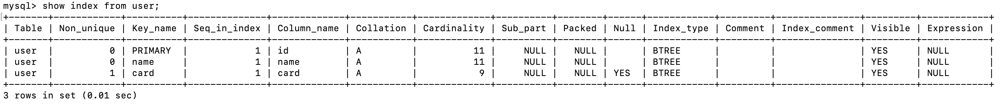

# MySQL常用命令笔记

### 1.查看当前事务自动提交模式

在 MySQL 中，可以通过  `SHOW VARIABLES` 语句查看当前事务自动提交模式，如下所示：

``` bash
mysql> show variables like 'autocommit';
+---------------+-------+
| Variable_name | Value |
+---------------+-------+
| autocommit    |  ON   |
+---------------+-------+
1 row in set (0.00 sec)
```

结果显示，autocommit 的值是 ON，表示系统开启自动提交模式。

在 MySQL 中，可以使用 `SET autocommit` 语句设置事务的自动提交模式，语法格式如下：

``` shell
SET autocommit = 0|1|ON|OFF;
```

对取值的说明：

- 值为 0 和值为 OFF：关闭事务自动提交。如果关闭自动提交，用户将会一直处于某个事务中，只有提交或回滚后才会结束当前事务，重新开始一个新事务。
- 值为 1 和值为 ON：开启事务自动提交。如果开启自动提交，则每执行一条 SQL 语句，事务都会提交一次。

### 2.共享锁

命令：

``` shell
select * from <table> [where condition] lock in share mode;
```

示例：

``` bash
mysql> begin;
Query OK, 0 rows affected (0.00 sec)

mysql> select * from user where id = 1 lock in share mode;
+----+--------+
| id | name   |
+----+--------+
|  1 | 陈大   |
+----+--------+
1 row in set (0.00 sec)

mysql> commit;
Query OK, 0 rows affected (0.01 sec)
```

### 3.排它锁

命令：

``` shell
select * from <table> [where condition] for update;
```

示例：

``` bash
mysql> begin;
Query OK, 0 rows affected (0.00 sec)

mysql> select * from user where id = 1 for update;
+----+--------+
| id | name   |
+----+--------+
|  1 | 陈一   |
+----+--------+
1 row in set (0.01 sec)

mysql> commit;
Query OK, 0 rows affected (0.00 sec)
```

### 4.事务隔离级别

| 隔离级别 |     英文名称     |
| :------: | :--------------: |
| 读未提交 | READ UNCOMMITTED |
| 读已提交 |  READ COMMITTED  |
| 可重复读 | REPEATABLE READ  |
|  序列化  |   SERIALIZABLE   |

**1.查看系统事务隔离级别**

命令：

``` shell
select @@global.transaction_isolation;
```

示例：

``` bash
mysql> select @@global.transaction_isolation;
+--------------------------------+
| @@global.transaction_isolation |
+--------------------------------+
| REPEATABLE-READ                |
+--------------------------------+
1 row in set (0.00 sec)
```

**2.查看会话事务隔离级别**

命令：

``` shell
select @@transaction_isolation;
```

示例：

``` bash
mysql> select @@transaction_isolation;
+-------------------------+
| @@transaction_isolation |
+-------------------------+
| REPEATABLE-READ         |
+-------------------------+
1 row in set (0.00 sec)
```

**3.修改事务隔离级别**

MySQL 提供了 `SET TRANSACTION` 语句，该语句可以改变单个会话或全局的事务隔离级别。语法格式如下：

``` shell
SET [SESSION | GLOBAL] TRANSACTION ISOLATION LEVEL {READ UNCOMMITTED | READ COMMITTED | REPEATABLE READ | SERIALIZABLE}
```

其中，SESSION 和 GLOBAL 关键字用来指定修改的事务隔离级别的范围：

- SESSION：表示修改的事务隔离级别将应用于当前 session（当前 cmd 窗口）内的所有事务；
- GLOBAL：表示修改的事务隔离级别将应用于所有 session（全局）中的所有事务，且当前已经存在的 session 不受影响；
- 如果省略 SESSION 和 GLOBAL，表示修改的事务隔离级别将应用于当前 session 内的下一个还未开始的事务。


任何用户都能改变会话的事务隔离级别，但是只有拥有 SUPER 权限的用户才能改变全局的事务隔离级别。

示例：

``` bash
mysql> set session transaction isolation level read committed;
Query OK, 0 rows affected (0.01 sec)

mysql> select @@transaction_isolation;
+-------------------------+
| @@transaction_isolation |
+-------------------------+
| READ-COMMITTED          |
+-------------------------+
1 row in set (0.00 sec)
```

### 5.索引

> 1. 主键索引 `PRIMARY KEY`：它是一种特殊的唯一索引，不允许有空值。一般是在建表的时候同时创建主键索引，并且一个表只能有一个主键。
> 2. 唯一索引 `UNIQUE`：唯一索引列的值必须唯一，但允许有空值。如果是组合索引，则列值的组合必须唯一。
> 3. 普通索引 `INDEX`：这是最基本的索引，它没有任何限制，一个由多个列组成的普通索引称之为组合索引，多用于避免回表查询。
> 4. 全文索引 `FULLTEXT`：也称全文检索，是目前搜索引擎使用的一种关键技术。

**1.添加索引**

``` shell
# 添加主键索引
alter table <表名> add primary key(<列名>);

# 添加唯一索引
alter table <表名> add unique(<列名>);

# 添加普通索引
alter table <表名> add index [索引名] (<列名>);

# 添加全文索引
alter table <表名> add fulltext(<列名>);

# 添加多列索引
alter table <表名> add index [索引名] (<列名1,列名2,列名3,...>);
```

**2.删除索引**

``` shell
# 使用 DROP INDEX 语句
DROP INDEX <索引名> ON <表名>

# 使用 ALTER TABLE 语句
# 1.表示删除表中的主键。一个表只有一个主键，主键也是一个索引
ALTER TABLE <表名> DROP PRIMARY KEY;

# 2.表示删除名称为 index_name 的索引
ALTER TABLE <表名> DROP INDEX <索引名>;

# 3.表示删除外键
ALTER TABLE <表名> DROP FOREIGN KEY <索引名>;
```

### 6.字段

**1.在末尾添加字段**

一个完整的字段包括字段名、数据类型和约束条件。MySQL 添加字段的语法格式如下：

``` shell
ALTER TABLE <表名> ADD <新字段名> <数据类型> [约束条件];
```

对语法格式的说明如下：                    

- <表名> 为数据表的名字；
- <新字段名> 为所要添加的字段的名字；
- <数据类型> 为所要添加的字段能存储数据的数据类型；
- [约束条件] 是可选的，用来对添加的字段进行约束。

**2.在开头添加字段**

MySQL 默认在表的最后位置添加新字段，如果希望在开头位置（第一列的前面）添加新字段，那么可以使用 FIRST 关键字，语法格式如下：

``` shell
ALTER TABLE <表名> ADD <新字段名> <数据类型> [约束条件] FIRST;
```

FIRST 关键字一般放在语句的末尾。

**3.在中间位置添加字段**

MySQL 除了允许在表的开头位置和末尾位置添加字段外，还允许在中间位置（指定的字段之后）添加字段，此时需要使用 AFTER 关键字，语法格式如下：

``` shell
ALTER TABLE <表名> ADD <新字段名> <数据类型> [约束条件] AFTER <已经存在的字段名>;
```

AFTER 的作用是将新字段添加到某个已有字段后面。

**4.删除字段**

在 MySQL 中，可以利用 `ALTER TABLE` 语句和 `DROP` 关键字来去除指定字段。

- `ALTER TABLE` 语句来改变原有表的结构，例如增加或删减列、更改原有列类型、重新命名列或表等。
- `DROP ` 语句将删除表的结构，以及被依赖的约束(constrain)、触发器(trigger)、索引(index)；

去除字段是将数据表中的某个字段从表中移除，语法格式如下：

```shell
ALTER TABLE <数据表名> DROP <字段名>;
```

其中，<字段名>指需要从表中删除的字段的名称。

### 7.查看MySQL信息

**1.查看表信息**

命令：

``` shell
describe <数据表名>;
```

示例：

``` bash
mysql> describe user;
+-------+--------------+------+-----+---------+-------+
| Field | Type         | Null | Key | Default | Extra |
+-------+--------------+------+-----+---------+-------+
| id    | int          | NO   | PRI | NULL    |       |
| name  | varchar(128) | NO   | UNI | NULL    |       |
| card  | varchar(64)  | YES  | MUL | NULL    |       |
| age   | int          | YES  |     | NULL    |       |
+-------+--------------+------+-----+---------+-------+
4 rows in set (0.01 sec)
```

**2.查看索引类型**

命令：

``` shell
show index from <数据表名>;
```

示例：



**3.查看索引使用情况**

命令：

``` shell
SHOW STATUS LIKE 'Handler_read%';
```

示例：

``` bash
mysql> SHOW STATUS LIKE 'Handler_read%';
+-----------------------+-------+
| Variable_name         | Value |
+-----------------------+-------+
| Handler_read_first    | 5     |
| Handler_read_key      | 145   |
| Handler_read_last     | 0     |
| Handler_read_next     | 207   |
| Handler_read_prev     | 0     |
| Handler_read_rnd      | 7     |
| Handler_read_rnd_next | 16    |
+-----------------------+-------+
7 rows in set (0.01 sec)
```

> **Handler_read_key**：如果索引正在工作，Handler_read_key 的值将很高。
> **Handler_read_rnd_next**：数据文件中读取下一行的请求数，如果正在进行大量的表扫描，值将较高，则说明索引利用不理想。

**4.查询当前正在执行中的事务**

命令：

``` shell
SELECT * FROM information_schema.INNODB_TRX;
```

### 8.事务

**1.开启事务**

``` shell
begin | start transaction;
```

`begin/start transaction` 命令并不是一个事务的起点，在执行到它们之后的第一个操作 InnoDB 表的语句，事务才真正启动。如果你想要马上启动一个事务，可以使用命令：

``` shell
start transaction with consistent snapshot;
```

**2.提交事务**

``` shell
commit;
```

**3.回滚事务**

``` shell
rollback;
```

### 9.优化器追踪

会话级别开启优化器追踪：

``` bash
mysql> set session optimizer_trace = 'enabled=on';
Query OK, 0 rows affected (0.00 sec)
```

执行语句：

``` bash
mysql> select id from user_01 where phone like '%156%';
```

查看优化器追踪：

``` bash
mysql> select * from information_schema.optimizer_trace;
```

优化器追踪结果：

``` json
{
  "steps": [
    {
      "join_preparation": {
        "select#": 1,
        "steps": [
          {
            "expanded_query": "/* select#1 */ select `user_01`.`id` AS `id` from `user_01` where (`user_01`.`phone` like '%156%')"
          }
        ]
      }
    },
    {
      "join_optimization": {
        "select#": 1,
        "steps": [
          {
            "condition_processing": {
              "condition": "WHERE",
              "original_condition": "(`user_01`.`phone` like '%156%')",
              "steps": [
                {
                  "transformation": "equality_propagation",
                  "resulting_condition": "(`user_01`.`phone` like '%156%')"
                },
                {
                  "transformation": "constant_propagation",
                  "resulting_condition": "(`user_01`.`phone` like '%156%')"
                },
                {
                  "transformation": "trivial_condition_removal",
                  "resulting_condition": "(`user_01`.`phone` like '%156%')"
                }
              ]
            }
          },
          {
            "substitute_generated_columns": {
            }
          },
          {
            "table_dependencies": [
              {
                "table": "`user_01`",
                "row_may_be_null": false,
                "map_bit": 0,
                "depends_on_map_bits": [
                ]
              }
            ]
          },
          {
            "ref_optimizer_key_uses": [
            ]
          },
          {
            "rows_estimation": [
              {
                "table": "`user_01`",
                "range_analysis": {
                  "table_scan": {
                    "rows": 100082,
                    "cost": 10098.6
                  },
                  "potential_range_indexes": [
                    {
                      "index": "PRIMARY",
                      "usable": false,
                      "cause": "not_applicable"
                    },
                    {
                      "index": "index_phone",
                      "usable": true,
                      "key_parts": [
                        "phone",
                        "id"
                      ]
                    }
                  ],
                  "best_covering_index_scan": {
                    "index": "index_phone",
                    "cost": 10130.5,
                    "chosen": false,
                    "cause": "cost"
                  },
                  "setup_range_conditions": [
                  ],
                  "group_index_range": {
                    "chosen": false,
                    "cause": "not_group_by_or_distinct"
                  },
                  "skip_scan_range": {
                    "chosen": false,
                    "cause": "disjuntive_predicate_present"
                  }
                }
              }
            ]
          },
          {
            "considered_execution_plans": [
              {
                "plan_prefix": [
                ],
                "table": "`user_01`",
                "best_access_path": {
                  "considered_access_paths": [
                    {
                      "rows_to_scan": 100082,
                      "access_type": "scan",
                      "resulting_rows": 100082,
                      "cost": 10096.5,
                      "chosen": true
                    }
                  ]
                },
                "condition_filtering_pct": 100,
                "rows_for_plan": 100082,
                "cost_for_plan": 10096.5,
                "chosen": true
              }
            ]
          },
          {
            "attaching_conditions_to_tables": {
              "original_condition": "(`user_01`.`phone` like '%156%')",
              "attached_conditions_computation": [
              ],
              "attached_conditions_summary": [
                {
                  "table": "`user_01`",
                  "attached": "(`user_01`.`phone` like '%156%')"
                }
              ]
            }
          },
          {
            "finalizing_table_conditions": [
              {
                "table": "`user_01`",
                "original_table_condition": "(`user_01`.`phone` like '%156%')",
                "final_table_condition   ": "(`user_01`.`phone` like '%156%')"
              }
            ]
          },
          {
            "refine_plan": [
              {
                "table": "`user_01`"
              }
            ]
          }
        ]
      }
    },
    {
      "join_execution": {
        "select#": 1,
        "steps": [
        ]
      }
    }
  ]
}
```


