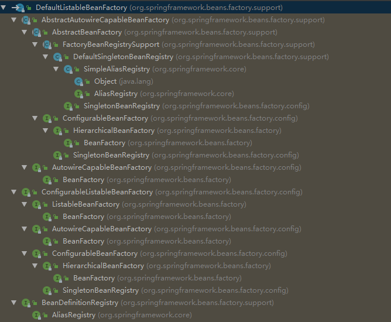
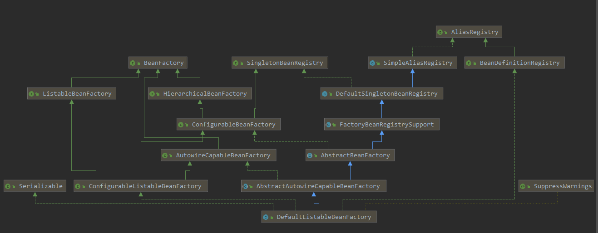
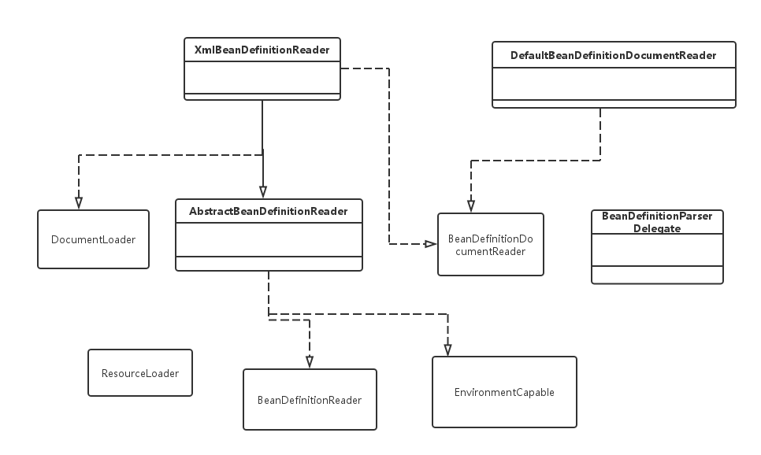
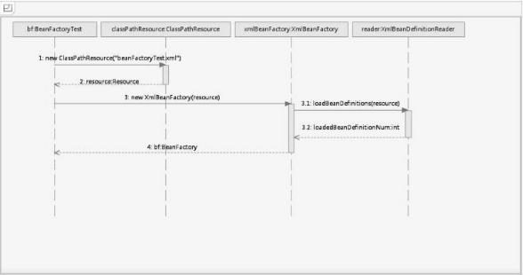
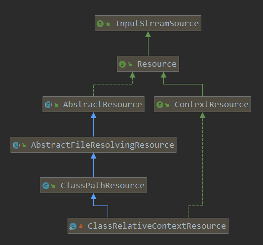
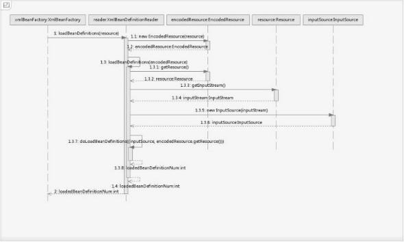

>Spring中有两个核心的类：DefaultListableBeanFactory和XmlBeanDefinitionReader。

## 1.DefaultListableBeanFactory

XmlBeanFactory继承自DefaultListableBeanFactory，而DefaultListableBeanFactory是整个bean加载的核心部分，是Spring注册及加载bean的默认实现，而对于XmlBeanFactory与DefaultListableBeanFactory不同的地方其实是在XmlBeanFactory中使用了自定义的XML读取器XmlBeanDefinitionReader，实现了个性化的BeanDefinitionReader读取，DefaultListableBeanFactory继承了AbstractAutowireCapableBeanFactory并实现了ConfigurableListableBeanFactory以及BeanDefinitionRegistry接口。

<center>
<div class="title-style">DefaultListableBeanFactory的层次结构</div></center>


<center>
<div class="title-style">容器加载相关类图</div></center>


从上面的类图以及层次结构图中，我们可以很清晰地从全局角度了解DefaultListableBeanFactory的脉络。让我们先简单地了解一下上面类图中的各个类的作用。

- AliasRegistry：定义对alias的简单增删改等操作。
- SimpleAliasRegistry：主要使用map作为alias的缓存，并对接口AliasRegistry进行实现。
- SingletonBeanRegistry：定义对单例的注册及获取。
- BeanFactory：定义获取bean及bean的各种属性。
- DefaultSingletonBeanRegistry：对接口SingletonBeanRegistry各函数的实现。
- HierarchicalBeanFactory：继承BeanFactory，也就是在BeanFactory定义的功能的基础上增加了对parentFactory的支持。
- BeanDefinitionRegistry：定义对BeanDefinition的各种增删改操作。
- FactoryBeanRegistrySupport：在DefaultSingletonBeanRegistry基础上增加了对FactoryBean的特殊处理功能。
- ConfigurableBeanFactory：提供配置Factory的各种方法。
- ListableBeanFactory：根据各种条件获取bean的配置清单。
- AbstractBeanFactory：综合FactoryBeanRegistrySupport和ConfigurableBeanFactory的功能。
- AutowireCapableBeanFactory：提供创建bean、自动注入、初始化以及应用bean的后处理器。
- AbstractAutowireCapableBeanFactory：综合AbstractBeanFactory并对接口AutowireCapableBeanFactory进行实现。
- ConfigurableListableBeanFactory：BeanFactory配置清单，指定忽略类型及接口等。
- DefaultListableBeanFactory：综合上面所有功能，主要是对Bean注册后的处理。

XmlBeanFactory对DefaultListableBeanFactory类进行了扩展，主要用于从XML文档中读取BeanDefinition，对于注册及获取Bean都是使用从父类DefaultListableBeanFactory继承的方法去实现，而唯独与父类不同的个性化实现就是增加了XmlBeanDefinitionReader类型的reader属性。在XmlBeanFactory中主要使用reader属性对资源文件进行读取和注册。

## 2.XmlBeanDefinitionReader

XML配置文件的读取是Spring中重要的功能，因为Spring的大部分功能都是以配置作为切入点的，那么我们可以从XmlBeanDefinitionReader中梳理一下资源文件读取、解析及注册的大致脉络，首先我们看看各个类的功能。

- ResourceLoader：定义资源加载器，主要应用于根据给定的资源文件地址返回对应的Resource。
- BeanDefinitionReader：主要定义资源文件读取并转换为BeanDefinition的各个功能。
- EnvironmentCapable：定义获取Environment方法。
- DocumentLoader：定义从资源文件加载到转换为Document的功能。
- AbstractBeanDefinitionReader：对EnvironmentCapable、BeanDefinitionReader类定义的功能进行实现。
- BeanDefinitionDocumentReader：定义读取Docuemnt并注册BeanDefinition功能。
- BeanDefinitionParserDelegate：定义解析Element的各种方法。

经过以上分析，我们可以梳理出整个XML配置文件读取的大致流程，如下图所示，在XmlBeanDifinitionReader中主要包含以下几步的处理。

<center>
<div class="title-style">配置文件读取相关类图</div></center>


1.  通过继承自AbstractBeanDefinitionReader中的方法，来使用ResourLoader将资源文件路径转换为对应的Resource文件。
2. 通过DocumentLoader对Resource文件进行转换，将Resource文件转换为Document文件。
3. 通过实现接口BeanDefinitionDocumentReader的DefaultBeanDefinitionDocumentReader类对Document进行解析，并使用BeanDefinitionParserDelegate对Element进行解析。

## 3.XmlBeanFactory

深入分析以下代码：
``` java
BeanFactory bf = new XmlBeanFactory(new ClassPathResource("spring-study-bean-factory.xml"));
```
<center>
<div class="title-style">XmlBeanFactory初始化时序图</div></center>


### 3.1 配置文件的封装

Spring的配置文件读取是通过ClassPathResource进行封装的，如new ClassPathResource("spring-study-bean-factory.xml")。

在Java中，将不同来源的资源抽象成URL，通过注册不同的handler（URLStreamHandler）来处理不同来源的资源的读取逻辑，一般handler的类型使用不同前缀（协议，Protocol）来识别，如“file:”、“http:”、“jar:”等，然而URL没有默认定义相对Classpath或ServletContext等资源的handler，虽然可以注册自己的URLStreamHandler来解析特定的URL前缀（协议），比如“classpath:”，然而这需要了解URL的实现机制，而且URL也没有提供一些基本的方法，如检查当前资源是否存在、检查当前资源是否可读等方法。因而Spring对其内部使用到的资源实现了自己的抽象结构：Resource接口来封装底层资源。

InputStreamSource封装任何能返回InputStream的类，比如File、Classpath下的资源和ByteArray等。它只有一个方法定义：getInputStream()，该方法返回一个新的InputStream对象。
``` java
public interface InputStreamSource {

	/**
	 * 返回InputStream对象
	 */
	InputStream getInputStream() throws IOException;
}
```

Resource接口抽象了所有Spring内部使用到的底层资源：File、URL、Classpath等。首先，它定义了3个判断当前资源状态的方法：存在性（exists）、可读性（isReadable）、是否处于打开状态（isOpen）。另外，Resource接口还提供了不同资源到URL、URI、File类型的转换，以及获取lastModified属性、文件名（不带路径信息的文件名，getFilename()）的方法。为了便于操作，Resource还提供了基于当前资源创建一个相对资源的方法：createRelative()。在错误处理中需要详细地打印出错的资源文件，因而Resource还提供了getDescription()方法用于在错误处理中的打印信息。
``` java
public interface Resource extends InputStreamSource {

	/**
	 * 资源是否存在
	 */
	boolean exists();

	/**
	 * 资源是否可读
	 */
	default boolean isReadable() {
		return exists();
	}

	/**
	 * 资源是否处于打开状态
	 */
	default boolean isOpen() {
		return false;
	}

	/**
	 * 资源是否为文件
	 */
	default boolean isFile() {
		return false;
	}

	/**
	 * 将资源转换为URL
	 */
	URL getURL() throws IOException;

	/**
	 * 将资源转换为URI
	 */
	URI getURI() throws IOException;

	/**
	 * 将资源转换为文件
	 */
	File getFile() throws IOException;

	/**
	 * 获取资源的内容长度
	 */
	long contentLength() throws IOException;

	/**
	 * 获取资源的最后修改时间
	 */
	long lastModified() throws IOException;

	/**
	 * 基于当前资源创建一个相对资源
	 */
	Resource createRelative(String relativePath) throws IOException;

	/**
	 * 获取资源的文件名
	 */
	@Nullable
	String getFilename();

	/**
	 * 获取资源的描述信息
	 */
	String getDescription();

}
```

对不同来源的资源文件都有相应的Resource实现：文件（FileSystemResource）、Classpath资源（ClassPathResource）、URL资源（UrlResource）、InputStream资源（InputStreamResource）、Byte数组（ByteArrayResource）等。相关类图如下：
<center>
<div class="title-style">资源文件处理相关类图</div></center>


当通过Resource相关类完成了对配置文件进行封装后配置文件的读取工作就全权交给XmlBeanDefinitionReader来处理了。

了解了Spring中将配置文件封装为Resource类型的实例方法后，我们就可以继续探寻XmlBeanFactory的初始化过程了，XmlBeanFactory的初始化有若干办法，Spring中提供了很多的构造函数，在这里分析的是使用Resource实例作为构造函数参数的办法，代码如下：
``` java
public class XmlBeanFactory extends DefaultListableBeanFactory {

	private final XmlBeanDefinitionReader reader = new XmlBeanDefinitionReader(this);


	/**
	 * 构造函数
	 * @param resource the XML resource to load bean definitions from
	 */
	public XmlBeanFactory(Resource resource) throws BeansException {
		this(resource, null);
	}

	/**
	 * 带BeanFactory的构造函数
	 * @param resource the XML resource to load bean definitions from
	 * @param parentBeanFactory 为父类BeanFactory用于factory合并，可以为空
	 */
	public XmlBeanFactory(Resource resource, BeanFactory parentBeanFactory) throws BeansException {
		super(parentBeanFactory);
		this.reader.loadBeanDefinitions(resource);
	}
}
```

上面函数中的代码this.reader.loadBeanDefinitions(resource)才是资源加载的真正实现，也是我们分析的重点之一。我们可以看到时序图中提到的XmlBeanDefinitionReader加载数据就是在这里完成的，但是在XmlBeanDefinitionReader加载数据前还有一个调用父类构造函数初始化的过程：super(parentBeanFactory)，跟踪代码到父类AbstractAutowireCapableBeanFactory的构造函数中：
``` java
/**
 * Create a new AbstractAutowireCapableBeanFactory.
 */
public AbstractAutowireCapableBeanFactory() {
    super();
    ignoreDependencyInterface(BeanNameAware.class);
    ignoreDependencyInterface(BeanFactoryAware.class);
    ignoreDependencyInterface(BeanClassLoaderAware.class);
}
```

ignoreDependencyInterface的主要功能是忽略给定接口的自动装配功能，Spring中是这样介绍的：自动装配时忽略给定的依赖接口，典型应用是通过其他方式解析Application上下文注册依赖，类似于BeanFactory通过BeanFactoryAware进行注入或者ApplicationContext通过ApplicationContextAware进行注入。

### 3.2 加载Bean

之前提到的在XmlBeanFactory构造函数中调用了XmlBeanDefinitionReader类型的reader属性提供的方法this.reader.loadBeanDefinitions(resource)，而这句代码则是整个资源加载的切入点，我们先来看看这个方法的时序图，如下图所示：
<center>
<div class="title-style">loadBeanDefinitions函数执行时序图</div></center>


从上面的时序图中我们尝试梳理整个的处理过程如下：
1. 封装资源文件。当进入XmlBeanDefinitionReader后首先对参数Resource使用EncodedResource类进行封装。
2. 获取输入流。从Resource中获取对应的InputStream并构造InputSource。
3. 通过构造的InputSource实例和Resource实例继续调用函数doLoadBeanDefinitions。

我们来看一下loadBeanDefinitions函数具体的实现过程：
``` java
public int loadBeanDefinitions(Resourceresource) throws BeanDefinitionStoreException {
	return loadBeanDefinitions(new EncodedResource(resource));
}
```

通过名称，我们可以大致推断这个类主要是用于对资源文件的编码进行处理的。其中的主要逻辑体现在getReader()方法中，当设置了编码属性的时候Spring会使用相应的编码作为输入流的编码。
``` java
/**
 * 返回带字符编码的Reader类
 */
public Reader getReader() throws IOException {
    if (this.charset != null) {
        return new InputStreamReader(this.resource.getInputStream(), this.charset);
    }
    else if (this.encoding != null) {
        return new InputStreamReader(this.resource.getInputStream(), this.encoding);
    }
    else {
        return new InputStreamReader(this.resource.getInputStream());
    }
}
```

上面代码构造了一个有编码（encoding）的InputStreamReader。当构造好encodedResource对象后，再次转入了可复用方法loadBeanDefinitions(newEncodedResource(resource))。代码如下：
``` java
/**
 * 数据准备阶段方法
 */
public int loadBeanDefinitions(EncodedResource encodedResource) throws BeanDefinitionStoreException {
    Assert.notNull(encodedResource, "EncodedResource must not be null");
    if (logger.isTraceEnabled()) {
        logger.trace("Loading XML bean definitions from " + encodedResource);
    }

    // 通过属性来记录已经加载的资源
    Set<EncodedResource> currentResources = this.resourcesCurrentlyBeingLoaded.get();
    if (currentResources == null) {
        currentResources = new HashSet<>(4);
        this.resourcesCurrentlyBeingLoaded.set(currentResources);
    }
    if (!currentResources.add(encodedResource)) {
        throw new BeanDefinitionStoreException(
                "Detected cyclic loading of " + encodedResource + " - check your import definitions!");
    }
    try {
        // 从encodedResource中获取已经封装的Resource对象
        // 并再次从Resource中获取其中的inputStream对象
        InputStream inputStream = encodedResource.getResource().getInputStream();
        try {
            // InputSource不来自Spring，通过SAX读取XML文件的方式来准备InputSource对象
            InputSource inputSource = new InputSource(inputStream);
            if (encodedResource.getEncoding() != null) {
                inputSource.setEncoding(encodedResource.getEncoding());
            }
            
            // 进入核心逻辑
            return doLoadBeanDefinitions(inputSource, encodedResource.getResource());
        }
        finally {
            inputStream.close();
        }
    }
    catch (IOException ex) {
        throw new BeanDefinitionStoreException(
                "IOException parsing XML document from " + encodedResource.getResource(), ex);
    }
    finally {
        currentResources.remove(encodedResource);
        if (currentResources.isEmpty()) {
            this.resourcesCurrentlyBeingLoaded.remove();
        }
    }
}
```

我们再次整理一下数据准备阶段的逻辑，首先对传入的resource参数做封装，目的是考虑到Resource可能存在编码要求的情况，其次，通过SAX读取XML文件的方式来准备InputSource对象，最后将准备的数据通过参数传入真正的核心处理部分doLoadBeanDefinitions(inputSource,encodedResource.getResource())。代码如下：
``` java
/**
 * 实际从xml文件中加载BeanDefinition的核心逻辑
 */
protected int doLoadBeanDefinitions(InputSource inputSource, Resource resource)
        throws BeanDefinitionStoreException {

    try {
        Document doc = doLoadDocument(inputSource, resource);
        int count = registerBeanDefinitions(doc, resource);
        if (logger.isDebugEnabled()) {
            logger.debug("Loaded " + count + " bean definitions from " + resource);
        }
        return count;
    }
    catch (BeanDefinitionStoreException ex) {
        throw ex;
    }
    catch (SAXParseException ex) {
        throw new XmlBeanDefinitionStoreException(resource.getDescription(),
                "Line " + ex.getLineNumber() + " in XML document from " + resource + " is invalid", ex);
    }
    catch (SAXException ex) {
        throw new XmlBeanDefinitionStoreException(resource.getDescription(),
                "XML document from " + resource + " is invalid", ex);
    }
    catch (ParserConfigurationException ex) {
        throw new BeanDefinitionStoreException(resource.getDescription(),
                "Parser configuration exception parsing XML from " + resource, ex);
    }
    catch (IOException ex) {
        throw new BeanDefinitionStoreException(resource.getDescription(),
                "IOException parsing XML document from " + resource, ex);
    }
    catch (Throwable ex) {
        throw new BeanDefinitionStoreException(resource.getDescription(),
                "Unexpected exception parsing XML document from " + resource, ex);
    }
}

/**
 * 实际加载xml并转换为Document的逻辑
 */
protected Document doLoadDocument(InputSource inputSource, Resource resource) throws Exception {
    return this.documentLoader.loadDocument(inputSource, getEntityResolver(), this.errorHandler,
            getValidationModeForResource(resource), isNamespaceAware());
}
```

在上面冗长的代码中假如不考虑异常类的代码，其实只做了三件事，这三件事的每一件都必不可少。
1. 获取对XML文件的验证模式。
2. 加载XML文件，并得到对应的Document。
3. 根据返回的Document注册Bean信息。

<style>
.img-style {
    border-radius: 0.3125em;
    box-shadow: 0 2px 4px 0 rgba(34,36,38,.12),0 2px 10px 0 rgba(34,36,38,.08);
    margin-top: 10px;
}

.title-style {
    color: #999;
    border-bottom: 1px solid #d9d9d9;
    display: inline-block;
}
</style>