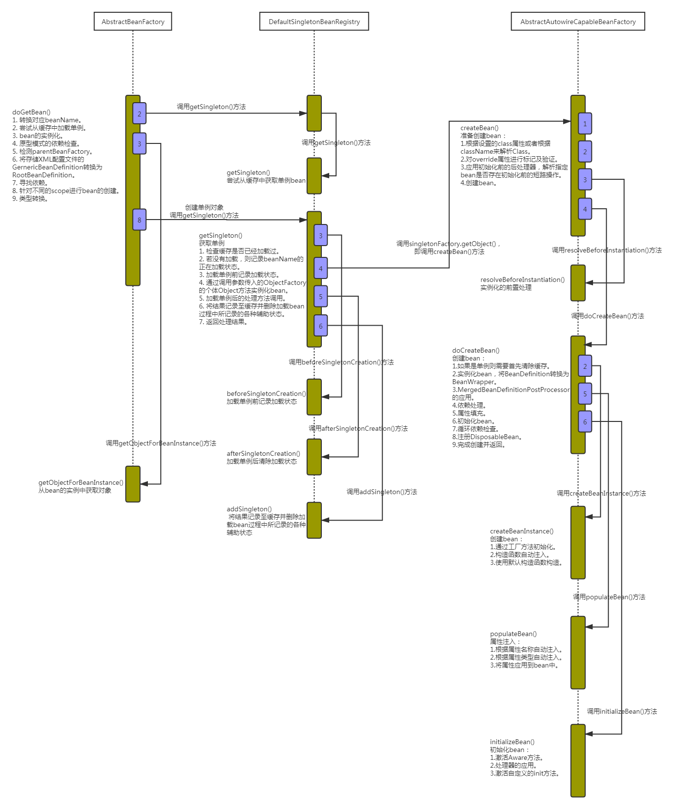
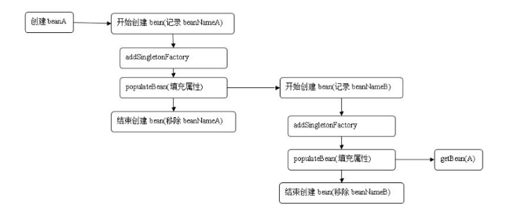

> bean加载是一个非常复杂的过程，今天我们就来揭开它神秘的面纱。

<center>
<div class="title-style">bean加载的时序图</div></center>


## Bean加载入口方法

接下来开始对bean的加载进行探索，从下面的代码开始：
``` java
public Object getBean(String name) throws BeansException {
    return doGetBean(name, null, null, false);
}

/**
 * bean加载具体逻辑
 */
protected <T> T doGetBean(final String name, @Nullable final Class<T> requiredType,
			@Nullable final Object[] args, boolean typeCheckOnly) throws BeansException {
    // 提取对应的beanName
    final String beanName = transformedBeanName(name);
    Object bean;

    // Eagerly check singleton cache for manually registered singletons.
    /*
     * 检查缓存中或者实例工厂中是否有对应的实例
     * 在创建单例bean的时候会存在依赖注入的情况，而在创建依赖的时候为了避免循环依赖
     * Spring创建bean的原则是不等bean创建完成就会将创建bean的ObjectFactory提早曝光
     * 也就是将ObjectFactory加入到缓存中，一旦下个bean创建时候需要依赖上个bean则直接使用ObjectFactory
     */
    // 直接尝试从缓存获取或者singletonFactories中的ObjectFactory中获取
    Object sharedInstance = getSingleton(beanName);
    if (sharedInstance != null && args == null) {
        if (logger.isTraceEnabled()) {
            if (isSingletonCurrentlyInCreation(beanName)) {
                logger.trace("Returning eagerly cached instance of singleton bean '" + beanName +
                        "' that is not fully initialized yet - a consequence of a circular reference");
            }
            else {
                logger.trace("Returning cached instance of singleton bean '" + beanName + "'");
            }
        }
        
        // 返回对应的实例，有时候存在诸如BeanFactory的情况并不是直接返回实例本身而是返回指定方法返回的实例
        bean = getObjectForBeanInstance(sharedInstance, name, beanName, null);
    }

    else {
        // Fail if we're already creating this bean instance:
        // We're assumably within a circular reference.
        // 只有在单例情况才会尝试解决循环依赖，原型模式情况下，如果存在　　
        // A中有B的属性，B中有A的属性，那么当依赖注入的时候，就会产生当A还未创建完的时候因为　　
        // 对于B的创建再次返回创建A，造成循环依赖，也就是下面的情况　　
        // isPrototypeCurrentlyInCreation(beanName)为true
        if (isPrototypeCurrentlyInCreation(beanName)) {
            throw new BeanCurrentlyInCreationException(beanName);
        }

        // Check if bean definition exists in this factory.
        // 如果beanDefinitionMap中也就是在所有已经加载的类中不包括beanName则尝试从parentBeanFactory中检测
        BeanFactory parentBeanFactory = getParentBeanFactory();
        if (parentBeanFactory != null && !containsBeanDefinition(beanName)) {
            // Not found -> check parent.
            String nameToLookup = originalBeanName(name);
            if (parentBeanFactory instanceof AbstractBeanFactory) {
                return ((AbstractBeanFactory) parentBeanFactory).doGetBean(
                        nameToLookup, requiredType, args, typeCheckOnly);
            }
            else if (args != null) {
                // Delegation to parent with explicit args.
                return (T) parentBeanFactory.getBean(nameToLookup, args);
            }
            else if (requiredType != null) {
                // No args -> delegate to standard getBean method.
                return parentBeanFactory.getBean(nameToLookup, requiredType);
            }
            else {
                return (T) parentBeanFactory.getBean(nameToLookup);
            }
        }

        // 如果不是仅仅做类型检查则是创建bean，这里要进行记录
        if (!typeCheckOnly) {
            markBeanAsCreated(beanName);
        }

        try {
            // 将存储XML配置文件的GernericBeanDefinition转换为RootBeanDefinition
            // 如果指定BeanName是子Bean的话同时会合并父类的相关属性
            final RootBeanDefinition mbd = getMergedLocalBeanDefinition(beanName);
            checkMergedBeanDefinition(mbd, beanName, args);

            // Guarantee initialization of beans that the current bean depends on.
            // 若存在依赖则需要递归实例化依赖的bean
            String[] dependsOn = mbd.getDependsOn();
            if (dependsOn != null) {
                for (String dep : dependsOn) {
                    if (isDependent(beanName, dep)) {
                        throw new BeanCreationException(mbd.getResourceDescription(), beanName,
                                "Circular depends-on relationship between '" + beanName + "' and '" + dep + "'");
                    }
                    registerDependentBean(dep, beanName);
                    try {
                        getBean(dep);
                    }
                    catch (NoSuchBeanDefinitionException ex) {
                        throw new BeanCreationException(mbd.getResourceDescription(), beanName,
                                "'" + beanName + "' depends on missing bean '" + dep + "'", ex);
                    }
                }
            }

            // Create bean instance.
            // singleton（单例）模式bean的创建
            if (mbd.isSingleton()) {
                sharedInstance = getSingleton(beanName, () -> {
                    try {
                        return createBean(beanName, mbd, args);
                    }
                    catch (BeansException ex) {
                        // Explicitly remove instance from singleton cache: It might have been put there
                        // eagerly by the creation process, to allow for circular reference resolution.
                        // Also remove any beans that received a temporary reference to the bean.
                        destroySingleton(beanName);
                        throw ex;
                    }
                });
                bean = getObjectForBeanInstance(sharedInstance, name, beanName, mbd);
            }

            else if (mbd.isPrototype()) {
                // It's a prototype -> create a new instance.
                // prototype（原型）模式bean的创建
                Object prototypeInstance = null;
                try {
                    beforePrototypeCreation(beanName);
                    prototypeInstance = createBean(beanName, mbd, args);
                }
                finally {
                    afterPrototypeCreation(beanName);
                }
                bean = getObjectForBeanInstance(prototypeInstance, name, beanName, mbd);
            }

            else {
                // 指定scope上实例化bean
                String scopeName = mbd.getScope();
                final Scope scope = this.scopes.get(scopeName);
                if (scope == null) {
                    throw new IllegalStateException("No Scope registered for scope name '" + scopeName + "'");
                }
                try {
                    Object scopedInstance = scope.get(beanName, () -> {
                        beforePrototypeCreation(beanName);
                        try {
                            return createBean(beanName, mbd, args);
                        }
                        finally {
                            afterPrototypeCreation(beanName);
                        }
                    });
                    bean = getObjectForBeanInstance(scopedInstance, name, beanName, mbd);
                }
                catch (IllegalStateException ex) {
                    throw new BeanCreationException(beanName,
                            "Scope '" + scopeName + "' is not active for the current thread; consider " +
                            "defining a scoped proxy for this bean if you intend to refer to it from a singleton",
                            ex);
                }
            }
        }
        catch (BeansException ex) {
            cleanupAfterBeanCreationFailure(beanName);
            throw ex;
        }
    }

    // Check if required type matches the type of the actual bean instance.
    // 检查需要的类型是否符合bean的实际类型
    if (requiredType != null && !requiredType.isInstance(bean)) {
        try {
            T convertedBean = getTypeConverter().convertIfNecessary(bean, requiredType);
            if (convertedBean == null) {
                throw new BeanNotOfRequiredTypeException(name, requiredType, bean.getClass());
            }
            return convertedBean;
        }
        catch (TypeMismatchException ex) {
            if (logger.isTraceEnabled()) {
                logger.trace("Failed to convert bean '" + name + "' to required type '" +
                        ClassUtils.getQualifiedName(requiredType) + "'", ex);
            }
            throw new BeanNotOfRequiredTypeException(name, requiredType, bean.getClass());
        }
    }
    return (T) bean;
}
```

仅从代码量上就能看出来bean的加载经历了一个相当复杂的过程，其中涉及各种各样的考虑。相信读者细心阅读上面的代码，并参照部分代码注释，是可以粗略地了解整个Spring加载bean的过程。对于加载过程中所涉及的步骤大致如下：
1. 转换对应beanName。
   或许很多人不理解转换对应beanName是什么意思，传入的参数name不就是beanName吗？其实不是，这里传入的参数可能是别名，也可能是FactoryBean，所以需要进行一系列的解析，这些解析内容包括如下内容。
    - 去除FactoryBean的修饰符，也就是如果name="&aa"，那么会首先去除&而使name="aa"。
    - 取指定alias所表示的最终beanName，例如别名A指向名称为B的bean则返回B；若别名A指向别名B，别名B又指向名称为C的bean则返回C。
2. 尝试从缓存中加载单例。
单例在Spring的同一个容器内只会被创建一次，后续再获取bean，就直接从单例缓存中获取了。当然这里也只是尝试加载，首先尝试从缓存中加载，如果加载不成功则再次尝试从singletonFactories中加载。因为在创建单例bean的时候会存在依赖注入的情况，而在创建依赖的时候为了避免循环依赖，在Spring中创建bean的原则是不等bean创建完成就会将创建bean的ObjectFactory提早曝光加入到缓存中，一旦下一个bean创建时候需要依赖上一个bean则直接使用用ObjectFactory（后面章节会对循环依赖重点讲解）。
3. bean的实例化。
如果从缓存中得到了bean的原始状态，则需要对bean进行实例化。这里有必要强调一下，缓存中记录的只是最原始的bean状态，并不一定是我们最终想要的bean。举个例子，假如我们需要对工厂bean进行处理，那么这里得到的其实是工厂bean的初始状态，但是我们真正需要的是工厂bean中定义的factory-method方法中返回的bean，而getObjectForBeanInstance就是完成这个工作的，后续会详细讲解。
4. 原型模式的依赖检查。
只有在单例情况下才会尝试解决循环依赖，如果存在A中有B的属性，B中有A的属性，那么当依赖注入的时候，就会产生当A还未创建完的时候因为对于B的创建再次返回创建A，造成循环依赖，也就是情况：isPrototypeCurrentlyInCreation(beanName)判断true。
5. 检测parentBeanFactory。
从代码上看，如果缓存没有数据的话直接转到父类工厂上去加载了，这是为什么呢？可能读者忽略了一个很重要的判断条件：parentBeanFactory!=null&&!containsBeanDefinition(beanName)，parentBeanFactory!=null。parentBeanFactory如果为空，则其他一切都是浮云，这个没什么说的，但是!containsBeanDefinition(beanName)就比较重要了，它是在检测如果当前加载的XML配置文件中不包含beanName所对应的配置，就只能到parentBeanFactory去尝试下了，然后再去递归的调用getBean方法。
6. 将存储XML配置文件的GernericBeanDefinition转换为RootBeanDefinition。
因为从XML配置文件中读取到的Bean信息是存储在GernericBeanDefinition中的，但是所有的Bean后续处理都是针对于RootBeanDefinition的，所以这里需要进行一个转换，转换的同时如果父类bean不为空的话，则会一并合并父类的属性。
7. 寻找依赖。
因为bean的初始化过程中很可能会用到某些属性，而某些属性很可能是动态配置的，并且配置成依赖于其他的bean，那么这个时候就有必要先加载依赖的bean，所以，在Spring的加载顺寻中，在初始化某一个bean的时候首先会初始化这个bean所对应的依赖。
8. 针对不同的scope进行bean的创建。
我们都知道，在Spring中存在着不同的scope，其中默认的是singleton，但是还有些其他的配置诸如prototype、request之类的。在这个步骤中，Spring会根据不同的配置进行不同的初始化策略。
9. 类型转换。
程序到这里返回bean后已经基本结束了，通常对该方法的调用参数requiredType是为空的，但是可能会存在这样的情况，返回的bean其实是个String，但是requiredType却传入Integer类型，那么这时候本步骤就会起作用了，它的功能是将返回的bean转换为requiredType所指定的类型。当然，String转换为Integer是最简单的一种转换，在Spring中提供了各种各样的转换器，用户也可以自己扩展转换器来满足需求。

### 1.FactoryBean的使用

一般情况下，Spring通过反射机制利用bean的class属性指定实现类来实例化bean。在某些情况下，实例化bean过程比较复杂，如果按照传统的方式，则需要在<bean>中提供大量的配置信息，配置方式的灵活性是受限的，这时采用编码的方式可能会得到一个简单的方案。Spring为此提供了一个org.Springframework.bean.factory.FactoryBean的工厂类接口，用户可以通过实现该接口定制实例化bean的逻辑。
FactoryBean接口对于Spring框架来说占有重要的地位，Spring自身就提供了70多个FactoryBean的实现。它们隐藏了实例化一些复杂bean的细节，给上层应用带来了便利。从Spring3.0开始，FactoryBean开始支持泛型，即接口声明改为FactoryBean<T>的形式：
``` java
public interface FactoryBean<T> {

    /**
     * 返回由FactoryBean创建的bean实例
     * 如果isSingleton()返回true
     * 则该实例会放到Spring容器中单实例缓存池中
     */
    T getObject() throws Exception;
    
    /**
     * 返回FactoryBean创建的bean类型
     */
    Class<?> getObjectType();
    
    /**
     * 返回由FactoryBean创建的bean实例的作用域是singleton还是prototype
     */
    default boolean isSingleton() {
        return true;
    }
}
```

当配置文件中<bean>的class属性配置的实现类是FactoryBean时，通过getBean()方法返回的不是FactoryBean本身，而是FactoryBean#getObject()方法所返回的对象，相当于FactoryBean#getObject()代理了getBean()方法。例如：如果使用传统方式配置下面Car的<bean>时，Car的每个属性分别对应一个<property>元素标签。

### 2.缓存中获取单例bean

单例在Spring的同一个容器内只会被创建一次，后续再获取bean直接从单例缓存中获取，当然这里也只是尝试加载，首先尝试从缓存中加载，然后再次尝试从singletonFactories中加载。因为在创建单例bean的时候会存在依赖注入的情况，而在创建依赖的时候为了避免循环依赖，Spring创建bean的原则是不等bean创建完成就会将创建bean的ObjectFactory提早曝光加入到缓存中，一旦下一个bean创建时需要依赖上个bean，则直接使用ObjectFactory。

``` java
/**
 * 缓存中获取单例bean
 */
public Object getSingleton(String beanName) {
    // 参数true设置标识允许早起依赖
    return getSingleton(beanName, true);
}

/**
 * 缓存中获取单例bean
 */
protected Object getSingleton(String beanName, boolean allowEarlyReference) {
    // 检查缓存中是否存在实例
    Object singletonObject = this.singletonObjects.get(beanName);
    if (singletonObject == null && isSingletonCurrentlyInCreation(beanName)) {
        // 如果为空，则锁定全局变量并进行处理
        synchronized (this.singletonObjects) {
            // 如果此bean正在加载则不处理
            singletonObject = this.earlySingletonObjects.get(beanName);
            if (singletonObject == null && allowEarlyReference) {
                // 当某些方法需要提前初始化的时候
                // 则会调用addSingletonFactory方法
                // 将对应的ObjectFactory初始化策略存储在singletonFactory
                ObjectFactory<?> singletonFactory = this.singletonFactories.get(beanName);
                if (singletonFactory != null) {
                    // 调用预先设定的getObject方法
                    singletonObject = singletonFactory.getObject();
                    // 记录在缓存中，earlySingletonObjects和singletonFactories互斥
                    this.earlySingletonObjects.put(beanName, singletonObject);
                    this.singletonFactories.remove(beanName);
                }
            }
        }
    }
    return singletonObject;
}
```

这个方法因为涉及循环依赖的检测，以及涉及很多变量的记录存取，所以让很多读者摸不着头脑。这个方法首先尝试从singletonObjects里面获取实例，如果获取不到再从earlySingletonObjects里面获取，如果还获取不到，再尝试从singletonFactories里面获取beanName对应的ObjectFactory，然后调用这个ObjectFactory的getObject来创建bean，并放到earlySingletonObjects里面去，并且从singletonFacotories里面remove掉这个ObjectFactory，而对于后续的所有内存操作都只为了循环依赖检测时候使用，也就是在allowEarlyReference为true的情况下才会使用。这里涉及用于存储bean的不同的map，可能让读者感到崩溃，简单解释如下：
- singletonObjects：用于保存BeanName和创建bean实例之间的关系，beanname-->beaninstance，放在这里的bean表示其已经创建初始化完成。
- singletonFactories：用于保存BeanName和创建bean的工厂之间的关系，beanname-->ObjectFactory，放在这里的ObjectFactory表示其对应的bean刚开始创建。
- earlySingletonObjects：也是保存BeanName和创建bean实例之间的关系，与singletonObjects的不同之处在于，放在这里的bean表示其还在创建中，如果有其它bean依赖这个bean就可以通过getBean方法获取到了，其目的是用来检测循环引用。
- registeredSingletons：用来保存当前所有已注册的bean。

### 3.从bean的实例中获取对象

在getBean方法中，getObjectForBeanInstance是个高频率使用的方法，无论是从缓存中获得bean还是根据不同的scope策略加载bean。总之，我们得到bean的实例后要做的第一步就是调用这个方法来检测一下正确性，其实就是用于检测当前bean是否是FactoryBean类型的bean，如果是，那么需要调用该bean对应的FactoryBean实例中的getObject()作为返回值。
无论是从缓存中获取到的bean还是通过不同的scope策略加载的bean都只是最原始的bean状态，并不一定是我们最终想要的bean。举个例子，假如我们需要对工厂bean进行处理，那么这里得到的其实是工厂bean的初始状态，但是我们真正需要的是工厂bean中定义的factory-method方法中返回的bean，而getObjectForBeanInstance方法就是完成这个工作的。源代码如下：
``` java
/**
 * 从bean的实例中获取对象
 */
protected Object getObjectForBeanInstance(
        Object beanInstance, String name, String beanName, @Nullable RootBeanDefinition mbd) {

    // Don't let calling code try to dereference the factory if the bean isn't a factory.
    // 如果指定的name是工厂相关(以&为前缀)且beanInstance又不是FactoryBean类型则验证不通过
    if (BeanFactoryUtils.isFactoryDereference(name)) {
        if (beanInstance instanceof NullBean) {
            return beanInstance;
        }
        if (!(beanInstance instanceof FactoryBean)) {
            throw new BeanIsNotAFactoryException(transformedBeanName(name), beanInstance.getClass());
        }
    }

    // Now we have the bean instance, which may be a normal bean or a FactoryBean.
    // If it's a FactoryBean, we use it to create a bean instance, unless the
    // caller actually wants a reference to the factory.
    // 现在我们有了个bean的实例，这个实例可能会是正常的bean或者是FactoryBean
    // 如果是FactoryBean我们使用它创建实例
    // 但是如果用户想要直接获取工厂实例而不是工厂的getObject方法对应的实例
    // 那么传入的name应该加入前缀&
    if (!(beanInstance instanceof FactoryBean) || BeanFactoryUtils.isFactoryDereference(name)) {
        return beanInstance;
    }

    // 加载FactoryBean
    Object object = null;
    if (mbd == null) {
        // 尝试从缓存中加载bean
        object = getCachedObjectForFactoryBean(beanName);
    }
    if (object == null) {
        // Return bean instance from factory.
        // 到这里已经明确知道beanInstance一定是FactoryBean类型
        FactoryBean<?> factory = (FactoryBean<?>) beanInstance;
        // Caches object obtained from FactoryBean if it is a singleton.
        // containsBeanDefinition检测beanDefinitionMap中也就是在所有已经加载的类中
        // 检测是否定义beanName
        if (mbd == null && containsBeanDefinition(beanName)) {
            // 将存储XML配置文件的GernericBeanDefinition转换为RootBeanDefinition
            // 如果指定BeanName是子Bean的话同时会合并父类的相关属性
            mbd = getMergedLocalBeanDefinition(beanName);
        }
        // 是否是用户定义的而不是应用程序本身定义的
        boolean synthetic = (mbd != null && mbd.isSynthetic());
        object = getObjectFromFactoryBean(factory, beanName, !synthetic);
    }
    return object;
}
```

从上面的代码来看，其实这个方法并没有什么重要的信息，大多是些辅助代码以及一些功能性的判断，而真正的核心代码却委托给了getObjectFromFactoryBean，我们来看看getObjectForBeanInstance中的所做的工作。
1. 对FactoryBean正确性的验证。
2. 对非FactoryBean不做任何处理。
3. 对bean进行转换。
4. 将从Factory中解析bean的工作委托给getObjectFromFactoryBean。
``` java
/**
 * 从Factory中解析bean
 */
protected Object getObjectFromFactoryBean(FactoryBean<?> factory, String beanName, boolean shouldPostProcess) {
    if (factory.isSingleton() && containsSingleton(beanName)) {
        // 如果是单例模式就先从缓存中获取
        synchronized (getSingletonMutex()) {
            Object object = this.factoryBeanObjectCache.get(beanName);
            if (object == null) {
                object = doGetObjectFromFactoryBean(factory, beanName);
                // Only post-process and store if not put there already during getObject() call above
                // (e.g. because of circular reference processing triggered by custom getBean calls)
                Object alreadyThere = this.factoryBeanObjectCache.get(beanName);
                if (alreadyThere != null) {
                    object = alreadyThere;
                }
                else {
                    if (shouldPostProcess) {
                        if (isSingletonCurrentlyInCreation(beanName)) {
                            // Temporarily return non-post-processed object, not storing it yet..
                            return object;
                        }
                        // 加载单例前记录加载状态
                        beforeSingletonCreation(beanName);
                        try {
                            // 调用ObjectFactory的后处理器
                            object = postProcessObjectFromFactoryBean(object, beanName);
                        }
                        catch (Throwable ex) {
                            throw new BeanCreationException(beanName,
                                    "Post-processing of FactoryBean's singleton object failed", ex);
                        }
                        finally {
                            // 加载单例后清除加载状态
                            afterSingletonCreation(beanName);
                        }
                    }
                    if (containsSingleton(beanName)) {
                        this.factoryBeanObjectCache.put(beanName, object);
                    }
                }
            }
            return object;
        }
    }
    else {
        Object object = doGetObjectFromFactoryBean(factory, beanName);
        if (shouldPostProcess) {
            try {
                // 调用ObjectFactory的后处理器
                object = postProcessObjectFromFactoryBean(object, beanName);
            }
            catch (Throwable ex) {
                throw new BeanCreationException(beanName, "Post-processing of FactoryBean's object failed", ex);
            }
        }
        return object;
    }
}
```

在这个方法里只做了一件事情，就是返回的bean如果是单例的，那就必须要保证全局唯一，同时，也因为是单例的，所以不必重复创建，可以使用缓存来提高性能，也就是说已经加载过就要记录下来以便于下次复用，否则的话就直接获取了。
在doGetObjectFromFactoryBean方法中我们终于看到了我们想要看到的方法，也就是object=factory.getObject()，代码如下：
``` java
/**
 * 调用factory.getObject()获取bean
 */
private Object doGetObjectFromFactoryBean(final FactoryBean<?> factory, final String beanName)
			throws BeanCreationException {

    Object object;
    try {
        // 获取权限验证
        if (System.getSecurityManager() != null) {
            AccessControlContext acc = getAccessControlContext();
            try {
                object = AccessController.doPrivileged((PrivilegedExceptionAction<Object>) factory::getObject, acc);
            }
            catch (PrivilegedActionException pae) {
                throw pae.getException();
            }
        }
        else {
            // 直接调用factory.getObject()方法
            object = factory.getObject();
        }
    }
    catch (FactoryBeanNotInitializedException ex) {
        throw new BeanCurrentlyInCreationException(beanName, ex.toString());
    }
    catch (Throwable ex) {
        throw new BeanCreationException(beanName, "FactoryBean threw exception on object creation", ex);
    }

    // Do not accept a null value for a FactoryBean that's not fully
    // initialized yet: Many FactoryBeans just return null then.
    if (object == null) {
        if (isSingletonCurrentlyInCreation(beanName)) {
            throw new BeanCurrentlyInCreationException(
                    beanName, "FactoryBean which is currently in creation returned null from getObject");
        }
        object = new NullBean();
    }
    return object;
}
```

上面我们已经讲述了FactoryBean的调用方法，如果bean声明为FactoryBean类型，则当提取bean时提取的并不是FactoryBean，而是FactoryBean中对应的getObject方法返回的bean，而doGetObjectFromFactoryBean正是实现这个功能的。

### 4.获取单例

如果缓存中不存在已经加载的单例bean就需要从头开始bean的加载过程了，而Spring中使用getSingleton的重载方法实现bean的加载过程。代码如下：
``` java
/**
 * 获取单例bean
 */
public Object getSingleton(String beanName, ObjectFactory<?> singletonFactory) {
    Assert.notNull(beanName, "Bean name must not be null");
    // 全局变量需要同步
    synchronized (this.singletonObjects) {
        // 首先检查对应的bean是否已经加载过
        // 因为singleton模式其实就是复用以创建的bean
        Object singletonObject = this.singletonObjects.get(beanName);
        // 如果为空才可以进行singleto的bean的初始化
        if (singletonObject == null) {
            if (this.singletonsCurrentlyInDestruction) {
                throw new BeanCreationNotAllowedException(beanName,
                        "Singleton bean creation not allowed while singletons of this factory are in destruction " +
                        "(Do not request a bean from a BeanFactory in a destroy method implementation!)");
            }
            if (logger.isDebugEnabled()) {
                logger.debug("Creating shared instance of singleton bean '" + beanName + "'");
            }
            // 加载单例前记录加载状态
            beforeSingletonCreation(beanName);
            boolean newSingleton = false;
            boolean recordSuppressedExceptions = (this.suppressedExceptions == null);
            if (recordSuppressedExceptions) {
                this.suppressedExceptions = new LinkedHashSet<>();
            }
            try {
                // 初始化bean
                singletonObject = singletonFactory.getObject();
                newSingleton = true;
            }
            catch (IllegalStateException ex) {
                // Has the singleton object implicitly appeared in the meantime ->
                // if yes, proceed with it since the exception indicates that state.
                singletonObject = this.singletonObjects.get(beanName);
                if (singletonObject == null) {
                    throw ex;
                }
            }
            catch (BeanCreationException ex) {
                if (recordSuppressedExceptions) {
                    for (Exception suppressedException : this.suppressedExceptions) {
                        ex.addRelatedCause(suppressedException);
                    }
                }
                throw ex;
            }
            finally {
                if (recordSuppressedExceptions) {
                    this.suppressedExceptions = null;
                }
                // 加载单例后清除加载状态
                afterSingletonCreation(beanName);
            }
            if (newSingleton) {
                // 加入缓存
                addSingleton(beanName, singletonObject);
            }
        }
        return singletonObject;
    }
}
```

上述代码中其实是使用了回调方法，使得程序可以在单例创建的前后做一些准备及处理操作，而真正的获取单例bean的方法其实并不是在此方法中实现的，其实现逻辑是在ObjectFactory类型的实例singletonFactory中实现的。而这些准备及处理操作包括如下内容。
1. 检查缓存是否已经加载过。
2. 若没有加载，则记录beanName的正在加载状态。
3. 加载单例前记录加载状态。
可能你会觉得beforeSingletonCreation方法是个空实现，里面没有任何逻辑，但其实不是，这个函数中做了一个很重要的操作：记录加载状态，也就是通过this.singletonsCurrentlyInCreation.add(beanName)将当前正要创建的bean记录在缓存中，这样便可以对循环依赖进行检测。代码如下：
``` java
/**
 * 记录加载状态
 */
protected void beforeSingletonCreation(String beanName) {
    if (!this.inCreationCheckExclusions.contains(beanName) && !this.singletonsCurrentlyInCreation.add(beanName)) {
        throw new BeanCurrentlyInCreationException(beanName);
    }
}
```
4. 通过调用参数传入的ObjectFactory的个体Object方法实例化bean。
5. 加载单例后的处理方法调用。同步骤3的记录加载状态相似，当bean加载结束后需要移除缓存中对该bean的正在加载状态的记录。代码如下：
``` java
/**
 * 清除加载状态
 */
protected void afterSingletonCreation(String beanName) {
    if (!this.inCreationCheckExclusions.contains(beanName) && !this.singletonsCurrentlyInCreation.remove(beanName)) {
        throw new IllegalStateException("Singleton '" + beanName + "' isn't currently in creation");
    }
}
```
6. 将结果记录至缓存并删除加载bean过程中所记录的各种辅助状态。代码如下：
``` java
/**
 * 将ben加载结果记录至缓存并删除加载bean过程中所记录的各种辅助状态
 */
protected void addSingleton(String beanName, Object singletonObject) {
    synchronized (this.singletonObjects) {
        this.singletonObjects.put(beanName, singletonObject);
        this.singletonFactories.remove(beanName);
        this.earlySingletonObjects.remove(beanName);
        this.registeredSingletons.add(beanName);
    }
}
```
7. 返回处理结果。虽然我们已经从外部了解了加载bean的逻辑架构，但现在我们还并没有开始对bean加载功能的探索，之前提到过，bean的加载逻辑其实是在传入的ObjectFactory类型的参数singletonFactory中定义的，我们反推参数的获取，得到如下代码：
``` java
sharedInstance = getSingleton(beanName, () -> {
    try {
        return createBean(beanName, mbd, args);
    }
    catch (BeansException ex) {
        // Explicitly remove instance from singleton cache: It might have been put there
        // eagerly by the creation process, to allow for circular reference resolution.
        // Also remove any beans that received a temporary reference to the bean.
        destroySingleton(beanName);
        throw ex;
    }
});
```

ObjectFactory的核心部分其实只是调用了createBean的方法，所以我们还需要到createBean方法中追寻真理。

### 5.准备创建bean


查看AbstractAutowireCapableBeanFactory类中的createBean方法：
``` java
/**
 * 创建bean的实例，并填充其所依赖的属性
 */
protected Object createBean(String beanName, RootBeanDefinition mbd, @Nullable Object[] args)
			throws BeanCreationException {

    if (logger.isTraceEnabled()) {
        logger.trace("Creating instance of bean '" + beanName + "'");
    }
    RootBeanDefinition mbdToUse = mbd;

    // Make sure bean class is actually resolved at this point, and
    // clone the bean definition in case of a dynamically resolved Class
    // which cannot be stored in the shared merged bean definition.
    // 锁定class，根据设置的class属性或者根据className来解析class
    Class<?> resolvedClass = resolveBeanClass(mbd, beanName);
    if (resolvedClass != null && !mbd.hasBeanClass() && mbd.getBeanClassName() != null) {
        mbdToUse = new RootBeanDefinition(mbd);
        mbdToUse.setBeanClass(resolvedClass);
    }

    // Prepare method overrides.
    try {
        // 验证及准备覆盖的方法
        mbdToUse.prepareMethodOverrides();
    }
    catch (BeanDefinitionValidationException ex) {
        throw new BeanDefinitionStoreException(mbdToUse.getResourceDescription(),
                beanName, "Validation of method overrides failed", ex);
    }

    try {
        // Give BeanPostProcessors a chance to return a proxy instead of the target bean instance.
        // 给BeanPostProcessors一个机会让来返回代理替代真正的实例
        Object bean = resolveBeforeInstantiation(beanName, mbdToUse);
        if (bean != null) {
            return bean;
        }
    }
    catch (Throwable ex) {
        throw new BeanCreationException(mbdToUse.getResourceDescription(), beanName,
                "BeanPostProcessor before instantiation of bean failed", ex);
    }

    try {
        // 真正的创建实例
        Object beanInstance = doCreateBean(beanName, mbdToUse, args);
        if (logger.isTraceEnabled()) {
            logger.trace("Finished creating instance of bean '" + beanName + "'");
        }
        return beanInstance;
    }
    catch (BeanCreationException | ImplicitlyAppearedSingletonException ex) {
        // A previously detected exception with proper bean creation context already,
        // or illegal singleton state to be communicated up to DefaultSingletonBeanRegistry.
        throw ex;
    }
    catch (Throwable ex) {
        throw new BeanCreationException(
                mbdToUse.getResourceDescription(), beanName, "Unexpected exception during bean creation", ex);
    }
}
```

从代码中我们可以总结出函数完成的具体步骤及功能：
1. 根据设置的class属性或者根据className来解析Class。
2. 对override属性进行标记及验证。
在Spring配置中的lookup-method和replace-method，这两个配置的加载是统一存放在BeanDefinition中的methodOverrides属性里，而这个函数的操作其实也就是针对于这两个配置的。
3. 应用初始化前的后处理器，解析指定bean是否存在初始化前的短路操作。
4. 创建bean。

#### 5.1 处理override属性

查看AbstractBeanDefinition类中的prepareMethodOverrides方法：
``` java
/**
 * 对override属性进行标记及验证
 */
public void prepareMethodOverrides() throws BeanDefinitionValidationException {
    // Check that lookup methods exists.
    if (hasMethodOverrides()) {
        Set<MethodOverride> overrides = getMethodOverrides().getOverrides();
        synchronized (overrides) {
            for (MethodOverride mo : overrides) {
                prepareMethodOverride(mo);
            }
        }
    }
}

/**
 * 校验MethodOverride中配置的方法是否被覆盖
 * 同时对方法的存在性进行校验
 */
protected void prepareMethodOverride(MethodOverride mo) throws BeanDefinitionValidationException {
    // 获取对应类中对应方法名的个数
    int count = ClassUtils.getMethodCountForName(getBeanClass(), mo.getMethodName());
    if (count == 0) {
        throw new BeanDefinitionValidationException(
                "Invalid method override: no method with name '" + mo.getMethodName() +
                "' on class [" + getBeanClassName() + "]");
    }
    else if (count == 1) {
        // Mark override as not overloaded, to avoid the overhead of arg type checking.
        // 标记MethodOverride配置的方法暂未被覆盖，避免参数类型检查的开销
        mo.setOverloaded(false);
    }
}
```

在Spring配置中存在lookup-method和replace-method两个配置功能，而这两个配置的加载其实就是将配置统一存放在BeanDefinition中的methodOverrides属性里，这两个功能实现原理其实是在bean实例化的时候如果检测到存在methodOverrides属性，会动态地为当前bean生成代理并使用对应的拦截器为bean做增强处理，相关逻辑实现在bean的实例化部分详细介绍。
对于方法的匹配来讲，如果一个类中存在若干个重载方法，那么，在函数调用及增强的时候还需要根据参数类型进行匹配，来最终确认当前调用的到底是哪个函数。但是，Spring将一部分匹配工作在这里完成了，如果当前类中的方法只有一个，那么就设置重载该方法没有被重载，这样在后续调用的时候便可以直接使用找到的方法，而不需要进行方法的参数匹配验证了，而且还可以提前对方法存在性进行验证，正可谓一箭双雕。

#### 5.2 实例化的前置处理

在真正调用doCreate方法创建bean的实例前使用了这样一个方法resolveBeforeInstantiation(beanName,mbd)对BeanDefinigiton中的属性做些前置处理。当然，无论其中是否有相应的逻辑实现我们都可以理解，因为真正逻辑实现前后留有处理函数也是可扩展的一种体现，但是，这并不是最重要的，在函数中还提供了一个短路判断，这才是最为关键的部分。
``` java
if (bean!=null) {
	return bean;
}
```
当经过前置处理后返回的结果如果不为空，那么会直接略过后续的Bean的创建而直接返回结果。这一特性虽然很容易被忽略，但是却起着至关重要的作用，我们熟知的AOP功能就是基于这里的判断的。

``` java
protected Object resolveBeforeInstantiation(String beanName, RootBeanDefinition mbd) {
    Object bean = null;
    // 如果尚未被解析
    if (!Boolean.FALSE.equals(mbd.beforeInstantiationResolved)) {
        // Make sure bean class is actually resolved at this point.
        if (!mbd.isSynthetic() && hasInstantiationAwareBeanPostProcessors()) {
            Class<?> targetType = determineTargetType(beanName, mbd);
            if (targetType != null) {
                bean = applyBeanPostProcessorsBeforeInstantiation(targetType, beanName);
                if (bean != null) {
                    bean = applyBeanPostProcessorsAfterInitialization(bean, beanName);
                }
            }
        }
        mbd.beforeInstantiationResolved = (bean != null);
    }
    return bean;
}
```
applyBeanPostProcessorsBeforeInstantiation以及applyBeanPostProcessorsAfterInitialization两个方法实现的非常简单，无非是对后处理器中的所有InstantiationAwareBeanPostProcessor类型的后处理器进行postProcessBeforeInstantiation方法和BeanPostProcessor的postProcessAfterInitialization方法的调用。

1. 实例化前的后处理器应用
bean的实例化前调用，也就是将AbsractBeanDefinition转换为BeanWrapper前的处理。给子类一个修改BeanDefinition的机会，也就是说当程序经过这个方法后，bean可能已经不是我们认为的bean了，而是或许成为了一个经过处理的代理bean，可能是通过cglib生成的，也可能是通过其它技术生成的。这在第7章中会详细介绍，我们只需要知道，在bean的实例化前会调用后处理器的方法进行处理。
``` java
protected Object applyBeanPostProcessorsBeforeInstantiation(Class<?> beanClass, String beanName) {
    for (BeanPostProcessor bp : getBeanPostProcessors()) {
        if (bp instanceof InstantiationAwareBeanPostProcessor) {
            InstantiationAwareBeanPostProcessor ibp = (InstantiationAwareBeanPostProcessor) bp;
            Object result = ibp.postProcessBeforeInstantiation(beanClass, beanName);
            if (result != null) {
                return result;
            }
        }
    }
    return null;
}
```
2. 实例化后的后处理器应用
在讲解从缓存中获取单例bean的时候就提到过，Spring中的规则是在bean的初始化后尽可能保证将注册的后处理器的postProcessAfterInitialization方法应用到该bean中，因为如果返回的bean不为空，那么便不会再次经历普通bean的创建过程，所以只能在这里应用后处理器的postProcessAfterInitialization方法。
``` java
public Object applyBeanPostProcessorsAfterInitialization(Object existingBean, String beanName)
			throws BeansException {

    Object result = existingBean;
    for (BeanPostProcessor processor : getBeanPostProcessors()) {
        Object current = processor.postProcessAfterInitialization(result, beanName);
        if (current == null) {
            return result;
        }
        result = current;
    }
    return result;
}
```

### 6.创建bean

常规的bean创建是在doCreateBean中完成的，源码如下：
``` java
/**
 * 真正创建bean的实例
 */
protected Object doCreateBean(final String beanName, final RootBeanDefinition mbd, final @Nullable Object[] args)
			throws BeanCreationException {

    // Instantiate the bean.
    BeanWrapper instanceWrapper = null;
    if (mbd.isSingleton()) {
        // 单例首先清除缓存
        instanceWrapper = this.factoryBeanInstanceCache.remove(beanName);
    }
    if (instanceWrapper == null) {
        // 根据指定bean使用对应的策略创建新的实例
        // 如：工厂方法、构造函数自动注入、简单初始化
        instanceWrapper = createBeanInstance(beanName, mbd, args);
    }
    final Object bean = instanceWrapper.getWrappedInstance();
    Class<?> beanType = instanceWrapper.getWrappedClass();
    if (beanType != NullBean.class) {
        mbd.resolvedTargetType = beanType;
    }

    // Allow post-processors to modify the merged bean definition.
    synchronized (mbd.postProcessingLock) {
        if (!mbd.postProcessed) {
            try {
                // bean合并后的处理，Autowired注解正是通过此方法实现诸如类型的预解析
                applyMergedBeanDefinitionPostProcessors(mbd, beanType, beanName);
            }
            catch (Throwable ex) {
                throw new BeanCreationException(mbd.getResourceDescription(), beanName,
                        "Post-processing of merged bean definition failed", ex);
            }
            mbd.postProcessed = true;
        }
    }

    // Eagerly cache singletons to be able to resolve circular references
    // even when triggered by lifecycle interfaces like BeanFactoryAware.
    // 是否需要提早曝光:单例&允许循环依赖&当前bean正在创建中，检测循环依赖
    boolean earlySingletonExposure = (mbd.isSingleton() && this.allowCircularReferences &&
            isSingletonCurrentlyInCreation(beanName));
    if (earlySingletonExposure) {
        if (logger.isTraceEnabled()) {
            logger.trace("Eagerly caching bean '" + beanName +
                    "' to allow for resolving potential circular references");
        }
        // 为避免后期循环依赖，可以在bean初始化完成前将创建实例的ObjectFactory加入工厂
        // 对bean再一次依赖引用，主要应用SmartInstantiationAwareBeanPostProcessor
        // 其中我们熟知的AOP就是在这里将advice动态织入bean中，若没有则直接返回bean，不做任何处理
        addSingletonFactory(beanName, () -> getEarlyBeanReference(beanName, mbd, bean));
    }

    // Initialize the bean instance.
    Object exposedObject = bean;
    try {
        // 对bean进行填充，将各个属性值注入
        // 其中，可能存在依赖于其他bean的属性，则会递归初始依赖bean
        populateBean(beanName, mbd, instanceWrapper);
        // 调用初始化方法，比如init-method
        exposedObject = initializeBean(beanName, exposedObject, mbd);
    }
    catch (Throwable ex) {
        if (ex instanceof BeanCreationException && beanName.equals(((BeanCreationException) ex).getBeanName())) {
            throw (BeanCreationException) ex;
        }
        else {
            throw new BeanCreationException(
                    mbd.getResourceDescription(), beanName, "Initialization of bean failed", ex);
        }
    }

    if (earlySingletonExposure) {
        Object earlySingletonReference = getSingleton(beanName, false);
        // earlySingletonReference只有在检测到有循环依赖的情况下才会不为空
        if (earlySingletonReference != null) {
            // 如果exposedObject没有在初始化方法中被改变，也就是没有被增强
            if (exposedObject == bean) {
                exposedObject = earlySingletonReference;
            }
            else if (!this.allowRawInjectionDespiteWrapping && hasDependentBean(beanName)) {
                String[] dependentBeans = getDependentBeans(beanName);
                Set<String> actualDependentBeans = new LinkedHashSet<>(dependentBeans.length);
                for (String dependentBean : dependentBeans) {
                    // 检测依赖
                    if (!removeSingletonIfCreatedForTypeCheckOnly(dependentBean)) {
                        actualDependentBeans.add(dependentBean);
                    }
                }
                // 因为bean创建后其所依赖的bean一定是已经创建的
                // actualDependentBeans不为空则表示当前bean创建后其依赖的bean却没有没全部创建完
                // 也就是说存在循环依赖
                if (!actualDependentBeans.isEmpty()) {
                    throw new BeanCurrentlyInCreationException(beanName,
                            "Bean with name '" + beanName + "' has been injected into other beans [" +
                            StringUtils.collectionToCommaDelimitedString(actualDependentBeans) +
                            "] in its raw version as part of a circular reference, but has eventually been " +
                            "wrapped. This means that said other beans do not use the final version of the " +
                            "bean. This is often the result of over-eager type matching - consider using " +
                            "'getBeanNamesOfType' with the 'allowEagerInit' flag turned off, for example.");
                }
            }
        }
    }

    // Register bean as disposable.
    try {
        // 根据scopse注册bean
        registerDisposableBeanIfNecessary(beanName, bean, mbd);
    }
    catch (BeanDefinitionValidationException ex) {
        throw new BeanCreationException(
                mbd.getResourceDescription(), beanName, "Invalid destruction signature", ex);
    }

    return exposedObject;
}
```
我们看看整个函数的概要思路：
1. 如果是单例则需要首先清除缓存。
2. 实例化bean，将BeanDefinition转换为BeanWrapper。
转换是一个复杂的过程，但是我们可以尝试概括大致的功能，如下所示：

	- 如果存在工厂方法则使用工厂方法进行初始化。
	- 一个类有多个构造函数，每个构造函数都有不同的参数，所以需要根据参数锁定构造函数并进行初始化。
	- 如果既不存在工厂方法也不存在带有参数的构造函数，则使用默认的构造函数进行bean的实例化。
3. MergedBeanDefinitionPostProcessor的应用。
bean合并后的处理，Autowired注解正是通过此方法实现诸如类型的预解析。
4. 依赖处理。
在Spring中会有循环依赖的情况，例如，当A中含有B的属性，而B中又含有A的属性时就会构成一个循环依赖，此时如果A和B都是单例，那么在Spring中的处理方式就是当创建B的时候，涉及自动注入A的步骤时，并不是直接去再次创建A，而是通过放入缓存中的ObjectFactory来创建实例，这样就解决了循环依赖的问题。
5. 属性填充。
将所有属性填充至bean的实例中。
6. 初始化bean。
7. 循环依赖检查。
之前有提到过，在Sping中解决循环依赖只对单例有效，而对于prototype的bean，Spring没有好的解决办法，唯一要做的就是抛出异常。在这个步骤里面会检测已经加载的bean是否已经出现了依赖循环，并判断是否需要抛出异常。
8. 注册DisposableBean。
如果配置了destroy-method，这里需要注册以便于在销毁时候调用。
9. 完成创建并返回。
可以看到上面的步骤非常的繁琐，每一步骤都使用了大量的代码来完成其功能，最复杂也是最难以理解的当属循环依赖的处理，在真正进入doCreateBean前我们有必要先了解下循环依赖。

#### 6.1 创建bean的实例

从createBeanInstance开始创建bean的实例，源码如下：
``` java
protected BeanWrapper createBeanInstance(String beanName, RootBeanDefinition mbd, @Nullable Object[] args) {
    // Make sure bean class is actually resolved at this point.
    // 解析class
    Class<?> beanClass = resolveBeanClass(mbd, beanName);

    if (beanClass != null && !Modifier.isPublic(beanClass.getModifiers()) && !mbd.isNonPublicAccessAllowed()) {
        throw new BeanCreationException(mbd.getResourceDescription(), beanName,
                "Bean class isn't public, and non-public access not allowed: " + beanClass.getName());
    }

    Supplier<?> instanceSupplier = mbd.getInstanceSupplier();
    // 从instanceSupplier中获取bean实例
    if (instanceSupplier != null) {
        return obtainFromSupplier(instanceSupplier, beanName);
    }

    // 如果工厂方法不为空则使用工厂方法初始化策略
    if (mbd.getFactoryMethodName() != null) {
        return instantiateUsingFactoryMethod(beanName, mbd, args);
    }

    // Shortcut when re-creating the same bean...
    boolean resolved = false;
    boolean autowireNecessary = false;
    if (args == null) {
        synchronized (mbd.constructorArgumentLock) {
            // 一个类有多个构造函数，每个构造函数都有不同的参数
            // 所以调用前需要先根据参数锁定构造函数或对应的工厂方法
            if (mbd.resolvedConstructorOrFactoryMethod != null) {
                resolved = true;
                autowireNecessary = mbd.constructorArgumentsResolved;
            }
        }
    }
    // 如果已经解析过则使用解析好的构造函数方法不需要再次锁定
    if (resolved) {
        if (autowireNecessary) {
            // 构造函数自动注入
            return autowireConstructor(beanName, mbd, null, null);
        }
        else {
            // 使用默认构造函数构造
            return instantiateBean(beanName, mbd);
        }
    }

    // Candidate constructors for autowiring?
    // 需要根据参数解析构造函数
    Constructor<?>[] ctors = determineConstructorsFromBeanPostProcessors(beanClass, beanName);
    if (ctors != null || mbd.getResolvedAutowireMode() == AUTOWIRE_CONSTRUCTOR ||
            mbd.hasConstructorArgumentValues() || !ObjectUtils.isEmpty(args)) {
        // 构造函数自动注入
        return autowireConstructor(beanName, mbd, ctors, args);
    }

    // Preferred constructors for default construction?
    ctors = mbd.getPreferredConstructors();
    if (ctors != null) {
        // 构造函数自动注入
        return autowireConstructor(beanName, mbd, ctors, null);
    }

    // No special handling: simply use no-arg constructor.
    // 使用默认构造函数构造
    return instantiateBean(beanName, mbd);
}
```

虽然代码中实例化的细节非常复杂，但是在createBeanIntance方法中我们还是可以清晰地看到实例化的逻辑的。
1. 如果在RootBeanDefinition中存在factoryMethodName属性，或者说在配置文件中配置了factory-method，那么Spring会尝试使用instantiateUsingFactoryMethod(beanName,mbd,args)方法根据RootBeanDefinition中的配置生成bean的实例。
2. 解析构造函数并进行构造函数的实例化。
因为一个bean对应的类中可能会有多个构造函数，而每个构造函数的参数不同，Spring在根据参数及类型去判断最终会使用哪个构造函数进行实例化。但是，判断的过程是个比较消耗性能的步骤，所以采用缓存机制，如果已经解析过则不需要重复解析而是直接从RootBeanDefinition中的属性resolvedConstructorOrFactoryMethod缓存的值去取，否则需要再次解析，并将解析的结果添加至RootBeanDefinition中的属性resolvedConstructorOrFactoryMethod中。

##### 1.autowireConstructor

对于实例的创建Spring中分成了两种情况，一种是通用的实例化，另一种是带有参数的实例化。带有参数的实例化过程相当复杂，因为存在着不确定性，所以在判断对应参数上做了大量工作。
``` java
public BeanWrapper autowireConstructor(String beanName, RootBeanDefinition mbd,
			@Nullable Constructor<?>[] chosenCtors, @Nullable Object[] explicitArgs) {

    BeanWrapperImpl bw = new BeanWrapperImpl();
    this.beanFactory.initBeanWrapper(bw);

    Constructor<?> constructorToUse = null;
    ArgumentsHolder argsHolderToUse = null;
    Object[] argsToUse = null;

    // explicitArgs通过getBean方法传入
    // 如果getBean方法调用的时候指定方法参数那么直接使用
    if (explicitArgs != null) {
        argsToUse = explicitArgs;
    }
    else {
        // 如果在getBean方法时候没有指定则尝试从配置文件中解析
        Object[] argsToResolve = null;
        // 尝试从缓存中获取
        synchronized (mbd.constructorArgumentLock) {
            constructorToUse = (Constructor<?>) mbd.resolvedConstructorOrFactoryMethod;
            if (constructorToUse != null && mbd.constructorArgumentsResolved) {
                // Found a cached constructor...
                // 从缓存获取
                argsToUse = mbd.resolvedConstructorArguments;
                if (argsToUse == null) {
                    // 配置的构造函数参数
                    argsToResolve = mbd.preparedConstructorArguments;
                }
            }
        }
        // 如果缓存中存在
        if (argsToResolve != null) {
            // 解析参数类型，如给定方法的构造函数A(int,int)
            // 则通过此方法后就会把配置中的("1","1")转换为（1,1）　　　
            // 缓存中的值可能是原始值也肯能是最终值
            argsToUse = resolvePreparedArguments(beanName, mbd, bw, constructorToUse, argsToResolve, true);
        }
    }
    
    // 没有缓存
    if (constructorToUse == null || argsToUse == null) {
        // Take specified constructors, if any.
        Constructor<?>[] candidates = chosenCtors;
        if (candidates == null) {
            // 从class中获取构造函数
            Class<?> beanClass = mbd.getBeanClass();
            try {
                candidates = (mbd.isNonPublicAccessAllowed() ?
                        beanClass.getDeclaredConstructors() : beanClass.getConstructors());
            }
            catch (Throwable ex) {
                throw new BeanCreationException(mbd.getResourceDescription(), beanName,
                        "Resolution of declared constructors on bean Class [" + beanClass.getName() +
                        "] from ClassLoader [" + beanClass.getClassLoader() + "] failed", ex);
            }
        }

        // 如果构造函数只有一个
        if (candidates.length == 1 && explicitArgs == null && !mbd.hasConstructorArgumentValues()) {
            Constructor<?> uniqueCandidate = candidates[0];
            // 如果是无参构造函数
            if (uniqueCandidate.getParameterCount() == 0) {
                synchronized (mbd.constructorArgumentLock) {
                    mbd.resolvedConstructorOrFactoryMethod = uniqueCandidate;
                    mbd.constructorArgumentsResolved = true;
                    mbd.resolvedConstructorArguments = EMPTY_ARGS;
                }
                // 使用默认构造函数创建对象
                bw.setBeanInstance(instantiate(beanName, mbd, uniqueCandidate, EMPTY_ARGS));
                return bw;
            }
        }

        // Need to resolve the constructor.
        boolean autowiring = (chosenCtors != null ||
                mbd.getResolvedAutowireMode() == AutowireCapableBeanFactory.AUTOWIRE_CONSTRUCTOR);
        ConstructorArgumentValues resolvedValues = null;

        int minNrOfArgs;
        if (explicitArgs != null) {
            minNrOfArgs = explicitArgs.length;
        }
        else {
            // 提取配置文件中的配置的构造函数参数
            ConstructorArgumentValues cargs = mbd.getConstructorArgumentValues();
            // 用于承载解析后的构造函数参数的值
            resolvedValues = new ConstructorArgumentValues();
            // 能解析到的参数个数
            minNrOfArgs = resolveConstructorArguments(beanName, mbd, bw, cargs, resolvedValues);
        }

        // 排序给定的构造函数，public构造函数优先参数数量降序、非public构造函数参数数量降序
        AutowireUtils.sortConstructors(candidates);
        int minTypeDiffWeight = Integer.MAX_VALUE;
        Set<Constructor<?>> ambiguousConstructors = null;
        LinkedList<UnsatisfiedDependencyException> causes = null;

        for (Constructor<?> candidate : candidates) {
            Class<?>[] paramTypes = candidate.getParameterTypes();

            if (constructorToUse != null && argsToUse != null && argsToUse.length > paramTypes.length) {
                // 如果已经找到选用的构造函数或者需要的参数个数小于当前的构造函数参数个数则终止
                // Already found greedy constructor that can be satisfied ->
                // do not look any further, there are only less greedy constructors left.
                break;
            }
            if (paramTypes.length < minNrOfArgs) {
                // 参数个数不相等
                continue;
            }

            ArgumentsHolder argsHolder;
            if (resolvedValues != null) {
                // 有参数则根据值构造对应参数类型的参数
                try {
                    // 注释上获取参数名称
                    String[] paramNames = ConstructorPropertiesChecker.evaluate(candidate, paramTypes.length);
                    if (paramNames == null) {
                        // 获取参数名探测器
                        ParameterNameDiscoverer pnd = this.beanFactory.getParameterNameDiscoverer();
                        if (pnd != null) {
                            // 获取指定构造函数的参数名称
                            paramNames = pnd.getParameterNames(candidate);
                        }
                    }
                    // 根据名称和数据类型创建参数持有者
                    argsHolder = createArgumentArray(beanName, mbd, resolvedValues, bw, paramTypes, paramNames,
                            getUserDeclaredConstructor(candidate), autowiring, candidates.length == 1);
                }
                catch (UnsatisfiedDependencyException ex) {
                    if (logger.isTraceEnabled()) {
                        logger.trace("Ignoring constructor [" + candidate + "] of bean '" + beanName + "': " + ex);
                    }
                    // Swallow and try next constructor.
                    if (causes == null) {
                        causes = new LinkedList<>();
                    }
                    causes.add(ex);
                    continue;
                }
            }
            else {
                // Explicit arguments given -> arguments length must match exactly.
                if (paramTypes.length != explicitArgs.length) {
                    continue;
                }
                // 构造没有参数的情况
                argsHolder = new ArgumentsHolder(explicitArgs);
            }

            // 探测是否有不确定性的构造函数存在，例如不同构造函数的参数为父子关系
            int typeDiffWeight = (mbd.isLenientConstructorResolution() ?
                    argsHolder.getTypeDifferenceWeight(paramTypes) : argsHolder.getAssignabilityWeight(paramTypes));
            // Choose this constructor if it represents the closest match.
            // 如果它代表着当前最接近的匹配则选择作为构造函数
            if (typeDiffWeight < minTypeDiffWeight) {
                constructorToUse = candidate;
                argsHolderToUse = argsHolder;
                argsToUse = argsHolder.arguments;
                minTypeDiffWeight = typeDiffWeight;
                ambiguousConstructors = null;
            }
            else if (constructorToUse != null && typeDiffWeight == minTypeDiffWeight) {
                if (ambiguousConstructors == null) {
                    ambiguousConstructors = new LinkedHashSet<>();
                    ambiguousConstructors.add(constructorToUse);
                }
                ambiguousConstructors.add(candidate);
            }
        }

        if (constructorToUse == null) {
            if (causes != null) {
                UnsatisfiedDependencyException ex = causes.removeLast();
                for (Exception cause : causes) {
                    this.beanFactory.onSuppressedException(cause);
                }
                throw ex;
            }
            throw new BeanCreationException(mbd.getResourceDescription(), beanName,
                    "Could not resolve matching constructor " +
                    "(hint: specify index/type/name arguments for simple parameters to avoid type ambiguities)");
        }
        else if (ambiguousConstructors != null && !mbd.isLenientConstructorResolution()) {
            throw new BeanCreationException(mbd.getResourceDescription(), beanName,
                    "Ambiguous constructor matches found in bean '" + beanName + "' " +
                    "(hint: specify index/type/name arguments for simple parameters to avoid type ambiguities): " +
                    ambiguousConstructors);
        }

        if (explicitArgs == null && argsHolderToUse != null) {
            // 将解析的构造函数加入缓存
            argsHolderToUse.storeCache(mbd, constructorToUse);
        }
    }

    Assert.state(argsToUse != null, "Unresolved constructor arguments");
    bw.setBeanInstance(instantiate(beanName, mbd, constructorToUse, argsToUse));
    return bw;
}
```

我们总览一下整个函数，其实现的功能考虑了以下几个方面：

1. 构造函数参数的确定。

	- 根据explicitArgs参数判断。
	如果传入的参数explicitArgs不为空，那边可以直接确定参数，因为explicitArgs参数是在调用Bean的时候用户指定的，在BeanFactory类中存在这样的方法：
	`ObjectgetBean(String name, Object ...args) throws BeansException;`
	在获取bean的时候，用户不但可以指定bean的名称还可以指定bean所对应类的构造函数或者工厂方法的方法参数，主要用于静态工厂方法的调用，而这里是需要给定完全匹配的参数的，所以，便可以判断，如果传入参数explicitArgs不为空，则可以确定构造函数参数就是它。
	- 缓存中获取。
	除此之外，确定参数的办法如果之前已经分析过，也就是说构造函数参数已经记录在缓存中，那么便可以直接拿来使用。而且，这里要提到的是，在缓存中缓存的可能是参数的最终类型也可能是参数的初始类型，例如：构造函数参数要求的是int类型，但是原始的参数值可能是String类型的“1”，那么即使在缓存中得到了参数，也需要经过类型转换器的过滤以确保参数类型与对应的构造函数参数类型完全对应。
	- 配置文件获取。
	如果不能根据传入的参数explicitArgs确定构造函数的参数也无法在缓存中得到相关信息，那么只能开始新一轮的分析了。分析从获取配置文件中配置的构造函数信息开始，经过之前的分析，我们知道，Spring中配置文件中的信息经过转换都会通过BeanDefinition实例承载，也就是参数mbd中包含，那么可以通过调用mbd.getConstructorArgumentValues()来获取配置的构造函数信息。有了配置中的信息便可以获取对应的参数值信息了，获取参数值的信息包括直接指定值，如：直接指定构造函数中某个值为原始类型String类型，或者是一个对其他bean的引用，而这一处理委托给resolveConstructorArguments方法，并返回能解析到的参数的个数。
2. 构造函数的确定。
经过了第一步后已经确定了构造函数的参数，接下来的任务就是根据构造函数参数在所有构造函数中锁定对应的构造函数，而匹配的方法就是根据参数个数匹配，所以在匹配之前需要先对构造函数按照public构造函数优先参数数量降序、非public构造函数参数数量降序。这样可以在遍历的情况下迅速判断排在后面的构造函数参数个数是否符合条件。
由于在配置文件中并不是唯一限制使用参数位置索引的方式去创建，同样还支持指定参数名称进行设定参数值的情况，如<constructor-argname="aa">，那么这种情况就需要首先确定构造函数中的参数名称。获取参数名称可以有两种方式，一种是通过注解的方式直接获取，另一种就是使用Spring中提供的工具类ParameterNameDiscoverer来获取。构造函数、参数名称、参数类型、参数值都确定后就可以锁定构造函数以及转换对应的参数类型了。
3. 根据确定的构造函数转换对应的参数类型。
主要是使用Spring中提供的类型转换器或者用户提供的自定义类型转换器进行转换。
4. 构造函数不确定性的验证。
当然，有时候即使构造函数、参数名称、参数类型、参数值都确定后也不一定会直接锁定构造函数，不同构造函数的参数为父子关系，所以Spring在最后又做了一次验证。
5. 根据实例化策略以及得到的构造函数及构造函数参数实例化Bean。

##### 2.instantiateBean

经历了带有参数的构造函数的实例构造，相信你会非常轻松愉快地理解不带参数的构造函数的实例化过程。
``` java
/**
 * 无参构造函数创建实例
 */
protected BeanWrapper instantiateBean(final String beanName, final RootBeanDefinition mbd) {
    try {
        Object beanInstance;
        final BeanFactory parent = this;
        if (System.getSecurityManager() != null) {
            beanInstance = AccessController.doPrivileged((PrivilegedAction<Object>) () ->
                    getInstantiationStrategy().instantiate(mbd, beanName, parent),
                    getAccessControlContext());
        }
        else {
            beanInstance = getInstantiationStrategy().instantiate(mbd, beanName, parent);
        }
        BeanWrapper bw = new BeanWrapperImpl(beanInstance);
        initBeanWrapper(bw);
        return bw;
    }
    catch (Throwable ex) {
        throw new BeanCreationException(
                mbd.getResourceDescription(), beanName, "Instantiation of bean failed", ex);
    }
}
```

##### 3.实例化策略

实例化过程中反复提到过实例化策略，那这又是做什么用的呢？其实，经过前面的分析，我们已经得到了足以实例化的所有相关信息，完全可以使用最简单的反射方法直接反射来构造实例对象，但是Spring却并没有这么做。
``` java
/**
 * SimpleInstantiationStrategy.java
 * 通过反射创建实例
 */
public Object instantiate(RootBeanDefinition bd, @Nullable String beanName, BeanFactory owner) {
    // Don't override the class with CGLIB if no overrides.
    // 如果有需要覆盖或者动态替换的方法则当然需要使用cglib进行动态代理
    // 因为可以在创建代理的同　时将动态方法织入类中，
    // 但是如果没有需要动态改变得方法，为了方便直接反射就可以了
    if (!bd.hasMethodOverrides()) {
        Constructor<?> constructorToUse;
        synchronized (bd.constructorArgumentLock) {
            constructorToUse = (Constructor<?>) bd.resolvedConstructorOrFactoryMethod;
            if (constructorToUse == null) {
                final Class<?> clazz = bd.getBeanClass();
                if (clazz.isInterface()) {
                    throw new BeanInstantiationException(clazz, "Specified class is an interface");
                }
                try {
                    if (System.getSecurityManager() != null) {
                        constructorToUse = AccessController.doPrivileged(
                                (PrivilegedExceptionAction<Constructor<?>>) clazz::getDeclaredConstructor);
                    }
                    else {
                        constructorToUse = clazz.getDeclaredConstructor();
                    }
                    bd.resolvedConstructorOrFactoryMethod = constructorToUse;
                }
                catch (Throwable ex) {
                    throw new BeanInstantiationException(clazz, "No default constructor found", ex);
                }
            }
        }
        return BeanUtils.instantiateClass(constructorToUse);
    }
    else {
        // Must generate CGLIB subclass.
        // 通过cglib创建实例
        return instantiateWithMethodInjection(bd, beanName, owner);
    }
}

/**
 * CglibSubclassingInstantiationStrategy.java
 * 通过cglib动态代理创建实例
 */
public Object instantiate(@Nullable Constructor<?> ctor, Object... args) {
    Class<?> subclass = createEnhancedSubclass(this.beanDefinition);
    Object instance;
    if (ctor == null) {
        instance = BeanUtils.instantiateClass(subclass);
    }
    else {
        try {
            Constructor<?> enhancedSubclassConstructor = subclass.getConstructor(ctor.getParameterTypes());
            instance = enhancedSubclassConstructor.newInstance(args);
        }
        catch (Exception ex) {
            throw new BeanInstantiationException(this.beanDefinition.getBeanClass(),
                    "Failed to invoke constructor for CGLIB enhanced subclass [" + subclass.getName() + "]", ex);
        }
    }
    // SPR-10785: set callbacks directly on the instance instead of in the
    // enhanced class (via the Enhancer) in order to avoid memory leaks.
    Factory factory = (Factory) instance;
    factory.setCallbacks(new Callback[] {NoOp.INSTANCE,
            new LookupOverrideMethodInterceptor(this.beanDefinition, this.owner),
            new ReplaceOverrideMethodInterceptor(this.beanDefinition, this.owner)});
    return instance;
}
```

看了上面两个函数后似乎我们已经感受到了Spring的良苦用心以及为了能更方便地使用Spring而做了大量的工作。程序中，首先判断如果beanDefinition.getMethodOverrides()为空也就是用户没有使用replace或者lookup的配置方法，那么直接使用反射的方式，简单快捷，但是如果使用了这两个特性，在直接使用反射的方式创建实例就不妥了，因为需要将这两个配置提供的功能切入进去，所以就必须要使用动态代理的方式将包含两个特性所对应的逻辑的拦截增强器设置进去，这样才可以保证在调用方法的时候会被相应的拦截器增强，返回值为包含拦截器的代理实例。

#### 6.2 记录创建bean的ObjectFactory

在doCreateBean函数中有这么一段代码：
``` java
// Eagerly cache singletons to be able to resolve circular references
// even when triggered by lifecycle interfaces like BeanFactoryAware.
// 是否需要提早曝光:单例&允许循环依赖&当前bean正在创建中，检测循环依赖
boolean earlySingletonExposure = (mbd.isSingleton() && this.allowCircularReferences &&
        isSingletonCurrentlyInCreation(beanName));
if (earlySingletonExposure) {
    if (logger.isTraceEnabled()) {
        logger.trace("Eagerly caching bean '" + beanName +
                "' to allow for resolving potential circular references");
    }
    // 为避免后期循环依赖，可以在bean初始化完成前将创建实例的ObjectFactory加入工厂
    // 对bean再一次依赖引用，主要应用SmartInstantiationAwareBeanPostProcessor
    // 其中我们熟知的AOP就是在这里将advice动态织入bean中，若没有则直接返回bean，不做任何处理
    addSingletonFactory(beanName, () -> getEarlyBeanReference(beanName, mbd, bean));
}
```

我们从全局的角度去思考Spring的依赖解决办法：
- earlySingletonExposure：从字面的意思理解就是提早曝光的单例，我们暂不定义它的学名叫什么，我们感兴趣的是有哪些条件影响这个值。
- mbd.isSingleton()：没有太多可以解释的，此RootBeanDefinition代表的是否是单例。
- this.allowCircularReferences：是否允许循环依赖，很抱歉，并没有找到在配置文件中如何配置，但是在AbstractRefreshableApplicationContext中提供了设置函数，可以通过硬编码的方式进行设置或者可以通过自定义命名空间进行配置，其中硬编码的方式代码如下。
`ClassPathXmlApplicationContextbf=newClassPathXmlApplicationContext("aspectTest.xml");`
- bf.setAllowBeanDefinitionOverriding(false);isSingletonCurrentlyInCreation(beanName)：该bean是否在创建中。在Spring中，会有个专门的属性默认为DefaultSingletonBeanRegistry的singletonsCurrentlyInCreation来记录bean的加载状态，在bean开始创建前会将beanName记录在属性中，在bean创建结束后会将beanName从属性中移除。那么我们跟随代码一路走来可是对这个属性的记录并没有多少印象，这个状态是在哪里记录的呢？不同scope的记录位置并不一样，我们以singleton为例，在singleton下记录属性的函数是在DefaultSingletonBeanRegistry类的`public Object getSingleton(String beanName,ObjectFactory singletonFactory)`函数的`beforeSingletonCreation(beanName)`和`afterSingletonCreation(beanName)`中，在这两段函数中分别`this.singletonsCurrentlyInCreation.add(beanName)`与`this.singletonsCurrentlyInCreation.remove(beanName)`来进行状态的记录与移除。

经过以上分析我们了解变量earlySingletonExposure是否是单例、是否允许循环依赖、是否对应的bean正在创建的条件的综合。
我们还是以最简单AB循环依赖为例，类A中含有属性类B，而类B中又会含有属性类A，那么初始化beanA的过程如下图所示：
<center>
<div class="title-style">处理循环依赖</div></center>


上图中展示了创建beanA的流程，图中我们看到，在创建A的时候首先会记录类A所对应的beanName，并将beanA的创建工厂加入缓存中，而在对A的属性填充也就是调用populate方法的时候又会再一次的对B进行递归创建。同样的，因为在B中同样存在A属性，因此在实例化B的的populate方法中又会再次地初始化B，也就是图形的最后，调用getBean(A)。关键是在这里，有心的同学可以去找找这个代码的实现方式，我们之前已经讲过，在这个函数中并不是直接去实例化A，而是先去检测缓存中是否有已经创建好的对应的bean，或者是否已经创建好的ObjectFactory，而此时对于A的ObjectFactory我们早已经创建，所以便不会再去向后执行，而是直接调用ObjectFactory去创建A。这里最关键的是ObjectFactory的实现。
``` java
addSingletonFactory(beanName, newObjectFactory() {
    public Object getObject() throwsBeans Exception {
        // 对bean再一次依赖引用，主要应用SmartInstantiationAwareBeanPostProcessor，
        // 其中我们熟知的AOP就是在这里将advice动态织入bean中
        // 若没有则直接返回bean，不做任何处理
        return getEarlyBeanReference(beanName, mbd, bean);
    }
});
```
其中getEarlyBeanReference的代码如下：
``` java
protected Object getEarlyBeanReference(String beanName, RootBeanDefinition mbd, Object bean) {
    Object exposedObject = bean;
    if (!mbd.isSynthetic() && hasInstantiationAwareBeanPostProcessors()) {
        for (BeanPostProcessor bp : getBeanPostProcessors()) {
            if (bp instanceof SmartInstantiationAwareBeanPostProcessor) {
                SmartInstantiationAwareBeanPostProcessor ibp = (SmartInstantiationAwareBeanPostProcessor) bp;
                exposedObject = ibp.getEarlyBeanReference(exposedObject, beanName);
            }
        }
    }
    return exposedObject;
}
```

在getEarlyBeanReference函数中并没有太多的逻辑处理，或者说除了后处理器的调用外没有别的处理工作，根据以上分析，基本可以理清Spring处理循环依赖的解决办法，在B中创建依赖A时通过ObjectFactory提供的实例化方法来中断A中的属性填充，使B中持有的A仅仅是刚刚初始化并没有填充任何属性的A，而这正初始化A的步骤还是在最开始创建A的时候进行的，但是因为A与B中的A所表示的属性地址是一样的，所以在A中创建好的属性填充自然可以通过B中的A获取，这样就解决了循环依赖的问题。

#### 6.3 属性注入

在了解循环依赖的时候，我们曾经反复提到了populateBean这个函数，也多少了解了这个函数的主要功能就是属性填充，那么究竟是如何实现填充的呢？源码如下：
``` java
/**
 * 属性注入
 */
protected void populateBean(String beanName, RootBeanDefinition mbd, @Nullable BeanWrapper bw) {
    if (bw == null) {
        if (mbd.hasPropertyValues()) {
            throw new BeanCreationException(
                    mbd.getResourceDescription(), beanName, "Cannot apply property values to null instance");
        }
        else {
            // Skip property population phase for null instance.
            // 没有属性需要填充
            return;
        }
    }

    // Give any InstantiationAwareBeanPostProcessors the opportunity to modify the
    // state of the bean before properties are set. This can be used, for example,
    // to support styles of field injection.
    // 给InstantiationAwareBeanPostProcessors最后一次机会在属性设置前来改变bean
    // 如：可以用来支持属性注入的类型
    boolean continueWithPropertyPopulation = true;

    if (!mbd.isSynthetic() && hasInstantiationAwareBeanPostProcessors()) {
        for (BeanPostProcessor bp : getBeanPostProcessors()) {
            if (bp instanceof InstantiationAwareBeanPostProcessor) {
                InstantiationAwareBeanPostProcessor ibp = (InstantiationAwareBeanPostProcessor) bp;
                // 返回值为是否继续填充bean
                if (!ibp.postProcessAfterInstantiation(bw.getWrappedInstance(), beanName)) {
                    continueWithPropertyPopulation = false;
                    break;
                }
            }
        }
    }

    // 如果后处理器发出停止填充命令则终止后续的执行
    if (!continueWithPropertyPopulation) {
        return;
    }

    PropertyValues pvs = (mbd.hasPropertyValues() ? mbd.getPropertyValues() : null);

    if (mbd.getResolvedAutowireMode() == AUTOWIRE_BY_NAME || mbd.getResolvedAutowireMode() == AUTOWIRE_BY_TYPE) {
        MutablePropertyValues newPvs = new MutablePropertyValues(pvs);
        // Add property values based on autowire by name if applicable.
        // 根据名称自动注入
        if (mbd.getResolvedAutowireMode() == AUTOWIRE_BY_NAME) {
            autowireByName(beanName, mbd, bw, newPvs);
        }
        // Add property values based on autowire by type if applicable.
        // 根据类型自动注入
        if (mbd.getResolvedAutowireMode() == AUTOWIRE_BY_TYPE) {
            autowireByType(beanName, mbd, bw, newPvs);
        }
        pvs = newPvs;
    }

    // 后处理器以及初始化
    boolean hasInstAwareBpps = hasInstantiationAwareBeanPostProcessors();
    // 需要依赖检查
    boolean needsDepCheck = (mbd.getDependencyCheck() != AbstractBeanDefinition.DEPENDENCY_CHECK_NONE);

    PropertyDescriptor[] filteredPds = null;
    if (hasInstAwareBpps) {
        if (pvs == null) {
            pvs = mbd.getPropertyValues();
        }
        for (BeanPostProcessor bp : getBeanPostProcessors()) {
            if (bp instanceof InstantiationAwareBeanPostProcessor) {
                InstantiationAwareBeanPostProcessor ibp = (InstantiationAwareBeanPostProcessor) bp;
                PropertyValues pvsToUse = ibp.postProcessProperties(pvs, bw.getWrappedInstance(), beanName);
                if (pvsToUse == null) {
                    if (filteredPds == null) {
                        filteredPds = filterPropertyDescriptorsForDependencyCheck(bw, mbd.allowCaching);
                    }
                    // 对所有需要依赖检查的属性进行后处理
                    pvsToUse = ibp.postProcessPropertyValues(pvs, filteredPds, bw.getWrappedInstance(), beanName);
                    if (pvsToUse == null) {
                        return;
                    }
                }
                pvs = pvsToUse;
            }
        }
    }
    if (needsDepCheck) {
        if (filteredPds == null) {
            filteredPds = filterPropertyDescriptorsForDependencyCheck(bw, mbd.allowCaching);
        }
        // 依赖检查，对应depends-on属性，3.0已经启用此属性
        checkDependencies(beanName, mbd, filteredPds, pvs);
    }

    if (pvs != null) {
        // 将属性应用到bean中
        applyPropertyValues(beanName, mbd, bw, pvs);
    }
}
```
在populateBean函数中提供了这样的处理流程。
1. InstantiationAwareBeanPostProcessor处理器的postProcessAfterInstantiation函数的应用，此函数可以控制程序是否继续进行属性填充。
2. 根据注入类型（byName/byType），提取依赖的bean，并统一存入PropertyValues中。
3. 应用InstantiationAwareBeanPostProcessor处理器的postProcessPropertyValues方法，对属性获取完毕填充前对属性的再次处理，典型应用是RequiredAnnotationBeanPostProcessor类中对属性的验证。
4. 将所有PropertyValues中的属性填充至BeanWrapper中。

在上面的步骤中有几个地方是我们比较感兴趣的，它们分别是依赖注入
（autowireByName/autowireByType）以及属性填充，那么，接下来进一步分析这几个功能的实现细节。

##### 1.autowireByName

上文提到根据注入类型（byName/byType），提取依赖的bean，并统一存入PropertyValues中，那么我们首先了解下byName功能是如何实现的。
``` java
/**
 * 根据属性名称自动注入
 */
protected void autowireByName(
			String beanName, AbstractBeanDefinition mbd, BeanWrapper bw, MutablePropertyValues pvs) {
    // 寻找bw中需要依赖注入的属性
    String[] propertyNames = unsatisfiedNonSimpleProperties(mbd, bw);
    for (String propertyName : propertyNames) {
        if (containsBean(propertyName)) {
            // 递归初始化相关的bean
            Object bean = getBean(propertyName);
            pvs.add(propertyName, bean);
            // 注册依赖
            registerDependentBean(propertyName, beanName);
            if (logger.isTraceEnabled()) {
                logger.trace("Added autowiring by name from bean name '" + beanName +
                        "' via property '" + propertyName + "' to bean named '" + propertyName + "'");
            }
        }
        else {
            if (logger.isTraceEnabled()) {
                logger.trace("Not autowiring property '" + propertyName + "' of bean '" + beanName +
                        "' by name: no matching bean found");
            }
        }
    }
}
```

如果读者之前了解了autowire的使用方法，相信理解这个函数的功能不会太困难，无非是在传入的参数pvs中找出已经加载的bean，并递归实例化，进而加入到pvs中。

##### 2.autowireByType

autowireByType与autowireByName对于我们理解与使用来说复杂程度都很相似，但是其实现功能的复杂度却完全不一样。
``` java
/**
 * 根据属性类型自动注入
 */
protected void autowireByType(
			String beanName, AbstractBeanDefinition mbd, BeanWrapper bw, MutablePropertyValues pvs) {

    TypeConverter converter = getCustomTypeConverter();
    if (converter == null) {
        converter = bw;
    }

    Set<String> autowiredBeanNames = new LinkedHashSet<>(4);
    // 寻找bw中需要依赖注入的属性
    String[] propertyNames = unsatisfiedNonSimpleProperties(mbd, bw);
    for (String propertyName : propertyNames) {
        try {
            PropertyDescriptor pd = bw.getPropertyDescriptor(propertyName);
            // Don't try autowiring by type for type Object: never makes sense,
            // even if it technically is a unsatisfied, non-simple property.
            if (Object.class != pd.getPropertyType()) {
                // 探测指定属性的set方法
                MethodParameter methodParam = BeanUtils.getWriteMethodParameter(pd);
                // Do not allow eager init for type matching in case of a prioritized post-processor.
                boolean eager = !PriorityOrdered.class.isInstance(bw.getWrappedInstance());
                DependencyDescriptor desc = new AutowireByTypeDependencyDescriptor(methodParam, eager);
                // 解析指定beanName的属性所匹配的值
                // 并把解析到的属性名称存储在autowiredBeanNames中
                // 当属性存在多个封装bean时如：
                // @Autowired
                // private List<A> aList;
                // 将会找到所有匹配A类型的bean并将其注入
                Object autowiredArgument = resolveDependency(desc, beanName, autowiredBeanNames, converter);
                if (autowiredArgument != null) {
                    pvs.add(propertyName, autowiredArgument);
                }
                for (String autowiredBeanName : autowiredBeanNames) {
                    // 注册依赖
                    registerDependentBean(autowiredBeanName, beanName);
                    if (logger.isTraceEnabled()) {
                        logger.trace("Autowiring by type from bean name '" + beanName + "' via property '" +
                                propertyName + "' to bean named '" + autowiredBeanName + "'");
                    }
                }
                autowiredBeanNames.clear();
            }
        }
        catch (BeansException ex) {
            throw new UnsatisfiedDependencyException(mbd.getResourceDescription(), beanName, propertyName, ex);
        }
    }
}
```

实现根据名称自动匹配的第一步就是寻找bw中需要依赖注入的属性，同样对于根据类型自动匹配的实现来讲第一步也是寻找bw中需要依赖注入的属性，然后遍历这些属性并寻找类型匹配的bean，其中最复杂的就是寻找类型匹配的bean。

##### 3.applyPropertyValues

程序运行到这里，已经完成了对所有注入属性的获取，但是获取的属性是以PropertyValues形式存在的，还并没有应用到已经实例化的bean中，这一工作是在applyPropertyValues中。
``` java
/**
 * 将属性应用到bean中
 */
protected void applyPropertyValues(String beanName, BeanDefinition mbd, BeanWrapper bw, PropertyValues pvs) {
    if (pvs.isEmpty()) {
        return;
    }

    if (System.getSecurityManager() != null && bw instanceof BeanWrapperImpl) {
        ((BeanWrapperImpl) bw).setSecurityContext(getAccessControlContext());
    }

    MutablePropertyValues mpvs = null;
    List<PropertyValue> original;

    if (pvs instanceof MutablePropertyValues) {
        mpvs = (MutablePropertyValues) pvs;
        // 如果mpvs中的值已经被转换为对应的类型那么可以直接设置到beanwapper中
        if (mpvs.isConverted()) {
            // Shortcut: use the pre-converted values as-is.
            try {
                bw.setPropertyValues(mpvs);
                return;
            }
            catch (BeansException ex) {
                throw new BeanCreationException(
                        mbd.getResourceDescription(), beanName, "Error setting property values", ex);
            }
        }
        original = mpvs.getPropertyValueList();
    }
    else {
        // 如果pvs并不是使用MutablePropertyValues封装的类型
        // 那么直接使用原始的属性获取方法
        original = Arrays.asList(pvs.getPropertyValues());
    }

    TypeConverter converter = getCustomTypeConverter();
    if (converter == null) {
        converter = bw;
    }
    // 获取对应的解析器
    BeanDefinitionValueResolver valueResolver = new BeanDefinitionValueResolver(this, beanName, mbd, converter);

    // Create a deep copy, resolving any references for values.
    List<PropertyValue> deepCopy = new ArrayList<>(original.size());
    boolean resolveNecessary = false;
    // 遍历属性，将属性转换为对应类的对应属性的类型
    for (PropertyValue pv : original) {
        if (pv.isConverted()) {
            deepCopy.add(pv);
        }
        else {
            String propertyName = pv.getName();
            Object originalValue = pv.getValue();
            Object resolvedValue = valueResolver.resolveValueIfNecessary(pv, originalValue);
            Object convertedValue = resolvedValue;
            boolean convertible = bw.isWritableProperty(propertyName) &&
                    !PropertyAccessorUtils.isNestedOrIndexedProperty(propertyName);
            if (convertible) {
                convertedValue = convertForProperty(resolvedValue, propertyName, bw, converter);
            }
            // Possibly store converted value in merged bean definition,
            // in order to avoid re-conversion for every created bean instance.
            if (resolvedValue == originalValue) {
                if (convertible) {
                    pv.setConvertedValue(convertedValue);
                }
                deepCopy.add(pv);
            }
            else if (convertible && originalValue instanceof TypedStringValue &&
                    !((TypedStringValue) originalValue).isDynamic() &&
                    !(convertedValue instanceof Collection || ObjectUtils.isArray(convertedValue))) {
                pv.setConvertedValue(convertedValue);
                deepCopy.add(pv);
            }
            else {
                resolveNecessary = true;
                deepCopy.add(new PropertyValue(pv, convertedValue));
            }
        }
    }
    if (mpvs != null && !resolveNecessary) {
        mpvs.setConverted();
    }

    // Set our (possibly massaged) deep copy.
    try {
        bw.setPropertyValues(new MutablePropertyValues(deepCopy));
    }
    catch (BeansException ex) {
        throw new BeanCreationException(
                mbd.getResourceDescription(), beanName, "Error setting property values", ex);
    }
}
```

#### 6.4 初始化bean

大家应该记得在bean配置时bean中有一个init-method的属性，这个属性的作用是在bean实例化前调用init-method指定的方法来根据用户业务进行相应的实例化。我们现在就已经进入这个方法了，首先看一下这个方法的执行位置，Spring中程序已经执行过bean的实例化，并且进行了属性的填充，而就在这时将会调用用户设定的初始化方法。
``` java
/**
 * 初始化bean
 */
protected Object initializeBean(final String beanName, final Object bean, @Nullable RootBeanDefinition mbd) {
    if (System.getSecurityManager() != null) {
        AccessController.doPrivileged((PrivilegedAction<Object>) () -> {
            invokeAwareMethods(beanName, bean);
            return null;
        }, getAccessControlContext());
    }
    else {
        // 对特殊的bean处理：Aware、BeanClassLoaderAware、BeanFactoryAware
        invokeAwareMethods(beanName, bean);
    }

    Object wrappedBean = bean;
    if (mbd == null || !mbd.isSynthetic()) {
        // 应用后处理器
        wrappedBean = applyBeanPostProcessorsBeforeInitialization(wrappedBean, beanName);
    }

    try {
        // 激活用户自定义的init方法
        invokeInitMethods(beanName, wrappedBean, mbd);
    }
    catch (Throwable ex) {
        throw new BeanCreationException(
                (mbd != null ? mbd.getResourceDescription() : null),
                beanName, "Invocation of init method failed", ex);
    }
    if (mbd == null || !mbd.isSynthetic()) {
        // 后处理器应用
        wrappedBean = applyBeanPostProcessorsAfterInitialization(wrappedBean, beanName);
    }

    return wrappedBean;
}
```
虽然说此函数的主要目的是进行客户设定的初始化方法的调用，但是除此之外还有些其他必要的工作。

##### 1.激活Aware方法
源码如下：
``` java
/**
 * 激活Aware方法
 */
private void invokeAwareMethods(final String beanName, final Object bean) {
    if (bean instanceof Aware) {
        if (bean instanceof BeanNameAware) {
            ((BeanNameAware) bean).setBeanName(beanName);
        }
        if (bean instanceof BeanClassLoaderAware) {
            ClassLoader bcl = getBeanClassLoader();
            if (bcl != null) {
                ((BeanClassLoaderAware) bean).setBeanClassLoader(bcl);
            }
        }
        if (bean instanceof BeanFactoryAware) {
            ((BeanFactoryAware) bean).setBeanFactory(AbstractAutowireCapableBeanFactory.this);
        }
    }
}
```

##### 2.处理器的应用

BeanPostProcessor相信大家都不陌生，这是Spring中开放式架构中一个必不可少的亮点，给用户充足的权限去更改或者扩展Spring，而除了BeanPostProcessor外还有很多其他的PostProcessor，当然大部分都是以此为基础，继承自BeanPostProcessor。BeanPostProcessor的使用位置就是这里，在调用客户自定义初始化方法前以及调用自定义初始化方法后分别会调用BeanPostProcessor的postProcessBeforeInitialization和postProcessAfterInitialization方法，使用户可以根据自己的业务需求进行响应的处理。
``` java
/**
 * 应用后处理器
 */
public Object applyBeanPostProcessorsBeforeInitialization(Object existingBean, String beanName)
			throws BeansException {

    Object result = existingBean;
    for (BeanPostProcessor processor : getBeanPostProcessors()) {
        Object current = processor.postProcessBeforeInitialization(result, beanName);
        if (current == null) {
            return result;
        }
        result = current;
    }
    return result;
}

/**
 * 后处理器应用
 */
public Object applyBeanPostProcessorsAfterInitialization(Object existingBean, String beanName)
			throws BeansException {

    Object result = existingBean;
    for (BeanPostProcessor processor : getBeanPostProcessors()) {
        Object current = processor.postProcessAfterInitialization(result, beanName);
        if (current == null) {
            return result;
        }
        result = current;
    }
    return result;
}
```

##### 3.激活自定义的init方法

客户定制的初始化方法除了我们熟知的使用配置init-method外，还有使自定义的bean实现InitializingBean接口，并在afterPropertiesSet中实现自己的初始化业务逻辑。
init-method与afterPropertiesSet都是在初始化bean时执行，执行顺序是afterPropertiesSet先执行，而init-method后执行。
在invokeInitMethods方法中就实现了这两个步骤的初始化方法调用。
``` java
/**
 * 激活自定义的init方法
 */
protected void invokeInitMethods(String beanName, final Object bean, @Nullable RootBeanDefinition mbd)
			throws Throwable {
    // 首先会检查是否是InitializingBean，如果是的话需要调用afterPropertiesSet方法
    boolean isInitializingBean = (bean instanceof InitializingBean);
    if (isInitializingBean && (mbd == null || !mbd.isExternallyManagedInitMethod("afterPropertiesSet"))) {
        if (logger.isTraceEnabled()) {
            logger.trace("Invoking afterPropertiesSet() on bean with name '" + beanName + "'");
        }
        if (System.getSecurityManager() != null) {
            try {
                AccessController.doPrivileged((PrivilegedExceptionAction<Object>) () -> {
                    ((InitializingBean) bean).afterPropertiesSet();
                    return null;
                }, getAccessControlContext());
            }
            catch (PrivilegedActionException pae) {
                throw pae.getException();
            }
        }
        else {
            // 属性初始化后的处理
            ((InitializingBean) bean).afterPropertiesSet();
        }
    }

    if (mbd != null && bean.getClass() != NullBean.class) {
        String initMethodName = mbd.getInitMethodName();
        if (StringUtils.hasLength(initMethodName) &&
                !(isInitializingBean && "afterPropertiesSet".equals(initMethodName)) &&
                !mbd.isExternallyManagedInitMethod(initMethodName)) {
            // 调用自定义初始化方法
            invokeCustomInitMethod(beanName, bean, mbd);
        }
    }
}
```

#### 6.5 注册DisposableBean

Spring中不但提供了对于初始化方法的扩展入口，同样也提供了销毁方法的扩展入口，对于销毁方法的扩展，除了我们熟知的配置属性destroy-method方法外，用户还可以注册后处理器DestructionAwareBeanPostProcessor来统一处理bean的销毁方法，代码如下：
``` java
/**
 * 注册DisposableBean
 */
protected void registerDisposableBeanIfNecessary(String beanName, Object bean, RootBeanDefinition mbd) {
    AccessControlContext acc = (System.getSecurityManager() != null ? getAccessControlContext() : null);
    if (!mbd.isPrototype() && requiresDestruction(bean, mbd)) {
        if (mbd.isSingleton()) {
            // Register a DisposableBean implementation that performs all destruction
            // work for the given bean: DestructionAwareBeanPostProcessors,
            // DisposableBean interface, custom destroy method.
            // 单例模式下注册需要销毁的bean，此方法中会处理实现DisposableBean的bean
            // 并且对所有的bean使用DestructionAwareBeanPostProcessors
            // 处理DisposableBean DestructionAwareBeanPostProcessors
            registerDisposableBean(beanName,
                    new DisposableBeanAdapter(bean, beanName, mbd, getBeanPostProcessors(), acc));
        }
        else {
            // A bean with a custom scope...
            // 自定义scope
            Scope scope = this.scopes.get(mbd.getScope());
            if (scope == null) {
                throw new IllegalStateException("No Scope registered for scope name '" + mbd.getScope() + "'");
            }
            scope.registerDestructionCallback(beanName,
                    new DisposableBeanAdapter(bean, beanName, mbd, getBeanPostProcessors(), acc));
        }
    }
}
```

<style>
.img-style {
    border-radius: 0.3125em;
    box-shadow: 0 2px 4px 0 rgba(34,36,38,.12),0 2px 10px 0 rgba(34,36,38,.08);
    margin-top: 10px;
}

.title-style {
    color: #999;
    border-bottom: 1px solid #d9d9d9;
    display: inline-block;
}
</style>