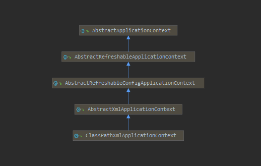
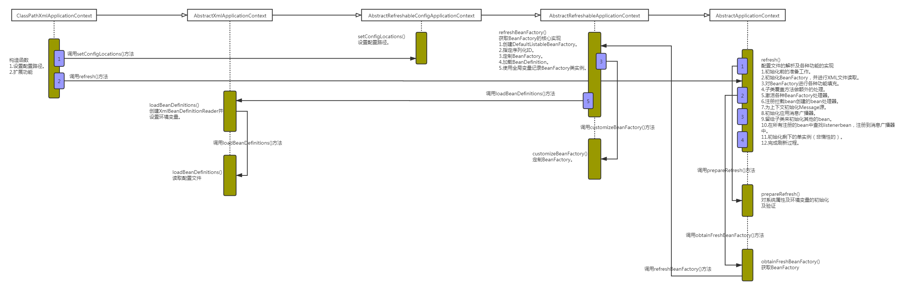

> ApplicationContext和BeanFactory两者都是用于加载Bean的，但是相比之下，ApplicationContext提供了更多的扩展功能，简单一点说：ApplicationContext包含BeanFactory的所有功能。

<center>
<div class="title-style">ClassPathXmlApplicationContext相关类图</div></center>

<center>
<div class="title-style">ClassPathXmlApplicationContext加载时序图</div></center>

以ClassPathXmlApplicationContext作为切入点，开始对整体功能进行分析。ClassPathXmlApplicationContext的构造方法如下：
``` java
/**
 * ClassPathXmlApplicationContext.java
 * 构造方法
 */
public ClassPathXmlApplicationContext(
			String[] configLocations, boolean refresh, @Nullable ApplicationContext parent)
			throws BeansException {

    super(parent);
    setConfigLocations(configLocations);
    if (refresh) {
        refresh();
    }
}
```

设置路径是必不可少的步骤，ClassPathXmlApplicationContext中可以将配置文件路径以数组的方式传入，ClassPathXmlApplicationContext可以对数组进行解析并进行加载。而对于解析及功能实现都在refresh()中实现。

## 1.设置配置路径

在ClassPathXmlApplicationContext中支持多个配置文件以数组方式同时传入：
``` java
/**
 * AbstractRefreshableConfigApplicationContext.java
 * 设置配置路径
 */
public void setConfigLocations(@Nullable String... locations) {
    if (locations != null) {
        Assert.noNullElements(locations, "Config locations must not be null");
        this.configLocations = new String[locations.length];
        for (int i = 0; i < locations.length; i++) {
            // 解析给定路径
            this.configLocations[i] = resolvePath(locations[i]).trim();
        }
    }
    else {
        this.configLocations = null;
    }
}
```

此函数主要用于解析给定的路径数组，当然，如果数组中包含特殊符号，如${var}，那么在resolvePath中会搜寻匹配的系统变量并替换。

## 2.扩展功能

设置了路径之后，便可以根据路径做配置文件的解析以及各种功能的实现了。可以说refresh函数中包含了几乎ApplicationContext中提供的全部功能，而且此函数中逻辑非常清晰明了，使我们很容易分析对应的层次及逻辑。
``` java
/**
 * AbstractApplicationContext.java
 * 配置文件的解析及各种功能的实现
 */
public void refresh() throws BeansException, IllegalStateException {
    synchronized (this.startupShutdownMonitor) {
        // Prepare this context for refreshing.
        // 1.准备刷新上下文环境
        prepareRefresh();

        // Tell the subclass to refresh the internal bean factory.
        // 2.初始化BeanFactory，并进行XML文件的读取
        ConfigurableListableBeanFactory beanFactory = obtainFreshBeanFactory();

        // Prepare the bean factory for use in this context.
        // 3.BeanFactory各种功能的填充
        prepareBeanFactory(beanFactory);

        try {
            // Allows post-processing of the bean factory in context subclasses.
            // 4.子类覆盖方法做额外的处理
            postProcessBeanFactory(beanFactory);

            // Invoke factory processors registered as beans in the context.
            // 5.激活各种BeanFactory处理器
            invokeBeanFactoryPostProcessors(beanFactory);

            // Register bean processors that intercept bean creation.
            // 6.注册拦截Bean创建的Bean处理
            // 这里只是注册，真正调用是在getBean的时候
            registerBeanPostProcessors(beanFactory);

            // Initialize message source for this context.
            // 7.为上下文初始化Message源
            // 即不同语言的消息体，国际化处理
            initMessageSource();

            // Initialize event multicaster for this context.
            // 8.初始化应用消息广播器
            // 并放入“applicationEventMulticaster”bean中
            initApplicationEventMulticaster();

            // Initialize other special beans in specific context subclasses.
            // 9.留给子类来初始化其它的Bean
            onRefresh();

            // Check for listener beans and register them.
            // 10.在所有注册的bean中查找ListenerBean，注册到消息广播中
            registerListeners();

            // Instantiate all remaining (non-lazy-init) singletons.
            // 11.初始化剩下的单实例（非惰性的）
            finishBeanFactoryInitialization(beanFactory);

            // Last step: publish corresponding event.
            // 12.完成刷新过程，通知生命周期处理器lifecycleProcessor刷新过程
            // 同时发出ContextRefreshEvent通知别人
            finishRefresh();
        }

        catch (BeansException ex) {
            if (logger.isWarnEnabled()) {
                logger.warn("Exception encountered during context initialization - " +
                        "cancelling refresh attempt: " + ex);
            }

            // Destroy already created singletons to avoid dangling resources.
            // 销毁bean
            destroyBeans();

            // Reset 'active' flag.
            // 重置标记
            cancelRefresh(ex);

            // Propagate exception to caller.
            throw ex;
        }

        finally {
            // Reset common introspection caches in Spring's core, since we
            // might not ever need metadata for singleton beans anymore...
            resetCommonCaches();
        }
    }
}
```

下面概括一下ClassPathXmlApplicationContext初始化的步骤，并从中解释一下它为我们提供的功能。
1. 初始化前的准备工作，例如对系统属性或者环境变量进行准备及验证。
在某种情况下项目的使用需要读取某些系统变量，而这个变量的设置很可能会影响着系统的正确性，那么ClassPathXmlApplicationContext为我们提供的这个准备函数就显得非常必要，它可以在Spring启动的时候提前对必须的变量进行存在性验证。
2. 初始化BeanFactory，并进行XML文件读取。
之前有提到ClassPathXmlApplicationContext包含着BeanFactory所提供的一切特征，那么在这一步骤中将会复用BeanFactory中的配置文件读取解析及其他功能，这一步之后，ClassPathXmlApplicationContext实际上就已经包含了BeanFactory所提供的功能，也就是可以进行Bean的提取等基础操作了。
3. 对BeanFactory进行各种功能填充。
@Qualifier与@Autowired应该是大家非常熟悉的注解，那么这两个注解正是在这一步骤中增加的支持。
4. 子类覆盖方法做额外的处理。
Spring之所以强大，为世人所推崇，除了它功能上为大家提供了便例外，还有一方面是它的完美架构，开放式的架构让使用它的程序员很容易根据业务需要扩展已经存在的功能。
5. 激活各种BeanFactory处理器。
6. 注册拦截bean创建的bean处理器，这里只是注册，真正的调用是在getBean时候。
7. 为上下文初始化Message源，即对不同语言的消息体进行国际化处理。
8. 初始化应用消息广播器，并放入“applicationEventMulticaster”bean中。
9. 留给子类来初始化其他的bean。
10. 在所有注册的bean中查找listenerbean，注册到消息广播器中。
11. 初始化剩下的单实例（非惰性的）。
12. 完成刷新过程，通知生命周期处理器lifecycleProcessor刷新过程，同时发出ContextRefreshEvent通知别人。

## 3.环境准备

prepareRefresh函数主要是做些准备工作，例如对系统属性及环境变量的初始化及验证。
``` java
/**
 * AbstractApplicationContext.java
 * 对系统属性及环境变量的初始化及验证
 */
protected void prepareRefresh() {
    // Switch to active.
    this.startupDate = System.currentTimeMillis();
    this.closed.set(false);
    this.active.set(true);

    if (logger.isDebugEnabled()) {
        if (logger.isTraceEnabled()) {
            logger.trace("Refreshing " + this);
        }
        else {
            logger.debug("Refreshing " + getDisplayName());
        }
    }

    // Initialize any placeholder property sources in the context environment.
    // 留给子类覆盖的初始化方法
    initPropertySources();

    // Validate that all properties marked as required are resolvable:
    // see ConfigurablePropertyResolver#setRequiredProperties
    // 验证需要的属性文件是否都已经放入环境中
    getEnvironment().validateRequiredProperties();

    // Store pre-refresh ApplicationListeners...
    if (this.earlyApplicationListeners == null) {
        this.earlyApplicationListeners = new LinkedHashSet<>(this.applicationListeners);
    }
    else {
        // Reset local application listeners to pre-refresh state.
        this.applicationListeners.clear();
        this.applicationListeners.addAll(this.earlyApplicationListeners);
    }

    // Allow for the collection of early ApplicationEvents,
    // to be published once the multicaster is available...
    this.earlyApplicationEvents = new LinkedHashSet<>();
}
```

prepareRefresh函数中最主要的就是initPropertySources和validateRequiredProperties，各个函数的作用：
1. initPropertySources正符合Spring的开放式结构设计，给用户最大扩展Spring的能力。用户可以根据自身的需要重写initPropertySources方法，并在方法中进行个性化的属性处理及设置。
2. validateRequiredProperties则是对属性进行验证。

## 4.加载BeanFactory

obtainFreshBeanFactory方法从字面理解是获取BeanFactory。之前有说过，ApplicationContext是对BeanFactory的功能上的扩展，不但包含了BeanFactory的全部功能更在其基础上添加了大量的扩展应用，那么obtainFreshBeanFactory正是实现BeanFactory的地方，也就是经过了这个函数后ApplicationContext就已经拥有了BeanFactory的全部功能。

``` java
/**
 * AbstractApplicationContext.java
 * 获取BeanFactory
 */
protected ConfigurableListableBeanFactory obtainFreshBeanFactory() {
    // 初始化BeanFactory，并进行XML文件读取
    // 并将得到的BeanFacotry记录在当前实体的属性中
    refreshBeanFactory();
    // 返回当前实体的beanFactory属性
    return getBeanFactory();
}
```

方法中将核心实现委托给了refreshBeanFactory：
``` java
/**
 * AbstractRefreshableApplicationContext.java
 * 获取BeanFactory的核心实现
 */
protected final void refreshBeanFactory() throws BeansException {
    if (hasBeanFactory()) {
        destroyBeans();
        closeBeanFactory();
    }
    try {
        // 1.创建DefaultListableBeanFactory
        DefaultListableBeanFactory beanFactory = createBeanFactory();
        // 2.为了序列化指定ID，如果需要的话，让这个BeanFactory从ID发序列化到BeanFactory对象
        beanFactory.setSerializationId(getId());
        // 3.定制beanFactory，设置相关属性
        // 包括是否允许覆盖同名称的不同定义的对象以及循环依赖
        customizeBeanFactory(beanFactory);
        // 4.初始化DodumentReader，并进行XML文件读取及解析
        loadBeanDefinitions(beanFactory);
        synchronized (this.beanFactoryMonitor) {
            // 5.使用全局变量记录BeanFactory类实例
            this.beanFactory = beanFactory;
        }
    }
    catch (IOException ex) {
        throw new ApplicationContextException("I/O error parsing bean definition source for " + getDisplayName(), ex);
    }
}
```

我们详细分析上面的每个步骤。
1. 创建DefaultListableBeanFactory。
在介绍BeanFactory的时候，不知道读者是否还有印象，声明方式为：`BeanFactorybf=newXmlBeanFactory("beanFactoryTest.xml")`，其中的XmlBeanFactory继承自DefaultListableBeanFactory，并提供了XmlBeanDefinitionReader类型的reader属性，也就是说DefaultListableBeanFactory是容器的基础。必须首先要实例化，那么在这里就是实例化DefaultListableBeanFactory的步骤。
2. 指定序列化ID。
3. 定制BeanFactory。
4. 加载BeanDefinition。
5. 使用全局变量记录BeanFactory类实例。

因为DefaultListableBeanFactory类型的变量beanFactory是函数内的局部变量，所以要使用全局变量记录解析结果。

### 4.1 定制BeanFactory

这里已经开始了对BeanFactory的扩展，在基本容器的基础上，增加了是否允许覆盖是否允许扩展的设置，代码如下：
``` java
/**
 * AbstractRefreshableApplicationContext.java
 * 定制BeanFactory
 */
protected void customizeBeanFactory(DefaultListableBeanFactory beanFactory) {
    // 如果属性allowBeanDefinitionOverriding不为空，设置给beanFactory对象相应属性
    // 此属性的含义：是否允许覆盖同名称的不同定义的对象
    if (this.allowBeanDefinitionOverriding != null) {
        beanFactory.setAllowBeanDefinitionOverriding(this.allowBeanDefinitionOverriding);
    }
    // 如果属性allowCircularReferences不为空，设置给beanFactory对象相应属性
    // 此属性的含义：是否允许bean之间存在循环依赖
    if (this.allowCircularReferences != null) {
        beanFactory.setAllowCircularReferences(this.allowCircularReferences);
    }
}
```

### 4.2 加载BeanFactory

在第一步中提到了将ClassPathXmlApplicationContext与XmlBeanFactory创建的对比，在实现配置文件的加载功能中除了我们在第一步中已经初始化的DefaultListableBeanFactory外，还需要XmlBeanDefinitionReader来读取XML，那么在这个步骤中首先要做的就是初始化XmlBeanDefinitionReader。

``` java
/**
 * AbstractXmlApplicationContext.java
 * 创建XmlBeanDefinitionReader并设置环境变量
 */
protected void loadBeanDefinitions(DefaultListableBeanFactory beanFactory) throws BeansException, IOException {
    // Create a new XmlBeanDefinitionReader for the given BeanFactory.
    // 为指定的BeanFactory创建XmlBeanDefinitionReader
    XmlBeanDefinitionReader beanDefinitionReader = new XmlBeanDefinitionReader(beanFactory);

    // Configure the bean definition reader with this context's
    // resource loading environment.
    // 设置环境变量
    beanDefinitionReader.setEnvironment(this.getEnvironment());
    beanDefinitionReader.setResourceLoader(this);
    beanDefinitionReader.setEntityResolver(new ResourceEntityResolver(this));

    // Allow a subclass to provide custom initialization of the reader,
    // then proceed with actually loading the bean definitions.
    // 对beanDefinitionReader进行设置，可以覆盖
    initBeanDefinitionReader(beanDefinitionReader);
    // 读取配置文件
    loadBeanDefinitions(beanDefinitionReader);
}
```

在初始化了DefaultListableBeanFactory和XmlBeanDefinitionReader后就可以进行配置文件的读取了。
``` java
/**
 * AbstractXmlApplicationContext.java
 * 读取配置文件
 */
protected void loadBeanDefinitions(XmlBeanDefinitionReader reader) throws BeansException, IOException {
    Resource[] configResources = getConfigResources();
    if (configResources != null) {
        reader.loadBeanDefinitions(configResources);
    }
    String[] configLocations = getConfigLocations();
    if (configLocations != null) {
        reader.loadBeanDefinitions(configLocations);
    }
}
```

使用XmlBeanDefinitionReader的loadBeanDefinitions方法进行配置文件的加载机注册相信大家已经不陌生，这完全就是开始BeanFactory的套路。因为在XmlBeanDefinitionReader中已经将之前初始化的DefaultListableBeanFactory注册进去了，所以XmlBeanDefinitionReader所读取的BeanDefinitionHolder都会注册到DefaultListableBeanFactory中，也就是经过此步骤，类型DefaultListableBeanFactory的变量beanFactory已经包含了所有解析好的配置。

## 5.功能扩展

进入函数prepareBeanFactory前，Spring已经完成了对配置的解析，而ApplicationContext在功能上的扩展也由此展开。
``` java
/**
 * 功能扩展
 */
protected void prepareBeanFactory(ConfigurableListableBeanFactory beanFactory) {
    // Tell the internal bean factory to use the context's class loader etc.
    // 设置BeanFactory的classLoader为当前context的classLoader
    beanFactory.setBeanClassLoader(getClassLoader());
    
    // 设置beanFactory的表达式语言处理器，Spring3增加了表达式语言的支持
    // 默认可以使用#{bean.xxx}的形式来调用相关属性值
    beanFactory.setBeanExpressionResolver(new StandardBeanExpressionResolver(beanFactory.getBeanClassLoader()));
    // 为beanFactory增加了一个默认的propertyEditor
    // 这个主要是对bean的属性等设置管理的一个工具
    beanFactory.addPropertyEditorRegistrar(new ResourceEditorRegistrar(this, getEnvironment()));

    // Configure the bean factory with context callbacks.
    // 设置几个忽略自动装配的接口
    beanFactory.addBeanPostProcessor(new ApplicationContextAwareProcessor(this));
    beanFactory.ignoreDependencyInterface(EnvironmentAware.class);
    beanFactory.ignoreDependencyInterface(EmbeddedValueResolverAware.class);
    beanFactory.ignoreDependencyInterface(ResourceLoaderAware.class);
    beanFactory.ignoreDependencyInterface(ApplicationEventPublisherAware.class);
    beanFactory.ignoreDependencyInterface(MessageSourceAware.class);
    beanFactory.ignoreDependencyInterface(ApplicationContextAware.class);

    // BeanFactory interface not registered as resolvable type in a plain factory.
    // MessageSource registered (and found for autowiring) as a bean.
    // 设置了几个自动装配的特殊规则
    beanFactory.registerResolvableDependency(BeanFactory.class, beanFactory);
    beanFactory.registerResolvableDependency(ResourceLoader.class, this);
    beanFactory.registerResolvableDependency(ApplicationEventPublisher.class, this);
    beanFactory.registerResolvableDependency(ApplicationContext.class, this);

    // Register early post-processor for detecting inner beans as ApplicationListeners.
    // 添加BeanPostProcessor
    beanFactory.addBeanPostProcessor(new ApplicationListenerDetector(this));

    // Detect a LoadTimeWeaver and prepare for weaving, if found.
    // 增加对AspectJ的支持
    if (beanFactory.containsBean(LOAD_TIME_WEAVER_BEAN_NAME)) {
        beanFactory.addBeanPostProcessor(new LoadTimeWeaverAwareProcessor(beanFactory));
        // Set a temporary ClassLoader for type matching.
        beanFactory.setTempClassLoader(new ContextTypeMatchClassLoader(beanFactory.getBeanClassLoader()));
    }

    // Register default environment beans.
    // 添加默认的系统环境bean
    if (!beanFactory.containsLocalBean(ENVIRONMENT_BEAN_NAME)) {
        beanFactory.registerSingleton(ENVIRONMENT_BEAN_NAME, getEnvironment());
    }
    if (!beanFactory.containsLocalBean(SYSTEM_PROPERTIES_BEAN_NAME)) {
        beanFactory.registerSingleton(SYSTEM_PROPERTIES_BEAN_NAME, getEnvironment().getSystemProperties());
    }
    if (!beanFactory.containsLocalBean(SYSTEM_ENVIRONMENT_BEAN_NAME)) {
        beanFactory.registerSingleton(SYSTEM_ENVIRONMENT_BEAN_NAME, getEnvironment().getSystemEnvironment());
    }
}
```

上面函数中主要进行了几个方面的扩展：
- 设置BeanFactory的classLoader。
- 增加对SPEL语言的支持。
- 增加对属性编辑器的支持。
- 设置了依赖功能可忽略的接口。
- 注册一些固定依赖的属性。
- 增加一些内置类。
- 增加AspectJ的支持。
- 将相关环境变量及属性注册以单例模式注册。

### 5.1 增加SpEL语言的支持

Spring表达式语言全称为“SpringExpressionLanguage”，缩写为“SpEL”，类似于Struts2x中使用的OGNL表达式语言，能在运行时构建复杂表达式、存取对象图属性、对象方法调用等，并且能与Spring功能完美整合，比如能用来配置bean定义。SpEL是单独模块，只依赖于core模块，不依赖于其他模块，可以单独使用。

在源码中通过代码`beanFactory.setBeanExpressionResolver(new StandardBeanExpressionResolver())`注册语言解析器，就可以对SPEL进行解析了，之前我们讲解过Spring在bean进行初始化的时候会有属性填充的一步，而在这一步中Spring会调用AbstractAutowireCapableBeanFactory类的applyPropertyValues函数来完成功能。就在这个函数中，会通过构造BeanDefinitionValueResolver类型实例valueResolver来进行属性值的解析。同时，也是在这个步骤中一般通过AbstractBeanFactory中的evaluateBeanDefinitionString方法去完成SPEL的解析。
``` java
protected Object evaluateBeanDefinitionString(@Nullable String value, @Nullable BeanDefinition beanDefinition) {
    if (this.beanExpressionResolver == null) {
        return value;
    }

    Scope scope = null;
    if (beanDefinition != null) {
        String scopeName = beanDefinition.getScope();
        if (scopeName != null) {
            scope = getRegisteredScope(scopeName);
        }
    }
    return this.beanExpressionResolver.evaluate(value, new BeanExpressionContext(this, scope));
}
```

当调用这个方法时会判断是否存在语言解析器，如果存在则调用语言解析器的方法进行解析，解析的过程是在Spring的expression的包内，这里不做过多解释。我们通过查看对evaluateBeanDefinitionString方法的调用层次可以看出，应用语言解析器的调用主要是在解析依赖注入bean的时候，以及在完成bean的初始化和属性获取后进行属性填充的时候。

### 5.2 增加属性注册编辑器

#### 5.2.1 使用自定义属性编辑器

1.使用自定义属性编辑器，通过继承PropertyEditorSupport，重写setAsText方法。代码如下：
``` java
package com.silentao.spring.study.app;

import java.beans.PropertyEditorSupport;
import java.text.ParseException;
import java.text.SimpleDateFormat;
import java.util.Date;

/**
 * 自定义属性编辑器
 **/
public class DatePropertyEditor extends PropertyEditorSupport {

    private String format = "yyyy-MM-dd";

    public void setFormat(String format) {
        this.format = format;
    }

    @Override
    public void setAsText(String text) throws IllegalArgumentException {
        System.out.println("text:" + text);
        SimpleDateFormat simpleDateFormat = new SimpleDateFormat(format);

        try {
            Date d = simpleDateFormat.parse(text);
            this.setValue(d);
        } catch (ParseException e) {

        }
    }
}
```

2.将自定义属性编辑器注册到Spring中
``` xml
<bean class="org.springframework.beans.factory.config.CustomEditorConfigurer">
    <property name="customEditors">
        <map>
            <entry key="java.util.Date" value="com.silentao.spring.study.app.DatePropertyEditor" />
        </map>
    </property>
</bean>
```

在配置文件中引入类型为org.Springframework.beans.factory.config.CustomEditorConfigurer的bean，并在属性customEditors中加入自定义的属性编辑器，其中key为属性编辑器所对应的类型。通过这样的配置，当Spring在注入bean的属性时一旦遇到了java.util.Date类型的属性会自动调用自定义的DatePropertyEditor解析器进行解析，并用解析结果代替配置属性进行注入。

#### 5.2.2 注册Spring自带的属性编辑器CustomDateEditor

通过注册Spring自带的属性编辑器CustomDateEditor。
           
1.定义属性编辑器，代码如下：
``` java
/**
 * 属性编辑器
 **/
package com.silentao.spring.study.app;

import org.springframework.beans.PropertyEditorRegistrar;
import org.springframework.beans.PropertyEditorRegistry;
import org.springframework.beans.propertyeditors.CustomDateEditor;

import java.text.SimpleDateFormat;
import java.util.Date;
 
public class DatePropertyEditorRegistrar implements PropertyEditorRegistrar {

    public void registerCustomEditors(PropertyEditorRegistry registry) {
        registry.registerCustomEditor(Date.class,
                new CustomDateEditor(new SimpleDateFormat("yyyy-MM-dd"), true));
    }
}
```

2.注册到Spring中。
``` xml
<bean class="org.springframework.beans.factory.config.CustomEditorConfigurer">
    <property name="propertyEditorRegistrars">
        <list>
            <bean class="com.silentao.spring.study.app.DatePropertyEditorRegistrar" />
        </list>
    </property>
</bean>
```

通过在配置文件中将自定义的DatePropertyEditorRegistrar注册进入org.Springframework.beans.factory.config.CustomEditorConfigurer的propertyEditorRegistrars属性中。

### 5.3 添加ApplicationContextAwareProcessor处理器

对于`beanFactory.addBeanPostProcessor(new ApplicationContextAwareProcessor(this))`其实主要目的就是注册个BneaPostProcessor，而真正的逻辑还是在ApplicationContextAwareProcessor中。

ApplicationContextAwareProcessor实现BeanPostProcessor接口，在bean实例化的时候，也就是Spring激活bean的init-method的前后，会调用BeanPostProcessor的postProcessBeforeInitialization方法和postProcessAfterInitialization方法。

### 5.4设置忽略依赖

当Spring将ApplicationContextAwareProcessor注册后，那么在invokeAwareInterfaces方法中间接调用的Aware类已经不是普通的bean了，如ResourceLoaderAware、ApplicationEventPublisherAware等，那么当然需要在Spring做bean的依赖注入的时候忽略它们。而ignoreDependencyInterface的作用正是在此。
``` java
//设置了几个忽略自动装配的接口
beanFactory.ignoreDependencyInterface(ResourceLoaderAware.class);
beanFactory.ignoreDependencyInterface(ApplicationEventPublisherAware.class);
beanFactory.ignoreDependencyInterface(MessageSourceAware.class);
beanFactory.ignoreDependencyInterface(ApplicationContextAware.class);
beanFactory.ignoreDependencyInterface(EnvironmentAware.class);
```

### 5.5注册依赖

Spring中有了忽略依赖的功能，当然也必不可少地会有注册依赖的功能。
``` java
beanFactory.registerResolvableDependency(BeanFactory.class,beanFactory);
beanFactory.registerResolvableDependency(ResourceLoader.class,this);
beanFactory.registerResolvableDependency(ApplicationEventPublisher.class,this);
beanFactory.registerResolvableDependency(ApplicationContext.class,this);
```

当注册了依赖解析后，例如当注册了对BeanFactory.class的解析依赖后，当bean的属性注入的时候，一旦检测到属性为BeanFactory类型便会将beanFactory的实例注入进去。

<style>
.img-style {
    border-radius: 0.3125em;
    box-shadow: 0 2px 4px 0 rgba(34,36,38,.12),0 2px 10px 0 rgba(34,36,38,.08);
    margin-top: 10px;
}

.title-style {
    color: #999;
    border-bottom: 1px solid #d9d9d9;
    display: inline-block;
}
</style>