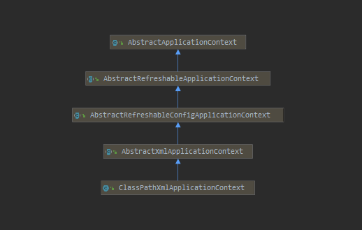
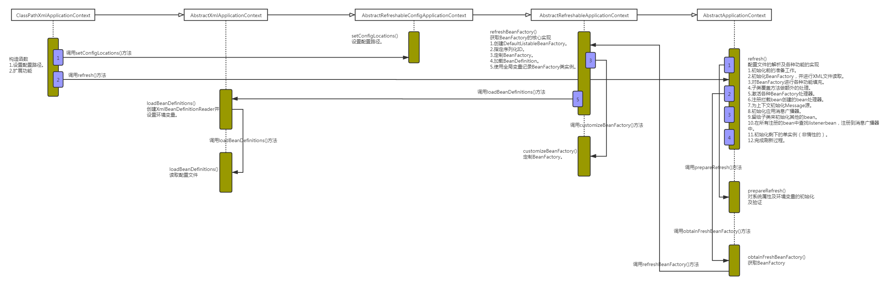
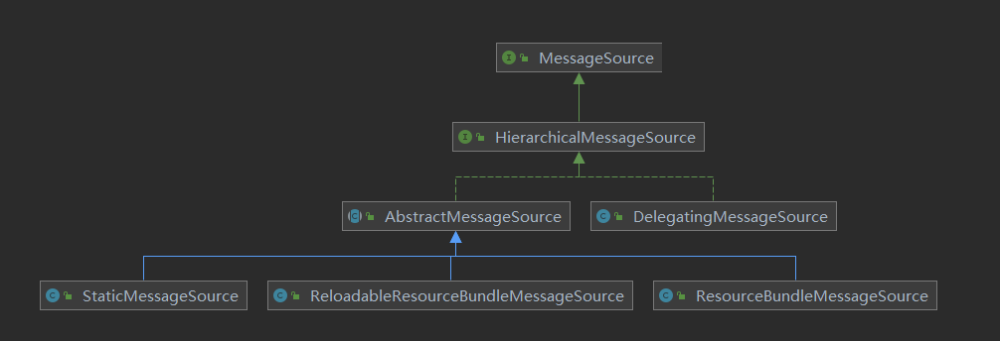

> ApplicationContext和BeanFactory两者都是用于加载Bean的，但是相比之下，ApplicationContext提供了更多的扩展功能，简单一点说：ApplicationContext包含BeanFactory的所有功能。

<center>
<div class="title-style">ClassPathXmlApplicationContext相关类图</div></center>

<center>
<div class="title-style">ClassPathXmlApplicationContext加载时序图</div></center>


以ClassPathXmlApplicationContext作为切入点，开始对整体功能进行分析。ClassPathXmlApplicationContext的构造方法如下：
``` java
/**
 * ClassPathXmlApplicationContext.java
 * 构造方法
 */
public ClassPathXmlApplicationContext(
			String[] configLocations, boolean refresh, @Nullable ApplicationContext parent)
			throws BeansException {

    super(parent);
    setConfigLocations(configLocations);
    if (refresh) {
        refresh();
    }
}
```

设置路径是必不可少的步骤，ClassPathXmlApplicationContext中可以将配置文件路径以数组的方式传入，ClassPathXmlApplicationContext可以对数组进行解析并进行加载。而对于解析及功能实现都在refresh()中实现。

## 1.设置配置路径

在ClassPathXmlApplicationContext中支持多个配置文件以数组方式同时传入：
``` java
/**
 * AbstractRefreshableConfigApplicationContext.java
 * 设置配置路径
 */
public void setConfigLocations(@Nullable String... locations) {
    if (locations != null) {
        Assert.noNullElements(locations, "Config locations must not be null");
        this.configLocations = new String[locations.length];
        for (int i = 0; i < locations.length; i++) {
            // 解析给定路径
            this.configLocations[i] = resolvePath(locations[i]).trim();
        }
    }
    else {
        this.configLocations = null;
    }
}
```

此函数主要用于解析给定的路径数组，当然，如果数组中包含特殊符号，如${var}，那么在resolvePath中会搜寻匹配的系统变量并替换。

## 2.扩展功能

设置了路径之后，便可以根据路径做配置文件的解析以及各种功能的实现了。可以说refresh函数中包含了几乎ApplicationContext中提供的全部功能，而且此函数中逻辑非常清晰明了，使我们很容易分析对应的层次及逻辑。
``` java
/**
 * AbstractApplicationContext.java
 * 配置文件的解析及各种功能的实现
 */
public void refresh() throws BeansException, IllegalStateException {
    synchronized (this.startupShutdownMonitor) {
        // Prepare this context for refreshing.
        // 1.准备刷新上下文环境
        prepareRefresh();

        // Tell the subclass to refresh the internal bean factory.
        // 2.初始化BeanFactory，并进行XML文件的读取
        ConfigurableListableBeanFactory beanFactory = obtainFreshBeanFactory();

        // Prepare the bean factory for use in this context.
        // 3.BeanFactory各种功能的填充
        prepareBeanFactory(beanFactory);

        try {
            // Allows post-processing of the bean factory in context subclasses.
            // 4.子类覆盖方法做额外的处理
            postProcessBeanFactory(beanFactory);

            // Invoke factory processors registered as beans in the context.
            // 5.激活各种BeanFactory处理器
            invokeBeanFactoryPostProcessors(beanFactory);

            // Register bean processors that intercept bean creation.
            // 6.注册拦截Bean创建的Bean处理
            // 这里只是注册，真正调用是在getBean的时候
            registerBeanPostProcessors(beanFactory);

            // Initialize message source for this context.
            // 7.为上下文初始化Message源
            // 即不同语言的消息体，国际化处理
            initMessageSource();

            // Initialize event multicaster for this context.
            // 8.初始化应用消息广播器
            // 并放入“applicationEventMulticaster”bean中
            initApplicationEventMulticaster();

            // Initialize other special beans in specific context subclasses.
            // 9.留给子类来初始化其它的Bean
            onRefresh();

            // Check for listener beans and register them.
            // 10.在所有注册的bean中查找ListenerBean，注册到消息广播中
            registerListeners();

            // Instantiate all remaining (non-lazy-init) singletons.
            // 11.初始化剩下的单实例（非惰性的）
            finishBeanFactoryInitialization(beanFactory);

            // Last step: publish corresponding event.
            // 12.完成刷新过程，通知生命周期处理器lifecycleProcessor刷新过程
            // 同时发出ContextRefreshEvent通知别人
            finishRefresh();
        }

        catch (BeansException ex) {
            if (logger.isWarnEnabled()) {
                logger.warn("Exception encountered during context initialization - " +
                        "cancelling refresh attempt: " + ex);
            }

            // Destroy already created singletons to avoid dangling resources.
            // 销毁bean
            destroyBeans();

            // Reset 'active' flag.
            // 重置标记
            cancelRefresh(ex);

            // Propagate exception to caller.
            throw ex;
        }

        finally {
            // Reset common introspection caches in Spring's core, since we
            // might not ever need metadata for singleton beans anymore...
            resetCommonCaches();
        }
    }
}
```

下面概括一下ClassPathXmlApplicationContext初始化的步骤，并从中解释一下它为我们提供的功能。
1. 初始化前的准备工作，例如对系统属性或者环境变量进行准备及验证。
在某种情况下项目的使用需要读取某些系统变量，而这个变量的设置很可能会影响着系统的正确性，那么ClassPathXmlApplicationContext为我们提供的这个准备函数就显得非常必要，它可以在Spring启动的时候提前对必须的变量进行存在性验证。
2. 初始化BeanFactory，并进行XML文件读取。
之前有提到ClassPathXmlApplicationContext包含着BeanFactory所提供的一切特征，那么在这一步骤中将会复用BeanFactory中的配置文件读取解析及其他功能，这一步之后，ClassPathXmlApplicationContext实际上就已经包含了BeanFactory所提供的功能，也就是可以进行Bean的提取等基础操作了。
3. 对BeanFactory进行各种功能填充。
@Qualifier与@Autowired应该是大家非常熟悉的注解，那么这两个注解正是在这一步骤中增加的支持。
4. 子类覆盖方法做额外的处理。
Spring之所以强大，为世人所推崇，除了它功能上为大家提供了便例外，还有一方面是它的完美架构，开放式的架构让使用它的程序员很容易根据业务需要扩展已经存在的功能。
5. 激活各种BeanFactory处理器。
6. 注册拦截bean创建的bean处理器，这里只是注册，真正的调用是在getBean时候。
7. 为上下文初始化Message源，即对不同语言的消息体进行国际化处理。
8. 初始化应用消息广播器，并放入“applicationEventMulticaster”bean中。
9. 留给子类来初始化其他的bean。
10. 在所有注册的bean中查找listenerbean，注册到消息广播器中。
11. 初始化剩下的单实例（非惰性的）。
12. 完成刷新过程，通知生命周期处理器lifecycleProcessor刷新过程，同时发出ContextRefreshEvent通知别人。

## 3.环境准备

prepareRefresh函数主要是做些准备工作，例如对系统属性及环境变量的初始化及验证。
``` java
/**
 * AbstractApplicationContext.java
 * 对系统属性及环境变量的初始化及验证
 */
protected void prepareRefresh() {
    // Switch to active.
    this.startupDate = System.currentTimeMillis();
    this.closed.set(false);
    this.active.set(true);

    if (logger.isDebugEnabled()) {
        if (logger.isTraceEnabled()) {
            logger.trace("Refreshing " + this);
        }
        else {
            logger.debug("Refreshing " + getDisplayName());
        }
    }

    // Initialize any placeholder property sources in the context environment.
    // 留给子类覆盖的初始化方法
    initPropertySources();

    // Validate that all properties marked as required are resolvable:
    // see ConfigurablePropertyResolver#setRequiredProperties
    // 验证需要的属性文件是否都已经放入环境中
    getEnvironment().validateRequiredProperties();

    // Store pre-refresh ApplicationListeners...
    if (this.earlyApplicationListeners == null) {
        this.earlyApplicationListeners = new LinkedHashSet<>(this.applicationListeners);
    }
    else {
        // Reset local application listeners to pre-refresh state.
        this.applicationListeners.clear();
        this.applicationListeners.addAll(this.earlyApplicationListeners);
    }

    // Allow for the collection of early ApplicationEvents,
    // to be published once the multicaster is available...
    this.earlyApplicationEvents = new LinkedHashSet<>();
}
```

prepareRefresh函数中最主要的就是initPropertySources和validateRequiredProperties，各个函数的作用：
1. initPropertySources正符合Spring的开放式结构设计，给用户最大扩展Spring的能力。用户可以根据自身的需要重写initPropertySources方法，并在方法中进行个性化的属性处理及设置。
2. validateRequiredProperties则是对属性进行验证。

## 4.加载BeanFactory

obtainFreshBeanFactory方法从字面理解是获取BeanFactory。之前有说过，ApplicationContext是对BeanFactory的功能上的扩展，不但包含了BeanFactory的全部功能更在其基础上添加了大量的扩展应用，那么obtainFreshBeanFactory正是实现BeanFactory的地方，也就是经过了这个函数后ApplicationContext就已经拥有了BeanFactory的全部功能。

``` java
/**
 * AbstractApplicationContext.java
 * 获取BeanFactory
 */
protected ConfigurableListableBeanFactory obtainFreshBeanFactory() {
    // 初始化BeanFactory，并进行XML文件读取
    // 并将得到的BeanFacotry记录在当前实体的属性中
    refreshBeanFactory();
    // 返回当前实体的beanFactory属性
    return getBeanFactory();
}
```

方法中将核心实现委托给了refreshBeanFactory：
``` java
/**
 * AbstractRefreshableApplicationContext.java
 * 获取BeanFactory的核心实现
 */
protected final void refreshBeanFactory() throws BeansException {
    if (hasBeanFactory()) {
        destroyBeans();
        closeBeanFactory();
    }
    try {
        // 1.创建DefaultListableBeanFactory
        DefaultListableBeanFactory beanFactory = createBeanFactory();
        // 2.为了序列化指定ID，如果需要的话，让这个BeanFactory从ID发序列化到BeanFactory对象
        beanFactory.setSerializationId(getId());
        // 3.定制beanFactory，设置相关属性
        // 包括是否允许覆盖同名称的不同定义的对象以及循环依赖
        customizeBeanFactory(beanFactory);
        // 4.初始化DodumentReader，并进行XML文件读取及解析
        loadBeanDefinitions(beanFactory);
        synchronized (this.beanFactoryMonitor) {
            // 5.使用全局变量记录BeanFactory类实例
            this.beanFactory = beanFactory;
        }
    }
    catch (IOException ex) {
        throw new ApplicationContextException("I/O error parsing bean definition source for " + getDisplayName(), ex);
    }
}
```

我们详细分析上面的每个步骤。
1. 创建DefaultListableBeanFactory。
在介绍BeanFactory的时候，不知道读者是否还有印象，声明方式为：`BeanFactorybf=newXmlBeanFactory("beanFactoryTest.xml")`，其中的XmlBeanFactory继承自DefaultListableBeanFactory，并提供了XmlBeanDefinitionReader类型的reader属性，也就是说DefaultListableBeanFactory是容器的基础。必须首先要实例化，那么在这里就是实例化DefaultListableBeanFactory的步骤。
2. 指定序列化ID。
3. 定制BeanFactory。
4. 加载BeanDefinition。
5. 使用全局变量记录BeanFactory类实例。

因为DefaultListableBeanFactory类型的变量beanFactory是函数内的局部变量，所以要使用全局变量记录解析结果。

### 4.1 定制BeanFactory

这里已经开始了对BeanFactory的扩展，在基本容器的基础上，增加了是否允许覆盖是否允许扩展的设置，代码如下：
``` java
/**
 * AbstractRefreshableApplicationContext.java
 * 定制BeanFactory
 */
protected void customizeBeanFactory(DefaultListableBeanFactory beanFactory) {
    // 如果属性allowBeanDefinitionOverriding不为空，设置给beanFactory对象相应属性
    // 此属性的含义：是否允许覆盖同名称的不同定义的对象
    if (this.allowBeanDefinitionOverriding != null) {
        beanFactory.setAllowBeanDefinitionOverriding(this.allowBeanDefinitionOverriding);
    }
    // 如果属性allowCircularReferences不为空，设置给beanFactory对象相应属性
    // 此属性的含义：是否允许bean之间存在循环依赖
    if (this.allowCircularReferences != null) {
        beanFactory.setAllowCircularReferences(this.allowCircularReferences);
    }
}
```

### 4.2 加载BeanFactory

在第一步中提到了将ClassPathXmlApplicationContext与XmlBeanFactory创建的对比，在实现配置文件的加载功能中除了我们在第一步中已经初始化的DefaultListableBeanFactory外，还需要XmlBeanDefinitionReader来读取XML，那么在这个步骤中首先要做的就是初始化XmlBeanDefinitionReader。

``` java
/**
 * AbstractXmlApplicationContext.java
 * 创建XmlBeanDefinitionReader并设置环境变量
 */
protected void loadBeanDefinitions(DefaultListableBeanFactory beanFactory) throws BeansException, IOException {
    // Create a new XmlBeanDefinitionReader for the given BeanFactory.
    // 为指定的BeanFactory创建XmlBeanDefinitionReader
    XmlBeanDefinitionReader beanDefinitionReader = new XmlBeanDefinitionReader(beanFactory);

    // Configure the bean definition reader with this context's
    // resource loading environment.
    // 设置环境变量
    beanDefinitionReader.setEnvironment(this.getEnvironment());
    beanDefinitionReader.setResourceLoader(this);
    beanDefinitionReader.setEntityResolver(new ResourceEntityResolver(this));

    // Allow a subclass to provide custom initialization of the reader,
    // then proceed with actually loading the bean definitions.
    // 对beanDefinitionReader进行设置，可以覆盖
    initBeanDefinitionReader(beanDefinitionReader);
    // 读取配置文件
    loadBeanDefinitions(beanDefinitionReader);
}
```

在初始化了DefaultListableBeanFactory和XmlBeanDefinitionReader后就可以进行配置文件的读取了。
``` java
/**
 * AbstractXmlApplicationContext.java
 * 读取配置文件
 */
protected void loadBeanDefinitions(XmlBeanDefinitionReader reader) throws BeansException, IOException {
    Resource[] configResources = getConfigResources();
    if (configResources != null) {
        reader.loadBeanDefinitions(configResources);
    }
    String[] configLocations = getConfigLocations();
    if (configLocations != null) {
        reader.loadBeanDefinitions(configLocations);
    }
}
```

使用XmlBeanDefinitionReader的loadBeanDefinitions方法进行配置文件的加载机注册相信大家已经不陌生，这完全就是开始BeanFactory的套路。因为在XmlBeanDefinitionReader中已经将之前初始化的DefaultListableBeanFactory注册进去了，所以XmlBeanDefinitionReader所读取的BeanDefinitionHolder都会注册到DefaultListableBeanFactory中，也就是经过此步骤，类型DefaultListableBeanFactory的变量beanFactory已经包含了所有解析好的配置。

## 5.功能扩展

进入函数prepareBeanFactory前，Spring已经完成了对配置的解析，而ApplicationContext在功能上的扩展也由此展开。
``` java
/**
 * 功能扩展
 */
protected void prepareBeanFactory(ConfigurableListableBeanFactory beanFactory) {
    // Tell the internal bean factory to use the context's class loader etc.
    // 设置BeanFactory的classLoader为当前context的classLoader
    beanFactory.setBeanClassLoader(getClassLoader());
    
    // 设置beanFactory的表达式语言处理器，Spring3增加了表达式语言的支持
    // 默认可以使用#{bean.xxx}的形式来调用相关属性值
    beanFactory.setBeanExpressionResolver(new StandardBeanExpressionResolver(beanFactory.getBeanClassLoader()));
    // 为beanFactory增加了一个默认的propertyEditor
    // 这个主要是对bean的属性等设置管理的一个工具
    beanFactory.addPropertyEditorRegistrar(new ResourceEditorRegistrar(this, getEnvironment()));

    // Configure the bean factory with context callbacks.
    // 设置几个忽略自动装配的接口
    beanFactory.addBeanPostProcessor(new ApplicationContextAwareProcessor(this));
    beanFactory.ignoreDependencyInterface(EnvironmentAware.class);
    beanFactory.ignoreDependencyInterface(EmbeddedValueResolverAware.class);
    beanFactory.ignoreDependencyInterface(ResourceLoaderAware.class);
    beanFactory.ignoreDependencyInterface(ApplicationEventPublisherAware.class);
    beanFactory.ignoreDependencyInterface(MessageSourceAware.class);
    beanFactory.ignoreDependencyInterface(ApplicationContextAware.class);

    // BeanFactory interface not registered as resolvable type in a plain factory.
    // MessageSource registered (and found for autowiring) as a bean.
    // 设置了几个自动装配的特殊规则
    beanFactory.registerResolvableDependency(BeanFactory.class, beanFactory);
    beanFactory.registerResolvableDependency(ResourceLoader.class, this);
    beanFactory.registerResolvableDependency(ApplicationEventPublisher.class, this);
    beanFactory.registerResolvableDependency(ApplicationContext.class, this);

    // Register early post-processor for detecting inner beans as ApplicationListeners.
    // 添加BeanPostProcessor
    beanFactory.addBeanPostProcessor(new ApplicationListenerDetector(this));

    // Detect a LoadTimeWeaver and prepare for weaving, if found.
    // 增加对AspectJ的支持
    if (beanFactory.containsBean(LOAD_TIME_WEAVER_BEAN_NAME)) {
        beanFactory.addBeanPostProcessor(new LoadTimeWeaverAwareProcessor(beanFactory));
        // Set a temporary ClassLoader for type matching.
        beanFactory.setTempClassLoader(new ContextTypeMatchClassLoader(beanFactory.getBeanClassLoader()));
    }

    // Register default environment beans.
    // 添加默认的系统环境bean
    if (!beanFactory.containsLocalBean(ENVIRONMENT_BEAN_NAME)) {
        beanFactory.registerSingleton(ENVIRONMENT_BEAN_NAME, getEnvironment());
    }
    if (!beanFactory.containsLocalBean(SYSTEM_PROPERTIES_BEAN_NAME)) {
        beanFactory.registerSingleton(SYSTEM_PROPERTIES_BEAN_NAME, getEnvironment().getSystemProperties());
    }
    if (!beanFactory.containsLocalBean(SYSTEM_ENVIRONMENT_BEAN_NAME)) {
        beanFactory.registerSingleton(SYSTEM_ENVIRONMENT_BEAN_NAME, getEnvironment().getSystemEnvironment());
    }
}
```

上面函数中主要进行了几个方面的扩展：
- 设置BeanFactory的classLoader。
- 增加对SPEL语言的支持。
- 增加对属性编辑器的支持。
- 设置了依赖功能可忽略的接口。
- 注册一些固定依赖的属性。
- 增加一些内置类。
- 增加AspectJ的支持。
- 将相关环境变量及属性注册以单例模式注册。

### 5.1 增加SpEL语言的支持

Spring表达式语言全称为“SpringExpressionLanguage”，缩写为“SpEL”，类似于Struts2x中使用的OGNL表达式语言，能在运行时构建复杂表达式、存取对象图属性、对象方法调用等，并且能与Spring功能完美整合，比如能用来配置bean定义。SpEL是单独模块，只依赖于core模块，不依赖于其他模块，可以单独使用。

在源码中通过代码`beanFactory.setBeanExpressionResolver(new StandardBeanExpressionResolver())`注册语言解析器，就可以对SPEL进行解析了，之前我们讲解过Spring在bean进行初始化的时候会有属性填充的一步，而在这一步中Spring会调用AbstractAutowireCapableBeanFactory类的applyPropertyValues函数来完成功能。就在这个函数中，会通过构造BeanDefinitionValueResolver类型实例valueResolver来进行属性值的解析。同时，也是在这个步骤中一般通过AbstractBeanFactory中的evaluateBeanDefinitionString方法去完成SPEL的解析。
``` java
protected Object evaluateBeanDefinitionString(@Nullable String value, @Nullable BeanDefinition beanDefinition) {
    if (this.beanExpressionResolver == null) {
        return value;
    }

    Scope scope = null;
    if (beanDefinition != null) {
        String scopeName = beanDefinition.getScope();
        if (scopeName != null) {
            scope = getRegisteredScope(scopeName);
        }
    }
    return this.beanExpressionResolver.evaluate(value, new BeanExpressionContext(this, scope));
}
```

当调用这个方法时会判断是否存在语言解析器，如果存在则调用语言解析器的方法进行解析，解析的过程是在Spring的expression的包内，这里不做过多解释。我们通过查看对evaluateBeanDefinitionString方法的调用层次可以看出，应用语言解析器的调用主要是在解析依赖注入bean的时候，以及在完成bean的初始化和属性获取后进行属性填充的时候。

### 5.2 增加属性注册编辑器

#### 5.2.1 使用自定义属性编辑器

1.使用自定义属性编辑器，通过继承PropertyEditorSupport，重写setAsText方法。代码如下：
``` java
package com.silentao.spring.study.app;

import java.beans.PropertyEditorSupport;
import java.text.ParseException;
import java.text.SimpleDateFormat;
import java.util.Date;

/**
 * 自定义属性编辑器
 **/
public class DatePropertyEditor extends PropertyEditorSupport {

    private String format = "yyyy-MM-dd";

    public void setFormat(String format) {
        this.format = format;
    }

    @Override
    public void setAsText(String text) throws IllegalArgumentException {
        System.out.println("text:" + text);
        SimpleDateFormat simpleDateFormat = new SimpleDateFormat(format);

        try {
            Date d = simpleDateFormat.parse(text);
            this.setValue(d);
        } catch (ParseException e) {

        }
    }
}
```

2.将自定义属性编辑器注册到Spring中
``` xml
<bean class="org.springframework.beans.factory.config.CustomEditorConfigurer">
    <property name="customEditors">
        <map>
            <entry key="java.util.Date" value="com.silentao.spring.study.app.DatePropertyEditor" />
        </map>
    </property>
</bean>
```

在配置文件中引入类型为org.Springframework.beans.factory.config.CustomEditorConfigurer的bean，并在属性customEditors中加入自定义的属性编辑器，其中key为属性编辑器所对应的类型。通过这样的配置，当Spring在注入bean的属性时一旦遇到了java.util.Date类型的属性会自动调用自定义的DatePropertyEditor解析器进行解析，并用解析结果代替配置属性进行注入。

#### 5.2.2 注册Spring自带的属性编辑器CustomDateEditor

通过注册Spring自带的属性编辑器CustomDateEditor。
           
1.定义属性编辑器，代码如下：
``` java
/**
 * 属性编辑器
 **/
package com.silentao.spring.study.app;

import org.springframework.beans.PropertyEditorRegistrar;
import org.springframework.beans.PropertyEditorRegistry;
import org.springframework.beans.propertyeditors.CustomDateEditor;

import java.text.SimpleDateFormat;
import java.util.Date;
 
public class DatePropertyEditorRegistrar implements PropertyEditorRegistrar {

    public void registerCustomEditors(PropertyEditorRegistry registry) {
        registry.registerCustomEditor(Date.class,
                new CustomDateEditor(new SimpleDateFormat("yyyy-MM-dd"), true));
    }
}
```

2.注册到Spring中。
``` xml
<bean class="org.springframework.beans.factory.config.CustomEditorConfigurer">
    <property name="propertyEditorRegistrars">
        <list>
            <bean class="com.silentao.spring.study.app.DatePropertyEditorRegistrar" />
        </list>
    </property>
</bean>
```

通过在配置文件中将自定义的DatePropertyEditorRegistrar注册进入org.Springframework.beans.factory.config.CustomEditorConfigurer的propertyEditorRegistrars属性中。

### 5.3 添加ApplicationContextAwareProcessor处理器

对于`beanFactory.addBeanPostProcessor(new ApplicationContextAwareProcessor(this))`其实主要目的就是注册个BneaPostProcessor，而真正的逻辑还是在ApplicationContextAwareProcessor中。

ApplicationContextAwareProcessor实现BeanPostProcessor接口，在bean实例化的时候，也就是Spring激活bean的init-method的前后，会调用BeanPostProcessor的postProcessBeforeInitialization方法和postProcessAfterInitialization方法。

### 5.4设置忽略依赖

当Spring将ApplicationContextAwareProcessor注册后，那么在invokeAwareInterfaces方法中间接调用的Aware类已经不是普通的bean了，如ResourceLoaderAware、ApplicationEventPublisherAware等，那么当然需要在Spring做bean的依赖注入的时候忽略它们。而ignoreDependencyInterface的作用正是在此。
``` java
//设置了几个忽略自动装配的接口
beanFactory.ignoreDependencyInterface(ResourceLoaderAware.class);
beanFactory.ignoreDependencyInterface(ApplicationEventPublisherAware.class);
beanFactory.ignoreDependencyInterface(MessageSourceAware.class);
beanFactory.ignoreDependencyInterface(ApplicationContextAware.class);
beanFactory.ignoreDependencyInterface(EnvironmentAware.class);
```

### 5.5注册依赖

Spring中有了忽略依赖的功能，当然也必不可少地会有注册依赖的功能。
``` java
beanFactory.registerResolvableDependency(BeanFactory.class,beanFactory);
beanFactory.registerResolvableDependency(ResourceLoader.class,this);
beanFactory.registerResolvableDependency(ApplicationEventPublisher.class,this);
beanFactory.registerResolvableDependency(ApplicationContext.class,this);
```

当注册了依赖解析后，例如当注册了对BeanFactory.class的解析依赖后，当bean的属性注入的时候，一旦检测到属性为BeanFactory类型便会将beanFactory的实例注入进去。

# 6.BeanFactory 的后处理

BeanFacotry 作为 Spring 中容器功能的基础，用于存放所有已经加载的 bean，为了保证程序上的高可扩展性，Spring 针对 BeanFactory 做了大量的扩展，比如我们熟知的 PostProcessor 等都是在这里实现的。

BeanFactoryPostProcessor 接口跟 BeanPostProcessor 类似，可以对bean的定义（配置元数据）进行处理。也就是说，SpringIoC 容器允许 BeanFactoryPostProcessor 在容器实际实例化任何其他的 bean 之前读取配置元数据，并有可能修改它。如果你愿意，你可以配置多个 BeanFactoryPostProcessor。你还能通过设置 “order” 属性来控制 BeanFactoryPostProcessor 的执行次序（仅当 BeanFactoryPostProcessor 实现了 Ordered 接口时你才可以设置此属性，因此在实现 BeanFactoryPostProcessor 时，就应当考虑实现 Ordered 接口）。

如果你想改变实际的 bean 实例（例如从配置元数据创建的对象），那么你最好使用 BeanPostProcessor。同样地，**BeanFactoryPostProcessor 的作用域范围是容器级的，它只和你所使用的容器有关**。如果你在容器中定义一个 BeanFactoryPostProcessor，它仅仅对此容器中的 bean 进行后置处理。BeanFactoryPostProcessor 不会对定义在另一个容器中的 bean 进行后置处理，即使这两个容器都是在同一层次上。

## 6.1 调用 BeanFactoryPostProcessor

接下来深入研究一下 BeanFactoryPostProcessor 的调用过程，源码如下：

``` java
/**
 * 调用激活各种 BeanFactory 处理器
 */
public static void invokeBeanFactoryPostProcessors(
			ConfigurableListableBeanFactory beanFactory, List<BeanFactoryPostProcessor> beanFactoryPostProcessors) {
	
    // Invoke BeanDefinitionRegistryPostProcessors first, if any.
    Set<String> processedBeans = new HashSet<>();

    // 对 BeanDefinitionRegistry 进行处理
    if (beanFactory instanceof BeanDefinitionRegistry) {
        BeanDefinitionRegistry registry = (BeanDefinitionRegistry) beanFactory;
        
        // 记录通过硬编码方式注册的 BeanFactoryPostProcessor 类型的处理器
        List<BeanFactoryPostProcessor> regularPostProcessors = new ArrayList<>();
        // 记录通过硬编码方式注册的 BeanDefinitionRegistryPostProcessor 类型的处理器
        List<BeanDefinitionRegistryPostProcessor> registryProcessors = new ArrayList<>();
		
        // 硬编码方式注册的后处理器
        for (BeanFactoryPostProcessor postProcessor : beanFactoryPostProcessors) {
            if (postProcessor instanceof BeanDefinitionRegistryPostProcessor) {
                BeanDefinitionRegistryPostProcessor registryProcessor =
                    (BeanDefinitionRegistryPostProcessor) postProcessor;
                // 对于 BeanDefinitionRegistryPostProcessor 类型
                // 在 BeanFactoryPostProcessor 的基础上还有自己定义的方法，需要先调用
                registryProcessor.postProcessBeanDefinitionRegistry(registry);
                registryProcessors.add(registryProcessor);
            }
            else {
                // 记录常规 BeanFactoryPostProcessor
                regularPostProcessors.add(postProcessor);
            }
        }

        // Do not initialize FactoryBeans here: We need to leave all regular beans
        // uninitialized to let the bean factory post-processors apply to them!
        // Separate between BeanDefinitionRegistryPostProcessors that implement
        // PriorityOrdered, Ordered, and the rest.
        // 不要在这里初始化 FactoryBeans：我们需要保留所有常规的 bean 未初始化
        // 以便让Bean工厂后处理器对其应用
        // 将 BeanDefinitionRegistryPostProcessor 的 PriorityOrdered，Ordered
        // 和其他实现分开处理
        List<BeanDefinitionRegistryPostProcessor> currentRegistryProcessors = new ArrayList<>();

        // First, invoke the BeanDefinitionRegistryPostProcessors that implement PriorityOrdered.
        // 第一步，调用 BeanDefinitionRegistryPostProcessors 的 PriorityOrdered 实现
        String[] postProcessorNames =
            beanFactory.getBeanNamesForType(BeanDefinitionRegistryPostProcessor.class, true, false);
        for (String ppName : postProcessorNames) {
            if (beanFactory.isTypeMatch(ppName, PriorityOrdered.class)) {
                currentRegistryProcessors.add(beanFactory.getBean(ppName, BeanDefinitionRegistryPostProcessor.class));
                processedBeans.add(ppName);
            }
        }
        sortPostProcessors(currentRegistryProcessors, beanFactory);
        registryProcessors.addAll(currentRegistryProcessors);
        invokeBeanDefinitionRegistryPostProcessors(currentRegistryProcessors, registry);
        currentRegistryProcessors.clear();

        // Next, invoke the BeanDefinitionRegistryPostProcessors that implement Ordered.
        // 第二步，调用 BeanDefinitionRegistryPostProcessors 的 Ordered 实现
        postProcessorNames = beanFactory.getBeanNamesForType(BeanDefinitionRegistryPostProcessor.class, true, false);
        for (String ppName : postProcessorNames) {
            if (!processedBeans.contains(ppName) && beanFactory.isTypeMatch(ppName, Ordered.class)) {
                currentRegistryProcessors.add(beanFactory.getBean(ppName, BeanDefinitionRegistryPostProcessor.class));
                processedBeans.add(ppName);
            }
        }
        sortPostProcessors(currentRegistryProcessors, beanFactory);
        registryProcessors.addAll(currentRegistryProcessors);
        invokeBeanDefinitionRegistryPostProcessors(currentRegistryProcessors, registry);
        currentRegistryProcessors.clear();

        // Finally, invoke all other BeanDefinitionRegistryPostProcessors until no further ones appear.
        // 第三步，调用所有其他 BeanDefinitionRegistryPostProcessor，直到结束
        boolean reiterate = true;
        while (reiterate) {
            reiterate = false;
            postProcessorNames = beanFactory.getBeanNamesForType(BeanDefinitionRegistryPostProcessor.class, true, false);
            for (String ppName : postProcessorNames) {
                if (!processedBeans.contains(ppName)) {
                    currentRegistryProcessors.add(beanFactory.getBean(ppName, BeanDefinitionRegistryPostProcessor.class));
                    processedBeans.add(ppName);
                    reiterate = true;
                }
            }
            sortPostProcessors(currentRegistryProcessors, beanFactory);
            registryProcessors.addAll(currentRegistryProcessors);
            invokeBeanDefinitionRegistryPostProcessors(currentRegistryProcessors, registry);
            currentRegistryProcessors.clear();
        }

        // Now, invoke the postProcessBeanFactory callback of all processors handled so far.
        // 最后，调用到目前为止已处理的所有处理器的 postProcessBeanFactory 回调
        invokeBeanFactoryPostProcessors(registryProcessors, beanFactory);
        invokeBeanFactoryPostProcessors(regularPostProcessors, beanFactory);
    }

    else {
        // Invoke factory processors registered with the context instance.
        // 调用在上下文实例中注册的工厂处理器
        invokeBeanFactoryPostProcessors(beanFactoryPostProcessors, beanFactory);
    }

    // Do not initialize FactoryBeans here: We need to leave all regular beans
    // uninitialized to let the bean factory post-processors apply to them!
    // 对于配置中读取的 BeanFactoryPostProcessor 的处理
    String[] postProcessorNames =
        beanFactory.getBeanNamesForType(BeanFactoryPostProcessor.class, true, false);

    // Separate between BeanFactoryPostProcessors that implement PriorityOrdered,
    // Ordered, and the rest.
    // 分别按照不同实现进行处理
    // 按照优先级排序，PriorityOrdered 实现类
    List<BeanFactoryPostProcessor> priorityOrderedPostProcessors = new ArrayList<>();
    // 按照 Ordered 排序, Ordered 实现类
    List<String> orderedPostProcessorNames = new ArrayList<>();
    // 不排序，常规实现
    List<String> nonOrderedPostProcessorNames = new ArrayList<>();
    // 对后处理器进行分类
    for (String ppName : postProcessorNames) {
        if (processedBeans.contains(ppName)) {
            // skip - already processed in first phase above
            // 跳过已处理过的
        }
        else if (beanFactory.isTypeMatch(ppName, PriorityOrdered.class)) {
            // 收集按照优先级排序的 BeanFactoryPostProcessor
            priorityOrderedPostProcessors.add(beanFactory.getBean(ppName, BeanFactoryPostProcessor.class));
        }
        else if (beanFactory.isTypeMatch(ppName, Ordered.class)) {
            // 收集按照 Ordered 排序的 postProcessorName
            orderedPostProcessorNames.add(ppName);
        }
        else {
            // 收集不排序的 postProcessorName
            nonOrderedPostProcessorNames.add(ppName);
        }
    }

    // First, invoke the BeanFactoryPostProcessors that implement PriorityOrdered.
    // 按照优先级进行排序
    sortPostProcessors(priorityOrderedPostProcessors, beanFactory);
    invokeBeanFactoryPostProcessors(priorityOrderedPostProcessors, beanFactory);

    // Next, invoke the BeanFactoryPostProcessors that implement Ordered.
    List<BeanFactoryPostProcessor> orderedPostProcessors = new ArrayList<>();
    for (String postProcessorName : orderedPostProcessorNames) {
        orderedPostProcessors.add(beanFactory.getBean(postProcessorName, BeanFactoryPostProcessor.class));
    }
    // 按照 ordered 进行排序
    sortPostProcessors(orderedPostProcessors, beanFactory);
    invokeBeanFactoryPostProcessors(orderedPostProcessors, beanFactory);

    // Finally, invoke all other BeanFactoryPostProcessors.
    List<BeanFactoryPostProcessor> nonOrderedPostProcessors = new ArrayList<>();
    for (String postProcessorName : nonOrderedPostProcessorNames) {
        nonOrderedPostProcessors.add(beanFactory.getBean(postProcessorName, BeanFactoryPostProcessor.class));
    }
    // 无序，直接调用
    invokeBeanFactoryPostProcessors(nonOrderedPostProcessors, beanFactory);

    // Clear cached merged bean definitions since the post-processors might have
    // modified the original metadata, e.g. replacing placeholders in values...
    // 清除缓存合并的 bean 定义，因为后处理器可能已经修改了原始元数据
    beanFactory.clearMetadataCache();
}
```

对于 BeanFactoryPostProcessor 的处理主要分两种情况进行，一个是对于 BeanDefinitionRegistry 类的特殊处理，另一种是对普通的 BeanFactoryPostProcessor 进行处理。而对于每种情况都需要考虑**通过硬编码注入注册的后处理器**以及**通过配置注入的后处理器**。对于 BeanDefinitionRegistry 类型的处理类的处理主要包括以下内容。

1. 对于硬编码注册的后处理器的处理，主要是通过 AbstractApplicationContext 中的添加处理器方法 addBeanFactoryPostProcessor 进行添加。

   添加后的后处理器会存放在 beanFactoryPostProcessors 中，而在处理 BeanFactoryPostProcessor 时候会首先检测 beanFactoryPostProcessors 是否有数据。当然，BeanDefinitionRegistryPostProcessor 继承自 BeanFactoryPostProcessor，不但有 BeanFactoryPostProcessor 的特性，同时还有自己定义的个性化方法，也需要在此调用。所以，这里需要从 beanFactoryPostProcessors 中挑出 BeanDefinitionRegistryPostProcessor 的后处理器，并进行其 postProcessBeanDefinitionRegistry 方法的激活。

2. 记录后处理器主要使用了三个List完成。
   - registryPostProcessors：记录通过硬编码方式注册的 BeanDefinitionRegistryPostProcessor 类型的处理器。
   - regularPostProcessors：记录通过硬编码方式注册的 BeanFactoryPostProcessor 类型的处理器。
   - currentRegistryProcessors：记录通过配置方式注册的 BeanDefinitionRegistryPostProcessor 类型的处理器。

3. 对以上所记录的List中的后处理器进行统一调用 BeanFactoryPostProcessor 的 postProcessBeanFactory 方法。

4. 对 beanFactoryPostProcessors 中非 BeanDefinitionRegistryPostProcessor 类型的后处理器进行统一的 BeanFactoryPostProcessor 的 postProcessBeanFactory 方法调用。

5. 普通 beanFactory 处理。BeanDefinitionRegistryPostProcessor 只对 BeanDefinitionRegistry 类型的 ConfigurableListableBeanFactory 有效，所以如果判断所示的 beanFactory 并不是 BeanDefinitionRegistry，那么便可以忽略 BeanDefinitionRegistryPostProcessor，而直接处理 BeanFactoryPostProcessor，当然获取的方式与上面的获取类似。

这里需要提到的是，对于硬编码方式手动添加的后处理器是不需要做任何排序的，但是在配置文件中读取的处理器，Sping 并不保证读取的顺序。所以，为了保证用户的调用顺序的要求，Spring 对于后处理器的调用支持按照 PriorityOrdered 或者 Ordered 的顺序调用。

## 6.2 注册 BeanPostProcessor

现在来探索一下 BeanPostProcessor 的注册过程，BeanPostProcessor 的调用其实是在 bean 的实例化阶段进行的。这是一个很重要的步骤，也是很多功能 BeanFactory 不支持的重要原因。Spring 中大部分功能都是通过后处理器的方式进行扩展的，这是 Spring 框架的一个特性，但是在 BeanFactory 中其实并没有实现后处理器的自动注册，所以在调用的时候如果没有进行手动注册其实是不能使用的，但是在 ApplicationContext 中却添加了自动注册的功能。

现在来探索一下   的实现：

``` java
/**
 * 注册拦截 Bean 创建的 Bean 处理
 * 这里只是注册，真正调用是在 getBean 的时候
 */
public static void registerBeanPostProcessors(
			ConfigurableListableBeanFactory beanFactory, AbstractApplicationContext applicationContext) {

    String[] postProcessorNames = beanFactory.getBeanNamesForType(BeanPostProcessor.class, true, false);

    // Register BeanPostProcessorChecker that logs an info message when
    // a bean is created during BeanPostProcessor instantiation, i.e. when
    // a bean is not eligible for getting processed by all BeanPostProcessors.
    // BeanPostProcessorChecker 是一个普通的信息打印
    // 可能有些情况，当 Spring 的配置中的后处理器还没有被注册就已经开始了 bean 的初始化时
    // 便会打印出 BeanPostProcessorChecker 设定的信息
    int beanProcessorTargetCount = beanFactory.getBeanPostProcessorCount() + 1 + postProcessorNames.length;
    beanFactory.addBeanPostProcessor(new BeanPostProcessorChecker(beanFactory, beanProcessorTargetCount));

    // Separate between BeanPostProcessors that implement PriorityOrdered,
    // Ordered, and the rest.
    // 对 PriorityOrdered，Ordered 以及其它实现分别处理
    // 使用 PriorityOrdered 保证顺序
    List<BeanPostProcessor> priorityOrderedPostProcessors = new ArrayList<>();
    // MergedBeanDefinitionPostProcessor
    List<BeanPostProcessor> internalPostProcessors = new ArrayList<>();
    // 使用 Ordered 保证顺序
    List<String> orderedPostProcessorNames = new ArrayList<>();
    // 无序
    List<String> nonOrderedPostProcessorNames = new ArrayList<>();
    for (String ppName : postProcessorNames) {
        if (beanFactory.isTypeMatch(ppName, PriorityOrdered.class)) {
            BeanPostProcessor pp = beanFactory.getBean(ppName, BeanPostProcessor.class);
            priorityOrderedPostProcessors.add(pp);
            if (pp instanceof MergedBeanDefinitionPostProcessor) {
                internalPostProcessors.add(pp);
            }
        }
        else if (beanFactory.isTypeMatch(ppName, Ordered.class)) {
            orderedPostProcessorNames.add(ppName);
        }
        else {
            nonOrderedPostProcessorNames.add(ppName);
        }
    }

    // First, register the BeanPostProcessors that implement PriorityOrdered.
    // 第一步，注册所有实现了 PriorityOrdered 的 BeanPostProcessor
    sortPostProcessors(priorityOrderedPostProcessors, beanFactory);
    registerBeanPostProcessors(beanFactory, priorityOrderedPostProcessors);

    // Next, register the BeanPostProcessors that implement Ordered.
    // 第二步，注册所有实现了 Ordered 的 BeanPostProcessor
    List<BeanPostProcessor> orderedPostProcessors = new ArrayList<>();
    for (String ppName : orderedPostProcessorNames) {
        BeanPostProcessor pp = beanFactory.getBean(ppName, BeanPostProcessor.class);
        orderedPostProcessors.add(pp);
        if (pp instanceof MergedBeanDefinitionPostProcessor) {
            internalPostProcessors.add(pp);
        }
    }
    sortPostProcessors(orderedPostProcessors, beanFactory);
    registerBeanPostProcessors(beanFactory, orderedPostProcessors);

    // Now, register all regular BeanPostProcessors.
    // 第三步，注册所有无序的 BeanPostProcessor
    List<BeanPostProcessor> nonOrderedPostProcessors = new ArrayList<>();
    for (String ppName : nonOrderedPostProcessorNames) {
        BeanPostProcessor pp = beanFactory.getBean(ppName, BeanPostProcessor.class);
        nonOrderedPostProcessors.add(pp);
        if (pp instanceof MergedBeanDefinitionPostProcessor) {
            internalPostProcessors.add(pp);
        }
    }
    registerBeanPostProcessors(beanFactory, nonOrderedPostProcessors);

    // Finally, re-register all internal BeanPostProcessors.
    // 最后，注册所有 MergedBeanDefinitionPostProcessor 类型的 BeanPostProcessor
    // 并非重复注册，在 beanFacotry.addBeanPostProcessor 中会先移除已经存在的 BeanPostProcessor
    sortPostProcessors(internalPostProcessors, beanFactory);
    registerBeanPostProcessors(beanFactory, internalPostProcessors);

    // Re-register post-processor for detecting inner beans as ApplicationListeners,
    // moving it to the end of the processor chain (for picking up proxies etc).
    // 添加 ApplicationListener
    beanFactory.addBeanPostProcessor(new ApplicationListenerDetector(applicationContext));
}
```

BeanPostProcessor 的处理与 BeanFactoryPostProcessor 的处理极为相似，但是似乎又有些不一样的地方。

- 对于 BeanFactoryPostProcessor 的处理要区分两种情况，一种方式是通过硬编码方式的处理，另一种是通过配置文件方式的处理。对于 BeanFactoryPostProcessor 的处理，不但要实现注册功能，而且还要实现对后处理器的激活操作，所以需要载入配置中的定义，并进行激活。
- 而对于 BeanPostProcessor 并不需要马上调用，硬编码的方式实现的功能是将后处理器提取并调用，这里并不需要调用，当然不需要考虑硬编码的方式了，这里的功能只需要将配置文件的 BeanPostProcessor 提取出来并注册进入 beanFactory 就可以了。

对于 beanFactory 的注册，也不是直接注册就可以的。在 Spring 中支持对于 BeanPostProcessor 的排序，比如根据 PriorityOrdered 进行排序、根据 Ordered 进行排序或者无序，而 Spring 在 BeanPostProcessor 的激活顺序的时候也会考虑对于顺序的问题而先进行排序。

这里可能有个地方读者不是很理解，对于 internalPostProcessors 中存储的后处理器也就是 MergedBeanDefinitionPostProcessor 类型的处理器，在代码中似乎是被重复调用了，可以先看一下 registerBeanPostProcessors 方法的实现：

``` java
/**
 * 注册给定的 BeanPostProcessor bean
 */
private static void registerBeanPostProcessors(
			ConfigurableListableBeanFactory beanFactory, List<BeanPostProcessor> postProcessors) {
    for (BeanPostProcessor postProcessor : postProcessors) {
        beanFactory.addBeanPostProcessor(postProcessor);
    }
}

/**
 * 添加一个新的 BeanPostProcessor，它将应用于该工厂创建的 bean，在工厂配置期间调用
 */
public void addBeanPostProcessor(BeanPostProcessor beanPostProcessor) {
    Assert.notNull(beanPostProcessor, "BeanPostProcessor must not be null");
    // Remove from old position, if any
    this.beanPostProcessors.remove(beanPostProcessor);
    // Track whether it is instantiation/destruction aware
    if (beanPostProcessor instanceof InstantiationAwareBeanPostProcessor) {
        this.hasInstantiationAwareBeanPostProcessors = true;
    }
    if (beanPostProcessor instanceof DestructionAwareBeanPostProcessor) {
        this.hasDestructionAwareBeanPostProcessors = true;
    }
    // Add to end of list
    this.beanPostProcessors.add(beanPostProcessor);
}
```

可以看到，在 registerBeanPostProcessors 方法的实现中其实已经确保了 beanPostProcessor 的唯一性，之所以选择在 registerBeanPostProcessors中 没有进行重复移除操作或许是为了保持分类的效果，使逻辑更为清晰。

## 6.3 初始化消息资源

Spring 定义了访问国际化信息的 MessageSource 接口，并提供了几个易用的实现类。MessageSource 分别被HierarchicalMessageSource 和 pplicationContext接口扩展，这里我们主要看一下 HierarchicalMessageSource接口的几个实现类，如下图所示：



HierarchicalMessageSource 接口最重要的两个实现类是 ResourceBundleMessageSource 和 ReloadableResourceBundleMessageSource。它们基于 Java 的 ResourceBundle 基础类实现，允许仅通过资源名加载国际化资源。ReloadableResourceBundleMessageSource 提供了定时刷新功能，允许在不重启系统的情况下，更新资源的信息。StaticMessageSource 主要用于程序测试，它允许通过编程的方式提供国际化信息。而DelegatingMessageSource 是为方便操作父 MessageSource 而提供的代理类。

在 initMessageSource 中的方法主要功能是提取配置中定义的 messageSource，并将其记录在 Spring 的容器中，也就是 AbstractApplicationContext 中。当然，如果用户未设置资源文件的话，Spring 中也提供了默认的配置 DelegatingMessageSource。
在 initMessageSource 中获取自定义资源文件的方式为 beanFactory.getBean(MESSAGE_SOURCE_BEAN_NAME,MessageSource.class)，在这里 Spring 使用了硬编码的方式硬性规定了子定义资源文件必须为 message，否则便会获取不到自定义资源配置。initMessageSource 方法的源码如下：

``` java
/**
 * 初始化 MessageSource
 */
protected void initMessageSource() {
		ConfigurableListableBeanFactory beanFactory = getBeanFactory();
    if (beanFactory.containsLocalBean(MESSAGE_SOURCE_BEAN_NAME)) {
        // 如果在配置中已经配置了 messageSource
        // 那么将 messageSource 提取并记录在 ths.messageSource 中
        this.messageSource = beanFactory.getBean(MESSAGE_SOURCE_BEAN_NAME, MessageSource.class);
        // Make MessageSource aware of parent MessageSource.
        if (this.parent != null && this.messageSource instanceof HierarchicalMessageSource) {
            HierarchicalMessageSource hms = (HierarchicalMessageSource) this.messageSource;
            if (hms.getParentMessageSource() == null) {
                // Only set parent context as parent MessageSource if no parent MessageSource
                // registered already.
                hms.setParentMessageSource(getInternalParentMessageSource());
            }
        }
        if (logger.isTraceEnabled()) {
            logger.trace("Using MessageSource [" + this.messageSource + "]");
        }
    }
    else {
        // Use empty MessageSource to be able to accept getMessage calls.
        // 如果用户并没有定义配置文件，那么使用临时的 DelegatingMessageSource
        // 以便作为调用 getMessage 方法的返回
        DelegatingMessageSource dms = new DelegatingMessageSource();
        dms.setParentMessageSource(getInternalParentMessageSource());
        this.messageSource = dms;
        beanFactory.registerSingleton(MESSAGE_SOURCE_BEAN_NAME, this.messageSource);
        if (logger.isTraceEnabled()) {
            logger.trace("No '" + MESSAGE_SOURCE_BEAN_NAME + "' bean, using [" + this.messageSource + "]");
        }
    }
}
```

通过读取并将自定义资源文件配置记录在容器中，那么就可以在获取资源文件的时候直接使用了。

## 6.4 初始化 ApplicationEventMulticaster

initApplicationEventMulticaster 的方式比较简单，无非考虑两种情况：

- 如果用户自定义了事件广播器，那么使用用户自定义的事件广播器。
- 如果用户没有自定义事件广播器，那么使用默认的 ApplicationEventMulticaster。

``` java
/**
 * 初始化 ApplicationEventMulticaster
 */
protected void initApplicationEventMulticaster() {
    ConfigurableListableBeanFactory beanFactory = getBeanFactory();
    if (beanFactory.containsLocalBean(APPLICATION_EVENT_MULTICASTER_BEAN_NAME)) {
        // 如果用户自定义了事件广播器，那么使用用户自定义的事件广播器
        this.applicationEventMulticaster =
            beanFactory.getBean(APPLICATION_EVENT_MULTICASTER_BEAN_NAME, ApplicationEventMulticaster.class);
        if (logger.isTraceEnabled()) {
            logger.trace("Using ApplicationEventMulticaster [" + this.applicationEventMulticaster + "]");
        }
    }
    else {
        // 如果用户没有自定义事件广播器，那么使用默认实现 SimpleApplicationEventMulticaster
        this.applicationEventMulticaster = new SimpleApplicationEventMulticaster(beanFactory);
        beanFactory.registerSingleton(APPLICATION_EVENT_MULTICASTER_BEAN_NAME, this.applicationEventMulticaster);
        if (logger.isTraceEnabled()) {
            logger.trace("No '" + APPLICATION_EVENT_MULTICASTER_BEAN_NAME + "' bean, using " +
                         "[" + this.applicationEventMulticaster.getClass().getSimpleName() + "]");
        }
    }
}
```

作为广播器，一定是用于存在监听器并在合适的时候调用监听器，我们来看一下广播器默认实现 SimpleApplicationEventMulticaster 类的 multicastEvent 方法：

``` java
/**
 * 将给定的应用程序事件广播到适当的监听器，如果eventType为null，则基于事件实例构建默认类型
 */
public void multicastEvent(final ApplicationEvent event, @Nullable ResolvableType eventType) {
    ResolvableType type = (eventType != null ? eventType : resolveDefaultEventType(event));
    for (final ApplicationListener<?> listener : getApplicationListeners(event, type)) {
        Executor executor = getTaskExecutor();
        if (executor != null) {
            executor.execute(() -> invokeListener(listener, event));
        }
        else {
            invokeListener(listener, event);
        }
    }
}
```

当产生 Spring 事件的时候会默认使用 SimpleApplicationEventMulticaster 的 multicastEvent 来广播事件，遍历所有监听器，并使用监听器中的 onApplicationEvent 方法来进行监听器的处理。而对于每个监听器来说其实都可以获取到产生的事件，但是是否进行处理则由事件监听器来决定。

## 6.5 注册监听器

通过查看 

``` java
/**
 * Add beans that implement ApplicationListener as listeners.
 * Doesn't affect other listeners, which can be added without being beans.
 * 将 ApplicationListener 的实现类作为侦听器的 bean 并添加到 Spring 容器中
 */
protected void registerListeners() {
    // Register statically specified listeners first.
    // 硬编码的方式注册的监听器处理
    for (ApplicationListener<?> listener : getApplicationListeners()) {
        getApplicationEventMulticaster().addApplicationListener(listener);
    }

    // Do not initialize FactoryBeans here: We need to leave all regular beans
    // uninitialized to let post-processors apply to them!
    // 配置文件注册的监听器处理
    String[] listenerBeanNames = getBeanNamesForType(ApplicationListener.class, true, false);
    for (String listenerBeanName : listenerBeanNames) {
        getApplicationEventMulticaster().addApplicationListenerBean(listenerBeanName);
    }

    // Publish early application events now that we finally have a multicaster...
    Set<ApplicationEvent> earlyEventsToProcess = this.earlyApplicationEvents;
    this.earlyApplicationEvents = null;
    if (earlyEventsToProcess != null) {
        for (ApplicationEvent earlyEvent : earlyEventsToProcess) {
            getApplicationEventMulticaster().multicastEvent(earlyEvent);
        }
    }
}
```

# 7.初始化非延迟加载单例

完成 BeanFactory 的初始化工作，其中包括 ConversionService 的设置、配置冻结以及非延迟加载的 bean 的初始化工作。

```java
/**
 * 初始化非延迟加载单例
 */
protected void finishBeanFactoryInitialization(ConfigurableListableBeanFactory beanFactory) {
   // Initialize conversion service for this context.
   // 初始化 ConversionService
   if (beanFactory.containsBean(CONVERSION_SERVICE_BEAN_NAME) &&
         beanFactory.isTypeMatch(CONVERSION_SERVICE_BEAN_NAME, ConversionService.class)) {
      beanFactory.setConversionService(
            beanFactory.getBean(CONVERSION_SERVICE_BEAN_NAME, ConversionService.class));
   }

   // Register a default embedded value resolver if no bean post-processor
   // (such as a PropertyPlaceholderConfigurer bean) registered any before:
   // at this point, primarily for resolution in annotation attribute values.
   if (!beanFactory.hasEmbeddedValueResolver()) {
      beanFactory.addEmbeddedValueResolver(strVal -> getEnvironment().resolvePlaceholders(strVal));
   }

   // Initialize LoadTimeWeaverAware beans early to allow for registering their transformers early.
   String[] weaverAwareNames = beanFactory.getBeanNamesForType(LoadTimeWeaverAware.class, false, false);
   for (String weaverAwareName : weaverAwareNames) {
      getBean(weaverAwareName);
   }

   // Stop using the temporary ClassLoader for type matching.
   beanFactory.setTempClassLoader(null);

   // Allow for caching all bean definition metadata, not expecting further changes.
   // 冻结所有的 bean 定义，说明注册的 bean 定义将不被修改或任何进一步的处理
   beanFactory.freezeConfiguration();

   // Instantiate all remaining (non-lazy-init) singletons.
   // 初始化剩下的单实例（非惰性的）
   beanFactory.preInstantiateSingletons();
}
```

## 7.1 冻结配置

冻结所有的bean定义，说明注册的bean定义将不被修改或进行任何进一步的处理。

```java
/**
 * 冻结配置
 */
public void freezeConfiguration() {
   this.configurationFrozen = true;
   this.frozenBeanDefinitionNames = StringUtils.toStringArray(this.beanDefinitionNames);
}
```

## 7.2 初始化非延迟加载

ApplicationContext 实现的默认行为就是在启动时将所有单例 bean 提前进行实例化。提前实例化意味着作为初始化过程的一部分，ApplicationContext 实例会创建并配置所有的单例 bean。通常情况下这是一件好事，因为这样在配置中的任何错误就会即刻被发现（否则的话可能要花几个小时甚至几天）。而这个实例化的过程就是在 finishBeanFactoryInitialization 中完成的。

``` java
/**
 * 初始化非延迟加载
 */
public void preInstantiateSingletons() throws BeansException {
   if (logger.isTraceEnabled()) {
      logger.trace("Pre-instantiating singletons in " + this);
   }

   // Iterate over a copy to allow for init methods which in turn register new bean definitions.
   // While this may not be part of the regular factory bootstrap, it does otherwise work fine.
   List<String> beanNames = new ArrayList<>(this.beanDefinitionNames);

   // Trigger initialization of all non-lazy singleton beans...
   for (String beanName : beanNames) {
      RootBeanDefinition bd = getMergedLocalBeanDefinition(beanName);
      if (!bd.isAbstract() && bd.isSingleton() && !bd.isLazyInit()) {
         if (isFactoryBean(beanName)) {
            Object bean = getBean(FACTORY_BEAN_PREFIX + beanName);
            if (bean instanceof FactoryBean) {
               final FactoryBean<?> factory = (FactoryBean<?>) bean;
               boolean isEagerInit;
               if (System.getSecurityManager() != null && factory instanceof SmartFactoryBean) {
                  isEagerInit = AccessController.doPrivileged((PrivilegedAction<Boolean>)
                              ((SmartFactoryBean<?>) factory)::isEagerInit,
                        getAccessControlContext());
               }
               else {
                  isEagerInit = (factory instanceof SmartFactoryBean &&
                        ((SmartFactoryBean<?>) factory).isEagerInit());
               }
               if (isEagerInit) {
                  getBean(beanName);
               }
            }
         }
         else {
            getBean(beanName);
         }
      }
   }

   // Trigger post-initialization callback for all applicable beans...
   for (String beanName : beanNames) {
      Object singletonInstance = getSingleton(beanName);
      if (singletonInstance instanceof SmartInitializingSingleton) {
         final SmartInitializingSingleton smartSingleton = (SmartInitializingSingleton) singletonInstance;
         if (System.getSecurityManager() != null) {
            AccessController.doPrivileged((PrivilegedAction<Object>) () -> {
               smartSingleton.afterSingletonsInstantiated();
               return null;
            }, getAccessControlContext());
         }
         else {
            smartSingleton.afterSingletonsInstantiated();
         }
      }
   }
}
```

# 8.finishRefresh

在 Spring 中还提供了 Lifecycle 接口，Lifecycle 中包含 start/stop 方法，实现此接口后 Spring 会保证在启动的时候调用其 start 方法开始生命周期，并在 Spring 关闭的时候调用 stop 方法来结束生命周期，通常用来配置后台程序，在启动后一直运行（如对 MQ 进行轮询等）。而 ApplicationContext 的初始化最后正是保证了这一功能的实现。

```java
/**
 * 完成刷新过程，通知生命周期处理器lifecycleProcessor刷新过程
 * 同时发出ContextRefreshEvent通知别人
 */
protected void finishRefresh() {
   	// Clear context-level resource caches (such as ASM metadata from scanning).
   	// 清除上下文级别的资源缓存
   	clearResourceCaches();
	
   	// Initialize lifecycle processor for this context.
    // 为此上下文初始化生命周期处理器 LifecycleProcessor
   	initLifecycleProcessor();

   	// Propagate refresh to lifecycle processor first.
    // 首先将刷新传播到生命周期处理器
   	getLifecycleProcessor().onRefresh();

   	// Publish the final event.
    // 发布 ContextRefreshedEvent 事件
   	publishEvent(new ContextRefreshedEvent(this));

   	// Participate in LiveBeansView MBean, if active.
   	LiveBeansView.registerApplicationContext(this);
}
```

## 8.1 initLifecycleProcessor

当 ApplicationContext 启动或停止时，它会通过 LifecycleProcessor 来与所有声明的 bean 的周期做状态更新，而在 LifecycleProcessor 的使用前首先需要初始化。

``` java
/**
 * 为此上下文初始化生命周期处理器 LifecycleProcessor
 */
protected void initLifecycleProcessor() {
		ConfigurableListableBeanFactory beanFactory = getBeanFactory();
    if (beanFactory.containsLocalBean(LIFECYCLE_PROCESSOR_BEAN_NAME)) {
        this.lifecycleProcessor =
            beanFactory.getBean(LIFECYCLE_PROCESSOR_BEAN_NAME, LifecycleProcessor.class);
        if (logger.isTraceEnabled()) {
            logger.trace("Using LifecycleProcessor [" + this.lifecycleProcessor + "]");
        }
    }
    else {
        DefaultLifecycleProcessor defaultProcessor = new DefaultLifecycleProcessor();
        defaultProcessor.setBeanFactory(beanFactory);
        this.lifecycleProcessor = defaultProcessor;
        beanFactory.registerSingleton(LIFECYCLE_PROCESSOR_BEAN_NAME, this.lifecycleProcessor);
        if (logger.isTraceEnabled()) {
            logger.trace("No '" + LIFECYCLE_PROCESSOR_BEAN_NAME + "' bean, using " +
                         "[" + this.lifecycleProcessor.getClass().getSimpleName() + "]");
        }
    }
}
```

## 8.2 onRefresh

启动所有实现了 Lifecycle 接口的 bean。

``` java
/**
 * 启动所有实现了 Lifecycle 接口的 bean
 */
public void onRefresh() {
    startBeans(true);
    this.running = true;
}

private void startBeans(boolean autoStartupOnly) {
    Map<String, Lifecycle> lifecycleBeans = getLifecycleBeans();
    Map<Integer, LifecycleGroup> phases = new HashMap<>();
    lifecycleBeans.forEach((beanName, bean) -> {
        if (!autoStartupOnly || (bean instanceof SmartLifecycle && ((SmartLifecycle) bean).isAutoStartup())) {
            int phase = getPhase(bean);
            LifecycleGroup group = phases.get(phase);
            if (group == null) {
                group = new LifecycleGroup(phase, this.timeoutPerShutdownPhase, lifecycleBeans, autoStartupOnly);
                phases.put(phase, group);
            }
            group.add(beanName, bean);
        }
    });
    if (!phases.isEmpty()) {
        List<Integer> keys = new ArrayList<>(phases.keySet());
        Collections.sort(keys);
        for (Integer key : keys) {
            phases.get(key).start();
        }
    }
}
```

## 8.3 publishEvent

当完成 ApplicationContext 初始化的时候，要通过 Spring 中的事件发布机制来发出 ContextRefreshedEvent 事件，以保证对应的监听器可以做进一步的逻辑处理。

``` java
/**
 * 发布事件
 */
protected void publishEvent(Object event, @Nullable ResolvableType eventType) {
    Assert.notNull(event, "Event must not be null");

    // Decorate event as an ApplicationEvent if necessary
    ApplicationEvent applicationEvent;
    if (event instanceof ApplicationEvent) {
        applicationEvent = (ApplicationEvent) event;
    }
    else {
        applicationEvent = new PayloadApplicationEvent<>(this, event);
        if (eventType == null) {
            eventType = ((PayloadApplicationEvent<?>) applicationEvent).getResolvableType();
        }
    }

    // Multicast right now if possible - or lazily once the multicaster is initialized
    if (this.earlyApplicationEvents != null) {
        this.earlyApplicationEvents.add(applicationEvent);
    }
    else {
        getApplicationEventMulticaster().multicastEvent(applicationEvent, eventType);
    }

    // Publish event via parent context as well...
    if (this.parent != null) {
        if (this.parent instanceof AbstractApplicationContext) {
            ((AbstractApplicationContext) this.parent).publishEvent(event, eventType);
        }
        else {
            this.parent.publishEvent(event);
        }
    }
}
```


<style>
.img-style {
    border-radius: 0.3125em;
    box-shadow: 0 2px 4px 0 rgba(34,36,38,.12),0 2px 10px 0 rgba(34,36,38,.08);
    margin-top: 10px;
}


.title-style {
    color: #999;
    border-bottom: 1px solid #d9d9d9;
    display: inline-block;
}
</style>

