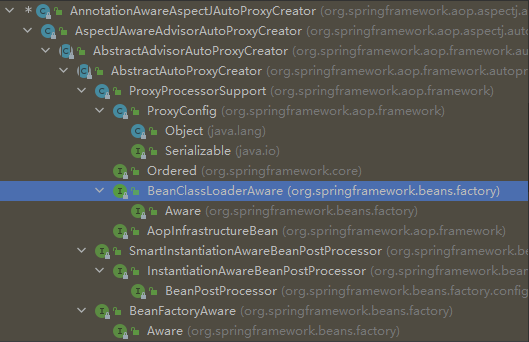

> 使用面向对象编程（OOP）有一些弊端，当需要为多个不具有继承关系的对象引入同一个公共行为时，例如日志、安全检测等，我们只有在每个对象里引用公共行为，这样程序中就产生了大量的重复代码，程序就不便于维护了，所以就有了一个对面向对象编程的补充，即**面向方面编程（AOP）**，AOP 所关注的方向是横向的，不同于 OOP 的纵向。
>
> Spring 2.0 采用 @AspectJ 注解对 POJO 进行标注，从而定义一个包含切点信息和增强横切逻辑的切面。Spring 2.0 可以将这个切面织入到匹配的目标 Bean 中。@AspectJ 注解使用 AspectJ 切点表达式语法进行切点定义，可以通过**切点函数、运算符、通配符**等高级功能进行切点定义，拥有强大的连接点描述能力。

# 1.动态 APO 的自定义标签

在 AopNamespaceHandler 中定义了 AOP 相关自定义标签的解析器，源码如下：

``` java
/**
 * AopNamespaceHandler.java
 */
public class AopNamespaceHandler extends NamespaceHandlerSupport {

	/**
	 * Register the {@link BeanDefinitionParser BeanDefinitionParsers} for the
	 * '{@code config}', '{@code spring-configured}', '{@code aspectj-autoproxy}'
	 * and '{@code scoped-proxy}' tags.
	 */
	@Override
	public void init() {
		// In 2.0 XSD as well as in 2.1 XSD.
		registerBeanDefinitionParser("config", new ConfigBeanDefinitionParser());
		registerBeanDefinitionParser("aspectj-autoproxy", new AspectJAutoProxyBeanDefinitionParser());
		registerBeanDefinitionDecorator("scoped-proxy", new ScopedProxyBeanDefinitionDecorator());

		// Only in 2.0 XSD: moved to context namespace as of 2.1
		registerBeanDefinitionParser("spring-configured", new SpringConfiguredBeanDefinitionParser());
	}

}
```

从上面的源码中可以得知，Spring 在解析 XML 配置文件时，如果遇到了 aspectj-autoproxy 标签，就会使用 AspectJAutoProxyBeanDefinitionParser 解析器进行解析。

## 1.1 注册 AnnotationAwareAspectJAutoProxyCreator

所有解析器，因为是对 BeanDefinitionParser 接口的统一实现，入口都是从 parse 函数开始的，AspectJAutoProxyBeanDefinitionParser 的 parse 方法如下：

``` java
/**
 * AspectJAutoProxyBeanDefinitionParser.java
 * 解析自定义标签
 */
public BeanDefinition parse(Element element, ParserContext parserContext) {
    // 注册 AnnotationAwareAspectJAutoProxyCreator
    AopNamespaceUtils.registerAspectJAnnotationAutoProxyCreatorIfNecessary(parserContext, element);
    // 对于注解中子类的处理
    extendBeanDefinition(element, parserContext);
    return null;
}
```

其中 registerAspectJAnnotationAutoProxyCreatorIfNecessary 方法是关键逻辑的实现，源码如下：

``` java
/**
 * AopNamespaceUtils.java
 * 注册 AnnotationAwareAspectJAutoProxyCreator
 */
public static void registerAspectJAnnotationAutoProxyCreatorIfNecessary(
			ParserContext parserContext, Element sourceElement) {
    // 注册或升级 AnnotationAwareAspectJAutoProxyCreator
    BeanDefinition beanDefinition = AopConfigUtils.registerAspectJAnnotationAutoProxyCreatorIfNecessary(
        parserContext.getRegistry(), parserContext.extractSource(sourceElement));
    // 对于 proxy-target-class 以及 expose-proxy 属性的处理
    useClassProxyingIfNecessary(parserContext.getRegistry(), sourceElement);
    // 注册组件并通知，便于监听器做进一步处理
    // 其中 beanDefinition 的 className 为 AnnotationAwareAspectJAutoProxyCreator
    registerComponentIfNecessary(beanDefinition, parserContext);
}
```

在 registerAspectJAnnotationAutoProxyCreatorIfNecessary 方法中主要完成了 3 件事情：

1. 注册或升级 AnnotationAwareAspectJAutoProxyCreator；
2. 对 proxy-target-class 以及 expose-proxy 属性的处理；
3. 注册组件并通知。

### 1.1.1 注册或升级 AnnotationAwareAspectJAutoProxyCreator

对于 AOP 的实现，基本上都是靠 AnnotationAwareAspectJAutoProxyCreator 去完成，它可以根据 @Point 注解定义的切点来自动代理相匹配的 bean。但是为了配置简便，Spring 使用了自定义配置来帮助我们自动注册 AnnotationAwareAspectJAutoProxyCreator，其注册过程就是在这里实现的。

``` java
/**
 * AopNamespaceUtils.java
 * 注册 AnnotationAwareAspectJAutoProxyCreator
 */
public static BeanDefinition registerAspectJAnnotationAutoProxyCreatorIfNecessary(
			BeanDefinitionRegistry registry, @Nullable Object source) {
    return registerOrEscalateApcAsRequired(AnnotationAwareAspectJAutoProxyCreator.class, registry, source);
}

/**
 * AopNamespaceUtils.java
 * 创建自动代理创建器
 */
private static BeanDefinition registerOrEscalateApcAsRequired(
			Class<?> cls, BeanDefinitionRegistry registry, @Nullable Object source) {

    Assert.notNull(registry, "BeanDefinitionRegistry must not be null");

    // 如果已经存在了自动代理创建器
    if (registry.containsBeanDefinition(AUTO_PROXY_CREATOR_BEAN_NAME)) {
        BeanDefinition apcDefinition = registry.getBeanDefinition(AUTO_PROXY_CREATOR_BEAN_NAME);
        
        // 且存在的自动代理创建器与现在的不一致
        if (!cls.getName().equals(apcDefinition.getBeanClassName())) {
            int currentPriority = findPriorityForClass(apcDefinition.getBeanClassName());
            int requiredPriority = findPriorityForClass(cls);
            // 那么就根据优先级来判断到底需要使用哪一个代理创建器
            if (currentPriority < requiredPriority) {
                // 改变 bean 最重要的就是改变 bean 所对应的 className 属性
                apcDefinition.setBeanClassName(cls.getName());
            }
        }
        
        // 如果已经存在自动代理创建器并且与将要创建的一致，那么无须再次创建
        return null;
    }

    RootBeanDefinition beanDefinition = new RootBeanDefinition(cls);
    beanDefinition.setSource(source);
    beanDefinition.getPropertyValues().add("order", Ordered.HIGHEST_PRECEDENCE);
    beanDefinition.setRole(BeanDefinition.ROLE_INFRASTRUCTURE);
    registry.registerBeanDefinition(AUTO_PROXY_CREATOR_BEAN_NAME, beanDefinition);
    return beanDefinition;
}
```

以上代码中实现了自动注册 AnnotationAwareAspectJAutoProxyCreator 类的功能，同时这里还涉及了一个优先级的问题，如果已经存在了自动代理创建器，而且存在的自动代理创建器与现在的不一致，那么需要根据优先级来判断到底需要使用哪个。

### 1.1.2 对 proxy-target-class 以及 expose-proxy 属性的处理

useClassProxyingIfNecessary 实现了对 proxy-target-class 以及 expose-proxy 属性的处理。

``` java
/**
 * AopNamespaceUtils.java
 * 处理 proxy-target-class 以及 expose-proxy 属性
 */
private static void useClassProxyingIfNecessary(BeanDefinitionRegistry registry, @Nullable Element sourceElement) {
    if (sourceElement != null) {
        // 对 proxy-target-class 属性的处理
        boolean proxyTargetClass = Boolean.parseBoolean(sourceElement.getAttribute(PROXY_TARGET_CLASS_ATTRIBUTE));
        if (proxyTargetClass) {
            AopConfigUtils.forceAutoProxyCreatorToUseClassProxying(registry);
        }
        
        // 对 expose-proxy 属性的处理
        boolean exposeProxy = Boolean.parseBoolean(sourceElement.getAttribute(EXPOSE_PROXY_ATTRIBUTE));
        if (exposeProxy) {
            AopConfigUtils.forceAutoProxyCreatorToExposeProxy(registry);
        }
    }
}

/**
 * AopConfigUtils.java
 * 处理 proxy-target-class 属性
 */
public static void forceAutoProxyCreatorToUseClassProxying(BeanDefinitionRegistry registry) {
    if (registry.containsBeanDefinition(AUTO_PROXY_CREATOR_BEAN_NAME)) {
        BeanDefinition definition = registry.getBeanDefinition(AUTO_PROXY_CREATOR_BEAN_NAME);
        definition.getPropertyValues().add("proxyTargetClass", Boolean.TRUE);
    }
}

/**
 * AopConfigUtils.java
 * 处理 expose-proxy 属性
 */
public static void forceAutoProxyCreatorToExposeProxy(BeanDefinitionRegistry registry) {
    if (registry.containsBeanDefinition(AUTO_PROXY_CREATOR_BEAN_NAME)) {
        BeanDefinition definition = registry.getBeanDefinition(AUTO_PROXY_CREATOR_BEAN_NAME);
        definition.getPropertyValues().add("exposeProxy", Boolean.TRUE);
    }
}
```

1.**proxy-target-class**：Spring AOP 部分使用 JDK 动态代理或者 CGLIB 来为目标对象创建代理。（建议尽量使用 JDK 的动态代理），**如果被代理的目标对象实现了至少一个接口，则会使用 JDK 动态代理**。所有该目标类型实现的接口都将被代理。若该目标对象没有实现任何接口，则创建一个 CGLIB 代理。如果你希望强制使用 CGLIB 代理，（例如希望代理目标对象的所有方法，而不只是实现自接口的方法）那也可以。但是需要考虑以下两个问题。

- 无法通知（advise）Final方法，因为它们不能被覆写。
- 你需要将CGLIB二进制发行包放在classpath下面。

与之相较，JDK 本身就提供了动态代理，强制使用 CGLIB 代理需要将 \<aop:config\> 的 proxy-target-class 属性设为true：

``` xml
<aop:config proxy-target-class="true">...</aop:config>
```

当需要使用 CGLIB 代理和 @AspectJ 自动代理支持，可以按照以下方式设置 \<aop:aspectj-autoproxy\> 的 proxy-target-class 属性：

``` xml
<aop:aspectj-autoproxy proxy-target-class="true" />
```

2.**JDK 动态代理**：其代理对象必须是某个接口的实现，它是通过在运行期间创建一个接口的实现类来完成对目标对象的代理。

3.**CGLIB 代理**：实现原理类似于 JDK 动态代理，只是它在运行期间生成的代理对象是针对目标类扩展的子类。CGLIB 是高效的代码生成包，底层是依靠 ASM（开源的 Java 字节码编辑类库）操作字节码实现的，性能比 JDK 强。

4.**expose-proxy**：有时候目标对象内部的自我调用将无法实施切面中的增强，如下示例：

``` java
public interface Service {
    void a();
    void b();
}

public class ServiceImpl implements Service {
    
    @Transactional(propagation = Propagation.REQUIRED)
    public void a() {
        this.b();
    }
    
    @Transactional(propagation = Propagation.REQUIRED_NEW)
    public void a() {
		
    }
}
```

此处的this指向目标对象，因此调用 this.b() 将不会执行b事务切面，即不会执行事务增强，因此 b 方法的事务定义 `@Transactional(propagation=Propagation.REQUIRES_NEW)` 将不会实施，为了解决这个问题，我们可以这样做：

``` xml
<aop:aspectj-auto proxyexpose-proxy="true" />
```

然后将以上代码中的 `this.b();` 修改为 `((AService) AopContext.currentProxy()).b();`即可。通过以上的修改便可以完成对a和b方法的同时增强。

# 2.创建 AOP 代理

那么 AnnotationAwareAspectJAutoProxyCreator 是怎么完成 AOP 操作的呢，先来看看 AnnotationAwareAspectJAutoProxyCreator 类的层次结构：



在类的层级中，我们看到 AnnotationAwareAspectJAutoProxyCreator 实现了 BeanPostProcessor 接口，而实现 BeanPostProcessor 后，当 Spring 加载这个 Bean 时会在实例化前调用其 postProcessAfterInitialization 方法，而我们对于 AOP 逻辑的分析也由此开始。
在父类 AbstractAutoProxyCreator 的 postProcessAfterInitialization 中代码如下：

``` java
/**
 * AbstractAutoProxyCreator.java
 * 如果 Bean 被子类标识为要代理的 bean，则使用配置的拦截器创建代理。
 */
@Override
public Object postProcessAfterInitialization(@Nullable Object bean, String beanName) {
    if (bean != null) {
        // 根据给定的 bean 的 class 和 name 构建出一个 key
        // 格式：beanClassName_beanName
        Object cacheKey = getCacheKey(bean.getClass(), beanName);
 		// 如果它适合被代理
        if (this.earlyProxyReferences.remove(cacheKey) != bean) {
            // 封装指定的 bean
            return wrapIfNecessary(bean, beanName, cacheKey);
        }
    }
    return bean;
}

/**
 * AbstractAutoProxyCreator.java
 * 封装需要被代理的 bean
 */
protected Object wrapIfNecessary(Object bean, String beanName, Object cacheKey) {
    // 如果已经处理过直接返回
    if (StringUtils.hasLength(beanName) && this.targetSourcedBeans.contains(beanName)) {
        return bean;
    }
    
    // 无须增强
    if (Boolean.FALSE.equals(this.advisedBeans.get(cacheKey))) {
        return bean;
    }
    
    // 给定 bean 类是否代表一个基础设施类
    // 基础设施类不应代理，或者配置了指定 bean 不需要自动代理
    if (isInfrastructureClass(bean.getClass()) || shouldSkip(bean.getClass(), beanName)) {
        this.advisedBeans.put(cacheKey, Boolean.FALSE);
        return bean;
    }

    // Create proxy if we have advice.
    // 如果存在增强方法则创建代理
    Object[] specificInterceptors = getAdvicesAndAdvisorsForBean(bean.getClass(), beanName, null);
    // 如果获取到了增强方法则需要对增强方法创建代理
    if (specificInterceptors != DO_NOT_PROXY) {
        this.advisedBeans.put(cacheKey, Boolean.TRUE);
        // 创建代理
        Object proxy = createProxy(
            bean.getClass(), beanName, specificInterceptors, new SingletonTargetSource(bean));
        this.proxyTypes.put(cacheKey, proxy.getClass());
        return proxy;
    }

    this.advisedBeans.put(cacheKey, Boolean.FALSE);
    return bean;
}
```

函数中我们已经看到了代理创建的雏形。当然，真正开始之前还需要经过一些判断，比如是否已经处理过或者是否是需要跳过的 bean，而真正创建代理的代码是从 getAdvicesAndAdvisorsForBean 开始的。创建代理主要包含了两个步骤：

1. 获取增强方法或者增强器；
2. 根据获取的增强进行代理。

先看看获取增强方法的实现：

``` java
/**
 * AbstractAdvisorAutoProxyCreator.java
 * 返回是否要代理给定的 bean，需要代理则返回增强方法
 */
@Override
protected Object[] getAdvicesAndAdvisorsForBean(
    Class<?> beanClass, String beanName, @Nullable TargetSource targetSource) {

    List<Advisor> advisors = findEligibleAdvisors(beanClass, beanName);
    if (advisors.isEmpty()) {
        // 增强方法为空，返回 null
        return DO_NOT_PROXY;
    }
    return advisors.toArray();
}

/**
 * AbstractAdvisorAutoProxyCreator.java
 * 获取增强方法
 */
protected List<Advisor> findEligibleAdvisors(Class<?> beanClass, String beanName) {
    // 获取所有的增强方法
    List<Advisor> candidateAdvisors = findCandidateAdvisors();
    // 寻找所有增强方法中适用于 bean 的增强并应用
    List<Advisor> eligibleAdvisors = findAdvisorsThatCanApply(candidateAdvisors, beanClass, beanName);
    extendAdvisors(eligibleAdvisors);
    if (!eligibleAdvisors.isEmpty()) {
        eligibleAdvisors = sortAdvisors(eligibleAdvisors);
    }
    return eligibleAdvisors;
}
```

对于指定 bean 的增强方法的获取一定是包含两个步骤的：

- 获取所有的增强
- 寻找所有增强中适用于bean的增强并应用

那么 findCandidateAdvisors 与 findAdvisorsThatCanApply 便是做了这两件事情。当然，如果无法找到对应的增强器便返回 DO_NOT_PROXY，其中 DO_NOT_PROXY = null。

## 2.1 获取增强器

由于我们分析的是使用注解进行的 AOP，所以对于 findCandidateAdvisors 的实现其实是由 AnnotationAwareAspectJAutoProxyCreator 类完成的，我们继续跟踪 AnnotationAwareAspectJAutoProxyCreator 的 findCandidateAdvisors 方法。

``` java
/**
 * AnnotationAwareAspectJAutoProxyCreator.java
 * 获取所有的增强方法
 */
@Override
protected List<Advisor> findCandidateAdvisors() {
    // Add all the Spring advisors found according to superclass rules.
    // 当使用注解方式配置 AOP 的时候并不是丢弃了对 XML 配置的支持
    // 在这里调用父类方法加载配置文件中的 AOP 声明
    List<Advisor> advisors = super.findCandidateAdvisors();
    // Build Advisors for all AspectJ aspects in the bean factory.
    if (this.aspectJAdvisorsBuilder != null) {
        advisors.addAll(this.aspectJAdvisorsBuilder.buildAspectJAdvisors());
    }
    return advisors;
}
```

AnnotationAwareAspectJAutoProxyCreator 间接继承了 AbstractAdvisorAutoProxyCreator，在实现获取增强的方法中除了保留父类的获取配置文件中定义的增强外，同时添加了获取 Bean 的注解增强的功能，那么其实现正是由 `this.aspectJAdvisorsBuilder.buildAspectJAdvisors()` 来实现的，具体流程如下：

1. 获取所有beanName，这一步骤中所有在beanFacotry中注册的Bean都会被提取出来；
2. 遍历所有beanName，并找出声明AspectJ注解的类，进行进一步的处理；
3. 对标记为AspectJ注解的类进行增强器的提取；
4. 将提取结果加入缓存。

现在我们来看看函数实现，对Spring中所有的类进行分析，提取Advisor：

``` java
/**
 * BeanFactoryAspectJAdvisorsBuilder.java
 * 在当前的 bean 工厂中查找使用了 @Aspect 注解的切面 bean
 * 并返回到代表它们的 Spring AOP 增强方法列表
 */
public List<Advisor> buildAspectJAdvisors() {
    List<String> aspectNames = this.aspectBeanNames;

    if (aspectNames == null) {
        synchronized (this) {
            aspectNames = this.aspectBeanNames;
            if (aspectNames == null) {
                List<Advisor> advisors = new ArrayList<>();
                aspectNames = new ArrayList<>();
                // 获取所有的 beanName
                String[] beanNames = BeanFactoryUtils.beanNamesForTypeIncludingAncestors(
                    this.beanFactory, Object.class, true, false);
                // 循环所有的 beanName 找出对应的增强方法
                for (String beanName : beanNames) {
                    // 不合法的 bean 则略过，由子类定义规则，默认返回 true
                    if (!isEligibleBean(beanName)) {
                        continue;
                    }
                    // We must be careful not to instantiate beans eagerly as in this case they
                    // would be cached by the Spring container but would not have been weaved.
                    // 获取对应的 bean 的类型
                    Class<?> beanType = this.beanFactory.getType(beanName);
                    if (beanType == null) {
                        continue;
                    }
                    // 如果存在 @Aspect 注解
                    if (this.advisorFactory.isAspect(beanType)) {
                        aspectNames.add(beanName);
                        AspectMetadata amd = new AspectMetadata(beanType, beanName);
                        if (amd.getAjType().getPerClause().getKind() == PerClauseKind.SINGLETON) {
                            MetadataAwareAspectInstanceFactory factory =
                                new BeanFactoryAspectInstanceFactory(this.beanFactory, beanName);
                            // 解析使用了 @Aspect 注解 bean 中的增强方法
                            List<Advisor> classAdvisors = this.advisorFactory.getAdvisors(factory);
                            if (this.beanFactory.isSingleton(beanName)) {
                                this.advisorsCache.put(beanName, classAdvisors);
                            }
                            else {
                                this.aspectFactoryCache.put(beanName, factory);
                            }
                            advisors.addAll(classAdvisors);
                        }
                        else {
                            // Per target or per this.
                            if (this.beanFactory.isSingleton(beanName)) {
                                throw new IllegalArgumentException("Bean with name '" + beanName +
                                                                   "' is a singleton, but aspect instantiation model is not singleton");
                            }
                            MetadataAwareAspectInstanceFactory factory =
                                new PrototypeAspectInstanceFactory(this.beanFactory, beanName);
                            this.aspectFactoryCache.put(beanName, factory);
                            advisors.addAll(this.advisorFactory.getAdvisors(factory));
                        }
                    }
                }
                this.aspectBeanNames = aspectNames;
                return advisors;
            }
        }
    }

    if (aspectNames.isEmpty()) {
        return Collections.emptyList();
    }
    // 记录在缓存中
    List<Advisor> advisors = new ArrayList<>();
    for (String aspectName : aspectNames) {
        List<Advisor> cachedAdvisors = this.advisorsCache.get(aspectName);
        if (cachedAdvisors != null) {
            advisors.addAll(cachedAdvisors);
        }
        else {
            MetadataAwareAspectInstanceFactory factory = this.aspectFactoryCache.get(aspectName);
            advisors.addAll(this.advisorFactory.getAdvisors(factory));
        }
    }
    return advisors;
}
```

至此，我们已经完成了 Advisor 的提取，在上面的步骤中最为重要也最为繁杂的就是增强器的获取。而这一功能委托给了 getAdvisors 方法去实现 `this.advisorFactory.getAdvisors(factory)`：

``` java
/**
 * ReflectiveAspectJAdvisorFactory.java
 * 为指定切面的实例上的所有带 AspcetJ 注解的方法创建增强方法
 */
@Override
public List<Advisor> getAdvisors(MetadataAwareAspectInstanceFactory aspectInstanceFactory) {
    // 获取标记为 AspectJ 的类
    Class<?> aspectClass = aspectInstanceFactory.getAspectMetadata().getAspectClass();
    // 获取标记为 AspectJ 的 name
    String aspectName = aspectInstanceFactory.getAspectMetadata().getAspectName();
    // 验证
    validate(aspectClass);

    // We need to wrap the MetadataAwareAspectInstanceFactory with a decorator
    // so that it will only instantiate once.
    MetadataAwareAspectInstanceFactory lazySingletonAspectInstanceFactory =
        new LazySingletonAspectInstanceFactoryDecorator(aspectInstanceFactory);

    List<Advisor> advisors = new ArrayList<>();
    for (Method method : getAdvisorMethods(aspectClass)) {
        Advisor advisor = getAdvisor(method, lazySingletonAspectInstanceFactory, advisors.size(), aspectName);
        if (advisor != null) {
            advisors.add(advisor);
        }
    }

    // If it's a per target aspect, emit the dummy instantiating aspect.
    if (!advisors.isEmpty() && lazySingletonAspectInstanceFactory.getAspectMetadata().isLazilyInstantiated()) {
        // 如果寻找的增强器不为空，而且又配置了增强延迟初始化
        // 那么需要在首位加入同步实例化增强器
        Advisor instantiationAdvisor = new SyntheticInstantiationAdvisor(lazySingletonAspectInstanceFactory);
        advisors.add(0, instantiationAdvisor);
    }

    // Find introduction fields.
    // 获取 DeclareParents 注解
    for (Field field : aspectClass.getDeclaredFields()) {
        Advisor advisor = getDeclareParentsAdvisor(field);
        if (advisor != null) {
            advisors.add(advisor);
        }
    }

    return advisors;
}
```

函数中首先完成了对增强器的获取，包括获取注解以及根据注解生成增强的步骤，然后考虑到在配置中可能会将增强配置成延迟初始化，那么需要在首位加入同步实例化增强器以保证增强使用之前的实例化，最后是对 DeclareParents 注解的获取。

### 2.1.1 普通增强器的获取

普通增强器的获取逻辑通过 getAdvisor 方法实现，实现步骤包括对切点的注解的获取以及根据注解信息生成增强。

``` java
/**
 * ReflectiveAspectJAdvisorFactory.java
 * 为给定的切面方法生成增强器
 */
@Override
@Nullable
public Advisor getAdvisor(Method candidateAdviceMethod, MetadataAwareAspectInstanceFactory aspectInstanceFactory,
                          int declarationOrderInAspect, String aspectName) {

    validate(aspectInstanceFactory.getAspectMetadata().getAspectClass());

    // 切点信息获取
    AspectJExpressionPointcut expressionPointcut = getPointcut(candidateAdviceMethod, aspectInstanceFactory.getAspectMetadata().getAspectClass());
    if (expressionPointcut == null) {
        return null;
    }
	// 根据切点信息生成增强器
    return new InstantiationModelAwarePointcutAdvisorImpl(expressionPointcut, candidateAdviceMethod, this, aspectInstanceFactory, declarationOrderInAspect, spectName);
}
```

1.切点信息的获取：所谓获取切点信息就是指定注解的表达式信息的获取，如 `@Before("test()")`。

``` java
/**
 * ReflectiveAspectJAdvisorFactory.java
 * 切点信息的获取
 */
@Nullable
private AspectJExpressionPointcut getPointcut(Method candidateAdviceMethod, Class<?> candidateAspectClass) {
    // 获取方法上的注解
    AspectJAnnotation<?> aspectJAnnotation = AbstractAspectJAdvisorFactory.findAspectJAnnotationOnMethod(candidateAdviceMethod);
    if (aspectJAnnotation == null) {
        return null;
    }
    // 使用 AspectJExpressionPointcut 实例封装获取的信息
    AspectJExpressionPointcut ajexp =
        new AspectJExpressionPointcut(candidateAspectClass, new String[0], new Class<?>[0]);
    // 获取得到的注解中的表达式
    // 如：@Pointcut("execution(* *.*test*(..))") 中的 execution(* *.*test*(..))
    ajexp.setExpression(aspectJAnnotation.getPointcutExpression());
    if (this.beanFactory != null) {
        ajexp.setBeanFactory(this.beanFactory);
    }
    return ajexp;
}

/**
 * AbstractAspectJAdvisorFactory.java
 * 找到并返回方法上的第一个 AspectJ 注解
 */
@SuppressWarnings("unchecked")
@Nullable
protected static AspectJAnnotation<?> findAspectJAnnotationOnMethod(Method method) {
    for (Class<?> clazz : ASPECTJ_ANNOTATION_CLASSES) {
        AspectJAnnotation<?> foundAnnotation = findAnnotation(method, (Class<Annotation>) clazz);
        if (foundAnnotation != null) {
            return foundAnnotation;
        }
    }
    return null;
}

/**
 * AbstractAspectJAdvisorFactory.java
 * 获取指定方法上的注解并使用 AspectJAnnotation 封装
 */
@Nullable
private static <A extends Annotation> AspectJAnnotation<A> findAnnotation(Method method, Class<A> toLookFor) {
    A result = AnnotationUtils.findAnnotation(method, toLookFor);
    if (result != null) {
        return new AspectJAnnotation<>(result);
    }
    else {
        return null;
    }
}
```

2.根据切点信息生成增强：所有的增强都由 Advisor 的实现类 InstantiationModelAwarePointcutAdvisorImpl 同一封装。

``` java
/**
 * InstantiationModelAwarePointcutAdvisorImpl.java
 * InstantiationModelAwarePointcutAdvisorImpl 类的构造方法
 */
public InstantiationModelAwarePointcutAdvisorImpl(AspectJExpressionPointcut declaredPointcut, Method aspectJAdviceMethod, AspectJAdvisorFactory aspectJAdvisorFactory, MetadataAwareAspectInstanceFactory aspectInstanceFactory, int declarationOrder, String aspectName) {

    this.declaredPointcut = declaredPointcut;
    this.declaringClass = aspectJAdviceMethod.getDeclaringClass();
    this.methodName = aspectJAdviceMethod.getName();
    this.parameterTypes = aspectJAdviceMethod.getParameterTypes();
    this.aspectJAdviceMethod = aspectJAdviceMethod;
    this.aspectJAdvisorFactory = aspectJAdvisorFactory;
    this.aspectInstanceFactory = aspectInstanceFactory;
    this.declarationOrder = declarationOrder;
    this.aspectName = aspectName;

    if (aspectInstanceFactory.getAspectMetadata().isLazilyInstantiated()) {
        // Static part of the pointcut is a lazy type.
        Pointcut preInstantiationPointcut = Pointcuts.union(
            aspectInstanceFactory.getAspectMetadata().getPerClausePointcut(), this.declaredPointcut);

        // Make it dynamic: must mutate from pre-instantiation to post-instantiation state.
        // If it's not a dynamic pointcut, it may be optimized out
        // by the Spring AOP infrastructure after the first evaluation.
        this.pointcut = new PerTargetInstantiationModelPointcut(
            this.declaredPointcut, preInstantiationPointcut, aspectInstanceFactory);
        this.lazy = true;
    }
    else {
        // A singleton aspect.
        this.pointcut = this.declaredPointcut;
        this.lazy = false;
        this.instantiatedAdvice = instantiateAdvice(this.declaredPointcut);
    }
}
```

在封装过程中只是简单地将信息封装在类的实例中，所有的信息单纯地赋值，在实例初始化的过程中还完成了对于增强器的初始化。因为不同的增强所体现的逻辑是不同的，比如 `@Before("test()")` 与 `@After("test()")` 标签的不同就是增强器增强的位置不同，所以就需要不同的增强器来完成不同的逻辑，而根据注解中的信息初始化对应的增强器就是在 instantiateAdvice 函数中实现的。

``` java
/**
 * InstantiationModelAwarePointcutAdvisorImpl.java
 * 初始化增强器
 */
private Advice instantiateAdvice(AspectJExpressionPointcut pointcut) {
    Advice advice = this.aspectJAdvisorFactory.getAdvice(this.aspectJAdviceMethod, pointcut, this.aspectInstanceFactory, this.declarationOrder, this.aspectName);
    return (advice != null ? advice : EMPTY_ADVICE);
}

/**
 * ReflectiveAspectJAdvisorFactory.java
 * 为给定的切面方法生成增强器
 */
@Override
@Nullable
public Advice getAdvice(Method candidateAdviceMethod, AspectJExpressionPointcut expressionPointcut, MetadataAwareAspectInstanceFactory aspectInstanceFactory, int declarationOrder, String aspectName) {

    Class<?> candidateAspectClass = aspectInstanceFactory.getAspectMetadata().getAspectClass();
    validate(candidateAspectClass);

    AspectJAnnotation<?> aspectJAnnotation =
        AbstractAspectJAdvisorFactory.findAspectJAnnotationOnMethod(candidateAdviceMethod);
    if (aspectJAnnotation == null) {
        return null;
    }

    // If we get here, we know we have an AspectJ method.
    // Check that it's an AspectJ-annotated class
    if (!isAspect(candidateAspectClass)) {
        throw new AopConfigException("Advice must be declared inside an aspect type: " +
                                     "Offending method '" + candidateAdviceMethod + "' in class [" +
                                     candidateAspectClass.getName() + "]");
    }

    if (logger.isDebugEnabled()) {
        logger.debug("Found AspectJ method: " + candidateAdviceMethod);
    }

    AbstractAspectJAdvice springAdvice;
	// 根据不同的注解类型封装不同的增强器
    switch (aspectJAnnotation.getAnnotationType()) {
        case AtPointcut:
            if (logger.isDebugEnabled()) {
                logger.debug("Processing pointcut '" + candidateAdviceMethod.getName() + "'");
            }
            return null;
        case AtAround:
            springAdvice = new AspectJAroundAdvice(
                candidateAdviceMethod, expressionPointcut, aspectInstanceFactory);
            break;
        case AtBefore:
            springAdvice = new AspectJMethodBeforeAdvice(
                candidateAdviceMethod, expressionPointcut, aspectInstanceFactory);
            break;
        case AtAfter:
            springAdvice = new AspectJAfterAdvice(
                candidateAdviceMethod, expressionPointcut, aspectInstanceFactory);
            break;
        case AtAfterReturning:
            springAdvice = new AspectJAfterReturningAdvice(
                candidateAdviceMethod, expressionPointcut, aspectInstanceFactory);
            AfterReturning afterReturningAnnotation = (AfterReturning) aspectJAnnotation.getAnnotation();
            if (StringUtils.hasText(afterReturningAnnotation.returning())) {
                springAdvice.setReturningName(afterReturningAnnotation.returning());
            }
            break;
        case AtAfterThrowing:
            springAdvice = new AspectJAfterThrowingAdvice(
                candidateAdviceMethod, expressionPointcut, aspectInstanceFactory);
            AfterThrowing afterThrowingAnnotation = (AfterThrowing) aspectJAnnotation.getAnnotation();
            if (StringUtils.hasText(afterThrowingAnnotation.throwing())) {
                springAdvice.setThrowingName(afterThrowingAnnotation.throwing());
            }
            break;
        default:
            throw new UnsupportedOperationException(
                "Unsupported advice type on method: " + candidateAdviceMethod);
    }

    // Now to configure the advice...
    springAdvice.setAspectName(aspectName);
    springAdvice.setDeclarationOrder(declarationOrder);
    String[] argNames = this.parameterNameDiscoverer.getParameterNames(candidateAdviceMethod);
    if (argNames != null) {
        springAdvice.setArgumentNamesFromStringArray(argNames);
    }
    springAdvice.calculateArgumentBindings();

    return springAdvice;
}
```

从函数中可以看到，Spring 会根据不同的注解生成不同的增强器。

- MethodBeforeAdviceInterceptor

``` java
/**
 * MethodBeforeAdviceInterceptor.java
 * 包装 MethodBeforeAdvice 类的拦截器
 */
@SuppressWarnings("serial")
public class MethodBeforeAdviceInterceptor implements MethodInterceptor, BeforeAdvice, Serializable {

	private final MethodBeforeAdvice advice;


	/**
	 * Create a new MethodBeforeAdviceInterceptor for the given advice.
	 * @param advice the MethodBeforeAdvice to wrap
	 */
	public MethodBeforeAdviceInterceptor(MethodBeforeAdvice advice) {
		Assert.notNull(advice, "Advice must not be null");
		this.advice = advice;
	}


	@Override
	public Object invoke(MethodInvocation mi) throws Throwable {
		this.advice.before(mi.getMethod(), mi.getArguments(), mi.getThis());
		return mi.proceed();
	}

}
```

其中的属性 MethodBeforeAdvice 代表着前置增强的 AspectJMethodBeforeAdvice，跟踪 before 方法：

``` java
/**
 * AspectJMethodBeforeAdvice.java
 * 调用给定方法之前的回调
 */
@Override
public void before(Method method, Object[] args, @Nullable Object target) throws Throwable {
    invokeAdviceMethod(getJoinPointMatch(), null, null);
}

/**
 * AbstractAspectJAdvice.java
 * 调用增强方法
 */
protected Object invokeAdviceMethod(
    @Nullable JoinPointMatch jpMatch, @Nullable Object returnValue, @Nullable Throwable ex)
    throws Throwable {

    return invokeAdviceMethodWithGivenArgs(argBinding(getJoinPoint(), jpMatch, returnValue, ex));
}

/**
 * AbstractAspectJAdvice.java
 * 实现对增强方法的调用
 */
protected Object invokeAdviceMethodWithGivenArgs(Object[] args) throws Throwable {
    Object[] actualArgs = args;
    if (this.aspectJAdviceMethod.getParameterCount() == 0) {
        actualArgs = null;
    }
    try {
        ReflectionUtils.makeAccessible(this.aspectJAdviceMethod);
        // TODO AopUtils.invokeJoinpointUsingReflection
        // 激活增强方法
        return this.aspectJAdviceMethod.invoke(this.aspectInstanceFactory.getAspectInstance(), actualArgs);
    }
    catch (IllegalArgumentException ex) {
        throw new AopInvocationException("Mismatch on arguments to advice method [" +
                                         this.aspectJAdviceMethod + "]; pointcut expression [" +
                                         this.pointcut.getPointcutExpression() + "]", ex);
    }
    catch (InvocationTargetException ex) {
        throw ex.getTargetException();
    }
}
```

invokeAdviceMethodWithGivenArgs 方法中的 aspectJAdviceMethod 正是对于前置增强的方法，在这里实现了调用。

- AspectJAfterAdvice

后置增强与前置增强有稍许不一致的地方。回顾之前讲过的前置增强，大致的结构是在拦截器链中放置 MethodBeforeAdviceInterceptor，而在 MethodBeforeAdviceInterceptor 中又放置了 AspectJMethodBeforeAdvice，并在调用 invoke 时首先串联调用。但是在后置增强的时候却不一样，没有提供中间的类，而是直接在拦截器链中使用了中间的 AspectJAfterAdvice。

``` java
/**
 * AspectJAfterAdvice.java
 * Spring AOP 后置通知包装类
 */
public class AspectJAfterAdvice extends AbstractAspectJAdvice
		implements MethodInterceptor, AfterAdvice, Serializable {

	public AspectJAfterAdvice(
			Method aspectJBeforeAdviceMethod, AspectJExpressionPointcut pointcut, AspectInstanceFactory aif) {

		super(aspectJBeforeAdviceMethod, pointcut, aif);
	}


	@Override
	public Object invoke(MethodInvocation mi) throws Throwable {
		try {
			return mi.proceed();
		}
		finally {
            // 激活增强方法
			invokeAdviceMethod(getJoinPointMatch(), null, null);
		}
	}

	@Override
	public boolean isBeforeAdvice() {
		return false;
	}

	@Override
	public boolean isAfterAdvice() {
		return true;
	}

}
```

### 2.2.2 增强同步实例化增强器

如果寻找的增强器不为空而且又配置了增强延迟初始化，那么就需要在首位加入同步实例化增强器。同步实例化增强器 SyntheticInstantiationAdvisor 如下：

``` java
/**
 * ReflectiveAspectJAdvisorFactory.java
 * 同步实例化增强器
 */
protected static class SyntheticInstantiationAdvisor extends DefaultPointcutAdvisor {

    public SyntheticInstantiationAdvisor(final MetadataAwareAspectInstanceFactory aif) {
        // 目标方法前调用，类似 @Before
        super(aif.getAspectMetadata().getPerClausePointcut(), (MethodBeforeAdvice)
              // 简单初始化 aspect
              (method, args, target) -> aif.getAspectInstance());
    }
}
```

### 2.2.3 获取 DeclareParents 注解

DeclareParents 主要用于引介增强的注解形式的实现，而其实现方式与普通增强很类似，只不过使用 DeclareParentsAdvisor 对功能进行封装。

``` java
/**
 * ReflectiveAspectJAdvisorFactory.java
 * 获取 DeclareParents 注解
 */
@Nullable
private Advisor getDeclareParentsAdvisor(Field introductionField) {
    DeclareParents declareParents = introductionField.getAnnotation(DeclareParents.class);
    if (declareParents == null) {
        // Not an introduction field
        return null;
    }

    if (DeclareParents.class == declareParents.defaultImpl()) {
        throw new IllegalStateException("'defaultImpl' attribute must be set on DeclareParents");
    }

    return new DeclareParentsAdvisor(
        introductionField.getType(), declareParents.value(), declareParents.defaultImpl());
}
```

