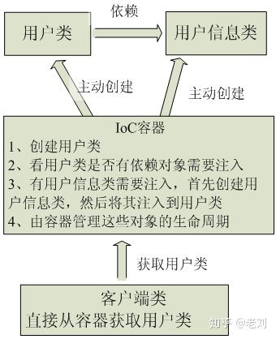

# Spring IOC和DI简单理解

## 1.IOC是什么

Ioc—Inversion of Control，即“控制反转”，不是什么技术，而是一种设计思想。在Java开发中，IOC意味着将你设计好的对象交给容器控制，而不是传统的在你的对象内部直接控制。如何理解好IOC呢？理解好Ioc的关键是要明确“谁控制谁，控制什么，为何是反转（有反转就应该有正转了），哪些方面反转了”，那我们来深入分析一下：

①谁控制谁，控制什么：传统Java SE程序设计，我们直接在对象内部通过new进行创建对象，是程序主动去创建依赖对象；而IOC是有专门一个容器来创建这些对象，即由IOC容器来控制对象的创建；谁控制谁？当然是IOC 容器控制了对象；控制什么？主要控制了程序外部资源的获取（不只是对象包括比如文件等）。

②为何是反转，哪些方面反转了：有反转就有正转，传统应用程序是由我们自己在对象中主动控制去直接获取依赖对象，也就是正转；而反转则是由容器来帮忙创建及注入依赖对象；为何是反转？因为由容器帮我们查找及注入依赖对象，对象只是被动的接受依赖对象，所以是反转；哪些方面反转了？依赖对象的获取被反转了。

IOC是spring的核心，贯穿始终。所谓IOC，对于spring框架来说，就是由spring来负责控制对象的生命周期和对象间的关系。这是什么意思呢，举个简单的例子，我们是如何找女朋友的？常见的情况是，我们到处去看哪里有长得漂亮身材又好的mm，然后打听她们的兴趣爱好、qq号、电话号、ip号、iq号………，想办法认识她们，投其所好送其所要，然后嘿嘿……这个过程是复杂深奥的，我们必须自己设计和面对每个环节。传统的程序开发也是如此，在一个对象中，如果要使用另外的对象，就必须得到它（自己new一个，或者从JNDI中查询一个），使用完之后还要将对象销毁（比如Connection等），对象始终会和其他的接口或类藕合起来。

用图例说明一下，传统程序设计如图，都是主动去创建相关对象然后再组合起来：

传统应用程序示意图

IOC不是一种技术，只是一种思想，一个重要的面向对象编程的法则，它能指导我们如何设计出松耦合、更优良的程序。传统应用程序都是由我们在类内部主动创建依赖对象，从而导致类与类之间高耦合，难于测试；有了IOC容器后，把创建和查找依赖对象的控制权交给了容器，由容器进行注入组合对象，所以对象与对象之间是松散耦合，这样也方便测试，利于功能复用，更重要的是使得程序的整个体系结构变得非常灵活。

其实IOC对编程带来的最大改变不是从代码上，而是从思想上，发生了“主从换位”的变化。应用程序原本是老大，要获取什么资源都是主动出击，但是在IOC/DI思想中，应用程序就变成被动的了，被动的等待IOC容器来创建并注入它所需要的资源了。IOC很好的体现了面向对象设计法则之一——好莱坞法则：“别找我们，我们找你”；即由IOC容器帮对象找相应的依赖对象并注入，而不是由对象主动去找。

那么IOC是如何做的呢？有点像通过婚介找女朋友，在我和女朋友之间引入了一个第三者：婚姻介绍所。婚介管理了很多男男女女的资料，我可以向婚介提出一个列表，告诉它我想找个什么样的女朋友，比如长得像李嘉欣，身材像林熙雷，唱歌像周杰伦，速度像卡洛斯，技术像齐达内之类的，然后婚介就会按照我们的要求，提供一个mm，我们只需要去和她谈恋爱、结婚就行了。简单明了，如果婚介给我们的人选不符合要求，我们就会抛出异常。整个过程不再由我自己控制，而是有婚介这样一个类似容器的机构来控制。Spring所倡导的开发方式就是如此，所有的类都会在spring容器中登记，告诉spring你是个什么东西，你需要什么东西，然后spring会在系统运行到适当的时候，把你要的东西主动给你，同时也把你交给其他需要你的东西。所有的类的创建、销毁都由 spring来控制，也就是说控制对象生存周期的不再是引用它的对象，而是spring。对于某个具体的对象而言，以前是它控制其他对象，现在是所有对象都被spring控制，所以这叫控制反转。

当有了IOC/DI的容器后，在客户端类中不再主动去创建这些对象了，如图所示：

## 2.IOC和DI

DI—Dependency Injection，即“依赖注入”：组件之间依赖关系由容器在运行期决定，形象的说，即由容器动态的将某个依赖关系注入到组件之中。依赖注入的目的并非为软件系统带来更多功能，而是为了提升组件重用的频率，并为系统搭建一个灵活、可扩展的平台。通过依赖注入机制，我们只需要通过简单的配置，而无需任何代码就可指定目标需要的资源，完成自身的业务逻辑，而不需要关心具体的资源来自何处，由谁实现。理解DI的关键是：“谁依赖谁，为什么需要依赖，谁注入谁，注入了什么”，那我们来深入分析一下：

①谁依赖于谁：当然是应用程序依赖于IOC容器；

②为什么需要依赖：应用程序需要IOC容器来提供对象需要的外部资源；

③谁注入谁：很明显是IOC容器注入应用程序某个对象，应用程序依赖的对象；

④注入了什么：就是注入某个对象所需要的外部资源（包括对象、资源、常量数据）。

IOC和DI由什么关系呢？其实它们是同一个概念的不同角度描述，由于控制反转概念比较含糊（可能只是理解为容器控制对象这一个层面，很难让人想到谁来维护对象关系），所以2004年大师级人物Martin Fowler又给出了一个新的名字：“依赖注入”，相对IOC 而言，“依赖注入”明确描述了“被注入对象依赖IoC容器配置依赖对象”。

IOC的一个重点是在系统运行中，动态的向某个对象提供它所需要的其他对象。这一点是通过DI（Dependency Injection，依赖注入）来实现的。比如对象A需要操作数据库，以前我们总是要在A中自己编写代码来获得一个Connection对象，有了spring我们就只需要告诉spring，A中需要一个Connection，至于这个Connection怎么构造，何时构造，A不需要知道。在系统运行时，spring会在适当的时候制造一个Connection，然后像打针一样，注射到A当中，这样就完成了对各个对象之间关系的控制。A需要依赖 Connection才能正常运行，而这个Connection是由spring注入到A中的，依赖注入的名字就这么来的。那么DI是如何实现的呢？ Java 1.3之后一个重要特征是反射（reflection），它允许程序在运行的时候动态的生成对象、执行对象的方法、改变对象的属性，spring就是通过反射来实现注入的。

## 3.我对Spring IOC和DI的理解

在我们传统的Java开发当中，如果我们的业务中需要依赖某个外部对象，那么我们就需要在业务代码中通过new的方式主动地去创建这个依赖对象，创建依赖对象的主动权就掌握在自己的手里，创建依赖对象的时机也由自己去把控。而这样的做法就使得对象和对象之间产生了紧密的耦合关系，而通常情况下这都不是我们想要的。

当我们使用了Spring之后，创建对象的工作就由Spring的IOC容器去完成，当我们的业务中需要使用到某个外部依赖对象时，Spring通过DI的方式把这个依赖对象注入到我们的业务代码当中，我们只要在业务代码中直接使用这个对象就行了。至于Spring容器是怎么创建、何时创建依赖对象的，我们的业务代码并不需要关心，并且依赖对象的生命周期是完全有Spring容器来控制的。

引入Spring之后，业务在依赖外部对象有一个角色的转变，由主动创建对象变成被动注入对象，对象的控制被反转了。而我们的业务和外部依赖对象之间的关系也由强耦合，变成了松耦合，这才是我们想要的结果。

> **控制反转（IOC）**：通过容器来控制对象的生命周期，并由容器来查找和注入应用程序所依赖的外部对象，应用程序只是被动的接受依赖的外部对象，应用程序所依赖对象的获取方式被反转了。
>
> **依赖注入（DI）**：应用程序依赖容器来提供需要的外部对象，所以是由容器将依赖的外部对象注入到应用程序当中。

