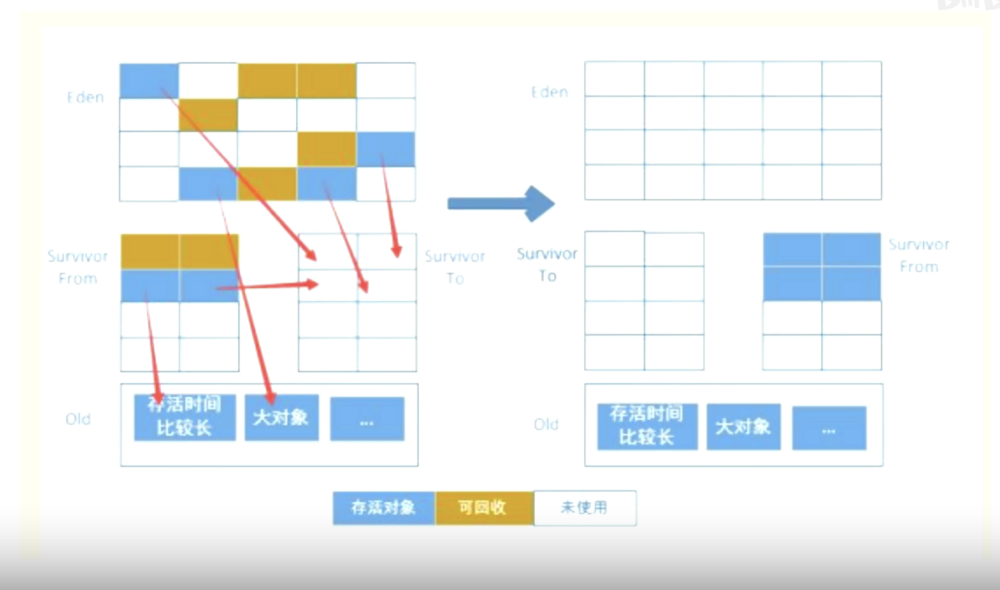

# Java后端常见的面试问题

## 1.Jvm对象何时会进入老年代？



MinorGC 过程：首先会对 Eden 和 Survivor From 区的对象进行标记，然后将 Eden 和 Survivor From 区存活下来的对象复制到 Survivor To 区，然后把空的 Survivor From 区转换为 Survivor To，Survivor To 区转换为 Survivor From。MinorGC 就是重复以上的过程。

那么对象何时会进入老年代呢，分为以下四种情况：

**1.对象年龄**

对象的对象头中有个位置会存放对象的回收年龄，每经历一次 MinorGC 后，对象没被回收，对象的年龄 +1；

当某个对象连续回收 15 次之后，仍然存活，那么直接进入老年代空间；

默认是年龄到 15 次进入老年代，可以通过 `-XX:MaxTenurigThreshold` 进行配置，最大只能配置到 15。

因为对象头中只用了 4bit 的空间来存放对象回收年龄的，所以最大只能配置到15。

**2.动态对象年龄判断**

在一次 MinorGC 后，如果 Survivor 区内从分代年龄 1 到分代年龄为 n 的对象总内存 (M1+M2+...+Mn) >= 50% 的 Survivor 区的总内存，那么可以直接将分代年龄 >= n 的对象直接放到老年代。

**3.大对象直接进入老年代**

因为新生代采用的是复制算法，并且 GC 比较频繁，为了避免存在大量大对象时会降低回收的效率，采用了大对象直接进入老年代的策略，防止大对象长时间在新生代存活，影响 GC 效率。通过 `-XX:PretenureSizeThreshold` 配置大对象，大于这个配置的对象将直接进入老年代。

**4.Survivor区域对象空间不足**

在一次 MinorGC 时，如果出现 Eden 区和 Survivor From 区存活下来的对象总内存大于 Survivor To 区的总内存，那么就会把这些存活下来的对象直接复制到老年代。

## 2.线上几百万消息积压如何处理？

思路：增加消息队列和消费者的数量，提高并发消费积压消息的能力。

1. 要确保 consumer 没有问题，能够正常的消费消息，然后将现有的 consumer 都停止消费消息；
2. 建立 10 倍或 20 倍于原先消息队列数量的临时消息队列；
3. 写一个用于消费积压消息的临时 consumer 程序，这个程序消费积压的消息后不做处理，直接发布到建立的临时消息队列中；
4. 征用与临时队列数量相同数量的机器来部署 consumer，保证每一个 consumer 都可以消费一个临时队列中的消息；
5. 这种临时方案可以将消息消费的速度扩大到 10 倍至 20 倍，就可以快速的处理积压的消息。


## 3.Mq如何保证消息发送成功不丢失？

**1.生产者确认机制**

生产者在把消息发送给 Broker 后，Broker 会在消息保存到磁盘后或者完成副本同步之后给发送方返回一个消息发送成功确认，如果生产者在规定的时间内没有收到 Broker 的消息发送成功确认，那么生产者可以采取重试机制，这样就能保证消息发送不丢失，但是可能会导致消息重复发送。

**2.消费者确认机制**

消费者在收到一条消息并处理完之后，再去更新消息的 offset 值，这样就能保证消息在成功处理完之后，才去确认，保证了消息不会丢失。但是更新消息的 offset 值有可能会失败的情况，可能会导致消息重复消费。

以上两种确认机制都有可能会导致消息重复，所以要保证消费者在消费消息时具备幂等性。

## 4.秒杀系统如何解决超卖等常见问题？

**1.高并发**

通过 Redis 保存商品的库存信息，当用户进行秒杀抢购的时候，直接对 Redis 里面保存的库存数量进行扣减，扣减成功之后，再将扣减成功的消息发送到消息队列，然后由订单服务、支付服务等服务异步去处理这些消息，最后再对 MySQL 保存的库存信息扣减，这样既能缓解 MySQL 的压力，同时也保证了数据的最终一致。

**2.解决超卖**

将库存名额加载到 Redis，必须保证精确计数，否则可能会导致超卖问题，秒杀扣减库存时分为如下两个步骤：

1. 判断库存是否充足；
2. 扣减库存，扣减成功就是秒杀成功。

必须要保证以上两个步骤操作的原子性，所以可以使用 Lua 脚本来实现这两个步骤，Redis 能够保证 Lua 脚本执行的原子性。

**3.解决少卖**

如果在 Redis 扣减库存成功了，但是扣减成功的消息发送到消息队列却失败了，那么订单服务就无法生成订单，就会导致少卖的情况。

所以在扣减库存成功之后，发送消息到消息队列要支持重试策略。如果发送消失败则进行重试，超过重试次数后，要将发送失败的消息持久化到 MySQL，再由补偿服务来进行后续的业务处理。

## 5.Mysql的count(*)和count(1)谁更快？

**1.MySQL中统计行数的三种写法**

- `count(*)`：计算所有数据中包含 null 值的行数；
- `count(1)`：计算所有数据中包含 null 值的行数；
- `count(列名)`：计算指定列中不包含 null 值的行数。

**2.哪个快？**

InnoDB 下 `count(*)` 和 `count(1)` 一样快，快于 `count(列名)`。

InnoDB 通过遍历最小可用的二级索引来处理语句，如果二级索引不存在，则会扫描聚簇索引。

Myisam 下 `count(*)` 快于或者等于 `count(1)`，快于 `count(列名)`。

Myisam 储存了表的总行数，如果是使用 `count(*)` 不走统计，直接读取，所以最快。如果是使用 `count(1)` 并且第一列为 `not null` 时，也会直接读取总行数。

`count(列名)` 因为只统计不为 null 值的行数，所以要遍历整张表的数据，所以是最慢的。

## 6.Http与Rpc到底是什么区别？

RPC 是一种方式、模式，要实现 RPC 调用肯定是需要协议的，HTTP 就是其中的一种，Dubbo 协议也是其中的一种。

**1.传输协议**

RPC 可以基于 TCP 协议也可以基于 HTTP 协议，RPC 的主要目的是获取由远程服务器上的程序所执行的结果。

利用 Socket API 实现基于 TCP 协议的 RPC 调用，由服务的调用方与服务的提供方建立 Socket 连接，并由服务的调用方通过 Socket 将需要调用的接口名称、方法名称和参数序列化后传递给服务的提供方，服务的提供方反序列化后再利用反射机制调用相关的方法，最后将结果返回给服务的调用方。

HTTP 基于 TCP/IP 协议属于 OSI 的第七层。

**2.传输效率**

RPC：使用自定义的 TCP 协议，可以让请求报文体积更小，或者使用 HTTP2.0 协议，也可以很好的减少报文的体积，提高传输效率；

HTTP：如果是基于 HTTP1.1 的协议，请求中会包含很多无用的内容，如果是基于 HTTP2.0 协议，那么简单的封装一下是可以作为一个 RPC 来使用的，这是标准 RPC 框架更多的是服务治理。

**3.性能消耗**

RPC：可以基于 thrift 实现高效的二进制传输；

HTTP：大部分是通过 json 来实现的，字节大小和序列化耗时都比 thrift 要更消耗性能。

**4.负载均衡**

RPC：基本自带了负载均衡策略；

HTTP：需要通过 Nginx、HAProxy 等服务来实现负载均衡。

## 7.Mysql的undo日志的回滚段是什么？

**1.回滚段**

MySQL 采用回滚段的方式来对 undo log 进行管理，每个回滚段里面有 1024 个 undo log segment，undo 页就是在一个 undo log segment 中进行申请。目前 MySQL 最大支持 128 个回滚段，而每个回滚段里面又有 1024 个 undo log segment，所以 MySQL 同时支持的事务最大数量达到 128 * 1024 个。可以通过参数 `innodb_undo_logs` 来设置回滚段的数量。

**2.undo页的重用**

当开启一个事务需要写 undo log 的时候，首先去 undo log segment 中去找到一个空闲位置，然后申请 undo 页，在这个申请页中进行 undo log 的写入。MySQL 默认一页的大小是 16K，假设为每一个事务分配一个页，是非常浪费的，假设你的应用 TPS 为 1000，那么 1s 就需要 1000 个页，大概需要 16M 的磁盘容量来储存，1 分钟大概需要 1G 的磁盘容量来储存。这样下去随着时间的推移，磁盘空间会增长的非常快，而且很多空间是浪费的。

undo 页采用了重用机制，当事务提交时，并不会立刻删除 undo 页。因为重用，所以这个 undo 页可能混杂这其他事务的 undo log。undo log 在 commit 后，会被放到一个链表中，然后判断 undo 页的使用空间是否小于 3/4，如果小于 3/4 的话，则表示当前的 undo 页可以被重用，那么它就不会被回收，其它事务的 undo log 可以记录在当前 undo 页的后面。由于 undo log 是离散的，所以清理对应的磁盘空间时，效率不高。

**3.回滚段与事务的关系**

1. 每个事务只会使用一个回滚段，一个回滚段又会在同一时刻服务于多个事务；
2. 当一个事务开始的时候，会指定一个回滚段，事务进行的过程中，当数据发生修改，原始的数据会复制到回滚段；
3. 在回滚段中，事务会不断的填充盘区，直到事务结束或所有的空间被用完。如果当前的盘区不够用，事务会在段中请求扩展下一个盘区，如果所有已分配的盘区都被用完，事务会覆盖最初的盘区或者在回滚段允许的情况下扩展新的盘区来使用；
4. 回滚段存在于 undo 表空间中，在数据库中可以存在多个 undo 表空间，但同一个时刻只能使用一个 undo 表空间；
5. 当事务提交时，InnoDB 储存引擎会做以下两件事情：
    - 将 undo log 放入列表中，以供之后的 purge 清洗操作
    - 判断 undo log 所在的页是否可以重用（低于 3/4 可以重用），若可以分配给下一个事务使用。

## 8.Spring事务常见失效场景？

**1.抛出受检异常**

``` java
@Service
public class Service {
    
    @Autowired
    private UserService userService;
    
    @Transactional
    public boolean add(User user) throws FileNotFoundException {
		boolean success = userService.save(user);
        new FileInputStream("temp.txt");
        return success;
    }
}
```

**失败原因**：Spring 默认只会回滚非检查异常和 error 异常。

**解决方案**：配置 `@Transactional(rollbackFor = Exception.class)`，抛出任何异常，事务都要回滚。

**2.业务代码捕获了异常**

``` java
@Service
public class Service {
    
    @Autowired
    private UserService userService;
    
    @Transactional
    public boolean add(User user) throws FileNotFoundException {
		boolean success = userService.save(user);
		
        try {
            int i = 1 / 0;
        } catch (Exception e) {
            
        }
        
        return success;
    }
}
```

**失效原因**：Spring 事务只有捕获到了业务代码抛出去的异常，才能进行后续的处理，如果业务自己捕获了异常，则事务无法感知。

**解决方案**：

1. 将异常原样抛出，或者不对异常进行 `try-catch`，直接抛出异常；
2. 设置：`TransactionAspectSupport.currentTransactionStatus().setRollbackOnly();`，设置事务切面的支持，进行异常的回滚。

**3.切面顺序导致**

``` java
public Object around(ProceedingJoinPoin pjp) {
    
    try {
        // 切面逻辑
        return pjp.proceed();
    } catch (Throwable throwable) {
        
    }
    
    return null;
}
```

**失效原因**：Spring 事务切面的优先级顺序最低，但如果自定义的切面优先级和事务切面一样，且自定义切面捕获了异常，则会同业务自己捕获异常的场景一样。

**解决方案**：

1. 在切面中将异常原样抛出；
2. 在切面中设置：`TransactionAspectSupport.currentTransactionStatus().setRollbackOnly();`

**4.非public方法**

``` java
@Service
public class Service {
    
    @Autowired
    private UserService userService;
    
    @Transactional
    protected boolean save(User user) {
        boolean success = userService.save(user);

        try {
            int i = 1 / 0;
        } catch (Exception e) {

        }

        return success;
    }
}
```

**失败原因**：Spring 事务默认生效的方法权限都必须为 public。

**解决方案**：

1. 将方法改为 public；
2. 修改 `TransactionAttributeSource`，将 `publicMethodOnly` 改成 `false`；
3. 开启 `AspectJ` 代理模式。

## 9.Redis大key如何处理？

**1.什么是Redis大key**

- string 类型的值大于 10KB；
- hash、list、set、zset 元素个数超过 5000 个。

**2.如何找到大key**

- string 类型通过命令查找

  ``` bash
  redis-cli -h localhost -p6379 -a "password" --bigkeys
  ```

- RdbTools 工具

  ``` bash
  rdb dump.rdb -c memory --bytes 10240 -f redis.csv
  ```

**3.如何删除大key**

因为 Redis 是单线程执行的，如果直接删除大 key 会造成 Redis I/O 阻塞，阻塞期间，其它所有请求可能都会超时。超时越来越多，会造成 Redis 连接耗尽，产生各种异常。

Redis 大 key 删除方式：

1. 低峰期删除；
2. 分批次删除：
   - hash：使用 `hscan` 扫描法；
   - set：使用 `srandmember` 每次随机取数进行删除；
   - zset：使用 `zremrangebyrank` 直接删除；
   - list：直接 `pop` 即可。
3. 异步删除法：用 `unlink` 代替 `del` 来删除，这样 Redis 会将这个 key 放入到一个异步线程中，进行删除，这样就不会阻塞主线程。

