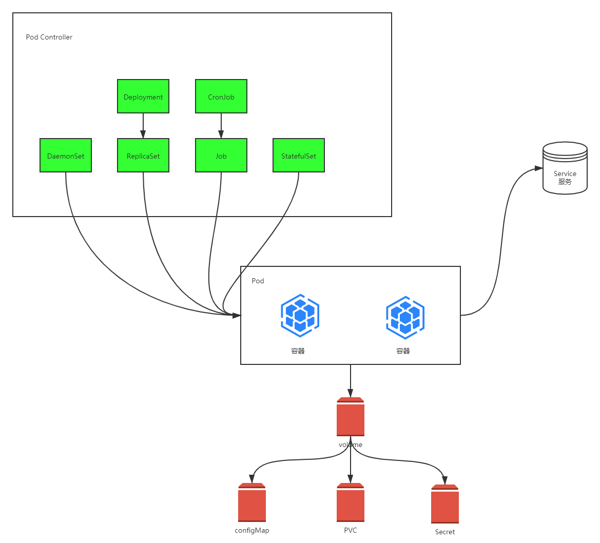

# 1.资源管理介绍

- 在 Kubernetes 中，所有的内容都抽象为资源，用户需要通过操作资源来管理 Kubernetes。

> - Kubernetes 的本质就是一个集群系统，用户可以在集群中部署各种服务。所谓的部署服务，其实就是在 Kubernetes 集群中运行一个个的容器，并将指定的程序跑在容器中。
>
> - Kubernetes 的最小管理单元是 Pod 而不是容器，所以只能将容器放在 `Pod` 中，而 Kubernetes 一般也不会直接管理 Pod，而是通过 `Pod控制器` 来管理 Pod 的。
>
> - Pod 提供服务之后，就需要考虑如何访问 Pod 中的服务，Kubernetes 提供了 `Service` 资源实现这个功能。
>
> - 当然，如果 Pod 中程序的数据需要持久化，Kubernetes 还提供了各种 `存储` 系统。



>  学习 kubernets 的核心，就是学习如何对集群中的 `Pod`、`Pod控制器`、`Service`、`存储`等各种资源进行操作。

# 2.YAML语法介绍

## 2.1 YAML语法介绍

YAML 是一个类似于 XML、JSON 的标记性语言。它强调的是以“数据”为中心，并不是以标记语言为重点。因而 YAML 本身的定义比较简单，号称是“一种人性化的数据格式语言”。

- YAML的语法比较简单，主要有下面的几个：

- - 大小写敏感。

- - 使用缩进表示层级关系。

- - 缩进不允许使用tab，只允许空格（低版本限制）。

- - 缩进的空格数不重要，只要相同层级的元素左对齐即可。

- - ‘#’表示注释。

- YAML支持以下几种数据类型：

- - 纯量：单个的、不能再分的值。

- - 对象：键值对的集合，又称为映射/哈希/字典。

- - 数组：一组按次序排列的值，又称为序列/列表。


## 2.2 YAML语法示例

### 2.2.1 YAML常量

``` yaml
#常量，就是指的是一个简单的值，字符串、布尔值、整数、浮点数、NUll、时间、日期
# 布尔类型
c1: true
# 整型
c2: 123456
# 浮点类型
c3: 3.14
# null类型
c4: ~ # 使用~表示null
# 日期类型
c5: 2019-11-11 # 日期类型必须使用ISO 8601格式，即yyyy-MM-dd
# 时间类型
c6: 2019-11-11T15:02:31+08.00 # 时间类型使用ISO 8601格式，时间和日期之间使用T连接，最后使用+代表时区
# 字符串类型
c7: haha # 简单写法，直接写值，如果字符串中间有特殊符号，必须使用双引号或单引号包裹
c8: line1
    line2 # 字符串过多的情况可以折成多行，每一行都会转换成一个空格
```

### 2.2.2 对象

```yaml
# 对象
# 形式一（推荐）：
user:   
    name: silence
    age: 16
# 形式二（了解）：
user: { name: silence, age: 18 }
```

### 2.2.3 数组

```yaml
# 数组
# 形式一（推荐）：
address:
    - 江苏
    - 北京
# 形式二（了解）：
address: [江苏,上海]
```

> 小提示：
>
> 1. 书写 yaml 切记 `:` 后面要加一个空格；
> 2. 如果需要将多段 yaml 配置放在一个文件中，中间要使用 `---` 分隔；
> 3. 可以用 [json2yaml](http://json2yaml.com/convert-yaml-to-json) 检验 yaml 是否书写正确。

# 3.资源管理方式

## 3.1 资源管理方式

- 命令式对象管理：直接使用命令去操作 kubernetes 的资源。

```bash
$ kubectl run nginx-pod --image=nginx:1.17.1 --port=80
```

- 命令式对象配置：通过命令配置和配置文件去操作 kubernetes 的资源。

```bash
$ kubectl create/patch -f nginx-pod.yaml
```

- 声明式对象配置：通过 apply 命令和配置文件去操作 kubernetes 的资源。apply 用于创建和更新资源，有就更新，没有就创建。

```bash
$ kubectl apply -f nginx-pod.yaml
```

| 类型           | 操作 | 适用场景 | 优点           | 缺点                               |
| -------------- | ---- | -------- | -------------- | ---------------------------------- |
| 命令式对象管理 | 对象 | 测试     | 简单           | 只能操作活动对象，无法审计、跟踪   |
| 命令式对象配置 | 文件 | 开发     | 可以审计、跟踪 | 项目大的时候，配置文件多，操作麻烦 |
| 声明式对象配置 | 目录 | 开发     | 支持目录操作   | 意外情况下难以调试                 |

## 3.2 命令式对象管理

### 3.2.1 kubectl命令

kubect l是 kubernetes 集群的命令行工具，通过它能够对集群本身进行管理，并能够在集群上进行容器化应用的安装和部署。

kubectl 命令的语法如下：

```bash
kubectl [command] [type] [name] [flags]
```

> - command：指定要对资源执行的操作，比如 create、get、delete。
> - type：指定资源的类型，比如 deployment、pod、service。
> - name：指定资源的名称，名称大小写敏感。
> - flags：指定额外的可选参数。

1.示例：查看所有的 pod

```bash
$ kubectl get pod
```

2.示例：查看某个pod

```bash
$ kubectl get pod <pod_name>
```

3.示例：查看某个pod，以yaml格式展示结果

```bash
$ kubectl get pod <pod_name> -o yaml
```

### 3.2.2 操作（command）

kubernetes 允许对资源进行多种操作，可以通过 --help 查看详细的操作命令：

```bash
$ kubectl --help
```

经常使用的操作如下所示：

1.基本命令

| 命令    | 翻译 | 命令作用     |
| ------- | ---- | ------------ |
| create  | 创建 | 创建一个资源 |
| edit    | 编辑 | 编辑一个资源 |
| get     | 获取 | 获取一个资源 |
| patch   | 更新 | 更新一个资源 |
| delete  | 删除 | 删除一个资源 |
| explain | 解释 | 展示资源文档 |

2.运行和调试

| 命令      | 翻译     | 命令作用                   |
| --------- | -------- | -------------------------- |
| run       | 运行     | 在集群中运行一个指定的镜像 |
| expose    | 暴露     | 暴露资源为 Service         |
| describe  | 描述     | 显示资源内部信息           |
| logs      | 日志     | 输出容器在 Pod 中的日志    |
| attach    | 缠绕     | 进入运行中的容器           |
| exec      | 执行     | 执行容器中的一个命令       |
| cp        | 复制     | 在 Pod 内外复制文件        |
| rollout   | 首次展示 | 管理资源的发布             |
| scale     | 规模     | 扩（缩）容 Pod 的数量      |
| autoscale | 自动调整 | 自动调整 Pod 的数量        |

3.高级命令

| 命令  | 翻译 | 命令作用               |
| ----- | ---- | ---------------------- |
| apply | 应用 | 通过文件对资源进行配置 |
| label | 标签 | 更新资源上的标签       |

4.其他命令

| 命令         | 翻译     | 命令作用                         |
| ------------ | -------- | -------------------------------- |
| cluster-info | 集群信息 | 显示集群信息                     |
| version      | 版本     | 显示当前 Client 和 Server 的版本 |

### 3.2.3 资源类型（type）

kubernetes 中所有的内容都抽象为资源，可以通过下面的命令进行查看：

```bash
$ kubectl api-resources
```

经常使用的资源如下所示：

1.集群级别资源：

| 资源名称   | 缩写 | 资源作用     |
| ---------- | ---- | ------------ |
| nodes      | no   | 集群组成部分 |
| namespaces | ns   | 隔离Pod      |

2.Pod资源：

| 资源名称 | 缩写 | 资源作用 |
| -------- | ---- | -------- |
| Pods     | po   | 装载容器 |

3.Pod资源控制器：

| 资源名称                 | 缩写   | 资源作用    |
| ------------------------ | ------ | ----------- |
| replicationcontrollers   | rc     | 控制Pod资源 |
| replicasets              | rs     | 控制Pod资源 |
| deployments              | deploy | 控制Pod资源 |
| daemonsets               | ds     | 控制Pod资源 |
| jobs                     |        | 控制Pod资源 |
| cronjobs                 | cj     | 控制Pod资源 |
| horizontalpodautoscalers | hpa    | 控制Pod资源 |
| statefulsets             | sts    | 控制Pod资源 |

4.服务发现资源：

| 资源名称 | 缩写 | 资源作用        |
| -------- | ---- | --------------- |
| services | svc  | 统一Pod对外接口 |
| ingress  | ing  | 统一Pod对外接口 |

5.存储资源：

| 资源名称               | 缩写 | 资源作用 |
| ---------------------- | ---- | -------- |
| volumeattachments      |      | 存储     |
| persistentvolumes      | pv   | 存储     |
| persistentvolumeclaims | pvc  | 存储     |

6.配置资源：

| 资源名称   | 缩写 | 资源作用 |
| ---------- | ---- | -------- |
| configmaps | cm   | 配置     |
| secrets    |      | 配置     |

### 3.2.4 应用示例

1.示例：创建一个 namespace

```bash
$ kubectl create namespace dev
```

2.示例：获取 namespace

```bash
$ kubectl get namespace
```

3.示例：在刚才创建的 namespace 下创建并运行一个 Nginx 的 Pod

```bash
$ kubectl run nginx --image=nginx:1.17.1 -n dev
```

4.示例：查看名为 dev 的 namespace 下的所有 Pod，如果不加 -n，默认就是 default 的 namespace

```bash
$ kubectl get pods -n dev
```

5.示例：删除指定 namespace 下的指定 Pod

```bash
$ kubectl delete pod nginx -n dev
```

6.示例：删除指定的 namespace

```bash
$ kubectl delete namespace dev
```

