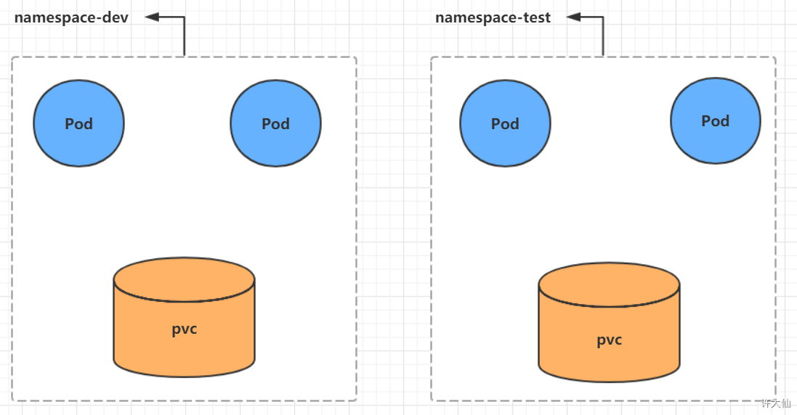
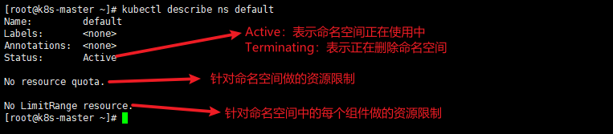
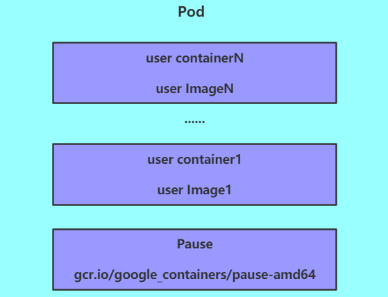
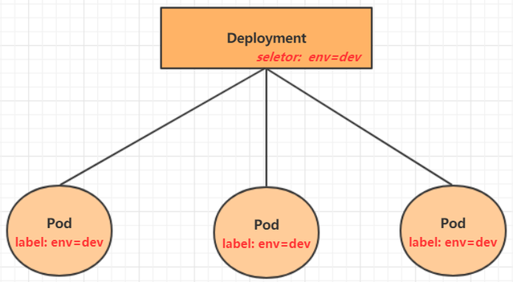
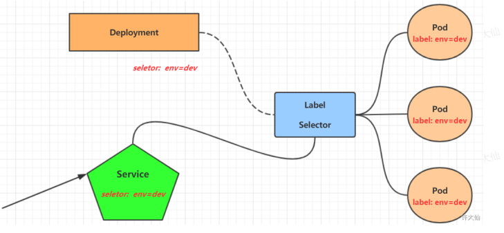
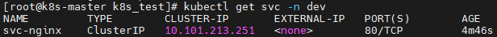
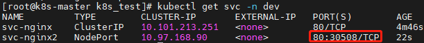
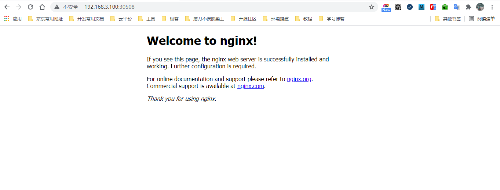

# 1.Namespace

## 1.1 概述

Namespace 是 kubernetes 系统中一种非常重要的资源，它的主要作用是用来实现 `多套系统的资源隔离 `或者 `多租户的资源隔离`。

默认情况下，kubernetes 集群中的所有 Pod 都是可以相互访问的。但是在实际中，可能不想让两个 Pod 之间进行互相的访问，那么此时就可以将两个 Pod 划分到不同的 Namespace 下。kubernetes 通过将集群内部的资源分配到不同的 Namespace 中，可以形成逻辑上的“组”，以方便不同的组的资源进行隔离使用和管理。

可以通过 kubernetes 的授权机制，将不同的 Namespace 交给不同租户进行管理，这样就实现了多租户的资源隔离。此时还能结合 kubernetes 的资源配额机制，限定不同租户能占用的资源，例如 CPU 使用量、内存使用量等等，来实现租户可用资源的管理。



kubernetes 在集群启动之后，会默认创建几个 namespace：

```bash
$ kubectl get namespace
```

> - default：所有未指定的 Namespace 的对象都会被分配在 default 命名空间。
>
> - kube-node-lease：集群节点之间的心跳维护，v1.13 开始引入。
>
> - kube-public：此命名空间的资源可以被所有人访问（包括未认证用户）。
>
> - kube-system：所有由 kubernetes 系统创建的资源都处于这个命名空间。

## 1.2 应用示例

1.示例：查看所有的命名空间

```bash
$ kubectl get namespace

# 简写形式
$ kubectl get ns
```

2.示例：查看指定的命名空间

```bash
$ kubectl get namespace default

# 简写形式
$ kubectl get ns default
```

3.示例：指定命名空间的输出格式

表格形式

```bash
$ kubectl get ns default -o wide
```

json 格式

```bash
$ kubectl get ns default -o json
```

yaml 格式

```bash
$ kubectl get ns default -o yaml
```

4.示例：查看命名空间的详情

```bash
$ kubectl describe namespace default

# 简写形式
$ kubectl describe ns default
```



5.示例：创建命名空间

```bash
$ kubectl create namespace dev

# 简写形式
$ kubectl create ns dev
```

6.示例：删除命名空间

```bash
$ kubectl delete ns dev
```

7.示例：命令式对象配置

①新建ns-dev.yaml：

```yaml
apiVersion: v1
kind: Namespace
metadata:
  name: dev
```

②通过命令式对象配置进行创建：

```bash
$ kubectl create -f ns-dev.yaml
```

③通过命令式对象配置进行删除：

```bash
$ kubectl delete -f ns-dev.yaml
```

# 2.Pod

## 2.1 概述

Pod 是 kubernetes 集群进行管理的最小单元，程序要运行必须部署在容器中，而容器必须存在于 Pod 中。

Pod 可以认为是容器的封装，一个 Pod 中可以存在一个或多个容器。



kubernetes 在集群启动之后，集群中的各个组件也是以 Pod 方式运行的，可以通过下面的命令查看：

``` bash
$ kubectl get pod -n kube-system
NAME                                 READY   STATUS    RESTARTS   AGE
# dns 相关组件
coredns-558bd4d5db-k8wdk             1/1     Running   4          9d
coredns-558bd4d5db-l6nmm             1/1     Running   4          9d

# master 节点运行的四个组件：存放资源的组件
etcd-k8s-master                      1/1     Running   4          9d

# master 节点运行的四个组件：访问入口
kube-apiserver-k8s-master            1/1     Running   4          9d

# master 节点运行的四个组件：执行组件
kube-controller-manager-k8s-master   1/1     Running   4          9d

# 每个节点都会运行的组件：网络代理组件
kube-proxy-4x6pw                     1/1     Running   4          9d
kube-proxy-snqxx                     1/1     Running   3          9d

# master 节点运行的四个组件：资源调度
kube-scheduler-k8s-master            1/1     Running   4          9d

# 每个节点都会运行的组件：网络组件
weave-net-cc2fb                      2/2     Running   10         9d
weave-net-gsgtg                      2/2     Running   7          9d
```

## 2.2 语法及应用示例

1.语法：创建并运行 Pod

```bash
$ kubectl run <Pod的名称> [参数]
# --image 指定 Pod 的镜像
# --port 指定端口
# --namespace 指定 namespace
```

示例：在名称为dev的namespace下创建一个Nginx的Pod

```bash
$ kubectl run nginx --image=nginx:1.17.1 --port=80 --namespace=dev
```

2.语法： 查询所有Pod的基本信息

```bash
$ kubectl get pods [-n 命名空间的名称]
```

示例：查询名称为 dev 的 namespace 下的所有 Pod 的基本信息

```bash
$ kubectl get pods -n dev
```

3.语法：查看Pod的详细信息

```bash
$ kubectl describe pod <pod的名称> [-n 命名空间名称]
```

示例：查看名称为 dev 的 namespace 下的 Pod 的名称为 nginx 的详细信息

```bash
$ kubectl describe pod nginx -n dev
```

4.语法：Pod 的访问

获取 Pod 的 IP

```bash
$ kubectl get pods [-n dev] -o wide
```

通过 curl 访问

```bash
curl ip:端口
```

示例：访问 Nginx 的 Pod

```bash
$ kubectl get pod -n dev -o wide
NAME    READY   STATUS    RESTARTS   AGE     IP          NODE
nginx   1/1     Running   0          8m10s   10.44.0.3   k8s-node-1
```

示例：通过 curl 访问

```bash
$ curl 10.44.0.3
<!DOCTYPE html>
<html>
<head>
<title>Welcome to nginx!</title>
<style>
    body {
        width: 35em;
        margin: 0 auto;
        font-family: Tahoma, Verdana, Arial, sans-serif;
    }
</style>
</head>
<body>
<h1>Welcome to nginx!</h1>
<p>If you see this page, the nginx web server is successfully installed and
working. Further configuration is required.</p>

<p>For online documentation and support please refer to
<a href="http://nginx.org/">nginx.org</a>.<br/>
Commercial support is available at
<a href="http://nginx.com/">nginx.com</a>.</p>

<p><em>Thank you for using nginx.</em></p>
</body>
</html>
```

5.语法：删除指定的 Pod

```bash
$ kubectl delete pod <pod的名称> [-n 命名空间]
```

示例：删除 Nginx 的 Pod

```bash
$ kubectl delete pod nginx -n dev
```

6.示例：命令式对象配置

①新建 pod-nginx.yaml：

```yaml
apiVersion: v1
kind: Pod
metadata:
  name: nginx
  namespace: dev
spec:
  containers:
  - image: nginx:1.17.1
    imagePullPolicy: IfNotPresent
    name: pod
    ports: 
    - name: nginx-port
      containerPort: 80
      protocol: TCP
```

②执行创建：

```bash
$ kubectl create -f pod-nginx.yaml
```

③删除命令：

```bash
$ kubectl delete -f pod-nginx.yaml
```

# 3.Label

## 3.1 概述

Label 是 kubernetes 的一个重要概念。它的作用就是**在资源上添加标识，用来对它们进行区分和选择**。

Label 的特点：

- 一个 Label 会以 key/value 键值对的形式附加到各种对象上，如 Node、Pod、Service 等。
- 一个资源对象可以定义任意数量的 Label，同一个 Label 也可以被添加到任意数量的资源对象上去。
- Label 通常在资源对象定义时确定，当然也可以在对象创建后动态的添加或删除。

可以通过 Label 实现资源的多纬度分组，以便灵活、方便地进行资源分配、调度、配置和部署等管理工作。

> 一些常用的Label标签示例如下：
>
> - 版本标签：“version”:”release”,”version”:”stable”
>
> - 环境标签：“environment”:”dev”,“environment”:”test”,“environment”:”pro”
>
> - 架构标签：“tier”:”frontend”,”tier”:”backend”

标签定义完毕之后，还要考虑到标签的选择，这就要用到 Label Selector，即：

- Label 用于给某个资源对象定义标识。
- Label Selector 用于查询和筛选拥有某些标签的资源对象。

当前有两种 Label Selector：

- 基于等式的 Label Selector。
  - `name=slave`：选择所有包含 Label 中的 key=“name” 并且 value=“slave” 的对象。
  - `env!=production`：选择所有包含 Label 中的 key=“name” 并且 value!=“production” 的对象。

- 基于集合的 Label Selector。
  - `name in (master,slave)`：选择所有包含 Label 中的 key=“name” 并且 value=“master” 或 value=“slave” 的对象。
  - `name not in (master,slave)`：选择所有包含 Label 中的 key=“name” 并且 value!=“master” 和 value!=“slave” 的对象。

标签的选择条件可以使用多个，此时将多个 Label Selector 进行组合，使用逗号英文逗号 `,` 进行分隔即可：

> name=salve,env!=production。
>
> name not in (master,slave),env!=production。

## 3.2 语法及应用示例

1.语法：为资源打标签

```bash
$ kubectl label pod <pod的名称> key=value [-n 命名空间]
```

示例：为 Nginx 的 Pod 打上标签

```bash
$ kubectl label pod nginx version=1.0 -n dev
```

2.语法：更新资源的标签

```bash
$ kubectl label pod <pod的名称> key=value [-n 命名空间] --overwrite
```

示例：为 Nginx 的 Pod 更新标签

```bash
$ kubectl label pod nginx version=2.0 -n dev --overwrite
```

3.语法：查看标签

```bash
$ kubectl get pod <pod的名称> [-n 命名空间] --show-labels
```

示例：显示 Nginx 的 Pod 的标签

```bash
$ kubectl get pod nginx -n dev --show-labels
```

4.语法：筛选标签

```bash
$ kubectl get pod -l key=value [-n 命名空间] --show-labels
```

示例：筛选版本号是 2.0 的在名称为 dev 的 namespace 下的 Pod

```bash
$ kubectl get pod -l version=2.0 -n dev --show-labels
```

5.语法：删除标签

```bash
$ kubectl label pod <pod的名称> key- [-n 命名空间]
```

示例：删除名称为 dev 的 namespace 下的 Nginx 的 Pod 上的标签

```bash
$ kubectl label pod nginx version- -n dev
```

6.示例：命令式对象配置

①新建 pod-nginx.yaml：

```yaml
apiVersion: v1
kind: Pod
metadata:
  name: nginx
  namespace: dev
  labels:
    # 添加了两个标签 version 和 env
    version: "3.0"
    env: "test"        
spec:
  containers:
  - image: nginx:1.17.1
    imagePullPolicy: IfNotPresent
    name: pod
    ports: 
    - name: nginx-port
      containerPort: 80
      protocol: TCP
```

②执行创建：

```bash
$ kubectl create -f pod-nginx.yaml
```

③删除命令：

```bash
$ kubectl delete -f pod-nginx.yaml
```

# 4.Deployment

## 4.1 概述

在 kubernetes 中，Pod 是最小的控制单元，但是 kubernetes 很少直接控制 Pod，一般都是通过 Pod 控制器来完成的。

Pod 控制器用于 Pod 的管理，确保 Pod 资源符合预期的状态，当 Pod 的资源出现故障的时候，会尝试进行重启或重建 Pod。

在 kubernetes 中 Pod 控制器的种类有很多，本章节只介绍一种：Deployment。



## 4.2 语法及应用示例

> 特别注意：在 v1.18 版之后，kubectl run nginx --image=nginx --replicas=2 --port=80，会反馈 Flag --replicas has been deprecated, has no effect and will be removed in the future，并且只会创建一个 Nginx 容器实例。

1.语法：创建指定名称的 deployement

```bash
$ kubectl create deployment <deployment的名称> [-n 命名空间]
```

简写

```bash
$ kubectl create deploy xxx [-n 命名空间]
```

示例：在名称为 dev 的命名空间下创建名为 nginx 的 deployment

```bash
$ kubectl create deployment nginx --image=nginx:1.17.1 -n dev
```

2.语法：根据指定的 deplyment 创建 Pod

```bash
$ kubectl scale deployment <deployment的名称> [--replicas=正整数] [-n 命名空间]
```

示例：在名称为 dev 的命名空间下根据名为 nginx 的 deployment 创建 4 个 Pod

```bash
$ kubectl scale deployment nginx --replicas=4 -n dev
```

3.语法：命令式对象配置

①创建一个 deploy-nginx.yaml，内容如下：

```yaml
apiVersion: apps/v1
kind: Deployment
metadata:
  name: nginx
  namespace: dev
spec:
  replicas: 3
  selector:
    matchLabels:
      run: nginx
  template:
    metadata:
      labels:
        run: nginx
    spec:
      containers:
      - image: nginx:1.17.1
        name: nginx
        ports:
        - containerPort: 80
          protocol: TCP
```

②执行创建：

```bash
$ kubectl create -f deploy-nginx.yaml
```

③删除命令：

```bash
$ kubectl delete -f deploy-nginx.yaml
```

4.语法：查看创建的 Pod

```bash
$ kubectl get pods [-n 命名空间]
```

示例：查看名称为 dev 的 namespace 下通过 deployment 创建的 3 个 Pod

```bash
$ kubectl get pods -n dev
```

5.语法：查看 deployment 的信息

```bash
$ kubectl get deployment [-n 命名空间]
```

简写

```bash
$ kubectl get deploy [-n 命名空间]
```

示例：查看名称为 dev 的 namespace 下的 deployment

```bash
$ kubectl get deployment -n dev
```

6.语法：查看 deployment 的详细信息

```bash
$ kubectl describe deployment <deployment的名称> [-n 命名空间]
```

简写

```bash
$ kubectl describe deploy <deployment的名称> [-n 命名空间]
```

示例：查看名为 dev 的 namespace 下的名为 nginx 的 deployment 的详细信息

```bash
$ kubectl describe deployment nginx -n dev
```

7.语法：删除 deployment

```bash
$ kubectl delete deployment <deployment的名称> [-n 命名空间]
```

简写

```bash
$ kubectl delete deploy <deployment的名称> [-n 命名空间]
```

示例：删除名为 dev 的 namespace 下的名为 nginx 的 deployment

```bash
$ kubectl delete deployment nginx -n dev
```

# 5.Service

## 5.1 概述

我们已经能够利用 Deployment 来创建一组 Pod 来提供具有高可用性的服务，虽然每个 Pod 都会分配一个单独的 Pod 的 IP 地址，但是却存在如下的问题：

1. Pod 的 IP 会随着 Pod 的重建产生变化；
2. Pod 的 IP 仅仅是集群内部可见的虚拟的 IP，外部无法访问。

这样对于访问这个服务带来了难度，因此，kubernetes 设计了 Service 来解决这个问题。

Service 可以看做是一组同类的 **Pod 对外的访问接口**，借助 Service，应用可以方便的实现**服务发现和负载均衡**。



## 5.2 语法及应用示例

### 5.2.1 创建集群内部可访问的 Service

1.语法：暴露 Service

会产生一个 CLUSTER-IP，这个就是 service 的 IP，在 Service 的生命周期内，这个地址是不会变化的

```bash
$ kubectl expose deployment <deployment的名称> --name=<服务名> --type=ClusterIP --port=<暴露的端口> --target-port=<指向集群中的Pod的端口> [-n 命名空间]
```

示例：暴露名为 dev 的 namespace 下的名为 nginx 的 deployment，并设置服务名为 svc-nginx

```bash
$ kubectl expose deployment nginx --name=svc-nginx --type=ClusterIP --port=80 --target-port=80 -n dev
```

2.语法：查看 Service

```bash
$ kubectl get service [-n 命名空间] [-o wide]
```

示例：查看名为 dev 的命名空间的所有 Service

```bash
$ kubectl get service -n dev
```



### 5.2.2 创建集群外部可访问的 Service

1.语法：暴露 Service

会产生一个外部也可以访问的 Service

```bash
$ kubectl expose deployment <deployment的名称> --name=<服务名> --type=NodePort --port=<暴露的端口> --target-port=<指向集群中的Pod的端口> [-n 命名空间]
```

示例：暴露名为 dev 的 namespace 下的名为 nginx 的 deployment，并设置服务名为 svc-nginx2

```bash
$ kubectl expose deploy nginx --name=svc-nginx2 --type=NodePort --port=80 --target-port=80 -n dev
```

2.查看 Service

``` bash
$ kubectl get svc -n dev
```



3.用宿主机浏览器访问 nginx



### 5.2.3 删除服务

语法：删除服务

```bash
$ kubectl delete service <service的名称> [-n 命名空间]
```

示例：删除服务

```bash
$ kubectl delete service svc-nginx2 -n dev
```

### 5.2.4 对象配置方式

示例：对象配置方式

①新建 svc-nginx.yaml，内容如下：

```yaml
apiVersion: v1
kind: Service
metadata:
  name: svc-nginx-1
  namespace: dev
spec:
  ports:
  - port: 80
    protocol: TCP
    targetPort: 80
  selector:
    run: nginx
  type: ClusterIP

---

apiVersion: v1
kind: Service
metadata:
  name: svc-nginx-2
  namespace: dev
spec:
  ports:
  - port: 80
    protocol: TCP
    targetPort: 80
  selector:
    run: nginx
  type: NodePort
```

②执行创建：

```bash
$ kubectl create -f svc-nginx.yaml
```

③删除命令：

```bash
$ kubectl delete -f svc-nginx.yaml
```

# 6.小结

1. Namespace：用于做资源隔离，环境资源隔离或者多租户资源隔离；
2. Pod：k8s 最小的管理单元，程序要运行必须部署在容器中，而容器必须存在于 Pod 中；
3. Label：标签选择机制，在资源上添加标识，用来对它们进行区分和选择；
4. Deployment：Pod 控制器，用于 Pod 的管理，确保 Pod 资源符合预期的状态，当 Pod 的资源出现故障的时候，会尝试进行重启或重建 Pod。而 Pod 和 Deployment 的关联关系是由 Label 来维护的。
5. Service：用来做 Pod 访问代理的，是一组同类的 Pod 对外的访问接口，应用可以通过 Service 方便的实现服务发现和负载均衡。而 Pod 和 Service 的关联关系也是由 Label 来维护的。

