# 1.Pod 的介绍

## 1.1 Pod 的结构

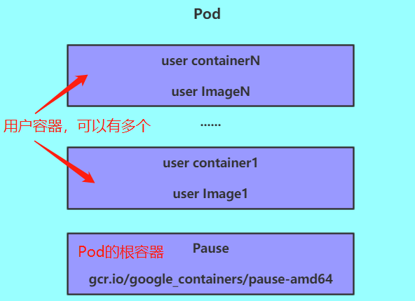

每个 Pod 中都包含一个或者多个容器，这些容器可以分为两类：

1. 用户程序所在的容器，数量可多可少。

2. Pause 容器，这是每个 Pod 都会有的一个根容器，它的作用有两个：

   - 可以以它为依据，评估整个 Pod 的健康状况。

   - 可以在根容器上设置 IP 地址，其它容器都共享此 IP（Pod 的 IP），以实现 Pod 内部的网络通信。

     > 这里是 Pod 内部的通讯，Pod 之间的通讯采用虚拟二层网络技术来实现，我们当前环境使用的是  weave-net。

## 1.2 Pod 定义

### 1.2.1 Pod 的资源清单

下面是 Pod 的资源清单：

```yaml
apiVersion: v1     # 必选，版本号，例如 v1
kind: Pod       　 # 必选，资源类型，例如 Pod
metadata:       　 # 必选，元数据
  name: string     # 必选，Pod 名称
  namespace: string  # Pod 所属的命名空间,默认为 "default"
  labels:       　　  # 自定义标签列表
    - name: string      　          
spec:  # 必选，Pod 中容器的详细定义
  containers:  # 必选，Pod 中容器列表
  - name: string   # 必选，容器名称
    image: string  # 必选，容器的镜像名称
    imagePullPolicy: [ Always|Never|IfNotPresent ]  # 获取镜像的策略 
    command: [string]   # 容器的启动命令列表，如不指定，使用打包时使用的启动命令
    args: [string]      # 容器的启动命令参数列表
    workingDir: string  # 容器的工作目录
    volumeMounts:       # 挂载到容器内部的存储卷配置
    - name: string      # 引用 pod 定义的共享存储卷的名称，需用 volumes[] 部分定义的的卷名
      mountPath: string # 存储卷在容器内 mount 的绝对路径，应少于 512 字符
      readOnly: boolean # 是否为只读模式
    ports: # 需要暴露的端口库号列表
    - name: string        # 端口的名称
      containerPort: int  # 容器需要监听的端口号
      hostPort: int       # 容器所在主机需要监听的端口号，默认与 Container 相同
      protocol: string    # 端口协议，支持 TCP 和 UDP，默认 TCP
    env:   # 容器运行前需设置的环境变量列表
    - name: string  # 环境变量名称
      value: string # 环境变量的值
    resources: # 资源限制和请求的设置
      limits:  # 资源限制的设置
        cpu: string     # Cpu 的限制，单位为 core 数，将用于 docker run --cpu-shares 参数
        memory: string  #内存限制，单位可以为 Mib/Gib，将用于 docker run --memory 参数
      requests: # 资源请求的设置
        cpu: string    # Cpu 请求，容器启动的初始可用数量
        memory: string # 内存请求,容器启动的初始可用数量
    lifecycle: # 生命周期钩子
        postStart: # 容器启动后立即执行此钩子,如果执行失败,会根据重启策略进行重启
        preStop: # 容器终止前执行此钩子,无论结果如何,容器都会终止
    livenessProbe:  # 对 Pod 内各容器健康检查的设置，当探测无响应几次后将自动重启该容器
      exec:       　 # 对 Pod 容器内检查方式设置为 exec 方式
        command: [string]  # exec 方式需要制定的命令或脚本
      httpGet:       # 对 Pod 内个容器健康检查方法设置为 HttpGet，需要制定 Path、port
        path: string
        port: number
        host: string
        scheme: string
        HttpHeaders:
        - name: string
          value: string
      tcpSocket:     # 对 Pod 内个容器健康检查方式设置为 tcpSocket 方式
         port: number
       initialDelaySeconds: 0      # 容器启动完成后首次探测的时间，单位为秒
       timeoutSeconds: 0    　　    # 对容器健康检查探测等待响应的超时时间，单位秒，默认 1 秒
       periodSeconds: 0     　　    # 对容器监控检查的定期探测时间设置，单位秒，默认 10 秒一次
       successThreshold: 0
       failureThreshold: 0
       securityContext:
         privileged: false
  restartPolicy: [Always | Never | OnFailure]  # Pod 的重启策略
  nodeName: <string> # 设置 NodeName 表示将该 Pod 调度到指定到名称的 node 节点上
  nodeSelector: obeject # 设置 NodeSelector 表示将该 Pod 调度到包含这个 label 的 node 上
  imagePullSecrets: # Pull镜像时使用的 secret 名称，以 key：secretkey 格式指定
  - name: string
  hostNetwork: false   # 是否使用主机网络模式，默认为 false，如果设置为 true，表示使用宿主机网络
  volumes:   # 在该 pod 上定义共享存储卷列表
  - name: string    # 共享存储卷名称 （volumes 类型有很多种）
    emptyDir: {}       # 类型为 emtyDir 的存储卷，与 Pod 同生命周期的一个临时目录。为空值
    hostPath: string   # 类型为 hostPath 的存储卷，表示挂载 Pod 所在宿主机的目录
      path: string     # Pod 所在宿主机的目录，将被用于同期中 mount 的目录
    secret:       　　　# 类型为 secret 的存储卷，挂载集群与定义的 secret 对象到容器内部
      scretname: string  
      items:     
      - key: string
        path: string
    configMap:         # 类型为 configMap 的存储卷，挂载预定义的 configMap对象到容器内部
      name: string
      items:
      - key: string
        path: string
```

### 1.2.2 查看资源的可配置项

1.语法：查看每种资源的可配置项

查看某种资源可以配置的一级配置

```bash
$ kubectl explain <资源类型>
```

查看属性的子属性

``` bash
$ kubectl explain <资源类型.属性>
```

2.示例：查看资源类型为 pod 的可配置项

```bash
$ kubectl explain pod
```

3.示例：查看资源类型为 Pod 的 metadata 的属性的可配置项

```bash
$ kubectl explain pod.metadata
```

### 1.2.3 kubernetes 资源属性介绍

在 kubernetes 中基本所有资源的一级属性都是一样的，主要包含5个部分：

1. apiVersion `<string>`：版本，由 kubernetes 内部定义，版本号必须用 kubectl api-versions 查询；
2. kind `<string>`：类型，有 kubernetes 内部定义，类型必须用 kubectl api-resources 查询；
3. metadata `<Object>`：元数据，主要是资源标识和说明，常用的有 name、namespace、labels 等；
4. spec `<Object>`：描述，这是配置中最重要的一部分，里面是对各种资源配置的详细描述；
5. status `<Object>`：状态信息，里面的内容不需要定义，由 kubernetes 自动生成。

在上面的属性中，spec 是接下来研究的重点，继续看下它的常见子属性：

1. containers  `<[]Object>`：容器列表，用于定义容器的详细信息；
2. nodeName `<string>`：根据 nodeName 的值将 Pod 调度到指定的 Node 节点上；
3. nodeSelector `<map[string]string>`：根据 NodeSelector 中定义的信息选择该 Pod 调度到包含这些 Label 的 Node 上；
4. hostNetwork `<boolean>`：是否使用主机网络模式，默认为 false，如果设置为 true，表示使用宿主机网络；
5. volumes `<[]Object>`：存储卷，用于定义 Pod 上面挂载的存储信息；
6. restartPolicy `<string>`：重启策略，表示 Pod 在遇到故障的时候的处理策略。

# 2.Pod 配置  

本小节主要来研究 `pod.spec.containers` 属性，这也是 Pod 配置中最为关键的一项配置。

通过命令 `kubectl explain pod.spec.containers` 查看 `pod.spec.containers` 的可选配置项：

```bash
$ kubectl explain pod.spec.containers
# 返回的重要属性
KIND:     Pod
VERSION:  v1
RESOURCE: containers <[]Object>   # 数组，代表可以有多个容器 FIELDS:
  name  <string>     # 容器名称
  image <string>     # 容器需要的镜像地址
  imagePullPolicy  <string> # 镜像拉取策略 
  command  <[]string> # 容器的启动命令列表，如不指定，使用打包时使用的启动命令
  args   <[]string> # 容器的启动命令需要的参数列表 
  env    <[]Object> # 容器环境变量的配置
  ports  <[]Object>  # 容器需要暴露的端口号列表
  resources <Object> # 资源限制和资源请求的设置
```

## 2.1 基本配置

创建 pod-base.yaml 文件，内容如下：

```yaml
apiVersion: v1
kind: Pod
metadata:
  name: pod-base
  namespace: dev
  labels:
    user: silence
spec:
  containers:
    - name: nginx # 容器名称
      image: nginx:1.17.1 # 容器需要的镜像地址
    - name: busybox # 容器名称
      image: busybox:1.30 # 容器需要的镜像地址
```

上面定义了一个比较简单的 Pod 的配置，里面有两个容器：

nginx：用的是 1.17.1 版本的 nginx 镜像创建（nginx 是一个轻量级的 web 容器）。

busybox：用的是 1.30 版本的 busybox 镜像创建（busybox 是一个小巧的 linux 命令集合）。

1.创建 Pod：

```bash
$ kubectl apply -f pod-base.yaml
```

2.查看Pod状况：

```bash
$ kubectl get pod -n dev
```

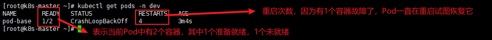

通过describe查看内部的详情：

```bash
$ kubectl describe pod pod-base -n dev
```

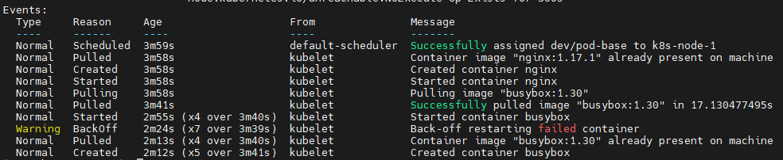

此时已经运行起来了一个基本的Pod，虽然它暂时有问题。

## 2.2 镜像拉取策略

创建 pod-imagepullpolicy.yaml 文件，内容如下：

```yaml
apiVersion: v1
kind: Pod
metadata:
  name: pod-imagepullpolicy
  namespace: dev
  labels:
    user: silence
spec:
  containers:
    - name: nginx # 容器名称
      image: nginx:1.17.2 # 容器需要的镜像地址
      imagePullPolicy: Always # 用于设置镜像的拉取策略
    - name: busybox # 容器名称
      image: busybox:1.30 # 容器需要的镜像地址
```

imagePullPolicy：用于设置镜像拉取的策略，kubernetes 支持配置三种拉取策略：

- Always：总是从远程仓库拉取镜像（一直远程下载）；
- IfNotPresent：本地有则使用本地镜像，本地没有则从远程仓库拉取镜像（本地有就用本地，本地没有就使用远程下载）；
- Never：只使用本地镜像，从不去远程仓库拉取，本地没有就报错（一直使用本地，没有就报错）。

> 默认值说明：
>
> - 如果镜像 tag 为具体的版本号，默认策略是 IfNotPresent；
>
> - 如果镜像 tag 为 latest（最终版本），默认策略是 Always。

创建 Pod：

```bash
$ kubectl apply -f pod-imagepullpolicy.yaml
```

查看 Pod 详情：

```bash
$ kubectl describe pod pod-imagepullpolicy -n dev
```

## 2.3 启动命令

在前面的案例中，一直有一个问题没有解决，就是 busybox 容器一直没有成功运行，那么到底是什么原因导致这个容器的故障的呢？

原来 busybox 并不是一个程序，而是类似于一个工具类的集合，kubernetes 集群启动管理后，它会自动关闭。解决方法就是让其一直在运行，这就用到了 command 的配置。

创建 pod-command.yaml 文件，内容如下：

```yaml
apiVersion: v1
kind: Pod
metadata:
  name: pod-command
  namespace: dev
  labels:
    user: xudaxian
spec:
  containers:
    - name: nginx # 容器名称
      image: nginx:1.17.1 # 容器需要的镜像地址
      imagePullPolicy: IfNotPresent # 设置镜像拉取策略
    - name: busybox # 容器名称
      image: busybox:1.30 # 容器需要的镜像地址
      command: ["/bin/sh","-c","touch /tmp/hello.txt;while true;do /bin/echo $(date +%T) >> /tmp/hello.txt;sleep 3;done;"]
```

> command：用于在 Pod 中的容器初始化完毕之后执行一个命令。
>
> 这里稍微解释下 command 中的命令的意思：
>
> - "/bin/sh","-c"：使用sh执行命令。
>
> - touch /tmp/hello.txt：创建一个 /tmp/hello.txt 的文件。
>
> - while true;do /bin/echo $(date +%T) >> /tmp/hello.txt;sleep 3;done：每隔3秒，向文件写入当前时间

创建 Pod：

```bash
$ kubectl apply -f pod-command.yaml
```

查看 Pod 状态：

```bash
$ kubectl get pod pod-command -n dev
```

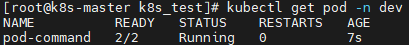

进入 Pod 中的 busybox 容器，查看文件内容，使用命令：

``` bash
$ kubectl exec -it <pod的名称> [-n 命名空间] -c <容器名称> <命令>
```

在容器中执行命令：

```bash
$ kubectl exec -it pod-command -n dev -c busybox /bin/sh
```

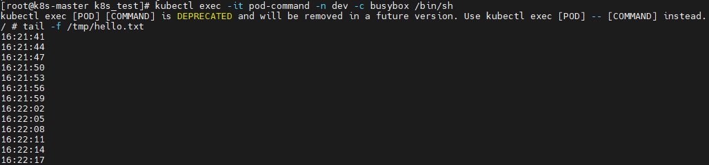

> 特别说明：通过上面发现 command 已经可以完成启动命令和传递参数的功能，为什么还要提供一个 args 选项，用于传递参数？其实和 Docker 有点关系，kubernetes 中的 command 和 args 两个参数其实是为了实现覆盖 Dockerfile 中的 ENTRYPOINT 的功能：
>
> - 如果 command 和 args 均没有写，那么用 Dockerfile 的配置；
>
> - 如果 command 写了，但是 args 没有写，那么 Dockerfile 默认的配置会被忽略，执行注入的 command；
>
> - 如果 command 没有写，但是 args 写了，那么 Dockerfile 中配置的 ENTRYPOINT 命令会被执行，使用当前 args 的参数；
>
> - 如果 command 和 args 都写了，那么 Dockerfile 中的配置会被忽略，执行 command 并追加上 args 参数。

## 2.4 环境变量（不推荐）

创建 pod-evn.yaml 文件，内容如下：

```bash
apiVersion: v1
kind: Pod
metadata:
  name: pod-env
  namespace: dev
  labels:
    user: xudaxian
spec:
  containers:
    - name: nginx # 容器名称
      image: nginx:1.17.1 # 容器需要的镜像地址
      imagePullPolicy: IfNotPresent # 设置镜像拉取策略
    - name: busybox # 容器名称
      image: busybox:1.30 # 容器需要的镜像地址
      command: ["/bin/sh","-c","touch /tmp/hello.txt;while true;do /bin/echo $(date +%T) >> /tmp/hello.txt;sleep 3;done;"]
      env:
        - name: "username"
          value: "admin"
        - name: "password"
          value: "123456"
```

> env：环境变量，用于在 Pod 中的容器设置环境变量。

创建 Pod：

```bash
$ kubectl create -f pod-env.yaml
```

进入容器，输出环境变量：

```bash
$ kubectl exec -it pod-env -n dev -c busybox -i /bin/sh
```

> 此种方式不推荐，推荐将这些配置单独存储在配置文件中，后面介绍。

## 2.5 端口设置

查看ports支持的子选项：

```bash
$ kubectl explain pod.spec.containers.ports
```

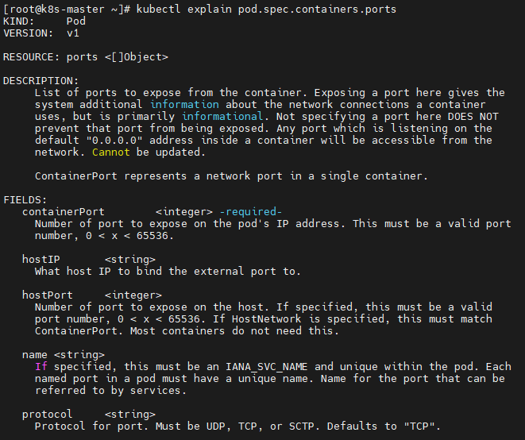

总结下来，就是下面这些：

``` yaml
KIND:     Pod
VERSION:  v1
RESOURCE: ports <[]Object>
FIELDS:
  name <string> # 端口名称，如果指定，必须保证 name 在 pod 中是唯一的
  containerPort <integer> # 容器要监听的端口(0<x<65536)
  hostPort <integer> # 容器要在主机上公开的端口，如果设置，主机上只能运行容器的一个副本(一般省略）
  hostIP <string>  # 要将外部端口绑定到的主机IP(一般省略)
  protocol <string>  # 端口协议。必须是UDP、TCP或SCTP。默认为“TCP”
```

创建 pod-ports.yaml 文件，内容如下：

```yaml
apiVersion: v1
kind: Pod
metadata:
  name: pod-ports
  namespace: dev
  labels:
    user: silentao
spec:
  containers:
    - name: nginx # 容器名称
      image: nginx:1.17.1 # 容器需要的镜像地址
      imagePullPolicy: IfNotPresent # 设置镜像拉取策略
      ports:
        - name: nginx-port # 端口名称，如果执行，必须保证name在Pod中是唯一的
          containerPort: 80 # 容器要监听的端口 （0~65536）
          protocol: TCP # 端口协议
```

创建 Pod：

```bash
$ kubectl create -f pod-ports.yaml
```

查看 Pod：

``` bash
$ kubectl describe pod pod-ports -n dev
```

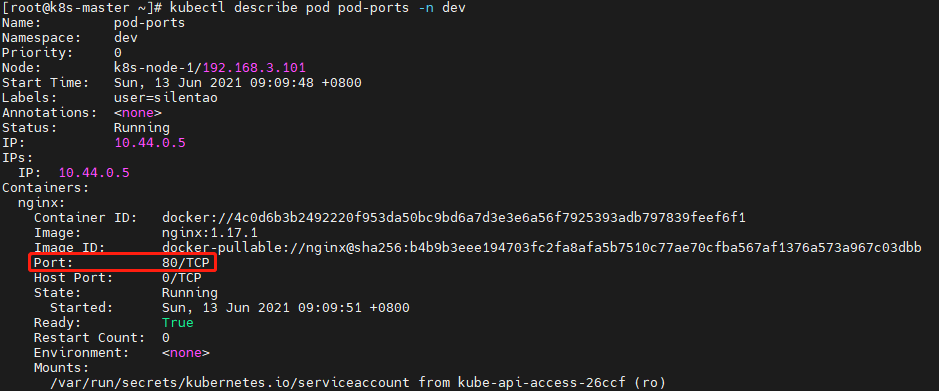

> 访问 Pod 中的容器中的程序使用的是 `PodIP:containerPort`。

## 2.6 资源配额

容器中的程序要运行，肯定会占用一定的资源，比如 CPU 和内存等，如果不对某个容器的资源做限制，那么它就可能吃掉大量的资源，导致其他的容器无法运行。针对这种情况，kubernetes 提供了对内存和 CPU 的资源进行配额的机制，这种机制主要通过 resources 选项实现，它有两个子选项：

- limits：用于限制运行的容器的最大占用资源，当容器占用资源超过 limits 时会被终止，并进行重启；

- requests：用于设置容器需要的最小资源，如果环境资源不够，容器将无法启动。

可以通过上面的两个选项设置资源的上下限。

创建 pod-resoures.yaml 文件，内容如下：

``` yaml
apiVersion: v1
kind: Pod
metadata:
  name: pod-resoures
  namespace: dev
  labels:
    user: silentao
spec:
  containers:
    - name: nginx # 容器名称
      image: nginx:1.17.1 # 容器需要的镜像地址
      imagePullPolicy: IfNotPresent # 设置镜像拉取策略
      ports: # 端口设置
        - name: nginx-port # 端口名称，如果执行，必须保证name在Pod中是唯一的
          containerPort: 80 # 容器要监听的端口 （0~65536）
          protocol: TCP # 端口协议
      resources: # 资源配额
        limits: # 限制资源的上限
          cpu: "2" # CPU限制，单位是core数
          memory: "10Gi" # 内存限制
        requests: # 限制资源的下限
          cpu: "1" # CPU限制，单位是core数 
          memory: "10Mi" # 内存限制
```

> cpu：core 数，可以为整数或小数；
>
> memory：内存大小，可以使用 Gi、Mi、G、M 等形式。

创建 Pod：

```bash
$ kubectl create -f pod-resource.yaml
```

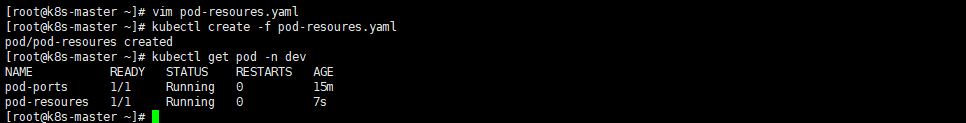

编辑 Pod，修改 resources.requests.memory 的值为 10Gi：

```bash
apiVersion: v1
kind: Pod
metadata:
  name: pod-resoures
  namespace: dev
  labels:
    user: silentao
spec:
  containers:
    - name: nginx # 容器名称
      image: nginx:1.17.1 # 容器需要的镜像地址
      imagePullPolicy: IfNotPresent # 设置镜像拉取策略
      ports: # 端口设置
        - name: nginx-port # 端口名称，如果执行，必须保证name在Pod中是唯一的
          containerPort: 80 # 容器要监听的端口 （0~65536）
          protocol: TCP # 端口协议
      resources: # 资源配额
        limits: # 限制资源的上限
          cpu: "2" # CPU限制，单位是core数
          memory: "10Gi" # 内存限制
        requests: # 限制资源的下限
          cpu: "1" # CPU限制，单位是core数 
          memory: "10Gi" # 内存限制
```

再次启动 Pod：

```bash
$ kubectl create -f pod-resource.yaml
```

查看 Pod 状态，发现 Pod 启动失败：

```bash
$ kubectl get pod pod-resoures -n dev -o wide
```

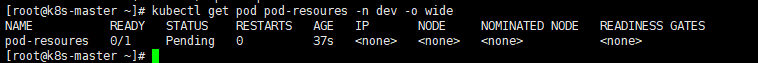

查看 Pod 详情会发现，如下提示：

```bash
$ kubectl describe pod pod-resoures -n dev
```

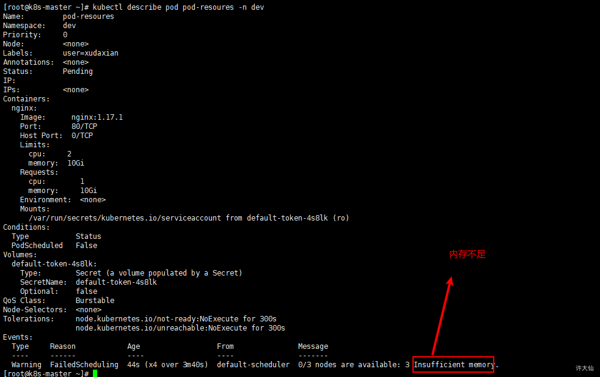

# 3.Pod 的生命周期

## 3.1 概述

我们一般将 Pod 对象从创建到终止的这段时间范围称为 Pod 的生命周期，它主要包含下面的过程：

1. Pod 创建过程；
2. 运行初始化容器（init container）过程；
3. 运行主容器（main container）：
   - 容器启动后钩子（post start）、容器终止前钩子（pre stop）;
   - 容器的存活性探测（liveness probe）、就绪性探测（readiness probe）。

4. Pod 终止过程。

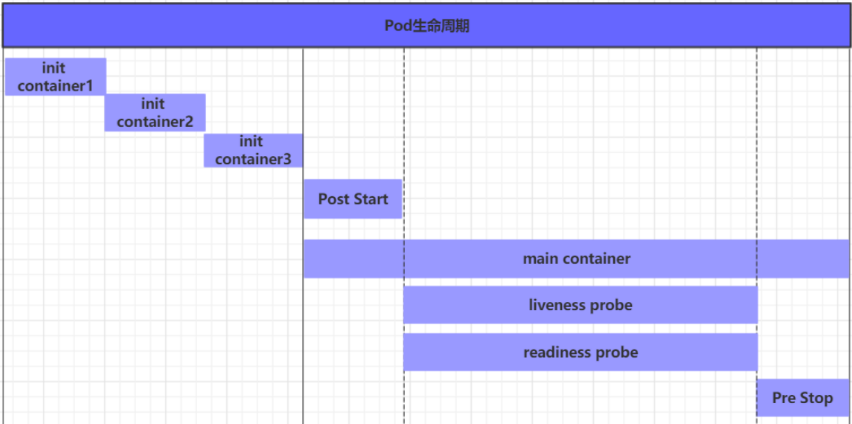

在整个生命周期中，Pod 会出现 5 种状态（相位），分别如下：

1. 挂起（Pending）：API Server 已经创建了 Pod 资源对象，但它尚未被调度完成或者仍处于下载镜像的过程中
2. 运行中（Running）：Pod 已经被调度到某节点，并且所有容器都已经被 kubelet 创建完成；
3. 成功（Succeeded）：Pod 中的所有容器都已经成功终止并且不会被重启；
4. 失败（Failed）：所有容器都已经终止，但至少有一个容器终止失败，即容器返回了非 0 值的退出状态；
5. 未知（Unknown）：API Server 无法正常获取到 Pod 对象的状态信息，通常由于网络通信失败所导致。

## 3.2 创建和终止

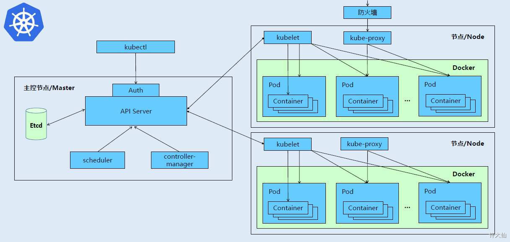

### 3.2.1 Pod 的创建过程

1. 用户通过 kubectl 或其他的 api 客户端提交需要创建的 Pod 信息给 API Server；
2. API Server 开始生成 Pod 对象的信息，并将信息存入etcd，然后返回确认信息至客户端；
3. API Server 开始反映 etcd 中的 Pod 对象的变化，其它组件使用 watch 机制来跟踪检查 API Server 上的变动；
4. Scheduler 发现有新的 Pod 对象要创建，开始为 Pod 分配主机并将结果信息更新至 API Server；
5. Node 节点上的 kubelet 发现有 Pod 调度过来，尝试调度 Docker 启动容器，并将结果回送至 API Server；
6. API Server 将接收到的 Pod 状态信息存入到 etcd 中。

### 3.2.2 Pod的终止过程

1. 用户向 API Server 发送删除 Pod 对象的命令；
2. API Server 中的 Pod 对象信息会随着时间的推移而更新，在宽限期内（默认30s），Pod 被视为 dead；
3. 将 Pod 标记为 terminating 状态；
4. kubelete 在监控到 Pod 对象转为 terminating 状态的同时启动 Pod 关闭过程；
5. 端点控制器监控到 Pod 对象的关闭行为时将其从所有能匹配到此端点的 service 资源的端点列表中移除；
6. 如果当前 Pod 对象定义了 preStop 钩子处理器，则在其标记为 terminating 后会以同步的方式启动执行；
7. Pod 对象中的容器进程收到停止信号；
8. 宽限期结束后，如果 Pod 中还存在运行的进程，那么 Pod 对象会收到立即终止的信号；
9. kubectl 请求 API Server 将此 Pod 资源的宽限期设置为 0 从而完成删除操作，此时 Pod 对于用户已经不可用了。

