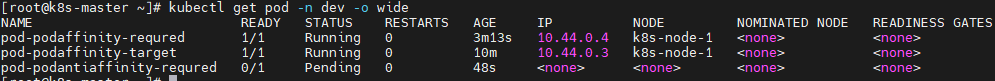

# 1.Pod 的介绍

## 1.1 Pod 的结构


每个 Pod 中都包含一个或者多个容器，这些容器可以分为两类：

1. 用户程序所在的容器，数量可多可少。

2. Pause 容器，这是每个 Pod 都会有的一个根容器，它的作用有两个：

   - 可以以它为依据，评估整个 Pod 的健康状况。

   - 可以在根容器上设置 IP 地址，其它容器都共享此 IP（Pod 的 IP），以实现 Pod 内部的网络通信。

     > 这里是 Pod 内部的通讯，Pod 之间的通讯采用虚拟二层网络技术来实现，我们当前环境使用的是  weave-net。

## 1.2 Pod 定义

### 1.2.1 Pod 的资源清单

下面是 Pod 的资源清单：

```yaml
apiVersion: v1     # 必选，版本号，例如 v1
kind: Pod       　 # 必选，资源类型，例如 Pod
metadata:       　 # 必选，元数据
  name: string     # 必选，Pod 名称
  namespace: string  # Pod 所属的命名空间,默认为 "default"
  labels:       　　  # 自定义标签列表
    - name: string      　          
spec:  # 必选，Pod 中容器的详细定义
  containers:  # 必选，Pod 中容器列表
  - name: string   # 必选，容器名称
    image: string  # 必选，容器的镜像名称
    imagePullPolicy: [ Always|Never|IfNotPresent ]  # 获取镜像的策略 
    command: [string]   # 容器的启动命令列表，如不指定，使用打包时使用的启动命令
    args: [string]      # 容器的启动命令参数列表
    workingDir: string  # 容器的工作目录
    volumeMounts:       # 挂载到容器内部的存储卷配置
    - name: string      # 引用 pod 定义的共享存储卷的名称，需用 volumes[] 部分定义的的卷名
      mountPath: string # 存储卷在容器内 mount 的绝对路径，应少于 512 字符
      readOnly: boolean # 是否为只读模式
    ports: # 需要暴露的端口库号列表
    - name: string        # 端口的名称
      containerPort: int  # 容器需要监听的端口号
      hostPort: int       # 容器所在主机需要监听的端口号，默认与 Container 相同
      protocol: string    # 端口协议，支持 TCP 和 UDP，默认 TCP
    env:   # 容器运行前需设置的环境变量列表
    - name: string  # 环境变量名称
      value: string # 环境变量的值
    resources: # 资源限制和请求的设置
      limits:  # 资源限制的设置
        cpu: string     # Cpu 的限制，单位为 core 数，将用于 docker run --cpu-shares 参数
        memory: string  #内存限制，单位可以为 Mib/Gib，将用于 docker run --memory 参数
      requests: # 资源请求的设置
        cpu: string    # Cpu 请求，容器启动的初始可用数量
        memory: string # 内存请求,容器启动的初始可用数量
    lifecycle: # 生命周期钩子
        postStart: # 容器启动后立即执行此钩子,如果执行失败,会根据重启策略进行重启
        preStop: # 容器终止前执行此钩子,无论结果如何,容器都会终止
    livenessProbe:  # 对 Pod 内各容器健康检查的设置，当探测无响应几次后将自动重启该容器
      exec:       　 # 对 Pod 容器内检查方式设置为 exec 方式
        command: [string]  # exec 方式需要制定的命令或脚本
      httpGet:       # 对 Pod 内个容器健康检查方法设置为 HttpGet，需要制定 Path、port
        path: string
        port: number
        host: string
        scheme: string
        HttpHeaders:
        - name: string
          value: string
      tcpSocket:     # 对 Pod 内个容器健康检查方式设置为 tcpSocket 方式
         port: number
       initialDelaySeconds: 0      # 容器启动完成后首次探测的时间，单位为秒
       timeoutSeconds: 0    　　    # 对容器健康检查探测等待响应的超时时间，单位秒，默认 1 秒
       periodSeconds: 0     　　    # 对容器监控检查的定期探测时间设置，单位秒，默认 10 秒一次
       successThreshold: 0
       failureThreshold: 0
       securityContext:
         privileged: false
  restartPolicy: [Always | Never | OnFailure]  # Pod 的重启策略
  nodeName: <string> # 设置 NodeName 表示将该 Pod 调度到指定到名称的 node 节点上
  nodeSelector: obeject # 设置 NodeSelector 表示将该 Pod 调度到包含这个 label 的 node 上
  imagePullSecrets: # Pull镜像时使用的 secret 名称，以 key：secretkey 格式指定
  - name: string
  hostNetwork: false   # 是否使用主机网络模式，默认为 false，如果设置为 true，表示使用宿主机网络
  volumes:   # 在该 pod 上定义共享存储卷列表
  - name: string    # 共享存储卷名称 （volumes 类型有很多种）
    emptyDir: {}       # 类型为 emtyDir 的存储卷，与 Pod 同生命周期的一个临时目录。为空值
    hostPath: string   # 类型为 hostPath 的存储卷，表示挂载 Pod 所在宿主机的目录
      path: string     # Pod 所在宿主机的目录，将被用于同期中 mount 的目录
    secret:       　　　# 类型为 secret 的存储卷，挂载集群与定义的 secret 对象到容器内部
      scretname: string  
      items:     
      - key: string
        path: string
    configMap:         # 类型为 configMap 的存储卷，挂载预定义的 configMap对象到容器内部
      name: string
      items:
      - key: string
        path: string
```

### 1.2.2 查看资源的可配置项

1.语法：查看每种资源的可配置项

查看某种资源可以配置的一级配置

```bash
$ kubectl explain <资源类型>
```

查看属性的子属性

``` bash
$ kubectl explain <资源类型.属性>
```

2.示例：查看资源类型为 pod 的可配置项

```bash
$ kubectl explain pod
```

3.示例：查看资源类型为 Pod 的 metadata 的属性的可配置项

```bash
$ kubectl explain pod.metadata
```

### 1.2.3 kubernetes 资源属性介绍

在 kubernetes 中基本所有资源的一级属性都是一样的，主要包含5个部分：

1. apiVersion `<string>`：版本，由 kubernetes 内部定义，版本号必须用 kubectl api-versions 查询；
2. kind `<string>`：类型，有 kubernetes 内部定义，类型必须用 kubectl api-resources 查询；
3. metadata `<Object>`：元数据，主要是资源标识和说明，常用的有 name、namespace、labels 等；
4. spec `<Object>`：描述，这是配置中最重要的一部分，里面是对各种资源配置的详细描述；
5. status `<Object>`：状态信息，里面的内容不需要定义，由 kubernetes 自动生成。

在上面的属性中，spec 是接下来研究的重点，继续看下它的常见子属性：

1. containers  `<[]Object>`：容器列表，用于定义容器的详细信息；
2. nodeName `<string>`：根据 nodeName 的值将 Pod 调度到指定的 Node 节点上；
3. nodeSelector `<map[string]string>`：根据 NodeSelector 中定义的信息选择该 Pod 调度到包含这些 Label 的 Node 上；
4. hostNetwork `<boolean>`：是否使用主机网络模式，默认为 false，如果设置为 true，表示使用宿主机网络；
5. volumes `<[]Object>`：存储卷，用于定义 Pod 上面挂载的存储信息；
6. restartPolicy `<string>`：重启策略，表示 Pod 在遇到故障的时候的处理策略。

# 2.Pod 配置  

本小节主要来研究 `pod.spec.containers` 属性，这也是 Pod 配置中最为关键的一项配置。

通过命令 `kubectl explain pod.spec.containers` 查看 `pod.spec.containers` 的可选配置项：

```bash
$ kubectl explain pod.spec.containers
# 返回的重要属性
KIND:     Pod
VERSION:  v1
RESOURCE: containers <[]Object>   # 数组，代表可以有多个容器 FIELDS:
  name  <string>     # 容器名称
  image <string>     # 容器需要的镜像地址
  imagePullPolicy  <string> # 镜像拉取策略 
  command  <[]string> # 容器的启动命令列表，如不指定，使用打包时使用的启动命令
  args   <[]string> # 容器的启动命令需要的参数列表 
  env    <[]Object> # 容器环境变量的配置
  ports  <[]Object>  # 容器需要暴露的端口号列表
  resources <Object> # 资源限制和资源请求的设置
```

## 2.1 基本配置

创建 pod-base.yaml 文件，内容如下：

```yaml
apiVersion: v1
kind: Pod
metadata:
  name: pod-base
  namespace: dev
  labels:
    user: silence
spec:
  containers:
    - name: nginx # 容器名称
      image: nginx:1.17.1 # 容器需要的镜像地址
    - name: busybox # 容器名称
      image: busybox:1.30 # 容器需要的镜像地址
```

上面定义了一个比较简单的 Pod 的配置，里面有两个容器：

nginx：用的是 1.17.1 版本的 nginx 镜像创建（nginx 是一个轻量级的 web 容器）。

busybox：用的是 1.30 版本的 busybox 镜像创建（busybox 是一个小巧的 linux 命令集合）。

1.创建 Pod：

```bash
$ kubectl apply -f pod-base.yaml
```

2.查看Pod状况：

```bash
$ kubectl get pod -n dev
```


通过describe查看内部的详情：

```bash
$ kubectl describe pod pod-base -n dev
```


此时已经运行起来了一个基本的Pod，虽然它暂时有问题。

## 2.2 镜像拉取策略

创建 pod-imagepullpolicy.yaml 文件，内容如下：

```yaml
apiVersion: v1
kind: Pod
metadata:
  name: pod-imagepullpolicy
  namespace: dev
  labels:
    user: silence
spec:
  containers:
    - name: nginx # 容器名称
      image: nginx:1.17.2 # 容器需要的镜像地址
      imagePullPolicy: Always # 用于设置镜像的拉取策略
    - name: busybox # 容器名称
      image: busybox:1.30 # 容器需要的镜像地址
```

imagePullPolicy：用于设置镜像拉取的策略，kubernetes 支持配置三种拉取策略：

- Always：总是从远程仓库拉取镜像（一直远程下载）；
- IfNotPresent：本地有则使用本地镜像，本地没有则从远程仓库拉取镜像（本地有就用本地，本地没有就使用远程下载）；
- Never：只使用本地镜像，从不去远程仓库拉取，本地没有就报错（一直使用本地，没有就报错）。

> 默认值说明：
>
> - 如果镜像 tag 为具体的版本号，默认策略是 IfNotPresent；
>
> - 如果镜像 tag 为 latest（最终版本），默认策略是 Always。

创建 Pod：

```bash
$ kubectl apply -f pod-imagepullpolicy.yaml
```

查看 Pod 详情：

```bash
$ kubectl describe pod pod-imagepullpolicy -n dev
```

## 2.3 启动命令

在前面的案例中，一直有一个问题没有解决，就是 busybox 容器一直没有成功运行，那么到底是什么原因导致这个容器的故障的呢？

原来 busybox 并不是一个程序，而是类似于一个工具类的集合，kubernetes 集群启动管理后，它会自动关闭。解决方法就是让其一直在运行，这就用到了 command 的配置。

创建 pod-command.yaml 文件，内容如下：

```yaml
apiVersion: v1
kind: Pod
metadata:
  name: pod-command
  namespace: dev
  labels:
    user: xudaxian
spec:
  containers:
    - name: nginx # 容器名称
      image: nginx:1.17.1 # 容器需要的镜像地址
      imagePullPolicy: IfNotPresent # 设置镜像拉取策略
    - name: busybox # 容器名称
      image: busybox:1.30 # 容器需要的镜像地址
      command: ["/bin/sh","-c","touch /tmp/hello.txt;while true;do /bin/echo $(date +%T) >> /tmp/hello.txt;sleep 3;done;"]
```

> command：用于在 Pod 中的容器初始化完毕之后执行一个命令。
>
> 这里稍微解释下 command 中的命令的意思：
>
> - "/bin/sh","-c"：使用sh执行命令。
>
> - touch /tmp/hello.txt：创建一个 /tmp/hello.txt 的文件。
>
> - while true;do /bin/echo $(date +%T) >> /tmp/hello.txt;sleep 3;done：每隔3秒，向文件写入当前时间

创建 Pod：

```bash
$ kubectl apply -f pod-command.yaml
```

查看 Pod 状态：

```bash
$ kubectl get pod pod-command -n dev
```


进入 Pod 中的 busybox 容器，查看文件内容，使用命令：

``` bash
$ kubectl exec -it <pod的名称> [-n 命名空间] -c <容器名称> <命令>
```

在容器中执行命令：

```bash
$ kubectl exec -it pod-command -n dev -c busybox /bin/sh
```


> 特别说明：通过上面发现 command 已经可以完成启动命令和传递参数的功能，为什么还要提供一个 args 选项，用于传递参数？其实和 Docker 有点关系，kubernetes 中的 command 和 args 两个参数其实是为了实现覆盖 Dockerfile 中的 ENTRYPOINT 的功能：
>
> - 如果 command 和 args 均没有写，那么用 Dockerfile 的配置；
>
> - 如果 command 写了，但是 args 没有写，那么 Dockerfile 默认的配置会被忽略，执行注入的 command；
>
> - 如果 command 没有写，但是 args 写了，那么 Dockerfile 中配置的 ENTRYPOINT 命令会被执行，使用当前 args 的参数；
>
> - 如果 command 和 args 都写了，那么 Dockerfile 中的配置会被忽略，执行 command 并追加上 args 参数。

## 2.4 环境变量（不推荐）

创建 pod-evn.yaml 文件，内容如下：

```bash
apiVersion: v1
kind: Pod
metadata:
  name: pod-env
  namespace: dev
  labels:
    user: xudaxian
spec:
  containers:
    - name: nginx # 容器名称
      image: nginx:1.17.1 # 容器需要的镜像地址
      imagePullPolicy: IfNotPresent # 设置镜像拉取策略
    - name: busybox # 容器名称
      image: busybox:1.30 # 容器需要的镜像地址
      command: ["/bin/sh","-c","touch /tmp/hello.txt;while true;do /bin/echo $(date +%T) >> /tmp/hello.txt;sleep 3;done;"]
      env:
        - name: "username"
          value: "admin"
        - name: "password"
          value: "123456"
```

> env：环境变量，用于在 Pod 中的容器设置环境变量。

创建 Pod：

```bash
$ kubectl create -f pod-env.yaml
```

进入容器，输出环境变量：

```bash
$ kubectl exec -it pod-env -n dev -c busybox -i /bin/sh
```

> 此种方式不推荐，推荐将这些配置单独存储在配置文件中，后面介绍。

## 2.5 端口设置

查看ports支持的子选项：

```bash
$ kubectl explain pod.spec.containers.ports
```


总结下来，就是下面这些：

``` yaml
KIND:     Pod
VERSION:  v1
RESOURCE: ports <[]Object>
FIELDS:
  name <string> # 端口名称，如果指定，必须保证 name 在 pod 中是唯一的
  containerPort <integer> # 容器要监听的端口(0<x<65536)
  hostPort <integer> # 容器要在主机上公开的端口，如果设置，主机上只能运行容器的一个副本(一般省略）
  hostIP <string>  # 要将外部端口绑定到的主机IP(一般省略)
  protocol <string>  # 端口协议。必须是UDP、TCP或SCTP。默认为“TCP”
```

创建 pod-ports.yaml 文件，内容如下：

```yaml
apiVersion: v1
kind: Pod
metadata:
  name: pod-ports
  namespace: dev
  labels:
    user: silentao
spec:
  containers:
    - name: nginx # 容器名称
      image: nginx:1.17.1 # 容器需要的镜像地址
      imagePullPolicy: IfNotPresent # 设置镜像拉取策略
      ports:
        - name: nginx-port # 端口名称，如果执行，必须保证name在Pod中是唯一的
          containerPort: 80 # 容器要监听的端口 （0~65536）
          protocol: TCP # 端口协议
```

创建 Pod：

```bash
$ kubectl create -f pod-ports.yaml
```

查看 Pod：

``` bash
$ kubectl describe pod pod-ports -n dev
```


> 访问 Pod 中的容器中的程序使用的是 `PodIP:containerPort`。

## 2.6 资源配额

容器中的程序要运行，肯定会占用一定的资源，比如 CPU 和内存等，如果不对某个容器的资源做限制，那么它就可能吃掉大量的资源，导致其他的容器无法运行。针对这种情况，kubernetes 提供了对内存和 CPU 的资源进行配额的机制，这种机制主要通过 resources 选项实现，它有两个子选项：

- limits：用于限制运行的容器的最大占用资源，当容器占用资源超过 limits 时会被终止，并进行重启；

- requests：用于设置容器需要的最小资源，如果环境资源不够，容器将无法启动。

可以通过上面的两个选项设置资源的上下限。

创建 pod-resoures.yaml 文件，内容如下：

``` yaml
apiVersion: v1
kind: Pod
metadata:
  name: pod-resoures
  namespace: dev
  labels:
    user: silentao
spec:
  containers:
    - name: nginx # 容器名称
      image: nginx:1.17.1 # 容器需要的镜像地址
      imagePullPolicy: IfNotPresent # 设置镜像拉取策略
      ports: # 端口设置
        - name: nginx-port # 端口名称，如果执行，必须保证name在Pod中是唯一的
          containerPort: 80 # 容器要监听的端口 （0~65536）
          protocol: TCP # 端口协议
      resources: # 资源配额
        limits: # 限制资源的上限
          cpu: "2" # CPU限制，单位是core数
          memory: "10Gi" # 内存限制
        requests: # 限制资源的下限
          cpu: "1" # CPU限制，单位是core数 
          memory: "10Mi" # 内存限制
```

> cpu：core 数，可以为整数或小数；
>
> memory：内存大小，可以使用 Gi、Mi、G、M 等形式。

创建 Pod：

```bash
$ kubectl create -f pod-resource.yaml
```


编辑 Pod，修改 resources.requests.memory 的值为 10Gi：

```bash
apiVersion: v1
kind: Pod
metadata:
  name: pod-resoures
  namespace: dev
  labels:
    user: silentao
spec:
  containers:
    - name: nginx # 容器名称
      image: nginx:1.17.1 # 容器需要的镜像地址
      imagePullPolicy: IfNotPresent # 设置镜像拉取策略
      ports: # 端口设置
        - name: nginx-port # 端口名称，如果执行，必须保证name在Pod中是唯一的
          containerPort: 80 # 容器要监听的端口 （0~65536）
          protocol: TCP # 端口协议
      resources: # 资源配额
        limits: # 限制资源的上限
          cpu: "2" # CPU限制，单位是core数
          memory: "10Gi" # 内存限制
        requests: # 限制资源的下限
          cpu: "1" # CPU限制，单位是core数 
          memory: "10Gi" # 内存限制
```

再次启动 Pod：

```bash
$ kubectl create -f pod-resource.yaml
```

查看 Pod 状态，发现 Pod 启动失败：

```bash
$ kubectl get pod pod-resoures -n dev -o wide
```


查看 Pod 详情会发现，如下提示：

```bash
$ kubectl describe pod pod-resoures -n dev
```


# 3.Pod 的生命周期

## 3.1 概述

我们一般将 Pod 对象从创建到终止的这段时间范围称为 Pod 的生命周期，它主要包含下面的过程：

1. Pod 创建过程；
2. 运行初始化容器（init container）过程；
3. 运行主容器（main container）：
   - 容器启动后钩子（post start）、容器终止前钩子（pre stop）;
   - 容器的存活性探测（liveness probe）、就绪性探测（readiness probe）。

4. Pod 终止过程。


在整个生命周期中，Pod 会出现 5 种状态（相位），分别如下：

1. 挂起（Pending）：API Server 已经创建了 Pod 资源对象，但它尚未被调度完成或者仍处于下载镜像的过程中
2. 运行中（Running）：Pod 已经被调度到某节点，并且所有容器都已经被 kubelet 创建完成；
3. 成功（Succeeded）：Pod 中的所有容器都已经成功终止并且不会被重启；
4. 失败（Failed）：所有容器都已经终止，但至少有一个容器终止失败，即容器返回了非 0 值的退出状态；
5. 未知（Unknown）：API Server 无法正常获取到 Pod 对象的状态信息，通常由于网络通信失败所导致。

## 3.2 创建和终止


### 3.2.1 Pod 的创建过程

1. 用户通过 kubectl 或其他的 api 客户端提交需要创建的 Pod 信息给 API Server；
2. API Server 开始生成 Pod 对象的信息，并将信息存入etcd，然后返回确认信息至客户端；
3. API Server 开始反映 etcd 中的 Pod 对象的变化，其它组件使用 watch 机制来跟踪检查 API Server 上的变动；
4. Scheduler 发现有新的 Pod 对象要创建，开始为 Pod 分配主机并将结果信息更新至 API Server；
5. Node 节点上的 kubelet 发现有 Pod 调度过来，尝试调度 Docker 启动容器，并将结果回送至 API Server；
6. API Server 将接收到的 Pod 状态信息存入到 etcd 中。

### 3.2.2 Pod的终止过程

1. 用户向 API Server 发送删除 Pod 对象的命令；
2. API Server 中的 Pod 对象信息会随着时间的推移而更新，在宽限期内（默认30s），Pod 被视为 dead；
3. 将 Pod 标记为 terminating 状态；
4. kubelete 在监控到 Pod 对象转为 terminating 状态的同时启动 Pod 关闭过程；
5. 端点控制器监控到 Pod 对象的关闭行为时将其从所有能匹配到此端点的 service 资源的端点列表中移除；
6. 如果当前 Pod 对象定义了 preStop 钩子处理器，则在其标记为 terminating 后会以同步的方式启动执行；
7. Pod 对象中的容器进程收到停止信号；
8. 宽限期结束后，如果 Pod 中还存在运行的进程，那么 Pod 对象会收到立即终止的信号；
9. kubectl 请求 API Server 将此 Pod 资源的宽限期设置为 0 从而完成删除操作，此时 Pod 对于用户已经不可用了。

## 3.3 初始化容器

初始化容器是在 pod 的主容器启动之前要运行的容器，主要是做一些主容器的前置工作，它具有两大特征：

1. 初始化容器必须运行完成直至结束，若某初始化容器运行失败，那么 kubernetes 需要重启它直至成功完成；
2. 初始化容器必须按照定义的顺序执行，当且仅当前一个成功之后，后面的一个才能运行。

初始化容器有很多的应用场景，下面列出的是最常见的几个：

1. 提供主容器镜像中不具备的工具程序或自定义代码。

2. 初始化容器要先于应用容器串行启动并运行完成，因此可用于延后应用容器的启动直至其依赖的条件得到满足。

接下来做一个案例，模拟下面这个需求：
假设要以主容器来运行 Nginx，但是要求在运行 Nginx 之前要能够连接上 MySQL 和 Redis 所在的服务器。
为了简化测试，事先规定好 MySQL 和 Redis 所在的 IP 地址分别为 `192.168.3.103` 和 `192.168.3.104`（注意，这两个 IP 都不能 ping 通，因为环境中没有这两个 IP）。
创建 pod-initcontainer.yaml 文件，内容如下：

```yaml
apiVersion: v1
kind: Pod
metadata:
  name: pod-initcontainer
  namespace: dev
  labels:
    user: silentao
spec:
  containers: # 容器配置
    - name: nginx
      image: nginx:1.17.1
      imagePullPolicy: IfNotPresent
      ports:
        - name: nginx-port
          containerPort: 80
          protocol: TCP
      resources:
        limits:
          cpu: "2"
          memory: "10Gi"
        requests:
          cpu: "1"
          memory: "10Mi"
  initContainers: # 初始化容器配置
    - name: test-mysql
      image: busybox:1.30
      command: ["sh","-c","until ping 192.168.3.103 -c 1;do echo waiting for mysql ...;sleep 2;done;"]
      securityContext:
        privileged: true # 使用特权模式运行容器
    - name: test-redis
      image: busybox:1.30
      command: ["sh","-c","until ping 192.168.3.104 -c 1;do echo waiting for redis ...;sleep 2;done;"]
```

创建 Pod：

```bash
$ kubectl create -f pod-initcontainer.yaml
```

查看 Pod 状态：


发现 Pod 卡在启动的第一个初始化容器上了，后面的容器不会运行。

动态查看 Pod：

```bash
$ kubectl get pod pod-initcontainer -n dev -w
```


接下来，新开一个 shell，为当前服务器（192.168.3.100）新增两个IP，观察 Pod 的变化：

```bash
$ ifconfig ens33:1 192.168.3.103 netmask 255.255.255.0 up
$ ifconfig ens33:2 192.168.3.104 netmask 255.255.255.0 up
```


## 3.4 钩子函数

钩子函数是能够感知自身生命周期中的事件，并在相应的时刻到来时运行用户指定的程序代码。

kubernetes 在主容器启动之后和停止之前提供了两个钩子函数：

- post start：容器创建之后执行，如果失败会重启容器；
- pre stop：容器终止之前执行，执行完成之后容器将成功终止，在其完成之前会阻塞删除容器的操作。

钩子处理器支持使用下面的三种方式定义动作：

1. exec命令：在容器内执行一次命令。

``` yaml
……
  lifecycle:
     postStart: 
        exec:
           command:
             - cat
             - /tmp/healthy
……
```

2. tcpSocket：在当前容器尝试访问指定的 socket。

``` yaml
…… 
   lifecycle:
      postStart:
         tcpSocket:
            port: 8080
……
```

3. httpGet：在当前容器中向某 url 发起 HTTP 请求。

``` yaml
…… 
   lifecycle:
      postStart:
         httpGet:
            path: / # URI地址
            port: 80 # 端口号
            host: 192.168.3.100 # 主机地址  
            scheme: HTTP # 支持的协议，http 或者 https
……
```

接下来，以 exec 方式为例，演示下钩子函数的使用，创建 pod-hook-exec.yaml 文件，内容如下：

```yaml
apiVersion: v1
kind: Pod
metadata:
  name: pod-hook-exec
  namespace: dev
  labels:
    user: silentao
spec:
  containers: # 容器配置
    - name: nginx
      image: nginx:1.17.1
      imagePullPolicy: IfNotPresent
      ports:
        - name: nginx-port
          containerPort: 80
          protocol: TCP
      resources:
        limits:
          cpu: "2"
          memory: "10Gi"
        requests:
          cpu: "1"
          memory: "10Mi"
      lifecycle: # 生命周期配置
        postStart: # 容器创建之后执行，如果失败会重启容器
          exec: # 在容器启动的时候，执行一条命令，修改掉 Nginx 的首页内容
            command: ["/bin/sh","-c","echo postStart ... > /usr/share/nginx/html/index.html"]
        preStop: # 容器终止之前执行，执行完成之后容器将成功终止，在其完成之前会阻塞删除容器的操作
          exec: # 在容器停止之前停止 Nginx 的服务
            command: ["/usr/sbin/nginx","-s","quit"]
```

创建 Pod：

```bash
$ kubectl create -f pod-hook-exec.yaml
```

查看 Pod：

```bash
$ kubectl get pod pod-hook-exec -n dev -o wide
```

访问 Pod：

```bash
$ curl 10.244.1.11
```


## 3.5 容器探测

### 3.5.1 概述

容器探测用于检测容器中的应用实例是否正常工作，是保障业务可用性的一种传统机制。如果经过探测，实例的状态不符合预期，那么 kubernetes 就会把该问题实例“摘除”，不承担业务流量。kubernetes 提供了两种探针来实现容器探测，分别是：

- liveness probes：存活性探测，用于检测应用实例当前是否处于正常运行状态，如果不是，k8s 会重启容器；
- readiness probes：就绪性探测，用于检测应用实例是否可以接受请求，如果不能，k8s 不会转发流量。

> livenessProbe：存活性探测，决定是否重启容器。
>
> readinessProbe：就绪性探测，决定是否将请求转发给容器。

k8s 在 1.16 版本之后新增了 startupProbe 探针，用于判断容器内应用程序是否已经启动。如果配置了 startupProbe 探针，就会先禁止其他的探针，直到 startupProbe 探针成功为止，一旦成功将不再进行探测。

上面两种探针目前均支持三种探测方式：
1. exec命令：在容器内执行一次命令，如果命令执行的退出码为 0，则认为程序正常，否则不正常。

``` yaml
……
  livenessProbe:
     exec:
        command:
          - cat
          - /tmp/healthy
……
```

2. tcpSocket：将会尝试访问一个用户容器的端口，如果能够建立这条连接，则认为程序正常，否则不正常。

``` yaml
……
   livenessProbe:
      tcpSocket:
         port: 8080
……
```

3. httpGet：调用容器内 web 应用的 URL，如果返回的状态码在 200 和 399 之前，则认为程序正常，否则不正常。

``` yaml
……
   livenessProbe:
      httpGet:
         path: / # URI地址
         port: 80 # 端口号
         host: 127.0.0.1 # 主机地址
         scheme: HTTP # 支持的协议，http或者https
……
```

### 3.5.2 exec 方式

创建 pod-liveness-exec.yaml 文件，内容如下：

```yaml
apiVersion: v1
kind: Pod
metadata:
  name: pod-liveness-exec
  namespace: dev
  labels:
    user: silentao
spec:
  containers: # 容器配置
    - name: nginx
      image: nginx:1.17.1
      imagePullPolicy: IfNotPresent
      ports:
        - name: nginx-port
          containerPort: 80
          protocol: TCP
      livenessProbe: # 存活性探针
        exec:
          command: ["/bin/cat","/tmp/hello.txt"] # 执行一个查看文件的命令，必须失败，因为根本没有这个文件
```

创建 Pod：

```bash
$ kubectl create -f pod-liveness-exec.yaml
```

查看 Pod 详情：

```bash
$ kubectl describe pod pod-liveness-exec -n dev
```


> - 观察上面的信息就会发现 nginx 容器启动之后就进行了健康检查。
>
> - 检查失败之后，容器被 kill 掉，然后尝试进行重启，这是重启策略的作用。
>
> - 稍等一会之后，再观察 Pod 的信息，就会看到 RESTARTS 不再是0，而是一直增长。

查看Pod信息：

```bash
$ kubectl get pod pod-liveness-exec -n dev
```


发现 Pod 重启了多次，状态也变成了 CrashLoopBackOff。

### 3.5.3 tcpSocket 方式

创建 pod-liveness-tcpsocket.yaml 文件，内容如下：

```yaml
apiVersion: v1
kind: Pod
metadata:
  name: pod-liveness-tcpsocket
  namespace: dev
  labels:
    user: silentao
spec:
  containers: # 容器配置
    - name: nginx
      image: nginx:1.17.1
      imagePullPolicy: IfNotPresent
      ports:
        - name: nginx-port
          containerPort: 80
          protocol: TCP
      livenessProbe: # 存活性探针
        tcpSocket:
          port: 8080 # 尝试访问8080端口，必须失败，因为Pod内部只有一个Nginx容器，而且只是监听了80端口
```

创建 Pod：

```bash
$ kubectl create -f pod-liveness-tcpsocket.yaml
```

查看 Pod 详情：

```bash
$ kubectl describe pod pod-liveness-tcpsocket -n  dev
```


> 观察上面的信息，发现尝试访问 8080 端口，但是失败了
>
> 稍等一会之后，再观察 Pod 的信息，就会看到 RESTARTS 不再是 0，而是一直增长。

查看 Pod 信息：

```bash
$ kubectl get pod pod-liveness-tcpsocket -n dev
```


### 3.5.4 httpGet 方式

创建 pod-liveness-httpget.yaml 文件，内容如下：

```yaml
apiVersion: v1
kind: Pod
metadata:
  name: pod-liveness-httpget
  namespace: dev
  labels:
    user: silentao
spec:
  containers: # 容器配置
    - name: nginx
      image: nginx:1.17.1
      imagePullPolicy: IfNotPresent
      ports:
        - name: nginx-port
          containerPort: 80
          protocol: TCP
      livenessProbe: # 存活性探针
        httpGet: # 其实就是访问http://127.0.0.1:80/hello
          port: 80 # 端口号
          scheme: HTTP # 支持的协议，HTTP或HTTPS
          path: /hello # URI地址
          host: 127.0.0.1 # 主机地址
```

创建 Pod：

```bash
$ kubectl create -f pod-liveness-httpget.yaml
```

查看 Pod 详情：

```bash
$ kubectl describe pod pod-liveness-httpget -n dev
```


查看 Pod 信息：

```bash
$ kubectl get pod pod-liveness-httpget -n dev
```


### 3.5.5 容器探测的补充

上面已经使用了 livenessProbe 演示了三种探测方式，但是查看 livenessProbe 的子属性，会发现除了这三种方式，还有一些其他的配置。

```bash
$ kubectl explain pod.spec.containers.livenessProbe
```


> FIELDS:
>
> exec 
>
> tcpSocket  
>
> httpGet   
>
> initialDelaySeconds   # 容器启动后等待多少秒执行第一次探测
>
> timeoutSeconds    # 探测超时时间。默认1秒，最小1秒
>
> periodSeconds    # 执行探测的频率。默认是10秒，最小1秒
>
> failureThreshold   # 连续探测失败多少次才被认定为失败。默认是3。最小值是1
>
> successThreshold   # 连续探测成功多少次才被认定为成功。默认是1

## 3.6 重启策略

在容器探测中，一旦容器探测出现了问题，kubernetes 就会对容器所在的 Pod 进行重启，其实这是由 Pod 的重启策略决定的，Pod 的重启策略有 3 种，分别如下：

- Always：容器失效时，自动重启该容器，默认值；
- OnFailure：容器终止运行且退出码不为 0 时重启；
- Never：不论状态如何，都不重启该容器。

重启策略适用于 Pod 对象中的所有容器，首次需要重启的容器，将在其需要的时候立即进行重启，随后再次重启的操作将由 kubelet 延迟一段时间后进行，且反复的重启操作的延迟时长以此为 10s、20s、40s、80s、160s 和300s，300s 是最大的延迟时长。

创建 pod-restart-policy.yaml 文件，内容如下：

``` yaml
apiVersion: v1
kind: Pod
metadata:
  name: pod-restart-policy
  namespace: dev
  labels:
    user: xudaxian
spec:
  containers: # 容器配置
    - name: nginx
      image: nginx:1.17.1
      imagePullPolicy: IfNotPresent
      ports:
        - name: nginx-port
          containerPort: 80
          protocol: TCP
      livenessProbe: # 存活性探测
        httpGet:
          port: 80
          path: /hello
          host: 127.0.0.1
          scheme: HTTP
  restartPolicy: Never # 重启策略
```

创建 Pod：

```bash
$ kubectl create -f pod-restart-policy.yaml
```

查看 Pod 详情，发现 nginx 容器启动失败：

```bash
$ kubectl describe pod pod-restart-policy -n dev
```


查看 Pod：

```bash
$ kubectl get pod pod-restart-policy -n dev
```


# 4.Pod 的调度

## 4.1 概述

在默认情况下，一个 Pod 在哪个 Node 节点上运行，是由 Scheduler 组件采用相应的算法计算出来的，这个过程是不受人工控制的。但是在实际使用中，这并不满足需求，因为很多情况下，我们想控制某些 Pod 到达某些节点上，那么应该怎么做？这就要求了解 kubernetes 对 Pod 的调度规则，kubernetes 提供了四大类调度方式：

1. 自动调度：运行在哪个 Node 节点上完全由 Scheduler 经过一系列的算法计算得出；
2. 定向调度：NodeName、NodeSelector；
3. 亲和性调度：NodeAffinity、PodAffinity、PodAntiAffinity；
4. 污点（容忍）调度：Taints、Toleration。

## 4.2 定向调度

### 4.2.1 概述

定向调度，指的是利用在 Pod 上声明的 nodeName 或 nodeSelector，以此将 Pod 调度到期望的 Node 节点上。注意，这里的调度是强制的，这就意味着即使要调度的目标 Node 不存在，也会向上面进行调度，只不过 Pod 运行失败而已。

### 4.2.2 nodeName

nodeName 用于强制约束将 Pod 调度到指定的 name 的 Node 节点上。这种方式，其实是直接跳过 Scheduler 的调度逻辑，直接将 Pod 调度到指定名称的节点。

创建一个 pod-nodename.yaml 文件，内容如下：

```yaml
apiVersion: v1
kind: Pod
metadata:
  name: pod-nodename
  namespace: dev
  labels:
    user: silentao
spec:
  containers: # 容器配置
    - name: nginx
      image: nginx:1.17.1
      imagePullPolicy: IfNotPresent
      ports:
        - name: nginx-port
          containerPort: 80
          protocol: TCP
  nodeName: k8s-node1 # 指定调度到k8s-node1节点上
```

创建 Pod：

```bash
$ kubectl create -f pod-nodename.yaml
```

查看 Pod：

```bash
$ kubectl get pod pod-nodename -n dev -o wide
```


### 4.2.3 nodeSelector

nodeSelector 用于将 Pod 调度到添加了指定标签的 Node 节点上，它是通过 kubernetes 的 label-selector 机制实现的，换言之，在 Pod 创建之前，会由 Scheduler 使用 MatchNodeSelector 调度策略进行 label 匹配，找出目标 node，然后将 Pod 调度到目标节点，该匹配规则是强制约束。

首先给 node 节点添加标签：

```bash
$ kubectl label node k8s-node-1 nodeenv=pro
```

查看 node 的标签：

``` bash
$ kubectl get node --show-labels
```


创建 pod-nodeselector.yaml 文件，内容如下：

```yaml
apiVersion: v1
kind: Pod
metadata:
  name: pod-nodeselector
  namespace: dev
spec:
  containers: # 容器配置
    - name: nginx
      image: nginx:1.17.1
      imagePullPolicy: IfNotPresent
      ports:
        - name: nginx-port
          containerPort: 80
          protocol: TCP
  nodeSelector:
    nodeenv: pro # 指定调度到具有nodeenv=pro的Node节点上
```

创建 Pod：

```bash
$ kubectl create -f pod-nodeselector.yaml
```

查看 Pod：

```bash
$ kubectl get pod pod-nodeselector -n dev -o wide
```


## 4.3 亲和性调度

### 4.3.1 概述

虽然定向调度的两种方式，使用起来非常方便，但是也有一定的问题，那就是如果没有满足条件的 Node，那么 Pod 将不会被运行，即使在集群中还有可用的 Node 列表也不行，这就限制了它的使用场景。

基于上面的问题，kubernetes 还提供了一种亲和性调度（Affinity）。它在 nodeSelector 的基础之上进行了扩展，可以通过配置的形式，实现优先选择满足条件的 Node 进行调度，如果没有，也可以调度到不满足条件的节点上，使得调度更加灵活。

Affinity 主要分为三类：

1. nodeAffinity（node 亲和性）：以 Node 为目标，解决 Pod 可以调度到那些 Node 的问题；
2. podAffinity（pod 亲和性）：以 Pod 为目标，解决 Pod 可以和那些已存在的 Pod 部署在同一个拓扑域中的问题；
3. podAntiAffinity（pod 反亲和性）：以 Pod 为目标，解决 Pod 不能和那些已经存在的 Pod 部署在同一拓扑域中的问题。

关于亲和性和反亲和性的使用场景的说明：

- 亲和性：如果两个应用频繁交互，那么就有必要利用亲和性让两个应用尽可能的靠近，这样可以较少因网络通信而带来的性能损耗；
- 反亲和性：当应用采用多副本部署的时候，那么就有必要利用反亲和性让各个应用实例打散分布在各个 Node 上，这样可以提高服务的高可用性。

### 4.3.2 nodeAffinity

查看 nodeAffinity 的可选配置项：

```markdown
pod.spec.affinity.nodeAffinity
  requiredDuringSchedulingIgnoredDuringExecution  Node 节点必须满足指定的所有规则才可以，相当于硬限制
    nodeSelectorTerms  节点选择列表
      matchFields   按节点字段列出的节点选择器要求列表  
      matchExpressions   按节点标签列出的节点选择器要求列表(推荐)
        key    键
        values 值
        operator 关系符 支持Exists, DoesNotExist, In, NotIn, Gt, Lt
  preferredDuringSchedulingIgnoredDuringExecution 优先调度到满足指定的规则的Node，相当于软限制 (倾向)     
    preference   一个节点选择器项，与相应的权重相关联
      matchFields 按节点字段列出的节点选择器要求列表
      matchExpressions   按节点标签列出的节点选择器要求列表(推荐)
        key 键
        values 值
        operator 关系符 支持In, NotIn, Exists, DoesNotExist, Gt, Lt  
    weight 倾向权重，在范围1-100。
```

关系符的使用说明:

```yaml
- matchExpressions:
    - key: nodeenv # 匹配存在标签的key为nodeenv的节点
      operator: Exists   
    - key: nodeenv # 匹配标签的key为nodeenv,且value是"xxx"或"yyy"的节点
      operator: In    
      values: ["xxx","yyy"]
    - key: nodeenv # 匹配标签的key为nodeenv,且value大于"xxx"的节点
      operator: Gt   
      values: "xxx"
```

1.下面演示 requiredDuringSchedulingIgnoredDuringExecution：

创建 pod-nodeaffinity-required.yaml 文件，内容如下：

```yaml
apiVersion: v1
kind: Pod
metadata:
  name: pod-nodeaffinity-required
  namespace: dev
spec:
  containers: # 容器配置
    - name: nginx
      image: nginx:1.17.1
      imagePullPolicy: IfNotPresent
      ports:
        - name: nginx-port
          containerPort: 80
          protocol: TCP
  affinity: # 亲和性配置
    nodeAffinity: # node亲和性配置
      requiredDuringSchedulingIgnoredDuringExecution: # Node节点必须满足指定的所有规则才可以，相当于硬规则，类似于定向调度
        nodeSelectorTerms: # 节点选择列表
          - matchExpressions:
              - key: nodeenv # 匹配存在标签的key为nodeenv的节点，并且value是"xxx"或"yyy"的节点
                operator: In
                values:
                  - "xxx"
                  - "yyy"
```

创建 Pod：

```bash
$ kubectl create -f pod-nodeaffinity-required.yaml
```

查看 Pod 状态（运行失败）：

```bash
$ kubectl get pod pod-nodeaffinity-required -n dev -o wide
```


查看 Pod 详情（发现调度失败，提示 node 选择失败）：

``` bash
$ kubectl describe pod pod-nodeaffinity-required -n dev
```


删除 Pod pod-nodeaffinity-required，并将 pod-nodeaffinity-required.yaml 修改成：

```yaml
apiVersion: v1
kind: Pod
metadata:
  name: pod-nodeaffinity-required
  namespace: dev
spec:
  containers: # 容器配置
    - name: nginx
      image: nginx:1.17.1
      imagePullPolicy: IfNotPresent
      ports:
        - name: nginx-port
          containerPort: 80
          protocol: TCP
  affinity: # 亲和性配置
    nodeAffinity: # node亲和性配置
      requiredDuringSchedulingIgnoredDuringExecution: # Node节点必须满足指定的所有规则才可以，相当于硬规则，类似于定向调度
        nodeSelectorTerms: # 节点选择列表
          - matchExpressions:
              - key: nodeenv # 匹配存在标签的key为nodeenv的节点，并且value是"xxx"或"yyy"的节点
                operator: In
                values:
                  - "pro"
                  - "yyy"
```

再次创建 Pod：

```bash
$ kubectl create -f pod-nodeaffinity-required.yaml
```

再次查看 Pod：

```bash
$ kubectl get pod pod-nodeaffinity-required -n dev -o wide
```


2.下面演示 preferredDuringSchedulingIgnoredDuringExecution：

创建 pod-nodeaffinity-preferred.yaml 文件，内容如下：

```yaml
apiVersion: v1
kind: Pod
metadata:
  name: pod-nodeaffinity-preferred
  namespace: dev
spec:
  containers: # 容器配置
    - name: nginx
      image: nginx:1.17.1
      imagePullPolicy: IfNotPresent
      ports:
        - name: nginx-port
          containerPort: 80
          protocol: TCP
  affinity: # 亲和性配置
    nodeAffinity: # node亲和性配置
      preferredDuringSchedulingIgnoredDuringExecution: # 优先调度到满足指定的规则的Node，相当于软限制 (倾向)
        - preference: # 一个节点选择器项，与相应的权重相关联
            matchExpressions:
              - key: nodeenv
                operator: In
                values:
                  - "xxx"
                  - "yyy"
          weight: 1
```

创建 Pod：

```bash
$ kubectl create -f pod-nodeaffinity-preferred.yaml
```

查看 Pod：

``` bash
$ kubectl get pod pod-nodeaffinity-preferred -n dev -o wide
```


nodeAffinity 的注意事项：

- 如果同时定义了 nodeSelector 和 nodeAffinity，那么必须两个条件都满足，Pod 才能运行在指定的 Node上；

- 如果 nodeAffinity 指定了多个 nodeSelectorTerms，那么只需要其中一个能够匹配成功即可；

- 如果一个 nodeSelectorTerms 中有多个 matchExpressions，则一个节点必须满足所有的才能匹配成功；

- 如果一个 Pod 所在的 Node 在 Pod 运行期间其标签发生了改变，不再符合该 Pod 的 nodeAffinity 的要求，则系统将忽略此变化。

### 4.3.3 podAffinity

podAffinity 主要实现以运行的 Pod 为参照，实现让新创建的 Pod 和参照的 Pod 在一个区域的功能。

PodAffinity 的可选配置项：

```markdown
pod.spec.affinity.podAffinity
  requiredDuringSchedulingIgnoredDuringExecution  硬限制
    namespaces 指定参照pod的namespace
    topologyKey 指定调度作用域
    labelSelector 标签选择器
      matchExpressions  按节点标签列出的节点选择器要求列表(推荐)
        key    键
        values 值
        operator 关系符 支持In, NotIn, Exists, DoesNotExist.
      matchLabels    指多个matchExpressions映射的内容  
  preferredDuringSchedulingIgnoredDuringExecution 软限制    
    podAffinityTerm  选项
      namespaces
      topologyKey
      labelSelector
         matchExpressions 
            key    键  
            values 值  
            operator
         matchLabels 
    weight 倾向权重，在范围1-1
```

> topologyKey 用于指定调度的作用域，例如:
>
> - 如果指定为 kubernetes.io/hostname，那就是以 Node 节点为区分范围。
>
> - 如果指定为 beta.kubernetes.io/os，则以 Node 节点的操作系统类型来区分。

演示 requiredDuringSchedulingIgnoredDuringExecution。

创建参照 Pod 过程：

创建 pod-podaffinity-target.yaml 文件，内容如下：

``` yaml
apiVersion: v1
kind: Pod
metadata:
  name: pod-podaffinity-target
  namespace: dev
  labels:
    podenv: pro # 设置标签
spec:
  containers: # 容器配置
    - name: nginx
      image: nginx:1.17.1
      imagePullPolicy: IfNotPresent
      ports:
        - name: nginx-port
          containerPort: 80
          protocol: TCP
  nodeName: k8s-node-1 # 将目标pod定向调度到k8s-node1
```

创建参照 Pod：

``` bash
$ kubectl create -f pod-podaffinity-target.yaml
```

查看参照 Pod：

``` bash
$ kubectl get pod pod-podaffinity-target -n dev -o wide
```


创建 Pod 过程：

创建 pod-podaffinity-requred.yaml 文件，内容如下：

``` yaml
apiVersion: v1
kind: Pod
metadata:
  name: pod-podaffinity-requred
  namespace: dev
spec:
  containers: # 容器配置
    - name: nginx
      image: nginx:1.17.1
      imagePullPolicy: IfNotPresent
      ports:
        - name: nginx-port
          containerPort: 80
          protocol: TCP
  affinity: # 亲和性配置
    podAffinity: # Pod亲和性
      requiredDuringSchedulingIgnoredDuringExecution: # 硬限制
        - labelSelector:
            matchExpressions: # 该Pod必须和拥有标签podenv=xxx或者podenv=yyy的Pod在同一个Node上，显然没有这样的Pod
              - key: podenv
                operator: In
                values:
                  - "xxx"
                  - "yyy"
          topologyKey: kubernetes.io/hostname
```

创建 Pod：

``` bash
$ kubectl create -f pod-podaffinity-requred.yaml
```

查看 Pod 状态，发现没有运行：

``` bash
$ kubectl get pod pod-podaffinity-requred -n dev
```


查看 Pod 详情：

``` bash
$ kubectl describe pod pod-podaffinity-requred -n dev
```


删除 Pod pod-podaffinity-requred，并修改 pod-podaffinity-requred.yaml 文件，内容如下：

``` yaml
apiVersion: v1
kind: Pod
metadata:
  name: pod-podaffinity-requred
  namespace: dev
spec:
  containers: # 容器配置
    - name: nginx
      image: nginx:1.17.1
      imagePullPolicy: IfNotPresent
      ports:
        - name: nginx-port
          containerPort: 80
          protocol: TCP
  affinity: # 亲和性配置
    podAffinity: # Pod亲和性
      requiredDuringSchedulingIgnoredDuringExecution: # 硬限制
        - labelSelector:
            matchExpressions: # 该Pod必须和拥有标签podenv=xxx或者podenv=yyy的Pod在同一个Node上，显然没有这样的Pod
              - key: podenv
                operator: In
                values:
                  - "pro"
                  - "yyy"
          topologyKey: kubernetes.io/hostname
```

再次创建 Pod：

``` bash
$ kubectl create -f pod-podaffinity-requred.yaml
```

再次查看 Pod：

``` bash
$ kubectl get pod pod-podaffinity-requred -n dev -o wide
```


### 4.3.4 podAntiAffinity

podAntiAffinity 主要实现以运行的 Pod 为参照，让新创建的 Pod 和参照的 Pod 不在一个区域的功能。

其配置方式和 podAffinity 一样，此处不做详细解释。

使用上个案例中的目标 Pod：

创建 pod-podantiaffinity-requred.yaml 文件，内容如下：

```yaml
apiVersion: v1
kind: Pod
metadata:
  name: pod-podantiaffinity-requred
  namespace: dev
spec:
  containers: # 容器配置
    - name: nginx
      image: nginx:1.17.1
      imagePullPolicy: IfNotPresent
      ports:
        - name: nginx-port
          containerPort: 80
          protocol: TCP
  affinity: # 亲和性配置
    podAntiAffinity: # Pod反亲和性
      requiredDuringSchedulingIgnoredDuringExecution: # 硬限制
        - labelSelector:
            matchExpressions:
              - key: podenv
                operator: In
                values:
                  - "pro"
          topologyKey: kubernetes.io/hostname
```

创建 Pod：

```bash
$ kubectl create -f pod-podantiaffinity-requred.yaml
```

查看 Pod：

```bash
$ kubectl get pod -n dev -o wide
```



因为当前部署的 k8s 集群只有一个 node 节点，所以 Pod pod-podantiaffinity-requred 无法启动。

## 4.4 污点和容忍

### 4.4.1 污点（Taints）

前面的调度方式都是站在 Pod 的角度上，通过在 Pod 上添加属性，来确定 Pod 是否要调度到指定的 Node 上，其实我们也可以站在 Node 的角度上，通过在 Node 上添加污点属性，来决定是否运行 Pod 调度过来。

Node 被设置了污点之后就和 Pod 之间存在了一种相斥的关系，进而拒绝 Pod 调度进来，甚至可以将已经存在的 Pod 驱逐出去。

污点的格式为：`key=value:effect`，key 和 value 是污点的标签，effect 描述污点的作用，支持如下三个选项：

1. PreferNoSchedule：kubernetes 将尽量避免把 Pod 调度到具有该污点的 Node 上，除非没有其他节点可以调度；
2. NoSchedule：kubernetes 将不会把 Pod 调度到具有该污点的 Node 上，但是不会影响当前 Node 上已经存在的 Pod；
3. NoExecute：kubernetes 将不会把 Pod 调度到具有该污点的 Node 上，同时也会将 Node 上已经存在的 Pod 驱逐。


**1.污点相关语法**

设置污点：

```bash
$ kubectl taint node <node节点名称> key=value:effect
```

去除污点：

```bash
$ kubectl taint node <node节点名称> key:effect-
```

去除所有污点：

```bash
$ kubectl taint node <node节点名称> key-
```

查询所有节点的污点：

```bash
$ wget -O jq https://github.com/stedolan/jq/releases/download/jq-1.6/jq-linux64
$ chmod +x ./jq
$ cp jq /usr/bin
```

列出所有节点的污点方式一：

```bash
$ kubectl get nodes -o json | jq '.items[].spec'
```

列出所有节点的污点方式二：

```bash
$ kubectl get nodes -o json | jq '.items[].spec.taints'
```

查看指定节点上的污点：

```bash
$ kubectl describe node <node节点名称>
```

**2.演示污点效果**

1. 为 k8s-node1 节点设置一个污点：`tag=silentao:PreferNoSchedule`，然后创建 Pod1（Pod1 可以正常运行）；
2. 修改 k8s-node1 节点的污点为：`tag=silentao:NoSchedule`，然后创建 Pod2（Pod1 可以正常运行，Pod2 失败）；
3. 修改 k8s-node1 节点的污点为：`tag=silentao:NoExecute`，然后创建 Pod3（Pod1、Pod2、Pod3 均失败）。

为 k8s-node-1 设置污点（PreferNoSchedule）：

``` bash
$ kubectl taint node k8s-node-1 tag=silentao:PreferNoSchedule
```

查看 k8s-node-1 设置的污点：

``` bash
$ kubectl describe node k8s-node-1
```


创建 Pod1：

```bash
$ kubectl run taint-pod-1 --image=nginx:1.17.1 -n dev
```

查看 Pod：

```bash
$ kubectl get pod -n dev -o wide
```


为 k8s-node1 取消污点（PreferNoSchedule），并设置污点（NoSchedule）：

```bash
# 取消污点 PreferNoSchedule
$ kubectl taint node k8s-node-1 tag:PreferNoSchedule-

# 设置污点 NoSchedule
$ kubectl taint node k8s-node-1 tag=silentao:NoSchedule
```

创建 Pod2：

```bash
$ kubectl run taint-pod-2 --image=nginx:1.17.1 -n dev
```

查看 Pod：

```bash
$ kubectl get pod -n dev -o wide
```


为 k8s-node1 取消污点（NoSchedule），并设置污点（NoExecute）：

```bash
# 取消污点 NoSchedule
$ kubectl taint node k8s-node-1 tag:NoSchedule-

# 设置污点 NoExecute
$ kubectl taint node k8s-node-1 tag=silentao:NoExecute
```

创建Pod3：

```bash
$ kubectl run taint-pod-3 --image=nginx:1.17.1 -n dev
```

查看Pod：

```bash
$ kubectl get pod -n dev -o wide
```


使用 kubeadm 搭建的集群，默认就会给 Master 节点添加一个污点标记，所以 Pod 就不会调度到 Master 节点上。

### 4.4.2 容忍（Toleration）

上面介绍了污点的作用，我们可以在 Node 上添加污点用来拒绝 Pod 调度上来，但是如果就是想让一个 Pod 调度到一个有污点的 Node 上去，这时候应该怎么做？这就需要使用到容忍。

> 污点就是拒绝，容忍就是忽略，Node 通过污点拒绝 Pod 调度上去，Pod 通过容忍忽略拒绝。

容忍的详细配置：

```bash
$ kubectl explain pod.spec.tolerations
......
FIELDS:
  key       # 对应着要容忍的污点的键，空意味着匹配所有的键
  value     # 对应着要容忍的污点的值
  operator  # key-value的运算符，支持Equal和Exists（默认）
  effect    # 对应污点的effect，空意味着匹配所有影响
  tolerationSeconds   # 容忍时间, 当effect为NoExecute时生效，表示pod在Node上的停留时间
```

当 operator 为 Equal 的时候，如果 Node 节点有多个 Taint，那么 Pod 每个 Taint 都需要容忍才能部署上去。

当 operator 为 Exists 的时候，有如下的三种写法：

1. 容忍指定的污点，污点带有指定的 effect：

```yaml
tolerations: # 容忍
   - key: "tag" # 要容忍的污点的key
     operator: Exists # 操作符
     effect: NoExecute # 添加容忍的规则，这里必须和标记的污点规则相同
```

2. 容忍指定的污点，不考虑具体的effect：

```yaml
tolerations: # 容忍
   - key: "tag" # 要容忍的污点的key
     operator: Exists # 操作符
```

3. 容忍一切污点（慎用）：

```yaml
tolerations: # 容忍
   - operator: Exists # 操作符
```

在上面的污点中，已经给 k8s-node1 打上了 NoExecute 的污点，此时 Pod 是调度不上去的，此时可以通过在 Pod 中添加容忍，将 Pod 调度上去。

创建 pod-toleration.yaml 文件，内容如下：

```yaml
apiVersion: v1
kind: Pod
metadata:
  name: pod-toleration
  namespace: dev
spec:
  containers: # 容器配置
    - name: nginx
      image: nginx:1.17.1
      imagePullPolicy: IfNotPresent
      ports:
        - name: nginx-port
          containerPort: 80
          protocol: TCP
  tolerations: # 容忍
    - key: "tag" # 要容忍的污点的key
      operator: Equal # 操作符
      value: "silentao" # 要容忍的污点的value
      effect: NoExecute # 添加容忍的规则，这里必须和标记的污点规则相同
```

创建 Pod：

```bash
$ kubectl create -f pod-toleration.yaml
```

查看 Pod：

```bash
$ kubectl get pod pod-toleration -n dev -o wide
```


