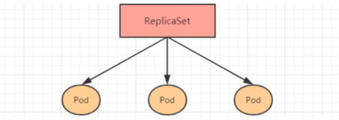
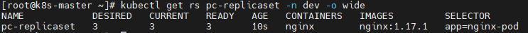
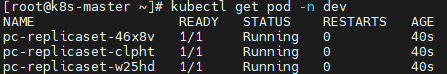
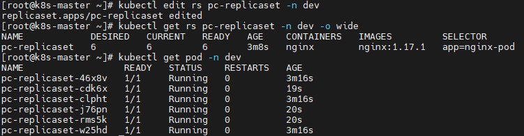
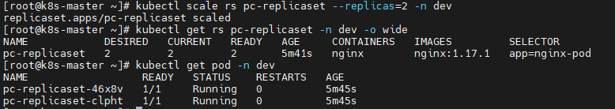
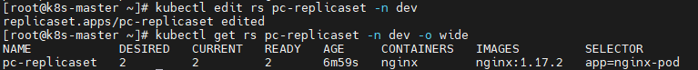
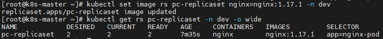

# 1.Pod 控制器的介绍

在 kubernetes 中，按照 Pod 的创建方式可以将其分为两类：

- 自主式 Pod：kubernetes 直接创建出来的 Pod，这种 Pod 删除后就没有了，也不会重建；
- 控制器创建 Pod：通过 Pod 控制器创建的 Pod，这种 Pod 删除之后还会自动重建。

> Pod 控制器：Pod 控制器是管理 Pod 的中间层，使用了 Pod 控制器之后，我们只需要告诉 Pod 控制器，想要多少个什么样的 Pod 就可以了，它就会创建出满足条件的 Pod 并确保每一个 Pod 处于用户期望的状态，如果 Pod 在运行中出现故障，控制器会基于指定的策略重启或重建 Pod。

在 kubernetes 中，有很多类型的 Pod 控制器，每种都有自己的适合的场景，常见的有下面这些：

- ReplicationController：比较原始的 Pod 控制器，已经被废弃，由 ReplicaSet 替代；
- ReplicaSet：保证指定数量的 Pod 运行，并支持 Pod 数量变更，镜像版本变更；
- Deployment：通过控制 ReplicaSet 来控制 Pod，并支持滚动升级、版本回退；
- Horizontal Pod Autoscaler：可以根据集群负载自动调整 Pod 的数量，实现削峰填谷；
- DaemonSet：在集群中的指定 Node 上都运行一个副本，一般用于守护进程类的任务；
- Job：它创建出来的 Pod 只要完成任务就立即退出，用于执行一次性任务；
- CronJob：它创建的 Pod 会周期性的执行，用于执行周期性的任务；
- StatefulSet：管理有状态的应用。

# 2.ReplicaSet（RS）

## 2.1 概述

ReplicaSet 的主要作用是保证一定数量的 Pod 能够正常运行，它会持续监听这些 Pod 的运行状态，一旦 Pod 发生故障，就会重启或重建。同时它还支持对 Pod 数量的扩缩容和版本镜像的升级。



ReplicaSet 的资源清单文件：

```yaml
apiVersion: apps/v1 # 版本号 
kind: ReplicaSet # 类型 
metadata: # 元数据 
  name: # rs名称
  namespace: # 所属命名空间 
  labels: #标签 
    controller: rs 
spec: # 详情描述 
  replicas: 3 # 副本数量 
  selector: # 选择器，通过它指定该控制器管理哪些po
    matchLabels: # Labels匹配规则 
      app: nginx-pod 
    matchExpressions: # Expressions匹配规则 
      - {key: app, operator: In, values: [nginx-pod]} 
template: # 模板，当副本数量不足时，会根据下面的模板创建pod副本 
  metadata: 
    labels: 
      app: nginx-pod 
  spec: 
    containers: 
      - name: nginx 
        image: nginx:1.17.1 
        ports: 
        - containerPort: 80
```

需要新了解的配置项就是 spec 下面几个选项：

- replicas：指定副本数量，其实就是当然 rs 创建出来的 Pod 的数量，默认为1；
- selector：选择器，它的作用是建立 Pod 控制器和 Pod 之间的关联关系，采用了 Label Selector 机制（在 Pod 模块上定义 Label，在控制器上定义选择器，就可以表明当前控制器能管理哪些 Pod 了）；
- template：模板，就是当前控制器创建 Pod 所使用的模板，里面其实就是前面学过的 Pod 的定义。

## 2.2 创建 ReplicaSet

创建 pc-replicaset.yaml 文件，内容如下：

```yaml
apiVersion: apps/v1 # 版本号
kind: ReplicaSet # 类型
metadata: # 元数据
  name: pc-replicaset # rs名称
  namespace: dev # 命名类型
spec: # 详细描述
  replicas: 3 # 副本数量
  selector: # 选择器，通过它指定该控制器可以管理哪些Pod
    matchLabels: # Labels匹配规则
      app: nginx-pod
  template: # 模块 当副本数据不足的时候，会根据下面的模板创建Pod副本
    metadata:
      labels:
        app: nginx-pod
    spec:
      containers:
        - name: nginx # 容器名称
          image: nginx:1.17.1 # 容器需要的镜像地址
          ports:
            - containerPort: 80 # 容器所监听的端口
```

创建 rs：

```bash
$ kubectl create -f pc-replicaset.yaml
```

查看 rs：

```bash
$ kubectl get rs pc-replicaset -n dev -o wide
```



- DESIRED：期望的 Pod 数量
- CURRENT：当前运行的 Pod 数量
- READY：已经就绪的 Pod 数量

查看当前控制器创建出来的 Pod（控制器创建出来的 Pod 的名称是在控制器名称后面拼接了 -xxx 随机码）：

```bash
$ kubectl get pod -n dev
```



## 2.3 扩缩容

编辑 rs 的副本数量，修改 spec:replicas:6 即可。

```bash
$ kubectl edit rs pc-replicaset -n dev
```

执行命令后会像 vim 编辑器一样打开 yaml 文件，直接编辑 replicas 字段将其改成 6，然后 `:wq` 保存退出，再次查看 rs 和 pod 发现都变成了 6：



使用scale命令实现扩缩容，后面加上 --replicas=n 直接指定目标数量即可。

```bash
$ kubectl scale rs pc-replicaset --replicas=2 -n dev
```



## 2.4 镜像升级

编辑 rs 的容器镜像，修改 spec:containers:image 为 nginx:1.17.2 即可。

```bash
$ kubectl edit rs pc-replicaset -n dev
```



使用 set 命令实现镜像升级：

```bash
$ kubectl set image rs <rs名称> <容器名称=镜像版本> [-n 命名空间]
```

修改 nginx 镜像版本为：nginx:1.17.1

```bash
$ kubectl set image rs pc-replicaset nginx=nginx:1.17.1 -n dev
```



## 2.5 删除ReplicaSet

使用 `kubectl delete rs` 命令会删除 ReplicaSet 和其管理的 Pod，在 kubernetes 删除 ReplicaSet 前，会将 ReplicaSet 的 replicas 调整为 0，等到所有的 Pod 被删除后，再执行 ReplicaSet 对象的删除，具体如下：

```bash
$ kubectl delete rs pc-replicaset -n dev
```

如果希望仅仅删除 ReplicaSet 对象（保留 Pod），只需要在使用 `kubectl delete rs` 命令的时候添加 `--cascade=false`  选项（不推荐）：

```bash
$ kubectl delete rs pc-replicaset -n dev --cascade=false
```

使用 yaml 直接删除（推荐）：

```bash
$ kubectl delete -f pc-replicaset.yaml
```

