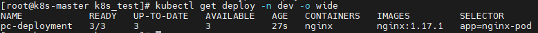

# 1.Pod 控制器的介绍

在 kubernetes 中，按照 Pod 的创建方式可以将其分为两类：

- 自主式 Pod：kubernetes 直接创建出来的 Pod，这种 Pod 删除后就没有了，也不会重建；
- 控制器创建 Pod：通过 Pod 控制器创建的 Pod，这种 Pod 删除之后还会自动重建。

> Pod 控制器：Pod 控制器是管理 Pod 的中间层，使用了 Pod 控制器之后，我们只需要告诉 Pod 控制器，想要多少个什么样的 Pod 就可以了，它就会创建出满足条件的 Pod 并确保每一个 Pod 处于用户期望的状态，如果 Pod 在运行中出现故障，控制器会基于指定的策略重启或重建 Pod。

在 kubernetes 中，有很多类型的 Pod 控制器，每种都有自己的适合的场景，常见的有下面这些：

- ReplicationController：比较原始的 Pod 控制器，已经被废弃，由 ReplicaSet 替代；
- ReplicaSet：保证指定数量的 Pod 运行，并支持 Pod 数量变更，镜像版本变更；
- Deployment：通过控制 ReplicaSet 来控制 Pod，并支持滚动升级、版本回退；
- Horizontal Pod Autoscaler：可以根据集群负载自动调整 Pod 的数量，实现削峰填谷；
- DaemonSet：在集群中的指定 Node 上都运行一个副本，一般用于守护进程类的任务；
- Job：它创建出来的 Pod 只要完成任务就立即退出，用于执行一次性任务；
- CronJob：它创建的 Pod 会周期性的执行，用于执行周期性的任务；
- StatefulSet：管理有状态的应用。

# 2.ReplicaSet（RS）

## 2.1 概述

ReplicaSet 的主要作用是保证一定数量的 Pod 能够正常运行，它会持续监听这些 Pod 的运行状态，一旦 Pod 发生故障，就会重启或重建。同时它还支持对 Pod 数量的扩缩容和版本镜像的升级。


ReplicaSet 的资源清单文件：

```yaml
apiVersion: apps/v1 # 版本号 
kind: ReplicaSet # 类型 
metadata: # 元数据 
  name: # rs名称
  namespace: # 所属命名空间 
  labels: #标签 
    controller: rs 
spec: # 详情描述 
  replicas: 3 # 副本数量 
  selector: # 选择器，通过它指定该控制器管理哪些po
    matchLabels: # Labels匹配规则 
      app: nginx-pod 
    matchExpressions: # Expressions匹配规则 
      - {key: app, operator: In, values: [nginx-pod]} 
template: # 模板，当副本数量不足时，会根据下面的模板创建pod副本 
  metadata: 
    labels: 
      app: nginx-pod 
  spec: 
    containers: 
      - name: nginx 
        image: nginx:1.17.1 
        ports: 
        - containerPort: 80
```

需要新了解的配置项就是 spec 下面几个选项：

- replicas：指定副本数量，其实就是当然 rs 创建出来的 Pod 的数量，默认为1；
- selector：选择器，它的作用是建立 Pod 控制器和 Pod 之间的关联关系，采用了 Label Selector 机制（在 Pod 模块上定义 Label，在控制器上定义选择器，就可以表明当前控制器能管理哪些 Pod 了）；
- template：模板，就是当前控制器创建 Pod 所使用的模板，里面其实就是前面学过的 Pod 的定义。

## 2.2 创建 ReplicaSet

创建 pc-replicaset.yaml 文件，内容如下：

```yaml
apiVersion: apps/v1 # 版本号
kind: ReplicaSet # 类型
metadata: # 元数据
  name: pc-replicaset # rs名称
  namespace: dev # 命名类型
spec: # 详细描述
  replicas: 3 # 副本数量
  selector: # 选择器，通过它指定该控制器可以管理哪些Pod
    matchLabels: # Labels匹配规则
      app: nginx-pod
  template: # 模块 当副本数据不足的时候，会根据下面的模板创建Pod副本
    metadata:
      labels:
        app: nginx-pod
    spec:
      containers:
        - name: nginx # 容器名称
          image: nginx:1.17.1 # 容器需要的镜像地址
          ports:
            - containerPort: 80 # 容器所监听的端口
```

创建 rs：

```bash
$ kubectl create -f pc-replicaset.yaml
```

查看 rs：

```bash
$ kubectl get rs pc-replicaset -n dev -o wide
```


- DESIRED：期望的 Pod 数量
- CURRENT：当前运行的 Pod 数量
- READY：已经就绪的 Pod 数量

查看当前控制器创建出来的 Pod（控制器创建出来的 Pod 的名称是在控制器名称后面拼接了 -xxx 随机码）：

```bash
$ kubectl get pod -n dev
```


## 2.3 扩缩容

编辑 rs 的副本数量，修改 spec:replicas:6 即可。

```bash
$ kubectl edit rs pc-replicaset -n dev
```

执行命令后会像 vim 编辑器一样打开 yaml 文件，直接编辑 replicas 字段将其改成 6，然后 `:wq` 保存退出，再次查看 rs 和 pod 发现都变成了 6：


使用scale命令实现扩缩容，后面加上 --replicas=n 直接指定目标数量即可。

```bash
$ kubectl scale rs pc-replicaset --replicas=2 -n dev
```


## 2.4 镜像升级

编辑 rs 的容器镜像，修改 spec:containers:image 为 nginx:1.17.2 即可。

```bash
$ kubectl edit rs pc-replicaset -n dev
```


使用 set 命令实现镜像升级：

```bash
$ kubectl set image rs <rs名称> <容器名称=镜像版本> [-n 命名空间]
```

修改 nginx 镜像版本为：nginx:1.17.1

```bash
$ kubectl set image rs pc-replicaset nginx=nginx:1.17.1 -n dev
```


## 2.5 删除ReplicaSet

使用 `kubectl delete rs` 命令会删除 ReplicaSet 和其管理的 Pod，在 kubernetes 删除 ReplicaSet 前，会将 ReplicaSet 的 replicas 调整为 0，等到所有的 Pod 被删除后，再执行 ReplicaSet 对象的删除，具体如下：

```bash
$ kubectl delete rs pc-replicaset -n dev
```

如果希望仅仅删除 ReplicaSet 对象（保留 Pod），只需要在使用 `kubectl delete rs` 命令的时候添加 `--cascade=false`  选项（不推荐）：

```bash
$ kubectl delete rs pc-replicaset -n dev --cascade=false
```

使用 yaml 直接删除（推荐）：

```bash
$ kubectl delete -f pc-replicaset.yaml
```

# 3.Deployment（Deploy）

## 3.1 概述

为了更好的解决服务编排的问题，kubernetes 在 v1.2 版本开始，引入了 Deployment 控制器。值得一提的是，Deployment 控制器并不直接管理 Pod，而是通过管理 ReplicaSet 来间接管理 Pod，即：Deployment 管理 ReplicaSet，ReplicaSet 管理 Pod。所以 Deployment 的功能比 ReplicaSet 强大。


Deployment 的主要功能如下：

- 支持 ReplicaSet 的所有功能；
- 支持发布的停止、继续；
- 支持版本滚动更新和版本回退。

Deployment 的资源清单：

``` yaml
apiVersion: apps/v1 # 版本号 
kind: Deployment # 类型 
metadata: # 元数据 
  name: # rs名称 
  namespace: # 所属命名空间 
  labels: #标签 
    controller: deploy 
spec: # 详情描述 
  replicas: 3 # 副本数量 
  revisionHistoryLimit: 3 # 保留历史版本，默认为10 
  paused: false # 暂停部署，默认是false 
  progressDeadlineSeconds: 600 # 部署超时时间（s），默认是600 
  strategy: # 策略 
    type: RollingUpdate # 滚动更新策略 
    rollingUpdate: # 滚动更新 
      maxSurge: 30% # 最大额外可以存在的副本数，可以为百分比，也可以为整数 maxUnavailable: 30% # 最大不可用状态的    Pod 的最大值，可以为百分比，也可以为整数 
  selector: # 选择器，通过它指定该控制器管理哪些pod 
    matchLabels: # Labels匹配规则 
      app: nginx-pod 
    matchExpressions: # Expressions匹配规则 
      - {key: app, operator: In, values: [nginx-pod]} 
  template: # 模板，当副本数量不足时，会根据下面的模板创建pod副本 
    metadata: 
      labels: 
        app: nginx-pod 
    spec: 
      containers: 
      - name: nginx 
        image: nginx:1.17.1 
        ports: 
        - containerPort: 80
```

## 3.2 创建Deployment

创建 pc-deployment.yaml 文件，内容如下：

```yaml
apiVersion: apps/v1 # 版本号
kind: Deployment # 类型
metadata: # 元数据
  name: pc-deployment # deployment的名称
  namespace: dev # 命名类型
spec: # 详细描述
  replicas: 3 # 副本数量
  selector: # 选择器，通过它指定该控制器可以管理哪些Pod
    matchLabels: # Labels匹配规则
      app: nginx-pod
  template: # 模块 当副本数据不足的时候，会根据下面的模板创建Pod副本
    metadata:
      labels:
        app: nginx-pod
    spec:
      containers:
        - name: nginx # 容器名称
          image: nginx:1.17.1 # 容器需要的镜像地址
          ports:
            - containerPort: 80 # 容器所监听的端口
```

创建 Deployment：

```bash
$ kubectl create -f pc-deployment.yaml
```

查看 Deployment：

```bash
$ kubectl get deploy -n dev -o wide
```



- UP-TO-DATE 最新版本的 Pod 数量
- AVAILABLE 当前可用的 Pod 数量

查看 ReplicaSet：

```bash
$ kubectl get rs -n dev
```


查看 Pod：

```bash
$ kubectl get pod -n dev
```


## 3.3 扩缩容

使用 scale 命令实现扩缩容：

```bash
$ kubectl scale deploy pc-deployment --replicas=5 -n dev
```


编辑 Deployment 的副本数量，执行命令后会像 vim 编辑器一样打开 yaml 文件，直接编辑 replicas 字段将其改成 3，然后 `:wq` 保存退出，再次查看 rs 和 pod 发现都变成了 3

```bash
$ kubectl edit deployment pc-deployment -n dev
```


## 3.4 镜像更新

### 3.4.1 概述

Deployment 支持两种镜像更新的策略：`重建更新`和`滚动更新（默认）`，可以通过 `strategy` 选项进行配置。

- 重建更新：一次性删除所有老版本的 Pod，立即重建相同数量的新版本的 Pod；
- 滚动更新：先删除一部分老版本，再新建一部分新版本，老版本和新版本同时存在，老版本越来越多，新版本越来越少，以此往复，直至替换掉所有的老版本 Pod。

```markdown
strategy: 指定新的Pod替代旧的Pod的策略，支持两个属性
  type: 指定策略类型，支持两种策略
    Recreate：在创建出新的Pod之前会先杀掉所有已经存在的Pod
    RollingUpdate：滚动更新，就是杀死一部分，就启动一部分，在更新过程中，存在两个版本的Pod
  rollingUpdate：当type为RollingUpdate的时候生效，用于为rollingUpdate设置参数，支持两个属性：
    maxUnavailable：用来指定在升级过程中不可用的Pod的最大数量，默认为25%。
    maxSurge： 用来指定在升级过程中可以超过期望的Pod的最大数量，默认为25%。
```

### 3.4.2 重建更新

编辑 pc-deployment.yaml 文件，在 spec 节点下添加更新策略：

```yaml
apiVersion: apps/v1 # 版本号
kind: Deployment # 类型
metadata: # 元数据
  name: pc-deployment # deployment的名称
  namespace: dev # 命名类型
spec: # 详细描述
  replicas: 3 # 副本数量
  strategy: # 镜像更新策略
    type: Recreate # Recreate：在创建出新的Pod之前会先杀掉所有已经存在的Pod
  selector: # 选择器，通过它指定该控制器可以管理哪些Pod
    matchLabels: # Labels匹配规则
      app: nginx-pod
  template: # 模块 当副本数据不足的时候，会根据下面的模板创建Pod副本
    metadata:
      labels:
        app: nginx-pod
    spec:
      containers:
        - name: nginx # 容器名称
          image: nginx:1.17.1 # 容器需要的镜像地址
          ports:
            - containerPort: 80 # 容器所监听的端口
```

更新 Deployment：

```bash
$ kubectl apply -f pc-deployment.yaml
```

镜像升级：

```bash
$ kubectl set image deployment pc-deployment nginx=nginx:1.17.2 -n dev
```

查看更新过程：

``` bash
$ kubectl get pod -n dev -w
```


### 3.4.3 滚动更新

编辑 pc-deployment.yaml 文件，在 spec 节点下添加更新策略：

```yaml
apiVersion: apps/v1 # 版本号
kind: Deployment # 类型
metadata: # 元数据
  name: pc-deployment # deployment的名称
  namespace: dev # 命名类型
spec: # 详细描述
  replicas: 3 # 副本数量
  strategy: # 镜像更新策略
    type: RollingUpdate # RollingUpdate：滚动更新，就是杀死一部分，就启动一部分，在更新过程中，存在两个版本的Pod
    rollingUpdate:
      maxUnavailable: 25%
      maxSurge: 25%
  selector: # 选择器，通过它指定该控制器可以管理哪些Pod
    matchLabels: # Labels匹配规则
      app: nginx-pod
  template: # 模块 当副本数据不足的时候，会根据下面的模板创建Pod副本
    metadata:
      labels:
        app: nginx-pod
    spec:
      containers:
        - name: nginx # 容器名称
          image: nginx:1.17.1 # 容器需要的镜像地址
          ports:
            - containerPort: 80 # 容器所监听的端口
```

更新 Deployment：

```bash
$ kubectl apply -f pc-deployment.yaml
```

镜像升级：

```bash
$ kubectl set image deployment pc-deployment nginx=nginx:1.17.3 -n dev
```

查看更新过程：

``` bash
$ kubectl get pod -n dev -w
```


滚动更新的过程：


镜像更新中 rs 的变化：

```bash
$ kubectl get rs -n dev
```


查看 rs，发现原来的 rs 依旧存在，只是 Pod 的数量变为0，而后又产生了一个 rs，Pod 的数量变为 3，其实这就是 deploymen t能够进行版本回退的奥妙所在。

## 3.5 版本回退

Deployment 支持版本升级过程中的暂停、继续功能以及版本回退等诸多功能，下面具体来看：

```markdown
# 版本升级相关功能
kubetl rollout <参数> deploy <deployment的名称>  # 支持下面的选择
# status 显示当前升级的状态
# history 显示升级历史记录
# pause 暂停版本升级过程
# resume 继续已经暂停的版本升级过程
# restart 重启版本升级过程
# undo 回滚到上一级版本 （可以使用--to-revision回滚到指定的版本）
```

查看当前升级版本的状态：

```bash
$ kubectl rollout status deployment pc-deployment -n dev
```


查看升级历史记录：

```bash
$ kubectl rollout history deployment pc-deployment -n dev
```


版本回退：可以使用 `--to-revision=1` 回退到 1 版本，如果省略这个选项，就是回退到上个版本，即 2 版本：

```bash
$ kubectl rollout undo deployment pc-deployment --to-revision=1 -n dev
```


deployment 之所以能够实现版本的回退，就是通过记录下历史的 ReplicaSet 来实现的，一旦想回滚到那个版本，只需要将当前版本的 Pod 数量降为 0，然后将回退版本的 Pod 提升为目标数量即可。

## 3.6 金丝雀发布

Deployment 支持更新过程中的控制，如暂停更新操作（pause）或继续更新操作（resume）。

例如有一批新的 Pod 资源创建完成后立即暂停更新过程，此时，仅存在一部分新版本的应用，主体部分还是旧的版本。然后，再筛选一小部分的用户请求到新版本的 Pod 应用，继续观察能够稳定的按照期望的方式运行，如果没有问题之后再继续完成余下的 Pod 资源的滚动更新，否则立即回滚操作。

更新 Deployment 的版本，并配置暂停 Deployment：

``` bash
$ kubectl set image deployment pc-deployment nginx=nginx:1.17.4 -n dev && kubectl rollout pause deployment pc-deployment -n dev
```


观察更新状态：

```bash
$ kubectl rollout status deployment pc-deployment -n dev
```


监控更新的过程，可以看到已经新增了一个资源，但是并没有按照预期的状态去删除一个旧的资源，因为使用了 pause 暂停命令：

```bash
$ kubectl get rs -n dev -o wide
```


查看Pod：

```bash
$ kubectl get pod -n dev
```


确保更新的 Pod 没问题之后，继续更新：

```bash
$ kubectl rollout resume deployment pc-deployment -n dev
```

观察更新状态：


再次查看 rs,pod：

``` bash
$ kubectl get rs,pod -n dev
```


## 3.7 删除 Deployment

删除 Deployment，其下的 ReplicaSet 和 Pod 也会一起被删除：

```bash
$ kubectl delete -f pc-deployment.yaml
```
