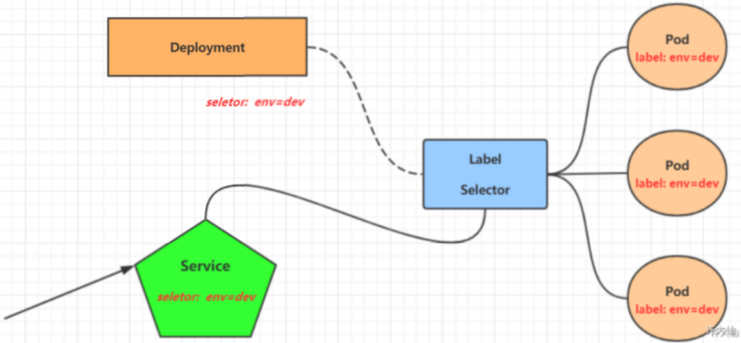
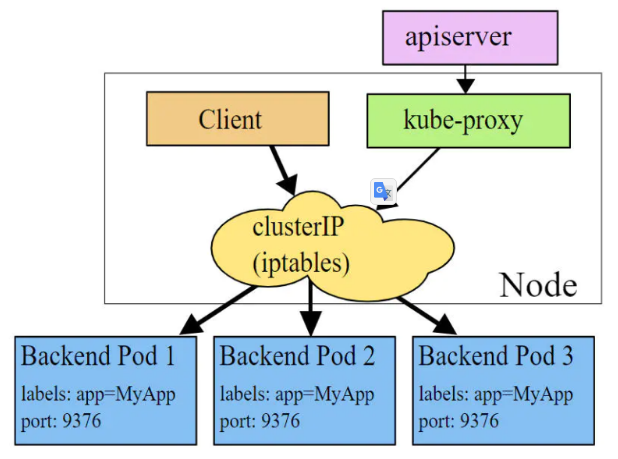
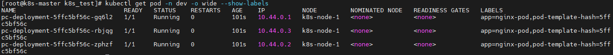
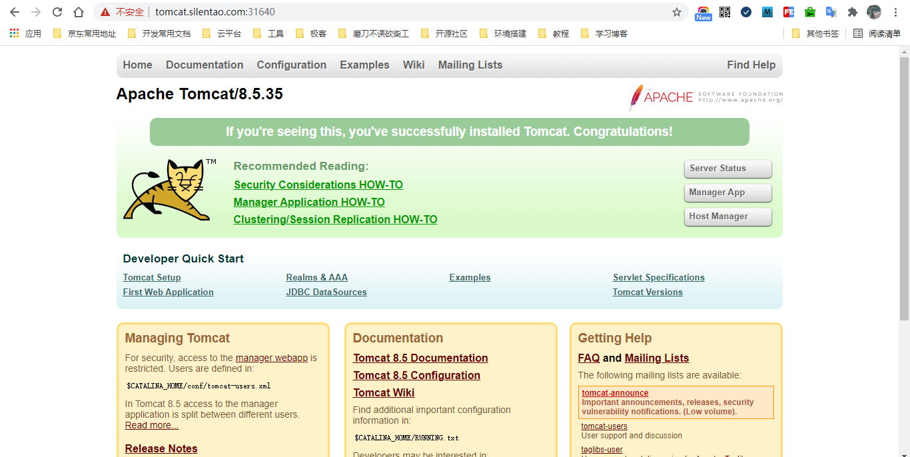

> 主要介绍 kubernetes 的流量负载组件：Service 和 Ingress。

# 1.Service 介绍

在 kubernetes 中，Pod 是应用程序的载体，我们可以通过 Pod 的 IP 来访问应用程序，但是 Pod 的 IP 地址不是固定的，这就意味着不方便直接采用 Pod 的 IP 对服务进行访问。

为了解决这个问题，kubernetes 提供了 Service 资源，Service 会对提供同一个服务的多个 Pod 进行聚合，并且提供一个统一的入口地址，通过访问 Service 的入口地址就能访问到后面的Pod服务。



Service 在很多情况下只是一个概念，真正起作用的其实是 kube-proxy 服务进程，每个 Node 节点上都运行了一个 kube-proxy 的服务进程。当创建 Service 的时候会通过 API Server 向 etcd 写入创建的 Service 的信息，而 kube-proxy 会基于监听的机制发现这种 Service 的变化，然后它会将最新的 Service 信息转换为对应的访问规则。


```bash
$ ipvsadm -Ln
IP Virtual Server version 1.2.1 (size=4096)
Prot LocalAddress:Port Scheduler Flags
 -> RemoteAddress:Port  Forward Weight ActiveConn InActConn
 # 10.97.97.97:80 是service提供的访问入口
 # 当访问这个入口的时候，可以发现后面有三个pod的服务在等待调用，
 # kube-proxy会基于rr（轮询）的策略，将请求分发到其中一个pod上去
 # 这个规则会同时在集群内的所有节点上都生成，所以在任何一个节点上访问都可以。
 TCP 10.97.97.97:80 rr
  -> 10.244.1.39:80   Masq  1  0  0
  -> 10.244.1.40:80   Masq  1  0  0
  -> 10.244.2.33:80   Masq  1  0  0
```

kube-proxy 目前支持三种工作模式：

**1.userspace 模式**

userspace 模式下，kube-proxy 会为每一个 Service 创建一个监听端口，发向 Cluster IP 的请求被 iptables 规则重定向到 kube-proxy 监听的端口上，kube-proxy 根据 LB 算法（负载均衡算法）选择一个提供服务的 Pod 并和其建立连接，以便将请求转发到 Pod 上。

该模式下，kube-proxy 充当了一个四层负载均衡器的角色。由于 kube-proxy 运行在 userspace 中，在进行转发处理的时候会增加内核和用户空间之间的数据拷贝，虽然比较稳定，但是效率非常低下。


**2.iptables 模式**

iptables 模式下，kube-proxy 为 Service 后端的每个 Pod 创建对应的 iptables 规则，直接将发向 Cluster IP 的请求重定向到一个 Pod 的IP上。
该模式下 kube-proxy 不承担四层负载均衡器的角色，只负责创建 iptables 规则。该模式的优点在于较 userspace 模式效率更高，但是不能提供灵活的LB策略，当后端 Pod 不可用的时候无法进行重试。



**3.ipvs 模式**

ipvs 模式和 iptables 类似，kube-proxy 监控 Pod 的变化并创建相应的 ipvs 规则。ipvs 相对 iptables 转发效率更高，除此之外，ipvs 支持更多的 LB 算法。


开启 ipvs（必须安装 ipvs 内核模块，否则会降级为 iptables）：

```bash
$ kubectl edit cm kube-proxy -n kube-system
```


将字段 `mode` 的值改为 `ipvs`

删除当前的 kube-proxy 的 Pod，让它重新生成：

``` bash
$ kubectl delete pod -l k8s-app=kube-proxy -n kube-system
```

查看 ipvs 模块是否开启成功：

``` bash
$ ipvsadm -Ln
```


# 2.Service 类型

Service 的资源清单：

```yaml
apiVersion: v1 # 版本
kind: Service # 类型
metadata: # 元数据
  name: # 资源名称
  namespace: # 命名空间
spec:
  selector: # 标签选择器，用于确定当前Service代理那些Pod
    app: nginx
  type: NodePort # Service的类型，指定Service的访问方式
  clusterIP: # 虚拟服务的IP地址
  sessionAffinity: # session亲和性，支持ClientIP、None两个选项，默认值为None
  ports: # 端口信息
    - port: 8080 # Service端口
      protocol: TCP # 协议
      targetPort : # Pod端口
      nodePort:  # 主机端口
```

spec.type 的说明：

- ClusterIP：默认值，它是 kubernetes 系统自动分配的虚拟 IP，只能在集群内部访问；
- NodePort：将 Service 通过指定的 Node 上的端口暴露给外部，通过此方法，就可以在集群外部访问服务；
- LoadBalancer：使用外接负载均衡器完成到服务的负载分发，注意此模式需要外部云环境的支持；
- ExternalName：把集群外部的服务引入集群内部，直接使用。

# 3.Service 使用

## 3.1 实验环境准备

在使用 Service 之前，首先利用 Deployment 创建出 3 个 Pod，注意要为 Pod 设置 `app=nginx-pod` 的标签。创建 deployment.yaml 文件，内容如下：

```yaml
apiVersion: apps/v1
kind: Deployment
metadata:
  name: pc-deployment
  namespace: dev
spec:
  replicas: 3
  selector:
    matchLabels:
      app: nginx-pod
  template:
    metadata:
      labels:
        app: nginx-pod
    spec:
      containers:
        - name: nginx
          image: nginx:1.17.1
          ports:
            - containerPort: 80
```

创建 Deployment：

```bash
$ kubectl create -f deployment.yaml
```


查看 Pod 信息：

```bash
$ kubectl get pod -n dev -o wide --show-labels
```



为了方便后面的测试，修改三台 Nginx 的 index.html：

```bash
# 进入容器
$ kubectl exec -it  pc-deployment-5ffc5bf56c-gq6l2 -c nginx -n dev /bin/sh

# 修改 nginx 首页
$ echo "10.44.0.1" > /usr/share/nginx/html/index.html
```

修改完毕之后，测试访问：

```bash
$ curl 10.244.1.30
```


## 3.2 ClusterIP 类型的 Service

### 3.2.1 创建 Service

创建 service-clusterip.yaml 文件，内容如下：

```yaml
apiVersion: v1
kind: Service
metadata:
  name: service-clusterip
  namespace: dev
spec:
  selector:
    app: nginx-pod
  clusterIP: 10.97.97.97 # service的IP地址，如果不写，默认会生成一个
  type: ClusterIP
  ports:
    - port: 80 # Service的端口
      targetPort: 80 # Pod的端口
```

创建 Service：

```bash
$ kubectl create -f service-clusterip.yaml
```

查看 Service：

``` bash
$ kubectl get svc -n dev
```


``` bash
$ kubectl describe svc service-clusterip -n dev
```


**Endpoint**

> Endpoint 是 kubernetes 中的一个资源对象，存储在 etcd 中，用来记录一个 service 对应的所有 Pod 的访问地址，它是根据 service 配置文件中的 selector 描述产生的。
>
> 一个 service 由一组 Pod 组成，这些 Pod 通过 Endpoints 暴露出来，**Endpoints 是实现实际服务的端点集合**。换言之，service 和 Pod 之间的联系是通过 Endpoints 实现的。


查看 Endpoint：

```bash
$ kubectl get endpoints -n dev -o wide
```


查看 ipvs 的映射规则：

```bash
$ ipvsadm -Ln
```


**负载分发策略**

> 对 Service 的访问被分发到了后端的 Pod 上去，目前 kubernetes 提供了两种负载分发策略：
>
> 1. 如果不定义，默认使用 kube-proxy 的策略，比如随机、轮询等；
> 2. 基于客户端地址的会话保持模式，即来自同一个客户端发起的所有请求都会转发到固定的一个 Pod 上，这对于传统基于 Session 的认证项目来说很友好，此模式可以在 spec 中添加 `sessionAffinity: ClusterIP` 选项。

### 3.2.2 测试

循环测试访问：

``` bash
$ while true;do curl 10.97.97.97:80; sleep 5; done;
```


修改负载分发策略，在 spec 中添加 `sessionAffinity: ClientIP` 选项，修改 service-clusterip.yaml 如下：

```yaml
apiVersion: v1
kind: Service
metadata:
  name: service-clusterip
  namespace: dev
spec:
  sessionAffinity: ClientIP
  selector:
    app: nginx-pod
  clusterIP: 10.97.97.97 # service的IP地址，如果不写，默认会生成一个
  type: ClusterIP
  ports:
    - port: 80 # Service的端口
      targetPort: 80 # Pod的端口
```

查看 Service 详情：

``` bash
$ kubectl describe svc -n dev
```


查看 IPVS：

``` bash
$ ipvsadm -Ln
```


> persistent 表示会话保持，保持时间为 10800

循环测试访问：

``` bash
$ while true;do curl 10.97.97.97:80; sleep 5; done;
```


### 3.2.3 删除 Service

``` bash
$ kubectl delete -f service-clusterip.yaml
```

## 3.3 HeadLiness 类型的 Service

### 3.3.1 概述

在某些场景中，开发人员可能不想使用 Service 提供的负载均衡功能，而希望自己来控制负载均衡策略，针对这种情况，kubernetes 提供了 HeadLinesss Service，这类 Service 不会分配 Cluster IP，如果想要访问 Service，只能通过 Service 的域名进行查询。

### 3.3.2 创建 Service

创建 service-headliness.yaml 文件，内容如下：

```yaml
apiVersion: v1
kind: Service
metadata:
  name: service-headliness
  namespace: dev
spec:
  selector:
    app: nginx-pod
  clusterIP: None # 将clusterIP设置为None，即可创建headliness Service
  type: ClusterIP
  ports:
    - port: 80 # Service的端口
      targetPort: 80 # Pod的端口
```

创建 Service：

```bash
$ kubectl create -f service-headliness.yaml
```

查看 Service：

``` bash
$ kubectl get svc -n dev
```


查看 Service 详情：

``` bash
$ kubectl describe svc -n dev
```


### 3.3.3 查看域名解析情况

查看 Pod：

```bash
$ kubectl get pod -n dev
```


进入 Pod 中，执行 `cat /etc/resolv.conf` 命令：

```bash
# 进入容器
$ kubectl exec -it pc-deployment-5ffc5bf56c-gq6l2 -n dev /bin/sh

# 查看域名
$ cat /etc/resolv.conf
```


### 3.3.4 通过 Service 的域名进行访问

通过 Service 的域名进行访问：

``` bash
# 访问规则
$ dig @<nameserver> <service-name>.<search>

# 测试
$ dig @10.96.0.10 service-headliness.dev.svc.cluster.local
```


## 3.4 NodePort 类型的 Service

### 3.4.1 概述

在之前的案例中，创建的 Service 的 IP 地址只能在集群内部才可以访问，如果希望 Service 暴露给集群外部使用，那么就需要使用到另外一种类型的 Service，称为 NodePort 类型的 Service。NodePort 的工作原理就是将 Service 的端口映射到 Node 的一个端口上，然后就可以通过 `NodeIP:NodePort` 来访问 Service 了。


### 3.4.2 创建 Service

创建 service-nodeport.yaml 文件，内容如下：

```yaml
apiVersion: v1
kind: Service
metadata:
  name: service-nodeport
  namespace: dev
spec:
  selector:
    app: nginx-pod
  type: NodePort # Service类型为NodePort
  ports:
    - port: 80 # Service的端口
      targetPort: 80 # Pod的端口
      nodePort: 30002 # 指定绑定的node的端口（默认取值范围是30000~32767），如果不指定，会默认分配
```

创建 Service：

```bash
$ kubectl create -f service-nodeport.yaml
```

### 3.4.3 查看 Service

查看 Service：

```bash
$ kubectl get svc service-nodeport -n dev -o wide
```


### 3.4.4 访问

通过浏览器访问：http://192.168.3.100:30002/ 即可访问对应的 Pod。


## 3.5 LoadBalancer 类型的 Service

LoadBalancer 和 NodePort 很相似，目的都是向外部暴露一个端口，区别在于 LoadBalancer 会在集群的外部再来做一个负载均衡设备，而这个设备需要外部环境的支持，外部服务发送到这个设备上的请求，会被设备负载之后转发到集群中。


## 3.6 ExternalName 类型的 Service

### 3.6.1 概述

ExternalName 类型的 Service 用于引入集群外部的服务，它通过 externalName 属性指定一个服务的地址，然后在集群内部访问此 Service 就可以访问到外部的服务了。

### 3.6.2 创建 Service

创建 service-externalname.yaml 文件，内容如下：

```yaml
apiVersion: v1
kind: Service
metadata:
  name: service-externalname
  namespace: dev
spec:
  type: ExternalName # Service类型为ExternalName
  externalName: www.baidu.com # 改成IP地址也可以
```

创建 Service：

```bash
$ kubectl create -f service-externalname.yaml
```

### 3.6.3 域名解析

域名解析：

```bash
$ dig @10.96.0.10 service-externalname.dev.svc.cluster.local
```


# 4.Ingress 介绍

我们已经知道，Service 对集群之外暴露服务的主要方式有两种：NodePort 和 LoadBalancer，但是这两种方式，都有一定的缺点：

- NodePort 方式的缺点是会占用很多集群机器的端口，那么当集群服务变多的时候，这个缺点就愈发明显；
- LoadBalancer 的缺点是每个 Service 都需要一个 LB，浪费，麻烦，并且需要 kubernetes 之外的设备的支持。

基于这种现状，kubernetes 提供了 Ingress 资源对象，Ingress 只需要一个 NodePort 或者一个 LB 就可以满足暴露多个 Service 的需求，工作机制大致如下图所示：


实际上，Ingress 相当于一个七层的负载均衡器，是 kubernetes 对反向代理的一个抽象，它的工作原理类似于 Nginx，可以理解为**在 Ingress 里面建立了诸多映射规则，Ingress Controller 通过监听这些配置规则并转化为 Nginx 的反向代理配置，然后对外提供服务**。在这里有两个核心的概念：

- Ingress：kubernetes 中的一个对象，作用是定义请求如何转发到 Service 的规则；
- Ingress Controller：具体实现反向代理及负载均衡的程序，对 Ingress 定义的规则进行解析，根据配置的规则来实现请求转发，实现的方式有很多，比如 Nginx，Contour，Haproxy 等。

Ingress（以Nginx）的工作原理如下：

1. 用户编写 Ingress 规则，说明那个域名对应 kubernetes 集群中的那个 Service；
2. Ingress 控制器动态感知 Ingress 服务规则的变化，然后生成一段对应的 Nginx 的反向代理配置；
3. Ingress 控制器会将生成的 Nginx 配置写入到一个运行着的 Nginx 服务中，并动态更新；
4. 到此为止，其实真正在工作的就是一个 Nginx 了，内部配置了用户定义的请求规则。


# 5.Ingress 使用

## 5.1 环境准备

### 5.1.1 搭建 Ingress 环境

获取 ingress-nginx，本次使用的是 0.30 版本，下载地址：

mandatory.yaml：

``` javascript
https://raw.githubusercontent.com/kubernetes/ingress-nginx/nginx-0.30.0/deploy/static/mandatory.yaml
```

image 要改成国内的云镜像仓库地址：

~~~ yaml
image: quay-mirror.qiniu.com/kubernetes-ingress-controller/nginx-ingress-controller:0.30.0
~~~

service-nodeport.yaml：

```javascript
https://raw.githubusercontent.com/kubernetes/ingress-nginx/nginx-0.30.0/deploy/static/provider/baremetal/service-nodeport.yaml
```

创建 Ingress-nginx：

```bash
$ kubectl apply -f ./
```

查看 ingress-nginx：

```bash
$ kubectl get pod,svc -n ingress-nginx -o wide
```


### 5.1.2 准备 Service 和 Pod

为了后面的实验比较方便，创建如下图所示的模型：


创建 tomcat-nginx.yaml 文件，内容如下：

```yaml
apiVersion: apps/v1
kind: Deployment
metadata:
  name: nginx-deployment
  namespace: dev
spec:
  replicas: 3
  selector:
    matchLabels:
      app: nginx-pod
  template:
    metadata:
      labels:
        app: nginx-pod
    spec:
      containers:
      - name: nginx
        image: nginx:1.17.1
        ports:
        - containerPort: 80

---

apiVersion: apps/v1
kind: Deployment
metadata:
  name: tomcat-deployment
  namespace: dev
spec:
  replicas: 3
  selector:
    matchLabels:
      app: tomcat-pod
  template:
    metadata:
      labels:
        app: tomcat-pod
    spec:
      containers:
      - name: tomcat
        image: tomcat:8.5-jre10-slim
        ports:
        - containerPort: 8080

---

apiVersion: v1
kind: Service
metadata:
  name: nginx-service
  namespace: dev
spec:
  selector:
    app: nginx-pod
  clusterIP: None
  type: ClusterIP
  ports:
  - port: 80
    targetPort: 80

---

apiVersion: v1
kind: Service
metadata:
  name: tomcat-service
  namespace: dev
spec:
  selector:
    app: tomcat-pod
  clusterIP: None
  type: ClusterIP
  ports:
  - port: 8080
    targetPort: 8080
```

创建 Service 和 Pod：

```bash
$ kubectl create -f tomcat-nginx.yaml
```

查看 Service 和 Pod：

```bash
$ kubectl get svc,pod -n dev -o wide
```


## 5.2 Http 代理

创建 ingress-http.yaml 文件，内容如下：

```yaml
apiVersion: extensions/v1beta1
kind: Ingress
metadata:
  name: ingress-http
  namespace: dev
spec:
  rules:
  - host: nginx.silentao.com
    http:
      paths:
      - path: /
        backend:
          serviceName: nginx-service
          servicePort: 80
  - host: tomcat.silentao.com
    http:
      paths:
      - path: /
        backend:
          serviceName: tomcat-service
          servicePort: 8080
```

创建：

```bash
$ kubectl create -f ingress-http.yaml
```

查看 ingress：

```bash
$ kubectl get ingress ingress-http -n dev -o wide
```


查看详情：

```bash
$ kubectl describe ingress ingress-http -n dev
```


查看 ingress-nginx 的端口（本次测试 http 的端口是 31241，https的端口是 31640）：

```bash
$ kubectl get svc -n ingress-nginx
```


本机通过浏览器输入下面的地址访问：

```javascript
# nginx
http://nginx.silentao.com:31241/
```


~~~ javascript
# tomcat
http://tomcat.silentao.com:31241/
~~~


## 5.3 Https 代理

生成证书：

```bash
$ openssl req -x509 -sha256 -nodes -days 365 -newkey rsa:2048 -keyout tls.key -out tls.crt -subj "/C=CN/ST=BJ/L=BJ/O=nginx/CN=silentao.com"
```

创建密钥：

```bash
$ kubectl create secret tls tls-secret --key tls.key --cert tls.crt
```

创建 ingress-https.yaml 文件，内容如下：

```yaml
apiVersion: extensions/v1beta1
kind: Ingress
metadata:
  name: ingress-https
  namespace: dev
spec:
  tls:
    - hosts:
      - nginx.silentao.com
      - tomcat.silentao.com
      secretName: tls-secret # 指定秘钥
  rules:
  - host: nginx.silentao.com
    http:
      paths:
      - path: /
        backend:
          serviceName: nginx-service
          servicePort: 80
  - host: tomcat.silentao.com
    http:
      paths:
      - path: /
        backend:
          serviceName: tomcat-service
          servicePort: 8080
```

创建：

```bash
$ kubectl create -f ingress-https.yaml
```

查看：

```bash
$ kubectl get ingress ingress-https -n dev
```


查看详情：

```bash
$ kubectl describe ingress ingress-https -n dev
```


本机通过浏览器输入下面的地址访问：

``` javascript
# nginx
https://nginx.silentao.com:31640/
```


``` javascript
# tomcat
https://tomcat.silentao.com:31640/
```


