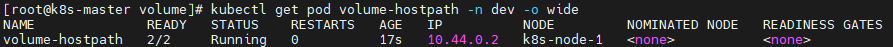

# 1.概述

在前面已经提到，容器的生命周期可能很短，会被频繁的创建和销毁。那么容器在销毁的时候，保存在容器中的数据也会被清除。这种结果对用户来说，在某些情况下是不乐意看到的。为了持久化保存容器中的数据， kubernetes 引入了 Volume 的概念。

Volume 是 Pod 中能够被多个容器访问的共享目录，它被定义在 Pod 上，然后被一个 Pod 里面的多个容器挂载到具体的文件目录下，kubernetes 通过 Volume **实现同一个 Pod 中不同容器之间的数据共享**以及**数据的持久化存储**。Volume 的生命周期不和 Pod 中的单个容器的生命周期有关，当容器终止或者重启的时候，Volume 中的数据也不会丢失。

kubernetes 的 Volume 支持多种类型，比较常见的有下面的几个：

- 简单存储：EmptyDir、HostPath、NFS；
- 高级存储：PV、PVC；
- 配置存储：ConfigMap、Secret。

# 2.基本存储

## 2.1 EmptyDir

### 2.1.1 概述

EmptyDir 是最基础的 Volume 类型，一个 EmptyDir 就是 Host 上的一个空目录。

EmptyDir 是在 Pod 被分配到 Node 时创建的，它的初始内容为空，并且无须指定宿主机上对应的目录文件，因为 kubernetes会 自动分配一个目录，当 Pod 销毁时，EmptyDir 中的数据也会被永久删除。

EmptyDir 的用途如下：

- 临时空间，例如用于某些应用程序运行时所需的临时目录，且无须永久保留；
- 一个容器需要从另一个容器中获取数据的目录（多容器共享目录）。

接下来，通过一个容器之间的共享案例来使用描述一个 EmptyDir：在一个 Pod 中准备两个容器 nginx 和 busybox，然后声明一个 volume 分别挂载到两个容器的目录中，然后 nginx 容器负责向 volume 中写日志，busybox 中通过命令将日志内容读到控制台。


### 2.1.2 创建 Pod

创建 volume-emptydir.yaml 文件，内容如下：

```yaml
apiVersion: v1
kind: Pod
metadata:
  name: volume-emptydir
  namespace: dev
spec:
  containers:
    - name: nginx
      image: nginx:1.17.1
      imagePullPolicy: IfNotPresent
      ports:
        - containerPort: 80
      volumeMounts: # 将logs-volume挂载到nginx容器中对应的目录，该目录为/var/log/nginx
        - name: logs-volume
          mountPath: /var/log/nginx
    - name: busybox
      image: busybox:1.30
      imagePullPolicy: IfNotPresent
      command: ["/bin/sh","-c","tail -f /logs/access.log"] # 初始命令，动态读取指定文件
      volumeMounts: # 将logs-volume挂载到busybox容器中的对应目录，该目录为/logs
        - name: logs-volume
          mountPath: /logs
  volumes: # 声明volume，name为logs-volume，类型为emptyDir
    - name: logs-volume
      emptyDir: {}
```

创建 Pod：

```bash
$ kubectl create -f volume-emptydir.yaml
```

### 2.1.3 查看 Pod

查看 Pod：

```bash
$ kubectl get pod volume-emptydir -n dev -o wide
```


### 2.1.4 访问 Pod 中的 Nginx

访问 Pod 中的 Nginx：

```bash
$ curl 10.44.0.2
```

### 2.1.5 查看指定容器的标准输出

查看指定容器的标准输出：

```bash
$ kubectl logs -f volume-emptydir -n dev -c busybox
```


## 2.2 HostPath

### 2.2.1 概述

我们已经知道 EmptyDir中 的数据不会被持久化，它会随着 Pod 的结束而销毁，如果想要简单的将数据持久化到主机中，可以选择 HostPath。

HostPath 就是将 Node 主机中的一个实际目录挂载到 Pod 中，以供容器使用，这样的设计就可以保证 Pod 销毁了，但是数据依旧可以保存在 Node 主机上。


### 2.2.2 创建 Pod

创建 volume-hostpath.yaml 文件，内容如下：

```yaml
apiVersion: v1
kind: Pod
metadata:
  name: volume-hostpath
  namespace: dev
spec:
  containers:
    - name: nginx
      image: nginx:1.17.1
      imagePullPolicy: IfNotPresent
      ports:
        - containerPort: 80
      volumeMounts: # 将logs-volume挂载到nginx容器中对应的目录，该目录为/var/log/nginx
        - name: logs-volume
          mountPath: /var/log/nginx
    - name: busybox
      image: busybox:1.30
      imagePullPolicy: IfNotPresent
      command: ["/bin/sh","-c","tail -f /logs/access.log"] # 初始命令，动态读取指定文件
      volumeMounts: # 将logs-volume挂载到busybox容器中的对应目录，该目录为/logs
        - name: logs-volume
          mountPath: /logs
  volumes: # 声明volume，name为logs-volume，类型为hostPath
    - name: logs-volume
      hostPath:
        path: /root/logs
        type: DirectoryOrCreate # 目录存在就使用，不存在就先创建再使用
```

> type的值的说明：
>
> - DirectoryOrCreate：目录存在就使用，不存在就先创建后使用。
>
> - Directory：目录必须存在。
>
> - FileOrCreate：文件存在就使用，不存在就先创建后使用。
>
> - File：文件必须存在。
>
> - Socket：unix套接字必须存在。
>
> - CharDevice：字符设备必须存在。
>
> - BlockDevice：块设备必须存在。

创建 Pod：

```bash
$ kubectl create -f volume-hostpath.yaml
```

### 2.2.3 查看Pod

查看 Pod：

```bash
$ kubectl get pod volume-hostpath -n dev -o wide
```



### 2.2.4 访问Pod中的Nginx

访问 Pod 中的 Nginx：

```bash
$ curl 10.44.0.2
```

### 2.2.5 去 node 节点找到 hostPath 映射的目录中的文件

需要到 Pod 所在的节点（k8s-node-1）查看 hostPath 映射的目录中的文件：

```bash
$ ls /root/logs
```


同样的道理，如果在此目录中创建文件，到容器中也是可以看到的。当 pod 停止时，目录文件还在，未被删除。

## 2.3 NFS

### 2.3.1 概述

HostPath 虽然可以解决数据持久化的问题，但是一旦 Node 节点故障了，Pod 如果转移到别的 Node 节点上，又会出现问题，此时需要准备单独的网络存储系统，比较常用的是 NFS 和 CIFS。

NFS 是一个网络文件存储系统，可以搭建一台 NFS 服务器，然后将 Pod 中的存储直接连接到 NFS 系统上，这样，无论 Pod 在节点上怎么转移，只要 Node 和 NFS 的对接没有问题，数据就可以成功访问。


### 2.3.2 搭建 NFS 服务器

首先需要准备 NFS 服务器，这里为了简单，直接在 Master 节点做 NFS 服务器。

在Master节点上安装NFS服务器：

```bash
$ yum install -y nfs-utils rpcbind
```

准备一个共享目录：

```bash
$ mkdir -pv /root/data/nfs
```

将共享目录以读写权限暴露给 `10.252.74.0/24` 网段中的所有主机：

```bash
$ vim /etc/exports
```

在 `/etc/exports` 文件中添加以下内容：

```markdown
/root/data/nfs 10.252.74.0/24(rw,no_root_squash)
```

修改权限：

```bash
$ chmod 777 -R /root/data/nfs
```

加载配置：

```bash
$ exportfs -r
```

启动 nfs 服务：

```bash
# 启动 rpcbind
$ systemctl start rpcbind
# 启用开机自启 rpcbind
$ systemctl enable rpcbind

# 启动 nfs
$ systemctl start nfs
# 启用开机自启 nfs
$ systemctl enable nfs
```

在 Master 节点测试是否挂载成功：

```bash
$ showmount -e 10.252.74.100
```

在 Node 节点上都安装 NFS 服务器，目的是为了 Node 节点可以驱动 NFS 设备，不需要启动。

```bash
$ yum -y install nfs-utils
```

在Node节点测试是否挂载成功：

```bash
$ showmount -e 10.252.74.100
```

### 2.3.3 创建Pod

创建 volume-nfs.yaml 文件，内容如下：

```yaml
apiVersion: v1
kind: Pod
metadata:
  name: volume-nfs
  namespace: dev
spec:
  containers:
    - name: nginx
      image: nginx:1.17.1
      imagePullPolicy: IfNotPresent
      ports:
        - containerPort: 80
      volumeMounts: # 将logs-volume挂载到nginx容器中对应的目录，该目录为/var/log/nginx
        - name: logs-volume
          mountPath: /var/log/nginx
    - name: busybox
      image: busybox:1.30
      imagePullPolicy: IfNotPresent
      command: ["/bin/sh","-c","tail -f /logs/access.log"] # 初始命令，动态读取指定文件
      volumeMounts: # 将logs-volume挂载到busybox容器中的对应目录，该目录为/logs
        - name: logs-volume
          mountPath: /logs
  volumes: # 声明volume
    - name: logs-volume
      nfs:
        server: 10.252.74.100 # NFS服务器地址
        path: /root/data/nfs # 共享文件路径
```

创建 Pod：

```bash
$ kubectl create -f volume-nfs.yaml
```

### 2.3.4 查看 Pod

查看 Pod：

```bash
$ kubectl get pod volume-nfs -n dev
```


### 2.3.5 查看 nfs 服务器上共享目录

查看nfs服务器上共享目录：

```bash
# 查看目录文件
$ ls /root/data/nfs
# 查看 access.log
$ tail -f /root/data/nfs/access.log
```


# 3.高级存储

## 3.1 PV 和 PVC 概述

前面我们已经学习了使用 NFS 提供存储，此时就要求用户会搭建 NFS 系统，并且会在 yaml 配置 nfs。由于 kubernetes 支持的存储系统有很多，要求客户全部掌握，显然不现实。为了能够屏蔽底层存储实现的细节，方便用户使用，kubernetes 引入了 PV 和 PVC 两种资源对象。

- PV（Persistent Volume）是持久化卷的意思，是对底层的共享存储的一种抽象。一般情况下 PV 由 kubernetes 管理员进行创建和配置，它和底层具体的共享存储技术有关，并通过插件完成和共享存储的对接；

- PVC（Persistent Volume Claim）是持久化卷声明的意思，是用户对于存储需求的一种声明。换言之，PVC 其实就是用户向 kubernetes 系统发出的一种资源需求申请。


使用了 PV 和 PVC 之后，工作可以得到进一步的提升：

- 存储：存储工程师维护；
- PV：kubernetes 管理员维护；
- PVC：kubernetes 用户维护。

## 3.2 PV

### 3.2.1 PV 的资源清单文件

PV 是存储资源的抽象，下面是 PV 的资源清单文件：

```yaml
apiVersion: v1
kind: PersistentVolume
metadata:
  name: pv2
spec:
  nfs: # 存储类型，和底层正则的存储对应
    path:
    server:
  capacity: # 存储能力，目前只支持存储空间的设置
    storage: 2Gi
  accessModes: # 访问模式
    -
  storageClassName: # 存储类别
  persistentVolumeReclaimPolicy: # 回收策略
```

pv 的关键配置参数说明：

1. 存储类型

   底层实际存储的类型，kubernetes 支持多种存储类型，每种存储类型的配置有所不同。

2. 存储能力（capacity）

   目前只支持存储空间的设置（`storage=1Gi`），不过未来可能会加入 IOPS、吞吐量等指标的配置。

3. 访问模式（accessModes）
   用来描述用户应用对存储资源的访问权限，访问权限包括下面几种方式：

   - ReadWriteOnce（RWO）：读写权限，但是只能被单个节点挂载；
   - ReadOnlyMany（ROX）：只读权限，可以被多个节点挂载；
   - ReadWriteMany（RWX）：读写权限，可以被多个节点挂载。

   需要注意的是，底层不同的存储类型可能支持的访问模式不同。

4. 回收策略（ persistentVolumeReclaimPolicy）
   当 PV 不再被使用之后，对其的处理方式，目前支持三种策略：

   - Retain（保留）：保留数据，需要管理员手动清理数据；
   - Recycle（回收）：清除 PV 中的数据，效果相当于 `rm -rf /volume/*`；
   - Delete（删除）：和 PV 相连的后端存储完成 volume 的删除操作，常见于云服务器厂商的存储服务。

   需要注意的是，底层不同的存储类型可能支持的回收策略不同。

5. 存储类别（storageClassName）

   PV 可以通过 storageClassName 参数指定一个存储类别，具有特定类型的 PV 只能和请求了该类别的 PVC 进行绑定，未设定类别的 PV 只能和不请求任何类别的 PVC 进行绑定。

6. 状态（status）

   一个 PV 的生命周期，可能会处于 4 种不同的阶段：

   - Available（可用）：表示可用状态，还未被任何 PVC 绑定；
   - Bound（已绑定）：表示 PV 已经被 PVC 绑定；
   - Released（已释放）：表示 PVC 被删除，但是资源还没有被集群重新释放；
   - Failed（失败）：表示该 PV 的自动回收失败。

### 3.2.2 准备工作（准备 NFS 环境）

创建目录：

```bash
$ mkdir -pv /root/data/{pv1,pv2,pv3}
```

授权：

```bash
$ chmod 777 -R /root/data
```

修改 `/etc/exports` 文件：

```bash
$ vim /etc/exports
```

在 `/etc/exports` 文件中添加以下内容：

```markdown
/root/data/pv1     192.168.3.0/24(rw,no_root_squash) 
/root/data/pv2     192.168.3.0/24(rw,no_root_squash) 
/root/data/pv3     192.168.3.0/24(rw,no_root_squash)
```

重启 nfs 服务：

```bash
$ systemctl restart nfs
```

### 3.2.3 创建 PV

创建 pv.yaml 文件，内容如下：

```yaml
apiVersion: v1
kind: PersistentVolume
metadata:
  name: pv1
spec:
  nfs: # 存储类型吗，和底层正则的存储对应
    path: /root/data/pv1
    server: 192.168.3.100
  capacity: # 存储能力，目前只支持存储空间的设置
    storage: 1Gi
  accessModes: # 访问模式
    - ReadWriteMany
  persistentVolumeReclaimPolicy: Retain # 回收策略

---
apiVersion: v1
kind: PersistentVolume
metadata:
  name: pv2
spec:
  nfs: # 存储类型吗，和底层正则的存储对应
    path: /root/data/pv2
    server: 192.168.3.100
  capacity: # 存储能力，目前只支持存储空间的设置
    storage: 2Gi
  accessModes: # 访问模式
    - ReadWriteMany
  persistentVolumeReclaimPolicy: Retain # 回收策略
  
---
apiVersion: v1
kind: PersistentVolume
metadata:
  name: pv3
spec:
  nfs: # 存储类型吗，和底层正则的存储对应
    path: /root/data/pv3
    server: 192.168.3.100
  capacity: # 存储能力，目前只支持存储空间的设置
    storage: 3Gi
  accessModes: # 访问模式
    - ReadWriteMany
  persistentVolumeReclaimPolicy: Retain # 回收策略
```

创建 PV：

```bash
$ kubectl create -f pv.yaml
```

### 3.2.4 查看 PV

查看 PV，PV 是属于集群的，所以不需要加 namespace：

```bash
$ kubectl get pv -o wide
```

## 3.3 PVC

### 3.3.1 PVC 的资源清单文件

PVC 是资源的申请，用来声明对存储空间、访问模式、存储类别需求信息，下面是 PVC 的资源清单文件：

```yaml
apiVersion: v1
kind: PersistentVolumeClaim
metadata:
  name: pvc
  namespace: dev
spec:
  accessModes: # 访客模式
    - 
  selector: # 采用标签对PV选择
  storageClassName: # 存储类别
  resources: # 请求空间
    requests:
      storage: 5Gi
```

PVC的关键配置参数说明：

1. 访客模式（accessModes）：用于描述用户应用对存储资源的访问权限；
2. 选择条件（selector）：通过 Label Selector 的设置，可使 PVC 对于系统中已存在的 PV 进行筛选；
3. 存储类别（storageClassName）：PVC 在定义时可以设定需要的后端存储的类别，只有设置了该 class 的 pv 才能被系统选出；
4. 资源请求（resources）：描述对存储资源的请求。

### 3.3.2 创建 PVC

创建 pvc.yaml 文件，内容如下：

```yaml
apiVersion: v1
kind: PersistentVolumeClaim
metadata:
  name: pvc1
  namespace: dev
spec:
  accessModes: # 访客模式
    - ReadWriteMany
  resources: # 请求空间
    requests:
      storage: 1Gi

---
apiVersion: v1
kind: PersistentVolumeClaim
metadata:
  name: pvc2
  namespace: dev
spec:
  accessModes: # 访客模式
    - ReadWriteMany
  resources: # 请求空间
    requests:
      storage: 1Gi

---
apiVersion: v1
kind: PersistentVolumeClaim
metadata:
  name: pvc3
  namespace: dev
spec:
  accessModes: # 访客模式
    - ReadWriteMany
  resources: # 请求空间
    requests:
      storage: 5Gi
```

创建 PVC：

```bash
$ kubectl create -f pvc.yaml
```

### 3.3.3 查看 PVC

查看 PVC：

```bash
$ kubectl get pvc -n dev -o wide
```

查看 PV：

```bash
$ kubectl get pv -o wide
```

### 3.3.4 创建 Pod 使用 PVC

创建 pvc-pod.yaml 文件，内容如下：

```yaml
apiVersion: v1
kind: Pod
metadata:
  name: pod1
  namespace: dev
spec:
  containers:
  - name: busybox
    image: busybox:1.30
    command: ["/bin/sh","-c","while true;do echo pod1 >> /root/out.txt; sleep 10; done;"]
    volumeMounts:
    - name: volume
      mountPath: /root/
  volumes:
    - name: volume
      persistentVolumeClaim:
        claimName: pvc1
        readOnly: false

---
apiVersion: v1
kind: Pod
metadata:
  name: pod2
  namespace: dev
spec:
  containers:
    - name: busybox
      image: busybox:1.30
      command: ["/bin/sh","-c","while true;do echo pod1 >> /root/out.txt; sleep 10; done;"]
      volumeMounts:
        - name: volume
          mountPath: /root/
  volumes:
    - name: volume
      persistentVolumeClaim:
        claimName: pvc2
        readOnly: false
```

创建 Pod：

```bash
$ kubectl create -f pvc-pod.yaml
```

### 3.3.5 创建 Pod 使用 PVC 后查看 Pod

查看 Pod：

```bash
$ kubectl get pod -n dev -o wide
```

### 3.3.6 创建 Pod 使用 PVC 后查看 PVC

查看 PVC：

```bash
$ kubectl get pvc -n dev -o wide
```

### 3.3.7 创建 Pod 使用 PVC 后查看 PV

查看 PV：

```
kubectl get pv -o wide
```

### 3.3.8 查看nfs中的文件存储

查看 nfs 中的文件存储：

```bash
# 查看 pv1
$ ls /root/data/pv1/out.txt
# 查看 pv2
$ ls /root/data/pv2/out.txt
# 查看 pv3
$ ls /root/data/pv3/out.txt
```

## 3.4 生命周期


PVC和PV是一一对应的，PV和PVC之间的相互作用遵循如下的生命周期。

1. 资源供应

   管理员手动创建底层存储和 PV。

2. 资源绑定
   用户创建 PVC，kubernetes 负责根据 PVC 声明去寻找 PV，并绑定在用户定义好 PVC 之后，系统将根据 PVC 对存储资源的请求在以存在的 PV 中选择一个满足条件的。
   - 一旦找到，就将该 PV 和用户定义的 PVC 进行绑定，用户的应用就可以使用这个 PVC 了。
     如果找不到，PVC 就会无限期的处于 Pending 状态，直到系统管理员创建一个符合其要求的 PV；
   - PV 一旦绑定到某个 PVC 上，就会被这个 PVC 独占，不能再和其他的 PVC 进行绑定了。

3. 资源使用

   用户可以在 Pod 中像 volume 一样使用 PVC，Pod 使用 Volume 的定义，将 PVC 挂载到容器内的某个路径进行使用。

4. 资源释放
   用户删除 PVC 来释放 PV：当存储资源使用完毕后，用户可以删除 PVC，和该 PVC 绑定的 PV 将会标记为“已释放”，但是还不能立刻和其他的 PVC 进行绑定。通过之前 PVC 写入的数据可能还留在存储设备上，只有在清除之后该 PV 才能再次使用。

5. 资源回收
   kubernetes 根据 PV 设置的回收策略进行资源的回收，对于 PV，管理员可以设定回收策略，用于设置与之绑定的 PVC 释放资源之后如何处理遗留数据的问题。只有 PV 的存储空间完成回收，才能供新的 PVC 绑定和使用。

## 3.5 创建 PVC 后一直绑定不了 PV 的原因

1. PVC 的空间申请大小比 PV 的空间要大；
2. PVC 的 storageClassName 和 PV 的 storageClassName 不一致；
3. PVC 的 accessModes 和 PV 的 accessModes 不一致。

