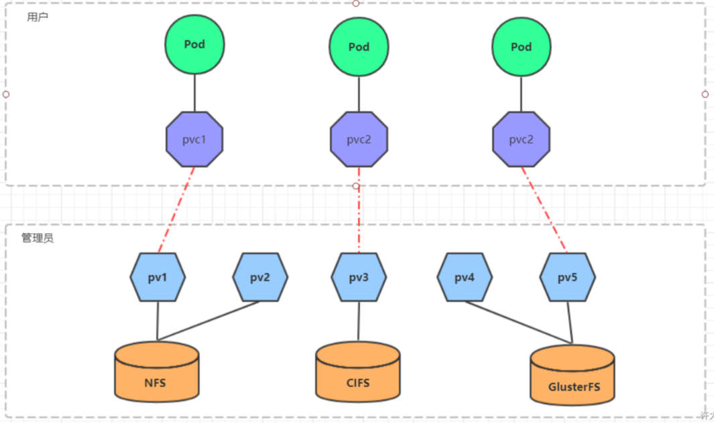

# 1.概述

在前面已经提到，容器的生命周期可能很短，会被频繁的创建和销毁。那么容器在销毁的时候，保存在容器中的数据也会被清除。这种结果对用户来说，在某些情况下是不乐意看到的。为了持久化保存容器中的数据， kubernetes 引入了 Volume 的概念。

Volume 是 Pod 中能够被多个容器访问的共享目录，它被定义在 Pod 上，然后被一个 Pod 里面的多个容器挂载到具体的文件目录下，kubernetes 通过 Volume **实现同一个 Pod 中不同容器之间的数据共享**以及**数据的持久化存储**。Volume 的生命周期不和 Pod 中的单个容器的生命周期有关，当容器终止或者重启的时候，Volume 中的数据也不会丢失。

kubernetes 的 Volume 支持多种类型，比较常见的有下面的几个：

- 简单存储：EmptyDir、HostPath、NFS；
- 高级存储：PV、PVC；
- 配置存储：ConfigMap、Secret。

# 2.基本存储

## 2.1 EmptyDir

### 2.1.1 概述

EmptyDir 是最基础的 Volume 类型，一个 EmptyDir 就是 Host 上的一个空目录。

EmptyDir 是在 Pod 被分配到 Node 时创建的，它的初始内容为空，并且无须指定宿主机上对应的目录文件，因为 kubernetes会 自动分配一个目录，当 Pod 销毁时，EmptyDir 中的数据也会被永久删除。

EmptyDir 的用途如下：

- 临时空间，例如用于某些应用程序运行时所需的临时目录，且无须永久保留；
- 一个容器需要从另一个容器中获取数据的目录（多容器共享目录）。

接下来，通过一个容器之间的共享案例来使用描述一个 EmptyDir：在一个 Pod 中准备两个容器 nginx 和 busybox，然后声明一个 volume 分别挂载到两个容器的目录中，然后 nginx 容器负责向 volume 中写日志，busybox 中通过命令将日志内容读到控制台。


### 2.1.2 创建 Pod

创建 volume-emptydir.yaml 文件，内容如下：

```yaml
apiVersion: v1
kind: Pod
metadata:
  name: volume-emptydir
  namespace: dev
spec:
  containers:
    - name: nginx
      image: nginx:1.17.1
      imagePullPolicy: IfNotPresent
      ports:
        - containerPort: 80
      volumeMounts: # 将logs-volume挂载到nginx容器中对应的目录，该目录为/var/log/nginx
        - name: logs-volume
          mountPath: /var/log/nginx
    - name: busybox
      image: busybox:1.30
      imagePullPolicy: IfNotPresent
      command: ["/bin/sh","-c","tail -f /logs/access.log"] # 初始命令，动态读取指定文件
      volumeMounts: # 将logs-volume挂载到busybox容器中的对应目录，该目录为/logs
        - name: logs-volume
          mountPath: /logs
  volumes: # 声明volume，name为logs-volume，类型为emptyDir
    - name: logs-volume
      emptyDir: {}
```

创建 Pod：

```bash
$ kubectl create -f volume-emptydir.yaml
```

### 2.1.3 查看 Pod

查看 Pod：

```bash
$ kubectl get pod volume-emptydir -n dev -o wide
```


### 2.1.4 访问 Pod 中的 Nginx

访问 Pod 中的 Nginx：

```bash
$ curl 10.44.0.2
```

### 2.1.5 查看指定容器的标准输出

查看指定容器的标准输出：

```bash
$ kubectl logs -f volume-emptydir -n dev -c busybox
```


## 2.2 HostPath

### 2.2.1 概述

我们已经知道 EmptyDir中 的数据不会被持久化，它会随着 Pod 的结束而销毁，如果想要简单的将数据持久化到主机中，可以选择 HostPath。

HostPath 就是将 Node 主机中的一个实际目录挂载到 Pod 中，以供容器使用，这样的设计就可以保证 Pod 销毁了，但是数据依旧可以保存在 Node 主机上。


### 2.2.2 创建 Pod

创建 volume-hostpath.yaml 文件，内容如下：

```yaml
apiVersion: v1
kind: Pod
metadata:
  name: volume-hostpath
  namespace: dev
spec:
  containers:
    - name: nginx
      image: nginx:1.17.1
      imagePullPolicy: IfNotPresent
      ports:
        - containerPort: 80
      volumeMounts: # 将logs-volume挂载到nginx容器中对应的目录，该目录为/var/log/nginx
        - name: logs-volume
          mountPath: /var/log/nginx
    - name: busybox
      image: busybox:1.30
      imagePullPolicy: IfNotPresent
      command: ["/bin/sh","-c","tail -f /logs/access.log"] # 初始命令，动态读取指定文件
      volumeMounts: # 将logs-volume挂载到busybox容器中的对应目录，该目录为/logs
        - name: logs-volume
          mountPath: /logs
  volumes: # 声明volume，name为logs-volume，类型为hostPath
    - name: logs-volume
      hostPath:
        path: /root/logs
        type: DirectoryOrCreate # 目录存在就使用，不存在就先创建再使用
```

> type的值的说明：
>
> - DirectoryOrCreate：目录存在就使用，不存在就先创建后使用。
>
> - Directory：目录必须存在。
>
> - FileOrCreate：文件存在就使用，不存在就先创建后使用。
>
> - File：文件必须存在。
>
> - Socket：unix套接字必须存在。
>
> - CharDevice：字符设备必须存在。
>
> - BlockDevice：块设备必须存在。

创建 Pod：

```bash
$ kubectl create -f volume-hostpath.yaml
```

### 2.2.3 查看Pod

查看 Pod：

```bash
$ kubectl get pod volume-hostpath -n dev -o wide
```


### 2.2.4 访问Pod中的Nginx

访问 Pod 中的 Nginx：

```bash
$ curl 10.44.0.2
```

### 2.2.5 去 node 节点找到 hostPath 映射的目录中的文件

需要到 Pod 所在的节点（k8s-node-1）查看 hostPath 映射的目录中的文件：

```bash
$ ls /root/logs
```


同样的道理，如果在此目录中创建文件，到容器中也是可以看到的。当 pod 停止时，目录文件还在，未被删除。

## 2.3 NFS

### 2.3.1 概述

HostPath 虽然可以解决数据持久化的问题，但是一旦 Node 节点故障了，Pod 如果转移到别的 Node 节点上，又会出现问题，此时需要准备单独的网络存储系统，比较常用的是 NFS 和 CIFS。

NFS 是一个网络文件存储系统，可以搭建一台 NFS 服务器，然后将 Pod 中的存储直接连接到 NFS 系统上，这样，无论 Pod 在节点上怎么转移，只要 Node 和 NFS 的对接没有问题，数据就可以成功访问。


### 2.3.2 搭建 NFS 服务器

首先需要准备 NFS 服务器，这里为了简单，直接在 Master 节点做 NFS 服务器。

在Master节点上安装NFS服务器：

```bash
$ yum install -y nfs-utils rpcbind
```

准备一个共享目录：

```bash
$ mkdir -pv /root/data/nfs
```

将共享目录以读写权限暴露给 `10.252.74.0/24` 网段中的所有主机：

```bash
$ vim /etc/exports
```

在 `/etc/exports` 文件中添加以下内容：

```markdown
/root/data/nfs 10.252.74.0/24(rw,no_root_squash)
```

修改权限：

```bash
$ chmod 777 -R /root/data/nfs
```

加载配置：

```bash
$ exportfs -r
```

启动 nfs 服务：

```bash
# 启动 rpcbind
$ systemctl start rpcbind
# 启用开机自启 rpcbind
$ systemctl enable rpcbind

# 启动 nfs
$ systemctl start nfs
# 启用开机自启 nfs
$ systemctl enable nfs
```

在 Master 节点测试是否挂载成功：

```bash
$ showmount -e 10.252.74.100
```

在 Node 节点上都安装 NFS 服务器，目的是为了 Node 节点可以驱动 NFS 设备，不需要启动。

```bash
$ yum -y install nfs-utils
```

在Node节点测试是否挂载成功：

```bash
$ showmount -e 10.252.74.100
```

### 2.3.3 创建Pod

创建 volume-nfs.yaml 文件，内容如下：

```yaml
apiVersion: v1
kind: Pod
metadata:
  name: volume-nfs
  namespace: dev
spec:
  containers:
    - name: nginx
      image: nginx:1.17.1
      imagePullPolicy: IfNotPresent
      ports:
        - containerPort: 80
      volumeMounts: # 将logs-volume挂载到nginx容器中对应的目录，该目录为/var/log/nginx
        - name: logs-volume
          mountPath: /var/log/nginx
    - name: busybox
      image: busybox:1.30
      imagePullPolicy: IfNotPresent
      command: ["/bin/sh","-c","tail -f /logs/access.log"] # 初始命令，动态读取指定文件
      volumeMounts: # 将logs-volume挂载到busybox容器中的对应目录，该目录为/logs
        - name: logs-volume
          mountPath: /logs
  volumes: # 声明volume
    - name: logs-volume
      nfs:
        server: 10.252.74.100 # NFS服务器地址
        path: /root/data/nfs # 共享文件路径
```

创建 Pod：

```bash
$ kubectl create -f volume-nfs.yaml
```

### 2.3.4 查看 Pod

查看 Pod：

```bash
$ kubectl get pod volume-nfs -n dev
```


### 2.3.5 查看 nfs 服务器上共享目录

查看nfs服务器上共享目录：

```bash
# 查看目录文件
$ ls /root/data/nfs
# 查看 access.log
$ tail -f /root/data/nfs/access.log
```


# 3.高级存储

## 3.1 PV 和 PVC 概述

前面我们已经学习了使用 NFS 提供存储，此时就要求用户会搭建 NFS 系统，并且会在 yaml 配置 nfs。由于 kubernetes 支持的存储系统有很多，要求客户全部掌握，显然不现实。为了能够屏蔽底层存储实现的细节，方便用户使用，kubernetes 引入了 PV 和 PVC 两种资源对象。

- PV（Persistent Volume）是持久化卷的意思，是对底层的共享存储的一种抽象。一般情况下 PV 由 kubernetes 管理员进行创建和配置，它和底层具体的共享存储技术有关，并通过插件完成和共享存储的对接；

- PVC（Persistent Volume Claim）是持久化卷声明的意思，是用户对于存储需求的一种声明。换言之，PVC 其实就是用户向 kubernetes 系统发出的一种资源需求申请。



使用了 PV 和 PVC 之后，工作可以得到进一步的提升：

- 存储：存储工程师维护；
- PV：kubernetes 管理员维护；
- PVC：kubernetes 用户维护。

