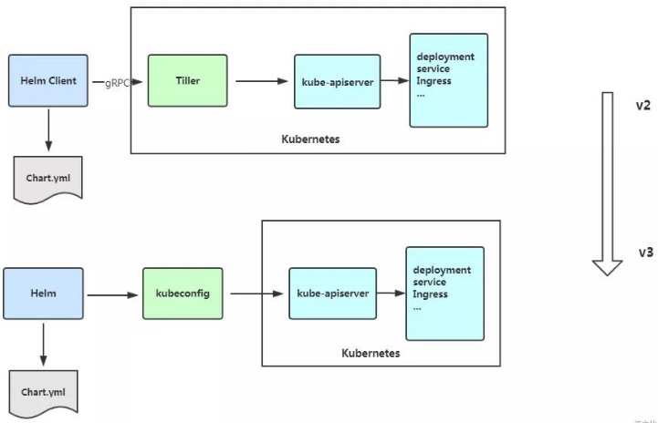
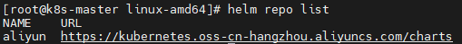
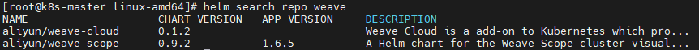
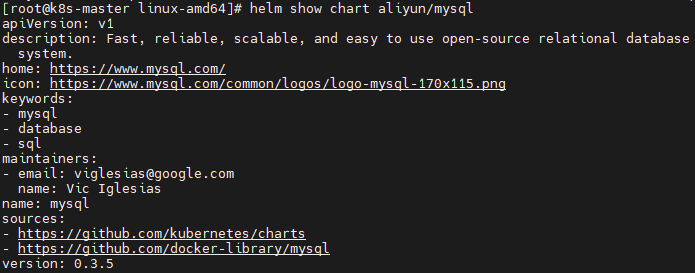
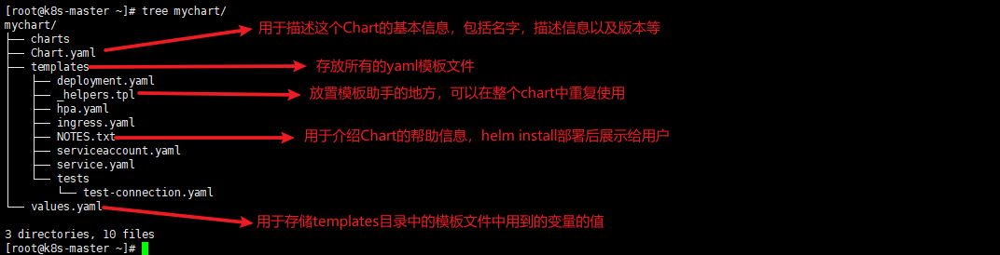

# 1.引入

kubernetes 上的应用对象，都是由特定的资源描述组成，包括 Deployment、Service 等，都保存在各自文件中或者集中写在一个配置文件，然后通过 `kubectl apply -f ` 部署。如果应用只由一个或几个这样的服务组成，上面的部署方式就足够了。但是对于一个复杂的应用，会有很多类似上面的资源描述文件，例如微服务架构应用，组成应用的服务可能多达几十、上百个，如果有更新或回滚应用的需求，可能要修改和维护所涉及到大量的资源文件，而这种组织和管理应用的方式就显得力不从心了。并且由于缺少对发布过的应用进行版本管理和控制，使得 kubernetes 上的应用维护和更新面临诸多的挑战，主要面临以下的问题：

1. 如何将这些服务作为一个整体管理？
2. 这些资源文件如何高效复用？
3. 应用级别的版本如何管理？

# 2.概述

**Helm 是一个 kubernetes 的包管理工具**，就像 Linux 下的包管理器，如 yum、apt 等，可以很方便的将之前打包好的 yaml 文件部署到 kubernetes 上。
Helm 有 3 个重要概念：

1. helm：一个命令行客户端工具，**主要用于 kubernetes 应用 chart 的创建、打包、发布和管理**；
2. chart：应用描述，**一系列用于描述 kubernetes 资源相关文件的集合**；
3. release：基于 chart 的部署实体，**一个 chart 被 Helm 运行后将会生成对应的一个 release，将在 kubernetes 中创建出真实运行的资源对象**。

# 3.Helm v3 变化

2019 年 11 月 13 日，Helm 团队发布 Helm v3 的第一个稳定版本，该版本主要变化如下：

1. 最明显的变化是 Tiller 删除：



2. release 名称可以在不同的命名空间重用；
3. 支持将 chart 推动到 Docker 镜像仓库中；
4. 使用 JSONSchema 验证 chart values；
5. 其他。

# 4.Helm 客户端

## 4.1 部署 Helm 客户端

下载 Helm：

```bash
$ wget https://get.helm.sh/helm-v3.2.1-linux-amd64.tar.gz
```

解压 Helm 到 `/usr/bin` 目录。

## 4.2 配置国内的 chart 仓库

### 4.2.1 仓库概述

微软仓库：http://mirror.azure.cn/kubernetes/charts，推荐，基本上官网上的 chart 这里都有。

阿里云仓库：https://kubernetes.oss-cn-hangzhou.aliyuncs.com/charts。

官方仓库：https://hub.kubeapps.com/charts/incubator，强烈不推荐。

### 4.2.2 添加仓库

添加仓库命令：

```bash
$ helm repo add <仓库名> <仓库地址>
```

更新仓库命令：

```bash
$ helm repo update
```

示例：添加阿里云仓库，并更新仓库

```bash
$ helm repo add aliyun https://kubernetes.oss-cn-hangzhou.aliyuncs.com/charts
```

更新仓库：

```bash
$ helm repo update
```

### 4.2.3 删除存储库

删除存储库：

```bash
$ helm repo remove <仓库名>
```

### 4.2.4 查看配置的存储库

查看配置的存储库：

```bash
$ helm repo list
```



## 4.3 helm 的常用命令

| 命令       | 描述                                                         |
| ---------- | ------------------------------------------------------------ |
| create     | 创建一个 chart 并指定名字                                    |
| dependency | 管理 chart 依赖                                              |
| get        | 下载一个 release。可用的子命令：all、hooks、manifest、notes、values。 |
| history    | 获取 release 历史。                                          |
| install    | 安装一个 chart。                                             |
| list       | 列出 release。                                               |
| package    | 将 chart 目录打包到 chart 存档文件中。                       |
| pull       | 从远程仓库中下载 chart 并解压到本地。比如：`helm install stable/mysql --untar`。 |
| repo       | 添加、列出、移除、更新和索引 chart 仓库。可用的子命令：add、index、list、remove、update。 |
| rollback   | 从之前的版本回退。                                           |
| search     | 根据关键字搜索 chart。可用的子命令：all、chart、readme、values。 |
| show       | 查看 chart 的详细信息。可用的子命令：all、chart、readme、values。 |
| status     | 显示已命名版本的状态。                                       |
| template   | 本地呈现模板。                                               |
| uninstall  | 卸载一个 release。                                           |
| upgrade    | 更新一个 release。                                           |
| version    | 查看 Helm 客户端版本。                                       |

# 5.Helm 基本使用

## 5.1 使用 chart 部署一个应用

### 5.1.1 根据关键字搜索 chart

语法：

```bash
$ helm search repo|hub <chart名称>
```

示例：查询名为 weave 的 chart

```bash
$ helm search repo weave
```



### 5.1.2 查看 chart 信息

语法：

```bash
$ helm show chart <仓库名/chart名称>
```

示例：查看名为 aliyun 的仓库中的名为 mysql 的 chart

```bash
$ helm show chart aliyun/mysql
```



### 5.1.3 安装 chart，形成 release

语法：

```bash
$ helm install <安装之后的名称> <仓库名/chart的名称(即搜索之后的应用名称)>
```

### 5.1.4 查看 release 列表

语法：

```bash
$ helm list
```

### 5.1.5 查看已命名 release 的状态

语法：

```bash
$ helm status <安装之后的名称>
```

### 5.1.6 查看 Service，并将其改为 NodePort

语法：

```bash
$ kubectl edit svc <service名称>
```

## 5.2 安装前自定义 chart 配置选项

### 5.2.1 概述

自定义选项是因为并不是所有的 chart 都能按照默认配置运行成功，可能会需要一些环境依赖，例如 PV。
所以我们需要自定义 chart 配置选项，安装过程中有两种方法可以传递配置数据：

- `--values`（或-f）：指定带有覆盖的 YAML 文件。这里可以多次指定，最右边的文件优先；
- `--set`：在命令行上指定替代。如果两种都用，那么 `--set` 的优先级高。

### 5.2.2 --values 的使用（不推荐，太麻烦）

> 安装可能报错，需要自己手动安装 PV。

先将修改的变量写到一个文件中，并修改此文件：

```bash
$ helm show values aliyun/mysql > config.yaml
```

查看这个文件：

```bash
$ cat config.yaml
```

修改以下内容：

```yaml
-- 修改部分
persistence:
  enabled: true
  accessMode: ReadWriteOnce
  size: 8Gi

mysqlUser: "k8s"
mysqlPassword: "123456"
mysqlDatabase: "k8s"
```

使用 `--values` 来替换默认的配置：

```bash
$ helm install -f config.yaml self-mysql aliyun/mysql
```

### 5.2.3 命令行替代变量（推荐）

可以使用命令行替代变量：

```bash
$ helm install db --set persistence.storageClass="managed-nfs-storage" aliyun/mysql
```

# 6 构建一个 Helm Chart

## 6.1 开发步骤

1. 使用 `helm create` 创建 chart：

```bash
$ helm create <chart名称>
```

2. 进入自定义 chart 目录的 templates 目录中，修改其中的 deployment.yaml 和 service.yaml 等文件。

```bash
$ cd <chart名称>/templates
```



3. 通过刚才创建的 chart 目录，将其部署：

```bash
$ helm install <部署后的名称> <chart名称>
```

4. 打包 chart，与别人共享：

```bash
$ helm package <chart名称>
```

## 6.2 应用示例

1. 创建 chart：

```bash
$ helm create nginx
```

2. 进入 chart 目录，修改 values.yaml 文件，内容如下：

```yaml
replicas: 3
image: nginx 
tag: 1.17 
serviceport: 80 
targetport: 80 
label: nginx
```

3. 进入 templates 目录，删除 templates 目录中的所有文件和文件夹：

```bash
$ rm -rf *
```

4. 修改 deployment.yaml 文件：

```bash
$ vim deployment.yaml
```

内容如下：

```yaml
apiVersion: apps/v1
kind: Deployment
metadata:
  labels:
    app: {{ .Values.label }} 
  name: {{ .Release.Name }}
spec:
  replicas: {{ .Values.replicas }} 
  selector:
    matchLabels:
      app: {{ .Values.label }} 
  strategy: {}
  template:
    metadata:
      labels:
        app: {{ .Values.label }} 
    spec:
      containers:
      - image: {{ .Values.image }}:{{ .Values.tag }} 
        name: {{ .Values.image }}
```

5. 修改 service.yaml 文件：

```bash
$ vim service.yaml
```

内容如下：

```
apiVersion:   v1
kind: Service
metadata:
  labels:
    app: {{ .Values.label }} 
  name:  {{ .Release.Name }}
spec: 
  ports:
    -  port: {{ .Values.serviceport }} 
       protocol: TCP
       targetPort: {{ .Values.targetport }} 
  selector:
    app: {{ .Values.label }} 
  type: NodePort
```

切换到 chart 目录的上一层目录，并安装应用：

```bash
$ helm install nginx nginx/
```

## 6.3 调试

Helm 也提供了 `--dry-run` 和 `--debug` 调试参数，帮助你验证模板的正确性。在执行 `helm install` 的时候带上这两个参数就可以把对应的 values 值和渲染的资源清单打印出来，而不是真正的做部署一个 release。

示例：

```bash
$ helm install nginx nginx/ --dry-run --debug
```

## 6.4 内置对象

上面我们使用的 `{{ .Release.Name }}` 将 release 的名称插入到模板中，这里的 Release 就是 Helm 的内置对象，下面是一些常用的内置对象：

| 内置对象          | 描述                                |
| ----------------- | ----------------------------------- |
| Release.Name      | release 的名称                      |
| Release.Namespace | release 的命名空间                  |
| Release.Service   | release 的服务的名称                |
| Release.Revision  | release 的修订版本号，从 1 开始累加 |

## 6.5 Values

Values 对象是为 Chart 模板提供值，这个对象的值有 4 个来源：

1. chart 包中的 values.yaml 文件；
2. 父 chart 包的 values.yaml 文件；
3. 通过 `helm install` 或者 `helm upgrade` 的 `-f` 或者 `--values` 参数传入的自定义的 yaml 文件；
4. 通过 `--set` 参数传入的值。

Chart 的 values.yaml 提供的值可以被用户提供的 values 文件覆盖，而该文件同样可以被 `--set` 参数所覆盖，换言之，`--set` 参数的优先级高。

## 6.6 升级、回滚和删除

### 6.6.1 升级

发布新版本的 chart 时，或者当我们需要更改发布的配置，可以使用 `helm upgrade` 命令：

通过 `--set`：

```bash
$ helm upgrade --set imageTag=1.18 nginx nginx
```

通过 `--value`：

```bash
$ helm upgrade -f values.yaml nginx nginx
```

### 6.6.2 回滚

如果在发布后没有达到预期的效果，则可以使用 `helm rollback` 回滚到之前的版本：

```bash
$ helm rollback nginx 1
```

### 6.6.3 卸载发行版本

卸载发行版本，可以使用 `helm uninstall` 命令：

```bash
$ helm uninstall nginx
```

### 6.6.4 查看历史版本配置信息

查看历史版本配置信息：

```bash
$ helm get all --revision 1 nginx
```

## 6.7 管道和函数

### 6.7.1 管道

在上面的案例中，其实是将值传递给模板引擎进行渲染，模板引擎还支持对拿到的数据进行二次处理。

示例：从 `.Values` 中读取的值变成字符串，可以使用 quote 函数实现：

编辑 `templates/deployment.yaml`

```bash
$ vim templates/deployment.yaml
```

修改内容如下：

```yaml
# 略
app: {{ quote  .Values.label.app    }}
# 略
```

安装：

```bash
$ helm install --dry-run nginx ../nginx/ app:"nginx"
```

> `quote  .Values.label.app` 将后面的值作为参数传递过 quote 函数。
>
> 模板函数调用语法为：functionName arg1 arg2...

### 6.7.2 default 函数

default 函数运行在模板中指定默认值，以防止该值会忽略掉。如果忘记定义，执行 `helm install` 的时候会因为缺少字段而无法创建资源，这时就可以定义一个默认值了。

示例：

```bash
$ vim templates/deployment.yaml
```

内容如下

```yaml
apiVersion: apps/v1
kind: Deployment
metadata:
  labels:
    app: {{ .Values.label }}
  name: {{ .Release.Name }}
spec:
  replicas: {{ .Values.replicas }}
  selector:
    matchLabels:
      app: {{ .Values.label }}
  strategy: {}
  template:
    metadata:
      labels:
        app: {{ .Values.label }}
    spec:
      containers:
      - image: {{ .Values.image| default "nginx" }}:{{ .Values.tag }}
        name: {{ .Values.image }}
```

### 6.7.3 其他函数

缩进函数：

```
{{ .Values.resources | indent 12 }}
```

大写：

```
{{ upper .Values.resources }}
```

首字母大写：

```
{{ title .Values.resources }}
```


# 7.流程控制

## 7.1 概述

流程控制是为模板提供了一种能力，满足更复杂的数据逻辑处理。Helm模板语言提供以下流程控制语句：

- if/else 条件块；
- with
- 指定范围；
- range 循环块。

## 7.2 if/else

if/else 块是用于在模板有条件的包含文本块的方法，条件块的基本结构如下：

```
{{ if 条件表达式}}
# xxx
{{ else if 条件表达式}}
# xxx
{{ else }}
# xxx
{{ end }}
```

条件判断：就是判断条件是否为真，如果值为以下几种情况则为 false，否则为 true：

- 一个布尔类型的false；
- 一个数字0；
- 一个空的字符串；
- 一个空的集合（map、slice、tuple、dict、array）。

示例：

```yaml
apiVersion: apps/v1
kind: Deployment
metadata:
  labels:
    app: {{ .Values.label }}
  name: {{ .Release.Name }}
spec:
  replicas: {{ .Values.replicas }}
  selector:
    matchLabels:
      app: {{ .Values.label }}
  strategy: {}
  template:
    metadata:
      labels:
        app: {{ .Values.label }}
    spec:
      containers:
        - image: {{ .Values.image| default "nginx" }}:{{ .Values.tag }}
          name: {{ .Values.image }}
          env:
            {{ if eq .Values.devops "k8s" }}
          - name : hello
            value: "123"
            {{ else }}
          - name : hello
            value: "456"
            {{ end }}
```

> 还可以使用 ne、lt、gt、and、or 等运算符。

通过模板引擎渲染一下，会得到如下的结果：

```bash
$ helm install --dry-run nginx nginx
```

可以看到渲染出来会有多余的空行，这是因为当模板引擎运行的时候，会将控制指令删除，所以之前占的位置也就空白了，需要使用 `{{- if ...}}` 的方式消除此空行

```yaml
apiVersion: apps/v1
kind: Deployment
metadata:
  labels:
    app: {{ .Values.label }}
  name: {{ .Release.Name }}
spec:
  replicas: {{ .Values.replicas }}
  selector:
    matchLabels:
      app: {{ .Values.label }}
  strategy: {}
  template:
    metadata:
      labels:
        app: {{ .Values.label }}
    spec:
      containers:
        - image: {{ .Values.image| default "nginx" }}:{{ .Values.tag }}
          name: {{ .Values.image }}
          env:
            {{- if eq .Values.devops "k8s" }}
          - name : hello
            value: "123"
            {{- else }}
          - name : hello
            value: "456"
            {{- end }}
```

通过模板引擎渲染一下，会得到如下的结果：

```bash
$ helm install --dry-run nginx nginx
```

如果使用了 `{{- if ... -}}` 那么就需要谨慎了，比如：

```yaml
apiVersion: apps/v1
kind: Deployment
metadata:
  labels:
    app: {{ .Values.label }}
  name: {{ .Release.Name }}
spec:
  replicas: {{ .Values.replicas }}
  selector:
    matchLabels:
      app: {{ .Values.label }}
  strategy: {}
  template:
    metadata:
      labels:
        app: {{ .Values.label }}
    spec:
      containers:
        - image: {{ .Values.image| default "nginx" }}:{{ .Values.tag }}
          name: {{ .Values.image }}
          env:
            {{- if eq .Values.devops "k8s" -}}
          - name : hello
            value: "123"
            {{- else }}
          - name : hello
            value: "456"
            {{- end }}
```

通过模板引擎渲染一下，会得到如下的结果：

```bash
$ helm install --dry-run nginx nginx
```

相当于下面这种格式：

```yaml
NAME: nginx
LAST DEPLOYED: Mon Jan 11 20:46:10 2021
NAMESPACE: default
STATUS: pending-install
REVISION: 1
TEST SUITE: None
HOOKS:
MANIFEST:
---
# Source: nginx/templates/service.yaml
apiVersion:   v1
kind: Service
metadata:
  labels:
    app: nginx 
  name:  nginx
spec: 
  ports:
    -  port: 80 
       protocol: TCP
       targetPort: 80 
  selector:
    app: nginx 
  type: NodePort
---
# Source: nginx/templates/deployment.yaml
apiVersion: apps/v1
kind: Deployment
metadata:
  labels:
    app: nginx
  name: nginx
spec:
  replicas: 3
  selector:
    matchLabels:
      app: nginx
  strategy: {}
  template:
    metadata:
      labels:
        app: nginx
    spec:
      containers:
        - image: nginx:1.17
          name: nginx
          env: - name: hello value: 123
```

当然不对，因为 `{{- if ... -}}` 删除了双方的换行符。

## 7.3 range

在 Helm 模板语言中，使用 `range` 关键字来进行循环操作。

示例：

在 values.yaml 中添加一个变量列表

```yaml
test:
  - 1 
  - 2 
  - 3
```

循环打印该列表：

```yaml
apiVersion: v1 
kind: ConfigMap 
metadata:
  name:    {{   .Release.Name    }} 
data:
  test:    
    {{- range . Values.test }}
      {{   .    }}
    {{-   end   }}
```

## 7.4 with

with 可以用来控制变量作用域。

在前面我们使用 `{{ .Release.xxx }}` 或者 `{{ .Values.xxx }}`，其中 `.` 就是表示对当前范围的引用，`.Values` 就是告诉模板在当前范围中查找 `Values` 对象的值。

with 语句就可以用来控制变量的作用域范围，其语法和一个简单的 if 语句类似：

```
{{ with 条件表达式 }}
# xxx
{{ end }}
```

with 语句可以允许将当前范围的 `.` 设置为特定的对象，比如我们前面一直使用的 `.Values.label`，我们可以使用 `with` 来将 `.` 范围指向 `.Values.label`。

示例：

values.yaml

```yaml
nodeSelector: 
  team: a 
  gpu: yes
```

deployment.yaml

```yaml
apiVersion:   apps/v1
kind:   Deployment 
metadata:
  name: {{ .Release.Name }}-deployment 
spec:
  replicas: 1 
  selector:
    matchLabels: 
      app: nginx
  template: 
    metadata:
      labels: 
        app: nginx
    spec:
      {{- with .Values.nodeSelector }}
      nodeSelector:
        team: {{  .team }}
        gpu: {{  .gpu  }}
      {{- end }}
```

## 7.5 命名模板

需要复用代码的地方可以使用命名模板。

命名模板：使用 define 定义，template 引入，在 templates 目录中默认下划线开头的文件为公共模板（比如 `_helpers.tpl`）。

示例：

_helpers.tpl：

```
{{-   define   "demo.fullname"   -}}
{{- .Chart.Name -}}-{{ .Release.Name }}
{{-   end   -}}
```

deployment.yaml

```yaml
apiVersion:   apps/v1 
kind:   Deployment 
metadata:
  name:  {{   template"demo.fullname"   .    }}
# 其他略
```

> template 指令是将一个模板包含在另一个模板中的方法。但是，template 函数不能用于 Go 模板管道，为了解决该问题，增加了 include 功能。

_helpers.tpl：

```
{{-   define   "demo.labels"    -}}
app:   {{   template"demo.fullname"   .   }}
chart:   "{{   .Chart.Name   }}-{{    .Chart.Version   }}" 
release:   "{{   .Release.Name   }}"
{{-   end   -}}
```

deployment.yaml

```yaml
apiVersion:   apps/v1
kind:   Deployment 
metadata:
  name:    {{   include"demo.fullname"   .    }} 
  labels:
    {{-   include   "demo.labels"   .    |   nindent   4    }}
...
```

> 上面包含一个名为 demo.labels 的模板，然后将值  . 传递给模板，最后将该模板的 输出传递给 nindent 函数。

# 8.开发自己的 chart

1. 创建模板；
2. 修改 Chart.yaml，Values.yaml，添加常用的变量；
3. 在 templates 目录下创建部署镜像所需要的 yaml 文件，并使用变量引用 yaml 文件里面经常变动的字段。

