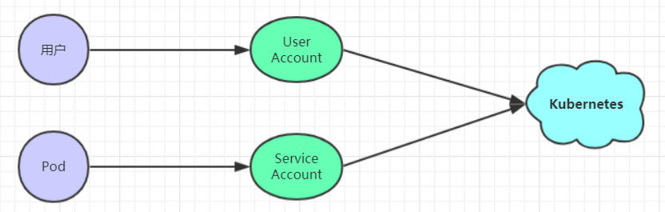
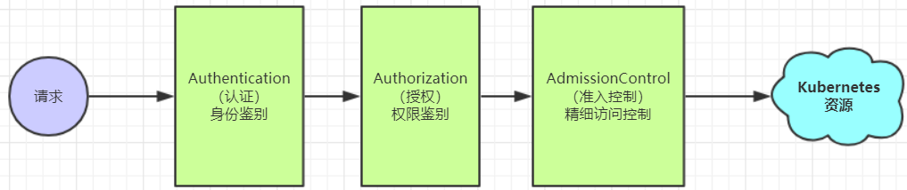
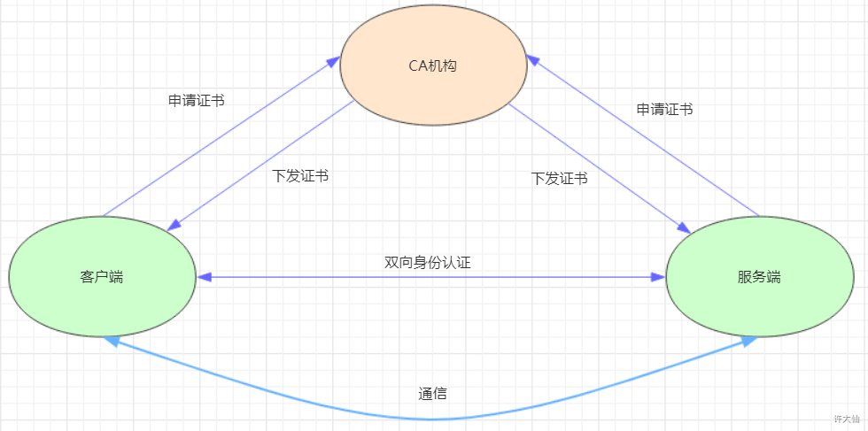
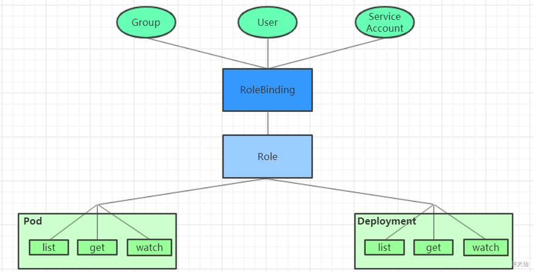
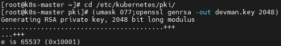
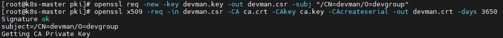
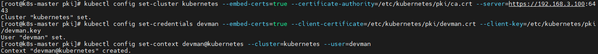
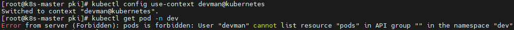
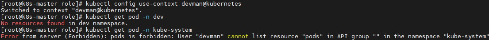

# 1.访问控制概述

## 1.1 概述

kubernetes 作为一个分布式集群的管理工具，保证集群的安全性是其一个重要的任务。所谓的安全性其实就是保证对 kubernetes 的各种客户端进行认证和授权操作。

## 1.2 客户端

在 kubernetes 集群中，客户端通常由两类：

1. User Account：一般是独立于 kubernetes 之外的其他服务管理的用户账号；
2. Service Account：kubernetes 管理的账号，用于为 Pod 的服务进程在访问 kubernetes 时提供身份标识。



## 1.3 认证、授权和准入控制

API Server 是访问和管理资源对象的唯一入口。任何一个请求访问 API Server，都要经过下面的三个流程：

1. Authentication（认证）：身份鉴别，只有正确的账号才能通过认证；
2. Authorization（授权或鉴权）：判断用户是否有权限对访问的资源执行特定的动作；
3. Admission Control（准入控制）：用于补充授权机制以实现更加精细的访问控制功能。



# 2.认证管理

## 2.1 kubernetes 的客户端身份认证方式

kubernetes 集群安全的关键点在于如何识别并认证客户端身份，它提供了 3 种客户端身份认证方式：

1. HTTP Base 认证：通过用户名 + 密码的方式进行认证。
   这种方式是把 `用户名:密码` 用 BASE64 算法进行编码后的字符串放在 HTTP 请求中的 Header 的 Authorization 域里面发送给服务端。服务端收到后进行解码，获取用户名和密码，然后进行用户身份认证的过程。

2. HTTP Token 认证：通过一个 Token 来识别合法用户。
   这种认证方式是用一个很长的难以被模仿的字符串 `--Token` 来表明客户端身份的一种方式。每个 Token 对应一个用户名，当客户端发起 API 调用请求的时候，需要在 HTTP 的 Header 中放入 Token，API Server 接受到 Token 后会和服务器中保存的 Token 进行比对，然后进行用户身份认证的过程。

3. HTTPS 证书认证：基于 CA 根证书签名的双向数字证书认证方式。
   这种认证方式是安全性最高的一种方式，但是同时也是操作起来最麻烦的一种方式。

## 2.2 HTTPS 认证过程



1. 证书申请和下发：HTTPS 通信双方的服务器向 CA 机构申请证书，CA 机构发根证书、服务端证书及私钥给申请者。

2. 客户端和服务器的双向认证：
   - 客户端向服务端发起请求，服务端下发自己的证书给客户端。客户端收到证书后，通过私钥解密证书，在证书中获取服务端的私钥。客户端利用服务器端的公钥认证证书中的信息，如果一致，则认可这个服务器；
   - 客户端发送自己的证书给服务器端，服务端接收到证书后，通过私钥解密证书。在证书中获取客户端的公钥，并用该公钥认证证书信息，确认客户端是否合法。

3. 服务器端和客户端进行通信：
   - 服务器端和客户端协商好加密方案后，客户端会产生一个随机的私钥并加密，然后发送到服务器端；
   - 服务器端接收到这个私钥后，双方接下来通信的所有内容都通过该随机私钥加密。

## 2.3 总结

kubernetes 允许同时配置多种认证方式，只要其中任意一种方式认证通过即可。

# 3.授权管理

## 3.1 概述

授权发生在认证成功之后，通过认证就可以知道请求用户是谁，然后 kubernetes 会根据事先定义的授权策略来决定用户是否有权限访问，这个过程就称为授权。

每个发送到 API Server 的请求都带上了用户和资源的信息：比如发送请求的用户、请求的路径、请求的动作等，授权就是根据这些信息和授权策略进行比较，如果符合策略，则认为授权通过，否则会返回错误。

## 3.2 API Server 目前支持的几种授权策略

- AlwaysDeny：表示拒绝所有请求，一般用于测试；

- AlwaysAllow：允许接收所有的请求，相当于集群不需要授权流程（kubernetes 默认的策略）；

- ABAC：基于属性的访问控制，表示使用用户配置的授权规则对用户请求进行匹配和控制；

- Webhook：通过调用外部 REST 服务对用户进行授权；

- Node：是一种专用模式，用于对 kubelet 发出的请求进行访问控制；

- RBAC：基于角色的访问控制（kubeadm 安装方式下的默认选项）。

## 3.3 RBAC

### 3.3.1 概述

RBAC（Role Based Access Control）：基于角色的访问控制，**主要是在描述给哪些对象授权了哪些权限**。

RBAC 涉及到了下面几个概念：

- 对象：User、Groups、ServiceAccount；
- 角色：代表着一组定义在资源上的可操作的动作（权限）的集合；
- 绑定：将定义好的角色和用户绑定在一起。



RBAC 还引入了 4 个顶级资源对象：

- Role、ClusterRole：角色，用于指定一组权限。

- RoleBinding、ClusterRoleBinding：角色绑定，用于将角色（权限的集合）赋予给对象。

### 3.3.2 Role、ClusterRole

一个角色就是一组权限的集合，这里的权限都是许可形式的（白名单）。

Role 的资源清单文件：

```yaml
# Role只能对命名空间的资源进行授权，需要指定namespace
apiVersion: rbac.authorization.k8s.io/v1
kind: Role
metadata:
  name: authorization-role
  namespace: dev
rules:
  - apiGroups: [""] # 支持的API组列表，""空字符串，表示核心API群
    resources: ["pods"] # 支持的资源对象列表
    verbs: ["get","watch","list"]
```

ClusterRole 的资源清单文件：

```yaml
# ClusterRole可以对集群范围内的资源、跨namespace的范围资源、非资源类型进行授权
apiVersion: rbac.authorization.k8s.io/v1
kind: ClusterRole
metadata:
  name: authorization-clusterrole
rules:
  - apiGroups: [""] # 支持的API组列表，""空字符串，表示核心API群
    resources: ["pods"] # 支持的资源对象列表
    verbs: ["get","watch","list"]
```

rulesv中的参数说明：

- apiGroups：支持的API组列表。

  ``` javascript
  "","apps","autoscaling","batch"
  ```

- resources：支持的资源对象列表。

  ``` java
  "services","endpoints","pods","secrets","configmaps","crontabs","deployments","jobs","nodes","rolebindings","clusterroles","daemonsets","replicasets","statefulsets","horizontalpodautoscalers","replicationcontrollers","cronjobs"
  ```

- verbs：对资源对象的操作方法列表

  ``` javascript
  "get", "list", "watch", "create", "update", "patch", "delete", "exec"
  ```

### 3.3.3 RoleBinding、ClusterRoleBinding

角色绑定用来把一个角色绑定到一个目标对象上，绑定目标可以是 User、Group 或者 ServiceAccount。

RoleBinding的资源清单文件：

```yaml
# RoleBinding可以将同一namespace中的subject对象绑定到某个Role下，则此Subject具有该Role定义的权限
apiVersion: rbac.authorization.k8s.io/v1
kind: RoleBinding
metadata:
  name: authorization-role-binding
  namespace: dev
subjects:
  - kind: User
    name: silentao
    apiGroup: rbac.authorization.k8s.io  
roleRef:
  apiGroup: rbac.authorization.k8s.io
  kind: Role
  name: authorization-role
```

ClusterRoleBinding 的资源清单文件：

```yaml
# ClusterRoleBinding在整个集群级别和所有namespaces将特定的subject与ClusterRole绑定，授予权限
apiVersion: rbac.authorization.k8s.io/v1
kind: ClusterRoleBinding
metadata:
  name: authorization-clusterrole-binding
subjects:
  - kind: User
    name: silentao
    apiGroup: rbac.authorization.k8s.io
roleRef:
  apiGroup: rbac.authorization.k8s.io
  kind: ClusterRole
  name: authorization-clusterrole
```

### 3.3.4 RoleBinding 引用 ClusterRole 进行授权

RoleBinding 可以引用 ClusterRole，对属于同一命名空间内 ClusterRole 定义的资源主体进行授权。

一种很常用的做法是，集群管理员为集群范围预定义好一组角色（ClusterRole），然后在多个命名空间中重复使用这些 ClusterRole。这样可以大幅度提高授权管理工作效率，也使得各个命名空间下的基础性授权规则和使用体验保持一致。

```yaml
# 虽然authorization-clusterrole是一个集群角色，但是因为使用了RoleBinding
# 所以silentao只能读取dev命名空间中的资源
apiVersion: rbac.authorization.k8s.io/v1
kind: RoleBinding
metadata:
  name: authorization-clusterrole-binding
subjects:
  - kind: User
    name: silentao
    apiGroup: rbac.authorization.k8s.io
roleRef:
  apiGroup: rbac.authorization.k8s.io
  kind: ClusterRole
  name: authorization-clusterrole
```

## 3.4 RBAC实战

### 3.4.1 需求

创建一个只能管理 dev 命名空间下 Pods 资源的账号。

### 3.4.2 创建账号

1.创建证书：

```bash
$ cd /etc/kubernetes/pki/
```

创建证书：

```bash
$ (umask 077;openssl genrsa -out devman.key 2048)
```



2.用 API Server 的证书去签署证书：

签名申请：申请的用户是 devman，组是 devgroup

```bash
$ openssl req -new -key devman.key -out devman.csr -subj "/CN=devman/O=devgroup"
```

签署证书：

```bash
$ openssl x509 -req -in devman.csr -CA ca.crt -CAkey ca.key -CAcreateserial -out devman.crt -days 3650
```



3.设置信息

设置集群信息：

```bash
$ kubectl config set-cluster kubernetes --embed-certs=true --certificate-authority=/etc/kubernetes/pki/ca.crt --server=https://192.168.3.100:6443
```

设置用户信息：

```bash
$ kubectl config set-credentials devman --embed-certs=true --client-certificate=/etc/kubernetes/pki/devman.crt --client-key=/etc/kubernetes/pki/devman.key
```

设置上下文：

```bash
$ kubectl config set-context devman@kubernetes --cluster=kubernetes --user=devman
```



4.测试账号

切换账号到 devman：

```bash
$ kubectl config use-context devman@kubernetes
```

查看 dev 下的 Pod，发现没有权限：

```bash
$ kubectl get pods -n dev
```



切换到 admin 账户：

```bash
$ kubectl config use-context kubernetes-admin@kubernetes
```

### 3.4.3 创建 Role 和 RoleBinding，为 devman 授权

创建 dev-role.yaml 文件，内容如下：

```yaml
apiVersion: rbac.authorization.k8s.io/v1
kind: Role
metadata:
  name: dev-role
  namespace: dev
rules:
  - apiGroups: [""] # 支持的API组列表，""空字符串，表示核心API群
    resources: ["pods"] # 支持的资源对象列表
    verbs: ["get","watch","list"]

---

kind: RoleBinding
apiVersion: rbac.authorization.k8s.io/v1
metadata:
  name: authorization-role-binding 
  namespace: dev
subjects:
  - kind: User
    name: devman
    apiGroup: rbac.authorization.k8s.io 
roleRef:
  kind: Role 
  name: dev-role
  apiGroup: rbac.authorization.k8s.io
```

创建 Role 和 RoleBinding：

```bash
$ kubectl create -f dev-role.yaml
```

### 3.4.4 切换账户，再次验证

切换账户到 devman：

```bash
$ kubectl config use-context devman@kubernetes
```

再次查看：

```bash
# dev
$ kubectl get pod -n dev

# kube-system，没有权限
$ kubectl get pod -n kube-system
```



切回 admin 账户：

```bash
$ kubectl config use-context kubernetes-admin@kubernetes
```

# 4.准入控制

## 4.1 概述

通过了前面的认证和授权之后，还需要经过准入控制通过之后，API Server 才会处理这个请求。

准入控制是一个可配置的控制器列表，可以通过在 API Server 上通过命令行设置选择执行哪些注入控制器。

```markdown
--enable-admission-plugins=NamespaceLifecycle,LimitRanger,ServiceAccount,PersistentVolumeLabel,DefaultStorageClass,ResourceQuota,DefaultTolerationSeconds
```

只有当所有的准入控制器都检查通过之后，API Server 才会执行该请求，否则返回拒绝。

## 4.2 当前可配置的 Admission Control（准入控制）

- AlwaysAdmit：允许所有请求；

- AlwaysDeny：禁止所有请求，一般用于测试；

- AlwaysPullImages：在启动容器之前总去下载镜像；

- DenyExecOnPrivileged：它会拦截所有想在 Privileged Container 上执行命令的请求；

- ImagePolicyWebhook：这个插件将允许后端的一个 Webhook 程序来完成 admission controller 的功能。

- Service Account：实现 ServiceAccount 实现了自动化；

- SecurityContextDeny：这个插件将使用 SecurityContext 的 Pod 中的定义全部失效；

- ResourceQuota：用于资源配额管理目的，观察所有请求，确保在 namespace 上的配额不会超标；

- LimitRanger：用于资源限制管理，作用于 namespace 上，确保对 Pod 进行资源限制；

- InitialResources：为未设置资源请求与限制的 Pod，根据其镜像的历史资源的使用情况进行设置；

- NamespaceLifecycle：如果尝试在一个不存在的 namespace 中创建资源对象，则该创建请求将被拒绝。当删除一个 namespace 时，系统将会删除该 namespace 中所有对象；

- DefaultStorageClass：为了实现共享存储的动态供应，为未指定 StorageClass 或 PV 的 PVC 尝试匹配默认 StorageClass，尽可能减少用户在申请 PVC 时所需了解的后端存储细节；

- DefaultTolerationSeconds：这个插件为那些没有设置 forgiveness tolerations 并具有 `notready:NoExecute` 和 `unreachable:NoExecute` 两种 taints 的 Pod 设置默认的**容忍**时间，为 5min；

- PodSecurityPolicy：这个插件用于在创建或修改 Pod 时决定是否根据 Pod 的 security context 和可用的  PodSecurityPolicy 对 Pod 的安全策略进行控制。