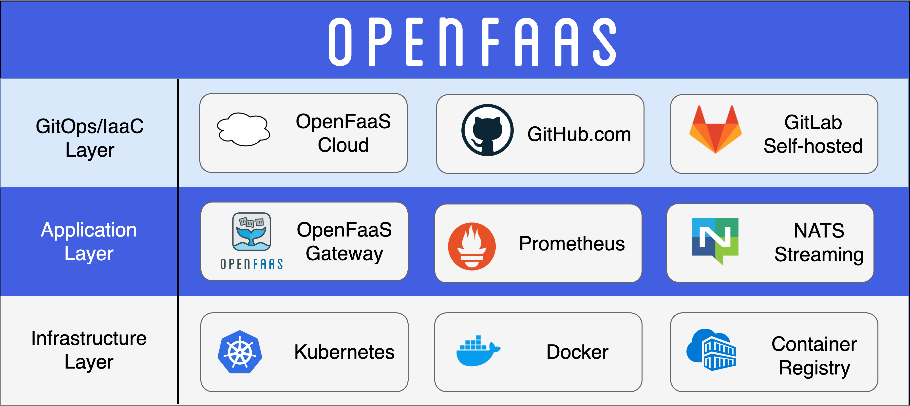

# 1.层级和职责

OpenFaaS 推荐的部署平台是 Kubernetes，不管是本地环境还是自托管的集群，或者使用托管服务比如： [AWS Elastic Kubernetes Service (EKS)](https://aws.amazon.com/eks/)。

- [OpenFaaS Cloud](https://docs.openfaas.com/openfaas-cloud/intro/) 构建在 OpenFaaS 之上，通过 GitHub.com 或自托管的 GitLab 交付 GitOps；
- [NATS](https://github.com/nats-io) 提供异步执行和消息队列；
- [Prometheus](https://prometheus.io/) 提供指标并通过 [AlertManager](https://prometheus.io/docs/alerting/overview/) 启用自动伸缩；
- 容器的镜像仓库提供了可以通过 API 部署在 OpenFaaS 上的镜像

