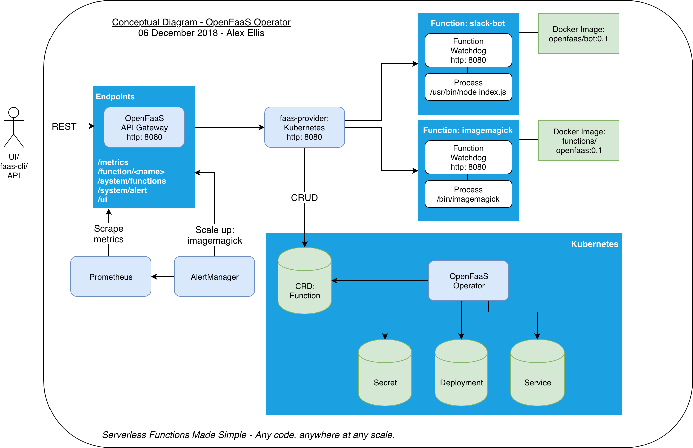
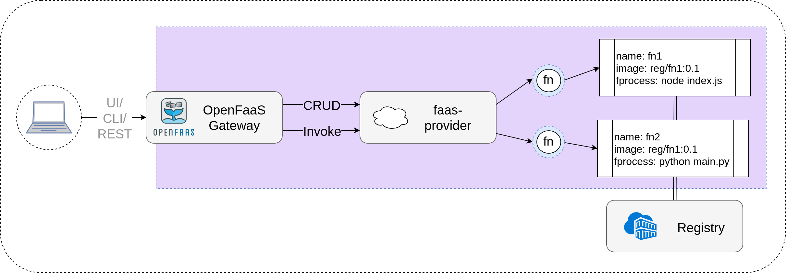
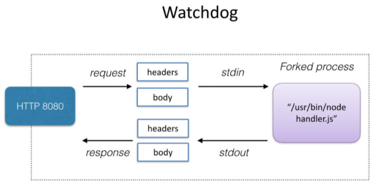
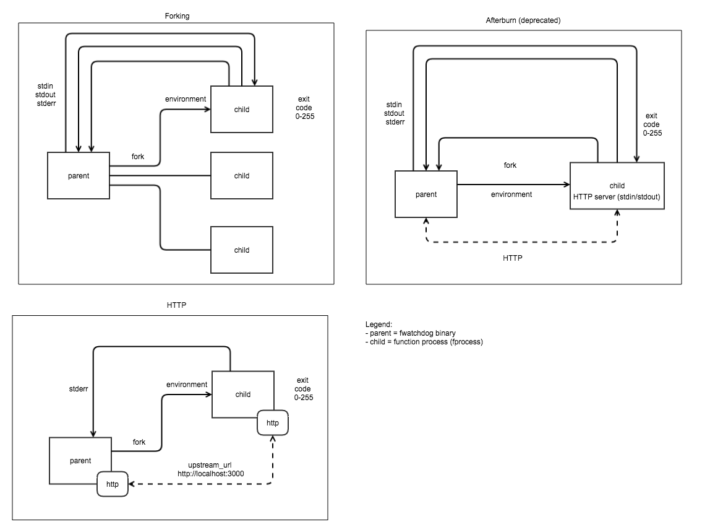

# 1.OpenFaaS 技术栈

英文原文地址：[OpenFaaS 技术栈](https://docs.openfaas.com/architecture/stack/)

## 1.1 层级和职责

OpenFaaS 推荐的部署平台是 Kubernetes，不管是本地环境还是自托管的集群，或者使用托管服务比如： [AWS Elastic Kubernetes Service (EKS)](https://aws.amazon.com/eks/)。


- [OpenFaaS Cloud](https://docs.openfaas.com/openfaas-cloud/intro/) 构建在 OpenFaaS 之上，通过 GitHub.com 或自托管的 GitLab 交付 GitOps；
- [NATS](https://github.com/nats-io) 提供异步执行和消息队列；
- [Prometheus](https://prometheus.io/) 提供指标并通过 [AlertManager](https://prometheus.io/docs/alerting/overview/) 启用自动伸缩；
- 容器的镜像仓库提供了可以通过 API 部署在 OpenFaaS 上的镜像

构成 OpenFaaS 的项目可以称为 [The PLONK Stack](https://www.openfaas.com/blog/plonk-stack/)。

## 1.2 工作流程


可以通过 OpenFaaS 的 REST API、CLI 或 UI 访问网关，所有服务或函数都会有公开默认路由，但也可以为每个端点使用自定义域。

Prometheus 可通过网关的 API 收集并用于自动缩放的指标。

通过将函数的 URL 从 `/function/NAME` 更改为 `/async-function/NAME`，可以使用 NATS Streaming 在队列中运行调用，还可以传递可选的回调 URL。

[faas-netes](https://github.com/openfaas/faas-netes/) 是最受欢迎的 OpenFaaS 编排提供者，但社区也开发了 Docker Swarm、Hashicorp Nomad、AWS Fargate/ECS 和 AWS Lambda，提供程序是使用 [faas-provider SDK](https://github.com/openfaas/faas-provider) 构建的。

## 1.3 faas-netes

英文原文地址：[faas-netes](https://github.com/openfaas/faas-netes/)

faas-netes 是一个 OpenFaaS 提供者，它为 OpenFaaS 启用 Kubernetes，与现有的 REST API、CLI 和 UI 完全兼容。它还具有可选的操作模式，以便您可以使用 kubectl 管理函数。

您可以将 OpenFaaS 部署到任何 Kubernetes 服务——无论是托管服务还是本地服务，包括 OpenShift。

[OpenFaaS (Functions as a Service)](https://github.com/openfaas/faas) 是一个使用 Docker 和 Kubernetes 构建无服务器函数的框架，它具有一流的指标支持。任何流程都可以打包为一个函数，使您能够使用一系列 Web 事件，而无需重复样板编码。

OpenFaaS 架构图：


### 1.3.1 亮点

- 用于部署无服务器式工作负载的平台 - 微服务和函数
- 原生 Kubernetes 集成（API 和生态系统）
- 内置用户界面门户
- 从零缩放
- 内置排队和异步调用
- 自定义路由和域支持
- 提供商业支持

附加生态系统：

- 一系列事件连接器和 cron 支持
- helm chart 和 CLI 安装程序
- 操作者可用于使用自定义资源定义 (CRD) [openfaas-operator](https://github.com/openfaas-incubator/openfaas-operator/)
- IDp 与 OIDC 和商业附加组件的集成

PLONK 栈：

OpenFaaS 可以用作称为 PLONK 的云原生应用程序开发的完整栈，PLONK Stack 包括：Prometheus、Linux/Linkerd、OpenFaaS、NATS/Nginx 和 Kubernetes。

### 1.3.2 概述

#### 1.操作模式

faas-netes 有两种模式，默认是经典模式。

- 经典模式（又名 faas-netes）：包括 REST API、多命名空间支持但没有功能 CRD
- 操作员模式（又名 The OpenFaaS Operator）：包括一个 REST API，具有函数 CRD 和多命名空间支持

单个 faas-netes 镜像和二进制文件包含两种模式，使用 helm chart 或参数 `-operator=true/false` 在一种模式或另一种模式之间切换。

#### 2.控制器配置

faas-netes 可以使用环境变量进行配置，但有关完整的选项集，请参阅 [helm chart](https://github.com/openfaas/faas-netes/blob/master/chart/openfaas)。

| Option                      | Usage                                                        |
| --------------------------- | ------------------------------------------------------------ |
| `httpProbe`                 | Boolean - 使用 http 探针方式进行函数的准备和活跃度检测。默认： `false` |
| `write_timeout`             | 从函数请求的写入到响应正文的 HTTP 超时时间（以秒为单位）。默认：`60s` |
| `read_timeout`              | 从客户端调用者读取有效负载的 HTTP 超时（以秒为单位）。默认：`60s` |
| `image_pull_policy`         | 已部署函数的镜像拉取策略 （`Always`, `IfNotPresent`, `Never`）。默认： `Always` |
| `gateway.resources`         | CPU/内存资源请求/限制 (memory: `120Mi`, cpu: `50m`)          |
| `faasnetes.resources`       | CPU/内存资源请求/限制 (memory: `120Mi`, cpu: `50m`)          |
| `operator.resources`        | CPU/内存资源请求/限制 (memory: `120Mi`, cpu: `50m`)          |
| `queueWorker.resources`     | CPU/内存资源请求/限制 (memory: `120Mi`, cpu: `50m`)          |
| `prometheus.resources`      | CPU/内存资源请求/限制 (memory: `512Mi`)                      |
| `alertmanager.resources`    | CPU/内存资源请求/限制 (memory: `25Mi`)                       |
| `nats.resources`            | CPU/内存资源请求/限制(memory: `120Mi`)                       |
| `faasIdler.resources`       | CPU/内存资源请求/限制(memory: `64Mi`)                        |
| `basicAuthPlugin.resources` | CPU/内存资源请求/限制(memory: `50Mi`, cpu: `20m`)            |

#### 3.准备检查

函数的就绪检查假设您正在使用我们的函数看门狗，它会在容器内的默认 “tempdir” 中写入 .lock 文件。 要查看此操作，您可以使用 `kubectl exec` 删除正在运行的 Pod 中的 .lock 文件，该函数将被重新调度。

#### 4.命名空间

默认情况下，所有 OpenFaaS 功能和服务都部署到 openfaas 和 openfaas-fn 命名空间。 要更改命名空间，请使用 `helm chart`。

#### 5.入口

要配置入口，请参 `helm chart`。 默认情况下使用 NodePorts。 这些在部署指南中列出。

默认情况下，函数在 http://gateway:8080/function/NAME 公开。

您还可以使用 [IngressOperator to set up custom domains and HTTP paths](https://github.com/openfaas-incubator/ingress-operator)

#### 6.镜像拉取策略

默认情况下，已部署的函数将使用 `Always` 的镜像拉取策略，以确保在更新期间刷新使用静态镜像标记的函数。 如果这不是所需的行为，请将 `image_pull_policy` 环境变量设置为替代。`IfNotPresent` 在使用 minikube 进行本地开发时特别有用。 在这种情况下，您可以将本地环境设置为使用 minikube 的 docker，以便 `faas-cli build` 直接构建到 minikube 的映像存储中。 在此工作流程中不需要 `faas-cli push`，使用 `faas-cli build` 然后使用 `faas-cli deploy`。

注意：设置为 `Never` 时，只有本地（或拉取的）图像有效。 设置为 `IfNotPresent` 时，使用静态镜像标签时可能不会更新功能部署。

# 2.网关

英文原文地址：[Gateway](https://docs.openfaas.com/architecture/gateway/)

## 2.1 OpenFaaS API 网关和门户

使用 OpenFaaS 运营商 faas-provider 进行概念设计。 在通过 faas-cli、UI 或 REST API 部署之前，每个函数都必须打包到一个不可变的 Docker 镜像中。

OpenFaaS 调用流程图：



部署时，每个函数根据用户请求的最小和最大扩展参数创建 1 到多个 Pod/容器。 函数还可以通过使用 faas-idler 或 REST API 缩放到零并再次返回。

## 2.2 概述

英文原文地址：[Gateway on the Github](https://github.com/openfaas/faas/blob/master/gateway/README.md)

API 网关为您的函数提供外部路由，并通过 Prometheus 收集云原生指标。 该网关还内置了一个 UI，可用于从 OpenFaaS Function Store 部署您自己的函数或函数，然后调用它们。

网关将根据需求通过更改 Kubernetes API 中的服务副本计数来扩展功能。 AlertManager 生成的自定义警报在 /system/alert 端点上接收。

### 1.faas-provider

可以使用 Golang 中的 [faas-provider](https://github.com/openfaas/faas-provider/) 接口编写函数的提供者，该接口提供用于与网关交互的 REST API。这个 faas-provider 可用于为 OpenFaaS 编写您自己的后端。 Golang SDK 可以供应到您的项目中，以便您可以提供符合 OpenFaaS 网关并兼容的提供程序。



faas-provider 为函数和调用功能提供 CRUD。如果您完成了所需的端点，那么您将能够将您的容器编排器或后端系统与现有的 OpenFaaS 生态系统和工具一起使用。

### 2.日志

日志可通过 API 在函数级别使用。

您还可以安装 Docker 日志驱动程序来聚合您的日志。 默认情况下，函数不会将请求和响应主体写入标准输出。 您可以通过为请求设置 read_debug 和为响应设置 write_debug 来切换此行为。

### 3.链路追踪

`X-Call-Id` 请求头应用于通过网关的每个传入的请求，可用于跟踪和监控请求。我们为此字符串使用 UUID。

### 4.环境变量

网关可以通过以下环境变量进行配置：

| Option                    | Usage                                                        |
| ------------------------- | ------------------------------------------------------------ |
| `write_timeout`           | 从函数写入到响应正文的 HTTP 超时时间（以秒为单位）。默认： `8` |
| `read_timeout`            | 从客户端调用者读取有效负载的 HTTP 超时（以秒为单位）。默认： `8` |
| `functions_provider_url`  | 上游函数提供者的 URL - 即Swarm、Kubernetes、Nomad 等         |
| `logs_provider_url`       | 上游函数日志 api provider 的 URL，可选，当为空时使用 functions_provider_url |
| `faas_nats_address`       | 可以访问 NATS 流的主机。异步模式需要                         |
| `faas_nats_port`          | 可以访问 NATS Streaming 的端口。异步模式需要                 |
| `faas_nats_cluster_name`  | 目标 NATS Streaming 集群的名称。默认为 faas-cluster 以实现向后兼容性 |
| `faas_nats_channel`       | 要使用的 NATS 流通道的名称。默认为 faas-request 以实现向后兼容性 |
| `faas_prometheus_host`    | 主机连接到 Prometheus。默认值： `"prometheus"`               |
| `faas_prometheus_port`    | 连接到 Prometheus 的端口。默认：`9090`                       |
| `direct_functions`        | true 或 false - 函数通过 DNS 名称直接通过覆盖网络调用，而无需通过提供程序 |
| `direct_functions_suffix` | 为直接通过覆盖网络调用函数提供 DNS 后缀                      |
| `basic_auth`              | 设置为 true 或 false 以在 /system 和 /ui 端点上启用嵌入式基本身份验证（推荐 |
| `secret_mount_path`       | 设置安装 basic-auth-user 和 basic-auth-password 的位置，默认：/run/secrets/ |
| `scale_from_zero`         | 启用拦截代理，它将任何函数从 0 个副本扩展到所需的数量        |

# 3.Watchdog

英文原文地址：[官网上 watchdog 介绍](https://docs.openfaas.com/architecture/watchdog/)，[watchdog on the github](https://github.com/openfaas/classic-watchdog/blob/master/README.md)

## 3.1 OpenFaaS watchdog

OpenFaaS watchdog 负责启动和监控 OpenFaaS 中的函数，通过使用 watchdog，任何二进制文件都可以成为一个函数。

Watchdog 是一个“初始化进程”，它带有一个用 Golang 编写的嵌入式 HTTP 服务器，它可以支持并发请求、超时和健康检查。和下面提到的较新的 watchdog 类似，但非常适合流式用例或需要在请求之间维护昂贵资源（例如数据库连接、ML 模型或其他数据）时。

## 3.2 Classic watchdog

Classic watchdog 历来用于所有官方 OpenFaaS 模板，但 of-watchdog 现在变得越来越流行，默认模板存储库和社区模板存储中的常见编程语言的 watchdog 都有模板。watchdog 在容器外和您的函数之间提供了一个非托管的通用接口，它的工作是编组 API 网关上接受的 HTTP 请求并调用您选择的应用程序。watchdog 是一个小型的 Golang 网络服务器。请参阅下图了解此过程的工作原理，调用期间 OpenFaaS watchdog 的流程图：



一个微型网络服务器或 shim，为每个传入的 HTTP 请求创建你想要的进程。

每个函数都需要嵌入此二进制文件并将其用作其 `ENTRYPOINT` 或 `CMD`，实际上它是容器的 init 进程， 一旦您的进程被分叉，watchdog 就会通过标准输入传递 HTTP 请求，并通过标准输出读取 HTTP 响应。 这意味着您的进程不需要了解有关 Web 或 HTTP 的任何信息。

## 3.3 of-watchdog

of-watchdog 项目是对上面提到的 Classic Watchdog 的补充。 它于 2017 年 10 月启动，为 watchdog  和函数之间的通信提供了 STDIO 的替代方案。该组件适用于生产环境，是 openfaas GitHub 组织的一部分。

of-watchdog 组件的各种模式：



此版本的 watchdog 为高吞吐量带来了新功能，并支持复用昂贵的资源，例如数据库连接池或机器学习模型。 主要区别在于在调用之间保持函数进程预热的能力。 经典看门狗为每个请求分叉一个进程，提供最高级别的可移植性，但较新的版本启用了 http 模式，可以重复使用同一进程以抵消分叉的延迟。

## 3.4 定制镜像

### 3.4.1 打包函数

如果不想使用 CLI 或现有的二进制文件或镜像，以下是打包函数的方法：

- 使用现有的或新的 Docker 镜像作为基础镜像 `FROM`
- 通过 `curl` 或 `ADD https://` 从 [Releases page](https://github.com/openfaas/faas/releases) 添加 fwatchdog 二进制文件
- 将每个请求要运行的函数配置到 `fprocess`（进程流程）环境变量参数中
- 暴露 `8080` 端口
- 设置 `CMD` 为 `fwatchdog `，让容器启动时运行 fwatchdog

举个列子：

``` dockerfile
FROM alpine:3.13

ADD https://github.com/openfaas/faas/releases/download/0.18.10/fwatchdog /usr/bin
RUN chmod +x /usr/bin/fwatchdog

# 在这里定义函数的二进制文件
ENV fprocess="/bin/cat"

CMD ["fwatchdog"]
```

> 提示：您可以使用 curl 而不是 ADD 来优化 Docker 以缓存获取watchdog 。为此，请将相关行替换为：

``` dockerfile
RUN apk --no-cache add curl \
    && curl -sL https://github.com/openfaas/faas/releases/download/0.9.14/fwatchdog > /usr/bin/fwatchdog \
    && chmod +x /usr/bin/fwatchdog
```

### 3.4.2 实施健康检查

在任何时候，如果您检测到您的函数变得不健康并需要重新启动，那么您可以删除 `/tmp/.lock` 文件，该文件使检查无效并导致 Swarm 重新安排功能。

- Kubernetes：对于 Kubernetes，健康检查是通过自动化添加的，无需更改 `Dockerfile`。

- Swarm：Docker Swarm Healthcheck 是必需的并且是最佳实践。 在通过 API 网关转发请求之前，它将确保 watchdog 准备好接受请求。 如果函数或 watchdog 遇到不可恢复的问题，Swarm 也将能够重新启动容器。

  以下是使用 5 秒检查间隔执行健康检查的 echo 函数示例：

  ``` dockerfile
  FROM functions/alpine
  
  ENV fprocess="cat /etc/hostname"
  
  HEALTHCHECK --interval=5s CMD [ -e /tmp/.lock ] || exit 1
  ```

  watchdog 进程在启动其内部 Golang HTTP 服务器时在 `/tmp/` 中创建一个 .lock 文件。`[ -e file_name ]` 是用于检查文件是否存在的 shell。 对于 Windows Containers，这是一个无效路径，因此您可能需要设置 `suppress_lock` 环境变量。

阅读关于 Healthchecks 的 Docker Swarm 教程：[test-drive-healthcheck](https://blog.alexellis.io/test-drive-healthcheck/)

### 3.4.3 环境变量

watchdog 可以通过环境变量进行配置，必须始终指定 `fprocess` 变量。

| Option            | Usage                                                        |
| ----------------- | ------------------------------------------------------------ |
| `fprocess`        | 指定每个函数调用的进程（函数进程），这必须是 UNIX 二进制文件，并支持通过 STDIN 接受输入并通过 STDOUT 输出 |
| `cgi_headers`     | 来自请求的 HTTP 标头通过环境变量 - `Http_X_Served_By` 等提供。有关更多详细信息，请参阅部分：*处理标头*。 默认启用 |
| `marshal_request` | 不是将原始 HTTP 主体重新定向到您的 fprocess 中，而是首先将其编组到 JSON 中。 如果您需要使用 HTTP 标头并且不想通过 `cgi_headers` 标志使用环境变量，请使用此选项。 |
| `content_type`    | 对所有响应强制使用特定的 Content-Type 响应                   |
| `write_timeout`   | 从函数写入响应正文的 HTTP 超时（以秒为单位）                 |
| `read_timeout`    | 从客户端调用者读取有效负载的 HTTP 超时（以秒为单位）         |
| `suppress_lock`   | watchdog 将尝试把锁定文件写入 /tmp/ 以进行群健康检查 - 将其设置为 true 以禁用行为。 |
| `exec_timeout`    | 每个传入请求的进程执行硬超时（以秒为单位），如果设置为 0 则禁用 |
| `write_debug`     | 将所有输出、错误消息和附加信息写入日志。 默认为 false        |
| `combine_output`  | 默认为 True - 在函数响应中结合 stdout/stderr，当设置为 false 时，`stderr` 被写入容器日志，stdout 用于函数响应 |
| `max_inflight`    | 限制最大请求数                                               |

## 3.5 高级和调优

### 3.5.1 (New) of-watchdog 和 HTTP 模式

每个请求 fork 一个新进程具有进程隔离、可移植性和简单性等优点。 任何进程都可以变成一个函数，无需任何额外的代码。 of-watchdog 及其“HTTP”模式是一种优化，它在所有请求之间维护一个单一进程。

新版本的 watchdog 正在 [openfaas-incubator/of-watchdog](https://github.com/openfaas-incubator/of-watchdog) 上进行测试。

这种重写主要是为了持续维护的结构。它将是现有 watchdog 的直接替代品，并且还提供二进制版本。

### 3.5.2 优雅的关机

watchdog 能够与健康检查一起工作以提供正常关闭。

当在 watchdog 进程中检测到 `SIGTERM` 信号时，Go 例程将删除 `/tmp/.lock` 文件并将 HTTP 健康检查标记为不健康并返回 HTTP 503。然后代码将等待 `write_timeout` 中指定的持续时间。 在此窗口期间，容器编排器的健康检查必须运行并完成。

现在，协调器会将这个副本标记为不健康，并将其从有效的 HTTP 端点池中删除。 现在我们将停止接受新连接并等待 `write_timeout` 中定义的值，然后最终允许进程退出。

### 3.5.3 使用 HTTP headers

Headers 和其他请求信息按以下格式注入环境变量：

`X-Forwarded-By` 变为 `Http_X_Forwarded_By`

- `Http_Method` - GET/POST 等
- `Http_Query` - 查询入参
- `Http_ContentLength` 和 `Http_Content_Length` - 给出 watchdog 收到的传入 HTTP 请求的总内容长度
- `Http_Transfer_Encoding` - 仅在提供时设置，如果设置为分块，则 Content-Length 将为 -1 以表明它不适用

> 此行为由 `cgi_headers` 环境变量启用，默认情况下启用 (true)。

这是带有附加标头和查询字符串的 POST 请求示例：

```bash
$ cgi_headers=true fprocess=env ./watchdog &
2017/06/23 17:02:58 Writing lock-file to: /tmp/.lock

$ curl "localhost:8080?q=serverless&page=1" -X POST -H X-Forwarded-By:http://my.vpn.com
```

如果您在 Linux 系统上将 `fprocess` 设置为 env，您会看到以下内容：

```shell
Http_User_Agent=curl/7.43.0
Http_Accept=*/*
Http_X_Forwarded_By=http://my.vpn.com
Http_Method=POST
Http_Query=q=serverless&page=1
```

还可以使用 GET 请求：

```bash
$ curl "localhost:8080?action=quote&qty=1&productId=105"
```

watchdog 将会输出以下内容：

```shell
Http_User_Agent=curl/7.43.0
Http_Accept=*/*
Http_Method=GET
Http_Query=action=quote&qty=1&productId=105
```

可以在应用程序中使用 HTTP 状态来做出决定。

### 3.5.4 HTTP methods

watchdog 支持以下的 HTTP methods：

带 body 的：

- POST, PUT, DELETE, UPDATE

不 body 的：

- GET

> API 网关目前支持函数的 POST 路由

### 3.5.5 Content-Type of request/response

默认情况下，watchdog 会将您的函数的响应与客户端的 `Content-Type` 相匹配。

- 如果您的客户端发送内容类型为 application/json 的 JSON 请求，这将在响应中自动匹配。
-  如果您的客户端发送内容类型为 text/plain 的 JSON 请求，这也将在响应中自动匹配。

要覆盖所有响应的 Content-Type，请设置 `content_type` 环境变量。

# 4.自动扩展

英文原文地址：[Auto-scaling](https://docs.openfaas.com/architecture/autoscaling/)

OpenFaaS 中的自动扩展允许一个函数根据不同指标所代表的需求进行扩展或缩减。

## 4.1 根据 QPS 缩放

OpenFaaS 附带一个在已挂载的 AlertManager 配置文件中定义的自动缩放规则。 AlertManager 从 Prometheus 读取使用（每秒请求数）指标，以了解何时向 API 网关发出警报。

API 网关通过其 `/system/alert` 路由处理 AlertManager 警报。

可以通过删除 AlertManager 部署或将部署缩放到零副本来禁用此方法提供的自动缩放。

可以在此处查看 Swarm 的 AlertManager 规则 ([alert.rules](https://github.com/openfaas/faas/blob/master/prometheus/alert.rules.yml))，并将其更改为配置图。

通过网关进行的所有调用，无论是同步函数 `/function/` 路由还是通过异步 `/async-function` 路由都计入这种自动缩放方法。

### 4.1.1 最大/最小分片数

可以在部署时通过向函数添加标签来设置最小（初始）和最大副本数。

- `com.openfaas.scale.min` - 最小分片数，默认情况下设置为 1，这也是最低值并且与 scale-to-zero 无关；
- `com.openfaas.scale.max` - 最大分片数，20 个副本的当前默认值为 20；
- `com.openfaas.scale.factor` - 当触发报警时，每次自动缩放器添加的副本数量，为最大分片数的百分比，默认设置为 20%，并且必须是 0-100 之间的值（包括 0 和 100）；
- `com.openfaas.scale.zero` - 设置为 true 以缩放为零，还必须部署 faas-idler，这是 OpenFaaS PRO 的一部分。

> 注意：将 `com.openfaas.scale.min` 和 `com.openfaas.scale.max` 设置为相同的值，可以禁用 openfaas 的自动缩放功能。 设置 `com.openfaas.scale.factor=0` 还允许禁用 openfaas 的自动缩放功能。

对于触发的每个警报，自动缩放器将添加多个副本，这是最大副本的定义百分比。 可以使用 `com.openfaas.scale.factor` 设置此百分比。 例如设置 `com.openfaas.scale.factor=100` 将立即扩展到最大副本，此标签可以定义函数的整体缩放行为。

> 注意：可以在与 OpenFaaS 一起部署的 Prometheus 的“警报”选项卡中查看活动警报。

## 4.2 根据 CPU 或内存使用率缩放

使用 Kubernetes 时，可以使用内置的 [Horizontal Pod Autoscaler (HPA)](https://kubernetes.io/docs/tasks/run-application/horizontal-pod-autoscale/) 代替 AlertManager。

试试 2019 年的教程：[Kubernetes HPAv2 with OpenFaaS](https://docs.openfaas.com/tutorials/kubernetes-hpa/)。

Stefan Prodan 还在 2018 年写了一篇关于 [HPA with OpenFaaS](https://stefanprodan.com/2018/kubernetes-scaleway-baremetal-arm-terraform-installer/#horizontal-pod-autoscaling) 的博客文章

> 注意：除上述之外，两个 OpenFaaS 看门狗都会自动提供可用于 HPAv2 扩展规则的自定义指标。

## 4.3 零缩放

默认情况下从零缩放是打开的，对于任何功能或端点，可以打开或关闭此设置。 在 OpenFaaS 中可以缩放到零以恢复空闲资源，但默认情况下不启用。 项目中有两个部分构成缩放到零或（零缩放）。

有关技术概述，请参阅博客文章：[Scale to Zero and Back Again with OpenFaaS](https://www.openfaas.com/blog/zero-scale/)。

### 4.3.1 从零副本扩展

可以通过 OpenFaaS 网关的 `scale_from_zero` 环境变量切换从零副本或 0/0 扩展，这在 Kubernetes 和 faasd 上默认开启。

接受不可用功能的请求和服务请求之间的延迟有时称为“冷启动”。

- 如果不想“冷启动”怎么办？
  OpenFaaS 中的冷启动是严格可选的，建议对时间敏感的操作避免冷启动。 这可以通过不将关键函数缩小到零副本来实现，或者通过将请求时间与调用者分离的异步路由调用它们来实现。

- “冷启动”究竟会发生什么？
  “冷启动”包括以下内容：创建在节点上调度容器的请求、找到合适的节点、拉取 Docker 镜像并在容器启动和运行后运行初始检查。这种“运行”或“就绪”状态也必须在集群中的所有节点之间同步。通过在每个节点上预拉镜像以及将 Kubernetes Liveness 和 Readiness Probes 设置为以更快的节奏运行，可以减少总耗时。

  [the helm chart for Kubernetes](https://github.com/openfaas/faas-netes/tree/master/chart/openfaas) 提供了针对低冷启动进行优化的说明。

  当启用 `scale_from_zero` 时，会在内存中维护一个缓存，指示每个函数的准备情况。如果收到请求时函数未准备好，则 HTTP 连接被阻止，函数被扩展到最小副本，并且一旦副本可用，请求就会按照正常情况进行代理，您将在网关组件的日志中看到此过程。

### 4.3.2 缩容到零副本

缩小到零副本也称为“空闲”。

有两种方法可用于空闲功能：

1. faas-idler

   您可以使用 [OpenFaaS PRO](https://openfaas.com/support) 提供的 faas-idler，faas-idler 允许配置一些基本的呈现，然后定期监视内置的 Prometheus 指标以确定是否应将函数缩放为零。 只有带有 `com.openfaas.scale.zero=true` 标签的函数被缩放为零，所有其他函数都被忽略。 函数通过 OpenFaaS REST API 缩放为零。如果您只想观察哪些函数会被缩小 - 传递 `-read-only` 标志，或通过 helm chart 设置它。

2. OpenFaaS REST API
   如果您想对空闲函数使用自己的一组标准，那么您可以使用 OpenFaaS REST API 来决定何时将函数缩放为零，可以为此任务构建和部署您自己的自定义控制器。

