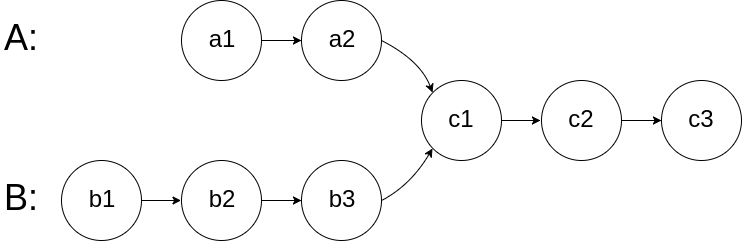

# 2021年7月力扣每日1题

## 20210701 <font color=#009975>E</font> <font color=#009975>S</font>

### LCP 07. 传递信息

原题链接：[LCP 07. 传递信息](https://leetcode-cn.com/problems/chuan-di-xin-xi/)

> 小朋友 A 在和 ta 的小伙伴们玩传信息游戏，游戏规则如下：
>
> 有 n 名玩家，所有玩家编号分别为 0 ～ n-1，其中小朋友 A 的编号为 0
> 每个玩家都有固定的若干个可传信息的其他玩家（也可能没有）。传信息的关系是单向的（比如 A 可以向 B 传信息，但 B 不能向 A 传信息）。
> 每轮信息必须需要传递给另一个人，且信息可重复经过同一个人
> 给定总玩家数 n，以及按 [玩家编号,对应可传递玩家编号] 关系组成的二维数组 relation。返回信息从小 A (编号 0 ) 经过 k 轮传递到编号为 n-1 的小伙伴处的方案数；若不能到达，返回 0。
>
> 示例 1：
>
> 输入：n = 5, relation = [[0,2],[2,1],[3,4],[2,3],[1,4],[2,0],[0,4]], k = 3
>
> 输出：3
>
> 解释：信息从小 A 编号 0 处开始，经 3 轮传递，到达编号 4。共有 3 种方案，分别是 0->2->0->4， 0->2->1->4， 0->2->3->4。
>
> 示例 2：
>
> 输入：n = 3, relation = [[0,2],[2,1]], k = 2
>
> 输出：0
>
> 解释：信息不能从小 A 处经过 2 轮传递到编号 2

### 1.递归

``` java
class Solution {
    int res = 0;
    public int numWays(int n, int[][] relation, int k) {
        // 用map保存玩家与能传递信息玩家的对应关系，一对多
        Map<Integer, List<Integer>> map = new HashMap<>();
        for (int i = 0; i < relation.length; i++) {
            List<Integer> list = map.get(relation[i][0]);
            if (list == null) {
                list = new ArrayList<>();
                map.put(relation[i][0], list);
            }

            list.add(relation[i][1]);
        }

        helper(0, n, map, 0, k);

        return res;
    }

    // 递归判断满足条件的方案
    private void helper(int pos, int n, Map<Integer, List<Integer>> map, int times, int k) {
        // 次数满足条件
        if (times == k) {
            // 已传递到最后一个玩家
            if (pos == n - 1) {
                // 记录次数
                res++;
            }

            return ;
        }

        List<Integer> list = map.get(pos);
        if (list == null || list.size() == 0) {
            return ;
        }

        for (Integer next : list) {
            // 按照当前能传递到的下一个玩家来递归
            helper(next, n, map, times + 1, k);
        }
    }
}
```

## 20210702 <font color=#ed7336>M</font> <font color=#009975>S</font>

### 1833. 雪糕的最大数量

原题链接：[1833. 雪糕的最大数量](https://leetcode-cn.com/problems/maximum-ice-cream-bars/)

> 夏日炎炎，小男孩 Tony 想买一些雪糕消消暑。
>
> 商店中新到 n 支雪糕，用长度为 n 的数组 costs 表示雪糕的定价，其中 costs[i] 表示第 i 支雪糕的现金价格。Tony 一共有 coins 现金可以用于消费，他想要买尽可能多的雪糕。
>
> 给你价格数组 costs 和现金量 coins ，请你计算并返回 Tony 用 coins 现金能够买到的雪糕的 最大数量 。
>
> 注意：Tony 可以按任意顺序购买雪糕。

### 1.排序法

``` java
class Solution {
    public int maxIceCream(int[] costs, int coins) {
        // 先对雪糕的定价按从小到大排序
        Arrays.sort(costs);

        int res = 0;
        // 再按价格从小到大开始购买，直到剩余现金量不够时为止
        for (int i = 0; i < costs.length; i++) {
            if (costs[i] <= coins) {
                // 扣除当前购买雪糕的价钱
                coins -= costs[i];
				// 计数
                res++;
            }
        }

        return res;
    }
}
```

## 20210703 <font color=#ed7336>M</font> <font color=#009975>S</font>

### 451. 根据字符出现频率排序

原题链接：[451. 根据字符出现频率排序](https://leetcode-cn.com/problems/sort-characters-by-frequency/)

> 给定一个字符串，请将字符串里的字符按照出现的频率降序排列。

### 1.哈希计数

``` java
class Solution {
    public String frequencySort(String s) {
        // 定义map用来保存字符与出现频率的映射关系
        Map<Character, Integer> map = new HashMap<>();
        // 将出现次数放入map中
        for (char c : s.toCharArray()) {
            map.put(c, map.getOrDefault(c, 0) + 1);
        }

        // 将映射关系放入二维数组array中
        int[][] array = new int[map.size()][2];
        int pos = 0;
        for (Map.Entry<Character, Integer> entry : map.entrySet()) {
            array[pos][0] = entry.getValue();
            array[pos++][1] = entry.getKey();
        }

        // 根据字符出现次数排序
        Arrays.sort(array, (o1, o2) -> o2[0] - o1[0]);
        // 将字符按出现次数输出到StringBuilder对象中
        StringBuilder builder = new StringBuilder();
        for (int[] arr : array) {
            for (int i = 0; i < arr[0]; i++) {
                builder.append((char) arr[1]);
            }
        }

        return builder.toString();
    }
}
```

## 20210704 <font color=#009975>E</font> <font color=#ed7336>R</font>

### 645. 错误的集合

原题链接：[645. 错误的集合](https://leetcode-cn.com/problems/set-mismatch/)

> 集合 s 包含从 1 到 n 的整数。不幸的是，因为数据错误，导致集合里面某一个数字复制了成了集合里面的另外一个数字的值，导致集合 丢失了一个数字 并且 有一个数字重复 。
>
> 给定一个数组 nums 代表了集合 S 发生错误后的结果。
>
> 请你找出重复出现的整数，再找到丢失的整数，将它们以数组的形式返回。

### 1.计数

[参考题解](https://leetcode-cn.com/problems/set-mismatch/solution/gong-shui-san-xie-yi-ti-san-jie-ji-shu-s-vnr9/)

``` java
class Solution {
    public int[] findErrorNums(int[] nums) {
        int length = nums.length;
        // 用count统计每一个数字出现的次数
        int[] count = new int[length + 1];
        for (int num : nums) {
            count[num]++;
        }
        
        int[] res = new int[2];
        // 然后从1-n出现了两次的为重复的数字
        // 出现0次的为丢失的数字
        for (int i = 1; i <= length; i++) {
            if (count[i] == 2) {
                res[0] = i;
            }

            if (count[i] == 0) {
                res[1] = i;
            }
        }

        return res;
    }
}
```

## 20210705 <font color=#ec4c47>H</font> <font color=#ec4c47>U</font>

### 726. 原子的数量

原题链接：[726. 原子的数量](https://leetcode-cn.com/problems/number-of-atoms/)

> 给定一个化学式formula（作为字符串），返回每种原子的数量。
>
> 原子总是以一个大写字母开始，接着跟随0个或任意个小写字母，表示原子的名字。
>
> 如果数量大于 1，原子后会跟着数字表示原子的数量。如果数量等于 1 则不会跟数字。例如，H2O 和 H2O2 是可行的，但 H1O2 这个表达是不可行的。
>
> 两个化学式连在一起是新的化学式。例如 H2O2He3Mg4 也是化学式。
>
> 一个括号中的化学式和数字（可选择性添加）也是化学式。例如 (H2O2) 和 (H2O2)3 是化学式。
>
> 给定一个化学式 formula ，返回所有原子的数量。格式为：第一个（按字典序）原子的名字，跟着它的数量（如果数量大于 1），然后是第二个原子的名字（按字典序），跟着它的数量（如果数量大于 1），以此类推。

### 1.栈 + 哈希表

[参考题解](https://leetcode-cn.com/problems/number-of-atoms/solution/yuan-zi-de-shu-liang-by-leetcode-solutio-54lv/)

``` java
class Solution {
    int i, n;
    String formula;

    public String countOfAtoms(String formula) {
        this.i = 0;
        this.n = formula.length();
        this.formula = formula;

        Deque<Map<String, Integer>> stack = new LinkedList<Map<String, Integer>>();
        stack.push(new HashMap<String, Integer>());
        while (i < n) {
            char ch = formula.charAt(i);
            if (ch == '(') {
                i++;
                stack.push(new HashMap<String, Integer>()); // 将一个空的哈希表压入栈中，准备统计括号内的原子数量
            } else if (ch == ')') {
                i++;
                int num = parseNum(); // 括号右侧数字
                Map<String, Integer> popMap = stack.pop(); // 弹出括号内的原子数量
                Map<String, Integer> topMap = stack.peek();
                for (Map.Entry<String, Integer> entry : popMap.entrySet()) {
                    String atom = entry.getKey();
                    int v = entry.getValue();
                    topMap.put(atom, topMap.getOrDefault(atom, 0) + v * num); // 将括号内的原子数量乘上 num，加到上一层的原子数量中
                }
            } else {
                String atom = parseAtom();
                int num = parseNum();
                Map<String, Integer> topMap = stack.peek();
                topMap.put(atom, topMap.getOrDefault(atom, 0) + num); // 统计原子数量
            }
        }

        Map<String, Integer> map = stack.pop();
        TreeMap<String, Integer> treeMap = new TreeMap<String, Integer>(map);

        StringBuffer sb = new StringBuffer();
        for (Map.Entry<String, Integer> entry : treeMap.entrySet()) {
            String atom = entry.getKey();
            int count = entry.getValue();
            sb.append(atom);
            if (count > 1) {
                sb.append(count);
            }
        }
        return sb.toString();
    }

    public String parseAtom() {
        StringBuffer sb = new StringBuffer();
        sb.append(formula.charAt(i++)); // 扫描首字母
        while (i < n && Character.isLowerCase(formula.charAt(i))) {
            sb.append(formula.charAt(i++)); // 扫描首字母后的小写字母
        }
        return sb.toString();
    }

    public int parseNum() {
        if (i == n || !Character.isDigit(formula.charAt(i))) {
            return 1; // 不是数字，视作 1
        }
        int num = 0;
        while (i < n && Character.isDigit(formula.charAt(i))) {
            num = num * 10 + formula.charAt(i++) - '0'; // 扫描数字
        }
        return num;
    }
}
```

## 20210706 <font color=#ed7336>M</font> <font color=#ed7336>R</font>

### 1418. 点菜展示表

原题链接：[1418. 点菜展示表](https://leetcode-cn.com/problems/display-table-of-food-orders-in-a-restaurant/)

### 1.HashSet + HashMap

[参考题解](https://leetcode-cn.com/problems/display-table-of-food-orders-in-a-restaurant/solution/gong-shui-san-xie-ha-xi-biao-yu-hong-hei-jmli/)

``` java
class Solution {
    public List<List<String>> displayTable(List<List<String>> orders) {
        // {桌号:{餐品名称:数量}}
        Map<Integer, Map<String, Integer>> tableFoodMap = new HashMap<>();
        // 保存所有餐品名称
        Set<String> foodSet = new HashSet<>();
        for (List<String> order : orders) {
            Integer tableId = Integer.parseInt(order.get(1));
            String food = order.get(2);

            Map<String, Integer> foodMap = tableFoodMap.get(tableId);
            if (foodMap == null) {
                foodMap = new HashMap<>();
                tableFoodMap.put(tableId, foodMap);
            }

            // 当前餐桌的food餐品数量+1
            foodMap.put(food, foodMap.getOrDefault(food, 0) + 1);
            // 记录当前餐品名称
            foodSet.add(food);
        }

        // 对餐品名称排序
        List<String> foods = new ArrayList<>(foodSet);
        Collections.sort(foods);
        // 表格标题
        List<String> title = new ArrayList<>();
        // 加入Table
        title.add("Table");
        // 加入餐品名称
        title.addAll(foods);

        // 餐桌号排序
        List<Integer> tableIds = new ArrayList<>(tableFoodMap.keySet());
        Collections.sort(tableIds);

        // 完整的点菜展示表
        List<List<String>> res = new ArrayList<>();
        // 加入表头
        res.add(title);

        // 根据桌号完善点餐信息
        for (Integer tableId : tableIds) {
            List<String> list = new ArrayList<>();
            // 加入桌号
            list.add(String.valueOf(tableId));

            // 遍历餐品数量放入表格中
            Map<String, Integer> foodMap = tableFoodMap.get(tableId);
            for (String food : foods) {
                // 没点对应餐品就置为0
                list.add(String.valueOf(foodMap.getOrDefault(food, 0)));
            }

            res.add(list);
        }

        return res;
    }
}
```

## 20210707 <font color=#ed7336>M</font> <font color=#ed7336>R</font>

### 1711. 大餐计数

原题链接：[1711. 大餐计数](https://leetcode-cn.com/problems/count-good-meals/)

> 大餐 是指 恰好包含两道不同餐品 的一餐，其美味程度之和等于 2 的幂。
>
> 你可以搭配 任意 两道餐品做一顿大餐。
>
> 给你一个整数数组 deliciousness ，其中 deliciousness[i] 是第 i 道餐品的美味程度，返回你可以用数组中的餐品做出的不同 大餐 的数量。结果需要对 109 + 7 取余。
>
> 注意，只要餐品下标不同，就可以认为是不同的餐品，即便它们的美味程度相同。

### 1.哈希表

[参考题解](https://leetcode-cn.com/problems/count-good-meals/solution/da-can-ji-shu-by-leetcode-solution-fvg9/)

``` java
class Solution {
    public int countPairs(int[] deliciousness) {
        int length = deliciousness.length, res = 0, mod = 1000000007, maxVal = 0;

        // 先计算出deliciousness中的最大值
        for (int i = 0; i < length; i++) {
            maxVal = Math.max(maxVal, deliciousness[i]);
        }
		
        // deliciousness中任意两数相加也不可能大于maxVal * 2
        maxVal *= 2;
        // 用Map记录每个元素出现的次数
        Map<Integer, Integer> memory = new HashMap<>();
        for (int i = 0; i < length; i++) {
            int num = deliciousness[i];
            // 遍历从[1, maxVal]中出现的2的幂
            for (int j = 1; j <= maxVal; j <<= 1) {
                // 获取j - num是否出现过
                int count = memory.getOrDefault(j - num, 0);
				// 将出现次数加到结果中并对mod取余
                res = (res + count) % mod;
            }
			// 记录当前num出现一次
            memory.put(num, memory.getOrDefault(num, 0) + 1);
        }

        return res;
    }
}
```

## 20210708 <font color=#ed7336>M</font> <font color=#009975>S</font>

### 930. 和相同的二元子数组

原题链接：[930. 和相同的二元子数组](https://leetcode-cn.com/problems/binary-subarrays-with-sum/)

> 给你一个二元数组 `nums` ，和一个整数 `goal` ，请你统计并返回有多少个和为 `goal` 的 **非空** 子数组。
>
> **子数组** 是数组的一段连续部分。

### 1.前缀和 + 哈希表

``` java
class Solution {
    public int numSubarraysWithSum(int[] nums, int goal) {
        int length = nums.length;

        // 用户哈希表来保存前缀和与出现的次数的关系
        // 即：{前缀和:出现的次数}
        Map<Integer, Integer> memory = new HashMap<>();
        // 定义初始值
        memory.put(0, 1);

        // sum用来累加前缀和
        int sum = 0, res = 0;
        for (int i = 0; i < length; i++) {
            // 计算前缀和
            sum += nums[i];
            // 原本公式：goal = sum[j] - sum[i]，其中j > i
            // 将公式变形为：sum[i] = sum[j] - goal
            // 其中sum[i]为之前出现过的前缀和，出现次数已保存在memory中
            // 而sum[j] == sum
            // 这里判断sum[i]是否出现过
            if (memory.containsKey(sum - goal)) {
                // 然后将出现次数累加到结果res中
                res += memory.get(sum - goal);
            }

            // 累加当前前缀和出现的次数
            memory.put(sum, memory.getOrDefault(sum, 0) + 1);
        }

        return res;
    }
}
```

## 20210709 <font color=#009975>E</font> <font color=#009975>S</font>

### 面试题 17.10. 主要元素

原题链接：[面试题 17.10. 主要元素](https://leetcode-cn.com/problems/find-majority-element-lcci/)

> 数组中占比超过一半的元素称之为主要元素。给你一个 整数 数组，找出其中的主要元素。若没有，返回 -1 。请设计时间复杂度为 O(N) 、空间复杂度为 O(1) 的解决方案。

### 1.哈希表

``` java
class Solution {
    public int majorityElement(int[] nums) {
        int length = nums.length;
        
        // 用哈希表记录元素出现的次数
        Map<Integer, Integer> memory = new HashMap<>(length);
        // 统计元素出现的次数
        for (int i = 0; i < length; i++) {
            int t;
            memory.put(nums[i], t = (memory.getOrDefault(nums[i], 0) + 1));

            // 当元素个数超过一半时，返回结果
            if (t > length / 2) {
                return nums[i];
            }
        }

        return -1;
    }
}
```

## 20210710 <font color=#ed7336>M</font> <font color=#009975>S</font>

### 981. 基于时间的键值存储

原题链接：[981. 基于时间的键值存储](https://leetcode-cn.com/problems/time-based-key-value-store/)

> 创建一个基于时间的键值存储类 TimeMap，它支持下面两个操作：
>
> 1. set(string key, string value, int timestamp)
>
> 存储键 key、值 value，以及给定的时间戳 timestamp。
> 2. get(string key, int timestamp)
>
> 返回先前调用 set(key, value, timestamp_prev) 所存储的值，其中 timestamp_prev <= timestamp。
> 如果有多个这样的值，则返回对应最大的  timestamp_prev 的那个值。
> 如果没有值，则返回空字符串（""）。
>
> 
>
> 提示：
>
> 所有的键/值字符串都是小写的。
> 所有的键/值字符串长度都在 [1, 100] 范围内。
> 所有 TimeMap.set 操作中的时间戳 timestamps 都是严格递增的。
> 1 <= timestamp <= 10^7
> TimeMap.set 和 TimeMap.get 函数在每个测试用例中将（组合）调用总计 120000 次。

### 1.哈希表 + 集合

``` java
class TimeMap {

    // 用map来维护key和Node的关系，一对多
    private Map<String, List<Node>> map;

    // Node保存value和timestamp关系，一对一
    private class Node {
        String value;
        int timestamp;

        public Node(String value, int timestamp) {
            this.value = value;
            this.timestamp = timestamp;
        }
    }

    /** Initialize your data structure here. */
    public TimeMap() {
        map = new HashMap<>();
    }
    
    public void set(String key, String value, int timestamp) {
        // 从map中获取Node集合
        List<Node> list = map.get(key);
        // 是否为空
        if (list == null) {
            // 创建集合
            list = new ArrayList<>();
            // 放入map中
            map.put(key, list);
        }

        // 将value和timestamp封装为Node放入集合中
        list.add(new Node(value, timestamp));
    }
    
    public String get(String key, int timestamp) {
        // 从map中获取Node集合
        List<Node> list = map.get(key);
        // 集合为空就返回""
        if (list == null) {
            return "";
        }

        // 因为要查询的是timestamp_prev <= timestamp的value
        // 且所有 TimeMap.set 操作中的时间戳 timestamps 都是严格递增的。
        // 所以这里倒序遍历集合
        for (int i = list.size() - 1; i >= 0; i--) {
            Node node = list.get(i);
            // 判断Node是否timestamp <= timestamp
            if (node.timestamp <= timestamp) {
                // 返回value
                return node.value;
            }
        }

        return "";
    }
}
```

## 20210711 <font color=#ed7336>M</font> <font color=#ed7336>R</font>

### 274. H 指数

原题链接：[274. H 指数](https://leetcode-cn.com/problems/h-index/)

> 给定一位研究者论文被引用次数的数组（被引用次数是非负整数）。编写一个方法，计算出研究者的 h 指数。
>
> h 指数的定义：h 代表“高引用次数”（high citations），一名科研人员的 h 指数是指他（她）的 （N 篇论文中）总共有 h 篇论文分别被引用了至少 h 次。且其余的 N - h 篇论文每篇被引用次数 不超过 h 次。
>
> 例如：某人的 h 指数是 20，这表示他已发表的论文中，每篇被引用了至少 20 次的论文总共有 20 篇。

### 1.排序

``` java
class Solution {
    public int hIndex(int[] citations) {
        // 先将citations数组排序
        Arrays.sort(citations);

        int h = 0;
        // 从后往前遍历citations数组，找到一个h值使得citations[i] <= h
        for (int i = citations.length - 1; i >= 0 && citations[i] > h; i--) {
            h++;
        }

        return h;
    }
}
```

## 20210712 <font color=#ed7336>M</font> <font color=#009975>S</font>

### 275. H 指数 II

原题链接：[275. H 指数 II](https://leetcode-cn.com/problems/h-index-ii/)

> 给定一位研究者论文被引用次数的数组（被引用次数是非负整数），数组已经按照 升序排列 。编写一个方法，计算出研究者的 h 指数。
>
> h 指数的定义: “h 代表“高引用次数”（high citations），一名科研人员的 h 指数是指他（她）的 （N 篇论文中）总共有 h 篇论文分别被引用了至少 h 次。（其余的 N - h 篇论文每篇被引用次数不多于 h 次。）"

### 1.倒序迭代

``` java
class Solution {
    public int hIndex(int[] citations) {
        int h = 0;
        
        // 从后往前遍历citations数组，找到一个h值使得citations[i] <= h
        for (int i = citations.length - 1; i >= 0 && citations[i] > h; i--) {
            h++;
        }

        return h;
    }
}
```

## 20210713 <font color=#ec4c47>H</font> <font color=#ec4c47>U</font>

### 218. 天际线问题

原题链接：[218. 天际线问题](https://leetcode-cn.com/problems/the-skyline-problem/)

> 城市的天际线是从远处观看该城市中所有建筑物形成的轮廓的外部轮廓。给你所有建筑物的位置和高度，请返回由这些建筑物形成的 天际线 。
>
> 每个建筑物的几何信息由数组 buildings 表示，其中三元组 buildings[i] = [lefti, righti, heighti] 表示：
>
> lefti 是第 i 座建筑物左边缘的 x 坐标。
> righti 是第 i 座建筑物右边缘的 x 坐标。
> heighti 是第 i 座建筑物的高度。
> 天际线 应该表示为由 “关键点” 组成的列表，格式 [[x1,y1],[x2,y2],...] ，并按 x 坐标 进行 排序 。关键点是水平线段的左端点。列表中最后一个点是最右侧建筑物的终点，y 坐标始终为 0 ，仅用于标记天际线的终点。此外，任何两个相邻建筑物之间的地面都应被视为天际线轮廓的一部分。
>
> 注意：输出天际线中不得有连续的相同高度的水平线。例如 [...[2 3], [4 5], [7 5], [11 5], [12 7]...] 是不正确的答案；三条高度为 5 的线应该在最终输出中合并为一个：[...[2 3], [4 5], [12 7], ...]

### 1.扫描线

[参考题解](https://leetcode-cn.com/problems/the-skyline-problem/solution/gong-shui-san-xie-sao-miao-xian-suan-fa-0z6xc/)

``` java
class Solution {
    public List<List<Integer>> getSkyline(int[][] buildings) {
        List<List<Integer>> ans = new ArrayList<>();
        
        // 预处理所有的点，为了方便排序，对于左端点，令高度为负；对于右端点令高度为正
        List<int[]> ps = new ArrayList<>();
        for (int[] b : buildings) {
            int l = b[0], r = b[1], h = b[2];
            ps.add(new int[]{l, -h});
            ps.add(new int[]{r, h});
        }

        // 先按照横坐标进行排序
        // 如果横坐标相同，则按照左端点排序
        // 如果相同的左/右端点，则按照高度进行排序
        Collections.sort(ps, (a, b)->{
            if (a[0] != b[0]) return a[0] - b[0];
            return a[1] - b[1];
        });
        
        // 大根堆
        PriorityQueue<Integer> q = new PriorityQueue<>((a,b)->b-a);
        int prev = 0;
        q.add(prev);
        for (int[] p : ps) {
            int point = p[0], height = p[1];
            if (height < 0) {
                // 如果是左端点，说明存在一条往右延伸的可记录的边，将高度存入优先队列
                q.add(-height);
            } else {
                // 如果是右端点，说明这条边结束了，将当前高度从队列中移除
                q.remove(height);
            }

            // 取出最高高度，如果当前不与前一矩形“上边”延展而来的那些边重合，则可以被记录
            int cur = q.peek();
            if (cur != prev) {
                List<Integer> list = new ArrayList<>();
                list.add(point);
                list.add(cur);
                ans.add(list);
                prev = cur;
            }
        }
        return ans;
    }
}
```

## 20210714 <font color=#ed7336>M</font> <font color=#ec4c47>U</font>

### 1818. 绝对差值和

原题链接：[1818. 绝对差值和](https://leetcode-cn.com/problems/minimum-absolute-sum-difference/)

> 给你两个正整数数组 nums1 和 nums2 ，数组的长度都是 n 。
>
> 数组 nums1 和 nums2 的 绝对差值和 定义为所有 |nums1[i] - nums2[i]|（0 <= i < n）的 总和（下标从 0 开始）。
>
> 你可以选用 nums1 中的 任意一个 元素来替换 nums1 中的 至多 一个元素，以 最小化 绝对差值和。
>
> 在替换数组 nums1 中最多一个元素 之后 ，返回最小绝对差值和。因为答案可能很大，所以需要对 109 + 7 取余 后返回。
>
> |x| 定义为：
>
> 如果 x >= 0 ，值为 x ，或者
> 如果 x <= 0 ，值为 -x

### 1.排序

[参考题解](https://leetcode-cn.com/problems/minimum-absolute-sum-difference/)

``` java
class Solution {
    int mod = (int)1e9+7;
    public int minAbsoluteSumDiff(int[] nums1, int[] nums2) {
        int n = nums1.length;
        int[] sorted = new int[n];
        for (int i = 0; i < n; i++) {
            sorted[i] = nums1[i];
        }

        Arrays.sort(sorted);

        long sum = 0, max = 0;
        for (int i = 0; i < n; i++) {
            int a = nums1[i], b = nums2[i];
            if (a == b) {
                continue ;
            }

            int x = Math.abs(a - b);
            sum += x;

            int l = 0, r = n - 1;
            while (l < r) {
                int mid = l + r + 1 >> 1;
                if (sorted[mid] > b) {
                    r = mid - 1;
                } else {
                    l = mid;
                }
            }

            int nd = Math.abs(sorted[r] - b);
            if (r + 1 < n) {
                nd = Math.min(nd, Math.abs(sorted[r + 1] - b));
            }

            if (nd < x) {
                max = Math.max(max, x - nd);
            }
        }

        return (int) ((sum - max) % mod);
    }
}
```

## 20210715 <font color=#ed7336>M</font> <font color=#009975>S</font>

### 1846. 减小和重新排列数组后的最大元素

原题链接：[1846. 减小和重新排列数组后的最大元素](https://leetcode-cn.com/problems/maximum-element-after-decreasing-and-rearranging/)

> 给你一个正整数数组 arr 。请你对 arr 执行一些操作（也可以不进行任何操作），使得数组满足以下条件：
>
> arr 中 第一个 元素必须为 1 。
> 任意相邻两个元素的差的绝对值 小于等于 1 ，也就是说，对于任意的 1 <= i < arr.length （数组下标从 0 开始），都满足 abs(arr[i] - arr[i - 1]) <= 1 。abs(x) 为 x 的绝对值。
> 你可以执行以下 2 种操作任意次：
>
> 减小 arr 中任意元素的值，使其变为一个 更小的正整数 。
> 重新排列 arr 中的元素，你可以以任意顺序重新排列。
> 请你返回执行以上操作后，在满足前文所述的条件下，arr 中可能的 最大值 。

### 1.排序

``` java
class Solution {
    public int maximumElementAfterDecrementingAndRearranging(int[] arr) {
        int n = arr.length;
        // 先对数组进行排序
        Arrays.sort(arr);

        // 如果数组中没有1
        if (arr[0] != 1) {
            // 将a[0]置为1
            arr[0] = 1;
        }

        // 从第二个元素开始遍历数组
        for (int i = 1; i < n; i++) {
            // 如果前后元素差值大于1
            if (arr[i] - arr[i - 1] > 1) {
                // 则将当前元素置为前一个元素+1
                arr[i] = arr[i - 1] + 1;
            }
        }

        // 最后一个元素就是最大值
        return arr[n - 1];
    }
}
```
## 20210716 <font color=#009975>E</font> <font color=#009975>S</font>

### 剑指 Offer 53 - I. 在排序数组中查找数字 I

原题链接：[剑指 Offer 53 - I. 在排序数组中查找数字 I](https://leetcode-cn.com/problems/zai-pai-xu-shu-zu-zhong-cha-zhao-shu-zi-lcof/)

> 统计一个数字在排序数组中出现的次数。

### 1.二分法

``` java
class Solution {
    public int search(int[] nums, int target) {
        int length;
        if ((length = nums.length) == 0) {
            return 0;
        }

        // 通过二分法找到nums中小于等于target的第一个元素
        int l = 0, r = length - 1;
        while (l < r) {
            int mid = l + r >>> 1;
            if (nums[mid] < target) {
                l = mid + 1;
            } else {
                r = mid;
            }
        }

        // 然后从这个元素开始往后遍历
        int res = 0;
        for (int i = l; i < length; i++) {
            if (nums[i] == target) {
                // 统计等于target的元素
                res++;
            } else {
                break ;
            }
        }

        return res;
    }
}
```

## 20210717 <font color=#009975>E</font> <font color=#009975>S</font>

### 剑指 Offer 42. 连续子数组的最大和

原题链接：[剑指 Offer 42. 连续子数组的最大和](https://leetcode-cn.com/problems/lian-xu-zi-shu-zu-de-zui-da-he-lcof/)

>输入一个整型数组，数组中的一个或连续多个整数组成一个子数组。求所有子数组的和的最大值。
>
>要求时间复杂度为O(n)。

### 1.迭代法

``` java
class Solution {
    public int maxSubArray(int[] nums) {
        int length = nums.length;

        // 直接遍历数组，将元素值叠加到sum中
        int max = nums[0], sum = 0;
        for (int i = 0; i < length; i++) {
            sum += nums[i];
            // 在sum中取最大值
            max = Math.max(max, sum);
			
            // 如果sum小于0，则重置
            if (sum < 0) {
                sum = 0;
            }
        }

        return max;
    }
}
```

## 20210718 <font color=#ed7336>M</font> <font color=#009975>S</font>

### 面试题 10.02. 变位词组

原题链接：[面试题 10.02. 变位词组](https://leetcode-cn.com/problems/group-anagrams-lcci/)

>编写一种方法，对字符串数组进行排序，将所有变位词组合在一起。变位词是指字母相同，但排列不同的字符串。

### 1.哈希

``` java
class Solution {
    public List<List<String>> groupAnagrams(String[] strs) {
        int length = strs.length;
        // 利用HashMap保存字符串中字符的个数与对应字符的关系
        Map<Map<Character, Integer>, List<String>> map = new HashMap<>();

        // 遍历strs，统计出每个字符串字符出现的个数
        for (String str : strs) {
            Map<Character, Integer> tempMap = new HashMap<>();
            for (int i = 0; i < str.length(); i++) {
                char c = str.charAt(i);
                // 将个数放入tempMap中
                tempMap.put(c, tempMap.getOrDefault(c, 0) + 1);
            }

            // 然后再将字符个数与字符的关系放入map中
            List<String> list = map.get(tempMap);
            if (list == null) {
                list = new ArrayList<>();

                map.put(tempMap, list);
            }

            list.add(str);
        }

        // 遍历结果放入
        List<List<String>> res = new ArrayList<>();
        for (List<String> item : map.values()) {
            res.add(item);
        }

        return res;
    }
}
```

## 20210719 <font color=#ed7336>M</font> <font color=#ec4c47>U</font>

### 1838. 最高频元素的频数

原题链接：[1838. 最高频元素的频数](https://leetcode-cn.com/problems/frequency-of-the-most-frequent-element/)

> 元素的 频数 是该元素在一个数组中出现的次数。
>
> 给你一个整数数组 nums 和一个整数 k 。在一步操作中，你可以选择 nums 的一个下标，并将该下标对应元素的值增加 1 。
>
> 执行最多 k 次操作后，返回数组中最高频元素的 最大可能频数 。

### 1.枚举

[参考题解](https://leetcode-cn.com/problems/frequency-of-the-most-frequent-element/solution/gong-shui-san-xie-cong-mei-ju-dao-pai-xu-kxnk/)

``` java
class Solution {
    public int maxFrequency(int[] nums, int k) {
        int n = nums.length;
        Map<Integer, Integer> map = new HashMap<>();
        for (int i : nums) map.put(i, map.getOrDefault(i, 0) + 1);
        List<Integer> list = new ArrayList<>(map.keySet());
        Collections.sort(list);
        int ans = 1;
        for (int i = 0; i < list.size(); i++) {
            int x = list.get(i), cnt = map.get(x);
            if (i > 0) {
                int p = k;
                for (int j = i - 1; j >= 0; j--) {
                    int y = list.get(j);
                    int diff = x - y;
                    if (p >= diff) {
                        int add = p / diff;
                        int min = Math.min(map.get(y), add);
                        p -= min * diff;
                        cnt += min;
                    } else {
                        break;
                    }
                }
            }
            ans = Math.max(ans, cnt);
        }

        return ans;
    }
}
```

## 20210720 <font color=#ed7336>M</font> <font color=#009975>S</font>

### 1877. 数组中最大数对和的最小值

原题链接：[1877. 数组中最大数对和的最小值](https://leetcode-cn.com/problems/minimize-maximum-pair-sum-in-array/)

> 一个数对 (a,b) 的 数对和 等于 a + b 。最大数对和 是一个数对数组中最大的 数对和 。
>
> 比方说，如果我们有数对 (1,5) ，(2,3) 和 (4,4)，最大数对和 为 max(1+5, 2+3, 4+4) = max(6, 5, 8) = 8 。
> 给你一个长度为 偶数 n 的数组 nums ，请你将 nums 中的元素分成 n / 2 个数对，使得：
>
> nums 中每个元素 恰好 在 一个 数对中，且
> 最大数对和 的值 最小 。
> 请你在最优数对划分的方案下，返回最小的 最大数对和 。

### 1.排序

``` java
class Solution {
    public int minPairSum(int[] nums) {
        int length = nums.length;
        
        // 先对给定数组进行排序
        Arrays.sort(nums);

        // 要让最大数对和的值最小
        // 只需首尾元素相加取最大值即可
        int max = 0, mid = length / 2;
        for (int i = 0, j = length - 1; i < mid; i++, j--) {
            max = Math.max(max, nums[i] + nums[j]);
        }

        return max;
    }
}
```

## 20210721 <font color=#009975>E</font> <font color=#009975>S</font>

### 剑指 Offer 52. 两个链表的第一个公共节点

原题链接：[剑指 Offer 52. 两个链表的第一个公共节点](https://leetcode-cn.com/problems/liang-ge-lian-biao-de-di-yi-ge-gong-gong-jie-dian-lcof/)

> 输入两个链表，找出它们的第一个公共节点。
>
> 如下面的两个链表**：**
>
> 
>
> 在节点 c1 开始相交。

### 1.快慢指针

``` java
/**
 * Definition for singly-linked list.
 * public class ListNode {
 *     int val;
 *     ListNode next;
 *     ListNode(int x) {
 *         val = x;
 *         next = null;
 *     }
 * }
 */
public class Solution {
    public ListNode getIntersectionNode(ListNode headA, ListNode headB) {
        if (headA == null || headB == null) {
            return null;
        }

        ListNode tailA = headA;
        // 找到链表headA最后一个节点
        while (tailA.next != null) {
            tailA = tailA.next;
        }

        // 然后将headA和headA首尾连接
        // 如果headA和headB有公共节点，首尾连接之后，必会形成一个环
        tailA.next = headB;

        // 接下来找出环的开始节点即可
        // 利用快慢指针找环的开始节点
        ListNode fast = headA, slow = headA;
        while (fast != null && fast.next != null) {
            slow = slow.next;
            fast = fast.next.next;

            if (slow == fast) {
                break ;
            }
        }

        // 如果快慢指针不相等，说明没有环
        if (slow != fast) {
            // 断开首尾的连接
            tailA.next = null;

            return null;
        }

        // 找到环的开始节点
        slow = headA;
        while (slow != fast) {
            slow = slow.next;
            fast = fast.next;
        }

        // 断开首尾的连接
        tailA.next = null;

        return slow;
    }
}
```

