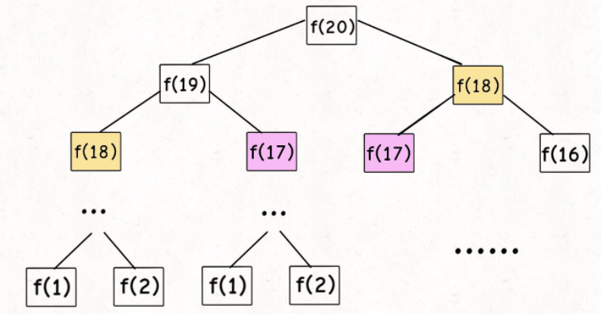
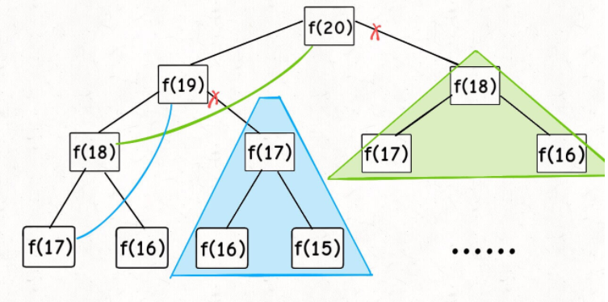
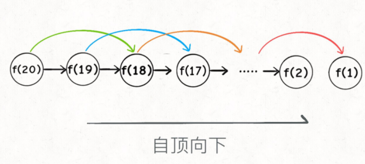
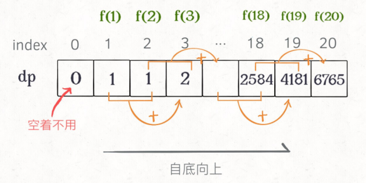
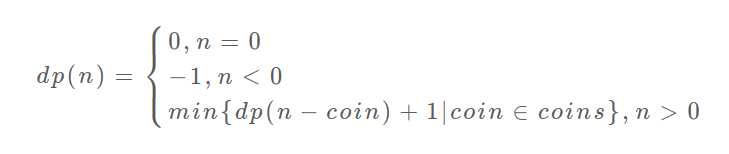
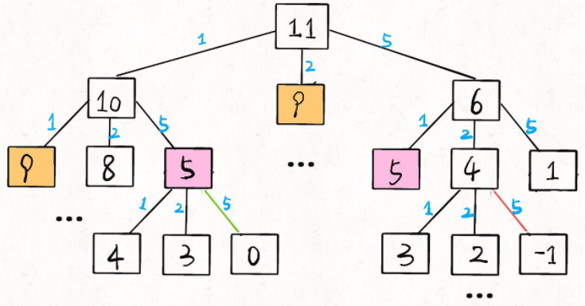
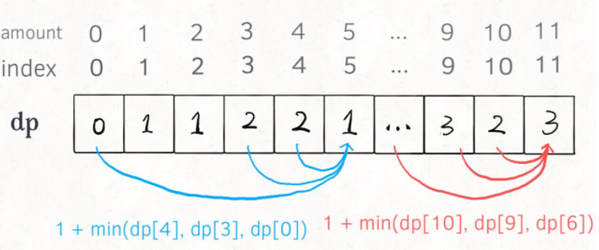

# 1.什么是动态规划？

动态规划（Dynamic Programming，简称DP）是运筹学的一个分支，它是**解决多阶段决策过程最优化的一种数学方法**。**把多阶段问题变为一系列相互联系的单阶段问题，然后逐个加以解决**。

**动态规划问题的一般形式就是求最值，求解动态规划的核心问题是穷举**。因为要求最值，肯定要把所有可行的答案穷举出来，然后在其中找最值，但是动态规划问题存在大量的**重叠子问题**，如果暴力穷举会使效率非常的低下，所以需要**「备忘录」**后者**「DP table」**来优化穷举过程，避免不必要的计算。而且，动态规划问题一定会具备**最优子结构**，才能通过子问题的最值得到原问题的最值。虽然动态规划的核心思想就是穷举求最值，但是问题可以千变万化，穷举所有可行解其实并不是一件容易的事，只有列出正确的**状态转移方程**，才能正确地穷举。

以上提到的**重叠子问题、最优子结构、状态转移方程**就是动态规划三要素。可以通过下面的思维框架来辅助思考出状态转移方程：

**明确 base case -> 明确「状态」-> 明确「选择」 -> 定义 dp 数组/函数的含义**。

按上面的套路走，最后的结果就可以套这个框架：

``` java
// 初始化 base case
dp[0][0][...] = base
// 进行状态转移
for 状态1 in 状态1的所有取值：
    for 状态2 in 状态2的所有取值：
        for ...
            dp[状态1][状态2][...] = 求最值(选择1，选择2...)
```

# 2.斐波那契数列

> **斐波那契数**，通常用 `F(n)` 表示，形成的序列称为 **斐波那契数列** 。该数列由 `0` 和 `1` 开始，后面的每一项数字都是前面两项数字的和。也就是：
>
> ``` java
> F(0) = 0，F(1) = 1
> F(n) = F(n - 1) + F(n - 2)，其中 n > 1
> ```
>
> 给你 `n` ，请计算 `F(n)` 。

## 2.1 暴力解法

斐波那契数列的数学形式就是递归的，写成代码就是这样：

``` java
public int fib(int n) {
    if (n < 0) {
        return 0;
    }
    
    if (n == 1 || n == 2) {
        return 1;
    }
    
    return fib(n - 1) + fib(n - 2);
}
```

这样写代码虽然简洁易懂，但是十分低效，低效在哪里？假设 n = 20，画出递归树如下：



这个递归树怎么理解？就是说想要计算原问题 `f(20)`，我就得先计算出子问题 `f(19)` 和 `f(18)`，然后要计算 `f(19)`，我就要先算出子问题 `f(18)` 和 `f(17)`，以此类推。最后遇到 `f(1)` 或者 `f(2)` 的时候，结果已知，就能直接返回结果，递归树不再向下生长了。

递归算法的时间复杂度怎么计算？就是**用子问题个数乘以解决一个子问题需要的时间**。

首先计算子问题个数，即递归树中节点的总数。显然二叉树节点总数为指数级别，所以子问题个数为 O(2^n)。

然后计算解决一个子问题的时间，在本算法中，没有循环，只有 `f(n - 1) + f(n - 2)` 一个加法操作，时间为 O(1)。

所以，这个算法的时间复杂度为二者相乘，即 O(2^n)，指数级别，爆炸。

观察递归树，很明显发现了算法低效的原因：存在大量重复计算，比如 `f(18)` 被计算了两次，而且你可以看到，以 `f(18)` 为根的这个递归树体量巨大，多算一遍，会耗费巨大的时间。更何况，还不止 `f(18)` 这一个节点被重复计算，所以这个算法及其低效。

这就是动态规划问题的第一个性质：**重叠子问题**。下面，我们想办法解决这个问题。

## 2.2 带备忘录的递归解法

明确了问题，其实就已经把问题解决了一半。即然耗时的原因是重复计算，那么我们可以造一个「备忘录」，每次算出某个子问题的答案后别急着返回，先记到「备忘录」里再返回；每次遇到一个子问题先去「备忘录」里查一查，如果发现之前已经解决过这个问题了，直接把答案拿出来用，不要再耗时去计算了。

一般使用一个数组充当这个「备忘录」，当然你也可以使用哈希表（字典），思想都是一样的。

``` java
public int fib(int n) {
    if (n < 1) {
        return 0;
    }

    // 创建备忘录
    int[] memory = new int[n + 1];
    // 将备忘录初始化为0
    Arrays.fill(memory, 0);

    return fib(n, memory);
}

/**
    * 带备忘录的递归
    */
private int fib(int n, int[] memory) {
    if (n == 1 || n == 2) {
        return 1;
    }

    // 如果备忘录里有，就直接返回
    if (memory[n] != 0) {
        return memory[n];
    }

    // 递归，并将结果记录到备忘录
    memory[n] = fib(n - 1, memory) + fib(n - 2, memory);

    return memory[n];
}
```

画出递归树，你就知道「备忘录」到底做了什么：



实际上，带「备忘录」的递归算法，把一棵存在巨量冗余的递归树通过「剪枝」，改造成了一幅不存在冗余的递归图，极大减少了子问题（即递归图中节点）的个数。



**递归算法的时间复杂度怎么计算？就是用子问题个数乘以解决一个子问题需要的时间。**

子问题个数，即图中节点的总数，由于本算法不存在冗余计算，子问题就是 `f(1)`, `f(2)`, `f(3)` ... `f(20)`，数量和输入规模 n = 20 成正比，所以子问题个数为 O(n)。

解决一个子问题的时间，同上，没有什么循环，时间为 O(1)。

所以，本算法的时间复杂度是 O(n)。比起暴力算法，是降维打击。

至此，带备忘录的递归解法的效率已经和迭代的动态规划解法一样了。实际上，这种解法和迭代的动态规划已经差不多了，只不过这种方法叫做「自顶向下」，动态规划叫做「自底向上」。

啥叫「自顶向下」？注意我们刚才画的递归树（或者说图），是从上向下延伸，都是从一个规模较大的原问题比如说 `f(20)`，向下逐渐分解规模，直到 `f(1)` 和 `f(2)` 这两个 base case，然后逐层返回答案，这就叫「自顶向下」。

啥叫「自底向上」？反过来，我们直接从最底下，最简单，问题规模最小的 `f(1)` 和 `f(2)` 开始往上推，直到推到我们想要的答案 `f(20)`，这就是动态规划的思路，这也是为什么动态规划一般都脱离了递归，而是由循环迭代完成计算。

## 2.3 dp数组的迭代解法

有了上一步「备忘录」的启发，我们可以把这个「备忘录」独立出来成为一张表，就叫做 DP table 吧，在这张表上完成「自底向上」的推算岂不美哉！

``` java
public int fib(int n) {
    if (n < 0) {
        return 0;
    }
    
    if (n == 1 || n == 2) {
        return 1;
    }
    
    int[] dp = new int[n + 1];
    
    // base case
    dp[1] = dp[2] = 1;
    
    for (int i = 3; i <= n; i++) {
        dp[i] = dp[i - 1] + dp[i - 2];
    }
    
    return dp[n];
}
```



画个图就很好理解了，而且你发现这个 DP table 特别像之前那个「剪枝」后的结果，只是反过来算而已。实际上，带备忘录的递归解法中的「备忘录」，最终完成后就是这个 DP table，所以说这两种解法其实是差不多的，大部分情况下，效率也基本相同。

这里，引出「状态转移方程」这个名词，实际上就是描述问题结构的数学形式：


为啥叫「状态转移方程」？其实就是为了听起来高端。你把 `f(n)` 想做一个状态 `n`，这个状态 `n` 是由状态 `n - 1` 和状态 `n - 2` 相加转移而来，这就叫状态转移，仅此而已。

你会发现，上面的几种解法中的所有操作，例如 `return f(n - 1) + f(n - 2)`，`dp[i] = dp[i - 1] + dp[i - 2]`，以及对备忘录或 DP table 的初始化操作，都是围绕这个方程式的不同表现形式。可见列出「状态转移方程」的重要性，它是解决问题的核心。而且很容易发现，其实状态转移方程直接代表着暴力解法。

**千万不要看不起暴力解，动态规划问题最困难的就是写出这个暴力解，即状态转移方程**。只要写出暴力解，优化方法无非是用备忘录或者 DP table，再无奥妙可言。

## 2.4 状态压缩解法

这个例子的最后，讲一个细节优化。细心的读者会发现，根据斐波那契数列的状态转移方程，当前状态只和之前的两个状态有关，其实并不需要那么长的一个 DP table 来存储所有的状态，只要想办法存储之前的两个状态就行了。所以，可以进一步优化，把空间复杂度降为 O(1)：

``` java
public int fib(int n) {
    if (n <= 1) {
        return n;
    }

    int first = 0, second = 1, res = 0;
    for (int i = 2; i <= n; i++) {
        res = first + second;

        first = second;
        second = res;
    }

    return res;
}
```

这个技巧就是所谓的「**状态压缩**」，如果我们发现每次状态转移只需要 DP table 中的一部分，那么可以尝试用状态压缩来缩小 DP table 的大小，只记录必要的数据，上述例子就相当于把DP table 的大小从 `n` 缩小到 2。后续的动态规划章节中我们还会看到这样的例子，一般来说是把一个二维的 DP table 压缩成一维，即把空间复杂度从 O(n^2) 压缩到 O(n)。

# 3.凑零钱问题

> 给定不同面额的硬币 coins 和一个总金额 amount。编写一个函数来计算可以凑成总金额所需的最少的硬币个数。如果没有任何一种硬币组合能组成总金额，返回 -1。
>
> 你可以认为每种硬币的数量是无限的。

## 3.1 暴力解法

首先，这个问题是动态规划问题，因为它具有「最优子结构」的。**要符合「最优子结构」，子问题间必须互相独立**。

啥叫相互独立？比如你想求 `amount = 11` 时的最少硬币数（原问题），如果你知道凑出 `amount = 10` 的最少硬币数（子问题），你只需要把子问题的答案加一（再选一枚面值为 1 的硬币）就是原问题的答案。因为硬币的数量是没有限制的，所以子问题之间没有相互制，是互相独立的。

那么，既然知道了这是个动态规划问题，就要思考**如何列出正确的状态转移方程**？

1、**确定 base case**，这个很简单，显然目标金额 `amount` 为 0 时算法返回 0，因为不需要任何硬币就已经凑出目标金额了。

2、**确定「状态」，也就是原问题和子问题中会变化的变量**。由于硬币数量无限，硬币的面额也是题目给定的，只有目标金额会不断地向 base case 靠近，所以唯一的「状态」就是目标金额 `amount`。

3、**确定「选择」，也就是导致「状态」产生变化的行为**。目标金额为什么变化呢，因为你在选择硬币，你每选择一枚硬币，就相当于减少了目标金额。所以说所有硬币的面值，就是你的「选择」。

4、**明确** **`dp`** **函数/数组的定义**。我们这里讲的是自顶向下的解法，所以会有一个递归的 `dp` 函数，一般来说函数的参数就是状态转移中会变化的量，也就是上面说到的「状态」；函数的返回值就是题目要求我们计算的量。就本题来说，状态只有一个，即「目标金额」，题目要求我们计算凑出目标金额所需的最少硬币数量。所以我们可以这样定义 `dp` 函数：

`dp(n)` 的定义：输入一个目标金额 `n`，返回凑出目标金额 `n` 的最少硬币数量。

搞清楚上面这几个关键点，基本上就可以把代码写出来了：

``` java
/**
 * dp(n)函数
 * 输入一个目标金额 n ，返回凑出目标金额 n 的最少硬币数量
 */
public int coinChange(int[] coins, int amount) {    
    // base case
    if (amount == 0) {
        return 0;
    }
    
    // 求最小值，所以初始化为正无穷
    int res = Integer.MAX_VALUE;
	// 做选择，选择需要硬币最少的那个结果
    for (int coin : coins) {
        if (amount < coin) {
            continue ;
        }
        
        res = Math.min(res, coinChange(coins, amount - coin) + 1);
    }
    
    return res == Integer.MAX_VALUE ? -1 : res;
}
```

至此，状态转移方程其实已经完成了，以上算法已经是暴力解法了，以上代码的数学形式就是状态转移方程：



至此，这个问题其实就解决了，只不过需要消除一下重叠子问题，比如 `amount = 11, coins = {1,2,5}` 时画出递归树看看：



递归算法的时间复杂度分析：**子问题总数 x 每个子问题的时间**。

子问题总数为递归树节点个数，这个比较难看出来，是 O(n^k)，总之是指数级别的。每个子问题中含有一个 for 循环，复杂度为 O(k)。所以总时间复杂度为 O(k * n^k)，指数级别。

## 3.2 带备忘录的递归解法

只需要对暴力解法稍加修改，加上备忘录，就可以通过备忘录消除子问题：

``` java
/**
 * dp(n)函数
 * 输入一个目标金额 n ，返回凑出目标金额 n 的最少硬币数量
 */
public int coinChange(int[] coins, int amount) {    
    Map<Integer, Integer> memory = new HashMap<>();
    
    return coinChange(coins, amount, memory);
}

public int coinChange(int[] coins, int amount, Map<Integer, Integer> memory) { 
    // base case
    if (amount == 0) {
        return 0;
    }
    
    // 如果备忘录里有，就直接返回
    if (memory.containsKey(amount)) {   
        return memory.get(amount);
    }
    
    // 求最小值，所以初始化为正无穷
    int res = Integer.MAX_VALUE;
	// 做选择，选择需要硬币最少的那个结果
    for (int coin : coins) {
        if (amount < coin) {
            continue ;
        }
        
        res = Math.min(res, coinChange(coins, amount - coin, memory) + 1);
    }
    
    // 将结果记录到备忘录
	memory.put(amount, res == Integer.MAX_VALUE ? -1 : res);
    
    return memory.get(amount);
}
```

## 3.3 dp数组的迭代解法

我们也可以自底向上使用 dp table 来消除重叠子问题，关于「状态」「选择」和 base case 与之前没有区别，`dp` 数组的定义和刚才 `dp` 函数类似，也是把「状态」，也就是目标金额作为变量。不过 `dp` 函数体现在函数参数，而 `dp` 数组体现在数组索引：

**`dp`** **数组的定义：当目标金额为** **`i`** **时，至少需要** **`dp[i]`** **枚硬币凑出**。

根据我们文章开头给出的动态规划代码框架可以写出如下解法：

``` java
public int coinChange(int[] coins, int amount) {
    int[] dp = new int[amount + 1];

    // 数组大小为 amount + 1，初始值也为 amount + 1
    // 因为凑成 amount 金额的硬币数最多只可能等于 amount（全用 1 元面值的硬币）
    // 所以初始化为 amount + 1 就相当于初始化为正无穷，便于后续取最小值
    Arrays.fill(dp, amount + 1);
    // base case
    dp[0] = 0;

    // 外层 for 循环在遍历所有状态的所有取值
    for (int i = 1; i <= amount; i++) {
        // 内层 for 循环在求所有选择的最小值
        for (int coin : coins) {
            // 无解子问题，跳过
            if (i < coin) {
                continue ;
            }

            dp[i] = Math.min(dp[i], dp[i - coin] + 1);
        }
    }

    return dp[amount] == amount + 1 ? -1 : dp[amount];
}
```



# 4.总结

先阐述了什么是动态规划，动态规划（Dynamic Programming，简称DP）是运筹学的一个分支，它是**解决多阶段决策过程最优化的一种数学方法**。**把多阶段问题变为一系列相互联系的单阶段问题，然后逐个加以解决**。

然后通过斐波那契数列的问题，解释了如何通过「备忘录」或者「dp table」的方法来优化递归树，并且明确了这两种方法本质上是一样的，只是自顶向下和自底向上的不同而已。

再通过凑零钱的问题，展示了如何流程化确定「状态转移方程」，只要通过状态转移方程写出暴力递归解，剩下的也就是优化递归树，消除重叠子问题而已。

**计算机解决问题其实没有任何奇技淫巧，它唯一的解决办法就是穷举**，穷举所有可能性。算法设计无非就是先思考“如何穷举”，然后再追求“如何聪明地穷举”。

列出动态转移方程，就是在解决“如何穷举”的问题。之所以说它难，一是因为很多穷举需要递归实现，二是因为有的问题本身的解空间复杂，不那么容易穷举完整。

备忘录、DP table 就是在追求“如何聪明地穷举”。用空间换时间的思路，是降低时间复杂度的不二法门。