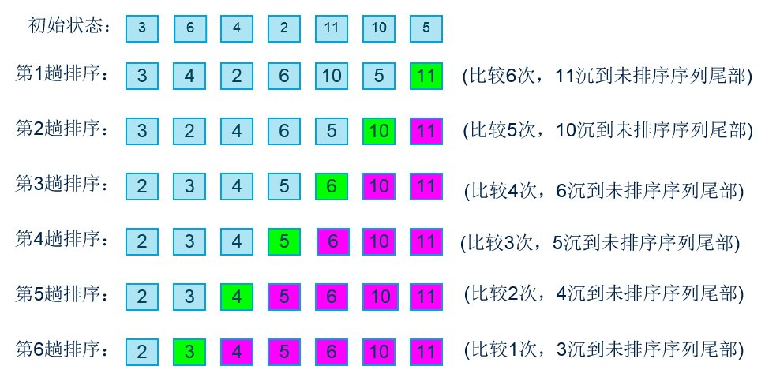

# 冒泡排序

## 1.基本原理

冒泡排序（Bubble Sort）是一种简单的排序算法，从无序的数组或者链表第一个元素开始遍历，两两相近的元素进行比较，根据预定的排序规则（升序或降序）交换两个元素的位置，以此类推，直到最后将最大（小）的数据元素交换到了无序数组或者链表的最后一个位置，从而成为有序序列的一部分；下一次继续这个过程，直到所有数据元素都排好序。算法的核心在于每次通过两两比较交换位置，选出剩余无序序列里最大（小）的数据元素放到队尾。

时间复杂度：O（n^2）

## 2.基本流程（升序）

①比较相邻的元素，如果第一个比第二个大，就交换两个元素的位置；

②对每一对相邻元素作同样的工作，从开始第一对到结尾的最后一对。这步做完后，最后的元素会是最大的数；

③针对所有的元素重复以上的步骤，除了最后已经选出的元素（有序）；

④持续每次对越来越少的元素（无序元素）重复上面的步骤，直到没有任何一对数字需要比较，则序列最终有序。

## 3.流程演示


## 4.算法实现（升序）

``` C++
class Bubble:
    def bubbleSort(self, nums):
        for i in range(len(nums) - 1):
            for j in range(len(nums) - i - 1):
                if (nums[j] > nums[j + 1]):
                    temp = nums[j]
                    nums[j] = nums[j + 1]
                    nums[j + 1] = temp
 
        return nums
```

## 5.算法优化

加个标识变量用于记录每趟冒泡排序是否发生过数据元素的位置交换，如果没有发生交换，说明序列已经有序了，不必继续进行下去了。

``` C++
class Bubble:
    def bubbleSort(self, nums):
        for i in range(len(nums) - 1):
            flag = True
            for j in range(len(nums) - i - 1):
                if (nums[j] > nums[j + 1]):
                    temp = nums[j]
                    nums[j] = nums[j + 1]
                    nums[j + 1] = temp
                    flag = False
            if flag:
                break
 
        return nums
```