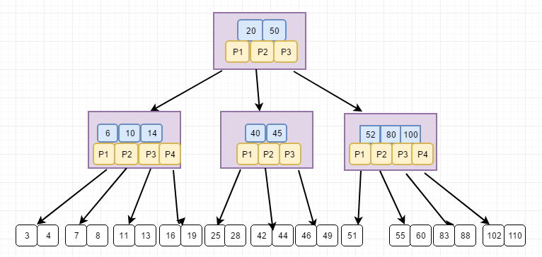
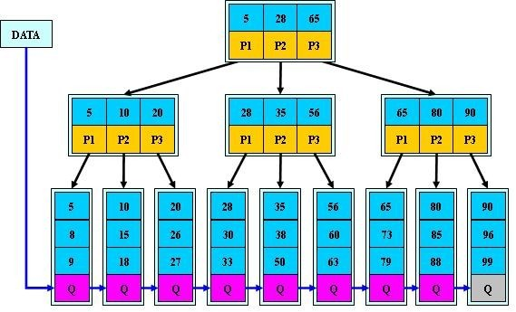

# B/B+树/B*树

描述一颗 B 树时需要指定它的阶数，**阶数** 表示此树的结点 **最多** 有 **多少个孩子结点（子树）**，一般用字母 M 表示阶数。

## 1.B树

### 1.1 为什么需要B树

在大规模数据存储中，需要用到索引来加快数据查找，当数据非常之大的时候，采用二叉查找树、二叉查找平衡树、红黑树，在内部元素结点个数有限的情况下，会导致树非常高，导致磁盘查找频繁，查询效率低下。因此需要降低树的深度，多叉树就是一个降低深度的想法。B树是一颗能够降低高度的树。

### 1.2 什么是B树

B 树也就是 B-Tree，也叫 B- 树。可以用阶数 m 来定义一颗 B 树的阶数，B 树的定义：

1. 每个结点至多 m 颗子树；
2. 除非 B 树只包含一个根节点，否则根节点有 `[2, m]` 颗子树；
3. 非根结点包含 `[m/2, m]` 颗子树；
4. 叶子结点在同一层，不包含任何信息；
5. 有 `j` 个孩子的非叶节点包含 `j-1` 个关键字 K，并且按照递增排序 `K[1] < K[2] < ... < K[j-1]`；
6. 非叶子结点的指针：`P[1], P[2], …, P[M]`；其中 `P[1]` 指向关键字小于 `K[1]` 的子树，`P[M]` 指向关键字大于 `K[M-1]` 的子树，其它 `P[i]` 指向关键字属于 `(K[i-1], K[i])` 的子树。

4 阶的 B 树如下图所示：

### 1.3 B树高度

因为根至少有两个孩子，因此第 `2` 层至少有两个结点；

除根和叶子外，其它结点至少有  `m / 2` 个孩子；

因此在第 `3` 层至少有 `2 * m / 2` 个结点；

在第 `4` 层至少有 `2 * ((m / 2) ^ 2)` 个结点；

在第 `i` 层至少有 `2 * ((m / 2) ^ (l - 2))` 个结点，于是有：`N + 1 ≥ 2 * ((m / 2) ^ (i - 2))`；

考虑第 `L` 层的结点个数为 `N+1`，那么 `2 * ((m / 2) ^ (i - 2)) ≤ N + 1`，也就是 `L` 层的最少结点数刚好达到 `N+1` 个，即：`L ≤ log(m / 2 * ((N + 1) / 2 ) + 2`；

 一棵含有 N 个总关键字数的 m 阶的 B 树的最大高度是多少?答曰：`log_ceil（m/2）(N+1)/2 + 1`。

## 2.B+树

### 2.1 特点

1. 叶子结点包含所有关键信息，非叶子结点作为索引；
2. 所有的非叶子结点可以看成是索引部分，结点中仅含有其子树根结点中最大（或最小）关键字；
3. 含有 `[m/2, m]` 颗子树；
4. 根结点含有 `[2, m]` 颗子树；
5. 有 `j` 个孩子的非叶节点包含 `j` 个关键字 K，并且按照递增排序 `K[1] < K[2] < ... < K[j-1] < K[j]`；
6. 非叶子结点的指针：`P[1], P[2], …, P[M]`；其中 `P[i]` 指向关键字大于等于 `K[i]` 的子树。

3 阶 B+ 树如下图所示：

### 2.2 B+树的优势

1. 查询效率稳定，每次查询都要访问到叶子结点，因此查询速度取决于树的高度；
2. 叶子结点形成链表，便于区间查找；
3. 磁盘代价更低：B+ 树的非叶结点只存放索引，不含有关键信息，所以一个结点的存储数据更多，减少磁盘的访问。

### 2.3 使用场景

Mysql 数据库索引

