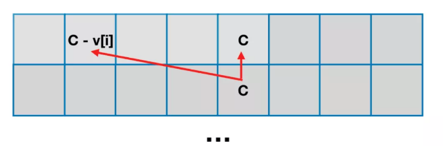

**「背包问题」**（Knapsack problem）是一种组合优化的 NP 完全问题。问题可以描述为：**给定一组物品，每种物品都有自己的重量和价格，在限定的总重量内，我们如何选择，才能使得物品的总价格最高**。问题的名称来源于如何选择最合适的物品放置于给定背包中。

相似问题经常出现在商业、组合数学，计算复杂性理论、密码学和应用数学等领域中。也可以将背包问题描述为决定性问题，即在总重量不超过 W 的前提下，总价值是否能达到 V。

通俗的讲，**「背包问题」**大概是对应这样的一类问题：泛指一类**给定价值与成本**，同时**限定决策规则**，在这样的条件下，如何**实现价值最大化的问题**。

# 1.01 背包

**「01 背包」**是指给定物品价值与体积（对应了「给定价值与成本」），在规定容量下（对应了「限定决策规则」）如何使得所选物品的总价值最大。

## 1.1 题目描述

有 N 件物品和一个容量是 V 的背包。每件物品有且只有一件。

第 i 件物品的体积是 v[i]，价值是 w[i]。

求解将哪些物品装入背包，可使这些物品的总体积不超过背包容量，且总价值最大。

示例1：

> 输入: N = 3, V = 4, v = [4,2,3], w = [4,2,3]
> 输出: 4
> 解释: 只选第一件物品，可使价值最大。

示例2：

> 输入: N = 3, V = 5, v = [4,2,3], w = [4,2,3]
> 输出: 5
> 解释: 不选第一件物品，选择第二件和第三件物品，可使价值最大。

## 1.2 递归解法

可以通过递归的方式来解决这个问题，从 N 个物品中选出体积刚好是 C 的物品，然后从中选出一个价值最大的组合，具体实现如下：

``` java
class Solution {

    /**
     *
     * @param N 物品的数量
     * @param C 背包的总容量
     * @param v 物品的体积
     * @param w 物品的价值
     * @return
     */
    public int maxValue(int N, int C, int[] v, int[] w) {
        return helper(C, 0, v, w);
    }

    /**
     * 通过递归的方式求解背包问题
     * @param left 背包剩余容量
     * @param i 当前选择到第几个物品
     * @param v 物品的体积
     * @param w 物品的价值
     * @return
     */
    private int helper(int left, int i, int[] v, int[] w) {
        if (i == v.length) {
            return 0;
        }

        if (left - w[i] >= 0) {
            // 不选择第 i 件物品
            int notChoose = helper(left, i + 1, v, w);
            // 选择第 i 件物品
            int choose = helper(left - v[i], i + 1, v, w) + w[i];

            // 取两者的最大值
            return Math.max(notChoose, choose);
        } else {
            // 当前剩余容量不够用来装第 i 件物品，则不能选第 i 件物品
            return helper(left, i + 1, v, w);
        }
    }
}
```

上述代码虽然可以解决问题，但是会有很多重复子问题的情况，所以在数据量大一些的时候，可能会超时。

## 1.3  dp\[N\]\[C+1\]  解法

首先可以抽象出一个 dp 数组（`dp[N][C+1]`）：**一个二维数组，其中一维代表当前「当前枚举到哪件物品」，另外一维「现在的剩余容量」，数组装的是「最大价值」。**

而 dp 数组状态定义：**考虑前 i 件物品，使用容量不超过 C 的条件下的背包最大价值。**

对于第 i 件物品来说：

- **如果当前剩余背包容器 c 大于等于第 i 件物品的体积，那么可以考虑「选」第 i 件物品，也可以「不选」两种决策；**
- **如果当前背包剩余容器 c 小于第 i 件物品的体积，那就无法选择第 i 件物品，即「不选」**。

两种决策的**最大价值**可以确定为：

- **「不选」**：就只考虑前 `i - 1` 件物品，在当前容量为 c 的情况下的最大价值，所以就是 `dp[i - 1][c]`；
- **「选」**：选第 i 件物品的话，表示使用了 `v[i]` 的背包容量，获取了 `w[i]` 的价值，那么留给前 i - 1 件物品的容量就变成了 `c - v[i]`，那么此时的最大价值为 `dp[i - 1][c - v[i]] + w[i]`。

那么「状态转移方程」可以定义为：

``` java
dp[i][c] = Math.max(dp[i - 1][c], dp[i - 1][c - v[i]] + w[i]);
```

代码实现如下：

``` java
class Solution {

    /**
     *
     * @param N 物品的数量
     * @param C 背包的总容量
     * @param v 物品的体积
     * @param w 物品的价值
     * @return
     */
    public int maxValue(int N, int C, int[] v, int[] w) {
        // 一维代表当前「当前枚举到哪件物品」
        // 另外一维「现在的剩余容量」
        // 数组装的是「最大价值」
        int[][] dp = new int[N][C + 1];
        // 先初始化处理第一件物品的情况
        for (int i = 0; i <= C; i++) {
            if (i >= v[0]) {
                // 表示当背包剩余容量大于第一个物品的体积时
                // 选择第一个物品肯定能获得最大的价值
                dp[0][i] = w[0];
            }
        }

        // 接下来处理剩下的物品
        for (int i = 1; i < N; i++) {
            for (int j = 0; j <= C; j++) {
                // 不选第 i 个物品
                dp[i][j] = dp[i - 1][j];

                // 当剩余容量大于等于第 i 个物品时
                // 选择第 i 个物品
                if (j >= v[i]) {
                    // 当前最大价值就要取两者中的最大值
                    dp[i][j] = Math.max(dp[i - 1][j], dp[i - 1][j - v[i]] + w[i]);
                }
            }
        }

        return dp[N - 1][C];
    }
}
```

- 时间复杂度：共有 `N * C `个状态需要被转移，复杂度为 `O(N * C)`；
- 空间复杂度：`O(N * C)`。

## 1.4 dp\[2\]\[C + 1\] 解法

根据「状态转移方程」，在计算第 i 行格子只需要第 `i - 1` 行中的某些值；也就是计算「某一行」的时候只需要依赖「前一行」。

因此可以用一个只有两行的数组来存储中间结果，根据当前计算的行号是偶数还是奇数来交替使用第 0 行和第 1 行。这样的空间优化方法称为「滚动数组」，只需要将代表行的维度修改成 2，并将所有使用行维度的地方从 i 改成 `i % 2` 或者 即可（更建议使用`i & 1`，& 运算在不同 CPU 架构的机器上要比 % 运算稳定）。

代码实现如下：

``` java
class Solution {

    /**
     *
     * @param N 物品的数量
     * @param C 背包的总容量
     * @param v 物品的体积
     * @param w 物品的价值
     * @return
     */
    public int maxValue(int N, int C, int[] v, int[] w) {
        // 一维代表当前「当前枚举到哪件物品」
        // 另外一维「现在的剩余容量」
        // 数组装的是「最大价值」
        int[][] dp = new int[2][C + 1];
        // 先初始化处理第一件物品的情况
        for (int i = 0; i <= C; i++) {
            if (i >= v[0]) {
                // 表示当背包剩余容量大于第一个物品的体积时
                // 选择第一个物品肯定能获得最大的价值
                dp[0][i] = w[0];
            }
        }

        // 接下来处理剩下的物品
        for (int i = 1; i < N; i++) {
            for (int j = 0; j <= C; j++) {
                // 不选第 i 个物品
                dp[i & 1][j] = dp[(i - 1) & 1][j];

                // 当剩余容量大于等于第 i 个物品时
                // 选择第 i 个物品
                if (j >= v[i]) {
                    // 当前最大价值就要取两者中的最大值
                    dp[i & 1][j] = Math.max(dp[(i - 1) & 1][j], dp[(i - 1) & 1][j - v[i]] + w[i]);
                }
            }
        }

        return dp[(N - 1) & 1][C];
    }
}
```

- 时间复杂度：共有 `N * C `个状态需要被转移，复杂度为 `O(N * C)`；
- 空间复杂度：`O(C)`。

## 1.5 dp[C + 1] 解法

事实上，还可以继续进行空间优化，只保留代表「剩余容量」的维度。

再次观察「状态转移方程」：

``` java
dp[i][c] = Math.max(dp[i - 1][c], dp[i - 1][c - v[i]] + w[i]);
```

可以看出，当求解第 i 行的数据的时候，不仅只是依赖于第 `i - 1` 行的数据，还只是依赖于第 `i - 1` 行数据的第 c 列和第 `c - v[i]` 列的数据，已经包含了第 i 件物品「选」和「不选」两种决策。

换句话说，当求解第 i 行的数据的时候，只依赖于「上一个格子的位置」以及「上一个格子的左边位置」，具体表现如下图所示：



因为只会用到上一行数据的左边的数据，所以可以从右边开始求解，也就是把求解顺序「从 0 到 c」改为「从 c 到 0」，就可以将原本 2 行的二维数组压缩成一行的一维数组。

这样做的空间复杂度和「滚动数组」优化的空间复杂度是一样的。但仍然具有意义，而且这样的「一维空间」优化，是求解其他背包问题的基础。

代码实现如下：

``` java
class Solution {

    /**
     *
     * @param N 物品的数量
     * @param C 背包的总容量
     * @param v 物品的体积
     * @param w 物品的价值
     * @return
     */
    public int maxValue(int N, int C, int[] v, int[] w) {
        // 代表「现在的剩余容量」
        // 数组装的是「最大价值」
        int[] dp = new int[C + 1];

        for (int i = 0; i < N; i++) {
            for (int j = C; j >= v[i]; j--) {
                // 这里在「选」和「不选」中取最大值
                dp[j] = Math.max(dp[j], dp[j - v[i]] + w[i]);
            }
        }

        return dp[C];
    }
}
```

- 时间复杂度：共有 `N * C `个状态需要被转移，复杂度为 `O(N * C)`；
- 空间复杂度：`O(C)`。

## 1.6 总结

**「01 背包」**讲解了从「递归解法」优化到「滚动数组解法」，再优化到「一维空间优化解法」。**「01背包」问题是众多背包问题中的核心，理解「一维空间优化解法」十分重要。**

其他背包问题在一定程度上都能转化成**「01背包」**来进行求解，或是根据**「01背包」**的转移方程来稍作修改进行求解。

