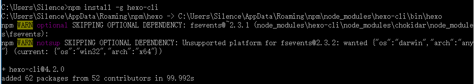

# 1.什么是 HEXO


Hexo 是一款基于 Node.js 的静态博客框架，依赖少易于安装使用，可以方便的生成静态网页托管在 GitHub 和 Heroku 上，是搭建博客的首选框架。Hexo 同时也是 GitHub上 的开源项目，参见：[hexojs/hexo](https://github.com/hexojs/hexo) 如果想要更加全面的了解 Hexo，可以到其官网 [Hexo](https://link.zhihu.com/?target=https%3A//hexo.io/) 了解更多的细节，因为 Hexo 的创建者是台湾人，对中文的支持很友好，可以选择中文进行查看。

# 2.在本地搭建 HEXO

系统：Windows 10，64-bit

## 2.1 安装 Node.js 环境

### 2.1.1 下载 Node.js

地址：https://nodejs.org/en/download/

根据系统类型下载对应的按照包，我这边是 64 位的，所以直接下载 64-bit 的安装包


### 2.1.2 安装 Node.js

打开安装包，然后按提示一直点 “Next”，直到 “Finish”


用安装包安装的 Node 环境，会自动配置环境变量，所以这个时候只要打开控制台，输入 `node -v` 查看 Node.js 版本，如果出现下面的信息，说明安装成功：


## 2.2 安装 Hexo 框架

Node.js 安装成功后，同时会自动安装一个包管理器，称为 npm（Node Package Manager）。

> 什么是 npm？
> npm 是一个包管理器，发布者将自己的代码发布（npm publish）到代码仓库（registry），使用者将自己需要的包写入 **package.json** 文件中，到代码仓库中把代码下载（npm install）下来。

安装 Hexo：`npm install -g hexo-cli`



查看 Hexo 版本：`hexo -v`


## 2.2 本地使用

Hexo 常用命令

``` shell
# 新建一个网站，如果没有设置 folder，Hexo 默认在目前的文件夹建立网站。
hexo init [folder]

# 新建一篇文章。如果没有设置 layout 的话，默认使用 _config.yml 中的 default_layout 参数代替。如果标题包含空格的话，请使用引号括起来。
hexo new [layout] <title>

# 发表草稿
hexo publish [layout] <filename>

# 生成静态文件。该命令可以简写为 hexo g
hexo generate

# 启动服务器。默认情况下，访问网址为： http://localhost:4000/。该命令可以简写为 hexo s
hexo server

# 部署网站。该命令可以简写为 hexo d
hexo deploy
```


### 2.2.1 创建目录

Hexo 的所有文章都是以文件的形式存储在目录下的，所以首先需要新建一个目录（**目录最好不要有中文**，我这里创建的是 `hexo_blog`）。

### 2.2.2 初始化 Hexo

进入创建的目录 `hexo_blog`，执行初始化命令：`hexo init`


### 2.2.3 生成静态页面

命令：`hexo g`


### 2.2.4 启动 Hexo 服务

命令：`hexo s`，可以通过 `http://localhost:4000` 访问本地启动的博客


## 2.3 安装主题

本次安装的是 snippet 主题

1.从 GitHub 上克隆主题到本地

``` shell
git clone git://github.com/shenliyang/hexo-theme-snippet.git themes/hexo-theme-snippet
```

2.安装主题插件

因为 **hexo-theme-snippet** 使用了 `ejs` 模版引擎 、 `Less` CSS预编译语言以及在官方插件的基础上进行功能的开发，以下为必装插件：

```
npm i hexo-renderer-ejs hexo-renderer-less hexo-deployer-git -S
```

## 2.4 部署主题

> 如果没有更改过主题源文件，也不需要代码优化可以跳过 1，2，3 步骤

1.gulp 打包构建，拷贝主题目录下 `package.json` 文件到 Hexo 根目录下，然后安装项目的开发依赖。 [Gulp入门指南](http://www.gulpjs.com.cn/docs/getting-started/)

```
npm i   //安装项目依赖
```

2.在 Hexo 根目录下创建一个名为 gulpfile.js 的文件：

```
require('./themes/hexo-theme-snippet/gulpfile');
```

3.运行 gulp：

```
gulp 或者 gulp default   //执行打包任务
```

4.清空 hexo 静态文件和缓存，并重新生成

```
hexo clean && hexo g  //清空缓存并生成静态文件
```

5.本地预览，确没有问题再进行发布

```
hexo s -p 4000 或者 hexo s  //启动本地服务默认
```


