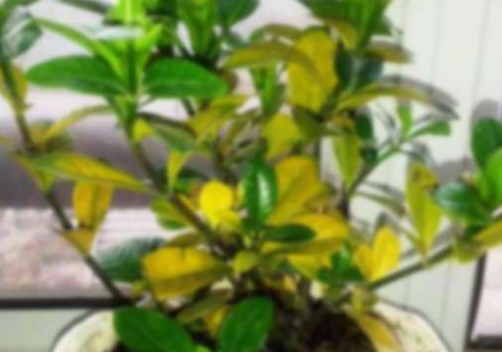
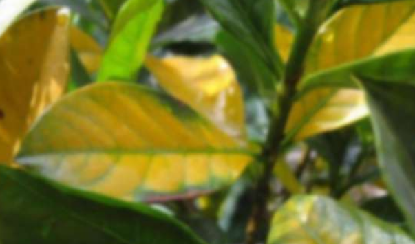
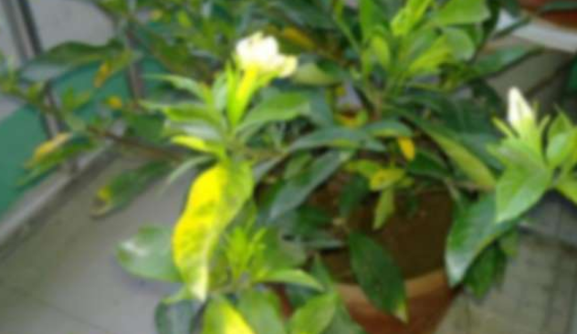

# 1.栀子花

## 1.1 栀子花为什么叶子发黄

### 1.1.1 浇水原因

1、浇水过少,长时间不给栀子花浇水，因缺水原因会造成栀子花叶子发黄。一般表现为叶梢或边缘发枯、发干，老叶自下而上枯黄脱落，但新叶生长比较正常。救治方法:浇水时注意要浇透水。

2、浇水过多,这种情比较多见，一种是新入后大水造成的老叶黄。新购进的栀子，底部黄叶，叶脉仍绿，边缘泛黄，很多都是换环境造成的。摘除黄叶，等新叶长出即可。再一种是嫩叶暗黄且无光泽，老叶无明显变化，枝干细小黄绿，新梢萎缩不长，表明浇水过多。解决办法:将栀子花脱盆置于通风阴凉自吹干土团后再装回盆中。

### 1.1.2 施肥原因

1、施肥过多，就是由于施肥时过量或过浓导致的栀子花叶子发黄，一般症状为：叶脉失绿变黄，而周边却依然绿着.还有就是施肥后叶片突然整体失绿变干变黄，这些都是因肥大肥浓所引起的肥黄。

救治方法 :用大水灌根和脱盆洗根。

2、缺少肥料，黄叶表现在嫩叶颜色变淡，呈黄或淡绿色，而老叶比较正常或逐渐由绿转黄。救治方法:检查盆土，如有干结现象应换土，平时薄肥勤施并适时浇一些矾水，一般问题可解决 。

## 1.2 栀子花养殖技巧

栀子花，夏季应避免阳光直射，适宜在稍蔽荫处生活，强烈阳光直射会造成花卉叶梢、叶缘发枯，叶片朝阳部分出现黄斑。但是长时间置于荫蔽环境处，会使叶片得不到足够阳光，不能形成叶绿素，整株叶片变黄继而脱落。

